# ABSTRACT

神经网络吸收信息的能力受其参数数量的限制。条件计算，即网络的一部分在每个例子的基础上是活跃的，在理论上已经被提出作为一种在不增加计算量的情况下显著增加模型容量的方法。在现代GPU集群上实现了超过1000倍的模型容量改进，而计算效率只有很小的损失。（模型很大，能力很强，不需要很大的计算，内存呢？限制大模型的主要是内存而不是计算，通过并行来解决内存，通信成为限制）We present model architectures in which a MoE with up to 137 billion parameters is applied convolutionally between stacked LSTM layers.（？）这些模型以更低的计算成本获得了比最先进的更好的结果。

#  INTRODUCTION AND RELATED WORK

## CONDITIONAL COMPUTATION

利用训练数据和模型大小的规模是深度学习成功的关键。当数据集足够大时，增加神经网络的容量(参数数量)可以提供更好的预测精度。对于典型的深度学习模型，在每个例子都激活整个模型的情况下，随着模型大小和训练样本数量的增加，这将导致训练成本的大约二次增长。不幸的是，计算能力和分布式计算的进步无法满足这种需求。

已经提出了各种形式的条件计算，作为在不增加计算成本的情况下增加模型容量的方法(Davis & Arel, 2013;Bengio et al, 2013;Eigen et al .， 2013;Ludovic Denoyer, 2014;Cho & Bengio, 2014;Bengio et al, 2015;Almahairi et al, 2015)。在这些方案中，网络的大部分在每个示例的基础上是活动的或不活动的。门控决策可以是二元的或稀疏的，连续的，随机的或确定的。

虽然这些想法在理论上很有希望，但迄今为止还没有工作证明在模型能力、训练时间或模型质量方面有巨大的改进。我们将此归咎于以下挑战:

Modern computing devices, especially GPUs, are much faster at arithmetic than at branching. Most of the works above recognize this and propose turning on/off large chunks of the
network with each gating decision.

大批处理大小对性能至关重要，因为它们分摊了参数传输和更新的成本。条件计算减少了网络中有条件活动块的批大小。

网络带宽可能成为瓶颈。gpu集群的计算能力可能是设备间网络带宽总和的数千倍。为了提高计算效率，算法的相对计算与网络需求必须超过这个比率。嵌入层可以被看作是条件计算的一种形式，它受到这个问题的限制。由于嵌入通常需要通过网络发送，因此(例如，参数)交互的数量受到网络带宽而不是计算能力的限制。

Depending on the scheme, loss terms may be necessary to achieve the desired level of sparsity per-chunk and/or per example. Bengio et al. (2015) use three such terms. These issues can affect both model quality and load-balancing.（？）

对于非常大的数据集，模型容量是最关键的。现有关于条件计算的文献处理相对较小的图像识别数据集，最多包含60万张图像。很难想象这些图像的标签提供了足够的信号来充分训练具有数百万个参数的模型，更不用说数十亿个参数了。

##  OUR APPROACH: THE SPARSELY-GATED MIXTURE-OF-EXPERTS LAYER

我们的条件计算方法是引入一种新型的通用神经网络组件:稀疏门控混合专家层(MoE)。The MoE consists of a number of experts, each a simple feed-forward neural network, and a trainable gating network which selects a sparse combination of the experts to process each input (see Figure 1). All parts of the network are trained jointly by back-propagation.

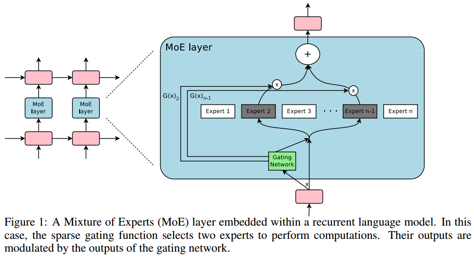

The MoE is called once for each position in the text(和RNN一样）, selecting a potentially different combination
of experts at each position.(不同token的专家可能不同) The different experts tend to become highly specialized based on syntax
and semantics (see Appendix E Table 9). 

##  RELATED WORK ON MIXTURES OF EXPERTS

The works above concern top-level mixtures of experts. The mixture of experts is the whole model.（整个模型是由专家混合形成）
Eigen et al. (2013) introduce the idea of using multiple MoEs with their own gating networks as（使用多个专家混合层作为模型的部分）
parts of a deep model. It is intuitive that the latter approach is more powerful, since complex problems may contain many sub-problems each requiring different experts.（每个子问题都需要moe) They also allude in their conclusion to the potential to introduce sparsity, turning MoEs into a vehicle for computational
computation.

虽然Eigen等人(2013)使用两个堆叠的MoE允许两组门控决策，但我们对MoE的卷积应用允许在文本中的每个位置进行不同的门控决策。我们还实现了稀疏门控，并演示了它作为大规模增加模型容量的实用方法的使用

#  THE STRUCTURE OF THE MIXTURE-OF-EXPERTS LAYER

The Mixture-of-Experts (MoE) layer consists of a set of n “expert networks" E1; · · · ; En, and a
“gating network" G whose output is a sparse n-dimensional vector.

虽然原则上我们只要求专家接受相同大小的输入并产生相同大小的输出，但在本文的初步调查中，我们将自己限制在模型是具有相同架构的前馈网络的情况下，但具有单独的参数。

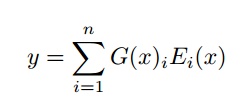

基于G(x)输出的稀疏性，我们节省了计算。当G(x)i = 0时，我们不需要计算Ei(x). If the number of experts is very large, we can reduce the
branching factor by using a two-level hierarchical MoE. In a hierarchical MoE, a primary gating
network chooses a sparse weighted combination of “experts", each of which is itself a secondary
mixture-of-experts with its own gating network. 

## GATING NETWORK

A simple choice of non-sparse gating function (Jordan & Jacobs, 1994) is to
multiply the input by a trainable weight matrix Wg and then apply the Sof tmax function.

我们在Softmax门控网络中添加了两个组件:稀疏性和噪声。

在使用softmax函数之前，我们添加可调高斯噪声，然后只保留前k个值，将其余值设置为负无穷(这导致相应的门值等于0)。稀疏性有助于节省计算，如上所述。虽然这种形式的稀疏性在门控函数的输出中产生了一些理论上可怕的不连续，但我们还没有在实践中观察到这是一个问题。噪声项有助于负载平衡，将在附录a中讨论。每个组件的噪声量由第二个可训练的权重矩阵Wnoise控制。(Softplus函数可以看作是ReLU函数的平滑。)（这个x应该是行向量，乘法后行做softmax)(standardnormal是干嘛？)

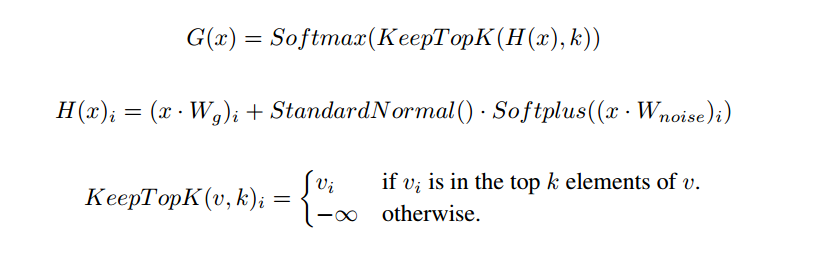

我们通过简单的反向传播来训练门控网络，以及模型的其余部分。如果我们选择k > 1，那么前k个专家的门值相对于门网络的权值具有非零导数。梯度也通过门控网络反向传播到它的输入。

# ADDRESSING PERFORMANCE CHALLENGES

## THE SHRINKING BATCH PROBLEM

在现代的cpu和gpu上，为了提高计算效率，为了分摊参数加载和更新的开销，大量的批处理是必要的。If the gating network chooses k out of
n experts for each example, then for a batch of b examples, each expert receives a much smaller
batch of approximately kb/n << b examples.随着专家数量的增加，这将导致朴素的MoE实现变得非常低效。解决这个缩小批量问题的方法是使原始批量尺寸尽可能大。然而，批处理大小往往受到在向前传递和向后传递之间存储激活所需的内存的限制。我们建议采用以下技术来增加批量大小:

混合数据并行性和模型并行性:在传统的分布式训练设置中，不同设备上的多个模型副本异步处理不同批次的数据，参数通过一组参数服务器同步。(数据并行）在我们的技术中，这些不同的批同步运行，以便它们可以在MoE层中组合起来。We distribute the
standard layers of the model and the gating network according to conventional data-parallel schemes,（复制普通层和门控）
but keep only one shared copy of each expert. （划分experts)Each expert in the MoE layer receives a combined
batch consisting of the relevant examples from all of the data-parallel input batches. The same set
of devices function as data-parallel replicas (for the standard layers and the gating networks) and
as model-parallel shards (each hosting a subset of the experts). 如果模型分布在d个设备上，并且每个设备处理大小为b的一批，则每个专家接收大约kbd/ n个样本的一批。因此，我们在专家批大小上实现了d倍的改进。

In the case of a hierarchical MoE (Section B), the primary gating network employs data parallelism,
and the secondary MoEs employ model parallelism. Each secondary MoE resides on one device.(二级moe相当于原来的expert)

这种技术允许我们通过按比例增加训练集群中的设备数量来增加专家的数量(从而增加参数的数量)。总批大小增加，使每个专家的批大小保持不变。(d和n成比例增长) The memory and bandwidth requirements per device also
remain constant, as do the step times, as does the amount of time necessary to process a number of
training examples equal to the number of parameters in the model.（相当于并行训练不同的模型，增加一路并行，增加一路数据）

Taking Advantage of Convolutionality: In our language models, we apply the same MoE to each
time step of the previous layer. （和RNN一样）If we wait for the previous layer to finish, we can apply the MoE
to all the time steps together as one big batch.（RNN处理完多个time后一起进入moe)Doing so increases the size of the input batch to the
MoE layer by a factor of the number of unrolled time steps(seq长度)

增加循环MoE的批大小:我们怀疑更强大的模型可能涉及到循环应用MoE。（多个时间步（token）之间建立依赖，rnn是有两个输入的，前面的moe是一个输入，他现在要两个）例如，LSTM或其他RNN的权矩阵可以用MoE代替。遗憾的是，这样的模型打破了上一段的卷积技巧， since the input to the MoE at one timestep depends on the output of the MoE at the previous
timestep。Gruslys等人(2016)描述了一种以重新计算前向激活为代价，大幅减少展开RNN中存储激活数量的技术。这将允许批量大小的大幅增加。

## NETWORK BANDWIDTH

因此大多数通信涉及通过网络发送专家的输入和输出。为了保持计算效率，专家的计算量与其输入和输出规模之比必须超过计算设备的计算量与网络容量之比。对于gpu来说，这可能是千分之一。In our experiments, we use experts with one hidden layer containing thousands of
RELU-activated units. Since the weight matrices in the expert have sizes input_size×hidden_size
and hidden_size × output_size, the ratio of computation to input and output is equal to the size of
the hidden layer. Conveniently, we can increase computational efficiency simply by using a larger
hidden layer, or more hidden layers

# BALANCING EXPERT UTILIZATION

我们已经观察到，门控网络倾向于收敛到一种状态，在这种状态下，它总是为相同的几个专家产生较大的权重。这种不平衡是自我强化的，因为受青睐的专家训练得更快，因此被门控网络更多地选中。

We take a soft constraint approach. We define the importance of an expert relative to a batch of
training examples to be the batchwise sum of the gate values for that expert.（每个expert算importance） We define an additional
loss $L_{importance}$, which is added to the overall loss function for the model. This loss is equal to
the square of the coefficient of variation of the set of importance values, multiplied by a hand-tuned
scaling factor $w_{importance}$. (减少不同expert总G的离散程度)(小x是token，大X是batch token?)

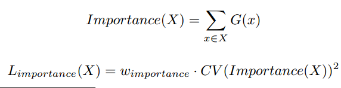

While this loss function can ensure equal importance, experts may still receive very different numbers of examples.（?) For example, one expert may receive a few examples with large weights（G大，数量少，数量不应该相同吗，G=0不算？）, and
another may receive many examples with small weights. This can cause memory and performance
problems on distributed hardware. To solve this problem, we introduce a second loss function,
Lload , which ensures balanced loads. Appendix A contains the definition of this function, along
with experimental results.

# EXPERIMENTS

## 1 BILLION WORD LANGUAGE MODELING BENCHMARK

先前发表的最佳结果(Jozefowicz等人，2016)使用由一个或多个堆叠的长短期记忆(LSTM)层组成的模型。 The number of parameters in the LSTM layers of these
models vary from 2 million to 151 million. Quality increases greatly with parameter count, as do
computational costs. Results for these models form the top line of Figure 2-right.(增大模型，增大计算，提高能力)

我们的模型由两个堆叠的LSTM层组成，它们之间有一个MoE层(见图1)。

Varied Computation, High Capacity: To investigate the effects of adding capacity, we trained
a series of MoE models all with roughly equal computational costs。about 8 million multiply-andadds per training example per timestep in the forwards pass, excluding the softmax layer. We call
this metric (ops/timestep).We trained models with flat MoEs containing 4, 32, and 256 experts, and
models with hierarchical MoEs containing 256, 1024, and 4096 experts. Each expert had about 1
million parameters. For all the MoE layers, 4 experts were active per input.(虽然expert多，但只计算4个)（在相同计算开销下，增加模型，提高能力）

Varied Computation, High Capacity: we trained two more MoE models with similarly high capacity (4 billion parameters), but higher
computation budgets. These models had larger LSTMs, and fewer but larger experts. （相同模型moe，增加计算开销，提高能力）

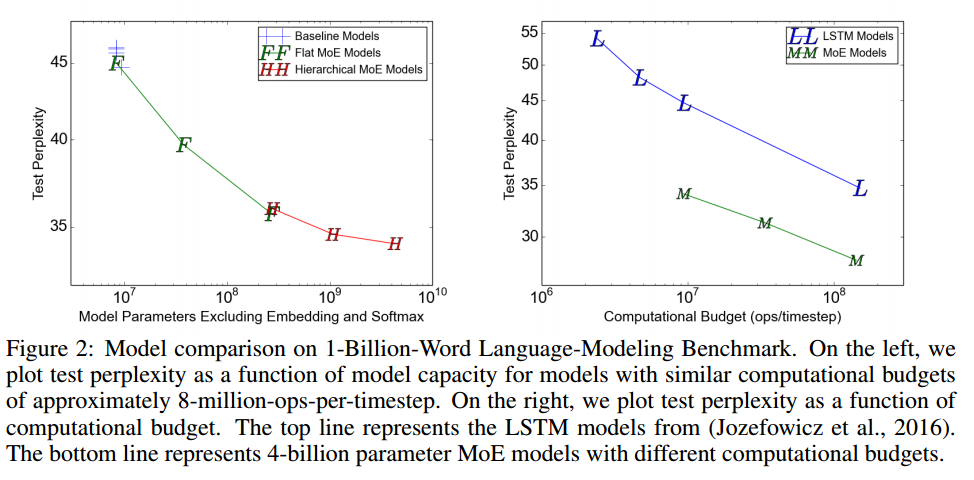

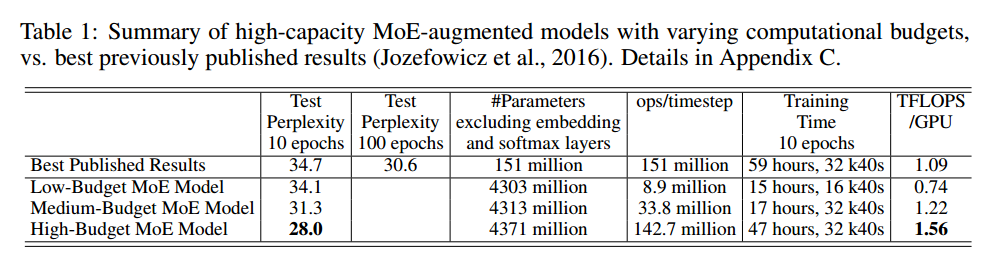

Computational Efficiency:

对于我们的每个模型，我们通过将处理一个训练批所需的浮点运算次数除以观察到的步长时间和集群中GPU的数量来确定TFLOPS/GPU的计算效率。这里使用的操作计数比我们在ops/时间步数中报告的操作计数要高，因为我们包括了向后传递，我们包括了softmax层的基于重要性采样的训练，我们将乘法和加法计算为两个单独的操作。对于我们所有的MoE模型，专家所涉及的浮点运算占总数的37%到46%

##  100 BILLION WORD GOOGLE NEWS CORPUS

在10亿个单词的语料库上，随着MoE层参数的数量超过10亿个，增加额外的容量似乎会产生递减的回报，如图2-左所示。我们假设，对于更大的训练集，更高的容量将产生显著的质量改进。

我们测试了一系列计算成本相似的模型,两条线之间不断扩大的差距表明(不出所料)增加的模型容量在更大的训练集上更有帮助。

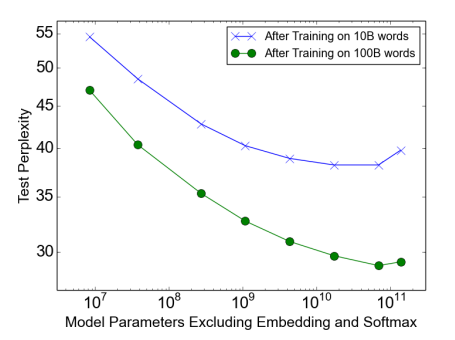

## MACHINE TRANSLATION (SINGLE LANGUAGE PAIR)

我们在编码器(第2层和第3层之间)和解码器(第1层和第2层之间)中都插入了MoE层。每个MoE层包含多达2048个专家，每个专家有大约200万个参数，总共向模型添加了大约80亿个参数。

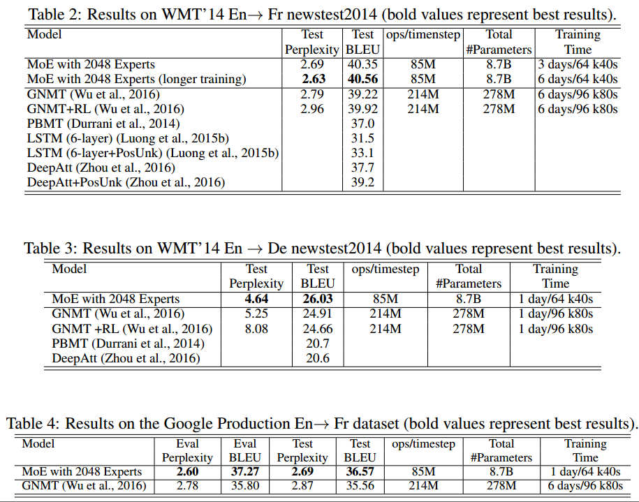

## MULTILINGUAL MACHINE TRANSLATION

由于我们模型的计算预算更低，我们的训练时间更短。The poor performance on English
! Korean seems to be a result of severe overtraining, as for the rarer language pairs a small number
of real examples were highly oversampled in the training corpus

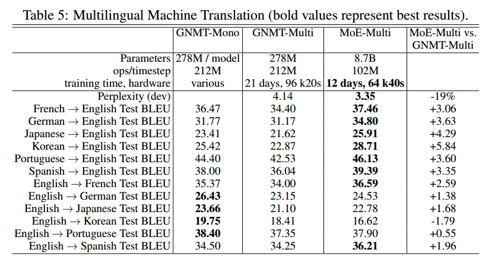

# APPENDICES

## LOAD-BALANCING LOSS

, we want to define an additional loss function
to encourage experts to receive roughly equal numbers of training examples. Unfortunately, the
number of examples received by an expert is a discrete quantity, so it can not be used in backpropagation.Instead, we define a smooth estimator Load(X) of the number of examples assigned to
each expert for a batch X of inputs.平滑性允许我们通过估计器反向传播梯度。这就是门控函数中噪声项的目的。We define P(x, i) as the
probability that G(x)i
is nonzero, given a new random choice of noise on element i, but keeping
the already-sampled choices of noise on the other elements. We define P(x; i) as the
probability that G(x)i
is nonzero, given a new random choice of noise on element i, but keeping
the already-sampled choices of noise on the other elements. To compute P(x; i), we note that the
G(x)i
is nonzero if and only if H(x)i
is greater than the kth-greatest element of H(x) excluding
itself. The probability works out to be:

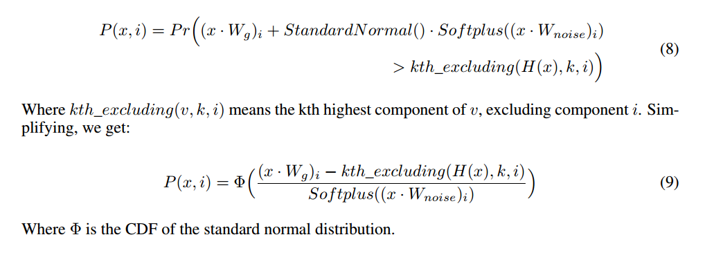

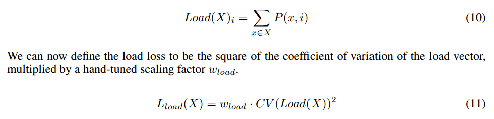

(一个batch内计算概率之和平衡)

为了避免内存不足错误，我们需要将网络初始化为一个近似相等的专家负载状态(因为软约束需要一些时间来工作)。为了实现这一点，我们将矩阵Wg和Wnoise初始化为全零，这将不产生信号和一些噪声

使用不同的wimportance和wload值。我们训练每个模型10个epoch，然后在测试集上测量困惑度。我们还测量了重要性和负载的变化系数，以及超载最严重的专家的负载与平均负载的比率。

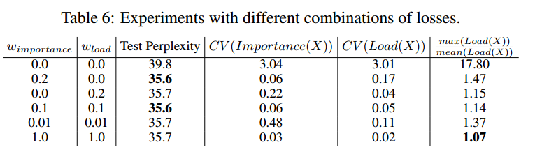

所有包含至少一种损失的组合导致非常相似的模型质量，其中没有损失的情况更糟。wload值越高的模型对过载最严重的专家的负载越低。

## HIERACHICAL MIXTURE OF EXPERTS

If the number of experts is very large, we can reduce the branching factor by using a two-level
hierarchical MoE. In a hierarchical MoE, a primary gating network chooses a sparse weighted combination of “experts", each of which is itself a secondary mixture-of-experts with its own gating
network.If the hierarchical MoE consists of a groups of b experts each, we denote the primary gating network by Gprimary, the secondary gating networks by ($G_1$, $G_2$..$G_a$), and the expert networks
by ($E_{0,0}$, $E_{0,1}$..$E_{a,b}$). The output of the MoE is given by:

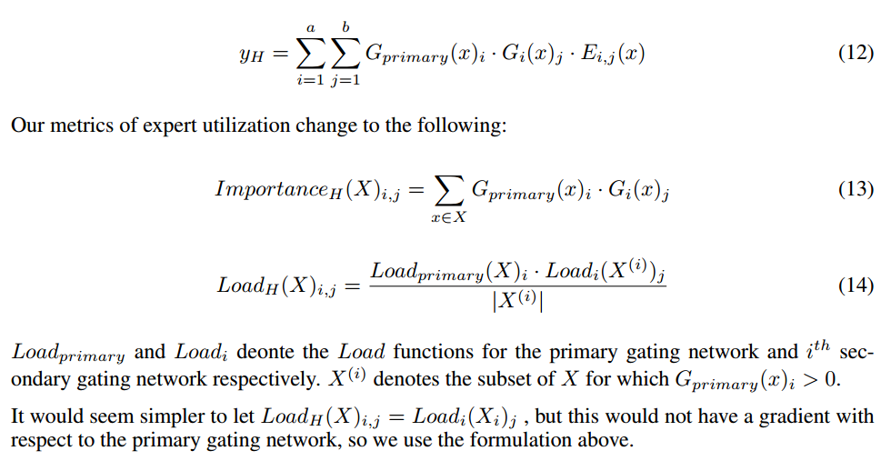

## 1 BILLION WORD LANGUAGE MODELING BENCHMARK - EXPERIMENTAL DETAILS

我们的模型由五层组成:一个词嵌入层，一个循环长短期记忆层(Hochreiter & Schmidhuber, 1997;Gers等人，2000)，一个MoE层，第二个LSTM层和一个softmax层。使用普通的MoE层分别有4、32和256位专家，分层的MoE层分别有256、1024和4096位专家。对于分层的MoE层，第一级分支因子为16，对应于我们集群中gpu的数量。普通MoE层的k = 4，分层MoE层的每一层的k = 2。因此，每个示例正好由4位专家处理，总共4M个操作/时间步。两个LSTM层各贡献2M个操作/时间步，以实现所需的总计8M。

MoE-4模型不使用稀疏性，因为总是使用所有4个专家。此外，我们还训练了另外四个没有稀疏性的计算匹配基线模型:

## 100 BILLION WORD GOOGLE NEWS CORPUS - EXPERIMENTAL DETAILS

为了适应每个GPU多达10亿个参数，我们实现了一些内存优化。

首先，我们不存储专家隐藏层的激活，而是在向后传递时重新计算它们。其次，我们修改了专家参数上的优化器，以减少辅助存储

## STRICTLY BALANCED GATING

如果每个专家收到完全相同的批处理大小（原来的是通过loss训练门控，现在是直接控制门控），我们的模型运行得更快。为了适应这一点，我们使用了一个不同的门控函数

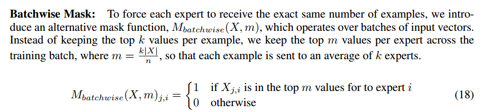

（j是batch内第j个token,这里的X应该是G(X)，一个batch内所有计算次数平分）

在训练期间使用batchwise函数(例如Mbatchwise)需要在我们可能没有大量示例的情况下修改推理。我们的解决方案是训练每个专家阈值的向量T来近似批处理掩码的效果。我们在推理时使用以下掩码

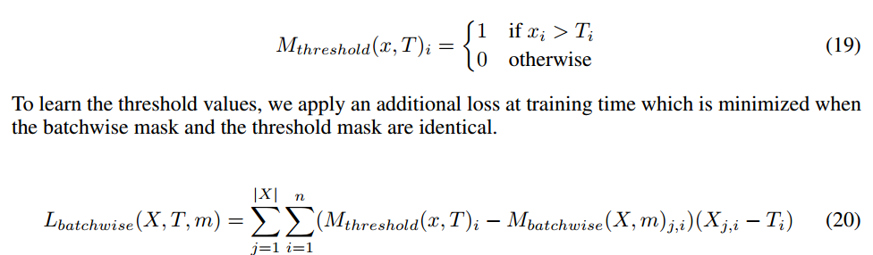

(X=>G(X))

# CONCLUSION

moe层，不同token的专家可能不同

增大batch:

dp复制普通层和门控，划分experts负责计算，按比例增加训练集群中的设备数量来增加专家的数量

seq的所有token batch进入moe

负载均衡：

loss:减少不同expert(一个batch的G之和)的离散程度

loss:减少不同expert(一个batch的需要计算的概率之和)的离散程度

门控：一个batch内所有计算次数平分

增大模型不需要增加计算开销

