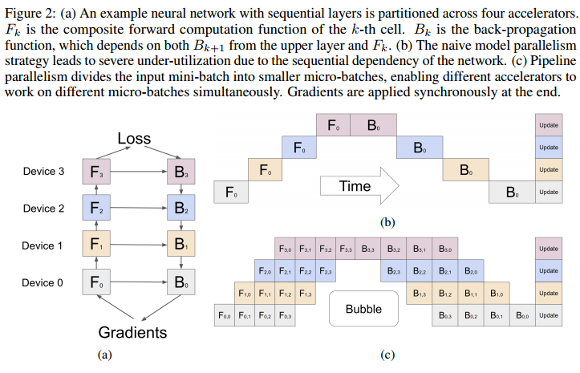
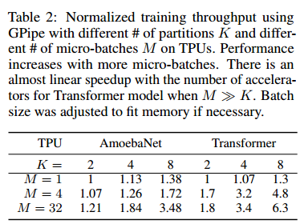

# Abstract

GPipe, a pipeline parallelism library that allows scaling any network that can be expressed as a sequence of layers. GPipe utilizes a novel batchsplitting pipelining algorithm, resulting in almost linear speedup when a model is partitioned across multiple accelerators.

# Introduction
虽然更大的模型为几个领域带来了显著的质量改进，但缩放神经网络带来了重大的实际挑战。硬件限制，包括内存限制和加速器(GPU或TPU)上的通信带宽，迫使用户将较大的模型划分为分区，并将不同的分区分配给不同的加速器。然而，高效的模型并行算法是非常难以设计和实现的，这通常要求实践者在扩展能力、灵活性(或对特定任务和体系结构的特异性)和训练效率之间做出艰难的选择。因此，最有效的模型并行算法是特定于体系结构和任务的。With the growing number of applications of deep learning, there is an ever-increasing demand for reliable and flexible infrastructure that allows researchers to easily scale neural networks for a large variety of machine learning tasks.

首先将一个小批量的训练样例分成更小的微批，然后将每一组微批的执行流水线化。We apply synchronous mini-batch gradient descent for training, where gradients are accumulated across all micro-batches in a mini-batch and applied at the end of a mini-batch。无论分区的数量如何，使用GPipe的梯度更新都是一致的。可以与数据并行性相辅相成，以进一步扩展训练。

实验证明了GPipe在图像分类和机器翻译方面的灵活性和高效性。

# The GPipe Library

这个开源库是在Lingvo[16]框架下实现的。GPipe的核心设计特征是普遍适用的，可以在其他框架中实现[17,18,19]。

任何深度神经网络都可以定义为L层的序列。每一层Li由一个前向计算函数fi和一组相应的参数wi组成。GPipe还允许用户指定一个可选的计算成本估算函数ci。With a given number of partitions K, the sequence of L layers can be partitioned into K composite layers, or cells. Let pk consist of consecutive layers between layers i and j。The set of parameters corresponding to pk is equivalent to the union of wi, wi+1, . . . , wj , and its forward function would be Fk = fj ◦...◦fi+1 ◦fi. The corresponding back-propagation function Bk can be computed from Fk using automatic symbolic differentiation. The cost estimator, Ck, is set to $Σ^j_{l=i}c_l$.

需要用户指定:(i)模型分区的数量K， (ii)微批的数量M， (iii) the sequence and definitions of L layers that define the model.

GPipe将网络划分为K个单元，并将第K个单元放在第K个加速器上。在分区边界处自动插入通信原语，以允许相邻分区之间的数据传输。The partitioning
algorithm minimizes the variance in the estimated costs of all cells in order to maximize the efficiency of the pipeline by syncing the computation time across all partitions(提高流水线效率=让不同分区计算时间相同=最小化分区的计算成本的方差)

divides every mini-batch of size N into M equal micro-batches, which are pipelined through the K accelerators. gradients for each micro-batch are computed based on the same model parameters used for the forward pass。 At the end of each mini-batch, gradients from all M micro-batches are accumulated and applied to update the model parameters across all accelerators. 

If batch normalization (一堆数据做normalize)[20] is used in the network, the sufficient statistics（？） of inputs during training are computed over each micro-batch and over replicas(数据副本？) if necessary [21]. We also track the moving average（？） of the sufficient statistics over the entire mini-batch to be used during evaluation.

In order to reduce activation memory requirements, GPipe supports re-materialization [14]. During forward computation, each accelerator only stores output activations at the partition boundaries. During the backward pass, the k-th accelerator recomputes the composite forward function Fk（只要存起始值？）peak activation memory requirement is reduced to O(N+L/K ×N/M ), where N/M is the micro-batch size and L/K is the number of layers per partition.(只要存输入N?一个（参数，数据）对应一个激活值) In comparison, memory requirement without re-materialization and partitioning would be O(N × L).

Each model parameter needs 12 bytes since we applied RMSProp(优化器) during training.（优化器状态能不能丢？应该不能）

This bubble time is $O(\frac{K−1}{M+K−1})$ amortized over the number of micro-steps
M. (气泡个数$K*(K-1)$，stage计算时间K/M，怎么算?)我们发现当M≥4 × k时，气泡开销可以忽略不计。 This is also partly because re-computation during the backward pass can be scheduled earlier, without waiting for the gradients from earlier layers.

不同层的内存需求和计算失败通常是相当不平衡的。在这种情况下，不完美的分区算法可能导致负载不平衡。

# Performance Analyses

我们期望重物化和管道并行都有利于内存利用率，从而使拟合大型模型变得可行。在没有GPipe的情况下，受设备内存限制，单个加速器可以训练多达82m参数的AmoebaNet。由于在反向传播和批分割中实现了再物质化，GPipe将中间激活内存需求从6.26GB降低到3.46GB，从而在单个加速器上实现了318m参数模型。有了模型并行性，我们可以在8个加速器上将AmoebaNet扩展到18亿个参数，比没有GPipe时多出25倍。在这种情况下，由于AmoebaNet中模型参数在不同层上的分布不平衡，最大模型尺寸不能完美地线性缩放。

重新物质化允许在单个加速器上训练2.7倍大的模型。通过128个分区，GPipe允许将Transformer扩展到83.9B个参数，比单个加速器增加了298倍。与AmoebaNet不同的是，Transformer的最大模型大小与加速器的数量呈线性关系，因为每一层具有相同数量的参数和输入大小

当微批的数量M至少是分区数量的4倍时，气泡开销几乎可以忽略不计。对于Transformer模型，当它被划分为4倍以上的加速器时，会有3.5倍的加速。由于计算在Transformer层之间均匀分布，训练吞吐量几乎与设备数量呈线性增长。相比之下，AmoebaNet模型由于其计算分布不平衡，实现了次线性加速。当M相对较小时，气泡开销就不能再忽略不计了。当M = 1时，实际上没有管道并行性。无论使用多少个加速器，我们都观察到相对恒定的吞吐量，这表明在任何给定时间只有一个设备在进行活跃的计算。

为了测量使用GPipe的通信开销的影响，我们在一个带有多个NVIDIA P100 gpu但没有NVLinks的主机上运行我们的实验。然后，跨gpu的数据传输必须涉及通过PCI-E进行相对较慢的设备到主机和主机到设备的传输。与我们在配备高速互连的tpu上观察到的线性加速相似。设备之间的通信带宽不再是模型并行性的瓶颈，因为GPipe只在分区边界传输激活张量。

重新计算时间是GPipe开销的主要贡献者，占总步长时间的23%。观测到的气泡开销略低于理论值，部分原因是重新计算被安排得较早，与气泡重叠。由于加速器之间的高速互连，管道末端梯度聚合(和通信有什么关系？不是本地聚合吗？)的权值更新时间也很短

# Design Features and Trade-Offs

模型并行的核心思想涉及将网络划分为不同的计算单元，然后将其放置在不同的设备上[39,40,41,42]。

从概念上讲，这支持将大量模型扩展到巨大的容量。然而，这些方法通常存在硬件利用率低和通信瓶颈的问题。单程序多数据(SPMD)（tensor并行？）和管道并行被提出作为应对这些挑战的解决方案。

Mesh-Tensorflow[34]遵循SPMD范式，该范式将用于数据并行的单指令多数据(SIMD)方法扩展到其他张量维度。SPMD允许在多个设备上分割每个计算，允许用户根据加速器的数量线性缩放单个矩阵乘法的大小(以及单个层的模型参数)。然而，这也引入了加速器之间的高通信开销，因为大量类似allreduce的操作用于组合每个并行矩阵乘法的输出。This limits the applicability of the approach to scenarios where accelerators are connected with high speed interconnects.此外，SPMD限制了可以有效扩展的操作类型，将其限制在特定的网络体系结构和机器学习任务集中。For example, splitting along the channel dimension of convolution layers under this paradigm is not efficient given that channels are effectively fully connected, whereas splitting along the spatial dimension requires sophisticated techniques for the halo regions. While SPMD allows scaling the model depth by making each operation smaller, it requires splitting each layer over a larger number
of accelerators, which in turn further increases the communication overhead across devices.

管道并行的最新迭代应用于神经网络训练是PipeDream[45]，其目标是减少参数服务器的通信开销[46]。(参数服务器？) PipeDream pipelines the execution of forward passes and intersperses them with backward passes in an attempt to maximize hardware utilization. This design suffers from weight staleness introduced by asynchronous backward updates。（异步）为了避免权重过时导致的优化问题，PipeDream需要在每个加速器上维护模型参数的多个版本副本，以便准确地计算梯度更新，防止用户扩展到更大的模型。

GPipe引入了一种新的管道并行，在对整个微批应用单个同步梯度更新之前，将微批的执行管道化。我们的新批分割管道并行算法，当与重新物化相结合时，允许扩展到大量的微批。这将最小化气泡开销，而不需要异步梯度更新。GPipe使用户能够根据使用的加速器数量线性缩放模型大小。与SPMD不同，管道并行在扩展模型时几乎没有引入额外的通信开销。设备间通信仅发生在每个微批的分区边界上，并且引入的通信开销很小，将GPipe的效用扩展到无法使用高速设备互连的情况。However, GPipe currently assumes that a single layer fits within the memory requirements of a single accelerator。Additionally, micro-batch splitting requires complicated strategies to support layers that require computations across the batch (for example, BatchNorm uses statistics over the micro-batch during training, but accumulates mini-batch statistics for evaluation).（BatchNorm需要整个batch的信息，需要其他机制？）

# Conclusion

GPipe，一个可扩展的模型并行库，用于训练大型网络。

划分模型到GPU:最小化stage计算成本方差（stages计算平衡）

每个stage存多个micro-batch的（起始）激活，stage累积多个micro-batch的梯度同步更新参数

后向时，重计算可以藏在气泡里

micro-batch的数量越多，吞吐量加速比越接近stage数量，通信带宽不再是模型并行性的瓶颈

BatchNorm？

# .

At the end of each mini-batch, gradients from all M micro-batches are accumulated and applied to update the model parameters across all accelerators. 

During forward computation, each accelerator only stores output activations at the partition boundaries.

we found the bubble overhead to be negligible when M ≥ 4 × K. This is also partly because re-computation during the backward pass can be scheduled earlier, without waiting for the gradients from earlier layers.

The communication bandwidth between devices is no longer a bottleneck for model parallelism since GPipe only transfers activation tensors at the boundaries of partitions.

micro-batch splitting requires complicated strategies to support layers that require
computations across the batch

GPipe achieves almost linear speedup with the number of devices.

GPipe utilizes synchronous gradient descent and guarantees consistent training regardless of the number of partitions.