# Abstract

PipeDream是一个用于gpu的深度神经网络(DNN)训练系统，通过跨多台机器的流水线执行来并行计算。Its pipeline parallel computing model avoids the slowdowns faced by data-parallel training when large models and/or limited network bandwidth induce high communication-tocomputation ratios.相对于数据并行训练，PipeDream将大型dnn的通信减少了95%，并允许通信和计算的完美重叠。PipeDream keeps all available GPUs productive by systematically partitioning DNN layers among them to balance work and minimize communication, versions model parameters for backward pass correctness, and schedules the forward and backward passesof different inputs in round-robin fashion to optimize “time to target accuracy”. 与数据并行训练相比，PipeDream在时间到准确性方面快了5倍。（要达到相同准确性需要的时间）

# Introduction

模型尺寸也在不断增长，以提高有效性。这种增长不仅增加了已经耗费时间和资源的DNN训练过程的压力，而且还导致常用的并行化方法失效。

最常见的方法是数据并行，其中DNN模型在多个工作机器上复制，每个工作机器处理训练数据的一个子集。Weight updates computed on individual workers are aggregated to obtain a final weight update that reflects updates across all inputs.每次聚合所传输的数据量与模型的大小成正比。尽管数据并行训练对于一些具有高计算通信比的流行模型来说效果很好，但两个重要趋势威胁着它的有效性。First, growing model sizes increase peraggregation communication.一些广泛使用的模型足够大，以至于通信开销已经超过了计算时间，限制了扩展并主导了总训练时间。其次，GPU计算能力的快速增长进一步将训练的瓶颈转移到跨模型的通信上。

model parallelism, is used traditionally for models that are too large to keep in a worker’s memory or cache during training [10, 25, 7].模型并行训练包括在工作人员之间划分模型，以便每个工作人员仅对模型参数的一个子集进行评估和执行更新。然而，即使模型并行可以训练非常大的模型，传统的模型并行也会导致计算资源的严重利用不足，因为它一次只使用一个工作者(如果每一层都被分配给一个工作者)，或者不能重叠计算和通信(如果每一层都被划分)。（tensor并行？）此外，即使对于最有经验的机器学习从业者来说，确定如何最好地在工作人员之间划分DNN模型也是一项具有挑战性的任务[30]，这通常会导致额外的低效率。

PipeDream aggressively pipelines minibatch processing, with different workers processing different inputs at any instant of time. This is accomplished by injecting multiple inputs into the worker with the first DNN layer, thereby keeping the pipeline full and ensuring concurrent processing on all workers. 它还对选定的层子集使用数据并行性来平衡工作人员之间的计算负载。我们将这种管道化、模型并行化和数据并行化的组合称为管道并行训练。

当数据并行性出现问题时，管道并行训练具有提供高DNN训练性能的潜力。 In particular, inter-worker communication can be limited to activations (on the forward pass) and gradients (backward) between adjacent layers assigned to different workers. We observe such communication to be up to 95% less than that for data-parallel training.

PipeDream是第一个以通用和自动化的方式结合流水线、模型并行和数据并行的系统。

像处理器中的流水线一样，实现高效率需要将深度神经网络正确划分为“阶段”(层子序列)，每个阶段在不同的工作上执行;这取决于模型体系结构和硬件部署。如果作业分段不合理，就会导致作业人员大量闲置。PipeDream使用一种算法来平衡不同阶段之间的计算负载，同时最大限度地减少通信，自动决定如何根据短时间的分析运行来划分DNN的层。由于dnn并不总是在可用的工人之间平均分配，因此PipeDream可以在某些阶段使用数据并行性-可以将多个工人分配到给定的阶段，并行处理不同的小批量。与传统的单向管道不同，深度神经网络训练是双向的——向前传递之后是反向传递，以相反的顺序通过相同的层。PipeDream interleaves forward and backward minibatch processing on each worker, while making sure to route minibatches through the same workers on the backward pass. This helps to keep all workers busy without pipeline stalls, while preventing excessive inprogress minibatches and ensuring model convergence.仔细管理权重版本，以便在训练结束时获得高质量的模型。allowing the backward pass for a given minibatch to use more up-to-date parameters than those used in the
corresponding forward pass can be a significant problem。（？）PipeDream maintains parameter value versions for each in-flight minibatch to combat this problem

PipeDream的训练速度分别提高了1.45倍、5.12倍、1.21倍和6.76倍 compared to data parallel BSP.（？）

本文做出了四个主要贡献。首先，它引入了一种专门用于DNN训练的并行化方法，通过将模型并行化与积极的流水线和数据并行化相结合来解决通信瓶颈。其次，它确定了实现这个想法的性能潜力的关键挑战，并详细说明了每个挑战的解决方案。第三，它描述了一个有效实现管道并行DNN训练的系统(PipeDream)。第四，实验证明，在通信开销限制数据并行训练的情况下，包括数据并行比单机训练慢的情况下，PipeDream允许并行DNN训练。

# Background & Related Work

训练由多个epoch组成，其中一个epoch是对数据集中所有图像的一次迭代。In each step, the current model first makes a prediction for a small set of training samples, also known as a minibatch. In the ensuing backward pass, each layer computes 1) the error for the previous layer, and 2) the weight update (gradient of the loss) for all relevant layers.

DNN训练的目标是在尽可能短的时间内获得高精度的模型。这个目标可以通过两个指标来实现:1)统计效率statistical efficiency，达到期望的精确度所需的epoch数量，以及2)硬件效率，完成单个epoch所需的时间。达到理想准确度水平的总训练时间就是这两个指标的乘积[15]。

使用数据并行性，输入数据集跨多个gpu进行分区。每个GPU维护模型的完整副本，并在自己的数据分区上进行训练，同时使用集体通信原语[14]或参数服务器[28,9]与其他GPU定期同步权重。参数同步的频率会影响统计效率和硬件效率.

在每个minibatch结束时进行同步(称为bulk synchronous parallel或BSP[42])可以减少用于计算梯度的权重的过时性，从而确保良好的统计效率。然而，如图2所示，BSP要求每个GPU等待或暂停其他GPU的梯度，从而大大降低了硬件效率。尽管有诸如无等待反向传播(Wait-free Backpropagation)等优化方法[47]，其中权重梯度在可用时立即发送(在现代参数服务器中很常见)，但由于DNN计算的结构，通信中断在数据并行训练中是不可避免的，而且通信通常会支配总执行时间。此外，计算速度的快速提高进一步将训练瓶颈转移到通信上。

随着数据并行工作者数量的增加，所有模型的通信开销都会增加。随着GPU计算速度的提高(k80到v100)，所有五种型号的通信延迟也会增加。(占比)

更宽松的同步模型，其中每个GPU继续进行下一个 minibatch 的计算，而不会因为其他GPU的梯度而停滞。这种方法，我们称之为异步并行或ASP，减少了GPU的空闲时间，因此，与BSP相比，提高了硬件效率。然而，这个过程可能导致在陈旧权重上计算梯度，从而降低统计效率。（单个epoch时间减小，epoch增多）我们的实验结果证实了最近的发现，表明ASP不会减少端到端训练时间

模型并行化通常可以比数据并行化实现更快的训练时间 because of the improved statistical efficiency that arises from not using extremely large minibatch sizes;(小的minbatch可以加快收敛？) pipelining multiple minibatches can further improve training times for these
ML problems. Model parallelism has also been used for DNNs, but traditionally only as a last resort when the working set of model training is too large to fit in a single worker’s memory or cache [25, 7, 10] (making data parallelism not an option). This is because traditional model-parallel DNN training suffers from two major limitations

模型并行DNN训练导致GPU资源严重利用率不足。每台机器负责一组连续的层;在这种情况下，这些组之间的层间值(激活和梯度)是需要跨机器通信的唯一参数。对于每个小批量，在任何时刻只有一个阶段是活跃的。对多个minibatch进行连续的流水线处理可以提高利用率，但传统上没有这样做，因为1)dnn的双向性(向前传递之后是以相反顺序通过相同层的向后传递)使得流水线处理具有挑战性，更重要的是2) a naive pipelining mechanism introduces weight update computations on stale weights, leading to the final model achieving a lower accuracy than in the data-parallel training.

跨多个gpu划分模型的负担留给了程序员。最近的研究探索了使用强化学习来自动确定模型并行性的设备放置[30]。不幸的是，这种在线决策技术是时间和资源密集型的;它们也不能无缝地结合流水线、数据和模型并行性。

最近关于卷积神经网络(cnn)快速训练的研究使用了高度优化和昂贵的具有高速机器内和机器间互连的集群[14,12]。许多公共云提供商还没有提供这样的优化

CNTK[33]的1位量化技术解决了数据并行性训练中的通信瓶颈问题[35]。这种近似策略缺乏通用性，在有限的情况下有效;它不会影响某些语音模型的收敛性[34]，但在许多其他语音模型中，由于噪声梯度会影响统计性能[9,1]。

Goyal等人[14]使用更有效的all_reduce实现，如递归减半加倍算法和桶算法来减少通过网络发送的数据量[39]。其他人则从HPC文献中探索了减少通信开销的技术[2,41]。但是所有这些减少方法仍然涉及同步通信模式，导致较小的网络停滞，这只能略微缓解由于模型大小不断增长和计算能力更快而引入的通信瓶颈。

我们解决了之前工作中忽略的关键问题，并提供了一个通用的自动化解决方案。

# Parallel Training in PipeDream

PipeDream combines traditional data parallelism with model parallelism enhanced with pipelining.我们称之为管道并行(pipeline parallelism, PP)。

## Pipeline Parallelism

每个阶段都映射到一个单独的GPU，该GPU为该阶段中的所有层执行向前和向后传递。我们将包含输入层的阶段称为输入阶段，将包含输出层的阶段称为输出阶段。

在最简单的情况下，系统中只有一个minibatch是活动的，就像在传统的模型并行训练中一样。只有一个活动的minibatch，在任何给定的时间点最多有一个GPU是活动的。

为了保证在任何时间点都没有GPU空闲，我们将多个minibatch一个接一个地注入到流水线中，从而通过流水线增强模型并行训练。On completing the forward pass for a minibatch, each stage asynchronously sends the output activations to the next stage, while simultaneously starting to process another minibatch.

与数据并行训练相比，流水线有两个主要优点:

流水线通信较少。与BSP相比，PP需要的沟通要少得多。不像在BSP中那样必须通信所有参数，PP执行中的每台机器只需要通信其中一个层的输出数据。这通常会导致通信的大量减少(例如，VGG16减少了>90%)。

流水线重叠了计算和通信。Asynchronous communication of forward output activations and backward gradients across stages results in a significant overlap of communication with computation of a subsequent minibatch, thus achieving better hardware efficiency compared to BSP (Figure 4).

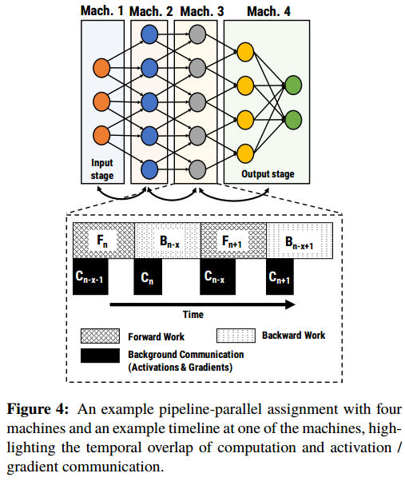

While pipelining by itself reduces training time compared to data parallelism, we observe model parallelism and data parallelism work best for different types of layers. （不同类型的层适合不同的并行类型）PipeDream旨在以最小化总体训练时间的方式将流水线模型并行性和数据并行性结合起来。需要解决三个挑战:

1. Automatic partitioning of work across availablecompute resources.
2. Scheduling of computation to maximize throughput while ensuring forward progress in the learning task.（训练快）
3. Ensuring that learning is effective in the face of asynchrony introduced by pipelining.（训练好）

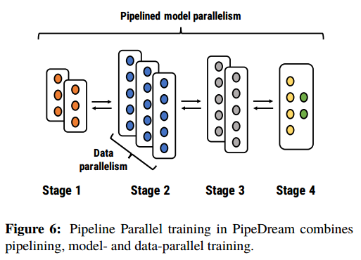

## Partitioning Layers Across Machines

给定一个模型和一组机器，PipeDream的第一个挑战是在可用的机器上自动划分模型的层，以最小化总体训练时间。

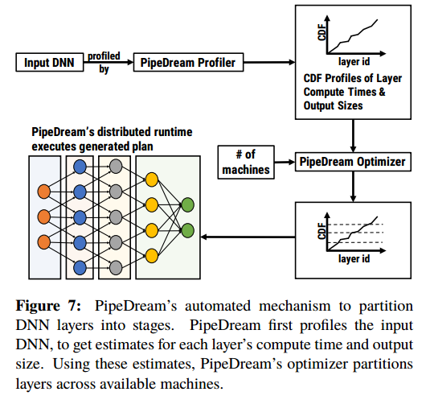

PipeDream的分区算法必须确保每个阶段执行的总工作量大致相同。同时，分区算法还必须保证各阶段间通信的数据量尽可能小，以避免通信中断。机器之间的负载不平衡或机器之间的过度通信会降低硬件效率(吞吐量)。

given a DNN with N layers and M available machines, PipeDream first profiles the model on a single machine, and then runs a partitioning algorithm that groups layers into stages, while also determining the replication factor(几路数据并行) for each stage that minimizes the overall training time for the model.

### Profiling the DNN Model

Our profiling mechanism exploits the fact that DNN training shows little variance in the computation and communication time across minibatches.（不同minibatch在计算和通信差别小） PipeDream records three quantities for each layer l: 1) $T_l$, the total computation time across the forward and backward pass for the layer, 2) $a_l$, the size of the output activations of the layer (also the size of input gradients in the backward pass), and 3) $w_l$, the size of parameters for layer l

To determine $T_l$ for all layers, PipeDream profiles a short run of the DNN model using 1000 minibatches on one of the machines.（单个实验中使用的所有gpu都是相同的） Using this profile, PipeDream computes Tl as the sum of the forward and backward computation times for the layer l.

All communication happens in three steps: 1) move data from the GPU to the CPU of the sender, 2) send data from sender to receiver over the network, and 3) move data from the CPU to the GPU of the receiver. PipeDream estimates the time taken for communication as the amount of data that needs to be transferred divided by the network bandwidth on the communication link. $C_l$, the time taken to communicate the activations from layer l to l + 1 in a pipeline, is estimated using $a_l$. The amount of data communicated per worker in data-parallel configurations with m machines is 4 × (m − 1) × |$w_l$|/m;(m路数据并行每个机器通信数据量) this is used to estimate $W^m_l$, the time for weight synchronization for the layer when using a distributed parameter server.(加载l层模型到m个机器)

### PipeDream’s Partitioning Algorithm

Our partitioning algorithm takes the output of the profiling step, and
computes: 1) a partitioning of layers into stages, 2) the
replication factor for each stage, and 3) optimal number
of minibatches to keep the training pipeline busy.

分区算法试图最小化模型的整体训练时间。对于一个管道系统，这个问题相当于最小化管道最慢阶段所花费的时间。该问题具有最优子问题性质;给定机器数量最大化吞吐量的管道由子管道组成，子管道为较小的机器数量最大化吞吐量。因此，我们可以用动态规划的方法找到这个问题的最优解。

Let A(j, m) denote the time taken by the slowest stage in the optimal pipeline between layers 1 and j using m machines. The goal of our algorithm is to find A(N, M), and the corresponding partitioning. Let T(i $\rightarrow$ j, m) denote the time taken by a single stage spanning layers i through j, replicated over m machines.(m路数据并行)

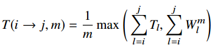

（计算和通信重叠，选最大的）

The optimal pipeline consisting of layers from 1 through j using m machines could either be a single stage replicated m times, or be composed of multiple stages.

Case 1: The optimal pipeline contains only one stage, replicated m times. In this case,

A(j, m) = T(1 $\rightarrow$ j, m)

Case 2: The optimal pipeline contains more than one stage. In this case, it can be broken into an optimal subpipeline consisting of layers from 1 through i with m−$m^{'}$ machines followed by a single stage with layers i + 1 through j replicated over $m^{'}$ machines. Then, using the optimal sub-problem property, we have

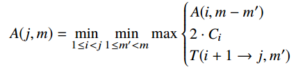

(最慢的stage，通信掩盖在计算中，2是前向加后向)

the second term is the time taken to communicate the activations and gradients between layers i and i + 1

A(1, m) := T(1 $\rightarrow$ 1, m), A(i, 1) := T(1 $\rightarrow$ i, 1)

The total number of sub-problems is O(NM). Time complexity per sub-problem is also O(NM), leading to a total time complexity of O($N^2M^2$).

the optimal number of minibatches admitted per input stage to keep the pipeline full in steady state（几乎无气泡阶段） is given by $\lceil$(# machines) / (# machines in the input stage) $\rceil$. We refer to this quantity as the NUM_OPT_ACTIVE_MINIBATCHES (NOAM).

## Work Scheduling

each machine in the system has to make a choice between two options: i) perform the forward pass for a minibatch, thus pushing the minibatch to downstream machines, and ii) perform the backward pass for a different minibatch, thus ensuring forward progress in learning

A simple scheduling mechanism that always prioritizes forward work hinders overall forward progress as weight updates can be applied only once backward passes complete. Similarly, always prioritizing backward work may periodically result in idle machines with no available work.

In the startup phase（看图）, the input stage admits NOAM （4）minibatches to keep the pipeline full in steady state. Once in steady state, each stage alternates between performing the forward and backward pass for a minibatch. We call this mechanism one-forward-one-backward (1F1B). In a balanced pipeline, 1F1B ensures that no GPU is idle in steady state and that we make forward progress in learning from each minibatch

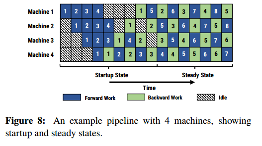

一旦输出阶段完成了第一个小批量的正向传递，它就会对同一个小批量执行向后传递，然后开始在后续小批量执行正向传递和向后传递之间交替进行。当向后传递开始传播到管道中的较早阶段时，每个阶段开始在不同小批量的向前传递和向后传递之间交替进行。in the steady state, every machine is busy either doing the forward pass or backward pass for a minibatch. For 1F1B to be effective, it is not necessary for the forward pass to take as long as the backward pass. In fact, we observe that in practice, the backward pass is always larger than the forward pass, and 1F1B remains an effective scheduling mechanism.

When stages run in a data-parallel configuration, replicated across multiple GPUs, we use deterministic round-robin load balancing (minibatchID mod stageReplicaID) to spread work from the previous stages across the replicas。 Such deterministic loadbalancing ensures that the backward pass for a minibatch is performed on the machine responsible for the minibatch’s forward pass。管道中用于阶段的1F1B调度策略和用于跨复制阶段负载平衡的轮询调度策略都是静态策略。因此，它们可以由每台机器独立执行，而不需要昂贵的分布式协调。

## Effective Learning

在简单的流水线系统中，每个minibatch的前向传递使用一个版本的参数执行，后向传递使用不同版本的参数执行。If we observe stage 1 (machine1), the forward pass for minibatch 5 is performed after the updates from minibatch 1 are applied, whereas the backward pass for minibatch 5 is performed after updates from minibatches 2, 3, and 4 are applied. As a result, in the backward pass for minibatch 5 on stage 1, the gradient is computed using a different set of weights than the ones used in the corresponding forward pass;（计算梯度要用到参数） this discrepancy in weight versions can prevent the model from converging（前向和后向的模型参数不同）

DNN模型的不同阶段存在不同程度的陈旧。例如，在第三阶段，每个minibatch在其向前传递和向后传递之间只有一个交错更新，而输出阶段没有交错更新。这种跨层的不对称性会进一步影响模型的收敛性。我们的实验结果表明，朴素管道训练不能达到与数据并行训练相同的精度。为了解决这个问题，PipeDream使用了两种技术。

权重存储维护权重的多个版本，每个活动的minibatch对应一个版本。在执行前向传递时，每个阶段使用可用的最新版本权重处理一个minibatch。After completing the forward pass, PipeDream stores the weights used as part of the intermediate state for that minibatch.When performing the minibatch’s backward pass, the same version of the weights is used to compute the weight gradient.（保存前向时的模型参数）

权重存储确保在一个阶段内，对给定小批量的前向和后向传递使用相同版本的模型参数。 Weight stashing says nothing about the consistency of parameter versions used for a given minibatch across stages.（不同stage的参数陈旧程度不一样）（不同stage保留的版本数量不同）

Vertical Sync eliminates the potential inconsistency across stages. For example, in Figure 8, using vertical sync, minibatch 5 uses parameters updated by minibatch 1 on all machines for both its forward and backward passes。（用共同最新的参数）Each minibatch (mi) that enters the pipeline is associated with the latest weight version ($w^{i−x}$) seen at the input stage. After performing the backward pass for mi (using stashed weights $w^{i−x}$), each stage independently applies weight updates to create the latest weights ($w^i$), and can then delete $w^{i−x}$. This coordination across stages is asynchronous.

我们可以形式化每种技术的权重更新的过时程度。在这个讨论中，模型分为n个阶段;每个阶段的权重表示为w1、w2等。 after every minibatch, we compute the gradient averaged over all samples in the minibatch.

普通小批量SGD：

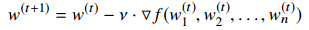

对于权重存储，阶段1的梯度是用延迟n步的权重计算的，阶段2的梯度是用延迟n - 1步的权重计算的，以此类推。

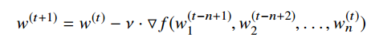

Without weight stashing, the weight update is not a valid gradient of the loss function f for any weight vector

Adding vertical sync alters the weight update to,

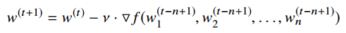

这在语义上与n台机器上具有BSP同步的数据并行性相同(每台机器上具有相同的原始minibatch大小)。（5用1更新的，6用2更新的）

Weight stashing is critical for meaningful learning. PipeDream’s default semantics (weight stashing but no vertical sync) are between regular minibatched SGD on a single machine, and data parallelism with BSP synchronization

在我们的实验中，我们发现垂直同步的影响可以忽略不计。PipeDream的默认语义排除垂直同步，因为它需要在管道的每个阶段存储更多的元数据（旧版本参数更新后不能丢掉）

## GPU Memory Management

如果管理不当，GPU中动态内存分配的开销以及GPU和CPU内存之间的数据传输会大大降低硬件效率

PipeDream extracts the layer parameters from the DNN model and computes the size of activations, parameters, and intermediate state that needs to be stored at each stage, across the active minibatches present in the pipeline. The number of minibatches for which each stage has to maintain intermediate state varies from stage to stage. While the output stage has to maintain intermediate state for only one active minibatch, the input stage needs to do so for NOAM minibatches. PipeDream在训练开始时分配所有所需的GPU内存，并酌情重用分配的内存。这大大减少了动态管理GPU内存的开销。

# Implementation

The input to our system is a model architecture, the training dataset, and the number of GPUs that will be used for training. PipeDream first profiles the model on a single machine with a subset of minibatches from the training dataset. It then runs the optimization algorithm described in Section 3.2 to partition the DNN model into k stages, with some stages replicated. The PipeDream runtime then assigns each stage to a single GPU.

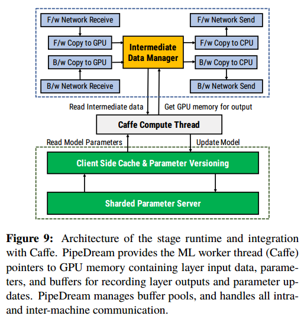

The interface to PipeDream is implemented as a C++ library that manages the parameter and intermediate data for the ML worker that runs on the GPU. In our current implementation, we use Caffe [20] as the ML worker. PipeDream is extensible and can work with other ML frameworks such as Tensorflow [1], MXNet [5], and CNTK [33] as well.

As an initialization step, the PipeDream library in each machine initializes the GPU data structures corresponding to the stage that is assigned to the machine. This involves 1) initializing the ML worker with the layers that it must execute as part of the stage, and 2) statically allocating memory in the GPU for the activations, weights, gradients, and the intermediate state (which includes the input activations and stashed weights for each active minibatch). Once a machine is initialized, the ML worker pulls its next work assignment from PipeDream; PipeDream’s runtime provides the ML worker with pointers to input data. The input stage kick starts the pipeline by creating a minibatch of forward work for its ML worker. From then on, each machine follows the 1F1B scheduling algorithm, while limiting the total number of active minibatches to NOAM. ML worker使用适当的PipeDream API调用来获取每个层的输入、参数、输出、梯度和中间状态的指针。Once the minibatch is processed, the ML worker indicates the completion of work to PipeDream, and pulls its next work item.

If the stage is not replicated, PipeDream applies the updates to the most recent version of the parameter data stored in GPU memory when the weight update is available in the provided GPU buffer. If the
stage is replicated, the weight update is copied to host memory and then sent to the parameter server. When a newer version of the parameters becomes available, the prior version is not immediately discarded, as part of the weight stashing scheme. Parameter data is only discarded once a backward pass that uses fresher parameters is performed.

Intermediate data from the forward pass is not discarded until the associated minibatch completes that stage’s backward pass. Intermediate data from the backward pass is released as soon as the ML worker finishes using it, and if necessary, after it is sent to the next stage. stages in PipeDream commonly manage multiple versions of intermediate data from forward passes, and just a single version of intermediate data from the currently running backward pass.

PipeDream uses a distributed parameter server, similar to GeePS [9], to synchronize parameters for layers of data-parallel stages. Using wait-free back propagation, weight gradients are communicated to servers as soon as they are as computed, rather than waiting for computation to finish for all layers. Each worker contains an instance of a parameter server shard that stores a unique subset of the parameters. The server shards push the newest version of their parameters to the other shards as soon as updates from all stage replicas are aggregated.

All inter-machine communication between PipeDream’s stages, both in data-parallel and pipelineparallel settings, uses ZeroMQ [46] and an efficient communication stack with fast custom serialization.

PipeDream supports periodic checkpointing of model parameters for fault-tolerance, with default checkpointing across stages at the end of every epoch. each stage locally decides to dump its model parameters when it performs the backward pass for the last minibatch in an epoch.

# Evaluation

1)结合管道，模型并行和数据并行比单独使用模型并行或数据并行执行得更好;2)与数据并行训练相比，PipeDream大大降低了通信开销;3)对于具有较低计算与通信比率的配置，PipeDream的改进更高。

与Cluster-A相比，Cluster-B拥有更快的gpu，但网络速度较慢。因此，正如我们在本节后面所展示的，PipeDream在Cluster-B中的性能优势要高于Cluster-A。

For all the experiments, we measure the time taken to train the
models until they reach their advertised validation accuracy

we compare to PipeDream in dataparallel and single machine configurations. 为了确认其效率，我们将PipeDream的数据并行实现与GeePS的开源版本进行了比较，GeePS是一种高效的数据并行深度神经网络训练系统，它也在个体工人上使用Caffe，并且表现良好，甚至优于其他最先进的深度神经网络框架[9]。在我们的实验中，对于所有被测试的模型和数据集，PipeDream的数据并行配置至少与geeps一样快。

## PipeDream vs. Data Parallelism

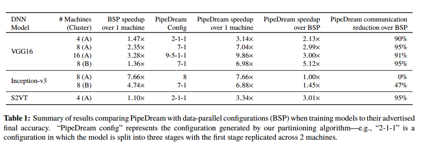

最佳配置既不是完全数据并行的，也不是完全模型并行的。

对于VGG16, 8台机器的BSP只比单机训练减少了2:35倍的训练时间，因为8台机器的VGG16在Cluster-A中的通信开销为72%。PipeDream消除了95%的通信开销，因此与单机训练相比，性能提高了7:04倍(与BSP相比，性能提高了2:99倍)。对于Inception-v3，与Cluster-A上的8台机器的通信开销仅为5%。因此，BSP实现了近乎完美的缩放，在单个机器上实现了7:66 x的加速

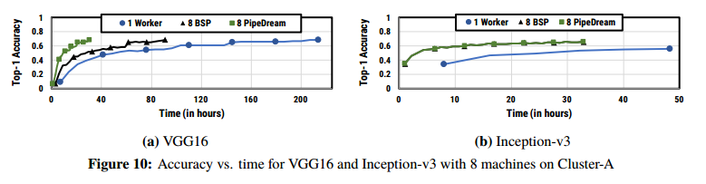

更快的gpu导致更快的端到端训练时间。较高的通信开销导致BSP和PipeDream在8台机器上的扩展效率较低。(加速比变小)然而，这种增加的通信开销对BSP的影响明显大于PipeDream。从集群a移动到集群b，对于VGG16, PipeDream在BSP上的加速从2:99×增加到5:12×。即使对于Inception-v3，与Cluster-B上的BSP相比，PipeDream也将训练时间提高了45%。

随着机器数量的增加，所有模型的通信开销也会增加(如图1所示)。随着机器数量的增加，BSP的可扩展性很差。与单台机器训练相比，在4台、8台和16台机器上，BSP分别提供了1:47倍、2:35倍和3:28倍的加速。PipeDream在4台、8台和16台机器上提供了3:14 x、7:04 x和9:86 x的加速。

ASP has no synchronization, and the workers use the most recent parameter data available. Due to ASP’s poor statistical efficiency,
PipeDream reaches a 48% accuracy 7.4x faster than ASP data-parallel, even though ASP has no communication overhead.

对于许多由LSTM层组成的递归神经网络，BSP数据并行训练的可扩展性很差。对于S2VT, 4台机器的BSP只比单台机器训练减少了1.1倍的训练时间。因为对于4台机器，集群a上S2VT的通信开销是70%。与BSP相比，PipeDream减少了95%的通信开销，与单机训练相比，减少了3:34倍的训练时间(与BSP相比，减少了3:01倍)。

## Value of Data Parallelism in stages

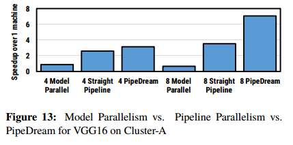

简单模型并行在任何时间点只使用一台机器，因此比单机器配置慢。

将模型并行性与流水线相结合，可以得到直接的流水线配置(与PipeDream相比，没有数据并行性)。与单机训练相比，直管配置大大缩短了训练时间，4台和8台机器训练时间分别为2:56倍和3:49倍。实际上，这些改进比数据并行训练更好，与单机训练相比，数据并行训练实现了1:47 x和2:35 x的相应提速

# Conclusion

addresses the communication overheads that bottleneck data-parallel training of very large DNNs.

发生数据到下一个stage是异步的，开始处理新的数据是同步的

流水线重叠了计算和通信，stage交替计算前向和后向

不同类型的层适合不同的并行类型

划分模型的层，以最小化总体训练时间：负载平衡，通信小

在input stage输入NOAM个minbatch，几乎无气泡，之后保持NOAM个minbatch在流水线，input stage完成一次后向，增加新的前向（增加新的minbatch）

1f1b:每个stage前向和后向交替

输出stage一直1f1b，其他stage接收到梯度后开始1b1f

stage数据并行，取模实现负载均衡

计算梯度用到参数要和计算前向的一样，同一个数据在不同stage的前向后向用到的参数相差程度要相同

每个活动的minibatch对应一个参数版本。each stage processes
a minibatch using the latest version of weights available. as part of the intermediate state。the same version of the weights is used to compute the weight gradient

Vertical Sync: i前向不要用最新的参数版本，因为不同stage的最新不同，用共同最新的版本(i-NOAM)，i后向后就可以删除i-NOAM版本
