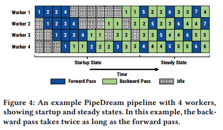
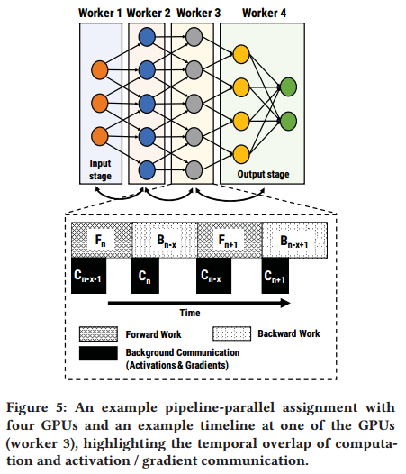
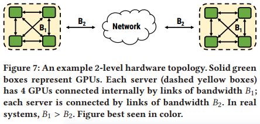
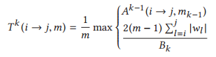
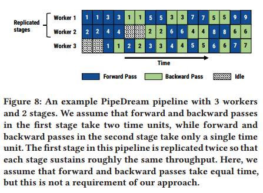
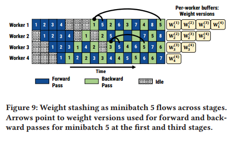
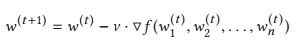
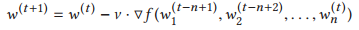
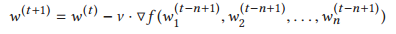

# ABSTRACT

当前并行化训练的方法主要使用批内并行化，其中训练的单个迭代被分配到可用的工人上，但是在较高的工人数量上遭受收益递减的困扰。PipeDream系统，该系统在批内并行的基础上增加了批间流水线，以进一步提高并行训练吞吐量，帮助更好地重叠计算和通信，并在可能的情况下减少通信量。与传统的流水线不同，DNN训练是双向的，其中向前传递计算图，然后是向后传递，使用在向前传递期间计算的状态和中间数据。Naïve管道可能导致在向前和向后传递中使用的状态版本不匹配，或者过多的管道刷新和较低的硬件效率。To address these challenges, PipeDream versions model parameters for numerically correct gradient computations, and schedules forward and backward passes of different minibatches concurrently on different workers with minimal pipeline stalls.自动在工作人员之间划分DNN层，以平衡工作并减少通信。PipeDream训练模型的精度比常用的批内并行技术快5.3倍。

#  INTRODUCTION

Current approaches focus on parallelizing each iteration of the optimization algorithm across a set of workers. data parallelism partitions the input data across workers，model parallelism partitions operators across workers [16, 21], and hybrid schemes partition both [33, 34, 36].批内并行化在大规模时可能会受到高通信成本的影响。在32个gpu以上的情况下，由于昂贵的跨服务器all_reduce通信，某些型号的通信开销(以通信停顿所花费的总时间的百分比计算)高达90%。即使在服务器内的gpu通过专用互连(如NVLink[4])连接的服务器上，通信开销也很高。随着时间的推移，GPU计算能力的快速增长将进一步将所有模型的训练瓶颈转移到通信上。

通过将批内并行化和批间并行化相结合来实现更快的DNN训练。PipeDream将模型划分为可用的工人，在操作符图中为每个工人分配一组连续的操作符(DNN术语中称为层)，然后以流水线的方式重叠不同输入的计算和通信。这个过程可以大大减少工作者之间的通信，因为它将通信限制为层输入和输出。这种通信是点对点的，而不是所有对所有。

DNN训练是双向的-向前传递之后是向后传递，以相反的顺序通过相同的层，使用来自向前传递的状态和中间结果。为了保持管道满，从而实现高硬件效率，naïve调度机制可以将一个epoch中的所有小批量注入管道，首先完成所有输入小批量的正向传递，然后是向后传递。然而，这种方法的统计效率较低[18]，需要增加通过数据集的次数（epoch增多）来产生高质量的模型。此外，这种策略可能会阻止模型达到期望的目标精度，因为梯度是在所有训练样本上平均的[10,39]。为了提高统计效率，可以只向管道中注入m个小批次的子集，并每m个小批次应用权重更新，正如GPipe最近提出的[28]。但是，由于更频繁的管道刷新，这会降低硬件效率。传统的模型并行训练对应于这种情况的一个极端情况(m = 1)。

它实现了高硬件效率，在稳定状态下没有管道停滞，并且具有高统计效率与使用相同数量的工作者的数据并行性相当。使用称为1F1B的调度算法来保持硬件的充分利用，同时实现类似于数据并行的语义。在1F1B的稳定状态下，每个工人严格地在其阶段的向前和向后传递之间交替，即使在向后传递比向前传递花费更长时间的常见情况下，也确保了高资源利用率(可以忽略不计的管道停顿，没有管道冲洗)。1F1B还使用不同版本的模型权重来保持与数据并行性相当的统计效率。阶段中的每次向后传递都会导致权重更新;下一个向前传递使用可用的最新版本的权重，并“隐藏”（存储）这些权重的副本，以便在相应的向后传递期间使用。 Although the forward pass will not see updates from incomplete in-flight mini-batches, learning is still effective because model weights change relatively slowly and bounded staleness has been found effective in improving training speeds [19, 43].为了使向后传递计算数值正确的梯度，必须使用在向前传递期间使用的相同权重版本。PipeDream将“管道内”小批的数量限制在保持管道满所需的最小数量，从而减少了内存开销。

在最高吞吐量下运行管道还需要管道中的所有阶段花费大致相同的时间，因为管道的吞吐量受到最慢阶段的瓶颈。PipeDream根据在单个GPU上执行的简短分析自动确定如何划分DNN的操作，平衡不同阶段之间的计算负载，同时最大限度地减少目标平台的通信。即使存在模型多样性(计算和通信)和平台多样性(互连拓扑和分层带宽)，PipeDream也能有效地实现负载平衡。PipeDream可能决定在某些阶段使用数据并行性-可以将多个工人分配到给定的阶段，并行处理不同的小批。结合了跨数据并行阶段的循环调度，同时确保向后传递中的梯度从正向传递路由到相应的worker。1F1B-RR, produces a static schedule of operators that each worker runs repeatedly, keeping utilization high across all workers. 流水线并行训练可以被认为是批间流水线和批内并行的原则组合。比更简单的管道方法(如GPipe的方法)快1.7倍。

#  BACKGROUND AND RELATED WORK

将介绍并行DNN训练的两大类:批内和批间。我们还强调了DNN模型和硬件多样性对有效并行化带来的挑战

## Intra-batch Parallelism

单个训练迭代在可用的工作人员之间进行分割。

在数据并行性中，输入是跨工作者进行分区的。每个worker维护模型权重的本地副本，并在自己的输入分区上进行训练，同时使用all_reduce[24]或参数服务器[38]等集体通信原语定期与其他worker同步权重。传输的数据量与模型权重的数量和参与培训的工人数量成正比。最常用的数据并行形式，被称为批量同步并行或BSP[52] 1，要求每个工人等待其他工人的梯度。尽管有诸如无等待反向传播(Wait-free Backpropagation)等优化[57]，其中权重梯度在可用时立即发送(在现代框架中很常见)，但对于大型模型，通信中断有时是不可避免的，在这种情况下，跨工作线程同步梯度所需的时间可能会支配计算时间。

主要关注四个要点。首先，尽管使用多gpu服务器和最先进的通信库(如NCCL)，但许多这些模型的通信开销很高。对于像ResNet-50这样的模型，数据并行性可以很好地扩展，这些模型具有大量具有紧凑权重表示的卷积层，但是对于具有LSTM或完全连接层的其他模型，数据并行性的扩展不太好，这些模型具有更密集的权重表示。

其次，分布在多个gpu服务器上的应用程序会受到服务器间链接较慢的瓶颈，当训练扩展到多个服务器时，通信开销会出现峰值，然后趋于稳定。这种分层网络的数据并行性可能不太适合，因为在高带宽和低带宽通道上发送的字节数相同。

第三，随着数据并行工作者数量的增加，所有模型的通信开销都会增加，即使在使用NVLink的多gpu实例上执行训练也是如此。

第四，随着GPU计算速度的提高(从1080Tis到v100)，所有型号的通信开销也会增加。

异步并行训练(ASP)允许每个工人在接收前一个小批量的梯度之前继续下一个输入小批量。这种方法通过与通信的重叠计算提高了BSP的硬件效率(每次迭代所需的时间)，但也引入了过时性并降低了统计效率(达到特定目标精度所需的迭代次数)[12,20]。

Seide等人[45,46]研究了量化梯度，以减少需要通过网络通信的数据量。这种近似策略对有限的场景有效，但缺乏通用性;对于某些语音模型[47]，它不会损害收敛性，但对其他类型的模型没有显示出有效。其他人则经常从高性能计算文献中探索技术来减少通信开销，经常使用高度专业化的网络硬件。我们的工作是对这些技术的补充，主要关注在使用公共云中可用的商品加速器和互连时提高并行深度神经网络训练的性能。

使用大的minibatch对于训练ResNet-50是有效的，特别是当与分层自适应速率缩放(LARS)相结合时[24,31,56]。large minibatch通过减少交换参数的频率来减少通信开销;然而，我们的实验表明，这些技术缺乏超越ResNet-50的通用性，管道并行可以胜过最快的LARS数据并行选项。

模型并行是一种批内并行方法，其中DNN模型中的操作符被划分为可用的worker，每个worker仅对所有输入的模型参数的一个子集进行评估和执行更新。通信的数据量是需要跨工作者发送的中间输出(以及相应的梯度)的大小。虽然模型并行可以训练非常大的模型，但普通模型并行很少用于加速DNN训练，因为它有两个主要限制。首先，模型并行训练导致计算资源利用率不足，第二个限制是，跨多个gpu划分模型的负担留给了程序员[36]，导致点解。最近的工作探索了使用强化学习来自动确定模型并行性的设备放置[42]。然而，这些技术是时间和资源密集型的，并且没有利用DNN训练可以被认为是由连续层组组成的计算管道的事实-这些假设使优化问题更易于处理，允许在多项式时间内得到精确的解，如我们在§3.1中所示。

混合批内并行。最近的工作提出了在多个维度中拆分优化算法的单个迭代。OWT[36]手工拆分当时流行的AlexNet模型，对具有少量权重参数和大量输出的卷积层使用数据并行性，选择不复制具有大量权重参数和小输出的完全连接层。FlexFlow [33] proposed splitting a single iteration
along samples, operators, attributes, and parameters, and describes
an algorithm to determine how to perform this splitting in an automated way. 

##  Inter-batch Parallelism

GPipe没有指定划分模型的算法，而是假设一个划分的模型作为输入。GPipe进一步将一个minibatch拆分为m个microbatch，并对这m个microbatch执行前向传递和后向传递。GPipe optimizes for memory efficiency; it uses existing techniques such as weight gradient aggregation and trades computation for memory by discarding activation stashes between the forward and the backward pass, instead opting to re-compute them when needed in the backward pass [14]. As a result, it can suffer from reduced hardware efficiency due to re-computation overheads and frequent pipeline flushes if m is small (§ 5.4).

## DNN Model and Hardware Diversity

这些不同类型的模型使用不同的并行化策略表现出截然不同的性能特征，使得最优并行化策略高度依赖于模型。选择最优的并行化方案是具有挑战性的，因为这种方案的有效性也取决于目标部署硬件的特性;gpu、asic和fpga具有非常不同的计算能力。此外，连接这些加速器的互连具有不同的拓扑结构和容量.模型和部署的多样性使得手动提出最佳并行化策略变得极其困难。

# PIPELINE PARALLELISM

使用管道并行(pipeline parallelism, PP)，这是一种结合了批内并行和批间并行的新型并行化策略。每个阶段都映射到一个单独的GPU，该GPU为该阶段的所有层执行前向传递(和后向传递).理想情况下，我们希望所有gpu都是活动的。考虑到这一点，我们一个接一个地将多个minibatch注入管道。在完成minibatch的前向后，每个阶段异步发送输出激活。同时开始处理另一个小批量。最后一个阶段在向前传递完成后立即在一个小批量上开始向后传递。在完成其向后传递后，每个阶段异步地将梯度发送到前一个阶段，同时开始计算下一个minibatch

管道并行优于批内并行有两个原因:流水线通信较少。PP的通信能力往往远不如DP。不像在数据并行方法(使用集体通信或参数服务器)中那样，必须为所有参数聚合梯度并将结果发送给所有工作人员，PP执行中的每个工作人员只需将梯度和输出激活的子集通信给单个其他工作人员。这可能导致通信的大量减少。流水线重叠了计算和通信。跨阶段前向激活和后向梯度的异步通信导致通信与后续minibatch计算的大量重叠，如图5所示。这种计算和通信是完全独立的，没有依赖边，因为它们在不同的输入上操作，导致更容易并行化。

## Challenge 1: Work Partitioning

the steady state throughput of the resulting pipeline is the throughput of the slowest stage. Having each stage process minibatches at vastly different throughputs can lead to bubbles in the pipeline, starving faster stages of minibatches to work on and resulting in resource under-utilization. Excessive communication between workers can also lower the throughput of the training pipeline. the allocation of stages to workers needs to be model- and hardware-aware to be effective, and there may be cases where no simple partitioning across the GPUs achieves both limited communication and perfect load balance.

PipeDream的优化器输出一个平衡的管道。每个阶段以大致相同的速率完成，同时试图以拓扑感知的方式最小化工作人员之间的通信(例如，如果可能的话，应该通过更高带宽的链接发送大输出)。为了进一步改善负载平衡，PipeDream超越了直接管道，允许复制阶段(即，在阶段上使用数据并行性)。这个分区问题相当于最小化管道最慢阶段所花费的时间，并且具有最优子问题属性

PipeDream利用了DNN训练在不同输入的计算时间上几乎没有变化的事实。作为初始剖析步骤的一部分，PipeDream记录了向前和向后传递所花费的计算时间，层输出的大小以及每层相关参数的大小;该配置文件用作优化器分区算法的输入(图6)。分区算法还考虑其他约束，如硬件拓扑和带宽、工作人员数量和计算设备的内存容量

PipeDream在单个GPU上使用1000个小批量的短(几分钟)分析运行，记录每个层l的三个数量:1)Tl，目标GPU上第l层的向前和向后传递的总计算时间，2)al，第l层的输出激活的大小(以及向后传递的输入梯度的大小)，以及3)wl，第l层的权重参数的大小，以字节为单位。

PipeDream通过将需要传输的数据量除以通信链路的网络带宽来估计通信时间。Assuming efficient all_reduce collective communication, in data-parallel configurations with m workers, each worker sends ( m−1/ m · |wl |) bytes to other workers, and receives the same amount; this is used to estimate the time for weight synchronization for layer l when using data parallelism with m workers.

划分算法采用分析步骤的输出，并计算:1)将层划分为阶段，2)每个阶段的复制因子(工作人员数量)，以及3)使训练管道保持繁忙的飞行中小批量的最佳数量。

PipeDream’s optimizer assumes that the machine topology is
hierarchical and can be organized into levels. We assume that level k is comprised of mk components of level (k − 1), connected by links of bandwidth Bk .

PipeDream的优化器从最低到最高级别逐步解决动态规划问题。this
process finds the optimal partitioning within a server and then uses
these partitions to split a model optimally across servers

Let $A^k$ (i → j,m) denote the time taken by the slowest
stage in the optimal pipeline between layersi and j usingm workers
at level k. The goal of our algorithm is to find $A^L$ (0 → N,mL ), and
the corresponding partitioning, where L is the highest level and N
is the total number of layers in the model. Let $T^k$ (i → j,m) denote the total time taken by a single stage spanning layers i through j for both forward and backward passes, replicated over m workers using bandwidth Bk

The result of the max expression above gives the effective time spent processing m inputs while performing compute and communication concurrently; thus, the effective time spent processing a single input is this term divided by m.

In our experiments, the running time is under 8 seconds.

##  Challenge 2: Work Scheduling

系统中的每个worker都需要决定是否应该i)对一个小批量执行其阶段的正向传递，将该小批量推送给下游worker，或者ii)对另一个小批量执行其阶段的向后传递，将该小批量推送给上游worker。

在启动阶段，输入阶段允许足够的小批量以保持管道处于稳定状态。

NOAM) = $\lceil$ (# workers) / (# of replicas in the input stage) $\rceil$

一旦进入稳定状态，每个阶段就会在对小批量执行前向传递和对较早的小批量执行后向传递之间交替进行。我们称之为一前进一后退(1F1B)调度。 It also ensures backward passes from inputs are applied at regular intervals of time.

一旦输出阶段完成了第一个小批量的正向传递，它就会对同一个小批量执行向后传递，然后开始在后续小批量的正向传递和向后传递之间交替进行。当向后传递开始传播到管道中的早期阶段时，每个阶段开始在不同小批量的向前传递和向后传递之间交替进行。

当阶段在数据并行配置(跨多个gpu复制)中运行时，我们使用基于minibatch标识符的确定性轮询负载平衡来跨副本分散工作。这种确定性负载平衡确保每个小批在阶段的前向和后向传递时都被路由到相同的工作器，这很重要，因为前向传递的参数和中间输出对于后向传递是必需的。这种机制，我们称之为一前一后轮询(1F1B-RR)，是一种静态策略，执行时不需要昂贵的分布式协调。图8显示了简单2-1配置的实际机制，其中第一阶段复制了两次，第二阶段未复制。在第一阶段，所有具有偶数minibatch id的输入都由worker 1处理，而具有奇数minibatch id的输入则由worker 2处理。第二阶段的工人3处理所有输入。

在实践中，后向总是比前向大。1F1B-RR produces a full steady state pipeline even for cases where the ratio of backward- to forward-pass time is not an integer (e.g., 3 to 2).

## Challenge 3: Effective Learning
在简单的流水线系统中，minibatch的每个阶段的正向传递使用一个版本的参数执行，而向后传递使用不同版本的参数执行。In stage 1, the forward pass for minibatch 5 is performed after the updates from minibatch 1 are applied, whereas the backward pass for minibatch 5 is performed after updates from minibatches 2, 3, and 4 are applied。As a result, in the backward pass for minibatch 5 on stage 1, the gradient is computed using a different set of weights than the ones used in the corresponding forward pass。权重版本的差异会导致无效的梯度，并可能阻止模型收敛。

PipeDream使用一种称为权重存储的技术来避免在向前和向后传递中使用的权重版本之间的根本不匹配。权重存储维护权重的多个版本，每个活动的minibatch对应一个版本。每个阶段使用前向传递中可用的权重的最新版本处理一个小批量。完成前传后，PipeDream存储用于该小批量的权重。The same weight version is then used used to compute the weight update and upstream weight gradient in the minibatch’s backward pass.

权重存储确保在一个阶段内，对给定小批量的前向和后向传递使用相同版本的模型参数。minibatch 5在机器1上使用来自minibatch 1的参数更新，在机器2上使用来自minibatch 2的参数更新。权重存储不能保证给定的小批量在各个阶段使用的参数版本的一致性。

垂直同步是PipeDream中的一项可选技术，它可以消除各个阶段之间潜在的不一致。当使用垂直同步时，minibatch 5使用由minibatch 1在所有worker上更新的参数，用于其向前和向后传递。进入管道的每个小批(bi)都与输入阶段看到的最新权重版本(w(i−x))相关联。当小批bi沿向前方向流过管道时，该信息与激活和梯度一起传播。在所有阶段中，bi的正向传递使用存储的权重w(i−x)，而不是最新的权重更新。在对bi执行反向传递(使用存储的权重w(i−x))之后，每个阶段独立地应用权重更新来创建最新的权重(w(i))，然后可以删除w(i−x)。这种跨阶段的协调是异步的

垂直同步的语义不同于GPipe(和数据并行)。梯度不会在系统中所有运行中的minibatch上聚合——垂直同步只是确保使用相同的权重版本来计算不同worker之间的梯度(但是应用梯度的权重版本与用于计算相应梯度的权重版本不同)。(？)

Vanilla minibatch SGD

weight stashing

（$w^{(t)}$对吗？$w_1^{(t-n)}$...）(在最新的版本上更新？)

Adding vertical sync

(会把每次的更新都放在一个版本里？更新4后，5的更新在4的基础上)

This is semantically similar to data parallelism with BSP synchronization on n workers (with the same per-worker minibatch size), with the same staleness (but gradients averaged over a minibatch of size B instead of nB)（括号里是什么意思？）

相对于数据并行性，流水线不会显著增加每个工作线程的内存使用，即使使用权重存储也是如此。考虑一个直线管道(没有数据并行阶段)，其中一个模型被划分为n个工人，每个工人持有1/n个权重。对于非流水线模型并行训练，与数据并行训练相比，每个工人需要的内存是1/n。如PipeDream所做的那样，允许n个输入到管道中，这最多增加了n倍，因为每个正在运行的小批需要一个版本。因此，PipeDream的每个工人内存使用峰值与数据并行性相当

PipeDream的内存占用可以通过使用现有技术进一步减少:有效编码或压缩中间数据[30]，梯度聚合(weight gradients are added to a single buffer at a stage for m minibatches before performing a weight update)，以及通过在向前传递中丢弃它们并在向后传递期间根据需要重新计算它们来交换激活存储内存的计算时间[14]。

PipeDream的默认语义排除垂直同步，因为它需要在管道的每个阶段存储更多的元数据。PipeDream的默认语义(权重存储，但没有垂直同步)介于单个worker上的常规小批SGD和BSP同步的数据并行之间[19,27]。我们的评估证明了它在模型、数据集和硬件配置上的有效性。

# IMPLEMENTATION

PipeDream的接口是作为一个独立的Python库(约3000 LOC)实现的，用于管理设备内存、调度工作和处理通信。PipeDream使用PyTorch[5]进行自分化并执行操作符;然而，PipeDream是可扩展的，可以与其他ML框架一起工作，如Tensorflow [8]， MXNet[13]和CNTK[45]。作为概念验证，我们还将PipeDream与Caffe集成在一起[32]。PipeDream首先在单个GPU上使用来自训练数据集的输入子集对模型进行配置(图6)。然后运行§3.1中描述的优化算法，将DNN模型划分为阶段，其中一些阶段可能被复制。

PipeDream的优化器返回一个带注释的操作符图，每个模型层映射到一个阶段ID。PipeDream对这个图执行BFS遍历，并为每个阶段生成单独的torch.nn代码。PipeDream运行时根据其1F1B-RR调度将每个阶段(包括复制阶段的副本)分配给单个worker。

PipeDream maintains all parameters associated with the layers assigned to the stage directly in GPU memory. PipeDream applies updates to the most recent parameter version when the weight update becomes available if the stage is not replicated. The weight updates are synchronized across replicas prior to being applied if the stage is replicated.当参数的新版本可用时，先前的版本不会立即被丢弃。只有在使用更新参数的反向传递执行后，参数才会被丢弃。

在从前一阶段(或从磁盘输入阶段的情况下)接收中间数据时，PipeDream将中间数据复制到GPU内存中，并在工作队列中放置一个指向相关缓冲区的指针。向前传递的中间数据不会被丢弃，直到相关的minibatch完成该阶段的向后传递。来自向后传递的中间数据在worker完成使用后立即被释放，如果有必要，则在它被发送到下一阶段之后释放

PipeDream使用PyTorch的distributeddataparliel库[6]来同步数据并行阶段层的参数。使用无等待反向传播，权重梯度在计算完成后立即传递给服务器，而不是等待所有层的计算完成。我们使用NCCL通信后端[3]作为数据并行基线，因为我们发现对于DP中交换的大张量，它比Gloo[1]快。我们还发现，对于跨管道交换的小张量，例如激活和梯度，Gloo比NCCL更快。当执行管道并行训练时，PipeDream默认使用Gloo进行所有gpu间通信，因为我们无法在一个阶段中同时使用Gloo(跨管道)和NCCL(跨复制阶段)。（？）

default checkpoints made across stages at the end of every epoch.每个阶段在对epoch中的最后一个小批执行向后传递时，都会在本地转储其模型参数。由于失败而重新启动运行需要从最后一个成功创建的所有阶段的检查点开始。

# EVALUATION

在不同硬件部署的各种不同学习任务中，PipeDream在时间到目标精度方面实现了显着的加速，2)PipeDream比其他最近提出的批间方法更有效，3)与数据并行训练相比，PipeDream大大降低了通信开销，并且不会显着增加内存占用，4)将管道，模型并行和数据并行结合起来，单独优于模型并行，数据并行或混合并行。

我们使用适合一个GPU内存的最大的perGPU minibatch -任何更大的都会产生内存不足的异常。这确保了我们在单个设备上达到可实现的峰值FLOPs。我们报告每个gpu的小批量大小(G);对于具有n个工人的数据并行运行，全局小批大小(BS)为n×G。我们使用的全局小批量大小与ML社区使用的以及这些模型的文献中报告的大小一致。

我们在训练过程中调整学习率，以便更快地收敛到期望的结果[35,49]，并在全局批量较大的情况下使用学习率预热[24]。我们对PipeDream和数据并行训练使用相同的学习率计划。

## Comparison to Data Parallelism

尽管使用了许多重要的优化(如无等待反向传播)，但许多模型的最佳配置并不是数据并行。在我们所有的实验中，最好的PipeDream配置结合了模型并行、流水线，有时还有数据并行;这些配置中的每一种都优于数据并行训练，突出了将批间流水线与批内并行性相结合的重要性。

PipeDream的优化器推荐ResNet50的数据并行性，因为它的权重表示很小并且它的输出是大的。

由于减少了服务器间的通信，PipeDream达到目标精度的速度比单个服务器上的DP快5.28倍。PipeDream的优化器(§3.1)推荐15-1配置-在这种情况下，VGG-16的卷积层被复制，而大型全连接层则不被复制，从而减少了通信开销。

对于ResNet-50，非数据并行配置会比DP产生更高的通信开销，因为ResNet-50由卷积层组成，这些层具有紧凑的权重表示，但输出激活量大。

与DP相比，PipeDream显着减少了通信，从而减少了达到目标精度的时间。

PipeDream回归到数据并行，因为较小的模型在服务器上具有较低的通信开销，在同一服务器上的gpu之间具有快速的NVLink互连

## Comparison to DP with large minibatches

使用大型minibatch对于训练ResNet-50和AlexNet模型是有效的，特别是当与分层自适应速率缩放(LARS)相结合时。[24,31,56]。LARS基于权重范数与梯度范数的比值，对每一层使用不同的学习率。大型minibatch减少了通信频率，减少了数据并行性的通信开销。PipeDream仍然比最快的数据并行选项(使用LARS的1024)快2.4倍以上达到目标精度。

## Comparison to Asynchronous Parallelism (ASP)

ASP可以减少数据并行训练中的通信开销。与BSP不同的是，它在每个小批处理之后同步参数，ASP没有同步开销，并且工作线程使用可用的最新参数数据。结果往往是统计效率低下。尽管ASP具有最小的通信延迟。

## Statistical Efficiency

PipeDream在与DP相似的epoch数量中达到目标精度，即PipeDream的权重存储机制能够实现与数据并行性相当的统计效率，并且PipeDream的加速是由于更好的系统性能。

##  Comparison to Other Intra-batch Parallelism Schemes
单是流水线就可以将吞吐量提高2倍或更多。

在使用和不使用管道的worker之间通信的字节数是相同的。通过重叠计算和通信来实现加速，从而更好地利用计算资源

## Comparison to Inter-batch Parallelism

GPipe没有提供跨阶段分区工作的算法，所以我们使用与PipeDream相同的分区。GPipe也没有提供允许多少项进入“管道”(管道深度)的算法。当我们将管道深度设置为相当于PipeDream中的“NOAM”(§3.2)时，与PipeDream在Cluster-A和Cluster-B上相比，GPipe的吞吐量分别降低了55%和71%。将GPipe的管道深度设置为不导致内存不足异常的最大数字，将导致吞吐量降低35%和42%。这些吞吐量降低很大程度上是由于与PipeDream相比，管道刷新更频繁(图3和图4)。

## Microbenchmarks

评估了PipeDream的优化器，它的通信开销和内存占用，以及管道深度对吞吐量和内存占用的影响。

在8秒内为所有模型和硬件部署评估生成最佳训练配置。预测吞吐量和实际吞吐量是强线性相关的，优化器在测试中选择最佳配置

尽管PipeDream存储了多个权重和激活版本，但其最坏情况下的内存占用与数据并行性相当。这是因为PipeDream中的每个阶段只负责模型中权重和激活总数的一小部分。随着PipeDream扩展到包含更多阶段，内存占用保持一致

最佳的非DP配置的通信开销远远小于DP配置的通信开销。

:1)没有流水线的内存占用在各个阶段是不同的，因为PipeDream的优化器试图平衡计算和通信的负载，而不是内存占用(工作集仍然适合GPU内存)。2)当管道深度从2增加到7时，内存占用也会增加，因为需要存储的权重和激活的数量会成比例地增加。3)在我们的实验中，管道深度为4 (NOAM)和7的吞吐量最高。

虽然阶段的工作集适合GPU内存(16 GB)，但如果需要，可以减少管道深度以交换吞吐量以减少内存占用。吞吐量随着管道深度的增加而增加，因为随着管道中输入数量的增加，通信可以更容易地隐藏，从而减少管道停滞，从而提高资源利用率。

# CONCLUSION

Pipeline-parallel DNN training helps reduce the communication overheads that can bottleneck intra-batch parallelism.

单批并行vs多批并行：高通信成本

高硬件效率：隐藏通信，1F1B

高统计效率：不同版本的模型权重

在最新的版本上更新

# .

intra-batch parallelization, where a single iteration of training is split over the available workers, but suffer from diminishing returns at higher worker counts.

intrabatch parallelization can suffer from high communication costs at large scale. 

it achieves high hardware efficiency with no pipeline stalls in steady state, and high statistical efficiency comparable to data parallelism using the same number of workers.（比dp好？）

for the backward pass to compute numerically correct gradients, the same weight version
used during the forward pass must be used.

PipeDream uses pipeline parallelism (PP), a new parallelization strategy that combines intra-batch parallelism with inter-batch parallelism.

This computation and communication are completely independent with no dependency edges, since they operate on different inputs, leading to easier parallelization.

To further improve load balancing, PipeDream goes beyond straight pipelines, allowing a stage to be replicated (i.e., data parallelism is used on the stage).

Once in steady state, each stage alternates between performing its forward pass for a minibatch and its backward pass for an earlier minibatch. We call this the one-forward-one-backward (1F1B) schedule. It also ensures backward passes from inputs are applied at regular intervals of time. As soon as the output stage completes its forward pass for the first minibatch, it performs its backward pass for the same minibatch, and then starts alternating
between forward and backward passes for subsequent minibatches. As the backward pass starts propagating to earlier stages in the pipeline, every stage starts alternating between its forward and backward passes for different minibatches.

As a result, in the backward pass for minibatch 5 on stage 1, the gradient is computed using a
different set of weights than the ones used in the corresponding forward pass; this discrepancy in weight versions results in invalid gradients and can prevent model convergence.

Weight stashing maintains multiple versions of the weights, one for each active minibatch.

Each stage processes a minibatch using the latest version of weights available in the forward pass. 

The same weight version is then used used to compute the weight update and upstream weight gradient in the minibatch’s backward pass.

Weight stashing ensures that within a stage, the same version of model parameters are used for the forward and backward pass of a given minibatch.

Weight stashing does not guarantee the consistency of parameter versions used for a given minibatch across stages.

Vertical sync is an optional technique in PipeDream that eliminates the potential inconsistency across stages.

Each minibatch (bi ) that enters the pipeline is associated with the latest weight version (w(i−x )
) seen at the input stage.

After performing the backward pass for bi (using stashed weights w(i−x)), each stage independently applies weight updates to create the latest weights (w(i)), and can then delete w(i−x ). This coordination across stages is asynchronous.

In particular, gradients are not aggregated over all in-flight minibatches in the system – vertical sync merely ensures that the same weight versions are used to compute gradients across different workers (but the weight versions to which gradients are applied are different from those used to compute the corresponding gradients).

we denote $w^{(t)}_l$ as the weights wl after t minibatches.(更新次数)

weight stashing

vertical sync

PipeDream’s peak per-worker memory usage is on par with data parallelism.

PipeDream’s default semantics (weight stashing but no vertical sync) are between regular minibatched SGD on a single worker, and data parallelism with BSP synchronization [19, 27].（？）

参数更新的版本快于参数使用的版本，更新后的参数不能马上使用