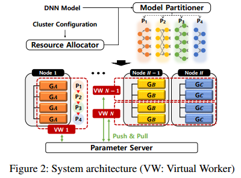
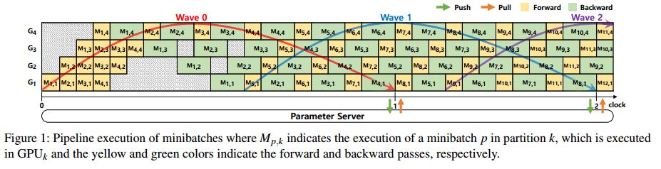
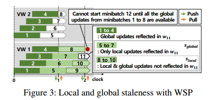
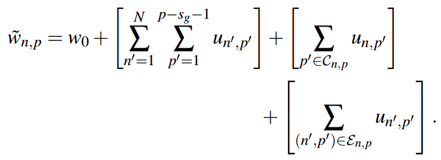
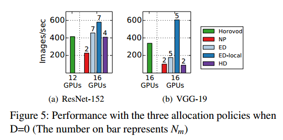

# Abstract

研究了如何在异构GPU集群上启用大型DNN模型的训练。DNN训练系统HetPipe(异构管道)，它将管道模型并行性(PMP)和数据并行性(DP)相结合。 In HetPipe, a group of multiple GPUs, called a virtual worker, processes minibatches in a pipelined manner, and multiple such virtual workers employ data parallelism for higher performance.我们还提出了一种新的参数同步模型，我们称之为波同步并行(WSP)，以适应虚拟工作者的PMP和DP，并提供了WSP的收敛证明。与最先进的DP技术相比，使用HetPipe, DNN模型的收敛速度提高了49%

#  Introduction

为了提高模型的精度和质量以及处理数据的复杂特征，DNN模型的规模(即参数的数量)不断增加[19,47,54,55]。用于训练的输入数据和批次的大小也有所增加，以达到更高的准确性和吞吐量。对于训练大型DNN模型，通常利用数据并行性[4,31,32,50]和模型并行性[12,28,30]，前者使用参数服务器或AllReduce通信使用多个worker，后者将DNN模型的网络层划分为多个分区，并将每个分区分配给不同的GPU。pipelined model parallelism, where minibatches are continuously fed to the GPUs one after the other and processed in a pipelined manner, has recently been
proposed 

使用异构资源进行DNN训练是有好处的。首先，它允许使用低级gpu进行大型模型训练。由于资源有限，他们无法单独进行培训，但将他们聚集在一起，可以用于培训。这些可能已经退役的gpu变得可用，可能用于创建(虚拟)工作人员，显示出与高级gpu相似的性能。其次，低级gpu可以通过逐步将(旧的)低级系统的资源添加到(新的)高级系统中来提高高级gpu的性能。We call a group of aggregated GPUs that could satisfy the resource constraint and be used for training a virtual worker. Internally, such a virtual worker could leverage pipelined model parallelism (PMP) to process a minibatch, while externally, a number of virtual workers could leverage data parallelism (DP) for higher performance.

每个虚拟工作者都以流水线的方式连续处理多个minibatch，因此，所有虚拟工作者都可以处于不同的状态。这里的关键问题是，每个虚拟工作者应该使用哪个权重版本来与其他虚拟工作者同步?为了回答这个问题，需要回答许多问题: 1) How many new minibatches can start being processed while waiting for global updates from the parameter server?2.Can synchronization occur at any point of processing the minibatches? 3) How can convergence be guaranteed when such synchronization occurs? 4) What version of parameters is used for the next minibatch while previous minibatches are still executing within each virtual worker? 如何将异构GPU划分并分配到虚拟工作器中?当我们考虑DP时，我们如何减少虚拟员工掉队?我们如何划分模型以最大化使用异构gpu的PMP的性能?（pipelined model parallelism）

我们设计了一个DNN训练系统HetPipe(异构管道)，该系统集成了由多个异构gpu组成的虚拟worker的PMP和使用参数服务器的虚拟worker的DP，以启用并加速大型模型的训练。HetPipe可以将来自多个gpu的异构资源聚合成一个虚拟worker，使得每个虚拟worker的性能都差不多，减少了离散问题。对于HetPipe，我们提出了一种新的参数同步模型，我们称之为波同步并行(WSP)。WSP改编自陈旧同步并行(SSP)模型

我们通过修改TensorFlow(一个常用的机器学习训练系统)来实现HetPipe。我们的实验结果表明，HetPipe的性能优于通过Horovod[50]使用AllReduce通信的最新DP[45]。这是因为HetPipe减轻了离散问题，还因为it enables each virtual worker and the parameter server to intra-communicate for all parameter updates, significantly reducing communication overhead.（？）

我们提出了一个保证收敛的参数同步模型

# Background

## Data Parallelism

数据并行(DP)利用多个工作者来加快深度神经网络模型的训练速度。它将训练数据集划分为子集，并为每个工人分配一个不同的子集。每个工人都有一个DNN模型的副本，并处理子集中的每个小批，从而计算权重更新。因此，如果不能将DNN模型加载到单个GPU的内存中，则不能使用DP。

在多个worker中，参数通过参数服务器[31]或AllReduce通信[32,50]进行同步。For Bulk Synchronous Parallel (BSP) [1, 35], each worker must wait for all other workers to finish the current minibatch p before it starts to process the next minibatch p+1 so that it can use an updated version of the weights for minibatch p + 1.(算完一个batch同步一次) For Asynchronous Parallel (ASP) [1, 48], each worker need not wait for other workers to finish minibatch p, possibly using a stale version of the weights。With BSP, which is possible for both the parameter servers and AllReduce communications, the system may suffer from high synchronization overhead, especially in a heterogeneous GPU cluster where each worker with a different GPU provides different training performance [33].虽然ASP(对于参数服务器来说是可能的)没有同步开销，但众所周知，ASP并不能保证收敛[48,58]。

一种介于BSP和ASP之间的方法是陈旧同步并行(Stale Synchronous Parallel, SSP)[18]。使用SSP，允许每个工作人员使用可能不反映其他工作人员计算的最新更新的过时版本的权重进行小批的训练。因此，当它完成一个小批处理时，工作线程不需要与其他工作线程同步。因此，可能会出现参数过时的情况。但是，这种过时是由用户定义的，称为过时阈值。由于SSP在 worker performance is varied时是有益的。

在SSP中，每个worker周期性地将权重更新推送到参数服务器。这个同步间隔称为时钟。each worker increases its local clock by one for every iteration, which is the training period of a minibatch。For a given staleness threshold s where s ≥ 0, each worker with clock c is allowed to use a stale version of the weights, which includes all the updates from iteration 0 to c−s−1 and, possibly, more recent updates past iteration c − s − 1. That
is, a worker can continue training of the next minibatch with parameters whose updates may be missing from up to the s most recent minibatches（参数服务器怎么工作？）

## Model Parallelism and Pipeline Execution

模型并行性(MP)通常用于大型DNN模型，这些模型太大而无法加载到单个GPU的内存中。在同一GPU上执行分区的前向和后向传递是很重要的，因为在前向传递期间为minibatch计算的激活结果需要保存在GPU内存中，直到相同minibatch的后向传递才能有效收敛。否则，通过重新计算或内存管理来管理激活将产生相当大的额外开销。

In the basic form of MP, For each minibatch, execution of the forward pass starts from GPU1 up to GPUk. When each GPUi, where 1 ≤ i < k, completes the forward pass of the assigned partition, it sends the computed activations of only the last layer in its partition to GPUi+1. Once GPUk finishes the forward pass of its partition, the backward pass of the minibatch is executed from GPUk down to GPU1. When each GPUi , where 1 < i  ≤ k, finishes the backward pass, it sends the computed local gradients of only the first layer in its assigned partition to GPUi−1。这种基本形式的MP导致低GPU利用率，因为只有一个GPU正在积极执行向前或向后传递。

为了提高虚拟worker中gpu的利用率，一旦GPU完成前一个minibatch的处理，随后的minibatch将一个接一个地馈送到MP中的第一个GPU(即GPU1)中。这允许多个gpu同时为不同的minibatch执行其指定层的向前或向后传递。这被称为流水线模型并行(PMP)。

PipeDream exploits PMP of a single virtual worker to avoid the parameter communication overhead of DP [38]. 只考虑同构GPU，当PipeDream将模型划分为阶段以最大化流水线性能时，它没有考虑依赖于流水线阶段的GPU的内存需求。因此，PipeDream处理有限数量的小批，这足以使管道饱和，以减少内存开销。PipeDream也提供了一种DP形式，但它在虚拟工作者中考虑DP，以加快滞后层的执行速度。在PipeDream中没有提供单管道收敛的证明。如果没有参数同步模型(如WSP)，就不可能通过参数服务器或AllReduce通信在多个PipeDream虚拟工作者上正确运行DP（？）

GPipe是一种利用单个虚拟worker的PMP来支持大型DNN模型的方案，也是在同构GPU集群中[19]。a minibatch is divided into multiple microbatches that are injected into the pipeline. When the backward pass of the last microbatch is done, it updates the weights all together for the minibatch.频繁的管道刷新，可能导致GPU利用率低[38]。在GPipe中，多个虚拟worker的DP可以使用现有的同步方案(如BSP)来完成，因为一个虚拟worker每次处理一个minibatch。GPipe通过在向后传递中再次重新计算激活来节省GPU内存，而不是在内存中保持在向前传递中计算的激活。我们不使用这种优化，尽管没有根本的理由禁止它。

#  System Overview

图2展示了由H个节点组成的集群系统的架构。每个节点包含一组同构的gpu，但是节点本身的gpu(和内存容量)可以是异构的。

我们是第一个在异构环境中提出PMP的人。

资源分配器首先根据资源分配策略为每个虚拟worker分配k个gpu.资源分配策略必须考虑几个因素，例如单个gpu的性能以及在虚拟工作线程内发送激活和梯度所引起的通信开销，以及同步虚拟工作线程和参数服务器之间的权重。然后，对于给定的DNN模型和分配的k个gpu，模型分区器将模型划分为k个分区用于虚拟worker，以便在虚拟worker中执行的管道的性能可以最大化。在HetPipe中，参数服务器用于维护全局权重。每个虚拟worker都有全局权重的本地副本，并定期与参数服务器同步权重。显然，在管理虚拟工作人员内部和虚拟工作人员之间的权重时，需要允许两种类型的过期，本地过期和全局过期，以提高DNN训练的性能。本地过期是指虚拟工作者内部的过期。由于每个虚拟工作者以流水线方式处理小批，因此有多个小批正在并行处理。因此，由于小批量看到的权重可能无法反映其以前所有小批量的更新，因此过时是不可避免的。另一方面，全局陈旧性与Ho等人[18]提出的陈旧性概念相似。也就是说，系统需要减少参数服务器和虚拟工作者之间的通信开销，在我们的示例中，还可以减轻可能由异构虚拟工作者引起的同步开销。与SSP[18]类似，应该允许每个虚拟worker在不查询每个minibatch的全局权值的情况下继续训练，除非它的本地副本太旧，以至于其他虚拟worker丢失了太多最近的更新。注意，该过期条件由用户自行设置[18]。

我们提出了波同步并行(WSP)模型来同步权重。波是在虚拟工作者中并发处理的一系列小批。设一个波中的小批数为Nm。在一个波内，允许第i个minibatch的处理不需要等待前一个minibatch完成，在同一波中，小批使用的权重之间没有依赖关系。由于虚拟工作者不强制更新，即使是来自波中的第一个小批量的更新也不会反映在最后一个小批量使用的权重中，因此WSP中的本地过期阈值为Nm−1。此外，每个虚拟工作者只将一个波中所有minibatch的聚合更新推送到参数服务器，而不是每个minibatch。这大大减少了通信开销。

HetPipe使用参数服务器，这可能会导致同步和通信开销。However, HetPipe mitigates such overhead by permitting global staleness among virtual workers and executing the pipeline in each virtual worker such that it continues to process minibatches that have already been injected while waiting for the parameter update.

# Pipelined Model Parallelism Within a VW

给定一个DNN模型和k个gpu，虚拟worker中并发执行的最大minibatch数Maxm基本上由训练模型所需的内存决定。对于需要大量内存用于输出激活和权重的模型，Maxm可能小于k。注意，在这种情况下，每个GPU的利用率不太可能很高。Nm，管道中实际的小批量数量将为Nm≤Maxm，基本由考虑管道的吞吐量来决定。注意，每个虚拟工作者中的Nm必须相同，因此，Nm被设置为所有虚拟工作者中最小的Maxm。Nm将影响我们在本节后面讨论的本地过期性

分区算法的目标是最大化管道的性能，同时满足每个分区处理Nm minibatch的内存需求。实际内存需求将根据GPU所使用的管道阶段而变化。 GPU4, the GPU that handles the last stage of the pipeline, handles only one minibatch at a time and is immediately done with the
minibatch as exemplified by the yellow (forward pass) and green (backward pass) Mi;4 pairs for i = 1;2;:::, that are sideby-side. for GPU1, the yellow and green Mi;1 pairs are far apart, meaning that the forward pass Mi;1 needs to hold up memory until the backward pass Mi;1 is finished with its execution. Thus, with GPU1, the memory requirement is high as it needs to hold on to the results of the forward pass for all stages of the pipeline.在划分层时考虑了内存需求的这种差异。

在划分层时还必须考虑执行时间。将分区的执行时间计算为分区中所有层的计算时间和接收激活(向前传递)和局部梯度(向后传递)所需的通信时间的总和。（和pipedream不一样）我们的分区算法试图在满足内存需求的范围内最小化分区的最大执行时间。

分区调度:设置分区后，需要为每个gpu调度分区。负责分区q的每个GPUq可以同时调度多个向前传递和向后传递任务。每个GPU通过执行以下条件来调度任务:

1. A forward pass task for a minibatch p will be executed only after a forward pass task for every minibatch $p'$ is done where 1 ≤ $p'$ < p.
2. Similarly, a backward pass task for a minibatch p will be executed only after a backward pass task for every minibatch p0 is done where 1 ≤ p0 < p.
3. Among multiple forward and backward pass tasks, a FIFO scheduling policy is used.

在最后一个分区中，对于一个minibatch，处理一个向前传递紧接着一个向后传递是作为单个任务执行的。

在调度minibatch时，各层可能没有使用最新的权值。when the forward pass M2;1, it must use stale weights as the first minibatch has not completed and hence, the changes
in the weights due to the first minibatch have not yet been appropriately reflected, which is in contrast with typical processing where minibatches are processed one at a time

Let local staleness be the maximum number of missing updates from the most recent minibatches that is allowed for a minibatch to proceed in a virtual worker. the local staleness threshold, $s_{local}$, is determined as Nm −1。 If Nm = 1, the behavior is exactly the
same as naive model parallelism. Larger Nm may improve the performance (i.e., throughput) of the pipeline as a larger number of concurrent minibatches are executed, but local staleness increases, possibly affecting the convergence of training。在实际设置中，Nm通常不会大到足以影响收敛，因为它将受到虚拟工作者的GPU内存总量的限制。这种局部陈腐在PipeDream中也存在[38]。由于PipeDream基本上使用权重存储，它使用每个分区上可用的最新版本的权重来执行minibatch的前向传递，因此对于同一个minibatch，不同分区之间使用不同版本的权重。Unfortunately, PipeDream only shows empirical evidence of convergence when weight stashing is used. Note that PipeDream also discusses vertical sync, which is similar to HetPipe, but it excludes vertical sync in its evaluations [38]

Now let $w_p$ be the weights used by minibatch p. Then, initially, we can assume that $w_0$, the initial version of weights, is given to the virtual worker. Then, the first ($s_{local}$ +1) minibatches are processed in a pipelined manner with w0 = w1 =··· = $w_{s_{local}}$ = $w_{s_{local}+1}$.

when processing of minibatch p completes, the virtual worker updates the local version of the weights, wlocal as $w_{local}$ = wlocal + $u_p$, where up is the updates computed by processing minibatch p. weights are not updated layer by layer and wlocal is a consistent version of weights across partitions.（在最后一个stage在一起更新?) When the virtual worker starts to process a new minibatch, it makes use of the latest value of wlocal without waiting for the other minibatches to update their weights.(用最新的参数) once the virtual worker is done for minibatch 1 and updates wlocal with u1, it will start to process minibatch slocal +2 by using the updated weights without waiting for minibatches 2 up to slocal +1 to be completed.  when the virtual worker is done with minibatch slocal +1 and updates wlocal with uslocal+1, it will start to process minibatch 2×(slocal +1) without waiting for the previous most recent slocal minibatches to be completed. except for the initial minibatches 1 to slocal + 1, for minibatch p the virtual worker will use the version of the weights that reflects (at least)(为什么at least？不是确定的吗) all the local updates from minibatches 1 to p−(slocal +1). Note that for every minibatch p, wp must be kept in GPU memory until the backward pass for p is executed

SSP中的过期是由多个工人之间的小批量处理速度不同引起的。因此，在SSP中，过时被用作减少同步和通信开销的一种手段。然而，HetPipe中的本地过期是由于在虚拟工作者中以流水线方式处理小批而固有地造成的

# Data Parallelism with Multiple VWs

对虚拟工作者支持的DP的第一个也是最重要的观察是，虚拟工作者可能由(古怪的)异构gpu组成。虽然众所周知，DP有助于加快DNN的执行，但在典型系统中，如果单个gpu(即工作人员)没有足够的资源来处理DNN模型，特别是大型DNN，则DP是不可能的。通过允许一个虚拟工作者由多个缺乏资源的gpu组成，我们的系统允许DP，即使是在性能不佳的gpu上。（可以用比较差的gpu）

使用虚拟工作者正确支持DP的另一个关键观察是，每个虚拟工作者现在都保留了第4节中讨论的本地过期性。Making sure that, despite such individual staleness, we understand and show that the results obtained from DP among virtual workers (globally) converge is an important issue that must be addressed.

## Workings of WSP

We assume that such synchronization occurs in clock units, a clock unit is defined as the progress of completing one wave. a wave is a sequence of slocal +1 minibatches concurrently executed such that a virtual worker is allowed to process a later minibatch in a wave without updates from an earlier minibatch in the same wave.

each virtual worker maintains a local clock $c_{local}$, while the parameter server maintains a global clock $c_{global}$, which holds the minimum $c_{local}$ value of all the virtual workers. Initially, the local clocks and the global clock are 0. At the end of every clock c, each virtual worker completes the execution of all the minibatches in wave c。the virtual worker computes the aggregated updates from minibatch c × (slocal + 1) + 1 to minibatch (c+1)×(slocal +1) and pushes the updates u to the parameter server.  It is important to note that in WSP, the virtual worker pushes u to the parameter server for every wave, instead of pushing u for every minibatch, which will significantly reduce the communication overhead. at the end of clock 0, the virtual worker pushes the aggregated updates of wave 0, which is composed of minibatches from 1 to 4（clock是周期）

When the parameter server receives the updates u from the virtual worker, the parameter server updates the global version of the weights as wglobal = wglobal+ u. Note that the parameter server updates its $c_{global}$ to c+1 only after every virtual worker has pushed the aggregated updates of wave c.(等于最慢的周期)

In WSP, each virtual worker is allowed to proceed training without retrieving the global weights for every wave. (要推送更新，不一定要取) the virtual worker may use a weight version that, from a global standpoint, may be stale, as the most recent updates received by the parameter servers may not be reflected in its local version of the weights.（别人的更新看不到）

## Global Staleness Bound

Let clock distance be the difference in clocal between the fastest and slowest virtual workers in the system. Therefore, a virtual worker with local clock c, where c ≥ D + 1, must use a version of the weights that includes all the (aggregated) updates from wave 0 up to c−D−1.  the weight version may include some recent global updates from other virtual workers and some recent local updates within the virtual worker beyond wave c−D−1.（取到（同样比最慢快的worker的更新）最新的参数？还有自己的更新）

When a virtual worker pulls the global weights at the end of clock c to maintain this distance（要取c+1的版本）, it may need to wait for other virtual workers to push their updates upon completion of wave c−D.（保持差距）while a virtual worker waits for other virtual workers to possibly catch up at the end of clock c, local processing is allowed to proceed with slocal minibatches of wave c+1 as the minibatches are executed in a pipelined manner. 

when D = 0 and slocal = 3, VW1, completes minibatch 4, it computes the aggregated updates u for wave 0 (composed of minibatches 1 to 4) and pushes u to the parameter server. VW1 now waits for the other virtual workers to complete wave 0 before proceeding with minibatch 8. VW1 has already started to process minibatches 5, 6 and 7, which belong to wave 1,
while its local clock is still 0.(不能更新周期，不能处理新数据)

when D = 0, each virtual worker must wait for each other at the end of every clock to synchronize the weights for every wave, which is BSP-like behavior with pipelined execution in
each virtual worker.

let us define the global staleness bound, $s_{global}$, to be the maximum number of missing updates from the most recent minibatches, globally computed by all the other virtual
workers in the system, that is allowed for a minibatch to proceed in a virtual worker.(?) This will allow each virtual worker to determine whether it can proceed with its current minibatch.

Initially, all virtual workers start processing the first (D+1) waves without querying the global weights from the parameter server. Furthermore, they can start to process up to $s_{local}$ (5,6,7)
minibatches of the next wave before receiving the global weights that include the recent updates as discussed above. for those initial minibatches, the virtual worker uses w0 or a weight version that may include some recent local updates.

For any minibatch p thereafter, that is, where p > (D+1)×(slocal +1) +slocal, p must use a weight version that reflects, at the very least, all the global updates from all the other virtual workers from minibatch 1 to minibatch p−(sglobal +1), where sglobal = (D + 1) × (slocal + 1) + slocal − 1. （看下面例子）

VW1 proceeds the training of minibatch 11（周期1） without the global and/or local updates from wave 1 (minibatches 5 to 8) or the two local updates from minibatches 9 and 10 (i.e., having sglobal = 6). Thus, it must have a version of the weights that includes all the global updates from minibatches 1 to 4.

# Convergence Analysis

Let N be the number of virtual workers and $u_{n,p}$ be the update of worker n at minibatch execution p. Let $s_g = s_{global}$ and $s_l = s_{local} + 1$

# Partitioning Algorithm

分区算法的目标是在满足内存需求的范围内最小化分区的最大执行时间。为了获得一个性能模型来预测异构GPU中模型每一层的执行时间，我们首先在集群中每个不同类型的GPU上对DNN模型进行分析，在那里我们测量模型每一层的计算时间。对于GPU内存使用，我们仅在一种GPU类型上测量每层的使用情况(通过使用TensorFlow的日志记录功能)(因为所有GPU类型的使用情况大致相同)。For profiling the memory usage on a whimpy node, we measure the memory usage of each layer using a small batch size and then multiply it for the target batch size. To compute the memory requirement for a given partition, we take into account the total memory usage to store the data to process the layers as well as the maximum number of minibatches concurrently assigned to the partition

对于模型中各层之间的通信时间，我们首先从模型图中导出前向和后向传递中每层的输入数据量。对于给定的数据大小，我们基于PCI-e带宽预测节点内通信，然后将其乘以一个按比例缩小的常数(这在Paleo[46]中也是类似的)，因为在实践中，不可能利用峰值带宽。缩放常数是通过运行一个综合模型得出的，该模型将不同大小的数据从一个GPU发送到同一节点的另一个GPU。对于节点间通信(通过InfiniBand)，我们使用线性回归来估计给定数据大小的通信时间。To build a prediction model, we collect 27 samples by training two DNN models, used in our experiments, with arbitrary partitions. 请注意，在这项工作中，没有考虑网络性能的异质性，如慢速网络链路(如[33])。然而，对于这种情况，我们可以扩展我们的分区算法，在估计通信时间时考虑两个节点之间不同的网络性能。此外，更准确地估计每个阶段的内存需求的模型将有助于以更平衡的方式划分DNN模型。

为了找到DNN模型的最佳分区，我们使用了CPLEX，它是解决线性规划问题的优化器[20]。The memory requirement for each partition on the pipeline to support Nm concurrent minibatches is provided as a constraint to the optimizer.该算法只有在找到满足给定gpu内存需求的分区时，才会返回具有特定批处理大小的模型的分区。此外，优化器检查给定异构gpu的所有不同顺序，以便为单个虚拟worker进行分区并在其上放置DNN模型的层。

# Experimental Results

利用CUDA 10.0和cuDNN 7.4修改TensorFlow 1.12 version3，实现了基于WSP模型的HetPipe。

主要性能指标是训练DNN模型的吞吐量(图像/秒)。

给定16个gpu, HetPipe使用四个虚拟工人，每个工人配置四个gpu，并遵循以下三个分配策略。

Node Partition (NP):该策略为每个虚拟工作者分配一个节点。因此，每个虚拟工作者都是由同构gpu组成的。因此，由于节点是异构的，DNN模型的层划分对于每个虚拟工作者是不同的。NP使得每个虚拟工作者内的通信开销最小，因为gpu之间的通信是通过PCI-e在同一节点内进行的，而不是通过InfiniBand跨多个节点进行通信。另一方面，由于每个虚拟工作线程的性能不同，离散线程可能会降低DP的性能。

ED (Equal Distribution):将每个节点上的gpu平均分配给每个虚拟worker。因此，每个虚拟工作者被分配四个不同的gpu，但每个虚拟工作者都有完全相同的资源。因此，模型划分是相同的，因此，性能将是相同的。ED会导致每个虚拟工作者内部的高通信开销。

混合分布(HD):此策略是NP和ED的混合。对于我们的集群，将两种GPU类型的组合分配给每个虚拟工作者，以便它们在聚合计算能力和GPU内存数量方面的性能彼此相似。这样做是为了减轻离散者问题，同时减少每个虚拟工作者内部的通信开销。计算能力方面为V > R > G > Q, GPU内存数量方面为R > V > Q > G，分配2个虚拟worker为VVQQ，分配2个虚拟worker为RRGG，其中V、R、G、Q分别代表TITAN V、TITAN RTX、GeForce RTX 2060、Quadro P4000。

for DP, we locate the parameter servers, each of which only handles a portion of the model parameters, over all the nodes. 对于默认放置策略，它可以与我们的所有三个资源分配策略一起使用，我们将模型的层以循环方式放置在所有参数服务器上，就像TensorFlow[53]中一样。然而，对于ED来说，另一种政策是可能的，我们称之为“ED-local”。使用“ED-local”，我们将分区的各个层放在运行在同一节点上的参数服务器上，这样就不会产生跨节点的实际网络流量来进行参数同步。这是可能的，因为模型的相同分区可以在本地为每个虚拟工作者分配给同一节点上的GPU。对于以后报告的所有结果，除“EDlocal”外，都使用“default”策略。

## Performance of a single virtual worker

随着Nm的增加，虚拟工作者的标准化吞吐量以及最大GPU利用率通常会增加。当为虚拟worker配置同构GPU时，每个分区的平均GPU利用率是相似的。但在配置异构图形处理器时，会出现第一个或最后一个分区的图形处理器利用率高于其他分区的趋势。

## Performance of multiple virtual workers

其中“Horovod”表示通过Horovod使用AllReduce通信的最先进的DP。对于每个资源分配策略，设置Nm以使性能最大化。

对于参数大小为548MB的VGG-19, Horovod的性能优于NP、ED和HD，因为Horovod减少了参数同步的通信开销。

使用NP时，ResNet-152和VGG-19的训练性能较低，因为Nm被具有最小GPU内存的虚拟工作者所限制。

使用ED-local，每个GPU和参数服务器之间进行内部通信，大大减少了节点间的通信开销.对于VGG-19，使用ED-local的每个minibatch在节点间传输的数据量(即103MB)比使用Horovod的(即515MB)要小得多。对于ResNet-152，使用ED-local传输的数据量(即298MB)比使用Horovod传输的数据量(即211MB)要大，因为要在分区之间发送的输出激活的大小很大，尽管参数大小相对较小。但是，ED-local的吞吐量仍然比Horovod高40%。这是因为Hetpipe允许每个虚拟工作者并发地处理大量的minibatch。与NP和HD相比，ED-local (ED)通常在每个虚拟工作者中具有更大的Nm，从而提高了吞吐量。

Next, we investigate how the throughput is improved when whimpy GPUs are additionally used for training. the performance of both Horovod and HetPipe increases when additional whimpy GPUs are used for training. With additional GPUs, HetPipe can increase the
total number of concurrent minibatches processed, having up to 2.3 times speedup. This scenario can be thought of as an answer to when new, higher end nodes are purchased, but one does not know what to do with existing nodes. 

# Convergence

基于WSP模型的HetPipe保证收敛。当使用同一组gpu时，HetPipe的收敛速度比Horovod快35%，因为它减少了异构环境中的离散问题，并同时利用了PMP和DP。此外，通过增加四个gpu, HetPipe提高了训练性能，收敛速度比Horovod快39%

HetPipe使用类bsp配置(即D = 0)的收敛速度比使用Horovod的收敛速度大约快29%。当我们将D增加到4时，离散效应得到了缓解，并且由于参数同步而导致的通信开销减少了。因此，与D = 0和Horovod相比，收敛速度分别快了28%和49%。当D变得非常大(即32)时，吞吐量保持相似，但收敛性能下降4.7%，与D = 4相比。这是因为最快和最慢的虚拟工作者之间的时钟距离不太可能达到32，但是更高的全局陈旧性会降低收敛性能(在[18]中进行了类似的讨论)。

随着D的增加，虚拟工人接收更新的全局权重的等待时间减少。在我们的实验中，发现D = 4时的平均等待时间是D = 0时的62%。此外，实际空闲时间仅为等待时间的18%，因为虚拟worker可以在等待期间继续在管道中运行。

#  Discussion

PipeDream[38]是最相关的研究，它优化了单个虚拟worker的PMP，仅在同构环境中对虚拟worker中的滞后层使用DP。使用PipeDream测量的最佳吞吐量是158。回想一下，Horovod(带有12个gpu)和HetPipe的吞吐量分别是415和580。因为除了次优分区之外，大量分区会导致高网络开销。因此，单独使用PMP(即单个虚拟工作者)，当模型被划分为多个分区时，性能优势可能会受到限制。与增加分区不同，使用多个虚拟工作者(如HetPipe)运行DP可以提高训练的并行性，并在这种情况下进一步提高性能

对于由少量层组成的模型，如果一层的执行时间比其他层长得多，则分区最终可能具有不同的执行时间。在这种情况下，与其他基于管道的系统一样，管道的性能将会下降。请注意，为慢分区运行DP，以便在所有分区(如PipeDream[38])上具有相似的处理速率，这可能是HetPipe的一种扩展。

#  Related Work

PipeDream[38]中提出的重叠计算和通信的特征也将提高我们系统的性能。

# Conclusion

virtual worker：PP

1f1b，在最后一个stage再一起更新，新的minbatch用最新的参数

聚合同一波内所有更新到参数服务器，取全局参数（只有一份）

最快和最慢的worker有最大周期差距，取全局参数可能要阻塞（不能更新周期，不能执行新数据）

# .

a group of multiple GPUs, called a virtual worker, processes minibatches in a pipelined manner, and multiple such virtual workers employ data parallelism for higher performance.

whimpy GPUs that, as a standalone, could not be used for training large models. 

Our experimental results demonstrate that the performance of HetPipe is better than that of the state-of-the-art DP via Horovod [50] that uses AllReduce communication [45]. This is because HetPipe mitigates the straggler problem,（不同worker能力相对） and also because it enables each virtual worker and the parameter server to intra-communicate for all parameter updates, significantly reducing communication overhead.(一边计算一边同步)

Evidently, when managing the weights within a virtual worker and across virtual workers, two types of staleness, local staleness and global staleness, need to be permitted to improve the performance of DNN training.

A wave is a sequence of minibatches that are processed concurrently in a virtual worker.

As the virtual worker does not enforce the updates even from the first minibatch in a wave
to be reflected in the weights used by the last minibatch, the local staleness threshold in WSP is Nm −1. Moreover, each virtual worker only pushes the aggregated updates from all the minibatches in a wave, instead of for every minibatch, to the parameter server. 

Note that HetPipe uses parameter servers, which may incur synchronization and communication overhead. However, HetPipe mitigates such overhead by permitting global staleness among virtual workers and executing the pipeline in each virtual worker such that it continues to process minibatches that have already been injected while waiting for the parameter update.

In a real setting, typically, Nm will not be large enough to affect convergence as it will be bounded by the total amount of GPU memory of a virtual worker

Note that PipeDream also discusses vertical sync, which is similar to HetPipe, but it excludes vertical sync in its evaluations [38].（是一样的，只是一个stage之间异步更新，一个stage之间同步更新）

when processing of minibatch p completes, the virtual worker updates the local version of the weights

weights are not updated layer by layer and wlocal is a consistent version of weights across partitions.

a clock unit is defined as the progress of completing one wave. （两个波时间之差，一个波后向的时间）

each virtual worker maintains a local clock clocal, while the parameter server maintains a global clock cglobal

At the end of every clock c, each virtual worker completes the execution of all the minibatches in wave c. At this point, the virtual worker computes the aggregated updates from minibatch c × (slocal + 1) + 1 to minibatch (c+1)×(slocal +1) and pushes the updates u to the parameter ˜
server. 

Note that the parameter server updates its cglobal to c+1 only after every virtual worker has pushed the aggregated updates of wave c.

In WSP, each virtual worker is allowed to proceed training without retrieving the global weights for every wave. （要更新参数，不一定需要所有的梯度）

Let clock distance be the difference in clocal between the fastest and slowest virtual workers
in the system. 

a virtual worker with local clock c, where c ≥ D + 1, must use a version of the weights that
includes all the (aggregated) updates from wave 0 up to c−D−1. Also, the weight version may include some recent global updates from other virtual workers and some recent local updates within the virtual worker beyond wave c−D−1.

When a virtual worker pulls the global weights at the end of clock c to maintain this distance, it may need to wait for other virtual workers to push their updates upon completion of wave c−D.（如果全部完成，就不用阻塞，但还是要更新参数）

However, while a virtual worker waits for other virtual workers to possibly catch up at the end of clock c, local processing is allowed to proceed with slocal minibatches of wave c+1 as the minibatches are executed in a pipelined manner. 

VW1 now waits for the other virtual workers to complete wave 0 before proceeding with minibatch 8. However, note that as shown in the figure, VW1 has already started
to process minibatches 5, 6 and 7, which belong to wave 1, while its local clock is still 0.

Actually, the weight version used for minibatch 11 includes three local updates from minibatches 5, 6, and 7, along with all the global updates from wave 0. In case of minibatch 12, it cannot start the training until global updates up to minibatch 8 are received.

for VGG-19 whose parameter size is 548MB, the performance of Horovod, which
reduces communication overhead for parameter synchronization, is better than those of NP, ED, and HD.

for ResNet-152 whose parameter size is 230MB, ED and HD, which utilize virtual workers with similar performance, show a bit better or similar performance to Horovod (with 12 GPUs).

When the same set of GPUs are used, convergence with HetPipe is 35% faster than that of Horovod by reducing the straggler problem in a heterogeneous environment and exploiting both PMP and DP.

As we increase D to 4, the straggler effect is mitigated and the communication overhead due to parameter synchronization is reduced. Thus, convergence is faster by 28% and 49%
compared to D = 0 and Horovod, respectively.

This is because it is unlikely that the clock distance between the fastest and slowest virtual workers becomes as large as 32, but higher global staleness can degrade the convergence performance (similarly discussed in [18]).

We find that as D increases, the waiting time of a virtual worker to receive the updated global weights decreases.