# ABSTRACT

如何将张量、管道和数据并行性组合起来以扩展到数千个gpu。We propose a novel interleaved pipelining schedule that can improve throughput by 10+% with memory footprint comparable to existing approaches. 

# INTRODUCTION

即使是最大的GPU (NVIDIA最近发布的80GB-A100卡)，也不可能在主内存中拟合这些模型的参数，即使我们能够在单个GPU中拟合模型(例如，通过在主机和设备内存之间交换参数[38])，所需的大量计算操作可能导致不切实际的长训练时间

Data-parallel scale-out usually works well, but suffers from two limitations（不能扩展并行性）: a) beyond a point, the per-GPU batch size becomes too small, reducing GPU utilization and increasing communication cost, and b) the maximum number of devices that can be used is the batch size, limiting the number of accelerators that can be used for training。tensor (intra-layer) model parallelism, where matrix multiplications within each transformer layer are split over multiple GPUs, can be used to overcome these limitations. （？）尽管这种方法在NVIDIA DGX A100服务器(带有8个80GB-A100 gpu)上的200亿个参数的模型上工作得很好，但它不适用于更大的模型。Larger models need to be split across multiple multi-GPU servers, which leads to two problems: (a) the all-reduce communication required for tensor parallelism needs to go through inter-server links, which are slower than the highbandwidth NVLink [9] available within a multi-GPU server, and (b) a high degree of model parallelism can create small matrix multiplications (GEMMs), potentially decreasing GPU utilization.

A batch is split into smaller microbatches, and execution is pipelined across these microbatches. The layer assignment and scheduling strategy results in different performance tradeoffs. Regardless of schedule, to preserve strict optimizer semantics, optimizer steps need to be synchronized across devices, leading to a pipeline flush at the end of every batch, where microbatches are allowed to complete execution (and no new microbatches are injected). As much as 50% of time can be spent flushing the pipeline depending on the number of microbatches injected into the pipeline. 微批数与管道尺寸之比越大，管道冲洗所用时间越短。因此，为了实现高效率，通常需要更大的批量。在这项工作中，我们还引入了一种新的流水线计划，以提高小批量生产的效率。

如何结合并行技术来最大限度地提高给定批处理大小的大型模型的训练吞吐量，同时保持严格的优化器语义?

Our method leverages the combination of pipeline parallelism across multi-GPU servers, tensor parallelism within a multi-GPU server, and data parallelism, to practically train models with a trillion parameters with graceful scaling in an optimized cluster environment with high-bandwidth
links between GPUs on the same server and across servers.我们展示了接近线性扩展到3072个A100 GPU，使用混合精度具有一万亿参数的GPT模型[11]。这种吞吐量促进了实际培训时间。我们还比较了ZeRO[36]，发现对于具有1750亿个和5300亿个参数的模型，由于较少的跨节点通信，我们的方法比ZeRO-3的性能高出70%。这些模型太大了，不适合多gpu服务器。

Achieving this throughput at scale required innovation and careful engineering along multiple axes: efficient kernel implementations that allowed most of the computation to be compute-bound as opposed to memory-bound, smart partitioning of computation graphs over the devices to reduce the number of bytes sent over network links while also limiting device idle periods, domain-specific communication optimization, and fast hardware (state-of-the-art GPUs and high-bandwidth links between GPUs on the same and different servers).

the parallelization strategy has an impact on the amount of communication, the compute efficiency with which kernels are executed, as well as the idle time workers spend waiting for computation due to pipeline flushes (pipeline bubbles).张量和管道模型并行性的次优组合可能导致吞吐量降低2倍，即使服务器之间有高带宽的网络链接。tensor model parallelism is effective within a multi-GPU server, but pipeline model
parallelism must be used for larger models.

用于管道并行性的调度对通信量、管道气泡大小和用于存储激活的内存有影响。我们提出了一种新的交错调度，与之前提出的具有可比内存占用的调度相比，该调度可以将吞吐量提高多达10% 

Values of hyperparameters such as microbatch size have an impact on the memory footprint, the arithmetic efficiency of kernels executed on the worker, and the pipeline bubble size. In our experiments, the optimal value of the microbatch size is problem-dependent and can increase throughput by 15%.

在规模上，分布式训练是通信密集型的。使用较慢的节点间互连或更密集的通信分区会影响扩展性能

我们不会自动探索并行策略的搜索空间(如FlexFlow [22]， PipeDream [29]， Tarnawski等[41]和DAPPLE[14])，而是建议启发式(在§3中)，我们发现在实践中工作得很好。

# MODES OF PARALLELISM

我们将管道模型并行性和张量模型并行性(如图2所示的组合)与数据并行性结合起来。我们简称它为PTD-P。

对于不适合单个worker的大型模型，可以在较小的模型分片上使用数据并行性。

## Pipeline Model Parallelism

A batch is split into smaller microbatches; execution is then
pipelined across microbatches.流水线模式需要确保输入在向前传递和向后传递中看到一致的权重版本，以实现定义良好的同步权重更新语义。具体来说，幼稚的流水线可能导致输入在向后传递中看到权重更新，而在向前传递中看不到。

为了准确地保留严格的优化器语义，我们引入了定期的管道刷新，以便在设备之间同步优化器步骤。在每个批处理的开始和结束时，设备都是空闲的。我们将这种空闲时间称为管道气泡，并希望使其尽可能小。. Asynchronous and bounded-staleness approaches such as PipeMare, PipeDream, and PipeDream-2BW [23, 29, 30, 45] do away with flushes completely, but relax weight update semantics.有几种可能的方法可以跨设备调度向前和向后微批;每种方法在管道气泡大小、通信和内存占用之间提供了不同的权衡。

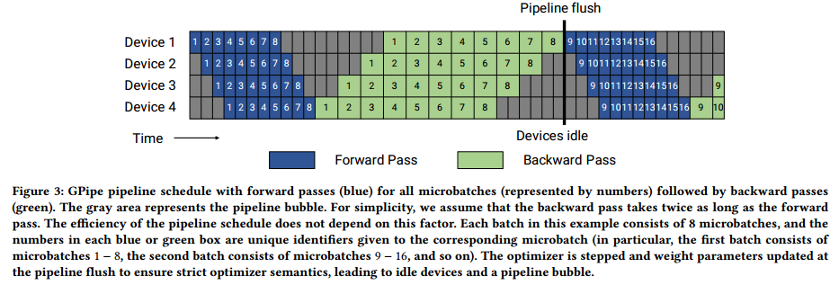

We can quantify the size of GPipe’s pipeline bubble (𝑡𝑝𝑏).
We denote the number of microbatches in a batch as 𝑚, the number of pipeline stages (number of devices used for pipeline parallelism) as 𝑝, the ideal time per iteration as 𝑡𝑖𝑑 (assuming perfect or ideal scaling)（stages并行，串行处理m个数据的时间）, and the time to execute a single microbatch’s forward and backward pass as 𝑡𝑓 and 𝑡𝑏
.  In this schedule, the pipeline bubble consists of 𝑝 − 1 forward passes at the start of a batch, and 𝑝 − 1 backward passes at the end.  The total amount of time spent in the
pipeline bubble is then 𝑡𝑝𝑏 = (𝑝 −1) · (𝑡𝑓 +𝑡𝑏).(最久等待时间) The ideal processing time for the batch is 𝑡𝑖𝑑 = 𝑚 · (𝑡𝑓 + 𝑡𝑏
). Therefore, the fraction of ideal computation time spent in the pipeline bubble is:

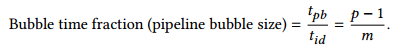

为了使气泡时间分数小，我们需要𝑚>>𝑝。然而，对于如此大的𝑚，这种方法的内存占用很高，因为它需要在训练迭代的整个生命周期内为所有𝑚微批保存隐藏的中间激活(或者使用激活重新计算时每个管道阶段的输入激活)(batch大内存大，batch小计算小)

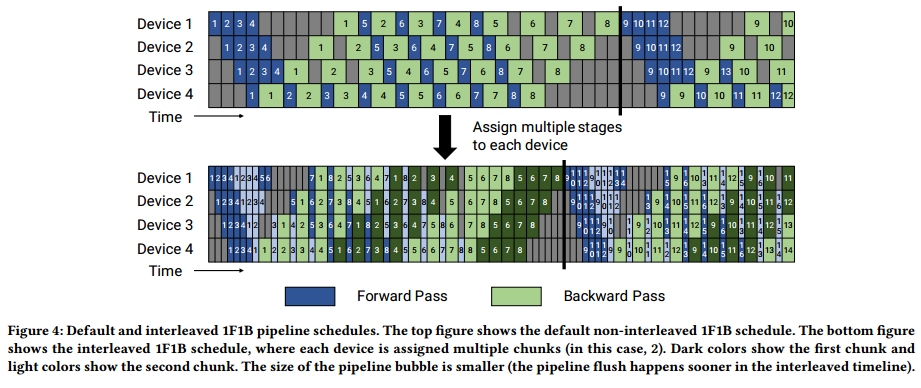

（假设都是切成microbatch，一样数量，一样大小）

我们使用PipeDream-Flush调度[30]。我们首先进入一个热身阶段，工作人员执行不同数量的向前传递，如图4(顶部)所示。This
schedule limits the number of in-flight microbatches (the number of microbatches for which the backward pass is outstanding and activations need to be maintained) to the depth of the pipeline（不能进入太多batch，为什么是microbatch?）, instead of the number of microbatches in a batch(可以切多，但不能同时进多)在热身阶段之后，每个工人进入稳定状态，工人进行一次向前传递，然后进行一次向后传递(简称1F1B)。（这个有flush?，那microbatch合理)最后，在批处理结束时，我们完成所有剩余的飞行微批的向后传递。The time spent in the bubble is the same for this new schedule（和gpipe一样）, but the number of outstanding forward passes is at most the number of pipeline stages for the PipeDream-Flush schedule（活动的数量不超过stage数量）As a result, this schedule requires activations to be stashed for 𝑝 or fewer microbatches (compared to 𝑚 microbatches for the GPipe schedule). Consequently, when 𝑚 ≫ 𝑝, PipeDream-Flush is much more memory-efficient than GPipe.（气泡一样大，活动的数据少，处理的总数一样，内存占用少，这是同步版本？）

To reduce the size of the pipeline bubble, each device can perform computation for multiple subsets of layers (called a model chunk), instead of a single contiguous set of layers. For example, if each device had 4 layers before
(i.e., device 1 had layers 1 − 4, device 2 had layers 5 − 8, and so on), we could have each device perform computation for two model chunks (each with 2 layers), i.e., device 1 has layers 1, 2, 9, 10; device2 has layers 3, 4, 11, 12; and so on. With this scheme, each device in the pipeline is assigned multiple pipeline stages (each pipeline stage has less computation compared to before).（一个gpu对应多个stage，一个数据要在一个设备多次前向后向)

和以前一样，我们可以使用该调度的“全部向前，全部向后”版本，但这将占用大量内存(与𝑚成正比)。(gpipe)相反，我们开发了一个交错调度，它适应了之前的内存高效1F1B调度。这个新的计划如图4所示，它要求批处理中的微批数量是管道并行度(管道中的设备数量)的整数倍。

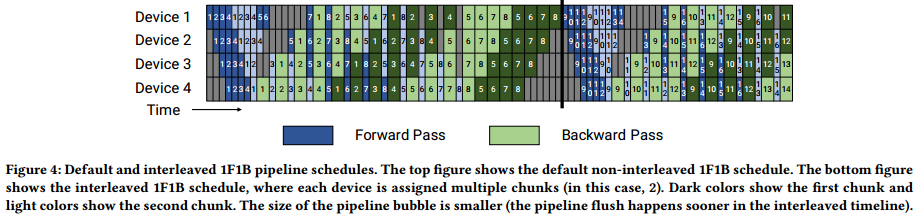

相同批大小的管道刷新在新调度中发生得更快。If each device has 𝑣 stages (or model chunks), then the forward and backward time for a microbatch for each stage or chunk will now be 𝑡𝑓 /𝑣 and 𝑡𝑏/𝑣. The pipeline bubble time thus reduces to (𝑝−1) · (𝑡𝑓 +𝑡𝑏 ) / 𝑣, and the bubble time fraction is then: 

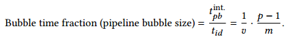

这种减少的管道气泡大小并不是免费的:这个计划需要额外的通信。在数量上，交流的数量也增加了𝑣。在下一节中，我们将讨论如何在多gpu服务器(例如，DGX A100节点)中利用8 InfiniBand网卡来减少这种额外通信的影响(一个机器内为什么要用InfiniBand？)

## Tensor Model Parallelism

利用张量模型并行性，模型的各个层被划分到多个设备上。A transformer layer consists of a self-attention block followed
by a two-layer multi-layer perceptron (MLP). The MLP block consists of two GEMMs and a GeLU non-linearity: 𝑌 = GeLU(𝑋𝐴). 𝑍 = Dropout(𝑌 𝐵).

We can split 𝐴 along its columns 𝐴 = [𝐴1, 𝐴2]. This partitioning allows the GeLU non-linearity to be independently applied to the output of each partitioned GEMM: [𝑌1, 𝑌2] = [GeLU(𝑋𝐴1), GeLU(𝑋𝐴2)].这是有利的，因为它消除了同步的需要(如果沿其行拆分，则需要同步，因为GeLU是非线性的)。

第二个权重矩阵的行可以沿着它的行拆分，以消除gemm之间任何通信的需要(如图5a所示)，𝐵 =[𝐵1;𝐵2], 𝑌 = [𝑌1, 𝑌2].The output of the second GEMM is then reduced across the GPUs before the dropout layer

我们利用多头注意操作中固有的并行性来划分自注意块

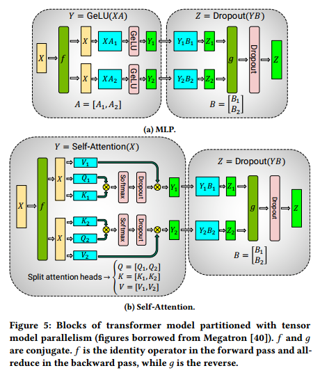

This approach splits GEMMs in the MLP and self-attention blocks across GPUs while requiring only two all-reduce operations in the forward pass (𝑔 operator) and two all-reduces in the backward pass (𝑓 operator). We implemented 𝑓 and 𝑔 in a few lines of code.

all-reduce(reduce+复制到多个GPU用于下个算子)

# PERFORMANCE ANALYSIS OF PARALLELIZATION CONFIGURATIONS
我们将考虑将管道和张量模型并行性与数据并行性相结合对性能的影响。给定固定的gpu预算和批处理大小，可以在PTD-P中使用不同程度的并行类型来训练模型;每个维度都揭示了内存占用、设备利用率和通信量之间的权衡。We present analytical models where relevant for the pipeline bubble size. We qualitatively describe how communication time behaves and present cost models for amount of communication; （通信量）however, we do not present direct cost models for communication time（通信时间还要考虑带宽）, which is harder to model for a hierarchical network topology where interconnects between GPUs on the same server have higher bandwidth than interconnects between servers.

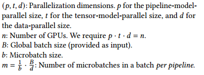

## Tensor and Pipeline Model Parallelism

使用管道并行性和周期性冲洗会产生大小为(𝑝−1)/𝑚的管道气泡。假设𝑑= 1(数据并行大小);因此，𝑡·𝑝=𝑛。管道气泡尺寸以𝑡表示为:(𝑝 − 1)/𝑚=(𝑛/𝑡 − 1)/𝑚. As 𝑡 increases, the pipeline bubble thus decreases for fixed 𝐵, 𝑏, and 𝑑 (𝑚 = 𝐵/(𝑏 · 𝑑) is fixed as well).(m是固定的，stage数量减少，应该是一个stage进行tp，为什么没有v)

不同gpu之间的通信量也受𝑝和𝑡的值的影响。管道模型的并行性提供了更便宜的点对点通信。另一方面，张量模型的并行性使用all-reduce通信(在向前和向后传递中各有两个all-reduce操作，参见§2.3)。With pipeline parallelism, the total amount of communication that needs to be performed between every pair of consecutive devices (for either the forward or backward pass) for each microbatch is 𝑏𝑠ℎ, where 𝑠 is the sequence length and ℎ is the hidden size. (输入大小) 

With tensor model parallelism, tensors of total size 𝑏𝑠ℎ need to be all-reduced among 𝑡 model replicas twice each
in the forward and backward pass for each layer(每一层需要两次，分别在前向和后向), leading to a total communication of 8𝑏𝑠ℎ（𝑡−1）/𝑡 per layer per device for each microbatch. （？）Each device typically has multiple layers; the total amount of tensor-parallel-communication per device for each microbatch is then $𝑙^{stage}*$ 8𝑏𝑠ℎ(𝑡−1)/𝑡, where $𝑙^{stage}$ is the number of layers in a pipeline stage.

张量模型的并行性增加了设备之间的通信量。因此，当𝑡大于单个节点中的gpu数量时，在较慢的节点间链接上执行张量模型并行的开销可能是不切实际的。

Takeaway #1: When considering different forms of model parallelism, tensor model parallelism should generally be used up to degree 𝑔 when using 𝑔-GPU servers, and then pipeline model parallelism can be used to scale up to larger models across servers.(tp限制在一个机器)

## Data and Model Parallelism

我们还需要考虑数据并行性和两种类型的模型并行性之间的交互。

Let 𝑡 = 1 (tensor-model-parallel size). The number of microbatches per pipeline is 𝑚 = 𝐵/(𝑑 · 𝑏) =𝑏′/𝑑, where 𝑏′
:= 𝐵/𝑏. With total number of GPUs 𝑛, the number of pipeline stages is 𝑝 = 𝑛/(𝑡 · 𝑑) = 𝑛/𝑑. The pipeline bubble size is

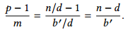

随着𝑑变大，𝑛−𝑑变小，管道气泡变小。It might not be possible to increase 𝑑 all the way to 𝑛 for all models, since a model’s full training memory footprint might be larger than the memory capacity of a single accelerator.

Overall throughput will thus increase if the all-reduce communication needed for data parallelism does not drastically increase with higher 𝑑, which should hold since the communication time for a ring-based implementation scales with 𝑑−1/𝑑= 1 −1/𝑑.

For a given parallel configuration, as the batch size 𝐵 increases, 𝑏′ = 𝐵/𝑏 increases, (𝑛 − 𝑑)/𝑏′ decreases, consequently increasing throughput.（microbatch数量增多，大小没变） All-reduce communication required by data parallelism also becomes more infrequent, further increasing throughput.(单次增多了？)

With tensor model parallelism, all-reduce communication needs to be performed for every microbatch. This can be expensive across multi-GPU servers. On the other hand, data parallelism only needs to perform expensive all-reduce communication once per batch. 使用张量模型并行性，每个模型并行等级在每个模型层中执行计算的子集，因此对于不够大的层，现代gpu可能无法以峰值效率执行这些子矩阵计算

Takeaway #2: When using data and model parallelism, a total model-parallel size of 𝑀 = 𝑡 · 𝑝 should be used so that the model’s parameters and intermediate metadata fit in GPU memory; data parallelism can be used to scale up training to more GPUs.

## Microbatch Size

per-GPU throughput increases by up to 1.3× with a larger microbatch size on a single GPU。We now want to determine the optimal microbatch size 𝑏 given a parallel configuration (𝑝, 𝑡, 𝑑) and batch size 𝐵. The amount of data-parallel communication will be the same regardless of the
microbatch size.（和batch大小有关） Given functions 𝑡𝑓
(𝑏) and 𝑡𝑏(𝑏) that map the microbatch size to the forward and backward computation times for a single microbatch, the total time spent computing a batch, ignoring communication cost, is

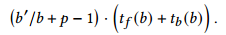

(连续执行(b'/b)的时间加上气泡（p-1)的时间)

微批大小因此影响运算的算术强度(t(b))以及管道气泡大小(通过影响𝑚)。(b'/b)

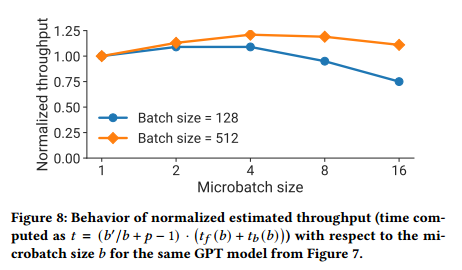

结论3:最佳微批大小𝑏取决于模型的吞吐量和内存占用特性，以及管道深度𝑝、数据并行大小𝑑和批大小。

## Activation Recomputation

激活重计算[12,18,20,21]是一种可选的技术，它通过在向后传递之前运行第二次向前传递(并且仅存储给定管道阶段的输入激活，而不是存储整个中间激活集，后者要大得多)，trades off an increase in the number of compute operations performed for additional memory footprint. Activation recomputation is required to train reasonably large models with pipeline parallelism to keep memory footprint acceptably low(并行度大，处理的数据多)

激活检查点的数量不会影响吞吐量，但会影响内存占用。Let $𝐴^{input}$ be the size of the input activations of a layer, and $𝐴^{intermediate}$ be the size of intermediate activations per layer. If a model stage has 𝑙 layers, and if 𝑐 is the number of checkpoints, the total memory footprint is going to be 𝑐 ·$𝐴^{input}$ +𝑙/𝑐 ·$𝐴^{intermediate}$. (一个stage里有c个，中间激活是怎么回事？) . In practice, we measure $𝐴^{intermediate}$ empirically. For most cases, checkpointing every 1 or 2 transformer layers is optimal.其他技术，如激活分区[36]也可以与张量模型并行结合使用，以进一步减少由于激活而产生的内存占用。

# IMPLEMENTATION

我们将PTD-P作为Megatron-LM代码库的扩展来实现。我们的实现是使用PyTorch[32]构建的。我们使用NCCL[7]来实现设备间的通信。

##  Communication Optimizations

When using pipeline parallelism, we want to send and receive tensors in the forward and backward direction in parallel.  Each DGX A100 is equipped with 8 InfiniBand (IB) networking cards. Unfortunately, sends and receives are point-to-point, and only happen between a pair of GPUs on two servers, making it hard to leverage all 8 cards for a single communication call within the pipeline.

我们可以利用同时使用张量模型并行性和管道模型并行性的事实来减少跨节点通信的开销。In particular, we note that the output of each transformer layer is replicated (after 𝑔 in MLP block, see Figure 5a) across the tensor-parallel ranks.(输出被复制多份分别传到下一层的多个gpu) As a result, ranks in two consecutive pipeline stages that are performing tensor model parallelism send and receive the exact same set of tensors (Figure 9a).

For large enough models, we use a tensor-model-parallel size of 8. This means we are sending the same set of tensors 8 times between corresponding GPUs on adjacent multi-GPU servers. To reduce this redundancy, we can instead split the tensor on the send side into equal-sized chunks, and then only send one chunk to the corresponding rank on the next node using the rank’s own InfiniBand card.  With 8 tensor-model-parallel ranks, each chunk would be one-eighth smaller. Then, on the receive side, we can
perform an all-gather over NVLink, which is much faster than the InfiniBand interconnect, to re-materialize the full tensor. 这种优化有助于更好地利用DGX A100服务器上的多个IB卡，并使更多的通信密集型调度(如交错调度)变得可行

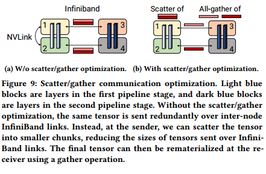

with the scatter-gather communication optimization, the total amount of communication that needs to be performed
between every pair of consecutive stages is reduced to 𝑏𝑠ℎ/t(一个infiniband)

## Computation Optimizations

我们对计算图实现了三个特定于模型的优化，以获得高性能。First, we changed the data layout in the transformer layer to avoid memory-intensive transpose operations, and to enable the use of strided batched GEMM kernels. we changed the data layout from [𝑏, 𝑠, 𝑎, ℎ] to [𝑠, 𝑏, 𝑎, ℎ], where 𝑏, 𝑠, 𝑎, and ℎ are batch, sequence, attention-head, and hidden-size dimensions.其次，我们使用PyTorch JIT[10]为一系列元素操作(bias + GeLU和bias + dropout + add)生成融合内核。 Third, we created two custom kernels to enable the fusion of scale, mask, and softmax (reduction) operations: one to support general masking (used in models such as BERT) and another to support implicit causal masking (used in auto-regressive models such as GPT). 

# EVALUATION

对于我们的大多数结果，我们报告每个GPU的吞吐量。总吞吐量可以通过与所使用的gpu数量相乘来计算。

## End-to-End Performance

使用张量，管道和数据并行性(使用§3中描述的启发式选择的度)。我们在启用了分散/收集优化的情况下使用交错管道调度。As the model size increases, we also increase the batch size (𝐵) and the number of GPUs (𝑛). assumes activation recomputation and takes into account the floating-point
operations associated with the extra forward pass.

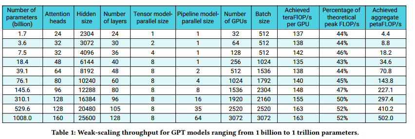

We see superlinear scaling to 3072 A100 GPUs (384 DGX A100 nodes), since GPU utilization improves as the models get larger (larger matrix multiplications) without significant increase in the communication time relative to computation time.吞吐量是为端到端训练测量的，即包括所有操作，包括数据加载、优化器步骤、通信和日志记录。对于最大的模型，我们实现了52%的峰值设备吞吐量，对于最小的模型，我们实现了44%的峰值设备吞吐量。

Given these throughputs, we can also estimate the total amount of time needed for end-to-end training on 𝑇 tokens. Training requires 𝐼 = 𝑇 /(𝐵 · 𝑠) iterations. 对于1万亿参数模型，我们假设端到端训练需要4500亿个令牌。使用3072个A100 gpu，我们可以实现163 teraFLOP/s的每gpu吞吐量，端到端训练时间为84天。

## Comparison to ZeRO-3

结果为不使用模型并行性的方法提供了一个比较点。(?)我们使用DeepSpeed Python库[3]将ZeRO集成到我们的代码库中.我们在增加gpu数量的同时保持全局批处理大小不变。 With fewer GPUs and a microbatch size of 4, PTD-P results in 6% and 24% higher throughput for the 175- and 530-billion-parameter models respectively.随着gpu数量的增加，PTD-P在隔离状态下的扩展比ZeRO-3更优雅(参见图10)。通过将gpu数量增加一倍(保持批处理大小相同)，由于跨节点通信减少，PTD-P在两种型号上的性能都比ZeRO-3高70%。

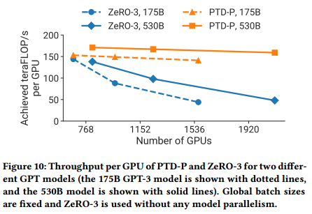

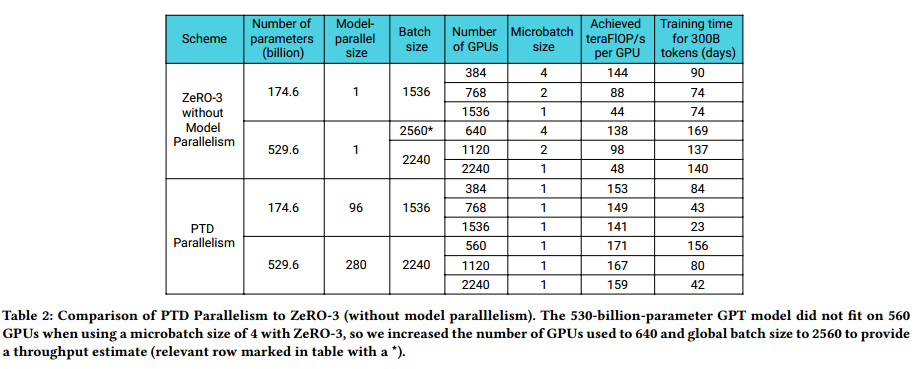

## Pipeline Parallelism

我们孤立地评估了管道并行的弱伸缩性能，并比较了非交错调度和交错调度的性能

We evaluate the scaling of the default noninterleaved pipeline-parallel schedule using a weak scaling setup.As we increase the number of pipeline stages, we also increase the size of the model by proportionally increasing the number of layers in the model.Figure 11 shows throughput per GPU for two different batch sizes to illustrate the impact of the pipeline bubble, which behaves as (𝑝−1)/𝑚 (§2.2.1). 正如预期的那样，更高的批大小可以更好地扩展，因为管道气泡被分摊到更多的微批上

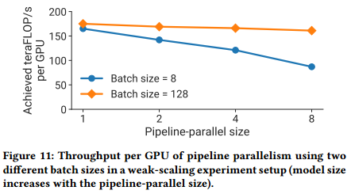

The interleaved schedule with the scatter/gather communication optimization has higher computational performance than the non-interleaved (default) schedule.由于两个原因，这个差距随着批大小的增加而缩小:(a)随着批大小的增加，默认调度中的气泡大小减小，以及(b)管道内点对点通信的数量与批大小成正比，因此非交错调度随着通信数量的增加而赶上(交错调度的特征是每个样本的通信更多)。如果没有分散/收集优化，默认调度在更大的批处理规模(未显示)下比交错调度执行得更好。(交错调度通信大，气泡小，batch增大，气泡都很小，通信很大)

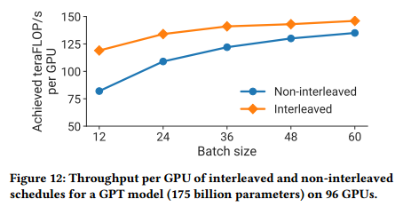

## Comparison of Parallel Configurations

we show the performance for parallel configurations using the same number of GPUs for a given model and multiple batch sizes

图13中的实证结果表明，结合使用张量和管道模型并行性来训练一个1610亿个参数的GPT模型(32个变压器层，支持管道并行大小为32,128个注意头，隐藏大小为20480)具有低通信开销和高计算资源利用率的重要性。We observe that tensor model parallelism is best within a node (DGX A100 server) due to its expensive all-reduce communication. Pipeline model parallelism, on the other hand, uses much cheaper point-to-point communication that can be performed across nodes without bottlenecking the entire computation.然而，在管道并行的情况下，大量的时间可能会花费在管道气泡中:因此，管道级的总数应该受到限制，以便管道中的微批数量是管道级数量的合理倍数。当张量并行大小等于单个节点中的gpu数量(DGX A100节点为8个)时，我们可以看到峰值性能。这一结果表明，无论是单独的张量模型并行性(由Megatron[40]使用)还是管道模型并行性(由PipeDream[30]等使用)，都无法匹配将这两种技术结合使用的性能。

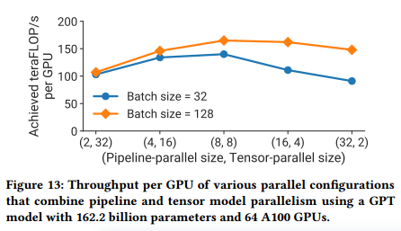

对于每个批大小，吞吐量随着管道并行大小的增加而降低，与§3.3中的分析模型相匹配。应该主要使用管道模型并行性来支持不适合单个工人的大型模型的训练，并且应该使用数据并行性来扩展训练。

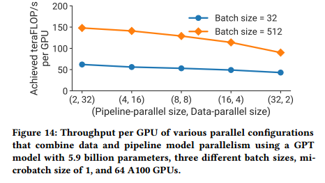

With larger batch sizes and a microbatch size of 1, data-parallel communication is infrequent;(一次处理的数据多) the all-to-all communication required in tensor model parallelism needs to be performed for every microbatch in a batch. 这种具有张量模型并行性的全对全通信支配着端到端训练时间，特别是当通信需要跨多个gpu节点执行时。随着张量模型并行大小的增加，我们在每个GPU上执行更小的矩阵乘法，从而降低每个GPU的利用率。我们应该注意到，虽然数据并行性可以导致有效的扩展，但我们不能孤立地使用数据并行性来处理具有有限训练批大小的非常大的模型，因为a)内存容量不足， b) scaling limitations of data parallelism (e.g., GPT-3 was trained to convergence with a batch size of 1536.数据并行性因此只支持1536个gpu的并行化;然而，在合理的时间内，大约使用了10,000个gpu来训练这个模型)。

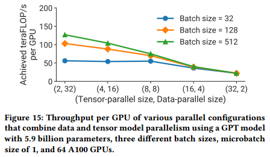

## Microbatch Size

最佳微批大小对于其他模型是不同的(图中未显示)，并且是模型相关的。对于给定的批大小，增加微批大小会减少管道中的微批数量(𝑚)，导致更大的管道气泡;然而，增加微批大小也可以通过增加执行内核的算术强度来提高GPU利用率。我们在§3.3中的分析模型合理地逼近了真实的性能，并且可以用作代理来确定如何为各种训练配置和模型选择这个超参数值。

## Activation Recomputation

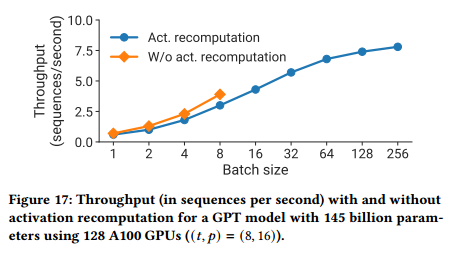

For small batch sizes, activation recomputation leads to up to 33% lower throughput (in sequences per second) due to the extra forward pass that needs to be executed during the backward pass. However, activation recomputation is needed to support larger batch sizes. . Throughput at
large batch sizes with activation recomputation is up to 2× higher than the best throughput achieved without activation recomputation (for a smaller batch size) due to a smaller pipeline bubble.（比不同batch size?)

## Scatter-Gather Optimization

通过减少跨节点链路上的通信量，通信密集型调度(具有交错的大批处理大小)的吞吐量提高了11%。

## Fused Operators

对于GPT-3模型(1750亿个参数)，吞吐量通过融合提高了19%

## Inter-Node Communication Bandwidth

Our strong results are a byproduct of using an optimized software and hardware stack together. we take advantage of the high-bandwidth communication links between GPUs on the same server and across servers.流水线级之间点对点通信的有效对分带宽为892 GB/s，而数据并行副本之间全约操作的有效对分带宽为12.9 TB/s。 A less-optimized partitioning of operators across devices would lead to more inter-node
communication, hampering scaling performance.

# RELATED WORK

管道并行有几种方式:本文讨论的模式使用flush来确保严格的优化器语义。与本文中考虑的管道冲洗技术相比，这些技术提高了吞吐量，但可能以收敛速度或最终精度为代价。

DeepSpeed[2]将管道并行性与张量并行性和数据并行性相结合，以训练具有多达一万亿参数的模型，但吞吐量低于本文所示(52% vs.峰值的36%)， for a few reasons: operator fusion to keep most of the operator graph compute-bound, a more-efficient pipeline parallelism schedule to minimize the pipeline bubble size, fast hardware and scaling to more GPUs.我们也可以扩展到更大的模型，但需要更多的gpu来保持训练时间的实用性。

FlexFlow[22]、PipeDream[29]、DAPPLE[14]和Tarnawski等[41]都是借助成本模型在多设备上自动划分模型训练图。然而，这些都没有考虑到本文中考虑的所有并行性维度:管道和张量模型并行性、数据并行性、微批大小，以及激活重计算等内存节省优化对大于加速器内存容量的模型的训练的影响。这些增加的维度增加了需要探索的搜索空间。

# DISCUSSION AND CONCLUSION

我们展示了如何组成PTD-P(节点间管道并行，节点内张量并行和数据并行)来实现高总吞吐量(502 petaFLOP/s)。 a) the idea of smartly partitioning the model training graph to minimize the amount of communication while still keeping devices active, b) minimizing the number of memorybound kernels with operator fusion and careful data layout, c) other
domain-specific optimizations (e.g., scatter-gather optimization).

pp:多机

tp:单机多卡

Pipeline model parallelism should be used primarily to support the training of large models that do not fit on a single worker, and data parallelism should be used to scale up training

dp受到最大batch size的限制，不能无限扩展

同步pipedream(microbatch)

交错：一个gpu对应多个stage（循环分配）

切分乘法（左乘以右列、左列乘以右行+all-reduce）

