# ABSTRACT

它利用GPU、CPU和NVMe内存，在有限的资源上实现前所未有的模型扩展，而不需要模型代码重构。同时，它实现了出色的训练吞吐量和可扩展性，不受有限的CPU或NVMe带宽的阻碍。它可用于在单个NVIDIA DGX-2节点上微调万亿参数模型，使大型模型更易于访问。在训练吞吐量和可扩展性方面，它在512个NVIDIA V100 gpu(峰值的40%)上维持超过25千万亿次浮点运算，同时也展示了超级线性可扩展性。ZeRO-Infinity的开源实现可以通过DeepSpeed 1获得。

# EXTENDED INTRODUCTION

超过1000亿个参数(GPT-3[4])，相比之下，单个GPU内存仅增加了5倍(从16 GB增加到80 GB)。

目前最先进的大型模型训练技术是三维并行(3D parallelism[13,14])，它将模型(张量切片)和管道并行与数据并行相结合，可以在数百或数千个gpu上有效地将深度学习训练扩展到数万亿个参数。尽管3D并行性具有用于大型模型训练的能力，但我们现在到达了GPU内存墙[16]。总的GPU内存不足以支持模型大小的增长。即使使用具有80gb内存的最新NVIDIA A100 GPU, 3D并行性也需要320个GPU才能适应用于训练的万亿参数模型，并且即使我们假设GPU内存在未来几年内增加5倍，扩展到未来的100万亿参数模型也需要超过6K个GPU。以GPU内存为瓶颈，我们无法再维持模型规模的持续增长。

虽然预训练具有数千亿个参数的模型可能需要数百万个GPU计算小时，但对其进行微调要便宜得多，需要的GPU计算小时要少得多，并且可以在单个计算节点上使用少量GPU完成。虽然许多企业和用户都可以访问这些计算资源，但不幸的是，它们受到这些计算节点上可用内存的限制，这反过来又限制了可以微调的模型的大小。这使得大多数无法访问大规模GPU集群的研究人员和公司无法进行大型模型微调。例如，微调GPT-3将需要超过8个具有3D并行性的DGX-2节点(128个gpu)来适应训练模型，即使单个DGX-2节点(16个gpu)有足够的计算能力在合理的时间内对其进行微调。

除了GPU内存墙之外，用于训练大规模模型的最先进技术在可用性和灵活性方面也受到限制。

如上所述，3D并行性需要以复杂的方式将数据、模型和管道并行性结合起来，以获得数千亿或数万亿个参数。虽然这样的系统可以非常高效，但它需要数据科学家执行主要的模型代码重构，用张量切片版本替换单个GPU操作符，并将模型划分为负载平衡的管道阶段。这也使得3D并行性在它可以支持的模型类型中不灵活。具有复杂依赖关系的模型不容易转换为负载平衡的管道

考虑到大型模型训练的前景，出现了3个问题:•展望未来，我们如何支持模型规模的下一个1000倍增长，从像GPT-3这样拥有1750亿个参数的模型发展到拥有数百万亿个参数的模型?•我们如何让更多无法使用数百个gpu的数据科学家能够访问今天的大型模型?•我们是否可以通过消除模型重构和多种形式的并行性来简化大型模型的训练?

我们从3D并行性迈出了一步，提出了ZeRO-Infinity，这是一个能够解决上述所有大型模型训练挑战的新系统。

ZeRO-Infinity是一种数据并行训练的形式，但与标准数据并行训练不同的是，在标准数据并行训练中，模型状态(如参数、梯度和优化器状态)在所有数据并行进程中被复制，ZeRO-Infinity将它们分区，以充分利用所有数据并行进程的聚合内存。在训练过程中，ZeRO-Infinity使用通信集合来收集当前需要的模型状态。这与被称为ZeRO的数据并行的内存效率形式类似[11]。然而，与只在GPU上保留本地分区的ZeRO不同，ZeRO- infinity将它们卸载到CPU或NVMe内存，根据需要在GPU, CPU和NVMe之间移动它们，允许ZeRO- infinity充分利用CPU和NVMe内存以及GPU内存。

ZeRO-Infinity extends the ZeRO family of technology [11, 12] with new innovations in heterogeneous memory access called the infinity offload engine. This allows ZeRO-Infinity通过同时利用CPU和NVMe内存，在有限的GPU资源上支持大规模模型大小。

ZeRO-Infinity also introduces a novel GPU memory
optimization technique called memory-centric tiling to support extremely large individual layers that would otherwise not fit in GPU memory even one layer at a time. With the infinity offload engine and memory-centric tiling, ZeRO-Infinity not only supports the next 1000x growth in model size, but also makes large models accessible to data scientists with limited GPU resources.

ZeRO-Infinity introduces a novel data partitioning strategy for leveraging aggregate memory bandwidth across all devices, which we refer to as bandwidth-centric partitioning, and combines it with powerful communication overlap-centric design, as well as optimizations for high performance NVMe
access in the infinity offload engine. Together, ZeRO-Infinity offers excellent training efficiency, despite offloading data to CPU or NVMe, unencumbered by their limited bandwidth.

有了ZeRO-Infinity，数据科学家不再需要调整他们的模型来适应多种形式的并行，比如3D并行。这是可能的，因为上面讨论的ZeRO-Infinity中的以内存为中心的平铺旨在减少大型单个层的GPU内存需求，否则将需要模型并行性(张量切片)来适应GPU内存中的层。ZeRO-Infinity消除了手动模型代码重构的需要，即使是在扩展到数万亿个参数时，也可以通过一个简单的实现，自动完成训练任意模型架构所需的所有通信和数据分区。

描述大型模型训练的不同组件的内存需求(第3节)以及它们的带宽需求(第4节)，

以内存为中心的平铺，在不需要模型并行的情况下处理大量操作

以带宽为中心的分区，在所有并行设备上利用聚合内存带宽

在相同的硬件上实现超过25千万亿次的吞吐量

在单个DGX-2节点上微调多达万亿参数的模型，而不使用任何模型并行性或模型代码重构

# BACKGROUND AND RELATED WORK

对于适合设备内存进行训练的模型，可以使用数据并行性(DP)将训练扩展到多个设备。当模型不适合设备内存时，模型并行2 (MP)[7,17,18]和管道并行2 (PP)[7 - 9]可以分别在垂直和水平方向将模型拆分到进程之间。虽然3D并行可以非常高效，但它需要i)大量的模型代码重构来将模型拆分为模型和管道并行组件，ii)具有复杂依赖图的模型难以表示为负载平衡的管道阶段，iii)模型大小受限于可用的GPU内存总量。

ZeRO消除了数据并行进程之间的内存冗余。通过这样做，与传统的数据并行性相比，它提高了内存效率，同时保留了其计算粒度和通信效率。

ZeROOffload[12]是在多gpu上进行大型模型训练的最先进(SOTA)方法。然而，它仍然需要将参数存储在GPU内存中，并在所有设备上复制。the model scale with ZeRO-Offload is limited to the total number of parameters that the memory on a single GPU device can host. 由于次优数据分区(?)和有限的PCIe带宽，ZeRO-Offload还需要大的批处理大小来保持效率。

通过压缩[28]、激活检查点[29,30]或实时分析[31]，多种努力都集中在减少激活所需的内存上。ZeRO-Infinity与激活检查点一起工作以减少激活内存。

# MEMORY REQUIREMENTS

描述了GPU上必须可用的最小内存量来支持训练，假设模型和剩余状态可以成功地从GPU内存中卸载。

Adam优化器进行混合精度训练时，参数和梯度存储在FP16中，优化器状态由FP32动量、方差、参数和梯度(?)组成。每个参数总共需要20字节的内存。基于Transformer的模型中参数的总数主要取决于隐藏维度(h𝑑)和Transformer层的数量(𝑛𝑙)。Nearly all
the parameters in a Transformer block come from four linear layers within each block with sizes: (ℎ𝑑, 3ℎ𝑑), (ℎ𝑑, ℎ𝑑), (ℎ𝑑, 4ℎ𝑑) and (4ℎ𝑑, ℎ𝑑), respectively. 基于Transformer的模型和中的总参数可以近似为12 ×𝑛𝑙× $h𝑑^2$，需要总内存240 ×𝑛𝑙× $h𝑑^2$字节来存储模型状态。

剩余状态主要由激活内存组成，它取决于模型体系结构、批处理大小(𝑏𝑠)和序列长度(𝑠𝑒𝑞)，并且可能相当大。从积极的方面来看，激活所需的内存可以通过激活检查点显著减少[29]，这以0.33倍的额外重新计算为代价换取了激活内存。图灵- nlg 17.2B和GPT-3 175B等大型模型均使用激活检查点进行训练。存储激活检查点所需的内存估计为 $2 × 𝑏𝑠𝑧 × 𝑠𝑒𝑞 × ℎ𝑑 × 𝑛𝑙/𝑐i$ bytes, 𝑐𝑖 is the number of Transformer blocks between two activation checkpoints, and 𝑏𝑠𝑧 × 𝑠𝑒𝑞 × ℎ𝑑 is the size of the input to each Transformer block. Many modern GPU clusters have 8-16 GPUs per node, and so we chose a batch size of 2-4 per GPU, resulting in a batch size of 32 as a conservative estimate of activation within each node. While the resulting activation checkpoints are orders of magnitude smaller than the full set of activations (column 6) , beyond a trillion parameters they still get too large to fit in GPU memory for the batch size and sequence length under consideration.

Model State Working Memory (MSWM) is the minimum
amount of GPU memory required to perform forward or backward propagation on the largest single operator in the model after all the model states have been offloaded to CPU or NVMe. This is approximately given by the size of the parameters and gradients of that operator in the model, since there must be at least enough memory to hold the parameter and its gradient for backward propagation(激活不用吗？)

For a Transformer based model, the largest operator is a linear layer that transforms hidden states from ℎ𝑑 to 4ℎ𝑑. The size of the parameter and gradients of this linear layer is 4 × ℎ𝑑 × 4ℎ𝑑 bytes

MSWM(图2a列8)在超过1000亿个参数的情况下显著增长，需要多个gb的连续内存，这可能导致在训练期间内存耗尽。3D Parallelism等最先进的方法通过模型并行解决了这个问题，将单个运算符拆分到多个gpu上。在第5.1.3节中，我们讨论了一种新的方法来解决这些大量的模型状态工作记忆，而不需要模型并行性。

Activation Working Memory (AWM) is the memory required
in the backward propagation for recomputing the activations before performing the actual backward propagation.  This is the size of the activations between two consecutive activation checkpoints. For example, if we create one activation checkpoint per Transformer block, the memory is given by the size of the total activation per Transformer block. This is given in bytes by approximately 𝑏𝑠𝑧 ×𝑠𝑒𝑞 × 𝑐𝑖 × $(16 × ℎ𝑑 + 2 × 𝑎𝑡𝑡𝑛\_ℎ𝑒𝑎𝑑𝑠 × 𝑠𝑒𝑞)$. AWM随序列长度呈二次增长。在某些工作负载中，序列长度可以达到数万，AWM可以达到数百GB，超出了单个GPU的可用范围。对于这类模型，可以使用稀疏关注[39,40]来有效地降低AWM。稀疏注意力优化是对我们工作的补充，并且超出了本文的范围。

即使𝑐≥1,AWM的参数也会超过10万亿个。Unlike MSWM that is only composed of a single parameter and gradient, AWM is composed of dozens of activations, and does not cause memory issues due to lack of contiguous memory as long as the total AWM can fit in GPU memory.

# BANDWIDTH REQUIREMENTS

Assuming a workload execution without any compute and communication overlap, we can use the peak computational throughput (𝑝𝑒𝑎𝑘𝑡𝑝 ), data movement bandwidth (𝑏𝑤) and its arithmetic intensity (𝑎𝑖𝑡) to estimate the training efficiency.工作负载的算术强度(AIT)是总计算量与计算所需数据量之比。它描述了每次数据移动的计算量。较高的AIT意味着对数据移动带宽的要求较低，因为对于加载的每个数据，加速器可以执行更多的计算。

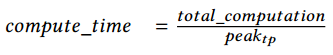

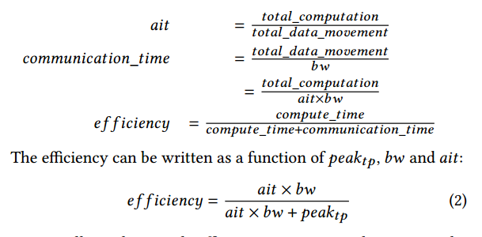

##  Quantifying AIT in DL training

每次迭代的总计算量由Transformer 的线性层中的计算量主导。 In fact, for large NLP models, it is common that ℎ𝑑 >> 𝑠𝑒𝑞, and thus the attention computation is a negligible part of the computation cost. For the forward propagation this can be approximated as a function of the number of parameters, sequence length, and batch size, given by 2 × 𝑏𝑠𝑧 × 𝑠𝑒𝑞 × 𝑝𝑎𝑟𝑎𝑚𝑠. The cost of backward propagation is approximately twice that of forward propagation. Additionally, activation checkpointing requires an additional forward computation as part of recomputation during backward propagation. Therefore, the total computation per iteration is:

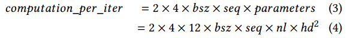

在向前和向后传播期间，模型参数必须从源位置加载到GPU寄存器至少两次，i)在向前期间，ii)在实际向后期间，导致2倍的数据移动𝑝𝑎𝑟𝑎𝑚𝑒𝑡𝑒𝑟𝑠。在激活检查点存在的情况下，参数可能会被加载一次，以便在向后传递期间重新计算，这又增加了1倍𝑝𝑎𝑟𝑎𝑚𝑒𝑡𝑒𝑟𝑠。此外，梯度必须从GPU寄存器存储到其最终位置至少一次，在数据移动中添加最终的1 ×𝑝𝑎𝑟𝑎𝑚𝑒𝑡𝑒𝑟𝑠。

因此，假设参数和梯度存储在相同的最终位置，在向前和向后传递期间的总数据移动将是4×𝑝𝑎𝑟𝑎𝑚𝑒𝑡𝑒𝑟𝑠，即2×4×𝑝𝑎𝑟𝑎𝑚𝑒𝑡𝑒𝑟𝑠字节。Therefore the 𝑎𝑖𝑡 w.r.t parameter and gradients is 𝑠𝑒𝑞 × 𝑏𝑠z

在优化器步骤期间，必须至少读取一次优化器状态，并且必须至少写入一次优化器状态。所以总数据移动2×𝑜𝑝𝑡𝑖𝑚𝑖𝑧𝑒𝑟_𝑠𝑡𝑎𝑡𝑒𝑠,这大约是2×16×𝑝𝑎𝑟𝑎𝑚𝑒𝑡𝑒𝑟𝑠字节。Thereforem𝑎𝑖𝑡 w.r.t optimizer states during a full training iteration is 𝑠𝑒𝑞×𝑏𝑠𝑧/4.

During the forward propagation activation checkpoints must be saved to their final location, and must be retrieved during the backward propagation. Therefore, the total data movement w.r.t activation checkpoints in bytes is
given by 2×𝑡𝑜𝑡𝑎𝑙\_𝑎𝑐𝑡𝑖𝑣𝑎𝑡𝑖𝑜𝑛\_𝑐ℎ𝑒𝑐𝑘𝑝𝑜𝑖𝑛𝑡𝑠\_𝑖𝑛\_𝑏𝑦𝑡𝑒𝑠 which is given by 4×𝑛𝑙/𝑐𝑖 ×ℎ𝑑 ×𝑠𝑒𝑞 ×𝑏𝑠𝑧 from Eq. (1). The total computation per iteration is given by Sec. 4.1. So the 𝑎𝑖𝑡 w.r.t activation checkpoints is given by 24 × ℎ𝑑 × 𝑐𝑖.

## Bandwidth Requirements

由于AIT的变化，模型状态和激活检查点具有非常不同的带宽需求，以实现良好的效率。前者仅取决于批大小和序列长度，后者仅取决于激活检查点的频率和模型的隐藏维度大小。

Besides AIT, the bandwidth requirement for efficiency also depends on 𝑝𝑒𝑎𝑘𝑡𝑝 .Using 𝑝𝑒𝑎𝑘𝑡𝑝 , and 𝑎𝑖𝑡 we first
show how efficiency varies with bandwidth w.r.t to different model and residual states, and then discuss the bandwidth requirements on these states for DL training to be efficient. 

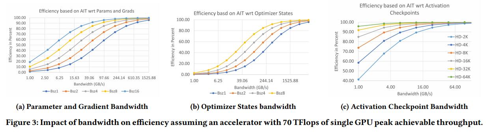

A small batch size per GPU is used when running on large number of GPUs, while a large batch size per GPU is used when training on relatively fewer GPUs to maintain a
reasonable effective batch size for training.

𝑝𝑒𝑎𝑘𝑡𝑝 is not the theoretical hardware peak, but instead the achievable peak in the absence of any communication bottleneck. We ran models with aforementioned configurations on a single NVIDIA V100 DGX-2 box with all non-GPU communication turned off to simulate a zero external communication overhead scenario, or equivalently a virtually infinite external bandwidth scenario. The performance achieved ranged from 62-78 TFlops/GPU
based on the hidden size of 8K-64K, respectively. We used the average of 70 TFlops/GPU to represent 𝑝𝑒𝑎𝑘𝑡𝑝 for the purpose of this analysis.

图3a显示，当参数和梯度的带宽超过70 GB/s时，即使是最小的批处理大小，我们也可以实现超过50%的效率。在这个带宽下，理论上数据移动可以与计算完全重合，达到100%的效率。

图3b显示，与参数和梯度相比，优化器状态需要近4倍的带宽才能达到50%的效率。此外，优化器状态在向前和向后传播结束时更新，并且不能与计算重叠。因此，它们需要更大的带宽来保持整个DL工作负载的效率。例如，每个GPU的批处理大小为2，要达到90%的效率，需要近1.5 TB/s的有效带宽，这甚至大于GPU的内存带宽。

图3c还显示，启用激活检查点后，即使隐藏大小为2𝐾，2 GB/s的微薄带宽也能够维持50%以上的效率。当隐藏大小超过8k时，带宽需求下降到1 GB/s以下。

（带宽需求：优化器>参数=梯度>激活）

#  ZERO-INFINITY DESIGN OVERVIEW

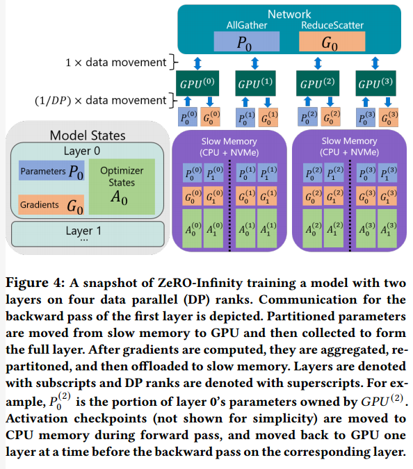

## Design for Unprecedented Scale

ZeRO-Infinity支持每个NVIDIA V100 DGX-2节点1万亿个参数，比3D并行度提高了50倍。

ZeRO-Infinity is built on top of ZeRO-3 [11] which partitions all model states to remove memory redundancy as discussed in Sec. 2. Unlike any of the existing ZeRO family of technology, ZeRO-Infinity is designed with a powerful offload mechanism called the infinity offload engine which can offload all of the partitioned model states to CPU or NVMe memory, or keep them on the GPU based on the memory requirements.

除了模型状态之外，ZeRO-Infinity还可以在必要时将激活内存卸载到CPU内存中。请注意，10万亿参数模型所需的激活检查点(0.76 TB)可以轻松地装入DGX-2系统上可用的1.5TB CPU内存中，而100万亿参数所需的3 TB激活检查点在下一代硬件的CPU内存范围内。通过将激活检查点卸载到CPU内存中，ZeRO-Infinity可以拟合具有数以万亿计参数的模型的激活检查点。

To reduce the working memory requirements of DL training for large models, ZeRO-Infinity introduces a novel technique called memory-centric tiling that exploits the data fetch and release pattern of ZeRO-3 to reduce the working memory requirements by breaking down a large operator into smaller tiles that can be executed sequentially.(把大并行拆成小串行？)

For example, to reduce the working memory for a large linear
operator, ZeRO-Infinity represents the operator as a mathematically equivalent sequence of smaller linear operators consisting of tiles of parameters from the original operator, and executes them sequentially. When combined with ZeRO-3, the parameter and gradients of each tile can be fetched and released one at a time, reducing the working memory proportional to the number of tiles.（分成多少tile就减少多少比例） Therefore, ZeRO-Infinity can support operators of arbitrary sizes, without relying on model parallelism to fit them in limited GPU memory.

## Design for Excellent Training Efficiency

Offloading all model states and activations to CPU or NVMe is only practical if ZeRO-Infinity can achieve high efficiency despite the offload.在现实中，这是极具挑战性的，因为CPU内存比GPU内存带宽慢一个数量级，NVMe带宽比CPU内存带宽还要慢一个数量级。从GPU读取和写入这些内存甚至更慢(见图2b)。根据我们在第4节中的分析，在DGX-2这样的系统上，带宽必须大于70GB/s、1.5TB/s和1.4 GB/s w.r.t.参数和梯度、优化器状态和激活检查点，才能有效地进行深度学习训练。

参数和梯度的数据移动带宽必须大于70GB/s，接近DGX-2集群上可用的GPU-GPU带宽[42]。因此，像ZeRO3[11]这样的深度学习并行训练解决方案，在向前或向后传播之前将参数从所有者GPU广播给其他GPU，只要通信是重叠的，就可以高效运行。

相反，从单个GPU到CPU内存或NVMe的微薄的12 GB/s PCIe带宽(见图2b)或反之亦然，根本不足以支持大规模的异构训练。CPU和NVMe带宽分别为100gB /s和25gB /s，但从CPU或NVMe读取数据到单个GPU受到可实现的PCIe带宽的限制，大约为10- 12gB /s. Therefore, existing heterogeneous solutions like ZeRO-Offload where the parameters must be first moved from CPU to owner GPU before broadcasting requires significantly large batch sizes per GPU to achieve enough 𝑎𝑖𝑡 necessary to be efficient under the limited bandwidth. This poses two problems: i) for massive models the activation memory will get too large to fit even in CPU memory, and ii) the effective batch size becomes too large when scaling to hundreds or thousands of GPUs for effective convergence.(一个gpu代表一路dp)

ZeRO-Infinity以两种方式解决了这些挑战:i)以带宽为中心的分区:一种新的数据映射和并行数据检索策略，用于卸载参数和梯度，允许ZeRO-Infinity实现几乎无限的异构内存带宽(详细信息见第6.1节) and ii) an overlap centric design that allows
ZeRO-Infinity to overlap not only GPU-GPU communication with computation but also NVMe-CPU and CPU-GPU communications over the PCIe (details in Sec. 5.1.3).

Unlike parameters and gradients that are consumed and produced sequentially during the forward and backward propagation, optimizer states can be updated in parallel, all at once. This property is leveraged by both ZeRO-3 and ZeRO-Offload, that store and update the optimizer
states in GPU and CPU memory, respectively, in parallel across all available GPUs and CPUs.(?) As a result the aggregate GPU or CPU memory bandwidth can get much higher than the required 1.5TB/s with increase in GPU or CPU count.

Since ZeRO-Infinity is built upon ZeRO-3, it can also leverage
the aggregate GPU and CPU memory bandwidth as well as the
aggregate CPU compute for optimizer step, when offloading optimizer states to CPU memory.然而，使用NVMe卸载，有必要将数据从NVMe带到CPU内存中，然后以适合CPU内存的块的形式返回，以执行优化步骤，每次一个块。因此，优化步骤受到NVMe- cpu内存带宽的限制:虽然ZeRO-Infinity可以跨多个节点实现聚合NVMe带宽，但关键是要实现每个节点接近峰值的NVMe带宽，以便在尽可能少的节点和尽可能小的批量大小下支持超过1.5 TB/s的必要带宽。此外，将数据从NVMe导入到CPU内存或从CPU内存导入到GPU内存的过程可能会导致GPU和CPU中的CPU内存碎片，从而导致内存不足，即使仍然有大量内存可用。

无限卸载引擎不仅可以实现接近峰值的NVMe带宽，它还可以允许ZeRO-Infinity将NVMe到CPU的读取与CPU到NVMe的写入重叠，以及优化器步骤的CPU计算，同时允许ZeRO-Infinity在少量gpu上保持适度的批量大小，并在大量gpu上保持小批量大小。同时，它通过小心地为数据移动重用临时缓冲区来最小化内存碎片。

On a DGX-2 node, each GPU can read and write data at about 3 GB/s to CPU memory in parallel over the PCIe allowing activation checkpoints to be offloaded to CPU memory while retaining over 80% efficiency for hidden size larger 8𝐾 or larger. 为了在较小的隐藏尺寸下实现高效率，ZeRO-Infinity可以减少激活检查点的频率，并有效地将激活检查点与CPU内存之间的通信与GPU上的前向和后向计算重叠。

## Design for Ease of Use

有了ZeRO-Infinity，数据科学家不再需要调整他们的模型来适应多种形式的并行，比如3D并行。以内存为中心的ZeRO-Infinity平铺，旨在减少大型单个层的GPU内存需求，否则需要模型并行性(张量切片)来适应GPU内存中的层。

ZeRO-Infinity在PyTorch中实现的方式消除了手动模型代码重构的需要，即使扩展到数万亿个参数。这是通过一个简单的实现和三个自动化功能实现的:

I)自动数据移动，在训练过程中需要之前收集参数。ZeRO-Infinity通过在PyTorch子模块中注入前向/后向钩子来实现这一点，这些钩子会触发allgather集合来收集前向/后向传递所需的参数。

Ii)在子模块的向前/向后传递结束时，当不再需要属于子模块的参数时，自动进行参数划分。再一次，ZeRO-Infinity将post forward/backward hook注入子模块，对参数进行分区，并可选择将它们卸载给CPU或NVMe。

iii)在初始化过程中自动划分模型，这样，不能在单个GPU或CPU内存中适合的模型仍然可以初始化，而不需要跨数据并行进程对模型进行手动划分。ZeRO-Infinity通过包装所有模块类的构造函数来实现这一点，以便在初始化期间创建每个子模块的参数后立即对其进行分区和卸载。整个模型永远不会在单个数据并行进程上完全实例化。

# EFFICIENCY OPTIMIZATIONS

## Bandwidth-Centric Partitioning

ZeRO-Infinity实现了一种新的数据映射和检索策略，以解决NVMe和CPU内存带宽的限制。Unlike ZeRO [11] and ZeRO-Offload [12], where parameters of each layer are owned by a single data parallel process, which broadcasts them to the rest when needed, ZeRO-Infinity partitions individual parameters across all the data parallel process, and uses an allgather
instead of a broadcast when a parameter needs to be accessed.(有什么区别)请注意，如果数据位于GPU上，那么broadcast和allgather通信集合在数据移动量方面具有相同的通信成本。因此，这对于仅使用gpu的训练没有什么区别。然而，当数据位于NVMe或CPU中时，这将改变游戏规则。

In the broadcast-based approach, since each parameter is fully owned by one of the data parallel processes, the parameter must be first communicated from its source location (CPU or NVMe) to the GPU memory via the PCIe before the broadcast can happen. Since, the broadcast is done from the GPU device, this communication step is
needed to bring the data from NVMe/CPU to GPU. However, this communication step is not part of the broadcast itself。（先传到gpu，再怎么传？）Note that only a single PCIe can be active for this process, while all the PCIe links connected to all the other GPUs are idle. On the contrary, with the partitioned parameter and allgather based approach in ZeRO-Infinity, all PCIe links are active in parallel, each bringing in 1/𝑑𝑝𝑡ℎ portion of the parameter where 𝑑𝑝 is the data parallel degree. As a result, the effective communication bandwidth between NVMe or CPU to the GPU, increases linearly with the 𝑑𝑝
degree.

For example, with broadcast-based approach, the CPU/NVMe to GPU bandwidth stays constant at about 12 GB/s with PCIe Gen 3, even with 16-way data parallelism on the DGX-2 box. However, with the all-gather-based approach, the effective achievable bandwidth increases to about 48/25 GB/s (3.0/1.6 GB/s per GPU), respectively (see Fig. 2b), limited only by the max aggregate PCIe bandwidth and max NVMe bandwidth per DGX-2 node. From here, the bandwidth grows linearly with more nodes. When training a massive model at massive scale, ZeRO-Infinity can therefore offer significantly more heterogeneous memory bandwidth than necessary (virtually
unlimited) for the training to remain efficient. For example, on
64 DGX-2 nodes, ZeRO-Infinity has access to over 3TB/s of CPU memory bandwidth and over 1.5TB/s of NVMe bandwidth.

## Overlap Centric Design

虽然ZeRO-Infinity可以在多节点设置上利用足够的异构内存带宽，但带宽仍然可能成为单个GPU或单个节点设置的瓶颈。 Even the GPU-GPU allgather communication has a big impact on efficiency when running with a small batch size (Fig. 3). Furthermore, accessing NVMe memory requires a three step process: i) read data from NVMe to CPU memory (nc-transfer), ii) copy the data from CPU memory to GPU memory (cg-transfer), iii) execute allgather to construct the full parameter on all GPUs (gg-transfer). 这些数据移动的顺序性质意味着，如果简单地进行，总通信时间将是这三个数据移动成本的总和，即使每个阶段的数据移动带宽都足够，也会导致效率低下。

To address these issues, ZeRO-Infinity has an overlap engine
that not only overlaps GPU-GPU communication with GPU computation, but also overlaps the NVMe to CPU, and CPU to GPU communication, all at the same time. The overlap engine has two components: i) A dynamic prefetcher for overlapping the data movement required to reconstruct parameters before they are consumed in the forward or backward pass, and（取参数和计算重叠） ii) a communication and offload overlapping mechanism for executing the data movement required by gradients in parallel with the backward computation.（卸载梯度和计算重叠）

The dynamic prefetcher in ZeRO-Infinity traces the forward and backward computation on that fly, constructing an internal map of the operator sequence for each iteration. During each iteration, the prefetcher keeps track of where it is in the operator sequence and prefetches the parameter requires by the future operators.（预取参数) The prefetcher is aware of the three step communication process, and
therefore can overlap the nc-transfer for one parameter, with cgtransfer and gg-transfer of other parameters. For instance, before executing the 𝑖𝑡ℎ operator, the prefetcher can invoke nc, cg, and gg-transfer for parameters required by 𝑖 +3,𝑖 +2, and 𝑖 +1 operators, respectively. Note that all of these data movement can happen in parallel with the execution of the 𝑖
𝑡ℎ operator. Furthermore,ZeRO-Infinity can update the operator sequence map in case of dynamic workflow, allowing for appropriate prefetching even when the forward and backward propagation changes across iterations.

Similarly, in the backward pass, ZeRO-Infinity can overlap the
reduce-scatter for gradients of the parameters in (𝑖 + 1)
𝑡ℎ operator with the computation of the 𝑖𝑡ℎ operator, while simultaneous transferring the partitioned gradients from the reduce-scatter of the gradients of the (𝑖 + 2)𝑡ℎ operator to the CPU or NVMe

通过这种强大的以重叠为中心的设计，ZeRO-Infinity隐藏了数据移动的重要部分，即使在使用少量GPU和每个GPU的小批量大小进行训练时也是如此。

##  Infinity Offload Engine

DeepNVMe, a powerful C++ NVMe read/write library in the infinity offload engine that supports bulk read/write requests for asynchronous completion, and explicit synchronization requests to flush ongoing read/writes. The support for asynchrony allows ZeROInfinity to overlap these requests with GPU/GPU or GPU/CPU communication or computation.

Most importantly, DeepNVMe is capable of achieving near peak sequential read and write bandwidths on the NVMe storage device. It achieves this high performance through a number of optimizations, including aggressive parallelization of I/O requests (whether from a single user thread or across multiple user threads), smart work scheduling, avoiding data copying, and memory pinning.

To ensure high performance tensor reads (or writes) from (to) NVMe/CPU storage, the source (or destination) tensors must reside in pinned memory buffers. However, pinned memory buffers are scarce system resources, and their oversubscription by a single process can degrade
overall system performance or cause system instability. This layer manages the limited supply of pinned memory by reusing a small amount (tens of GBs) for offloading the entire model states (up to tens of TBs) to CPU or NVMe. The reuse of memory buffer prevents memory fragmentation in CPU and GPU memory. This layer also provides PyTorch tensors with pinned memory data, allowing inplace computation of the tensors so that they can then be written to NVMe without any further copies to improve bandwidth

# EVALUATION

对于没有模型并行性的实验，我们使用torch的分布式数据并行(DDP[43])作为基线。对于模型并行性的实验，我们使用Megatron-LM[7]。作为每个实验的基线，我们使用3D Parallelism[13]、ZeRO[11]或ZeRO- offload[12]中的相关最先进方法。

我们仅在聚合GPU内存不足时卸载。首先，我们将优化器状态和梯度卸载到具有足够容量的最快内存，因为它以最小的通信开销节省了最大的内存（？）。接下来，在参数和激活检查点之间，如果只有一个需要卸载到CPU内存，我们根据经验选择卸载提供更好性能的那个。当两者都需要卸载时，激活检查点被卸载到CPU，参数被卸载到具有足够容量的最快内存。

ZeRO-Infinity可以训练超过32万亿个参数的模型，而3D并行性大约为650B个参数，提供了50倍的模型规模飞跃。

ZeROInfinity可以训练多达20万亿个参数模型(大40倍)，吞吐量高达49 (34?写错了）TFlops/GPU。这大约是该集群理论峰值性能的40%，但超过了70 TFlops的可实现峰值性能(𝑝𝑒𝑎𝑘𝑡𝑝)的70%。At the extreme-scale, Figure 5a shows a performance drop from
10T (43 TFlops/GPU), and 20T (34 TFlops/GPU). This drop is not due to NVMe bandwidth as both model sizes use NVMe offload（用来存储model state?）, but instead due to an extremely small batch size per GPU (Table 1)at 20T scale as a result of limited CPU memory to store activation checkpoints. （小cpu内存导致能够存储的激活小导致batch小，计算利用率不高？）This can be improved by increasing the CPU memory or offloading activation checkpoints to NVMe in a future implementation.

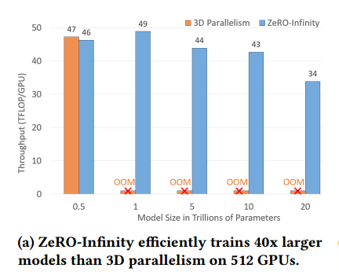

图5b显示，ZeRO-Infinity在训练1T模型时实现了从4个节点(64个gpu)到32个节点(512个gpu)的超线性可扩展性。我们将每个节点的批大小保持不变，并随着节点数量的增加而增加总批大小。ZeRO-Infinity通过有效地利用聚合PCIe和NVMe带宽的线性增长来加速参数和优化器状态的卸载，并利用来自其他节点的CPU计算来进行参数更新，从而超越了完美的线性扩展。ZeRO-Infinity仅用4个节点就已经实现了超过2.8 petaflops (44 Tflops/GPU)，这表明即使在适度的规模下，聚合的NVMe带宽也足以实现良好的效率。

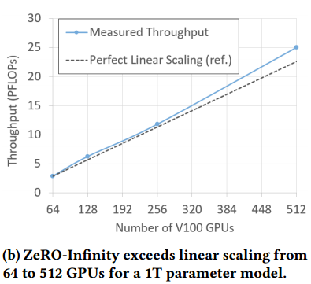

图5c显示了在没有任何模型并行性的情况下，使用ZeRO-Infinity在单个节点(16个gpu)上训练10B到1T模型的性能。凭借高达1000亿个参数的模型，ZeRO-Infinity实现了超过40 TFlops/GPU的卓越性能，使得只需一个DGX-2盒即可对GPT-3等模型进行微调。相比之下，3D并行性无法扩展到超过200亿个参数的模型。

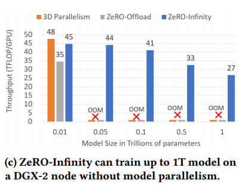

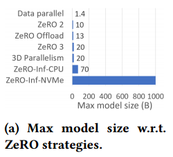

我们评估了以内存为中心的平铺在存在内存碎片的情况下启用大的隐藏大小的影响。我们训练了一个具有不同隐藏尺寸和平铺因子的单层变压器模型，以确定在平铺和不平铺情况下可以训练的最大隐藏尺寸。为了在所有实验中保持内存碎片一致，我们将总GPU内存预分割为2GB连续块，以便所有大于2GB的内存分配请求都将失败。

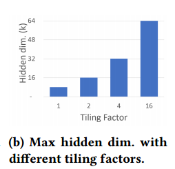

在没有以内存为中心平铺的情况下，可以训练的最大隐藏大小为8K，而我们甚至可以使用以内存为中心的平铺系数为16来训练一个巨大的隐藏大小为64K。通过以内存为中心的平铺，ZeRO-Infinity通过避免对模型并行性的需求，极大地简化了深度学习系统堆栈，使数据科学家可以轻松地训练大的隐藏尺寸。

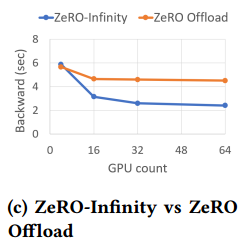

图6c显示了0 - infinity和0 - offload对CPU内存的卸载梯度对8B参数模型的反向传播时间的影响。ZeRO-Infinity利用gpu的聚合PCIe带宽来卸载梯度，与受单个PCIe带宽限制的ZeRO-Offload相比，64个gpu的速度提高了近2倍。

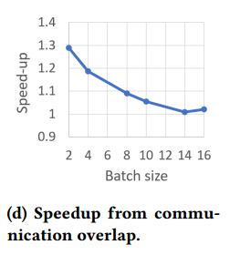

预取和重叠对于在每个GPU的小批量大小下获得良好的性能至关重要，而在大批量大小下其影响会减弱。(大批量计算效率高)

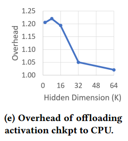

对于较小的隐藏大小，ZeRO-Infinity中激活检查点的CPU卸载最多可将训练吞吐量降低1.2倍，但对于隐藏大小32K和64K，影响最小，这表明可以将激活检查点卸载到CPU内存中，而不会影响大型隐藏大小的效率

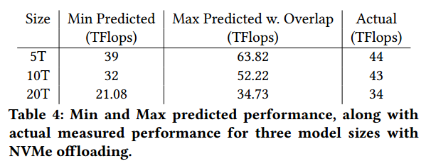

表4的对比结果表明，在所有情况下，实现的性能都在预测范围内，验证了第4节带宽分析的正确性。此外，对于较小的模型，性能更接近于下范围，而对于较大的模型，性能更接近于上范围。这是因为𝑝𝑒𝑎𝑘𝑡𝑝随着隐藏大小从62到78 TFlops的增加而增加。

while it is clear that efficiency drops with the decrease
in batch size, note that at 512 GPU scale, the calculated efficiency degradation is larger w.r.t parameters and gradients than w.r.t optimizer states. The primary source of efficiency degradation w.r.t parameters and gradients is the limited GPU-GPU bandwidth of 70GB/s. Therefore, this bandwidth is the most prominent source of performance bottleneck in ZeRO-Infinity when batch size is small(?)

#  CONCLUSION & FUTURE IMPLICATIONS

通过在多个设备上并行利用廉价、缓慢但巨大的CPU或NVMe内存来实现在当前一代GPU集群上进行有效训练所需的聚合带宽，从而有可能超越GPU内存墙。

很明显，有了ZeRO-Infinity，加速器设备内存不再是模型规模或训练效率的限制。然而，在合理的时间内训练具有数十万亿或数百万亿参数的模型仍然需要计算能力的巨大飞跃，并且在这些未来设备上高效运行需要设备到设备带宽的成比例飞跃(表3)。

# .

zero-3:模型状态划分

每一层：broadcast参数，前向，丢参数

每一层：broadcast参数，后向，reduce梯度，丢参数、梯度

用梯度和优化器状态和更新参数

ZeRO-Infinity是数据并行训练的一种形式

以内存为中心的平铺(memory-centric tiling)，以支持超大的单个层，否则GPU内存甚至无法一次容纳一层，通过将大型操作分解为可以顺序执行的较小的平铺来减少工作内存需求。When combined with ZeRO-3, the parameter and gradients
of each tile can be fetched and released one at a time, reducing the working memory proportional to the number of tiles.

使用Adam优化器进行混合精度训练时，参数和梯度存储在FP16中，优化器状态由FP32动量、方差、参数和梯度组成。

必须至少有足够的连续内存来保存参数及其梯度以进行反向传播。

在执行实际的向后传播之前重新计算激活所需的内存。这是两个连续激活检查点之间的激活大小。

在激活检查点存在的情况下，参数可能会被再加载一次，梯度必须从GPU寄存器存储到其最终位置至少一次（参数或梯度一共移动4次，在cpu更新参数？）

𝑎𝑖𝑡 w.r.t parameter and gradients is 𝑠𝑒𝑞 × 𝑏𝑠𝑧.

在优化器步骤期间，必须至少读取一次优化器状态，并且必须至少写入一次优化器状态。

𝑎𝑖𝑡 w.r.t optimizer states during a full training iteration is 𝑠𝑒𝑞×𝑏𝑠𝑧/4.

𝑎𝑖𝑡 w.r.t activation checkpoints is given by 24 × ℎ𝑑 × 𝑐𝑖.

由于AIT的变化，模型状态和激活检查点具有非常不同的带宽需求，以实现良好的效率。

当参数和梯度的带宽超过70 GB/s时，即使是最小的批量大小，我们也可以实现50%以上的效率。在这个带宽下，理论上数据移动可以与计算完全重合，达到100%的效率

与参数和梯度相比，优化器状态需要近4倍的带宽才能达到50%的效率。此外，优化器状态在向前和向后传播结束时更新，并且不能与计算（前后向）重叠。

启用激活检查点后，即使隐藏大小为2𝐾，2 GB/s的微薄带宽也能够维持50%以上的效率。

通过将激活检查点卸载到CPU内存中，ZeRO-Infinity可以拟合具有数以万亿计参数的模型的激活检查点。

在DGX-2这样的系统上，带宽必须大于70GB/s、1.5TB/s和1.4 GB/s w.r.t.参数和梯度、优化器状态和激活检查点，才能有效地进行深度学习训练。

参数和梯度的数据移动带宽必须大于70GB/s，接近DGX-2集群上可用的GPU-GPU带宽[42]。因此，像ZeRO3[11]这样的深度学习并行训练解决方案，在向前或向后传播之前将参数从所有者GPU广播给其他GPU，只要通信是重叠的，就可以高效运行。

On the contrary, a meager 12 GB/s PCIe bandwidth from a single GPU to CPU memory or NVMe (see Fig. 2b) or vice-versa is simply not sufficient to support heterogeneous training at scale. Therefore, existing heterogeneous solutions like ZeRO-Offload where the parameters must be first moved from CPU to owner GPU before broadcasting requires significantly large batch sizes per GPU to achieve enough 𝑎𝑖𝑡 necessary to be efficient under the limited bandwidth.(要达到效率要么增大带宽，要么增大ait，GPU到GPU不需要大batch size，PCIe需要大batch size)（大batch size）这带来了两个问题:1)对于大规模模型，激活内存会变得太大，甚至无法容纳CPU内存;2)当扩展到数百或数千个gpu以实现有效收敛时，有效批处理大小会变得太大。

ZeRO-Infinity以两种方式解决了这些挑战:

以带宽为中心的分区，允许ZeRO-Infinity实现几乎无限的异构内存带宽（不要大 batch size，增大带宽）

以重叠为中心的设计，overlap not only GPU-GPU communication with computation but also NVMe-CPU and CPU-GPU communications over the PCIe（通过预取隐藏通信）

Unlike parameters and gradients that are consumed and produced sequentially（不同gpu?） during the forward and backward propagation, optimizer states can be updated in parallel(所有gpu?), all at once.  

store and update the optimizer states in GPU and CPU memory, respectively, in parallel across all available GPUs and CPUs. As a result the aggregate GPU or CPU memory bandwidth can get much higher than the required 1.5TB/s with increase in GPU or CPU count.（每个GPU负责一部分数据传输，每个cpu负责一部分计算，并行传输，并行计算）

with NVMe offload, it is necessary to bring the data from NVMe to CPU memory and back in chunks that can fit in the CPU memory to perform the optimizer step, one chunk at a time. The optimizer step is therefore limited by the NVMe-CPU memory bandwidth

the process of bringing data in and out of NVMe to CPU memory, or from CPU memory to GPU memory can cause CPU memory fragmentation in both GPU and CPU that can result in out of memory even with plenty of memory still available.

无限卸载引擎不仅可以实现接近峰值的NVMe带宽，它还可以允许ZeRO-Infinity将NVMe到CPU的读取与CPU到NVMe的写入重叠，以及优化器步骤的CPU计算，同时允许ZeRO-Infinity在少量gpu上保持适度的批量大小，并在大量gpu上保持小批量大小（数据并行的总batch大小保持）。同时，它通过小心地为数据移动重用临时缓冲区来最小化内存碎片。

在DGX-2节点上，每个GPU可以通过PCIe并行地以大约3gb /s的速度读取和写入数据到CPU内存，允许激活检查点卸载到CPU内存，同时在隐藏大小大于8𝐾或更大的情况下保持80%以上的效率。为了在较小的隐藏尺寸下实现高效率，ZeRO-Infinity可以减少激活检查点的频率，并有效地将激活检查点与CPU内存之间的通信与GPU上的前向和后向计算重叠。

ZeRO-Infinity通过在PyTorch子模块中注入前向/后向钩子来实现这一点，这些钩子会触发allgather集合来收集前向/后向传递所需的参数。

ZeRO-Infinity将post forward/backward hook注入子模块，对参数进行分区，并可选择将它们卸载给CPU或NVMe。

与ZeRO[11]和ZeRO- offload[12]不同，其中每层的参数由单个数据并行进程拥有（一层的所有参数），并在需要时将其广播给其他数据并行进程，ZeRO- infinity在所有数据并行进程中划分单个参数（一个参数平分成多个），并在需要访问参数时使用allgather而不是广播。

在基于广播的方法中，由于每个参数完全由一个数据并行进程拥有，因此在广播发生之前，参数必须首先从其源位置(CPU或NVMe)通过PCIe通信到GPU内存。请注意，只有一个PCIe可以激活此进程，而连接到所有其他gpu的所有PCIe链路都是空闲的。with the partitioned parameter and allgather based
approach in ZeRO-Infinity, all PCIe links are active in parallel, each bringing in 1/𝑑𝑝𝑡ℎ portion of the parameter（一个参数） where 𝑑𝑝 is the data parallel degree. As a result, the effective communication bandwidth between NVMe or CPU to the GPU, increases linearly with the 𝑑𝑝 degree.（每人从cpu取一部分，再从gpu all-gather)

带宽随着节点的增加而线性增长。因此，在大规模训练大规模模型时，ZeRO-Infinity可以提供比必要(实际上是无限的)更多的异构内存带宽，以保持训练的效率。

虽然ZeRO-Infinity可以在多节点设置上利用足够的异构内存带宽，但带宽仍然可能成为单个GPU或单个节点设置的瓶颈。即使GPU-GPU allgather通信在小批量运行时也会对效率产生很大影响(图3)。(带宽大还不够效率，要加上重叠)

访问NVMe内存需要三步过程:i)将数据从NVMe读取到CPU内存(nc-transfer)， ii)将数据从CPU内存复制到GPU内存(cg-transfer)， iii)执行allgather以在所有GPU上构造完整参数(gg-transfer)。

ZeRO-Infinity有一个重叠引擎，它不仅将GPU-GPU通信与GPU计算重叠，还将NVMe与CPU、CPU与GPU通信重叠，所有这些都在同一时间进行。重叠引擎有两个组成部分: i) A dynamic prefetcher for overlapping the data movement required to reconstruct parameters before they are consumed
in the forward or backward pass, and ii) a communication and
offload overlapping mechanism for executing the data movement required by gradients in parallel with the backward computation.

预取器知道三步通信过程，因此可以将一个参数的nc-transfer与其他参数的cgtransfer和gg-transfer重叠。例如，预取器在执行opero -𝑡- operator之前，可以分别对opero i+ 3、opero i+ 2和opero i+ 1所需要的参数调用nc、cg和gg-transfer。注意，所有这些数据移动都可以与执行𝑡运算符并行进行。(调用完后三步数据再计算)

Similarly, in the backward pass, ZeRO-Infinity can overlap the
reduce-scatter for gradients of the parameters in (𝑖 + 1)
𝑡ℎ operator with the computation of the 𝑖𝑡ℎ operator, while simultaneous transferring the partitioned gradients（梯度同样平分？） from the reduce-scatter of the gradients of the (𝑖 + 2)𝑡ℎ operator to the CPU or NVMe.

DeepNVMe，一个强大的c++ NVMe读/写库，在无限卸载引擎中，支持异步完成的批量读/写请求，以及显式同步请求，以刷新正在进行的读/写。对异步的支持允许ZeROInfinity将这些请求与GPU/GPU或GPU/CPU通信或计算重叠。

DeepNVMe能够在NVMe存储设备上实现接近峰值的顺序读写带宽。它通过许多优化实现了这种高性能，包括I/O请求的积极并行化(无论是来自单个用户线程还是跨多个用户线程)、智能工作调度、避免数据复制和内存固定。

为了确保高性能张量从NVMe/CPU存储读取(或写入)，源(或目标)张量必须驻留在固定的内存缓冲区中。This layer manages the limited supply of pinned memory by reusing a small
amount (tens of GBs) for offloading the entire model states (up to tens of TBs) to CPU or NVMe. （？）内存缓冲区的重用可以防止CPU和GPU内存中的内存碎片。这一层还为PyTorch张量提供了固定的内存数据，允许对张量进行就地计算，这样它们就可以被写入NVMe，而无需进一步复制以提高带宽。（？）

# .

在过去的三年里，最大的密集深度学习模型增长了1000倍以上，达到了数千亿个参数，而GPU内存只增长了5倍(16gb到80gb)。

(模型增长很快，gpu内存增长很慢)

创新允许大型模型适合多个GPU的聚合GPU内存。（大多数技术都是使用多个gpu的聚合gpu内存，tensor并行和pipeline并行）

目前最先进的大型模型训练技术是三维并行(3D parallelism[13,14])，它将模型(张量切片)和管道并行与数据并行相结合，可以在数百或数千个gpu上有效地将深度学习训练扩展到数万亿个参数。通过充分利用集群的GPU总内存，DeepSpeed 3D并行实现可以在800个NVIDIA V100 GPU上扩展到超过1万亿个参数[15]。

我们正在接近GPU内存墙。它需要800个NVIDIA V100 gpu来拟合用于训练的万亿参数模型，而这样的集群对于大多数数据科学家来说简直是遥不可及。（只使用gpu存储，需要大量的gpu)

以GPU内存为瓶颈，我们无法再维持模型规模的持续增长。

在这种规模上训练模型需要复杂的并行技术组合，这给数据科学家重构模型带来了很大的负担。(并行技术需要重构模型，有难度)

用张量切片版本替换单个GPU操作符，并将模型划分为负载平衡的管道阶段。

ZeRO-Infinity 利用GPU、CPU和NVMe内存，在有限的资源上实现前所未有的模型扩展，而不需要模型代码重构。

它实现了出色的训练吞吐量和可扩展性，不受有限的CPU或NVMe带宽的阻碍。

可以拟合具有数十甚至数百万亿参数的模型，用于在当前一代GPU集群上进行训练。

可用于在单个NVIDIA DGX-2节点上微调万亿参数模型

在512个NVIDIA V100 gpu(峰值的40%)上维持超过25千万亿次浮点运算，同时也展示了超级线性可扩展性。

ZeRO-Infinity是数据并行训练的一种形式，ZeRO-Infinity将模型状态（参数、梯度和优化器状态）划分到所有数据并行进程。在训练过程中，ZeRO-Infinity使用通信集合来收集当前需要的模型状态。模型状态在未使用时卸载到cpu内存或NVMe内存，需要时再加载。

Unprecedented Model Scale:

infinity offload engine:同时利用CPU和NVMe内存，在有限的GPU资源上支持大规模模型大小。

引入了一种新的GPU内存优化技术，称为以内存为中心的平铺(memory-centric tiling)，以支持超大的单个层，否则GPU内存甚至无法一次容纳一层。

Excellent Training Efficiency:

引入了一种新的数据分区策略，用于利用所有设备的聚合内存带宽，我们将其称为以带宽为中心的分区，并将其与强大的通信重叠为中心的设计相结合，以及在无限卸载引擎中对高性能NVMe访问的优化。

尽管卸载数据到CPU或NVMe，不受其有限的带宽的阻碍。

Ease of Use:

不再需要调整他们的模型来适应多种形式的并行，以内存为中心的平铺旨在减少大型单个层的GPU内存需求，否则将需要模型并行性(张量切片)来适应GPU内存中的层。自动完成训练任意模型架构所需的所有通信和数据分区。

由五种创新技术组成，以满足内存和带宽要求，提供前所未有的模型规模，易于访问和使用，同时实现卓越的训练效率:i)无限卸载引擎，通过同时利用GPU、CPU和NVMe内存以及GPU和CPU计算，充分利用现代集群上的异构架构;ii)以内存为中心的平铺，在不需要模型并行的情况下处理大量操作;iii)以带宽为中心的分区，在所有并行设备上利用聚合内存带宽;iv)以重叠为中心的设计，用于重叠计算和通信。V)易于实现，避免模型代码重构。

i)在32个NVIDIA DGX-2节点(512个V100 gpu)上运行32万亿个参数的空前规模，ii)在相同硬件上实现超过25千万亿次浮点吞吐量的卓越训练效率，iii)万亿参数模型的超线性可扩展性

MEMORY REQUIREMENTS：

假设使用Adam优化器进行混合精度训练

训练所需的记忆可以分为两部分:i)模型状态，包括优化器状态、梯度和模型参数;ii)残差状态，主要指激活记忆。

描述了GPU上必须可用的最小内存量来支持训练，假设模型和剩余状态可以成功地从GPU内存中卸载。

使用Adam优化器进行混合精度训练时，参数和梯度存储在FP16中，优化器状态由FP32动量、方差、参数和梯度组成。每个参数总共需要20字节的内存。

（假设使用Adam优化器进行混合精度训练：2个字节的参数、梯度，4个字节的参数、梯度、动量、方差）

基于Transformer的模型中参数的总数主要取决于隐藏维度(h𝑑)和Transformer层的数量(𝑛𝑙)。

需要总内存240 ×𝑛𝑙× $h𝑑^2$字节来存储模型状态。

剩余状态主要由激活内存组成，它取决于模型体系结构、批处理大小(𝑏𝑠)和序列长度(𝑠𝑒𝑞)，并且可能相当大。从积极的方面来看，激活所需的内存可以通过激活检查点显著减少[29]

存储激活检查点所需的内存估计为

𝑐是两个激活检查点之间的Transformer块的数目

虽然生成的激活检查点比完整的激活集合(第6列)小几个数量级，但超过一万亿参数后，它们仍然太大，无法适应GPU内存中的批处理大小和所考虑的序列长度。

模型状态工作内存(MSWM)是在所有模型状态被卸载到CPU或NVMe之后，在模型中最大的单个运算符上执行正向或向后传播所需的最小GPU内存量。这大约是由模型中该操作符的参数和梯度的大小给出的，因为必须至少有足够的内存来保存参数及其梯度以进行反向传播。

MSWM:在模型中最大的单个运算符上执行正向或向后传播所需的最小GPU内存量(参数和梯度)

对于基于Transformer的模型，最大的算子是一个线性层，它将隐藏状态从𝑑转换为4 𝑑。该线性层的参数和梯度大小为4 × h𝑑× 4 h𝑑字节。

MSWM(图2a列8)在超过1000亿个参数的情况下显著增长，需要多个gb的连续内存，这可能导致在训练期间内存耗尽，因为缺乏足够的连续内存来满足这些参数

3D Parallelism等最先进的方法通过模型并行解决了这个问题，将单个运算符拆分到多个gpu上。

激活工作内存(Activation Working Memory, AWM)是在执行实际的向后传播之前重新计算激活所需的内存。这是两个连续激活检查点之间的激活大小。如果我们为每个Transformer块创建一个激活检查点，则内存由每个Transformer块的总激活大小提供。

𝑏𝑠𝑧×𝑠𝑒𝑞×𝑐𝑖×(16×ℎ𝑑+ 2×𝑎𝑡𝑡𝑛_ℎ𝑒𝑎𝑑𝑠×𝑠𝑒𝑞)

Unlike MSWM that is only composed of a single parameter(largest single operator的参数) and gradient

BANDWIDTH REQUIREMENTS:

本节描述了带宽对训练效率的影响。

每次迭代的总计算量由Transformer 的线性层中的计算量主导。

在向前和向后传播期间，模型参数必须从源位置加载到GPU寄存器至少两次，在激活检查点存在的情况下，参数可能会被加载一次，梯度必须从GPU寄存器存储到其最终位置至少一次

（相对GPU一共要移动3次参数和1次梯度，前向、后向、重计算、卸载梯度）

the total data movement during the forward and backward pass would be 4×𝑝𝑎𝑟𝑎𝑚𝑒𝑡𝑒𝑟𝑠, i.e. 2×4×𝑝𝑎𝑟𝑎𝑚𝑒𝑡𝑒𝑟𝑠 in bytes.

𝑎𝑖𝑡 w.r.t parameter and gradients is 𝑠𝑒𝑞 × 𝑏𝑠𝑧.

在优化器步骤期间，必须至少读取一次优化器状态，并且必须至少写入一次优化器状态。（谁计算？应该是gpu）

𝑎𝑖𝑡 w.r.t optimizer states during a full training iteration is𝑠𝑒𝑞×𝑏𝑠𝑧/4.

激活检查点在向前传播期间，必须将激活检查点保存到它们的最终位置，并且必须在向后传播期间进行检索。因此,数据移动w.r.t激活检查站在字节总数是2×𝑡𝑜𝑡𝑎𝑙_𝑎𝑐𝑡𝑖𝑣𝑎𝑡𝑖𝑜𝑛_𝑐ℎ𝑒𝑐𝑘𝑝𝑜𝑖𝑛𝑡𝑠_𝑖𝑛_𝑏𝑦𝑡𝑒𝑠由4×提供𝑛𝑙/𝑐𝑖×ℎ𝑑×𝑠𝑒𝑞×𝑏𝑠𝑧Eq。(1)总计算每个迭代由4.1秒。。因此，𝑎￣𝑡w.r.t激活检查点由24 × 𝑑×𝑐￣给出。

(前向时保持激活检查点，后向时加载)

由于AIT的变化，模型状态和激活检查点具有非常不同的带宽需求，以实现良好的效率。前者仅取决于批大小和序列长度，后者仅取决于激活检查点的频率和模型的隐藏维度大小。

效率在不同的模型和残差状态下是如何随带宽w.r.t变化的，然后讨论了深度学习训练效率对这些状态的带宽需求。

在大量GPU上运行时，每个GPU使用较小的批处理大小，而在相对较少的GPU上训练时，每个GPU使用较大的批处理大小，以保持合理有效的训练批大小。

图3a显示，当参数和梯度的带宽超过70 GB/s时，即使是最小的批处理大小，我们也可以实现超过50%的效率。在这个带宽下，理论上数据移动可以与计算完全重合，达到100%的效率。

与参数和梯度相比，优化器状态需要近4倍的带宽才能达到50%的效率。此外，优化器状态在向前和向后传播结束时更新，并且不能与计算重叠。因此，它们需要更大的带宽来保持整个DL工作负载的效率。例如，每个GPU的批处理大小为2，要达到90%的效率，需要近1.5 TB/s的有效带宽，这甚至大于GPU的内存带宽。

启用激活检查点后，即使隐藏大小为2𝐾，2 GB/s的微薄带宽也能够维持50%以上的效率。当隐藏大小超过8时，带宽需求下降到1 GB/s以下𝐾。

除了模型状态之外，ZeRO-Infinity还可以在必要时将激活内存卸载到CPU内存中。

为了减少大型模型的深度学习训练对工作内存的需求，通过将大型操作分解为可以顺序执行的较小的平铺来减少工作内存需求。

（大型算子对GPU的内存需求较大，可以将大型算子分解成可以顺序执行的较小的tiles，tile对GPU的内存需求较小）

为了减少大型线性操作符的工作内存，ZeRO-Infinity将该操作符表示为由原始操作符的参数块组成的较小线性操作符的数学等效序列，并依次执行它们。当与ZeRO-3结合使用时，每个tile的参数和梯度可以一次获取和释放一个，与tile的数量成比例地减少工作内存。因此，ZeRO-Infinity可以支持任意大小的运算符，而无需依赖于模型并行性来适应有限的GPU内存。

效率w.r.t参数和梯度。参数和梯度的数据移动带宽必须大于70GB/s，接近DGX-2集群上可用的GPU-GPU带宽[42]。像ZeRO3[11]这样的深度学习并行训练解决方案，在向前或向后传播之前将参数从所有者GPU广播给其他GPU，只要通信是重叠的，就可以高效运行。

On the contrary, a meager 12 GB/s PCIe bandwidth from a single
GPU to CPU memory or NVMe (see Fig. 2b) or vice-versa is simply
not sufficient to support heterogeneous training at scale
. Therefore, existing heterogeneous solutions like ZeRO-Offload where the parameters must be first moved from CPU to owner GPU before broadcasting requires significantly large batch sizes per GPU to achieve enough 𝑎𝑖𝑡 necessary to be efficient under the limited bandwidth. 

（但由于参数和梯度是卸载到CPU或NVMe内存，带宽受到PCIe的限制，只有12GB/s)

这带来了两个问题:1)对于大规模模型，激活内存会变得太大，甚至无法容纳CPU内存;2)当扩展到数百或数千个gpu以实现有效收敛时，有效批处理大小会变得太大。

ZeRO-Infinity以两种方式解决了这些挑战:i)以带宽为中心的分区:一种新的数据映射和并行数据检索策略，用于卸载参数和梯度，允许ZeRO-Infinity实现几乎无限的异构内存带宽(详细信息见第6.1节)，ii)以重叠为中心的设计，允许ZeRO-Infinity不仅与计算重叠GPU-GPU通信，还重叠NVMe-CPU和CPU-GPU通信通过PCIe(详细信息见第5.1.3节)。

Unlike parameters and gradients that are consumed and produced sequentially during the forward and backward propagation, optimizer states can be updated in parallel, all at once.(数据并行划分了优化器状态，所有的优化器状态分区可以独立并行更新，不用顺序)

（梯度是先在gpu聚合？还是卸载到CPU再聚合，感觉是后面一种，卸载的时候速度快，前面一种，只有一个gpu在卸载，后面是多gpu卸载，但占用内存大，到底是哪种，或者是all-reduce再分别卸载）

This property is leveraged by both ZeRO-3 and ZeRO-Offload, that store and update the optimizer states in GPU（zero-3) and CPU(zero-offload) memory, respectively, in parallel across all
available GPUs(多gpu分区同时更新) and CPUs(多cpu分区同时更新）.

随着GPU或CPU数量的增加，聚合GPU或CPU内存带宽可以远远高于所需的1.5TB/s。

Since ZeRO-Infinity is built upon ZeRO-3, it can also leverage
the aggregate GPU and CPU memory bandwidth as well as the
aggregate CPU compute for optimizer step, when offloading optimizer states to CPU memory（cpu更新）

然而，使用NVMe卸载，有必要将数据从NVMe带到CPU内存中，然后以适合CPU内存的块的形式返回，以执行优化步骤，每次一个块

The optimizer step is therefore limited by the NVMe-CPU memory bandwidth: while ZeRO-Infinity can achieve aggregate NVMe bandwidth across multiple nodes, it is crucial to achieve near peak NVMe bandwidth per node, to allow supporting the necessary bandwidth of over 1.5 TB/s with as few nodes, and as small batch size as possible（虽然分区并行，但还是要尽力提高带宽）

将数据从NVMe导入到CPU内存或从CPU内存导入到GPU内存的过程可能会导致GPU和CPU中的CPU内存碎片，从而导致内存不足，即使仍然有大量内存可用。

无限卸载引擎不仅可以实现接近峰值的NVMe带宽，它还可以允许ZeRO-Infinity将NVMe到CPU的读取与CPU到NVMe的写入重叠，以及优化器步骤的CPU计算，同时允许ZeRO-Infinity在少量gpu上保持适度的批量大小，并在大量gpu上保持小批量大小。同时，它通过小心地为数据移动重用临时缓冲区来最小化内存碎片。

On a DGX-2 node, each GPU can
read and write data at about 3 GB/s to CPU memory in parallel（一个cpu内存对应多个gpu显存，每个gpu都传激活到内存，并行）
over the PCIe allowing activation checkpoints to be offloaded to
CPU memory while retaining over 80% efficiency for hidden size
larger 8𝐾 or larger

（通过PCIe传输激活检查点是足够的，可以减少激活检查点的频率、将激活检查点与CPU内存之间的通信与GPU上的前向和后向计算重叠）

为了在较小的隐藏尺寸下实现高效率，ZeRO-Infinity可以减少激活检查点的频率，并有效地将激活检查点与CPU内存之间的通信与GPU上的前向和后向计算重叠。

与ZeRO和ZeRO- offload不同，其中每层的参数由单个数据并行进程拥有，并在需要时将其广播给其他数据并行进程，ZeRO- infinity在所有数据并行进程中划分每一层的参数，并在需要访问参数时使用allgather而不是广播。

在基于广播的方法中，由于每个参数完全由一个数据并行进程拥有，因此在广播发生之前，参数必须首先从其源位置(CPU或NVMe)通过PCIe通信到GPU内存。

只有一个PCIe可以激活此进程，而连接到所有其他gpu的所有PCIe链路都是空闲的。

在ZeRO-Infinity中使用分区参数和基于allgather的方法，所有PCIe链路并行活动，每个链路引入参数的1/𝑑𝑝𝑡部分，其中𝑑𝑝为数据并行度。因此，NVMe或CPU与GPU之间的有效通信带宽，随着𝑑𝑝度的增加而线性增加。

使用基于广播的方法，CPU/NVMe到GPU的带宽在PCIe Gen 3中保持恒定在12 GB/s左右，即使在DGX-2上具有16路数据并行性。然而，采用基于全集合的方法，有效可实现带宽分别增加到约48/25 GB/s(每个GPU 3.0/1.6 GB/s)(见图2b)，仅受每个DGX-2节点的最大聚合PCIe带宽和最大NVMe带宽的限制。从这里开始，带宽随着节点的增加而线性增长。

因此，在大规模训练大规模模型时，ZeRO-Infinity可以提供比必要(实际上是无限的)更多的异构内存带宽，以保持训练的效率。例如，在64个DGX-2节点上，ZeRO-Infinity可以访问超过3TB/s的CPU内存带宽和超过1.5TB/s的NVMe带宽。

虽然ZeRO-Infinity可以在多节点设置上利用足够的异构内存带宽，但带宽仍然可能成为单个GPU或单个节点设置的瓶颈。（在单GPU上，带宽依旧是瓶颈）即使GPU-GPU allgather通信在小批量运行时也会对效率产生很大影响(图3)。（即使是GPU的带宽也不够效率，所以要重叠）

访问NVMe内存需要三步过程:i)将数据从NVMe读取到CPU内存(nc-transfer)， ii)将数据从CPU内存复制到GPU内存(cg-transfer)， iii)执行allgather以在所有GPU上构造完整参数(gg-transfer)。这些数据移动的顺序性质意味着，如果简单地进行，总通信时间将是这三个数据移动成本的总和，即使每个阶段的数据移动带宽都足够，也会导致效率低下。

（访问MVMe内存需要三步，NVMe-CPU-GPU，如果顺序进行，也会导致效率低下。）

 overlap engine 将GPU-GPU通信与GPU计算重叠，还将NVMe与CPU、CPU与GPU通信重叠

i) A dynamic prefetcher for overlapping the data movement required to reconstruct parameters before they are consumed
in the forward or backward pass, and ii) a communication and
offload overlapping mechanism for executing the data movement
required by gradients in parallel with the backward computation.

（在下个算子计算之前预取参数，在后向的同时卸载梯度）

before executing the 𝑖𝑡ℎ operator, the prefetcher can invoke nc, cg, and gg-transfer for parameters required by 𝑖 +3,𝑖 +2, and 𝑖 +1 operators, respectively. Note that all of these data movement can happen in parallel with the execution of the 𝑖𝑡ℎ operator. 

（前向：在执行第i个算子的同时，使用GPU-GPU通信传输第i+1个算子的参数，使用CPU-GPU通信传输第i+2个算子的参数，使用NVMe-CPU通信传输第i+3个算子的参数）

in the backward pass, ZeRO-Infinity can overlap the
reduce-scatter for gradients of the parameters in (𝑖 + 1)
𝑡ℎ operator with the computation of the 𝑖𝑡ℎ operator, while simultaneous transferring the partitioned gradients from the reduce-scatter of the gradients of the (𝑖 + 2)𝑡ℎ operator to the CPU or NVMe.

（后向：在执行第i个算子的同时，对第i+1个算子的梯度使用reduce-scatter，卸载第i+2个算子的梯度）

具有数万亿个参数的模型具有出色的训练效率和可扩展性。

我们将模型状态和梯度卸载到具有足够容量的最快内存，因为它以最小的通信开销节省了最大的内存。接下来，在参数和激活检查点之间，如果只有一个需要卸载到CPU内存，我们根据经验选择卸载提供更好性能的那个。当两者都需要卸载时，激活检查点被卸载到CPU，参数被卸载到具有足够容量的最快内存。

图5a显示了从10T (43 TFlops/GPU)到20T (34 TFlops/GPU)的性能下降。这种下降不是由于NVMe带宽，因为两种模型大小都使用NVMe卸载，而是由于每个GPU在20T规模下的批处理大小非常小(表1)，因为CPU内存有限，无法存储激活检查点。这可以通过在将来的实现中增加CPU内存或将激活检查点卸载到NVMe来改进。

（卸载到CPU导致批处理小）

这是一个弱扩展结果，我们将每个节点的批大小保持不变，并随着节点数量的增加而增加总批大小。ZeRO-Infinity通过有效地利用聚合PCIe和NVMe带宽的线性增长来加速参数和优化器状态的卸载，并利用来自其他节点的CPU计算来进行参数更新，从而超越了完美的线性扩展。

在512 GPU规模下，计算出的效率下降比w.r.t优化器状态的参数和梯度更大。效率下降的主要原因是GPU-GPU的带宽有限，只有70 GB/s。因此，当批处理规模较小时，此带宽是ZeRO-Infinity中最突出的性能瓶颈来源。