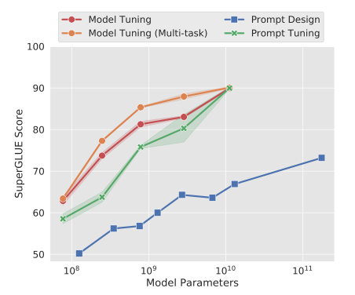
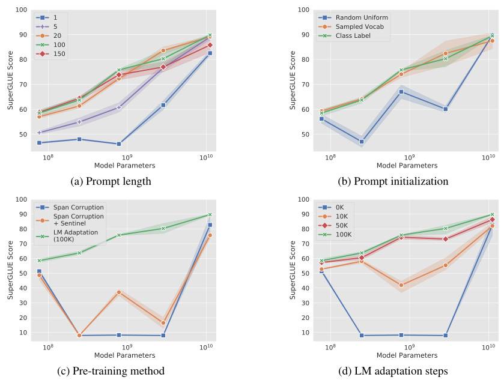
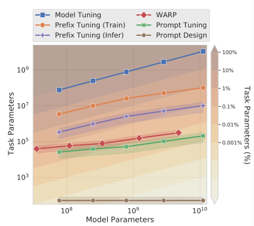
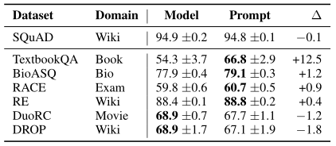
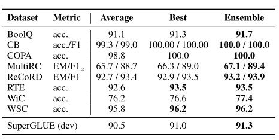
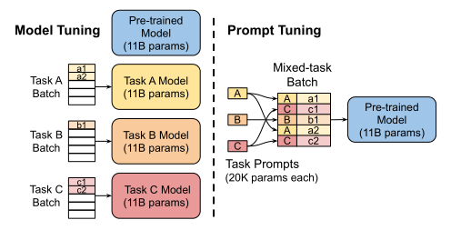

# .

prompt tuning的效果在模型参数足够大的情况下与model tuning（调整所有模型的参数），即常用的fine-tuning相同。

freeze the entire pre-trained model and only allow an additional k tunable tokens per downstream task to be prepended to the input text. 

加在输入上

初始化：随机、模型词汇、（分类任务）输出类

T5模型：span corruption、span corruption+在目标前加哨兵、LM+训练


默认设置：T5.1.1、LM、100k steps、输出类、prompt100token

SuperGLUE包含了8个不同的语言理解任务，每个训练一个prompt

30000step，交叉熵，lr=0.3，batch=32，early stop on 验证集

All experiments were run in JAX using the Adafactor optimizer with weight decay 1e−5, β2 decay 0.8, and parameter scaling off. The models were implemented in Flax


对比实验：

lr=0.001,Adafactor

model tuning:batch=$2^{16}$token

model tuning multitask:batch=$2^{20}$token


消融实验：

prompt length in {1, 5, 20, 100, 150}

初始化：随机uniform[-0.5,0.5]、模型词汇5000most common、输出类（类是由多个token组成，取平均；不够模型词汇）

预训练目标

LM训练次数

We have released T5 1.1 checkpoints adapted
using the LM objective for 100K steps for all model
sizes.：https://github.com/google-research/text-to-text-transfer-transformer/blob/main/released_checkpoints.md#lm-adapted-t511lm100k


域转移


多个prompt


compute metrics:

 GLUE and SuperGLUE dataset:https://github.com/google-research/text-to-text-transfer-transformer/blob/master/t5/evaluation/metrics.py

SQuAD and MRQA datasets:https://github.com/google-research/text-to-text-transfer-transformer/blob/master/t5/evaluation/metrics.py#L151


model:https://github.com/google-research/text-to-text-transfer-transformer/blob/master/released_checkpoints.md#t511
https://github.com/google-research/text-to-text-transfer-transformer/blob/main/released_checkpoints.md#lm-adapted-t511lm100k


超参


数据集：

https://www.tensorflow.org/datasets/catalog/glue#gluemrpc
https://www.tensorflow.org/datasets/catalog/glue#glueqqp
https://www.tensorflow.org/datasets/catalog/super_glue
https://www.tensorflow.org/datasets/catalog/squad#squadv11_default_config
https://github.com/mrqa/MRQA-Shared-Task-2019#out-of-domain

T5 preprocessing procedure：https://github.com/google-research/text-to-text-transfer-transformer/blob/master/t5/data/preprocessors.py

omit the dataset prefix denoting which SuperGLUEdataset an example belongs to.

SQuAD and MRQA ：https://github.com/google-research/text-to-text-transfer-transformer/blob/master/t5/data/preprocessors.py#L264

# 复现

[[2104.08691\] The Power of Scale for Parameter-Efficient Prompt Tuning (arxiv.org)](https://arxiv.org/abs/2104.08691)

[google-research/prompt-tuning: Original Implementation of Prompt Tuning from Lester, et al, 2021 (github.com)](https://github.com/google-research/prompt-tuning)

[google/jax: Composable transformations of Python+NumPy programs: differentiate, vectorize, JIT to GPU/TPU, and more (github.com)](https://github.com/google/jax#installation)

[google/gin-config: Gin provides a lightweight configuration framework for Python (github.com)](https://github.com/google/gin-config#readme)

Gin can be seen as a way of providing or changing default values for function or constructor parameters. Classes can also be marked as configurable, in which case the configuration applies to constructor parameters

```python
gin.parse_config_file('config.gin')
```

--gin_search_paths:directories to use as path prefixes for gin files.

[google-research/t5x (github.com)](https://github.com/google-research/t5x)


1. prompt_tuning/configs/models/t5_1_1_small_prompt.gin只有include
   1. prompt_tuning/configs/models/t5_1_1_prompt.gin
      1. prompt_tuning/configs/architectures/prompt_encoder_t5_1_1_flaxformer.gin
         1. prompt_tuning/configs/architectures/t5_1_1_flaxformer.gin
            1. ARCHITECTURE = @t5_architecture.EncoderDecoder()
            2. encoder_factory = @t5_architecture.Encoder
            3. decoder_factory = @t5_architecture.Decoder
            4. layer_factory = @t5_architecture.EncoderLayer
            5. layer_factory = @t5_architecture.DecoderLayer
         2. ARCHITECTURE = @prompt_layers.PromptEncoderDecoder()
         3. encoder_factory = @prompt_layers.PromptEncoder
         4. decoder_factory = @t5_architecture.Decoder
         5. encoder_mask_factory = @prompt_masks.create_prompt_encoder_mask
         6. add_fake_prompt_factory = @prompt_masks.add_fake_prompt
         7. prompt_factory = %PROMPT
         8. layer_factory = @t5_architecture.EncoderLayer
      2. module = %ARCHITECTURE
   2. prompt_tuning/configs/models/sizes/small.gin
2. prompt_tuning/configs/prompts/from_class_labels.gin
3. prompt_tuning/configs/runs/prompt_finetune.gin
   1. t5x/configs/runs/finetune.gin

# ppt

## 背景

model tuning:所有模型参数都要调整

prompt design:固定参数的语言模型+针对具体任务的提示文本（任务描述、典型例子）

优点：语言模型很大，大模型可以在多个具体任务中重用

缺点：任务描述需要人工参与、容易出错、效果受到输入的提示文本长度的限制，不如model tuning

自动化prompt design：

1. 搜索算法，找到针对具体任务的提示文本，效果不如model tuning
2. prefix tuning，在编码器的每一层transformer的输入前添加针对具体任务的可调整参数的激活向量
3. prompt tuning，简化，针对具体任务的可调整参数的embedding加在输入embedding上

## prompt tuning

使用的语言模型T5：将所有的任务都设计为文本生成任务，$Pr_{\theta}(Y|X)$，X是输入的一串token，Y是输出的一串token

加上prompt:$Pr_{\theta;\theta_P}(Y|[P;X])$

初始化prompt:

1. 随机
2. each prompt token drawn from 模型词汇表，选最常用的token
2. 分类任务，输出类的token

T5预训练使用的是span corruption:输入是包含哨兵，目标输出是相应哨兵和目标

1. 输入：“Thank you \<X\> me to your party \<Y\> week”
2. 目标输出：“\<X\> for inviting \<Y\> last \<Z\>”

prompt训练的三种设置：

1. span corruption:目标输出改为："for inviting last"
2. span corruption + sentinel:目标输出：“\<X\> for inviting \<Y\> last \<Z\>”
3. LM adaptation:训练T5生成自然文本的后续，之后可用于多个具体任务

## 实验



随着语言模型参数的增加，prompt tuning的效果和model tuning相当



(a)大多数模型，增加prompt的长度效果更好；当模型很大时，效果接近；长度超过20效果接近

(b)使用输出类的token做初始化效果最好；当模型很大时，效果接近

(c)LM的训练效果最好；当模型很大时，效果接近

(d)LM训练次数越多效果越好；当模型很大时，效果接近



prompt tuning的针对具体任务的参数数量最少

WRAP:针对具体任务的可调整参数的embedding加在输入embedding上，输出层可调



domain transfer任务:在一个任务中训练，在另一个任务中评估

prompt tuning效果比model tuning好；model tuning可能overfit，转移领域时效果不好



针对一个任务训练多个模型可以提高效果，但开销很大

prompt ensembling：针对一个任务训练多个prompt，共享一个LM，多个prompt通过投票的方式得到最终结果

prompt ensembling的效果比平均、最好的都好



不同任务可以并行推理，一个batch里可以存放不同的prompt

## 结论

随着语言模型参数的增加，prompt tuning的效果和model tuning相当

大模型可以在多个具体任务中重用，节省资源

在domain transfer、prompt ensembling中表现好

# 


