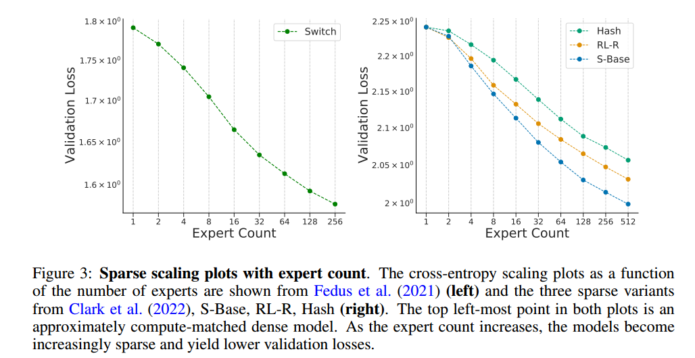
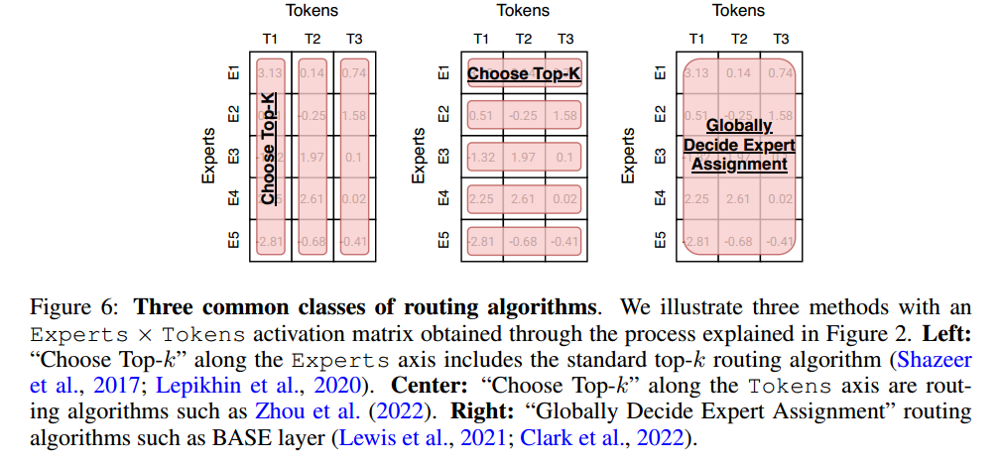
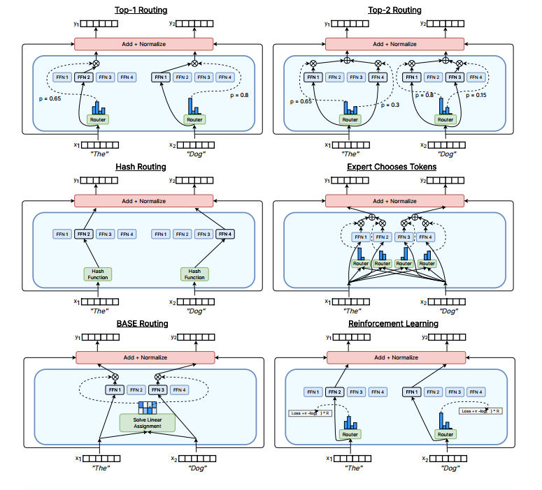

# ABSTRACT

通过这样做，稀疏度将参数计数与每个示例的计算解耦，从而允许非常大但高效的模型。

# SPARSE EXPERT MODELS

根据输入选择专家通常需要一个离散的选择(即使用哪个专家)，这使得依赖于可微性的反向传播算法变得复杂。As a
solution, Shazeer et al. (2017) proposed a top-k routing function which takes as an input a token

 Experts reside on different accelerators and the input data is dynamically dispatched to and fetched from them. 早期架构通常雇用许多小型专家，这些专家可以适合单个加速器(Lepikhin等人，2020)，但后来的作品设计了更大的专家，必须拆分到加速器(Fedus等人，2021;Du等人，2021)，并需要对通信效率进行额外优化

Dynamic routing on distributed systems incurs additional communication overhead beyond standard
Transformer models. Dispatching the inputs to the experts is often implemented as an all2all
communication primitive, where each accelerator communicates data to all other accelerators.

许多路由算法(但不是全部)在正向传递中产生两个all2all通信开销，在反向传递中产生另外两个all2all通信开销。使用更多的路由算法的一个例子是BASE层(Lewis等人，2021)，它需要四个all2all在正向传递中，另外四个在向后传递中。

The
capacity factor directly impacts the communication cost by modulating the expert batch size (Lepikhin et al., 2020) to be CF · (B/E), where CF is the capacity factor, B is the total tokens per
batch and E is the number of experts. Larger capacity factor values can improve quality, but at the
expense of increased communication, memory and compute costs. Efficient implementations of the
all2all primitive, along with changes to the routing algorithm (e.g. reduced capacity factor),
alleviate the added communication costs from sparse expert algorithms.

When training normal distributed Transformers it is known in advance what batch of data each accelerator will process. However, dynamic routing algorithms break this property because inputs are
dynamically routed to experts, which can often lead to different number of inputs getting sent to each
of the experts.

Therefore, routing algorithms often encourage load balance over the accelerators to
encourage good utilization. Load balance has been accomplished by auxiliary losses as well as through treating this as a linear assignment problem(?) (Lewis et al., 2021; Clark et al.,
2022). More details on advances to load balancing are provided in Section 4.

除了数据并行、模型并行和专家并行之外，DeepSpeed-MoE库(Rajbhandari等人，2022)还支持ZeRO partitioning (Rajbhandari等人，2019)(完全划分张量并根据需要重新聚集)和ZeRO- offload(卸载到CPU以减少GPU内存使用)。该系统产生了10倍的推理改进(Rajbhandari等人，2022)和最先进的翻译(Kim等人，2021)-增加了这些模型在生产服务中的实用性。

# SCALING PROPERTIES OF SPARSE EXPERT MODELS

The cross-entropy loss of dense neural language models was shown to scale as a power-law (i.e.l(x) = $(c/x)^α$ for a variable x) with respect to the model parameter count, amount of data, and
compute budget when not constrained by the other two factors (Kaplan et al., 2020). The power
law coefficients were later corrected in Hoffmann et al. (2022), which demonstrated that compute-optimal models required a closer balance of data and parameter scaling. In contrast, early research
in sparse expert models scaled heuristically – achieving strong empirical results – but without careful characterization of the scaling laws. Further, several works highlighted discrepancies between
upstream (e.g. pre-training) and downstream (e.g. fine-tuning) behavior (Fedus et al., 2021; Artetxe
et al., 2021), further complicating the understanding and explanation of sparse expert models.

(?)

## UPSTREAM SCALING

稀疏专家模型在训练大型数据集时表现出色。自然语言处理的一个常见范例是执行上游训练(例如预训练)，然后对特定感兴趣的数据分布进行下游训练(例如微调)。在上游阶段，稀疏专家模型始终比密集专家模型产生更高的收益。Shazeer等人(2017)在10亿词语言建模基准(Chelba等人，2013)上提出了关于模型参数和计算预算的缩放曲线，比密集版本取得了显着的收益。

发现与密集模型相比，域内语言建模的缩放明显更好，证实了Fedus等人(2021)的迁移困难。

This work considered
three classes of sparse models and derived a notion of effective parameter count (EPC). The EPC
estimates the dense-parameter equivalent for a sparse expert models, based on the FLOPs and the
number of experts. It was derived by conjecturing that sparse expert models followed a bilinear loss
and it was shown empirically that the cross entropy loss scales as a power law in this variable. Figure
3 presents the cross entropy scaling of Switch Transformers on the left and the three sparse variants
of Clark et al. (2022) on the right.

缩放曲线的一个关键特性是稀疏专家模型的增益随着规模的增加而降低，这意味着在FLOPs的900B参数之外，稀疏性将没有进一步的好处。然而，这个结果依赖于用于训练的令牌数量，所有模型只使用了130B个令牌。但根据Hoffmann等人(2022)最近的缩放结果，他们推荐更多的代币来训练计算最优模型(Chinchilla是在1.4T代币上训练的70B参数模型)，未来的工作可能会重新审视这一分析。

## DOWNSTREAM SCALING

然而，可靠的上游扩展并没有立即在下游任务上产生一致的收益。

Du等人(2021)提出了从1B-64B FLOPs的稀疏GLaM模型的缩放，每个稀疏层使用64位专家。GLaM取得了最先进的结果，在零次和单次性能上优于175B参数GPT-3 (Brown等人，2020)模型，同时在推理时每个令牌的FLOPs减少49%，功耗降低65%(图4中的左图)。

## SCALING THE NUMBER, SIZE AND FREQUENCY OF EXPERT LAYERS

许多早期的作品每层扩展到数千个相对较小的专家，这产生了出色的预训练和翻译质量.然而，在域移位(Artetxe等人，2021)或对不同任务分布进行微调(Fedus等人，2021)时，稀疏模型的质量不成比例地降低。用于少镜头推理(GLaM (Du et al, 2021))和微调(ST-MoE (Zoph et al, 2022))的最先进的稀疏模型仅使用多达64个较大的专家-更好地平衡计算和参数。As a result of the increased expert dimensions, these models require specific systemlevel sharding strategies over accelerators to run efficiently

Rajbhandari等人(2022)在网络的最后一层附近放置了更多的稀疏层。在Transformer中，最常见的方法是替换每一个其他前馈网络(FFN)层.Zoph等人(2022年)的每四层(0.25)和Fedus等人(2021年)的每层(例如1.0)。最后，Clark等人(2022)推荐的频率为0.5-1.0。

。先前的工作显示了大量专家的强大预训练和翻译结果(Shazeer等人，2017;Lepikhin等人，2020)，而迁移下表现最好的模型使用了更少、更大的专家(Du等人，2021;Zoph等，2022;Mustafa et al, 2022)。由于增加了实现路由的所有通信成本，互连速度较慢的网络可能会发现，在一定质量的时间基础上，较少的专家层是最优的。

# ROUTING ALGORITHMS

典型的朴素路径决策是不可微的，因为它是一个选择专家的离散决策。专家选择问题可以被重新定义为Bandit问题，一些作品已经使用强化学习来学习选择

Shazeer等人(2017)提出了一种可微分的启发式方法，避开了强化学习的挑战。直觉是两个或两个以上的专家在同一个例子上允许网络进行比较并优化相对性能。Fedus等人(2021)证明了top-1路由可以获得有竞争力的结果，后来的研究也证实了这一点(Clark等人，2022)。

This taxonomy also
further suggests yet to be explored routing algorithms. One example is an algorithm that benefits by
looking both horizontally and vertically at the router scores, but without incurring the cost of looking
globally. A token could first choose what experts it wants to go to, then based on this information,
each expert could choose what tokens it wanted

大多数路由算法都是动态的，但静态路由算法的一个值得注意的例子是Roller等人(2021)的哈希层。这项工作表明，通过散列输入令牌，随机固定路由可以与学习路由竞争。负载平衡是通过在训练之前选择散列函数来平衡批量令牌来实现的。

让每个专家选择要路由给它的令牌。这减少了在训练或线性分配算法期间添加辅助负载平衡损失的需要。经验表明，该算法表现良好，并且具有自适应计算解释，其中模型可以隐式地对某些令牌应用更多的计算。

BASE layers (Lewis et al., 2021)
treats token routing as a linear assignment problem. It aims to route a fixed number of tokens
to each expert and maximize the scores from the routing matrix. Since the tokens per processor
are highly correlated as they come from the same sentences, tokens are randomly shuffled around
before locally solving the linear assignment problem on each device. This shuffling introduces two
additional communication primitives (all2all) in both the forward and backward pass. Clark
et al. (2022) proposes their own variant of BASE layer (S-BASE) that uses an optimal transport
formulation.

有些路由算法并不完全属于上述三类。Zuo等人(2021)引入了THOR算法，该算法在训练和推理过程中为每个输入随机选择两名专家，并发现比标准MoE模型改进了2个BLEU点。Gururangan等人(2021)提出了DEMix，它明确地为不同的预训练领域(如法律、医学等)配备了不同的专家。然后可以通过对输入进行域匹配来选择专家。Fan等人(2021)使用明确的特定于语言的子层，其中输入令牌可以根据其语言进行确定性路由。这避免了需要动态路由算法。Ma等人(2018)引入了一种多门路由算法，其中每个任务都有自己独特的门控函数。

(expert choose:每个expert计算所有token，选最大的，刚好相反)

大多数路由算法通过在训练期间添加辅助损失来处理负载平衡，以鼓励将等量的令牌发送给不同的专家(Shazeer等人，2017)。一些路由算法通过其设计来处理负载平衡:基础层(Lewis等人，2021)解决了一个线性分配问题，该问题强制将相等数量的令牌作为问题陈述的一部分发送给每个专家。Nie等人(2021)首先训练一个混合专家模型，其中所有令牌都被发送给每个专家，但随着时间的推移，网络将适应top-1路由。该算法不需要负载平衡，因为网络可以通过训练自然地学习专家表示的专门化。

# WHEN TO USE A SPARSE VERSUS DENSE MODEL

一个常见的问题是，如果给你一个固定的计算或FLOP预算(例如，20小时100个gpu)，你应该训练哪种类型的模型来实现最佳性能?许多先前的研究表明，对于这种类型的设置，稀疏性比密集模型更好

在高层次上，当你有许多加速器(例如GPU/TPU)来承载使用稀疏性时出现的所有附加参数时，稀疏性是好的。通常使用数据并行性来训练模型，不同的机器将获得不同的训练/推理数据切片。用于操作不同数据片的机器现在可以用来承载更多的模型参数。 Therefore, sparse models are good when training with data parallelism and/or
have high throughput while serving: training/serving on many machines which can host all of the
parameters.

使用稀疏性还需要仔细考虑如何在下游使用该模型。如果有很多机器来预训练模型，但用于微调或服务的机器要少得多，那么稀疏性的数量(例如专家的数量)应该根据下游用例中可用的内存量进行调整。

On a per parameter basis, sparse models will always look comparatively worse to dense models.（？）
Assuming that all parameters are kept in the accelerators memory, this is a similar requirement to seeking the best model that can fit onto a certain hardware size (e.g. 4 GPUs), where again a sparse
model will be a worse option than a dense one. As mentioned above, sparse models are a great fit
when you have the ability to either be training or serving on many machines in parallel in order to
host the additional model parameters from the experts.

在内存受限的情况下，稀疏模型并没有失去所有的希望。Fedus等人(2021)表明，稀疏模型只需要两个专家就能很好地工作，这需要有限的额外内存。新的研究还允许通过在CPU和GPU之间动态交换模型内存来克服GPU/TPU内存短缺(参见2.2节了解更多细节)。

#  SPARSE MODEL TRAINING IMPROVEMENTS

稀疏模型经常被报道为更不稳定，这意味着损失偏离并增加。在更大的模型尺度上，不稳定性也更常出现。

最大的模型不稳定性可以通过使用更高的精度(float32)来训练模型来修复，但代价是更多的内存使用和更慢的训练。Fedus等人(2021)建议使用较低的权重初始化规模，并仅将路由网络的特定子集投射到更高的精度，以获得更好的模型稳定性/训练。Du等人(2021)跳过梯度中具有任何nan或inf的数据批次，并在出现任何训练分歧时从较早的检查点重新启动模型。

一些研究论文，特别是在更大的尺度上，注意到转移到新领域(如微调)的MoE模型滞后于它们的密集对应。对于给定的预训练困惑，稀疏模型在推理任务上的微调效果更差，但在知识繁重的任务上则更好。除了更差的域外语言建模性能外，Artetxe等人(2021)还观察到，在多个任务(包括HellaSwag、PIQA和Winogrande)上，与密集模型相比，精细调整更差。

已经提出了几种不同的方法来帮助解决微调问题。一种方法是通过使用更多的flop而不是更多的稀疏性来缩放模型(例如，更少的专家，但使它们更大)。Fedus等(2021)用2048位专家训练了一个1.6T参数的模型，但它的FLOPs只相当于一个2B的密集模型。相反，具有最佳微调性能的模型只有128位专家，但FLOPs数量为11B密集模型。Trading off less sparsity for more FLOPs when scaling a model is a simple way to ensure better fine-tuning performance.

请注意，对于密集和稀疏模型，最优微调超参数(例如学习率和批处理大小)可能会有很大不同。

通过设计，稀疏专家模型比密集专家模型有更多的参数。虽然所完成的计算仍然相对较低，但内存占用可能是一个负担。因此，一些研究侧重于减少在推理时所需的参数数量，以减轻服务要求。Kudugunta等人(2021)在任务级别而不是单词或令牌级别进行机器翻译。这允许更有效的推理，因为只需要所需任务的权重子集。Kim等人(2021)删除了推理中的专家，以减少模型的内存占用。使用两种不同的方法进行修剪:随机选择专家子集和选择在推理时利用率最高的专家。Fedus等人

(2021)将大型稀疏模型提炼成较小的密集模型，用于语言建模和微调。

Rajbhandari等人(2022)通过减少网络专家层的深度，研究了用于语言建模的稀疏模型的蒸馏。

#  INTERPRETABILITY

稀疏专家模型更自然地将自己用于可解释性研究，因为每个输入都由模型权重的一个可识别的离散子集(即所选专家)处理。因此，与其解释可能数以万亿计的浮点数的艰巨任务，还不如读取一小组离散的整数，这些整数对应于发送输入的专家。

Shazeer等人(2017)在WMT ' 14 EnFr机器翻译任务上对其2048 MoE层编码器的专家专业化进行了初步研究。他们确定了三位专家，一位专门研究与创新相关的词汇，第二位负责处理文章“a”，第三位负责处理速度的同义词。

# FUTURE DIRECTIONS AND CONCLUSIONS

自适应计算是指机器学习系统的不同输入可能使用不同数量的计算(即计算的数量或类型是动态适应的)。稀疏模型建立在镜像思想的基础上:每个输入使用相同的计算量，但可能使用不同的参数。然而，这些技术并不是相互排斥的;一些路由算法(第4节)允许通过向可变数量的专家发送令牌来进行自适应计算(Riquelme et al, 2021;Zhou et al .， 2022)。例如，除了选择哪个专家，网络还可以选择使用的层数(Schuster et al, 2022)。异构专家层也很适合自适应计算。大多数稀疏模型在现代硬件上使用相同类型和大小的专家来简化和提高效率。但是，通过允许专家在大小(例如深度或宽度)上有所不同，路由决策将导致不同的计算量。

检索机制通过允许模型动态访问当前上下文之外的信息或存储在参数中的信息，有效地扩展了模型的容量(Khandelwal等人，2019;Guu et al .， 2020;Borgeaud et al, 2022)。稀疏专家模型和检索模型有一个重叠的目标:增加模型更好地存储、检索和应用知识的能力。

我们仍然不太了解专家的最佳数量和规模如何取决于任务(例如，应该使用几个大专家还是许多小专家进行翻译?)。实现强大的域外泛化并不那么直接，需要更好的解释。大多数稀疏专家模型具有相对较低的架构多样性，其中稀疏层以规则的间隔穿插。未来的模型可能受益于较少标准化的结构和异构专家架构。此外，还必须确定适当的稀疏度粒度:大多数工作都集中在替换组件的专家上，例如前馈网络层，但是发现了更完全模块化的独立专家的好处(Gururangan等人，2021;Li et al .， 2022)。