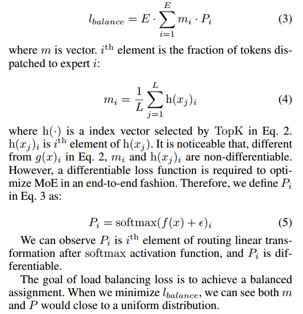
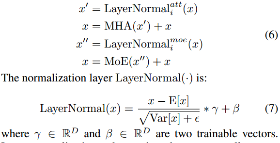
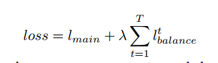
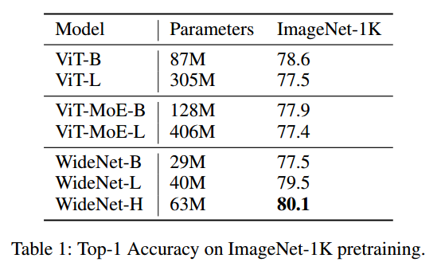
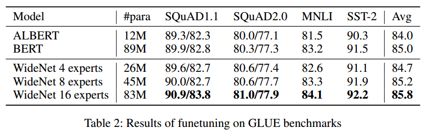
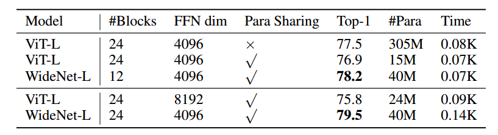

# Abstract

最近，越来越多的带有残余连接的变压器块在各种任务上取得了令人印象深刻的成果。To
achieve better performance with fewer trainable parameters,
recent methods are proposed to go shallower by parameter
sharing or model compressing along with the depth. 然而，较弱的建模能力限制了它们的性能。相比之下，通过引入更多可训练的矩阵和参数来扩大范围，将产生一个巨大的模型，需要高级并行性来训练和推理。在本文中，我们提出了一个参数有效的框架，范围更广，而不是更深。Specially, following existing works, we adapt parameter sharing to compress along
depth.（？） But, such deployment would limit the performance.为了最大限度地提高建模能力，我们通过用混合专家(MoE)代替前馈网络(FFN)来扩展模型宽度。 Across transformer blocks, instead of sharing normalization layers（？）, we propose to use individual layernorms to transform various semantic representations in a
more parameter-efficient way.

 On ImageNet-1K, our best model
outperforms Vision Transformer (ViT) by 1:5% with 0:72×
trainable parameters. Using 0:46× and 0:13× parameters,
our WideNet can still surpass ViT and ViT-MoE by 0:8%
and 2:1%, respectively. On four natural language processing
datasets, WideNet outperforms ALBERT by 1:8% on average
and surpass BERT using factorized embedding parameterization（？） by 0:8% with fewer parameters.

# Introduction

为了进一步提高变压器的有效性和效率，有两种思路来部署可训练参数。第一个想法是将变压器沿宽度缩放到更多可训练的参数(例如，Switch transformer (Fedus, Zoph, and Shazeer 2021)， ViTMoE (Riquelme et al 2021))。这些稀疏模型可以通过稀疏条件计算扩展到具有相当FLOPs的超大模型。 Another thought is to decrease the trainable parameters for a lite model. （？）为此，一些工作建议跨变压器块(例如，通用变压器(Dehghani等))重用可训练参数。模型压缩(Xu et al . 2020;Sun等人(2019)也可以使变压器的参数效率更高。（变大变小都可以提高有效性和效率？这是什么逻辑？）

现有的两种方法都有各自的局限性。对于大型模型，一种典型且有效的可训练参数扩展方法是将变压器块中的部分前馈网络(FFN)层替换为混合专家(MoE)层。在每个MoE层中，为了细化单个令牌表示，只激活少数专家，因此基于MoE的变压器具有与普通变压器相当的flop。然而，在训练和推理过程中，我们需要使用高级并行(例如，张量(Shoeybi等人2019)、序列(Li等人2021)、管道(Huang等人2018)和专家并行(Lepikhin等人2020))来将这些模型保存在TPU或GPU上。此外，在扩展过程中，性能不能线性提高。另一个限制是基于MoE的模型的稀疏性不能在相对较小的数据集上很好地扩展。

对于小型模型，虽然通过变浅可以显著减少可训练参数，但这些变浅模型的性能仍然低于原始变压器。这些较小的模型是通过压缩原始模型的深度来构建的，因此所有的变压器块都共享相同的知识。这种结构不可避免地会造成模型容量的损失

我们提出了一个参数部署框架，它更有效地部署可训练参数:更广泛而不是更深。然后我们在转换器上实现它，并将其命名为WideNet。特别地，我们首先采用了随深度的参数共享来达到更浅的目的。Due to avoidable model capacity loss, we go wider by using
the same MoE layer in all transformer blocks. The multihead attention layer is also shared across the blocks. 为了帮助转换块从MoE层学习不同的语义并最大化建模能力，我们不共享规范化层。规范化层的不同可训练参数使得变压器块可以用不同的表示形式来馈送。 Since the modeling capacity of each transformer block has been enhanced
by the MoE layer, it can model diversified semantics effectively with the same trainable parameters. 因此，使用一个关注层和一个更强的MoE层来学习复杂的表示，使用独立的归一化层来学习多样化的语义表示，这是一个更宽而不是更深的参数高效和有效的框架。与简单地沿着宽度缩放相比，更宽而不是更深是一个更有效的参数框架，这使得模型足够小，可以适应下游任务，而不需要高级并行性。其次，WideNet中的每个专家可以通过更多的令牌表示进行训练，使其具有更好的泛化性能。

与简单随深度压缩的模型相比，WideNet中所有的变压器块共享一个相同的MoE层，而不是一个FFN层。这种结构最大限度地提高了每个变压器块的建模能力。更多的专家可以用更强的能力建模更复杂的令牌表示。另一个区别是独立的规范化层。这些层几乎没有额外的可训练参数，但它们可以将输入表示转换为其他语义域。在这种情况下，有了足够强大的单个MoE层，WideNet仍然可以很好地从不同的层次建模语义。

为了提高参数效率，我们提出在变压器块之间共享MoE层。共享的专家可以在不同的转换块中接收不同的令牌表示，这使得每个专家都可以得到充分的训练

我们建议在变压器块之间保持单独的规范化层。可以通过添加少量可训练参数将输入隐藏向量转换为语义信息。然后，可以将多样化的输入馈送到相同的注意层或更强的MoE层来建模不同的语义

# Mixture-of-Experts

Our core idea is to deploy more trainable parameters along
the width and fewer trainable parameters along with the depth. 为此，我们采用MoE随宽度缩放变压器。

在训练过程中，如果MoE模型没有正则化，大多数令牌可能会被分配给一小部分专家。这种不平衡的分配会降低MoE模型的吞吐量。此外，更重要的是，大多数额外的可训练参数不会被完全训练，使得稀疏条件模型在缩放时无法超越相应的密集模型。因此，为了平衡负载，我们需要避免两件事:(1)将太多令牌分配给单个专家，以及(2)单个专家接收的令牌太少。要解决第一个问题，需要缓冲区容量B。也就是说，对于每个专家，我们最多只保留B个令牌，而不管向该专家分配了多少令牌。如果分配了多个B = CKNL令牌，则将删除左边的令牌。C是容量比，这是一个预定义的超参数。K为选定的专家人数。N是每个设备上的批处理大小。L为序列长度。缓冲容量B帮助我们为每个专家删除冗余令牌以最大化吞吐量，但它不能确保所有专家都收到足够的令牌进行训练。使用可微分负载平衡损失而不是单独的负载平衡和重要性加权损失来平衡路由器中的负载。在训练过程中，将以下辅助损失添加到模型总损失中:

（P是没有经过top-k的g，h对应非0g值的位置，p代表重要性，h代表负载）

# Go Wider Instead of /-eeper

由于我们使用MoE层来获得更强的建模能力，为了克服稀疏条件计算的过拟合，我们需要为每个专家提供足够的令牌。（？）Please note that,
although we share trainable parameters in the MoE layer including the router, token representations corresponding to
the same token are different in every transformer block.

对于共享层归一化，MHA和MoE层的输入在不同的变压器块中更加相似。由于我们已经共享了可训练矩阵，因此我们鼓励更多样化的输入来表示不同转换器块中的各种语义。

与现有的基于MoE的模型类似，我们发现性能对λ不敏感。

# Experiments

本文的目标不是实现SoTA性能，而是表明我们的参数部署框架可以用更少的可训练参数来改进变压器主干。

在ImageNet-1K上，WideNet-H达到了最好的性能，并且显著优于ViT和vite - moe模型。与最强基线相比，我们的WideNet-H在可训练参数较少的情况下优于ViT-B 1:5%。即使我们使用最小的模型WideNet-B，它仍然可以与可训练参数减少4倍以上的viti - l和viti - moe - b取得相当的性能。当我们扩大到WideNet-L时，它已经超过了vitb的一半可训练参数和vitl的0:13倍参数的所有基线。

为了研究MoE在ImageNet-1K等较小数据集上不能很好扩展的原因，我们分别在vite -MoE和WideNet上进行了两组实验。结果如图2所示。我们观察到更多的专家(可训练参数)导致过拟合，尽管更多的专家意味着更强的建模能力。

为了进一步验证每个专家需要不同的令牌进行训练，我们在WideNet上进行了第二组实验。We define the transformer blocks using the same routing assignment that belongs to one group. To change the input diversity of each expert, each group includes more than one
transformer block. That is, the hidden representations corresponding to the same token would be fed into the same
expert within the same group.(同一个token不管什么表示都分到相同专家) As shown in Fig. 3, when we use fewer groups, which
means we have fewer routing operations, there is an obvious performance drop. We can suggest less diversified tokens are
fed to each expert because fewer groups mean less routing
and assignments.（fed到一个专家的token相同） Therefore, more diversified tokens are required to train MoE based models on smaller datasets. More
importantly, such results show the effectiveness and necessity of our design, routing at every transformer block.

Compared with vanilla ViT, we
expect a larger variance of trainable vectors γ and β across
blocks. In this section, we are interested in layer normalization before MoE or FFN。In Fig. 4 and Fig. 5, we can observe that both γ and β
in WideNet have larger y than those in ViT, which means
MoE receives more diversified input than ViT. 这样的结果证明了我们的假设，即单独的规范化层可以帮助建立具有共享的大型可训练矩阵的各种语义模型

我们首先用共享层的规范化替换单个层的规范化。我们可以观察到，在几乎相同的可训练参数下，性能会下降。这样的观察结果表明了我们设计的有效性。

我们将MoE层恢复到FFN层。如果没有MoE层，训练将会非常困难，而且可训练的参数要少得多。例如，没有MoE层的WideNet-B遇到梯度爆炸，性能下降明显。

如果没有跨变压器块的参数共享，我们还可以观察到性能的轻微下降和参数的显著增加。

we conduct a second set of ablation studies to evaluate our WideNet
with comparable speed or computation cost with the baselines.

compared with ViT-L, WideNetL is more computation expensive. We can observe a training time increment. However, when WideNet-L uses fewer
transformer blocks (i.e., 12 blocks)(block减少，参数几乎不变，因为共享) than ViT-L, WideNet-L
outperforms ViT-L by 0:7% with slightly less training time
and 13:1% parameters, and, similarly, there is a larger performance improvement than ViT-L with parameter sharing.We can see
scaling to more trainable parameters and FLOPs cannot improve the performance of ViT-L, which also shows the effectiveness and necessity of our framework.Although ViT-L
has a comparable computation cost with WideNet for each
token, WideNet still spends more training time per epoch. there are two reasons, i.e.,
routing operation and C > 1:0. We leave optimize this as
our future work

# Conclusion

WideNet首先通过参数共享来压缩可训练参数和深度。在ImageNet-1K上，我们最好的模型只需要63M个参数就能达到80:1的Top-1精度，大大优于ViT和ViT- moe。调查显示了MoE不能在较小的数据集上很好地扩展的原因。也就是说，每个专家都需要足够的代币来训练。

参数共享：moe，attention