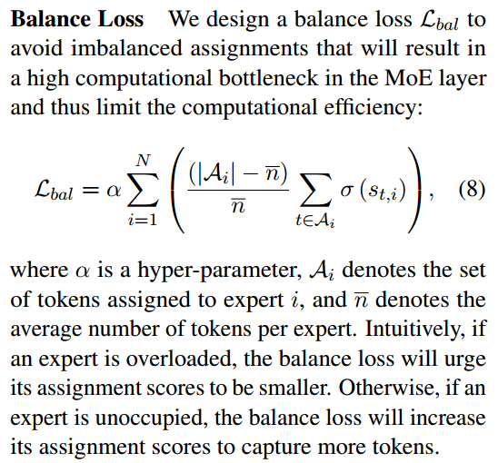

# Abstract

We
point out that existing learning-to-route MoE
methods suffer from the routing fluctuation issue, i.e., the target expert of the same input
may change along with training, but only one
expert will be activated for the input during inference。路径波动往往会损害样本效率，因为相同的输入更新不同的专家，但最终只使用一个。在本文中，我们提出了两个训练阶段的STABLEMOE来解决路由波动问题。

In the first training
stage, we learn a balanced and cohesive routing strategy and distill it into a lightweight
router decoupled from the backbone model. In
the second training stage, we utilize the distilled router to determine the token-to-expert
assignment and freeze it for a stable routing
strategy. 我们在语言建模和多语言机器翻译上验证了我们的方法。结果表明，STABLEMOE在收敛速度和性能方面都优于现有的MoE方法。

# Introduction

 In
this way, we can expand the model scale by adding
expert modules, which will keep the computational
and memory overhead within a tolerable range（存储？）

Most existing MoE methods (Lepikhin et al.,
2021; Fedus et al., 2021; Lewis et al., 2021) decide
the token-to-expert routing according to the dynamically changing token representations. However,
we point out that they face the routing fluctuation
problem. As shown in Figure 1, the same input may
be assigned to different experts along with training.
However, during inference, only one expert will
be activated for the input. The routing fluctuation
problem tends to harm sample efficiency because
the same input updates different experts while only
one is finally used

For an input token, we define
the last fluctuation step as the last step where its
target expert is different from the final step. We
plot the cumulative token percentage with regard to
the last fluctuation step (annotated as its percentage
accounting for all training steps) in Figure 2. We
find that the last fluctuation step of 40.9% tokens
exceeds 20%, which means 40.9% tokens do not
have a stable target expert when 20% of all training
steps have been done. Furthermore, 29.1% tokens
still change their target experts after half of the
whole training process, and 15.4% tokens even
change the target expert after 80% of all training
steps, which is nearing the training ending. These
statistics prove that the routing fluctuation problem
indeed exists in previous MoE methods

In the first training stage, we follow
the learning-to-route paradigm and aim to learn a balanced and cohesive routing strategy. 我们设计了一个平衡损失来保证分配是平衡的。. In addition, inspired by Lewis et al. (2021),
we adopt a sigmoid gating mechanism, which enables the task objective to propagate supervised signal back to the routing strategy, to facilitate learning a more cohesive assignment. (?)随着路由策略的学习，我们同步地将其提炼成一个与骨干模型解耦的轻量级路由器。在第二个训练阶段，我们利用经过提炼的路由来确定token -专家分配。在此阶段对提取的路由进行冻结，以提供稳定的路由策略，解决了剩余训练中的路由波动问题。

#  Background: Mixture-of-Experts for Transformers

我们通过将由一组ffn组成的MoE层插入到两个相邻的Transformer块中来实现Transformer的MoE。

# Method

## Training Stage 1: Learn Routing Strategy

Considering the sigmoid gate σ (st;at
), if FFNat
is beneficial for token t, optimizing the training
objective (e.g., minimizing the cross-entropy loss
for language modeling) will urge the gate to be greater; otherwise, the gate will tend to be smaller. The gate signal urges similar tokens to be assigned
to the same expert that is beneficial to them, thus
producing cohesive token-to-expert assignments.

In practice, D(·) can also be other feature extractors such as CNNs
or Transformers (we investigate other variants of
distilled routers in Section 4.4.3), but the word
embedding is the fastest one and achieves the best
performance. （是共享的吗不可能每一层的h都一样吧）

在训练阶段1结束时，我们冻结了蒸馏路由器的所有参数(即D(·)和^E)，为训练阶段2和推理阶段准备了稳定的路由策略。

## Training Stage 2: Learn with Stable Routing Strategy
给定冻结的D(·)和^E，在训练阶段2，我们直接使用它们作为稳定的路由策略。

(只有选择是固定的，其他还是要算s，FFN(h))

## Inference

在推理过程中，我们也使用冷冻蒸馏路由器进行路由。固定的路由策略与训练阶段2一致，使得在MoE层学习到的信息得到更充分的利用，从而获得更好的性能。

## Comparison with Existing MoE Methods

开关变压器和STABLEMOE中的训练阶段1简单地将每个令牌分配给具有最高亲和力的专家。BASE Layer采用竞拍算法(Bertsekas, 1992)寻找具有最大关联和的全局均衡分配。STABLEMOE中的哈希层和训练阶段2采用令牌级固定路由策略，具有良好的稳定性。

哈希层使用硬门控功能，这意味着专家要么完全激活，要么不激活，没有任何中间状态。

Switch Layer、BASE Layer和STABLEMOE具有软门控功能，可以判断令牌与目标专家之间的亲和力，并确定适当的比例来使用专家。软门控机制还促使模型学习更有凝聚力的令牌到专家的分配

BASE Layer and Hash Layer do
not apply any balance losses. By contrast, Switch
Transformer and the training stage 1 in STABLEMOE design balance losses to control the balance
of the token-to-expert assignment

In summary, combing two training stages, STABLEMOE has a stable, cohesive, and balanced routing strategy, while the other three MoE methods
cannot meet them all simultaneously

# Experiments

我们将STABLEMOE与开关变压器、基础层、哈希层和标准变压器进行比较。所有MoE模型都具有与标准Transformer相同数量的共享参数。此外，在基本设置下，我们比较了两个更大的密集变压器，它们以密集的方式添加ffn，以达到与MoE模型相同的总参数数量。更深的模型堆叠更多的ffn，而更宽的模型使用隐藏大小更大的ffn。The floating
point operations (FLOPs) per sequence are profiled
by the torchprofile toolkit.

Under the base setting, STABLEMOE outperforms
existing MoE methods on both the validation and
the test sets by 0.3-0.8 perplexity. Compared with
dense models, STABLEMOE achieves about 3.7
lower perplexity than the standard Transformer,
and about 1.3 higher perplexity than the deeper
larger model. Under the large setting, consistently,
STABLEMOE outperforms the other MoE methods,
and achieves about 2.6 lower perplexity than the
standard Transformer.

Although larger dense models achieve better validation perplexity at last, their training speed is quite
slow. With regard to the convergence speed, MoEbased Transformers usually exceed dense models.
Further, among the MoE methods, STABLEMOE
has the fastest convergence speed.

. All MoE-based models have the same number of shared parameters as the standard Transformer.(77M?) Except the
standard Transformer, the other models have the
same FLOPs(90M?moe=shared+expert?)

STABLEMOE在比较的MoE方法中达到了最好的平均测试BLEU。在FLOPs相同的情况下，STABLEMOE的性能比dense模型高出1.22 test BLEU。使用MoE技术，我们将参数数量增加了523%，而FLOPs仅增加了9.3%。

 As the number of experts goes larger, the validation perplexity
of each model tends to further descend. Consistently, STABLEMOE performs the best with different numbers of experts. In addition, it is worth
noting that STABLEMOE with 16 experts outperforms BASE Layer with 32 experts, and STABLEMOE with 32 experts achieves a similar perplexity
to BASE Layer with 64 experts.

Models with 3 and 10 expert sublayers have 454M and
1.51B expert parameters, respectively. From Figure 6, we observe that more expert parameters bring
better performance, and STABLEMOE consistently
performs the best under both settings.

By
default, the MoE layer stacks 3 MoE sublayers and
is inserted after the L/2th Transformer block (middle). We also attempt to insert the MoE layer before the first Transformer block (bottom), and after the
last Transformer block (top). In addition, we also
investigate the effect if we scatter 3 MoE sublayers
uniformly into the standard Transformer, i.e., after
the L/4-th, 2L/4-th, and 3L/4-th blocks, respectively. As
shown in Table 4, among the above four settings,inserting stacked MoE sublayers into the middle
position allows STABLEMOE to achieve the best
performance.

我们研究了STABLEMOE中两个训练阶段之间比率的平衡点。给定固定的总步数，将更多的步数分配到训练阶段1可以帮助学习和提取更好的路由策略。另一方面，训练阶段2的比例越大，意味着稳定训练的时间越长。在语言建模的基本设置下，我们尝试为训练阶段1分配6K、15K和30K步，结果如表6所示。我们发现，如果我们使用词嵌入作为蒸馏路由器，分配6K步(总步数的10%)到训练阶段1是一个很好的平衡点。我们推测，词嵌入足够简单，可以快速学习，所以更长的稳定训练更重要，以达到更好的性能。

我们设计了两个实验来研究固定路由策略能带来多大的性能改进。一方面，我们为BASE层配置了稳定的路由策略，以解决其路由波动问题。如表5所示，固定路由策略使BASE层的验证困惑度降低了0.63。另一方面，我们试图在STABLEMOE中禁用训练阶段2，并始终像训练阶段1一样训练模型。因此，STABLEMOE的验证困惑度比具有固定路由策略的完整版本高0.20。这两个实例表明，固定路由策略解决了路由波动问题，可以为基于moe的变压器带来更好的性能。

在表6中，除了单词嵌入之外，我们还研究了四种不同层数的蒸馏路由器变体，包括CNN和三种transformer。从表中我们可以发现，使用词嵌入可以获得最好的性能，而3层Transformer则表现不佳。

路由波动问题对于基础层来说是很明显的。相比之下，对于STABLEMOE，由于我们采用了固定的路由策略，所以在训练阶段2没有路由波动。

#  Related Work

哈希层(Roller等人，2021)提出了一种非参数路由策略，该策略使用预先设计的令牌级哈希表来确定令牌到专家的分配。静态路由策略不会波动，但随机确定的哈希表限制了其性能的上限。我们的工作包括学习路由方法在学习均衡和内聚路由策略方面的优势，并通过应用模拟原始路由策略的冻结轻量级路由器进一步解决路由波动问题。

# Conclusion

首先学习一个均衡的内聚路由策略，并同步地将其提炼成一个与骨干模型解耦的轻量级路由器。然后，在剩余的训练中，我们冻结蒸馏的路由器以获得稳定的路由策略。

# Visualization of the Fixed Routing Strategy of STABLEMOE
在验证集中，对于每个专家，我们展示了分配给它的最常见的令牌以及描述其共同特征的文本。我们发现分配给同一专家的标记通常具有一些共同特征，例如，专家22捕获形容词，专家31捕获连词。这些案例显示了STABLEMOE中令牌到专家分配的良好凝聚力。

# 。

现有的MoE方法存在路由波动问题，即相同输入的目标，专家可能随着训练而变化，但在推理过程中只会为输入激活一个专家。路径波动往往会损害样本效率，因为相同的输入更新不同的专家，但最终只使用一个。

在本文中，我们提出了两个训练阶段的STABLEMOE来解决路由波动问题。在第一个训练阶段，我们学习了一个平衡和内聚的路由策略，并将其提炼成一个与骨干模型解耦的轻量级路由器。在第二个训练阶段，我们利用经过提炼的路由来确定令牌到专家的分配，并将其冻结以获得稳定的路由策略。

在语言建模和多语言机器翻译上验证了我们的方法。结果表明，STABLEMOE在收敛速度和性能方面都优于现有的MoE方法。

For an input token, we define the last fluctuation step as the last step where its
target expert is different from the final step.

We find that the last fluctuation step of 40.9% tokens exceeds 20%, which means 40.9% tokens do not have a stable target expert when 20% of all training
steps have been done.

这些统计数据证明了在以往的MoE方法中确实存在路由波动问题。

We design a balance loss to guarantee the assignment is balanced.

In addition, inspired by Lewis et al. (2021), we adopt a sigmoid gating mechanism, which enables the task objective to propagate supervised signal back to the routing strategy, to facilitate learning a more cohesive assignment.

通过将由一组ffn组成的MoE层插入到两个相邻的Transformer块中来实现Transformer的MoE。

我们设计了两个实验来研究固定路由策略能带来多大的性能改进。一方面，我们为BASE层配置了稳定的路由策略，以解决其路由波动问题。

如表5所示，固定路由策略使BASE层的验证困惑度降低了0.63。

我们试图在STABLEMOE中禁用训练阶段2，并始终像训练阶段1一样训练模型。因此，STABLEMOE的验证困惑度比具有固定路由策略的完整版本高0.20。这两个实例表明，固定路由策略解决了路由波动问题，可以为基于moe的变压器带来更好的性能。