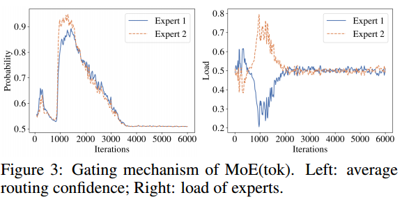
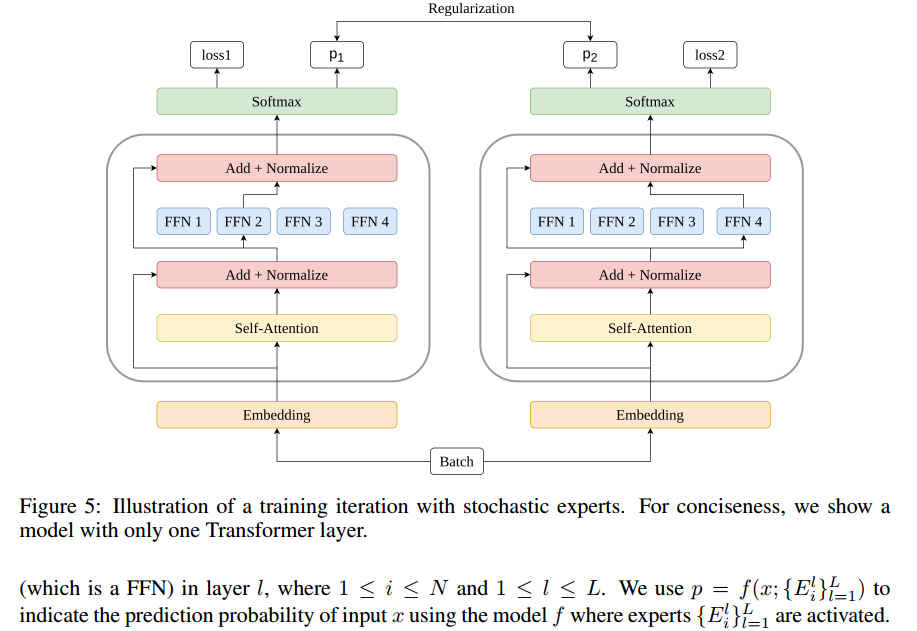
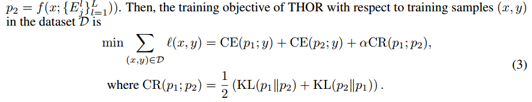
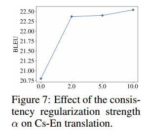

# ABSTRACT

然而，据报道，sam的参数效率不高，因此较大的模型并不总是带来更好的性能。虽然大多数正在进行的研究都集中在通过探索将输入路由给专家的方法来改进sam模型，但我们的分析表明，这样的研究可能不会导致我们期望的解决方案，即基于门通机制的常用路由方法并不比随机路由输入给专家更好。THOR中的专家在训练和推理过程中对每个输入都是随机激活的。THOR模型使用一致性正则化损失进行训练，其中专家不仅从训练数据中学习，还从作为教师的其他专家中学习，以便所有专家做出一致的预测。我们验证了THOR在机器翻译任务上的有效性。结果表明，THOR模型的参数效率更高，在各种设置下，它们明显优于Transformer和MoE模型。例如，在多语言翻译中，THOR比Switch Transformer高出2个BLEU分数，并获得与最先进的MoE模型(Kim et al, 2021)相同的BLEU分数，后者是前者的18倍。

# INTRODUCTION

模型使用其所有参数来处理所有输入。这些模型的一个缺点是训练成本过高。此外，极端的尺寸大大降低了推理速度，进一步限制了模型的实用性。

因此，训练地对空导弹比训练密集激活模型更具成本效益。例如，Switch-large (Fedus et al, 2021)和T5-large (rafael et al, 2019)的训练需要相同的前向FLOPs，尽管前者是前者的35倍(263 vs. 7.4亿个参数)。然而，据报道，地对空导弹的参数效率很低。例如，虽然Switchlarge模型比T5-large大35倍，但它在GLUE基准测试上的性能(Wang et al .， 2019a)只稍微好一点(88.5 vs. 87.8)。也有一些情况下，地对空导弹的性能甚至比较小的密集激活模型更差。例如，Switchlarge在ARC推理挑战中的表现不如T5-large (66.0 vs. 68.8) (Clark et al, 2018)。在另一个例子中，尽管GShard (Lepikhin等人，2020)显示出比密集激活的模型有实质性的收益，但已经观察到随着参数数量的增加，收益会递减

大多数正在进行的研究都集中在通过开发有效的路由方法来改进地对空导弹。

However, these routing methods have not been proved effective
to make SAMs more parameter efficient. To understand why SAMs are not parameter efficient, we
analyze the performance of several classic MoE models. Our analysis reveals that a SAM does not
always outperform a densely activated model of a similar size, confirming the results reported in
Yang et al. (2021). Moreover, we also observe that the widely-used routing method based on the
gating mechanism does not work better than randomly routing inputs to experts,

受我们研究结果的启发，我们提出了一种新的SAM, THOR(随机专家变压器)。

与经典的sam(如Switch Transformer)不同，THOR中的专家在训练和推理期间对每个输入都是随机激活的(不需要任何门控机制)。通过最小化交叉熵损失和一致性正则化项来训练THOR模型，这样专家不仅可以从训练数据中学习，还可以从作为老师的其他专家中学习，从而使所有专家做出一致的预测。

# BACKGROUND

解码器的构造类似，除了在每个解码器层中有一个额外的交叉注意机制。

每个专家层都包含一个注意机制和多个并行FFN，其中每个FFN都被称为专家。

所有的输入都路由给一个专家。这个问题被称为负载不平衡。

现有工作采用各种特设启发式方法来缓解这一问题，例如，在Eq. 1中添加高斯噪声(噪声门控，Shazeer等人2017)，限制可以路由给专家的最大输入数量(专家容量，Lepikhin等人2020)，施加负载平衡损失(Lepikhin等人，2020;Fedus等人，2021)，并使用线性分配(Lewis等人，2021)。还有其他工作可以消除门控机制，使负载不平衡不再是一个问题，例如，通过合并哈希函数(Roller et al, 2021)。除了负载不平衡问题外，如何构造Eq. 2中的T也引起了热烈的讨论。例如，Shazeer et al (2017);Lepikhin et al (2020);Yang等人(2021)推测，将输入路由给K > 1个专家是必要的，而Fedus等人(2021)认为使用K = 1就足够了，而且计算效率更高。

# ANALYSIS OF SPARSELY ACTIVATED MODELS

我们考虑Shen等人(2019)提出的两种MoE模型，分别称为MoE(dec)和MoE(tok)，以及Fedus等人(2021)提出的开关变压器的三种变体。对于所有MoE模型，专家的数量设置为2。我们将它们与相同模型尺寸的Transformer (Vaswani et al .， 2017)模型进行比较。

图1显示了三个模型的验证损失和BLEU分数:Transformer、MoE(dec)和MoE(tok)。我们看到，这两个MoE模型的性能非常相似，而且两者的性能都没有明显优于Transformer。

To interpret the results of Figure 1, we examine the load of each expert and the confidence scores
of routing inputs to different experts. An expert’s load is defined as the proportion of inputs that are
assigned to it. For an input that is routed to an expert, its routing confidence score (output of the
gating mechanism) determines the level of preference, e.g., if the routing confidence score is 0.5,
then the gate has no preference for either expert. For each expert, we compute the average routing
confidence score over all the inputs assigned to it（重要性）

图2显示，在训练的早期阶段(即前200次迭代)之后，门权重崩溃，几乎所有输入都路由到专家2。此外，专家2的平均路由置信度得分接近1:0，这意味着门强烈倾向于专家2而不是专家1。在这种情况下，只有一位专家受过充分的训练。图3描述了一个不同的场景，其中输入是随机分配给专家的。注意，在大约4000次迭代之后，两个专家的负载是相等的，并且将任何输入分配给专家1和专家2的概率几乎相同，这表明门控制机制对任何一个专家都没有偏好(不是加起来等于1？？)

我们进一步研究了开关变压器(Fedus等人，2021)，这是一种最先进的MoE变体，结合了各种方法来解决负载不平衡问题。此外，由于开关变压器中的门机制的行为模仿随机路由(见附录A)，我们检查了丢弃门和随机分配输入给专家的影响。

图4展示了Transformer和Switch Transformer的三个变体的验证损失和BLEU分数，其中输入是根据令牌(称为Switch(t))、句子(Switch(s))路由的，或者是随机路由的(Switch(r))。与图1中的结果类似。请注意，这四个模型的表现相似。这表明，即使在我们减轻了负载不平衡之后，模型性能也没有得到改善(即，Switch Transformer的性能并不优于vanilla Transformer)，并且Switch Transformer的性能在不同的路由方法(包括随机路由)之间变化不大。

在不同的研究领域(例如，计算机视觉)也有其他工作得出了与我们不同的结论(Riquelme et al, 2021)。我们将此归因于图像分类和语言生成之间的内在差异，例如，前者的每个输入都属于一个明确定义的类别，而后者则不存在这样的知识。

实验揭示了•稀疏激活模型并不总是优于相同模型大小的密集激活模型。

•广泛使用的基于门控机制的路由方法并不比随机路由输入专家更好（Switch(r)）

# THOR: TRANSFORMER WITH STOCHASTIC EXPERTS

在训练迭代期间，在每层随机选择一对专家并激活，然后使用同一对专家处理批处理中的所有输入。我们的方法大大简化了模型设计，并且有两个额外的优点。首先，它消除了负载不平衡问题，因为在每次迭代中随机选择一对专家允许每个专家有公平的机会得到充分的训练。不再需要第2节中讨论的诸如负载平衡损失之类的特别启发式方法。其次，与门控机制不同，THOR没有引入任何额外的模型参数。

THOR的一个问题是，如果没有门控制机制，在推理过程中需要随机选择专家，由于随机种子的不同，我们可能会得到不一致的推理结果。

为了解决这个问题，我们在THOR的训练目标中引入了一致性正则化器。

在小批量SGD训练中，我们随机抽取一对专家来激活每个批次的每一层。在推理过程中，我们也可以随机选择一个专家来激活每个输入的每一层，类似于训练中的方法。我们还可以使用不同的专家选择方法，如expert-ensemble，如第5节(表5)所讨论的。

Eq. 3的THOR训练目标迫使所有专家在尽可能做出相同预测的同时最小化训练误差。因此，在每个训练步骤中，每个专家通过从训练数据(通过最小化交叉熵损失)和作为教师的配对专家(通过最小化KL散度)中学习来优化其参数。 Although these experts are learned
to make consistent predictions, they converge to different (local) optima given the randomness introduced in training, e.g., initialization, mini-batch SGD, random routing, etc. Thus, every expert
learns from a set of diverse teachers during the course of training, which helps to improve model’s
performance. In addition, by penalizing experts that yield inconsistent predictions from the others,
the consistency regularizer also helps reducing the variance of model prediction.

THOR在概念上类似于dropout (Srivastava等人，2014)，因为这两种方法都将输入路由到一些随机选择的子网组件(即THOR中的专家和dropout中的神经元)。

然而，THOR与dropout在几个重要方面有所不同，使其成为大规模神经模型高效训练和服务的更好选择。首先，THOR既可以用于训练，也可以用于推理，而dropout仅用于训练。（？）其次，在大规模模型训练中，THOR比dropout更具鲁棒性。例如，随着专家数量的增加，我们的模型不太可能过拟合(见图9)。. Third, THOR leads to a sparse model that is more structured than that of dropout, such that a large-scale THOR model can be much more
easily trained using GPU clusters, e.g., by putting different experts on different GPUs in parallel.

# EXPERIMENTS

为了验证Eq. 3中强加的一致性正则化器的有效性，我们还将THOR与使用两种流行的正则化方法训练的Transformer模型进行了比较。我们注意到这两种方法与THOR具有相似的计算成本，即它们在每次训练迭代中也需要两次前向传递。

为了公平的比较，所有的方法在实验中都是针对相同数量的FLOPs进行训练的。

## LOW-RESOURCE TRANSLATION

表1中的实验结果表明，Switch Transformer的性能与vanilla Transformer相当，例如，其在12个数据集上的平均BLEU分数为26:3，与Transformer相同。结果证实，在相似的模型大小下（？激活），sam并不优于密集激活模型。相比之下，THOR在所有12个任务中都比Switch Transformer获得了超过1:0的BLEU分数提升。THOR还显著优于使用SMART和R3F这两种相互竞争的正则化方法训练的模型。

## RICH-RESOURCE TRANSLATION

（语料丰富？）

我们看到THOR在既不使用数据增强也不使用预训练语言模型的情况下获得了新的最先进的结果。具体来说，THOR将之前的最先进技术(Liu et al .， 2020b;c)在En-De翻译任务上的BLEU分数提高了0:3，在En-Fr翻译任务上的BLEU分数提高了0:1。THOR也显著优于使用其他两种正则化方法SMART (Jiang et al .， 2020)和R3F (Aghajanyan et al .， 2020)训练的模型。与在低资源翻译中观察到的情况类似，开关变压器(Fedus等人，2021)的性能并不优于香草变压器(Ott等人，2018)。

## MULTILINGUAL TRANSLATION

We see that compared with the Switch Transformer of the same size (i.e., 300 million parameters), our model achieves a 2-point improvement in the overall BLEU score. In addition, our model is far more parameter efficient than the
Switch Transformer. The THOR model with 300 million parameters achieves the same BLEU score
(24:4) that is achieved by the Switch Transformer with 5:5 billion parameters, which is more than
18 times larger.

THOR在20个任务中的17个任务上优于基线。通常，在数据集较小的任务上，这种改进更为显著。在具有较大数据集的任务上，我们的模型获得的改进不太明显，但仍然很显著

## ABLATION EXPERIMENTS

我们检验了Eq. 3的THOR训练目标中使用的三个损失项:CE1、CE2和CR的相对贡献。表4的结果表明，一致性正则器CR对模型性能至关重要，去掉两个CE项中的一个只会导致非常小的BLEU分数损失，因为两个交叉熵项在训练中起着相同的作用。

推理方法。我们比较了三种推理方法:(1)Dispatch(s)使用句子级随机路由，其中一个句子中的所有令牌都路由到同一专家;(2)调度(t)使用令牌级随机路由，其中句子中的令牌被路由到不同的专家;(3) Ensemble, where each sentence（用token也是一样） is routed to all the N experts, and the N
hidden representations in each layer are averaged. Note that the number of FLOPs is larger for
Ensemble because we need to run forward pass for each input through N experts. Table 5 shows
that Dispatch(s) and Dispatch(t) perform similarly, and Ensemble yields the best BLEU
score with a cost of longer inference time

只要值足够大，比如α > 2:0，模型性能对α就不是很敏感。

We compare THOR and the Switch Transformer,
where we remove the trained gate during inference. For each model, we compute the variance of
model prediction based on 20 runs. As shown in Figure 8, THOR makes more consistent predictions than Switch Transformer due to the use of the consistency regularizer for model training. The
variance of THOR is below 0:002, whereas the variance of Switch Transformer is 0:008, four times
larger. We remark that by removing the trained router from the Switch Transformer, model performance only marginally decreases (from 20:6 to 20:4). This further indicates that a trained router
may not be better than a random router.

当模型大小增加时，我们比较THOR模型和Transformer模型过拟合训练数据的可能性。我们在低资源设置下对De-En数据进行实验，其中选择Transformer中ffn的辍学率，以便在一次迭代中训练的参数数量与THOR模型相同。如图9所示，THOR没有显示出任何过拟合的迹象——当我们将专家数量从2增加到8时，我们观察到BLEU分数的持续改善。相比之下，Transformer模型的性能随着我们将其FFN的隐藏维度从2k增加到8k而恶化。我们注意到，我们也在更大的数据集上观察到过拟合现象

# CONCLUSION

大规模的THOR模型不仅可以像经典的MoE模型一样有效地训练和服务，而且THOR模型还表现出更好的泛化能力，因为THOR模型具有更高的参数效率，更不容易过拟合，预测更一致，并且在不同设置下都能获得更好的一致性结果。THOR模型明显优于vanilla Transformer和Switch Transformer，后者是最先进的MoE模型。

一个数据进行两次计算，每次选一个专家，减少输出分布差异

# ANALYSIS OF SPARSELY ACTIVATED MODELS

We consider two Mixture-of-Experts (MoE) models proposed in Shen et al. (2019), which are denoted “MoE(dec)” and “MoE(tok)”. In the first variant, each expert is a separate Transformer decoder. In the second variant, each expert is a different token, i.e., if we route the input to expert one,
then we replace the \<bos\> (begin-of-sentence) token in the input sentence with a \<expert1\> token.
Note that embeddings of these expert tokens are trained together with the rest of the model parameters. These models are equipped with an expectation-maximization optimization framework. Such a
framework facilitates computing the probability of assigning an input to a specific expert according
to the gating mechanism.(?) Please refer to Shen et al. (2019) for details about these models.

图10显示了没有负载平衡损失的Switch的结果，其中我们将输入路由到句子级别的专家。我们看到，经过大约10k次的训练迭代，专家1和专家2的平均路由置信度得分变得相似，都在0:60左右。

此外，专家的负载不平衡，即有10%的负载差异(55% vs. 45%)。我们得出结论，Switch(s)的门控机制的行为类似于图3，即门本质上是随机路由输入给专家，没有任何偏好。

图11显示了没有负载平衡损失的Switch(t)的结果，其中我们将输入路由到令牌级别的专家，即同一句子中的不同令牌可能被路由到不同的专家。与Switch的情况类似，这两位专家的平均路由置信度得分在0:55左右收敛。这表明门不喜欢任何专家给出的输入。此外，专家的负载并不均衡，如图10所示。基于这些观察，我们得出结论，开关(t)的门控机制的行为也是随机路由。

图12和图13分别显示了配置负载均衡损耗的Switch(s)和Switch(t)的门控机制行为。我们看到负载均衡损失确实平衡了Switch(s)和Switch(t)的负载，例如，Switch(s)的不平衡小于0:4%，Switch(t)的不平衡小于0:2%。相比之下，在没有负载平衡损失的情况下，两种Switch Transformer变体的不平衡约为10%。此外，与没有负载均衡丢失的情况类似，Switch(s)的平均路由置信度评分收敛到约0:60,Switch(t)的平均路由置信度评分收敛到约0:55。根据观察，我们得出结论，当Switch(s)和Switch(t)配备负载均衡损失时，门控机制的行为仍然是随机路由。

# ADDITIONAL EXPERIMENTS

当我们增加专家的数量时，我们进一步测试THOR和开关变压器的行为。

图14展示了结果。在图14(左)中，注意到Switch Transformer比普通Transformer训练得更快，并且当我们增加专家的数量时，这种缩放属性更加重要。(没有作者的速度比较？)

从图14(右)中，我们可以看到，在2个专家的情况下，Switch Transformer在验证BLEU方面的表现略差于vanilla Transformer。然而，当我们增加专家的数量时，Switch Transformer的性能继续提高，并且在相同数量的FLOPs下优于vanilla Transformer。这表明，为了使稀疏激活的模型优于密集激活的模型，我们需要缩放前者以包含比后者更多的参数。我们的观察结果与现有文献一致

Our method is more parameter efficient than the conventional methods. From Figure 14 (right), we
see that THOR significantly outperforms the vanilla Transformer and the Switch Transformer even
with only 2 experts. Moreover, when we increase the number of experts, performance of THOR also
improves.

我们还比较了表8中Transformer、Switch Transformer和THOR的推理速度。（大小怎么没说？同flops？）注意，对于THOR，我们使用表5中的Dispatch方法。请注意，由于输入路由引起的计算和通信开销，Switch Transformer和THOR的推理速度比vanilla Transformer慢。当专家数量很大时，这种开销会更加明显。