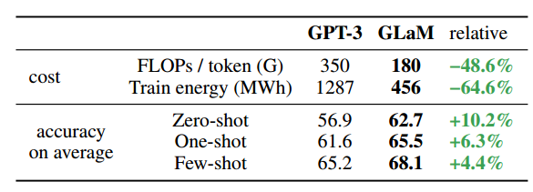
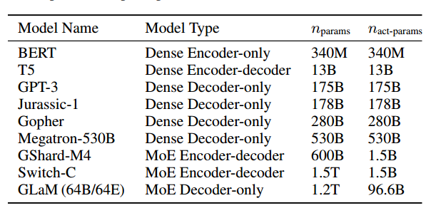
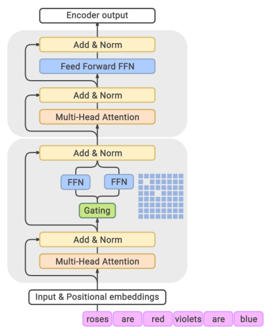
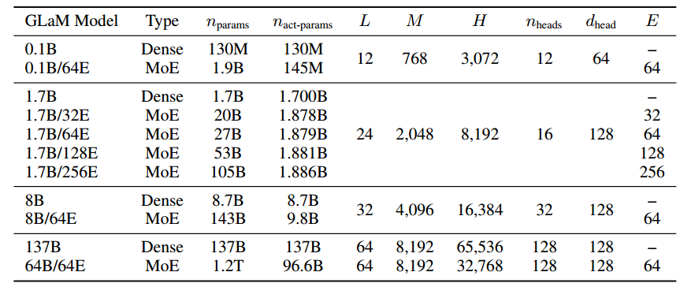

# Abstract

使用更多的数据、计算和参数来扩展语言模型已经推动了自然语言处理的重大进展。训练这些大型密集模型需要大量的计算资源。在本文中，我们提出并开发了一系列名为GLaM(通才语言模型)的语言模型，它使用稀疏激活的混合专家架构来扩展模型容量，同时与密集变体相比，也产生了更少的训练成本。The largest GLaM has 1.2 trillion parameters, which is approximately 7x larger（总的网络很大）than GPT-3. It consumes only 1/3 of the energy
used to train GPT-3 and requires half of the computation flops(激活的网络小) for inference, while still achieving
better overall zero, one and few-shot performance
across 29 NLP tasks.

# Introduction

The shift towards scaling with more data and larger models (Shazeer et al., 2017; Huang et al., 2019; Kaplan et al.,has enabled complex natural language tasks to be performed with less labeled data. 上下文学习用于少量甚至零次泛化，这意味着在NLP应用中只需要很少的标记示例就可以获得良好的性能。在高效和高性能的同时，进一步扩展变得非常昂贵，并且消耗大量的能源

在这项工作中，我们表明，与最先进的密集模型相比，大型稀疏激活网络可以在少数任务上获得具有竞争力的结果，同时计算效率更高。我们提出了一组称为GLaM的通才语言模型，它在密集计算和条件计算之间取得了平衡。最大版本的GLaM共有1.2个参数，每个MoE层有64位专家(Shazeer et al, 2017;Lepikhin等，2021;Fedus et al, 2021)，其中输入批中的每个令牌仅激活96.6B (1.2T的8%)参数的子网。在零次、一次和几次学习上，该模型优于GPT-3 (175B)（激活的子网小于）显著提高了学习效率（很快）。由于稀疏激活的架构和模型并行算法的高效实现，训练过程中的总能耗仅为GPT-3的三分之一。(存储？)

我们使用GLaM来研究数据的重要性。我们的分析表明，即使对于这些大型模型，如果目标是生成高质量的自回归语言模型，也不应该为了数量而牺牲数据质量。在小规模的上下文学习设置中，稀疏解码器语言模型首次比类似计算FLOPs的密集架构性能更好，这表明稀疏性是实现高质量NLP模型同时节省能源成本的最有希望的方向之一(Patterson等人，2021)。因此，MoE应被视为未来扩展的有力候选。（硬件是要有的，可以节省能源）

# Related Work

大量的计算和数据可以通过无监督的预训练来训练越来越大的模型。这很适合训练神经网络，因为它们表现出显著的可扩展性。基于预训练和微调的迁移学习(rafael et al, 2020;houholsby等人，2019)已被广泛研究，并在下游任务上表现良好。然而，这种方法的一个主要限制是它需要特定于任务的微调。

情境下的少镜头学习。GPT-3 (Brown et al, 2020)及相关工作(Shoeybi et al, 2019;Lieber等，2021;Wei等人，2021)证明了扩展语言模型大大提高了任务不可知的、少镜头的性能。这些语言模型的应用没有任何梯度更新，并且只需要通过与模型的文本交互指定的少量演示。

最近，Fedus等人(2021)展示了更大的1万亿参数稀疏激活模型(Switch-C)的结果。虽然Switch-C和最大的GLaM模型都有一万亿个数的可训练参数，但GLaM是一组只有解码器的语言模型，而Switch-C是一个基于编码器和解码器的序列到序列模型。Switch-C is mainly evaluated on fine-tuning benchmarks,
e.g., SuperGlue, while GLaM performs well without any need for fine-tuning in the few-shot setting shared by GPT-3
where SuperGlue is a subset. 

# Model Architecture

门控函数然后使用softmax激活函数来模拟这些专家的概率分布。这意味着对于给定的输入令牌，只使用有限的专家子集，从而在限制计算的同时为模型提供更大的容量。每个MoE层的可学习门控网络被训练成使用其输入来为输入序列的每个令牌激活最好的两个专家。在推理过程中，学习到的门控网络动态地为每个令牌选择两个最好的专家。对于具有E专家的MoE层，这本质上提供了O($E^2$)种不同的前馈网络组合的集合，而不是经典Transformer体系结构中的一个，从而带来了更多的计算灵活性。

我们还对原始的Transformer体系结构进行了额外的修改。我们用Dai等人(2019)的逐层相对位置偏差取代标准位置嵌入。In the non-MoE Transformer feed-forward
sub-layers, we replace the first linear projection and the activation function with the Gated Linear Unit (Dauphin et al.,
2017; Shazeer, 2020), which computes the component-wise
product of two linear transformation of the input, followed
by a Gaussian Error Linear Unit (Hendrycks & Gimpel,

2016) activation function.我们使用Xu等人(2021)所描述的2D分片算法对大型GLaM模型的权重和计算进行划分

# Experiment Setup

GLaM is a family of dense and sparse decoder-only language models,

E为MoE层的专家数量，B为mini-batch大小，S为输入序列长度，M为模型和嵌入维数，H为为前馈网络的隐藏维数，L为层数，N为总设备数。nheads是自注意头的数量，dhead是每个注意头的隐藏维度。We also include the respective dense models
with comparable numbers of activated parameters per-token
during inference (and thus similar numbers of per-token
FLOPs) as references. 

GLaM (8B/64E)表示近似8B参数密集模型的体系结构，每隔一层由64个专家MoE层取代。当每个MoE层只有一个专家时，GLaM减少为基于密集的transformer的语言模型体系结构。

我们对所有GLaM模型使用相同的学习超参数。由于训练语料库中可用令牌的数量远远大于训练期间处理过的令牌数量，因此将弃用率设置为0。在标准交叉熵损失的基础上，我们添加了GShard (Lepikhin等人，2021)中描述的MoE辅助损失，其系数为0:01，以鼓励专家负载平衡，以便门控函数将令牌更均匀地分配给所有专家。在训练期间，我们使用float32作为模型权重，使用bfloat16作为激活。

如果梯度中存在任何nan或inf，我们就跳过批次的权重更新(Shen等人，2019)。注意，在应用梯度步骤期间，NaN/Inf仍然可能发生，在这种情况下，我们从前面的检查点重新启动，如下所述。例如，即使现有变量或梯度中没有Inf，更新后的变量仍然可能导致Inf。在训练过程中遇到罕见的大波动甚至NaN/Inf时，我们从早期健康检查点重新开始。顺序加载批次的随机性可能有助于在重新启动后的训练中摆脱先前的失败状态。

为了清楚地证明GLaM模型的有效性，我们主要侧重于评估Radford等人(2018)提出的零、一和几次学习协议.对于零次学习设置，在大多数情况下，我们直接评估开发集中的每个示例。对于一次/几次学习，我们主要从任务的训练集中随机抽取一个/几个例子作为唯一的演示和上下文。这样的演示与评估示例连接在一起，中间有两个换行符，然后输入到模型中。

# Results

## Comparison between MoE and Dense Models

如表1所示，GLaM (64B/64E)在零次、一次和几次学习方面与GPT-3 (175B)相比具有竞争力。如表4所示，GLaM (64B/64E)在推理期间每个令牌激活大约96.6B个参数，在给定相同输入的情况下，它只需要GPT-3所需计算FLOPs的一半。

我们强调一个特别具有挑战性的开放域问答任务:TriviaQA。在开放域问答任务中，需要模型直接回答给定的查询，而不需要访问任何额外的上下文。Brown等人(2020)表明，TriviaQA的few-shot性能能够随着模型的大小而平稳增长，这表明语言模型能够利用其模型容量吸收知识。GLaM (64B/64E)比密集模型更好，并且优于该数据集上先前的微调状态(SOTA)。尽管GLaM (64B/64E)的nact-params仅为GPT-3的一半，但GLaM的额外容量在性能提升中起着至关重要的作用。与Switch-C相比，尽管两种型号的参数总数相似，但GLaM (64B/64E)使用的专家数量要比Switch-C大得多(超过一个TPU核心)。因此，GLaM在TriviaQA上的一次性性能也优于Switch-C在开放域设置下的微调结果。

## Effect of Data Quality

我们研究了数据质量对下游任务的少射性能的影响。在过滤数据上训练的模型在NLG和NLU任务上都表现得更好。预训练数据的质量也起着关键作用，特别是在下游任务的表现中。

## Scaling Studies

Scaling up dense language models generally involves making the models deeper by adding more layers, and wider by
increasing the embedding dimension of token representations. 每次预测的有效FLOPs随模型大小nparams线性增加。虽然增加的FLOPs可能会提高预测性能，但也会提高每次预测的总成本。

GLaM MoE模型也可以通过增加MoE层专家的规模或数量来扩展。

如图3(a)所示，生成任务的平均0、1和few-shot性能与每个预测的有效FLOPs(依次由nact-params决定)相匹配。对于每个令牌相似的有效FLOPs, GLaM MoE模型的表现始终优于GLaM dense模型。We observe that both MoE and dense models perform
similarly at smaller scales but MoE models outperform at larger scales. 我们观察到，对于每个预测的固定计算预算，增加更多的专家通常会带来更好的预测性能

## Efficiency of GLaM

现有的大型密集语言模型通常需要大量的计算资源进行训练和服务(Patterson et al .， 2021)。它们还需要消耗大量的预训练数据。

GLaM MoE模型比可比FLOPs的密集模型需要更少的数据，以达到相似的零、一和少射性能。换句话说，当使用相同数量的数据进行训练时，MoE模型的性能要好得多，当训练到630B时，性能差异变得更大。在6个学习设置(零次/单次NLU和一次/少次NLG)中的4个设置上，使用280B标记训练的GLaM (64B/64E)模型的表现明显优于使用300B标记训练的GPT-3，并且在其余设置(即零次NLG任务)上的得分与GPT-3相当。

展示了零、一和几次射击的平均性能与训练MoE和密集模型所花费的TPU年的数量之间的关系。要在下游任务中获得类似的表现，训练稀疏激活模型比训练密集模型需要更少的计算资源。600B代币后的GLaM (64B/64E)训练能耗为456 MWh，约为GPT-3 1287 MWh能耗的1/3。此外，为了达到与GPT-3相似(甚至略高于)的分数，我们使用1,024个TPU-v4芯片进行了574小时的训练(使用280B代币)。这消耗了213兆瓦时，相当于GPT-3能源成本的1/6。GLaM的能耗降低是由于TPU-v4硬件和GSPMD软件的MoE架构和计算效率优化。

# Discussion

尽管具有上下文学习和训练效率优势，但稀疏激活的模型由更多的参数组成，因此需要更多的设备。这限制了资源的可访问性并增加了服务成本，特别是在服务流量较低的情况下。

# Conclusions

我们最大的1.2万亿参数MoE语言模型GLaM (64B/64E)，与训练GPT-3相比，能耗仅为三分之一，平均性能更好。

# Scaling the Number of Experts

我们将每个MoE层中的专家数量从1增加到256。尽管专家数量呈指数级增长，但由于GLaM的稀疏性，每个模型中的nact-params几乎没有增加。对于每次预测的固定计算预算，添加更多的专家通常会带来更好的预测性能。这进一步验证了GLaM稀疏激活模型在每次预测具有相似FLOPs时的性能增益，这要归功于更多专家增加的容量和灵活性。

# Model Partitioning

我们使用Xu等人(2021)中描述的2D分片算法对大型GLaM模型的权重和计算进行划分，该算法利用了TPU集群设备网络的2D拓扑结构。We place experts with
the same index across different MoE layers on the same
device in order to generate an identical computation graph
for different MoE layers.因此，我们可以将MoE Transformer架构的重复模块封装在while循环控制流语句中(Abadi等人，2016a;Yu et al .， 2018)来减少编译时间。(?)

我们的实验表明，我们应该扩大专家的规模，以获得高质量的模型。因此，当每个专家变得足够大时，我们必须将每个专家分配到一组N/E设备上。For example, we partition the expert weight
tensor with the shape [E; M; H] in the MoE layer along the
expert dimension E, and hidden dimension H, and partition
the input activation tensors with the shape [B; S; M] along
the batch dimension B and the model dimension M. 使用这种2D分片算法，我们可以将这些大权重和激活张量完全划分为更小的部分，这样所有设备上的数据或计算就没有冗余。(?)我们依靠GSPMD的编译器传递(Xu et al, 2021)来自动确定其余张量的分片属性。

