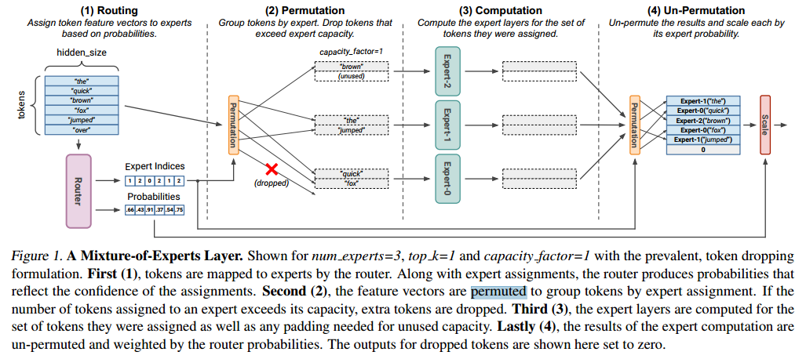
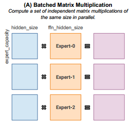
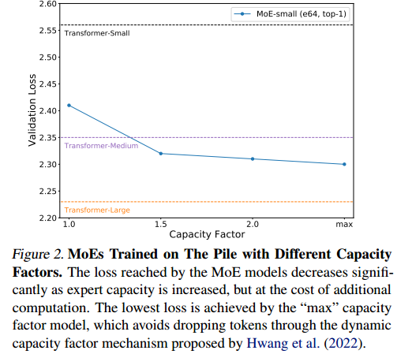
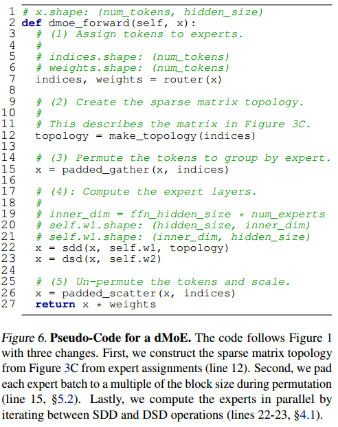
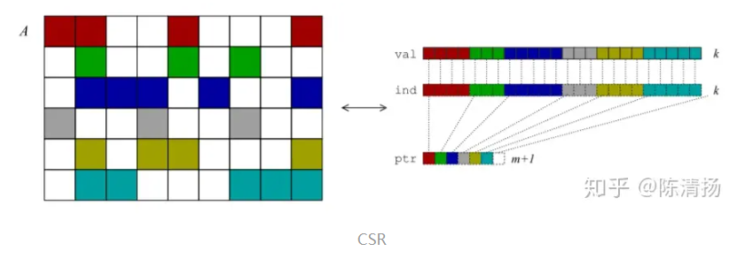
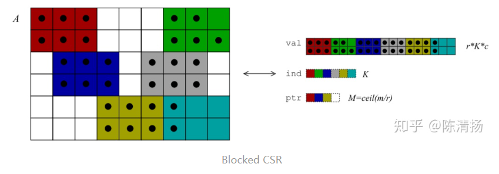

# ABSTRACT

MegaBlocks, a system for efficient Mixture-of-Experts (MoE) training on GPUs.

Our system is motivated by the limitations of current frameworks, which restrict the dynamic routing in MoE layers to satisfy the constraints of existing software and hardware.(现有的系统限制了MoE的动态路由)

这些公式迫使在模型质量和硬件效率之间进行权衡，因为用户必须在从计算中删除令牌或在填充上浪费计算和内存之间做出选择。（在计算中浪费token，要么通过填充浪费计算和内存）

To address these limitations, we reformulate MoE computation in terms of block-sparse operations and develop new block-sparse GPU kernels that efficiently handle the dynamism present in MoEs.

Our
approach never drops tokens and maps efficiently to modern hardware, enabling end-to-end training speedups
of up to 40% over MoEs trained with the state-of-the-art Tutel library and 2.4× over DNNs trained with the
highly-optimized Megatron-LM framework（没有浪费token的同时高效使用硬件资源）

#  INTRODUCTION

The challenge in computing MoEs efficiently is handling
the dynamic routing and load-imbalanced computation that
are fundamental to these architectures. However, existing
hardware and software for deep learning make it difficult
to meet this challenge. For example, TPUs and their XLA
compiler require all tensor shapes to be known statically
and often struggle with fine-grained operations like scatters
and gathers（？） (Fedus et al., 2022). These constraints make it
difficult to implement MoEs directly on TPUs. While GPUs
are more flexible, the sparse computation in MoEs does not
map cleanly to the software primitives supported in major
frameworks and libraries.

In
order to remove the dynamism from the computation, the
set of tokens mapped to each expert are trimmed or padded
to a user-specified size

这个procrustean公式引入了模型质量和硬件效率之间的权衡，因为用户必须决定是放弃令牌还是在填充上浪费计算和内存。这个决定通常是通过超参数调优做出的，这增加了使用moe的复杂性。

为了解决这些挑战，我们开发了一种基于稀疏原语的MoE路由和计算方法。

我们的方法永远不会丢弃令牌并有效地映射到现代gpu，使端到端训练速度分别达到最先进的MoE和DNN训练框架的40%和2.4倍。

我们展示了如何将MoE层中的计算表示为块稀疏操作，以适应向专家分配令牌的不平衡。我们使用这个公式来训练无水滴moes (dMoEs)。

We develop high-performance GPU kernels for blocksparse matrix products that efficiently handle dynamic
MoE computation. Our kernels use two techniques,
blocked-CSR-COO encoding and transpose indices, to
enable efficient matrix products with sparse inputs and
outputs in transposed or non-transposed order.

# BACKGROUND: MOE LAYERS

MoE layers are often interleaved with other DNN layers and
are most commonly used to replace the feed-forward net-work (FFN) layers in Transformers (Shazeer et al., 2017; Fedus et al., 2022). This hybrid architecture has demonstrated
strong results on both natural language and vision tasks (Du
et al., 2021; Riquelme et al., 2021). It is conjectured that
these improvements are a result of experts specializing to
different parts of the data distribution

最先进的MoE实现旨在并行计算所有专家层，以便有效利用gpu和tpu上可用的并行性(Lepikhin等人，2020;Fedus等，2022;Hwang et al, 2022)。 The standard primitive used by implementations is batched matrix multiplication, which computes a set of matrix products of the same shape (see Figure 3A).

然而，将MoE计算映射到这个原语并非易事。为了遵守批处理矩阵乘法的形状约束，必须约束专家具有相同形状的权矩阵，并且分配给每个专家的令牌数量必须相等。后一种约束尤其有问题，因为上面描述的学习路由算法不能保证将令牌分配给专家的负载均衡。

为了满足这一约束，先前的工作定义了一个固定的专家容量，即每个专家可以分配的令牌数量(Lepikhin等人(2020);Fedus et al(2022))。如果分配给专家的令牌数量超过其容量，则会丢弃额外的令牌。也就是说，它们不被传递给任何专家进行计算，模型依靠残余连接在MoE层之后重新引入被丢弃的令牌的表示。如果专家层没有分配足够的令牌来填充其容量，则填充其令牌集以填充剩余空间。专家能力通常用容量因子超参数来指定，这是在完美均匀分布下分配给每个专家的预期令牌数量的乘数

The capacity factor can be thought of as a parameter that
reduces the chance of dropping a token. This hyperparameter represents a tradeoff between additional computation
and model quality. As such, it is desirable to minimize the
amount of load imbalance in the assignment of tokens to experts. The typical mechanism for doing so is auxiliary load balancing losses, which incentivize the router to produce a
balanced assignment (Shazeer et al., 2017; Lepikhin et al.,
2020; Fedus et al., 2022). These losses additionally help to
ensure that all experts see a similar number of tokens during
training. This is thought to be important to avoid degenerate
states where some experts are assigned zero tokens and stop
receiving gradient updates (Zhou et al., 2022).

After the experts are computed, the resulting feature vectors
are un-permuted such that their ordering matches that of the
input to the layer.

# MOTIVATION: TOKEN DROPPING IN MOES
尽管使用了负载平衡损失，但先前的工作表明令牌路由仍然高度不平衡(Hwang et al, 2022)。为了量化token掉落对模型质量的影响，我们使用一系列容量因子在the Pile(数据库)上训练MoE语言模型(Gao et al, 2020)。 We
train Transformer MoEs similar to those used by Fedus et al.
(2022), where each model is a Transformer with the FFN
layers replaced with 64-expert MoE layers where each expert is a 2-layer MLP matching the original FFN dimensions.

我们用容量因子1、1.5和2训练moe，以及Tutel (Hwang et al .， 2022)提出的动态容量因子技术，其中容量因子被动态设置为避免令牌掉落的最小值。

虽然删除令牌会降低模型质量，但增加容量因子是以额外的计算和内存为代价的。在本例中，为了避免丢失令牌，moe层的数学操作增加了2倍以上。Hwang等人(2022)表明，一些moe需要高达11的容量因子来避免掉币，而其他模型在训练期间避免掉币的必要容量因子不可预测地飙升

除了增加容量因子的计算开销外，必须调优额外的超参数可能会显著增加需要为目标任务训练的模型数量。这对于大型神经网络来说尤其麻烦，因为训练单个神经网络的成本很高

可能正因为如此，一些关于moe的大型研究根本拒绝探索不同的容量因子(

# NO-TOKEN-LEFT-BEHIND WITH BLOCK SPARSITY

本节描述我们如何根据块稀疏计算来制定MoE层计算，以避免丢失令牌。使用块稀疏原语来表示MoE计算的动机是多方面的。

First, as we show below, block-sparse matrices are a natural and flexible way of describing the dynamic and load
imbalanced computation in MoEs. Second, block sparsity
maps efficiently to hardware accelerators built around systolic array matrix multipliers like GPUs and TPUs. Because
of the coarse granularity of MoE experts, we can select a
block size for our implementation that is large enough to
enable the computation to realize high fractions of peak
device throughput. Lastly, block-sparse kernels like matrix
multiplication and convolution are general-purpose primitives that are useful across a range of applications (Narang
et al., 2017; Gray et al., 2017; Child et al., 2019; Elsen et al.,
2020). This makes investment in high-performance kernels more practical, as work can be amortized across target
tasks. We could similarly invest in variable sized batched
matrix multiplication kernels, but the utility of this would
be limited to MoE architectures as they are designed today

除了这些考虑之外，MoEs的块稀疏公式为这些算法提供了一个新的视角，作为一种动态的、结构化的、激活稀疏的形式。

In the
remainder of this paper we often refer to matrix multiplication where one of the three matrices (the two inputs and one
output) is sparse and the others are dense. We borrow the
notation from Triton (Tillet et al., 2019) to describe these
different operations. Each operation is described with a
three character string where each character is either “S” for
sparse or “D” for dense. The order of characters is output,
followed by the left input followed by the right input. For
example, the product of two dense matrices with a sparse
output is “SDD”, which is also referred to as sampled dense dense matrix multiplication (SDDMM). This notation is
useful to distinguish operations like DSD and DDS, which
are different forms of sparse matrix-dense matrix multiplication (SpMM). Superscript “T” indicates transposition of
the input arguments. For example, SDDT
indicates an SDD
where the right-hand input matrix is transposed.

The key insight behind our method is shown in Figure 3.
Rather than the prevailing approach of computing the experts within an MoE layer using batched matrix multiplication, we could equivalently compute the experts as an SDD
where the output sparse matrix has block diagonal structure,
as shown in Figure 3B. In this formulation, allowing for a
load-imbalanced assignment of tokens to experts is analogous to allowing for the blocks in the block diagonal matrix
to have a variable number of rows. To achieve this, we
propose to compute each block as many smaller fixed size
blocks using block-sparse matrix multiplication, as shown in
Figure 3C. To construct multi-layer experts, we can iterate
between SDD and DSD operations (see Figure 6).

在此公式中，我们还可以放松对每个块中列数的约束，以构建具有可变大小专家的MoE层，如图3C所示。虽然这是未来工作的一个有趣的方向，但我们没有探索这些配置，因为需要更多的研究来确定如何使用该功能来提高效率。

有了足够大的块，块稀疏矩阵乘法能够在现代gpu上达到高峰吞吐量的高分数(Gray等人，2017;英伟达,2021)。

MoE中的粗粒度稀疏性有助于满足这一要求——在使用MoE FFN层的Transformer模型中，图3B所示块中的列数对应于FFN隐藏大小，通常在1024和8192之间(Vaswani等人，2017;Radford等人，2019;Brown et al, 2020)。

The number of rows in these blocks
corresponds to the number of tokens assigned to each expert,
which is expected to be equal to the number of tokens di-vided by the number of experts under a uniform distribution.
This can range from a few thousand to tens of thousands of
tokens per expert (Lepikhin et al., 2020; Artetxe et al., 2021;
Fedus et al., 2022). These coarse-grained blocks are many
times larger than the largest tile dimensions used for dense
matrix multiplication kernels, which give us the flexibility
to select a block size that can match their throughput.

# MEGABLOCKS: A FRAMEWORK FOR EFFICIENT MOE TRAINING

我们在一个名为MegaBlocks的系统中实现了我们的技术，该系统基于Megatron-LM (Shoeybi等人，2019)和PyTorch (Paszke等人，2019)。除了高性能的无点moe (dMoE)层，我们的系统还支持数据和专家模型并行的moe分布式训练(Fedus et al, 2022)。

This section discusses the design of our dMoE implementation, including our block-sparse kernels, and other considerations for building an efficient system. §5.1.1 discusses
the limitations of existing block-sparse kernels. §5.1.2 analyzes the effects of the block size on block-sparse product
performance. §5.1.3 describes our hybrid blocked-CSRCOO sparse matrix format, which enables efficient matrix
products with sparse input and output operands. §5.1.4
introduces transpose indices as a mechanism for efficient
iteration over block-sparse matrices in transposed order.
Lastly, §5.2 discusses efficient routing and permutation for
dMoEs.

Preliminaries: Matrix Multiplication on GPUs. Matrix
multiplication kernels on GPUs exploit tiling, where the output matrix is broken up into statically sized two-dimensional
blocks of values (NVIDIA, 2022c). The computation of these tiles can be parallelized, and the individual tiles can be
sized to tradeoff arithmetic intensity and parallelism. The
group of threads assigned to a tile is called a threadblock.

X(S)=X(D)*W1(D)

X(D)=X(S)*W2(D)

dX(D)/dX(S)=W2(D)

dX(D)/dW2(D)=X^T(S)

为了用块稀疏核训练MoEs，我们需要用于向前和向后传递的原语。考虑一个MoE FFN层，其中每个专家都是一个2层MLP。对于这种配置，向前传递需要SDD操作，然后是DSD操作(图6)。对于向后传递，我们分别计算第二层数据梯度和权重梯度的SDDT和DSTD，然后分别计算第一层数据梯度和权重梯度的DSDT和DDTS。

We considered two existing libraries for block-sparse matrix
multiplication on GPUs: NVIDIA cuSPARSE (NVIDIA,
2022b) and Triton Blocksparse (Tillet et al., 2019). cuSPARSE supports the blocked-ELL sparse matrix format for
DSD. However, as of CUDA 11.8 this operation does not
support transposition of the sparse matrix input. cuSPARSE
also provides no SDD primitive with a blocked-ELL matrix.
In addition to these limitations, the blocked-ELL format
requires that all rows in the sparse matrix have the same
number of nonzeros, which would defeat our goal of supporting load imbalanced matrices. Blocksparse supports
SDD, DSD, and DDS as well as all combinations of transposed and non-transposed inputs. However, these primitives
assume that the topology of the sparse matrices does not
change between invocations(This is likely because they were written for applications like
sparse attention where the sparse matrix topology is determined
prior to training)
. The library API takes a bitmask describing the sparse operand and then pre-computes
look-up tables and block groupings to accelerate computation. For our use case, the sparse matrix topology varies
across every iteration of training and every MoE layer in the
model. In order to use Blocksparse, we would have to pay
the cost of these preprocessing steps repeatedly.

基于此分析，我们选择编写自己的blocksparse原语，以便根据MoE专家计算的动态对其进行调整。我们针对NVIDIA gpu实现了SDD、DSD和DDS操作。我们的核支持所有转置和非转置输入的组合。本节的其余部分将详细介绍内核的设计和实现。

In order to efficiently use modern GPUs, we want to use
sparse blocks that have sufficient arithmetic intensity to keep matrix multiplication units busy. Large blocks are also
desirable to amortize the cost of storing and operating on
sparse matrix metadata, since metadata like column indices
only need to be kept for each block of nonzeros.(block越大，索引越少)

To select our target block size, we studied the performance
of dense matrix multiplication kernels from NVIDIA CUTLASS (NVIDIA, 2022c) with different tile dimensions. We
benchmarked mixed-precision (FP16 + FP32 accumulation)
matrix multiplication on square matrices with power of two
side lengths from 512 to 16384 and every set of tile dimensions supported in CUTLASS. For rectangular tiles,
we show only the configurations where the first tile dimension is larger as we found these to slightly outperform the
alternative ordering for these problems. We ran all benchmarks on an A100 SXM4 80GB GPU with CUDA 11.5 and
CUTLASS 2.5. These benchmarks are shown in Figure 4.

在这些基准测试中，我们观察到128x128块的性能始终与其他配置相当或更好。有趣的是，我们观察到NVIDIA cuBLAS (NVIDIA, 2022a)通常为我们研究的密集变压器模型选择相同的配置。基于这个分析，我们选择使用128x128块稀疏性。虽然块稀疏矩阵乘法的平铺维度和稀疏矩阵中的块大小不需要相等，但我们发现，对于128x128块，在我们的工作负载中表现最好的平铺维度也是128x128。

为了实现我们的内核，我们扩展了CUTLASS (NVIDIA, 2022c)以支持块稀疏矩阵，并重用其机制用于不同数据类型和GPU架构的高性能矩阵乘法

We use blocked compressed sparse row (BCSR) as our primary sparse matrix format. BCSR makes it simple to iterate
across the nonzeros in a row, which is necessary for operations like DSD and DDST
. Iterating over blocks also
has minimal overhead with BCSR, as identifying a block’s
position in the matrix only requires a single load of its column index. We discuss our approach for efficiently iterating
across the nonzeros in a column with this format in §5.1.4.

（从一个元素变成一个2*3的矩阵）

我们使用阻塞压缩稀疏行(BCSR)作为我们的主要稀疏矩阵格式。

我们使用阻塞压缩稀疏行(BCSR)作为我们的主要稀疏矩阵格式。BCSR使得遍历一行中的非零元素变得简单，这对于DSD和DDST等操作是必要的。使用BCSR迭代块的开销也很小，因为识别块在矩阵中的位置只需要加载它的列索引一次。

# .

batched matrix multiplication

block sparse matrix multiplication

