# Abstract

我们提出了MoEBERT，它使用混合专家结构来提高模型容量和推理速度。预训练模型的表示能力在很大程度上被保留了下来。在推理过程中，只有一个专家被激活，这样可以提高速度。我们还提出了一种分层蒸馏方法来训练MoEBERT。

# Introduction

通过知识蒸馏进行模型压缩(Romero et al .， 2015;Hinton等人，2015)是一种很有前途的方法，可以减少预训练语言模型的计算开销，同时保持其优越的性能。在知识蒸馏中，一个大的预训练语言模型充当教师，一个小的学生模型被训练来模仿教师的行为。

现有知识蒸馏方法的一个主要缺点是由于表示能力降低而导致模型性能下降。也就是说，因为学生模型的参数比教师模型少，所以它的模型容量更小。We resort to the Mixture-of-Experts (MoE,
Shazeer et al. 2017) structure to remedy the representation power issue.MoE models can increase
model capacity while keeping the inference computational cost constant.无论专家总数如何，MoE模型的计算成本都保持不变。这种特性有利于压缩，而不会降低模型容量

MoE模型很难从头开始训练，通常需要大量参数，例如，Switchbase需要74亿个参数(Fedus et al, 2021)。我们提出了MoEBERT，它将MoE结构合并到预训练的语言模型中进行微调。我们的模型可以在保持预训练语言模型的表示能力的同时加快推理速度。BERT-base中FFN的隐藏维度为3072 (Devlin et al, 2019)，我们将其调整为4个专家，每个专家的隐藏维度为768。通过这种方式，有效参数(即计算输入表示所涉及的参数)的数量减少了一半，并且我们获得了×2加速。我们注意到MoEBERT比现有方法使用了更多的预训练模型参数，因此它具有更大的表示能力。

To adapt the FFNs into experts, we propose an
importance-based method. Empirically, there are
some neurons in the FFNs that contribute more to
the model performance than the other ones. That
is, removing the important neurons causes significant performance drop. When initializing MoEBERT, we share the most
important neurons (i.e., the ones with the highest
scores) among the experts, and the other neurons
are distributed evenly（？）该策略有两个优点:首先，共享神经元保持了预训练模型的性能;其次，非共享神经元促进了专家之间的多样性，从而进一步提高了模型的性能。初始化后，MoEBERT使用分层任务特定的蒸馏算法进行训练。

# Background

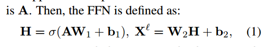

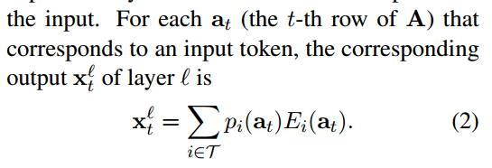

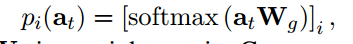

 DistilBERT (Sanh et al., 2019) uses the teacher’s soft prediction probability to train the student model;TinyBERT (Jiao et al, 2020)将学生的层输出(包括注意力输出和隐藏状态)与教师的层输出对齐

关于蒸馏的层数也有激烈的讨论。例如，Wang等人

(2020、2021)提取最后一层的注意力输出;Sun et al(2019)选择特定的层进行蒸馏;

知识蒸馏有两种变体:任务不可知论(Sanh等人，2019;Jiao等，2020;Wang等，2020,2021;Sun等人，2020a)和特定任务(Turc等人，2019;Sun et al .， 2019;Li et al .， 2020;侯等人，2020;Sun等，2020b;Xu et al .， 2020)。前者需要使用知识蒸馏对小模型进行预训练，然后对下游任务进行微调，而后者则直接对小模型进行微调。在这项工作中，我们专注于特定任务的蒸馏。

# Method

在本节中，我们首先介绍一种将预训练的语言模型改编为MoE模型的算法。这种结构通过减少计算输入令牌表示所涉及的参数数量来加快推理速度。然后，我们引入了一种分层任务特定的蒸馏方法，以补偿模型压缩引起的性能下降。

## Importance-Guided Adaptation of Pre-trained Language Models
, by adapting
the FFNs in a pre-trained BERT-base,(with hidden dimension 3072) model into
4 experts (each has hidden dimension 768), the number of effective parameters reduces by half,
such that we obtain a ×2 speedup(是选两个计算？)我们发现将FFN随机转换为专家效果很差(见实验中的图3a)。这是因为在W1∈R d×dh中有一些列(对应于在Eq. 1中W2中的一些行)比其他列对模型性能的贡献更大。重要性评分(Molchanov et al .， 2019;Xiao et al .， 2019;Liang et al .， 2021)最初在模型修剪文献中引入，测量了这些参数的重要性。

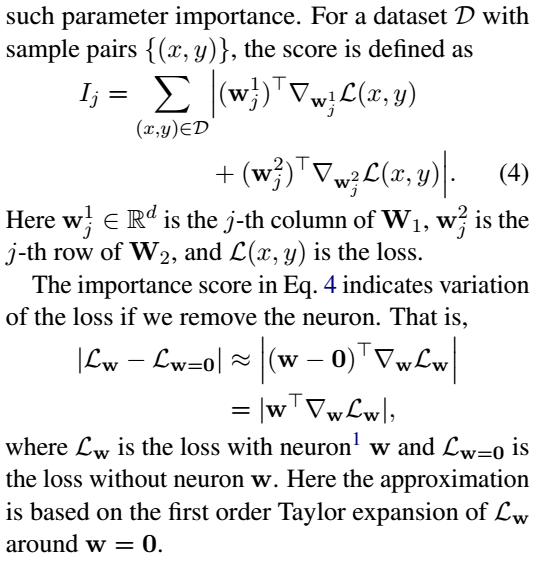

After computing Ij for all the columns, we adapt
W1 into experts.The other parameters in the FFN: W2, b1 and b2 are
treated similarly according to {Ij} The columns are sorted in ascending order according to their importance scores
as w1(1) · · · w1(dh), where w1(1) has the largest Ij
and w1(dh) the smallest.Empirically, we find that
sharing the most important columns benefits model
performance. Based on this finding, suppose we
share the top-s columns and we adapt the FFN
into N experts, then expert e contains columns
{w1(1), · · · , w1(s), w1(s+e), w1(s+e+N), · · · }. Note that we discard the least important columns to keep
the size of each expert as ⌊d/N⌋. 

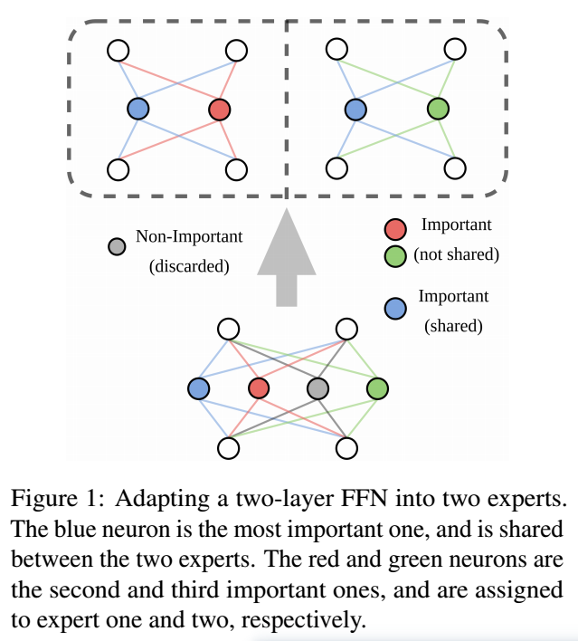

##  Layer-wise Distillation

为了弥补由于将预训练模型调整到MoE模型而导致的性能下降，我们采用了分层任务特定的蒸馏算法。We
distill both the Transformer layer output Xℓ
(Eq. 2)
and the final prediction probability

For the Transformer layers, the distillation loss
is the mean squared error between the teacher’s
layer output Xℓtea and the student’s layer output Xℓ
obtained from Eq. 2.注意，我们包含了嵌入层输出X0和X0 tea的MSE损失。

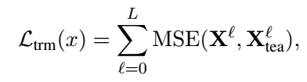

Then
the distillation loss for the prediction layer is

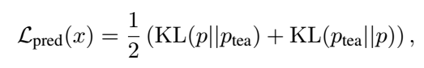

分层蒸馏损失为式5和式6的和

我们采用随机哈希策略(Roller et al, 2021)来训练专家。也就是说，每个令牌被预先分配给一个随机的专家，这个分配在训练和推理期间保持不变。

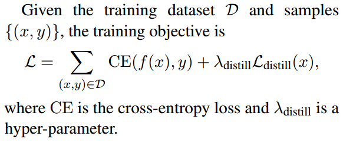

#  Experiments

我们使用Huggingface Transformers4 (Wolf et al, 2019)代码库实现我们的算法。

我们将我们的方法与任务不可知论和任务特定的蒸馏方法进行比较。

在任务不可知的蒸馏中，我们通过知识蒸馏预训练一个小的语言模型，然后对下游任务进行微调。微调过程还包括特定任务的蒸馏，以获得更好的性能。

在特定任务的蒸馏中，预先训练的语言模型被直接压缩和微调。

在实验中，我们使用BERT-base (Devlin et al .， 2019)作为学生模型和教师模型。也就是说，我们首先将预训练模型转换为MoE模型，然后应用分层特定任务的知识蒸馏。The number of effective parameters of the MoE model is 66M (v.s. 110M for BERT-base), which is the same as the baseline models.我们使用随机哈希策略(Roller et al, 2021)来训练MoE模型

表1总结了GLUE基准测试的实验结果。注意，我们的方法在6/7个任务中优于所有基线方法。

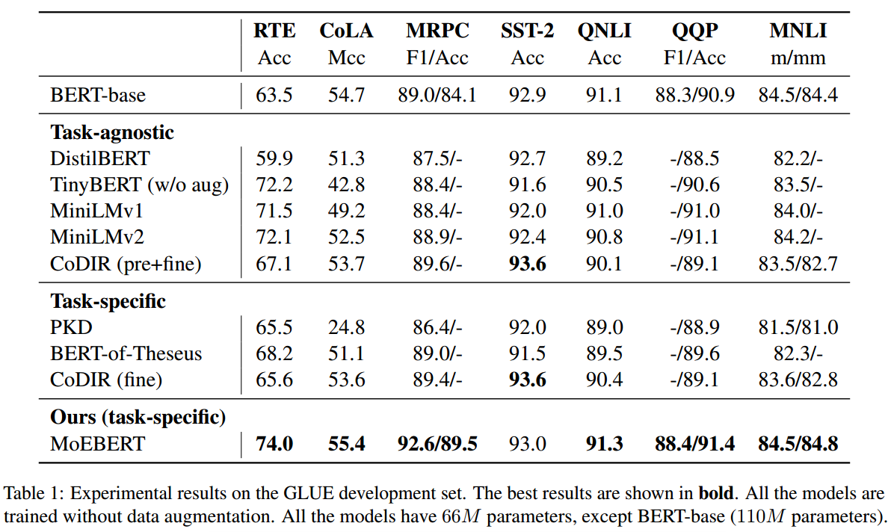

一般来说，由于预训练阶段的存在，任务不可知蒸馏比任务特定算法表现得更好。例如，性能最好的任务特定方法(BERT-of-Theseus)在RTE数据集上的准确率为68.2，而MiniLMv2和TinyBERT的准确率大于72。使用该方法，MoEBERT在没有任何预训练的情况下，在RTE上获得了74.0的准确率，表明了MoE架构的有效性。We remark that MoEBERT behaves on par or better than the vanilla BERT-base model in all of the tasks.这表明预训练语言模型中存在冗余，为模型压缩铺平了道路。

表2总结了SQuAD v1.1和SQuAD v2.0两个问答数据集的实验结果。注意，MoEBERT在两个评估指标(精确匹配(EM)和F1)方面明显优于所有基线方法。与表1中的发现类似，任务无关的蒸馏方法通常比特定于任务的蒸馏方法表现得更好。

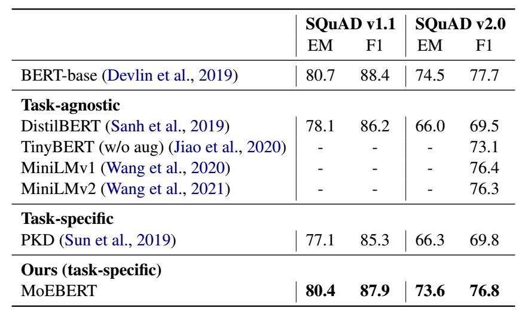

随着专家维度的增加，模型的性能也随之提高。这是因为由于有效参数数量的增加而增加了模型容量。随着专家数量的增加，模型性能得到提高，因为我们有效地扩大了模型容量。

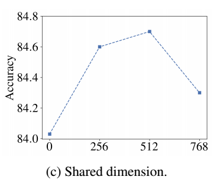

在图2c中，我们研究了改变共享神经元数量的影响。注意，不共享神经元会产生最差的性能，这表明了共享策略的有效性。还注意到，共享所有神经元的性能也不令人满意。我们把这归因于专家之间缺乏多样性。

We show experimental results on RTE, MNLI and
SQuAD v2.0, where we remove the distillation and
directly fine-tune the adapted model.结果表明，去除蒸馏模块后，模型性能显著下降

Recall that we adapt the FFNs in BERT-base
into experts according to the neurons’ importance
scores (Eq. 4). We examine the method’s effectiveness by experimenting on two different strategies:
randomly split the FFNs into experts (denoted Random), and adapt (and share) the FFNs according to the inverse importance, i.e., we share the neurons with the smallest scores (denoted Inverse).与Import(我们使用的方法)相比，当我们应用随机分割时，性能会显著下降。而且，Inverse的性能甚至比随机分割还要差，这进一步证明了重要性度量的有效性。

MoEBERT使用分层蒸馏方法(Eq. 7)进行训练，其中我们向每个中间层(表示为All)添加蒸馏损失。我们研究了两种变体: (1) we only distill the hidden states of the
last layer (denoted Last); (2) we distill the hidden
states of every other layer (denoted Skip).只蒸馏最后一层的效果并不理想;而Skip法与All(我们使用的方法)得到的结果相似。

默认情况下，我们使用随机哈希策略(表示为Hash-r)将输入令牌路由给专家(Roller et al, 2021)。也就是说，词汇表中的每个标记都被预先分配给一个随机的专家，这个分配在训练和推理期间保持不变。我们研究了其他路由策略

We employ sentence-based routing with a
trainable gate as in Eq. 3 (denoted Gate). Note
that in this case, token representations in a sentence are averaged to compute the sentence
representation, which is then fed to the gating
mechanism for routing.这种句子级路由策略可以显著降低MoE模型中的通信开销。因此，与其他路由方法相比，它有利于推理。

We use a balanced hash list (Roller et al.,
2021), i.e., tokens are pre-assigned to experts according to frequency(和词义无关？）, such that each expert
receives approximately the same amount of
inputs (denoted Hash-b).

从图3c中，我们可以看到所有的方法都产生了相似的性能。因此，MoEBERT对路由策略具有鲁棒性。

我们在SST-2数据集上检验了BERT、DistilBERT和MoEBERT的推理速度，结果如图4所示。注意，对于MoEBERT，我们使用如图3c所示的基于句子的门设机制。所有的方法都在同一个CPU上进行评估（？）We see that the speed of MoEBERT is
slightly slower than DistilBERT, but significantly
faster than BERT. 这样的速度差异有两个原因。首先，MoEBERT中的门控机制会导致额外的推理延迟。其次，DistilBERT开发了一个较浅的模型，即它只有6层，而不是12层;而MoEBERT是一个更窄的模型，即隐藏维度是768而不是3072。

特定任务的蒸馏方法不需要预先训练。因此，这些方法可以很容易地应用于bert基础之外的其他模型体系结构和规模。我们压缩BERT-large模型。具体来说，我们将BERT-large(隐藏维数为4096)的ffn改编为4个专家，使每个专家的隐藏维数为1024。我们在专家之间分享前512个神经元。压缩后，有效参数的数量减少了一半。MoEBERT在所有实验中的表现都与BERT-large相当或更好

# Conclusion

它使用混合专家结构来提取预训练的语言模型。在现有的方法中，压缩模型的表示能力是有限的，导致性能不令人满意。（那是微调的效果吧？）

找预训练模型重要的列和行组成expert，共享重要参数

蒸馏损失=transformer输出差距+最终预测差距

总损失=蒸馏损失+标签损失

# 。

预训练语言模型在各种自然语言处理任务中表现出优越的性能。然而，这些模型通常包含数亿个参数，这限制了它们的实用性，因为在实际应用程序中需要延迟。

现有方法通过知识蒸馏训练小型压缩模型。

然而，与预训练模型相比，这些小模型的性能明显下降，因为它们的模型容量减少了。

MoEBERT，它使用混合专家结构来提高模型容量和推理速度。在推理过程中，只有一个专家被激活，这样可以提高速度。（保持大、小模型优势）

通过将预训练模型中的前馈神经网络适应为多个专家来初始化MoEBERT。因此，预训练模型的表示能力在很大程度上被保留了下来。

提出了一种分层蒸馏方法来训练MoEBERT。

通过知识蒸馏进行模型压缩(Romero et al .， 2015;Hinton等人，2015)是一种很有前途的方法，可以减少预训练语言模型的计算开销，同时保持其优越的性能。在知识蒸馏中，一个大的预训练语言模型充当教师，一个小的学生模型被训练来模仿教师的行为。任务不可知蒸馏法对学生进行预先训练，然后对其进行下游任务微调;而任务特定的蒸馏则是在从预训练的模型初始化学生后直接对其进行微调。

 the student model in DistilBERT (Sanh et al., 2019) has 66 million parameters, about half the size of the teacher (BERT-base,
Devlin et al. 2019). performance
of DistilBERT drops significantly compared with
BERT-base, e.g., over 2% on MNLI (82.2 v.s. 84.5)
and over 3% on CoLA (54.7 v.s. 51.3).

MoE模型的一层(Shazeer等人，2017;Lepikhin等，2021;Fedus等，2021;Yang等，2021;Zuo et al .， 2021)由一个注意机制和多个前馈神经网络(ffn)并行组成。

MoE模型很难从头开始训练，通常需要大量参数，例如，Switchbase需要74亿个参数(Fedus et al, 2021)。我们提出了MoEBERT，它将MoE结构合并到预训练的语言模型中进行微调。我们的模型可以在保持预训练语言模型的表示能力的同时加快推理速度。（为什么要初始化）我们注意到MoEBERT比现有方法使用了更多的预训练模型参数，因此它具有更大的表示能力。为了使ffn成为专家，我们提出了一种基于重要性的方法。从经验上看，ffn中有一些神经元对模型性能的贡献大于其他神经元。在初始化MoEBERT时，我们在专家之间共享最重要的神经元(即得分最高的神经元)，其他神经元均匀分布。该策略有两个优点:首先，共享神经元保持了预训练模型的性能;其次，非共享神经元促进了专家之间的多样性，从而进一步提高了模型的性能。

We demonstrate efficiency and effectiveness of MoEBERT on natural language understanding and question answering tasks.

 The model contains several identicallyconstructed Transformer layers. Each layer has
a multi-head self-attention mechanism and a twolayer feed-forward neural network (FFN).

h就是隐藏层神经元的数量

Each of these layers contain a self-attention
mechanism and multiple FFNs (Eq. 1) in parallel,
where each FFN is called an expert.

因此，T被构造为产生top-K最大pi的专家。

前者需要使用知识蒸馏对小模型进行预训练，然后对下游任务进行微调，而后者则直接对小模型进行微调。

我们首先介绍一种将预训练的语言模型改编为MoE模型的算法。这种结构通过减少计算输入令牌表示所涉及的参数数量来加快推理速度。然后，我们引入了一种分层任务特定的蒸馏方法，以补偿模型压缩引起的性能下降。

这是因为在W1∈R d×dh中有一些列(对应于在Eq. 1中W2中的一些行)比其他列对模型性能的贡献更大。

The importance score (Molchanov et al., 2019;
Xiao et al., 2019; Liang et al., 2021), originally
introduced in model pruning literature, measures
such parameter importance.

The importance score in Eq. 4 indicates variation
of the loss if we remove the neuron.

（每个向量按重要性排序）

The columns are sorted in ascending order according to their importance scores
as $w^1_{(1)}$ · · · $w^1_{(dh)}$, where $w^1_{(1)}$ has the largest $I_j$ and $w^1_{(dh)}$ the smallest.

我们发现，共享最重要的列有利于模型的性能。

suppose we
share the top-s columns and we adapt the FFN
into N experts, then expert e contains columns
{$w^1_{(1)}$, · · · , $w^1_{(s)}$, $w^1_{(s+e)}$, $w^1_{(s+e+N)}$, · · · }.

(共享前s个向量)

（应该是w1对应w1，w2对应w2)

我们使用BERT-base (Devlin等人，2019)作为学生(即MoE模型)和教师。我们提取Transformer层的输出X r (Eq. 2)和最终的预测概率。

我们采用随机哈希策略(Roller et al, 2021)来训练专家。也就是说，每个令牌被预先分配给一个随机的专家，这个分配在训练和推理期间保持不变。

General Language Understanding
Evaluation (GLUE) benchmark

We evaluate the proposed
algorithm on two question answering datasets

我们将我们的方法与任务不可知论和任务特定的蒸馏方法进行比较。

在任务不可知的蒸馏中，我们通过知识蒸馏预训练一个小的语言模型，然后对下游任务进行微调。微调过程还包括特定任务的蒸馏，以获得更好的性能。

在特定任务的蒸馏中，预先训练的语言模型被直接压缩和微调

我们使用BERT-base (Devlin et al .， 2019)作为学生模型和教师模型。也就是说，我们首先将预训练模型转换为MoE模型，然后应用分层特定任务的知识蒸馏。我们将MoE模型中的专家数量设置为4，每个专家的隐藏维数设置为768，是BERTbase隐藏维数的1 / 4。其他配置保持不变。

 The number of effective parameters of the MoE model is 66M (v.s. 110M
for BERT-base), which is the same as the baseline models.

我们使用随机哈希策略(Roller et al, 2021)来训练MoE模型

由于预训练阶段的存在，任务不可知蒸馏比任务特定算法表现得更好。在所有任务中，MoEBERT的表现与香草bert基础模型相当或更好。这表明预训练语言模型中存在冗余，为模型压缩铺平了道路。

我们研究了改变共享神经元数量的影响。注意，不共享神经元会产生最差的性能，这表明了共享策略的有效性。

还注意到，共享所有神经元的性能也不令人满意。我们把这归因于专家之间缺乏多样性。

我们删除了蒸馏并直接微调了适应的模型。结果表明，去除蒸馏模块后，模型性能显著下降

我们根据神经元的重要性得分将BERT-base中的ffn调整为专家(Eq. 4)。我们通过实验两种不同的策略来检验该方法的有效性

我们看到MoEBERT的速度比蒸馏酒慢一点，但比蒸馏酒快得多。这样的速度差异有两个原因。首先，MoEBERT中的门控机制会导致额外的推理延迟。其次，蒸馏酒开发了一个较浅的模型，即它只有6层，而不是12层;而MoEBERT是一个更窄的模型，即隐藏维度是768而不是3072。