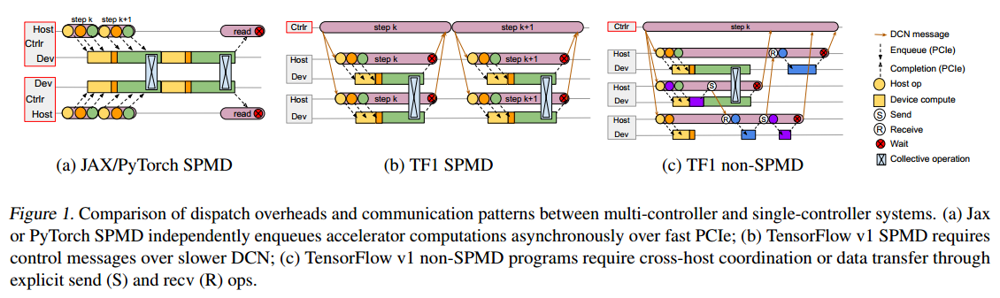
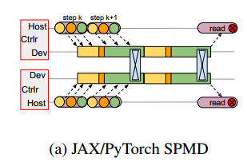
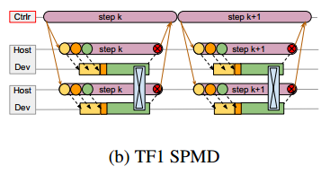
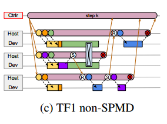

# ABSTRACT

我们提出了一种新的大规模加速器编排层的设计。我们的系统PATHWAYS旨在探索新系统和机器学习研究思路，同时保留当前模型的最先进性能。PATHWAYS使用异步操作符的分片数据流图来消费和产生未来，并有效地在数千个加速器上进行异构并行计算，同时在它们的专用互连上协调数据传输。PATHWAYS使用了一种新的异步分布式数据流设计，该设计允许控制平面并行执行，而不考虑数据平面中的依赖关系。这种设计经过精心设计，允许PATHWAYS采用单控制器模型，从而更容易表达复杂的新并行模式。我们证明，当在2048个tpu上运行SPMD计算时，PATHWAYS可以与最先进的系统实现性能对等(~ 100%加速器利用率)，同时还提供与Transformer模型的SPMD案例相当的吞吐量，这些模型跨16级流水线，或跨数据中心网络连接的两个加速器岛分片。(????????????????????)

#  INTRODUCTION

机器学习(ML)最近的快速发展的特点是ML模型、加速器硬件和将两者联系在一起的软件系统的共同发展。这种共同进化带来了一种危险，即系统对当前工作负载过于专门化，而无法预测未来的需求。在本文中，我们描述了PATHWAYS，一个为分布式机器学习构建的新系统

. PATHWAYS is
designed to target specific capabilities that we believe will
be needed by future ML workloads (Dean, 2021) – and are
therefore needed today to support research into those workloads – but which are poorly supported by state-of-the-art
systems

当今大多数最先进的机器学习工作负载使用“单程序多数据”(SPMD)模型，该模型受MPI (Clarke et al .， 1994)的启发，其中所有加速器以同步方式运行相同的计算，加速器之间的通信由AllReduce等集体描述。(数据并行？）最近，研究人员已经开始遇到极限。

Very large language models have been scaled up using pipelining rather than pure
data-parallelism (Narayanan et al., 2019; Rasley et al., 2020;
Narayanan et al., 2021), and models such as Mixture of Experts (MoE) (Shazeer et al., 2017) have started to explore
computational sparsity that is most naturally expressed using fine-grain control flow and heterogeneous computation
across accelerators. System designers have adopted ingenious techniques to execute pipelined (Narayanan et al.,
2021; Rasley et al., 2020; Narayanan et al., 2019; Huang
et al., 2019) and homogeneous MoE (Lepikhin et al., 2020;
Fedus et al., 2021) models on MPI-style systems, but as we
argue in detail later, the MPI programming model is too
restrictive both for users and for the underlying system.

On the other hand, with each new generation of accelerators,
ML clusters are becoming increasingly heterogeneous (Jeon
et al., 2019; Chaudhary et al., 2020; Weng et al., 2022). Providing exclusive access to large “islands” of homogeneous
accelerators connected over high-bandwidth interconnects
is expensive,（独占访问加速器群） and often wasteful as a single user program
must try to keep all of the accelerators continuously busy.（多任务？）
Such constraints are further driving researchers towards
“multiple program multiple data” (MPMD) computations
that allow more flexibility by mapping sub-parts of the overall computation to a collection of more readily available
smaller islands of accelerators. To increase utilization, some
ML hardware resource management researchers (Xiao et al.,
2020; Bai et al., 2020; Yu and Chowdhury, 2020; Wang et al.,
2021; Lim et al., 2021; Zhao et al., 2022; Weng et al., 2022)multiplex hardware in a fine-grained manner between workloads, enabling workload elasticity, and improving fault
tolerance.

Finally, researchers are beginning to standardize on a set
of foundation models (Bommasani and et. al., 2021; Dean,
2021) that are trained on large data at scale and are adaptable to multiple downstream tasks. Training and inference
for such models offers opportunities for improving cluster utilization by multiplexing resources across many tasks,
and efficiently sharing state between them. For example,
several researchers might concurrently fine-tune (Houlsby
et al., 2019; Zhang et al., 2021) a foundation model for
different tasks, using the same accelerators to hold the fixed
foundation model layers. Training or inference over shared
sub-models can benefit from techniques that allow examples
from different tasks to be combined in a single vectorized
batch to get better accelerator utilization (Crankshaw et al.,
2017).

本文描述了我们的系统PATHWAYS，它与最先进的机器学习系统的功能和性能相匹配，同时提供支持未来机器学习工作负载所需的功能。PATHWAYS使用客户机-服务器体系结构，使PATHWAYS的运行时能够代表许多客户机在系统管理的计算孤岛上执行程序。PATHWAYS是第一个旨在透明、高效地执行跨多个tpu“pod”的程序的系统(Google, 2021)，并且通过采用新的数据流执行模型，它可以扩展到数千个加速器。PATHWAYS的编程模型可以很容易地表达非spmd计算，并支持集中的资源管理和虚拟化，以提高加速器的利用率。

在本文的其余部分，我们首先讨论了当前分布式机器学习系统的局限性，并激发了我们对PATHWAYS的设计选择(§2)，然后描述了PATHWAYS支持的灵活编程模型(§3)。我们描述了PATHWAYS的架构(§4)，强调了我们如何使用分片数据流模型和异步组调度来解决旧的客户端-服务器ML系统的关键限制。我们使用真实的机器学习模型提出了微基准测试和端到端评估，证明我们已经达到了匹配现实工作负载的最先进的多控制器性能的目标(§5)，并验证了PATHWAYS的机制非常适合支持研究和部署新颖高效的机器学习方法所需的功能

#  DESIGN MOTIVATION

The design choices of distributed ML systems are often
driven by the properties of the underlying target hardware
accelerators. 在这里，我们关注现有分布式机器学习系统的一些设计和实现选择如何使它们难以支持大型，稀疏或不规则的模型。

Distributed ML systems for training state-of-the-art SPMD
models often adopt a multi-controller(CPU?) architecture where the
same client executable is run directly on all the hosts in the
system, taking exclusive ownership of the resources on those
hosts for the duration of the program execution. Examples
of this architecture include MPI (Clarke et al., 1994), PyTorch (Paszke et al., 2019), JAX (Bradbury et al., 2018), and
more recent configurations of TensorFlow (Shazeer et al.,
2018; Agrawal et al., 2019).

The key advantage of this
architecture is the low latency for dispatching accelerator
computations (see Figure 1a) since an identical copy of the
user’s code runs on each of the accelerator hosts and dispatch involves communication only over (relatively) fast
PCIe links.

All other communication across hosts only happens through collectives that use dedicated interconnects
like NVLink (Foley and Danskin, 2017) and ICI (Jouppi
et al., 2020) without going via host memory

然而，这种架构与使用流水线或计算稀疏性的现代ML工作负载不太匹配。(张量并行？)在多控制器系统中，任何超出标准集合的通信都要求用户实现自己的协调原语。

多控制器方法通常还假定硬件资源的独占所有权。这不仅将确保昂贵的加速器的高利用率的责任转移到用户身上，而且还使资源虚拟化和多路复用（多任务共享资源？）等功能的设计变得复杂，而这些功能是构建高效的集群范围的机器学习基础设施所必需的

Single-controller(这个控制器到底指什么) systems such as TensorFlow v1 (Abadi
et al., 2016) offer a very general distributed dataflow model,
including optimized in-graph control flow (Yu et al., 2018).
A TensorFlow (TF) Python client builds a computation
graph and hands it off to a coordinator runtime, which
partitions the graph into a subgraph for each worker and
delegates the execution of the subgraphs to local runtimes
on workers.工作人员之间的协调是使用数据边和控制边在数据中心网络(DCN)上传递消息来执行的。虽然单控制器设计提供了灵活的编程模型和资源虚拟化，但它提出了实现方面的挑战。(多了一个中间层DCN)

Firstly, while multi-controller systems only require communication over PCIe to dispatch accelerator computations
(Figure 1a), clients in single-controller systems are “farther
away” and the dispatch latency involves communication
over DCN, typically an order of magnitude slower than PCIe
(Figure 1b). 

Secondly, to support concurrent execution of
MPMD programs(为什么要支持MPMD) with SPMD sub-computations, each spanning a subset of accelerators drawn from a shared cluster,
the runtime must have some mechanism to support gangscheduling of accelerator computations. Gang-scheduling（Gang scheduling策略可在并发系统中将多个相关联的进程调度到不同处理器上同时运行。最主要的原则是保证所有相关联的进程能够同时启动，防止部分进程的异常，避免整个关联进程组的阻塞。） is
essential in the case of TPUs, since they are single-threaded
and only run non-preemptible kernels, so the system will
deadlock if communicating computations are not enqueued
in a consistent order. Even for GPUs or other accelerators
that can execute concurrent computations, gang scheduling
allows more efficient execution of collectives (Feitelson and
Rudolph, 1992). 因此，机器学习的单控制器系统需要一种分布式调度机制，以便为不同的程序安排排队的计算。Finally, a system for modern ML workloads must be designed
to run computations distributed over thousands of accelerators, with first class support for sharded representations and
data structures. For instance, a naive dataflow graph representing an edge between an M-way sharded computation
and an N-way sharded computation would require M + N
nodes and M × N edges, rapidly becoming unwieldy.

The implementation choices made by TF v1 were overspecialized to assume a single, smallish, exclusively-owned
island of accelerators. This over-specialization makes it
practically infeasible to use TF for contemporary or future
ML workloads. While TF can run computations that require
cross-host coordination or data transfer through send and
recv ops (Figure 1c), host side work at the destination like
dispatching the accelerator computation is triggered only
after the transfer is completed. 

In programs involving many
cross-host transfers, for example pipelined models with a
large number of stages, these dispatch latencies accumulate,
leading to inefficient accelerator utilization. While TF v1
users can (inefficiently) enforce a consistent ordering for
gang-scheduling within a single program, by using control
edges, the lack of a centralized scheduler in single-controller
systems like TF v1 makes it impossible to ensure consistent ordering between computations across programs. TF
also materializes the full sharded computation graph, which
introduces substantial overhead in both graph serialization
and execution when the number of shards reaches into the
thousands, leading to millions of graph edges between subcomputations

PATHWAYS结合了单控制器框架的灵活性和多控制器的性能。我们采用单控制器模型，因为我们相信它通过利用计算稀疏性和异质性，以及通过启用促进共享和虚拟化资源的集群管理系统，为新颖和高效的ML计算提供了比多控制器更好的机会。我们的设计与旧的单控制器ML系统的不同之处在于，它使用异步调度来匹配多控制器系统的性能，支持集中的资源管理和调度，支持一流的SPMD加速器计算，并使用分片数据流系统进行有效的协调。

# PATHWAYS PROGRAMMING MODEL

We have implemented support to target PATHWAYS from
source programs written in TensorFlow and JAX, but we
concentrate on JAX for the evaluation in this paper.JAX
users can explicitly wrap standard Python code with decorators to indicate fragments that should be compiled into
(potentially SPMD) XLA computations.These XLA computations are usually characterized by known input and output
types and shapes, bounded loops, and with few (if any) conditionals (see Appendix B for more details) making it feasible to estimate the resource requirements of computations
in advance.We refer to these computations with known
resource requirements as “compiled functions”. Each such
function maps to a single (sharded) computation node in a
PATHWAYS program

# ACCELERATOR DESIGN CONSIDERATIONS
## Batching

Given the end of Dennard-scaling, accelerators implement
hardware parallelism, often using SIMT (Kirk, 2007) or
systolic array (Jouppi et al., 2020) designs. 

While these
hardware architectures remove the arithmetic bottleneck,
memory bandwidth quickly becomes the critical resource,
necessitating high-bandwidth memory (HBM), （从下层传输带宽）an expensive
and limited-capacity memory technology.（容量）

 Training schemes
for modern neural networks leverage batching to unlock
parallelism (good for feeding parallel ALUs) and enable
memory re-use (a float is read from memory once and
used for multiple computations, substantially reducing a
computation’s memory bandwidth needs).（不同存储之间的数据移动）

Nevertheless,
batching is not a panacea: it puts pressure on the limited
HBM memory capacity, and very large batch sizes can slow
model convergence rates (Shallue et al., 2018; You et al.,
2017; Lanchantin et al., 2020; Anil et al., 2021). 

While
modern GPUs support unified memory—a capability to
transparently page memory between accelerators, or from
HBM to the host’s DRAM（类似虚拟内存）—if the user is not careful, an
HBM-bandwidth bound computation could slow to PCIe
bandwidth（从cpu到gpu）, dropping accelerator utilization by an order of
magnitude (Lim et al., 2021).

## Asynchronous programming

Accelerator abstractions rely on an asynchronous programming model to achieve performance; a synchronous abstraction wastes too many accelerator computation resources
between PCIe latency, kernel scheduling overheads, and
interrupt delays. Computations are enqueued on streams to
be executed on the accelerator at some point in the future.
This asynchronous abstraction effectively masks dispatch
latency for small operations, so long as a sufficiently large
pipeline of work is maintained（任务队列）

## High performance interconnects

现代深度神经网络的容量比加速器(HBM)存储器的容量大几个数量级(Lepikhin等，2020;Huang et al, 2019)。这些神经网络中的并行性可以同时跨多个加速器进行分片，但是加速器之间的高速互连对性能至关重要。GPUs use interconnects such as NVLink for high-speed communication between “islands” of accelerators on a small number of hosts (Naumov et al., 2020),（一个gpu是一个岛,单机）
and use RDMA capabilities of ethernet and Infiniband NICs
(GPUDirect) to rapidly communicate between the islands.（多机）

TPUs have a custom mesh network built directly into the
chips, and chips can communicate directly without involving the host or the data-center network.

Dedicated GPU and
TPU interconnects are typically exposed to applications via
30 year old MPI primitives (e.g., AllReduce) that must be
gang-scheduled so that every program enters the same primitive at the same time.

As larger computations are run (e.g.,
training a larger neural network, or training a fixed-size neural network over more accelerators through a form of weak
scaling called data-parallel scaling), faster collective operations and thus network bandwidth are required to maintain
efficient utilization of aggregate cluster resources.

This has
prompted significant experimentation with alternate chipnetwork topologies including hypercubes, and 2-D and 3-D
mesh tori (Naumov et al., 2020).

##  Single-tenancy

与计算机中的大多数资源不同，加速器通常不会被多个程序同时共享。（分时独占）深度学习模型可以通过增加参数数量或批处理大小来轻松扩展以使用更多内存，因此在实践中程序会消耗大部分可用的加速器(HBM)内存。PCIe带宽远小于HBM或加速器互连带宽。这意味着细粒度的上下文切换(HBM中的大部分数据通过PCIe转出到主机DRAM)会浪费大量的加速器周期。Thus,
when a host program is not fully utilizing an accelerator,
the computational resources are stranded and cannot be
used productively. Further, preemption of accelerator resources is minimized in practice, resulting in sub-optimal
resource scheduling in large, shared clusters serving heterogeneous workloads; it is difficult to allocate large quantities
of physically proximate devices to take advantage of network locality.

## Contrasting GPUs and TPUs

虽然gpu和tpu之间有许多相似之处，但也有一些重要的区别。GPU系统倾向于拥有由nvlink连接的设备组成的小岛屿(例如，在一台主机上有8个GPU)，通过infiniband或数据中心网络技术连接更大的聚合。

 GPUs
are typically programmed by dispatching many small precompiled “kernels” to the accelerator, and because they are
pre-compiled, the kernels must support dynamic shapes.Any communication between GPUs, whether over NVLink
or via DCN（? data-center networking technology.）, is performed via the NCCL library and initiated
by the host.（CPU?)

TPU systems have thousands of devices connected all-toall, with hundreds of hosts per “island”(??) (Figure 3 Middle).
TPUs contain a capable “scalar core” that coordinates the
TPU’s vector computation units, allowing a TPU to execute
long-running functions written in XLA (TensorFlow, 2019)
without any host interaction, and these functions may include collective communication across the dedicated ICI network. 

. Consequently, on TPU, an ML framework typically
constructs a large XLA program, which is just-in-time (JIT)
compiled and dispatched to the accelerator. (??A JIT compiler runs after the program has started and compiles the code (usually bytecode or some kind of VM instructions) on the fly (or just-in-time, as it's called) into a form that's usually faster, typically the host CPU's native instruction set.)

The fact that a
single XLA computation may run for orders of magnitude
longer than a GPU kernel(XLA program生存时间比GPU kernel长) justifies increased optimization
effort by the compiler such as static buffer assignment and
automatic rematerialization of intermediate program values
(saving memory capacity). （优化XLA编译器有价值）

 As a consequence of this static
buffer assignment, TPUs have only limited support for dynamic shapes, making them a good fit to the PATHWAYS
concept of regular compiled functions.

TPUs are restricted to run a single program at a time, with no
local pre-emption, mostly because their high-performance
RDMA communication implementation between devices
makes safe pre-emption difficult without distributed coordination.（不能抢占，GPU的任务粒度小，TPU大）

Because computations are not pre-emptible, it
is essential to enqueue communicating computations in a
consistent order across devices, or the system will deadlock.

This requirement translates to the necessity for PATHWAYS
to perform centralized gang-scheduling.As noted in the
main text of the paper, however, gang-scheduling is also
highly advantageous for GPU efficiency. 

 For an cluster
prioritizing ML training workloads, where throughput is
more important than latency, it is more efficient to dedicate
an entire GPU, or a static fraction of a GPU, to a single
carefully sized computation at a time,（专注于一个计算） than to allow the
GPU driver and hardware runtime to dynamically multiplex
its computational resources across competing concurrent
computations.（多个任务）

Therefore, even though GPUs can execute
concurrent programs without centralized scheduling, there
is still a benefit from using a design like PATHWAYS to make
more efficient use of resources.

# STRUCTURE OF A TYPICAL ML PROGRAM
This subsection describes a typical contemporary ML computation in terms of the high level structure that maps subcomputations to accelerators, and the lowering of a subcomputation to accelerator kernels.

The computations that are executed by an accelerator running an ML workload are dominated by what we call “compiled functions”. These are sub-computations with the following characteristics:

• Input and output types, and the shapes of any input/output tensors, are known before the input data have
been computed

• Bounds of any loops are either known when the node
computation is scheduled, or specified as a maximum
trip count with potential early termination.

• Conditionals are “functional” where both branches have
the same output type, and resources are allocated in
advance sufficient for either branch

编译函数的约束主要是由于ML模型与硬件的共同进化，在§A中详细讨论。在这里，我们讨论预先知道编译函数的资源需求这一事实的一些含义。

Almost all of today’s high performance ML computations
are expressed as long stretches of compiled functions and
only occasionally (if ever) branch based on data that is
computed by a compiled function. Since the system can perform resource allocation for compiled functions in advance,
contemporary ML frameworks exploit this property by enqueueing compiled functions asynchronously before their
predecessors have run, allowing host-side work to be done
in parallel with accelerator computations (Bradbury et al.,
2018; Paszke et al., 2019).

Wherever possible the frameworks submit graphs of compiled functions to a “just in
time” (JIT) compiler (Chen et al., 2018; TensorFlow, 2019)
that is able to exploit optimizations like layout assignment
and fusion that can substantially improve the efficiency of
the resulting accelerator code.

The need to optimize graphs of compiled functions to
achieve peak accelerator performance means that frameworks typically trace the execution of fragments of high
level (Python) code that can be lowered to compiled functions.

Thus, even though client code may be written in a
high level language with complex state bound to the running
context at a host, performance-sensitive node computations
are often lowered to an internal representation (IR) that is
serializable and relatively easy to send to a remote host for
execution