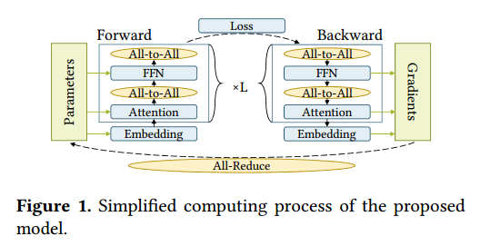

# Abstract

为了达到更高的精度，预训练的人工智能模型的规模每年都在急剧增长，训练这样的模型需要大量的计算和内存能力，这加速了人工智能和高性能计算的融合。然而，在HPC系统上部署AI应用仍然存在差距，这需要基于特定硬件特性的应用和系统协同设计。

为此，本文提出了BaGuaLu1，这是第一个针对在整个百亿亿次超级计算机新一代神威超级计算机上训练大脑尺度模型的工作。通过结合特定于硬件的节点内优化和混合并行策略，BaGuaLu在前所未有的大型模型上实现了良好的性能和可扩展性。

评估结果表明，“八瓜鲁”可以使用混合精度训练14.5万亿个参数模型，性能超过1 EFLOPS，并具有训练174万亿个参数模型的能力，可与人脑的突触数量相媲美

# Introduction

MoE已经在NLP预训练和下游应用中取得了广泛的成功，特别是在机器翻译中[3,11,28,29]。尽管大规模预训练模型在一系列重要应用中显示出了最先进的准确性，但训练大规模预训练模型仍然是一项非常棘手的任务，需要大量的计算、内存和网络能力。GShard[11]和Switch Transformer[3]解决了复杂性、通信成本和训练不稳定性等问题，将模型规模缩放到超过一万亿参数，精度更高。模型的规模仍有可能进一步扩大，甚至超过100万亿个参数，这将与人类大脑的突触数量相媲美。随着模型越来越大，训练任务需要巨大的计算能力、内存容量和高效的全局通信。另一方面，高性能计算机为科学应用展示了令人难以置信的计算能力。例如，神威家族的最新机器[4]，新一代神威超级计算机，可以达到超过1 EFLOPS的峰值性能，配备约9 PB记忆，也为极其大规模的模型训练提供了机会。

然而，在如此大规模的HPC系统上部署训练任务远非易事。除了为传统HPC应用程序设计的特定硬件和网络拓扑外，还应该解决以下问题。

HPC系统通常有专门设计的架构来满足HPC应用需求。应用程序和系统必须协同设计，以满足体系结构的特定功能，以便充分利用计算资源来实现高性能。

巨大的内存容量。训练大型模型需要巨大的内存容量来存储训练过程中的模型参数和中间结果。但是，不同的分区策略导致不同的通信模式。

如何在worker之间划分参数、优化器状态和梯度会显著影响内存使用，因此在扩展模型大小时至关重要。

并行策略。为了将训练任务扩展到完整的HPC系统，必须重新设计并行策略，因为当前的策略在扩展到如此大的系统时效率低下。例如，MoE为指导专家输入带来了巨大的All-toAll通信需求，而数据并行引入了巨大的All-Reduce通信，用于平均梯度参数更新。考虑到双威有多达96000个节点，超级节点内和超级节点间的网络带宽不同，培训期间的通信必须精心设计和优化。此外，当将模型扩展到整个超级计算机时，负载不平衡也会变得严重。

与传统的HPC应用程序主要使用双精度计算不同，大多数深度学习应用程序使用单精度或混合精度来最大化计算吞吐量。由于神威支持FP64、FP32、FP16和BF16等不同类型的浮点计算，因此如何在前所未有的大模型上高效、有效地组合不同类型的浮点数进行混合精度训练对于研究和工业都至关重要。

针对新一代神威超级计算机的高效硬件特定节点内优化，包括核心调度，内存分段和内存访问。

•一种并行策略，MoDa，它结合了MoE并行和数据并行，将模型扩展到整个超级计算机。

•一个分布式优化器，ParO，有效地减少计算时间和内存使用。

一个新的负载平衡策略，SWIPE，为MoE减少计算资源的浪费。

•分层混合精度策略，可以优化训练过程而不影响收敛性。

# Background and Related Work

训练大规模DNN模型需要巨大的计算能力和内存容量，这与HPC系统的优势相融合。近年来，人们提出了各种方法来在HPC系统上部署训练任务，如表2所示。

#  System Architecture

