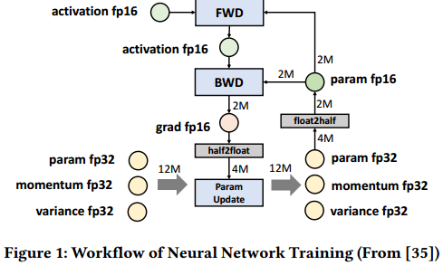
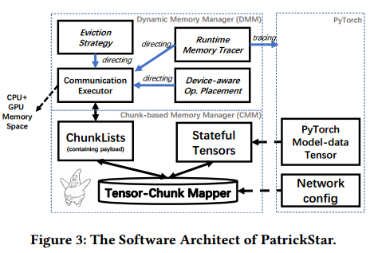
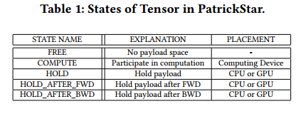
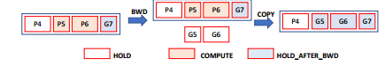
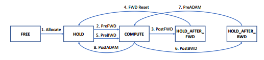
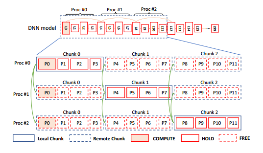
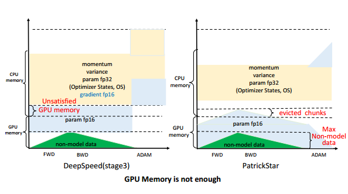
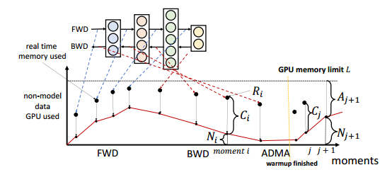
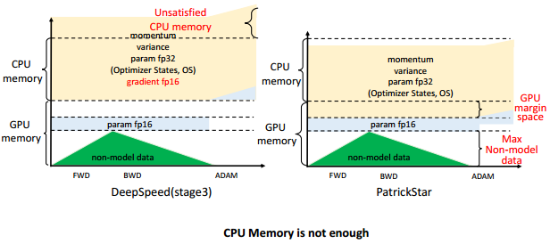

# .

块通信，动态内存分配，重用块

大模型

预训练：大数据、supercomputers using hundreds of GPU nodes connected with high-speed network fabric、少数人

微调：小数据、a single node equipped with multiple GPU cards

异构(CPU+GPU)训练是降低微调阶段硬件要求的最有希望的解决方案。

Zero-infinity、ZeRO-Offload的硬件要求高：DGX-2 supercomputer，每个节点提供足够的内存资源，即8x32GB GPU内存，1.5TB CPU内存，3.84TB NVMe ssd。内存配置远远超过数据中心和云计算平台的平均标准。当在通常可访问的硬件上采用这些系统时，性能在很大程度上受到损害。

ZeRO-Offload在4xV100 GPU的DGX-2H服务器上的最大模型规模达到了30B (Billion)个参数，每个GPU的吞吐量达到了30tflops。但在4xV100 GPU和240gb DRAM CPU服务器上，其最大模型规模只能达到6B个参数。

计算效率也不是最优的。对于4xV100 DGX-2H服务器上的10B型号，ZeRO-Offload仅使用最大计算能力的25%。

模型数据由参数、梯度和优化器状态组成，它们的存储由模型结构定义关联;非模型数据由算子生成的中间张量组成。非模型数据根据训练任务的配置(如批处理大小)动态变化。

模型数据和非模型数据相互竞争GPU内存。现有的解决方案[35]在不考虑迭代内部非模型数据量变化的情况下，将模型数据静态地划分在CPU和GPU内存之间，其内存布局对各种训练配置是不变的。这种静态分区策略会导致几个问题。首先，当GPU或CPU内存不足以满足其相应的模型数据需求时，即使当时其他设备上还有可用的内存，系统也会崩溃。（看短板）

 Second, communication is inefficient when data transferring among different memory spaces in the granularity of the tensor, and CPU-GPU
communication volume can be reduced when placing model data
on the target computing device in advance.（以张量作为数据移动的单位会导致通信效率不足）

将模型数据张量组织成块，这些块是具有相同元素大小的连续内存块。在训练过程中，根据块的张量状态动态编排块在异构存储空间中的分布，更加及时。通过重用不共存的块，PatrickStar还比SOTA(最先进的)解决方案进一步降低了模型数据的内存占用。

基于块的通信模式可以提高CPU-GPU和gpu间的带宽利用率。动态内存管理可以提高内存效率（重用），减少CPU-GPU通信开销（提前）。

PatrickStar训练GPT-like模型是DeepSpeed最大模型规模的2.27倍和2.5倍，在相同模型规模下训练速度更快

PatrickStar具有比DeepSpeed更高的计算和内存效率，并在8倍gpu上实现超线性可扩展性。

画出两列对比

Param fp16，Grads fp16，Optimizer states (OS) momentum fp32 and variance fp32 and param fp32，Activations，Temporary data

我们将激活和临时数据称为非模型数据，而将其他数据称为模型数据。

它们在异构内存空间中静态地管理模型数据，使参数fp16数据存储在GPU中，而梯度fp16和操作系统数据存储在CPU中。参数fp16和分级fp16数据，总共4𝑀字节，在每次迭代期间在CPU和GPU之间移动。

值得注意的是，ZeRO-Offload的实验环境有1.5TB的CPU内存，承担了大部分模型数据的存储。然而，当减少CPU内存的数量时，最大模型规模下降了很多，例如，将其部署为240 GB CPU内存，最大模型规模降低到4B。随着模型规模的增大，其计算效率也随之降低，这为进一步改进指明了方向。例如，在1B模型上可以实现47 tflop，而在4B模型上只能实现33 tflop。

使用上述静态分区策略，与模型相关的配置会受到与任务相关的配置的强烈影响。另一个问题来自带宽利用率。ZeRO-Offload和L2L[31]以张量的粒度在不同的内存空间之间传输数据。当移动小消息大小的张量时，可能会浪费带宽[19]。因此，带宽利用率不足会导致传输效率降低和执行时间延长。

基于上述现象，我们提出了一种新的异构训练系统设计方案，其重点在于1)提高通信带宽利用率，2)优化内存利用率。

We propose an efficient chunk-tensor
mapping method with three features: 1) increase the locality of tensor access. 2) reduce peak memory usage. 3) be parallel-friendly

 param fp16 list, param fp32 list, momentum list, and
variance list

块包含相同的元素，因此相同类型的不同块可以重用相同的内存空间。

COMPUTE状态表示张量即将由特定计算设备上的运算符计算

HOLD_like状态表明张量现在不参与计算，但它的有效载荷必须在内存中维护，CPU或GPU都可以

块在异构空间中的位置由其所有张量的状态决定。当一个块的所有张量都处于FREE状态时，该块的内存空间可以被其他块重用或释放。如果块的任何张量处于COMPUTE状态，则该块必须位于所需的计算设备上。如果它的张量都不在COMPUTE中，并且至少有一个张量处于类似hold的状态，则块可能位于异构内存空间的任何位置。

参数fp16张量在初始化(随机初始化或从预训练模型加载)后状态被设置为HOLD。

algo1

在操作符FWD计算开始之前，PatrickStar使用算法1从块中访问张量。在第24行中，包含要计算的参数fp16的块必须驻留在计算设备上。如果没有，块管理器将把该块从其他设备移动到计算设备，如果计算设备的内存已满，则可能会在计算设备上驱逐一个块。最后将张量的状态转换为COMPUTE(第30行)

After the computing
is finished, we release tensor using Algorithm 2 by setting training_stage as FWD and target_state as HOLD_AFTER_FWD.张量状态变为HOLD_AFTER_FWD，因此张量可以在必要时被驱逐到其他设备。

张量-块-存储

当模型的所有算子完成FWD后，所有参数fp16张量的状态被重置为HOLD，以确保BWD的正确执行。

对于BWD, BWD算子的输入是激活和参数fp16张量，输出是激活和梯度fp16张量。

how to reuse param fp16
chunk for grad fp16 tensors

在BWD计算之前，操作员访问参数fp16张量并将其状态更改为COMPUTE。在BWD计算过程中，生成的梯度fp16张量被分配到临时存储空间中

后向后，由于不再需要参数fp16，我们将grad fp16数据从临时内存空间复制到对应的参数fp16张量的内存空间，并将张量状态更改为HOLD_AFTER_BWD。（一个算子一个算子的换吗，还是全部算完换，全部算完没有意义，不能减少存储峰值）考虑到参数可以由多个操作符共享，我们使用引用计数器来指示张量最后一次被访问。（最后一次访问结束后就换）

在ADAM计算之前，OS张量(参数fp32、动量和方差)被设置为COMPUTE。在计算过程中，为了节省内存，fp16块被实时转换为fp32块。（怎么转，放哪里）计算后，更新的参数fp32张量和使用的OS张量被设置为HOLD。当参数fp32块中的所有张量都处于HOLD状态时，参数fp32块被复制到相应的参数fp16块中。（逐块复制）

PatrickStar uses ZeRO-DP [33] to scale training to multi-GPU via
multiple-processing.

 ZeRO-DP
reduces memory requirements by 𝑛𝑝𝑟𝑜𝑐 times compared to DP by
keeping the 1/𝑛𝑝𝑟𝑜𝑐 of the total chunks in its local memory space.

A communication group consists of 𝑛𝑝𝑟𝑜𝑐 continuous chunks of a chunk
list, where each chunk belongs to a different process.(为什么是连续的，为什么每人只传一个)（类似zero-infinity，每个数据单元都平分了，一个数据单元就是组，由n块组成，每人一块）

Before computing,
a process may fetch the remote chunks from the other processes; After computation of the communication group, the process releases
remote chunks. 

the processes only need to communicate the param
fp16 and grad fp16 chunks during the FWD and BWD stages.

Chunk0 consists of param fp16 tensors of layer 0-3 and belongs
to Proc#0.

 Before FWD computing of layer 0, all processes
have found remote chunks are not resident in local memory space.

 After
collecting remote chunks, all processes will have their copy of
chunk 0 to chunk 2, and all tensor states in the remote chunks
are set to HOLD.(虽然缺0，但all gather后有了0-2)

When the states of all tensors in a communication group are all HOLD_AFTER_FWD/BWD after FWD/BWD
operator computing finished, the tensors in the remote chunks are
set to FREE, and the remote chunks are released. During FWD,
we set training_stage as FWD and is_allreduce as False. During
BWD, we set training_stage as BWD and is_allreduce as True. A
reduce-scatter operation distributes the reduced gradients among
processes.

When scaling to multi-node, like over 16 GPUs, maintaining a chunk list as the
buffer for collective communication consumes excessive memory.
To reduce memory consumption, we sperate a collective operation into 𝑛𝑝𝑟𝑜𝑐 serial broadcast and reduction operations so that
only one chunk is kept as the communication buffer（传3个块，一次传一个，只用一个buffer)

It
rearranges model data layout around heterogeneous spaces before
operator execution. 

(grad16是生成后立即传到cpu吗，gpu没有显示)（显存占用增加了，没有checkpoint和offload吗激活由多到少）（cpu还存储p16?先生成再传输？)（ADAM的参数传到gpu是为什么，只传参数没有os?）

When the
param fp16 and non-model data exceed the GPU memory capacity, data not recently used can be dynamically evicted to the CPU.

异构训练[31,35]通常会引入额外的CPU-GPU数据移动开销。DMM由三个创新组成，可以进一步尽可能地减少开销。

DMM通过运行时内存跟踪器获得非模型数据内存的统计信息。

动态框架PyTorch没有提供在执行之前捕获每个激活张量的生命周期的接口。生命周期彼此不重叠的激活张量可能重用相同的内存空间[18,30]。

Linear这样的计算密集型运算符必须在GPU上执行。内存密集型运算符，如ADAM中的元素运算符，可以在CPU和GPU上同时执行。注意，内存密集型操作符只占总时间的一小部分。它们的智能布局可以通过减少CPU-GPU通信量来提高端到端的性能，即使它稍微增加了它们自己部分的运行时间。

GPU
margin space is the remaining space after removing peak nonmodel data and param fp16 from the overall GPU memory. The
peak non-model data volume is tracked by the memory tracer. We
place as many OS tensors in the margin space as possible. This way,
CPU-GPU communication volume of ADAM is reduced without
introducing extra model-data eviction in FWD+BWD.（不需要传输全部梯度到cpu，也不需要传输全部参数到gpu）

 At the time an operator starts, which is called as moment 𝑖 here

DMM can also accurately know the volume of model-data memory 𝐶𝑖 in use

Assuming the volume of model data not in GPU but required(Ci是共用的？)
by the current operator is 𝑂𝑗
, then if 𝐶𝑗+𝑂𝑗
is larger than 𝐴𝑗+1,
𝐴𝑗+1-𝐶𝑗-𝑂𝑗 of data has to be evicted to CPU.（被减数写反了？）

优先驱逐的块仅由类似hold的张量组成。

 In the warm-up iteration, the tracer records a list of moments related to each chunk.（记录每个块每个时刻的使用情况）A greedy algorithm evicts the longest future reference chunk on
this computing device

 It is implemented in 𝑂(𝑙𝑜𝑔𝑇𝐶) by traversing the moment list of all chunks and binary searching the next
moment to be used, where 𝐶 is the chunk count, and 𝑇 is the moment count.（每个时刻的块按下次使用时刻排序，二叉搜索，T个时刻？？） Our proposed strategy can be viewed as Belady’s OPT
algorithm [3, 23], which replaces the buffer page with the longest
future reference distance.

(adam左边蓝色是梯度？，右边为什么没有完全传到cpu?怎么更新os，到底蓝色是什么？)

, the margin space on GPU can accommodate unsatisfied OS
chunks to make the system work smoothly and efficiently

