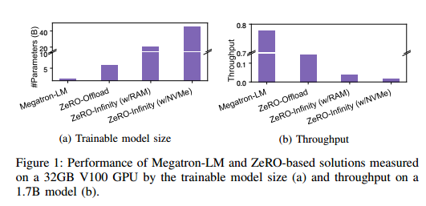
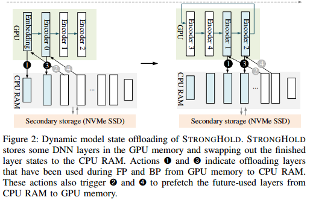
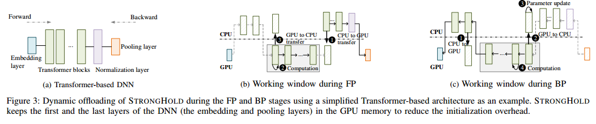
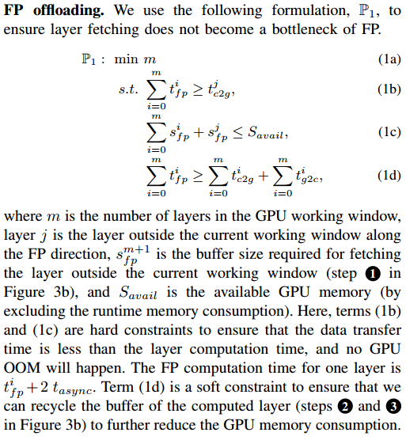
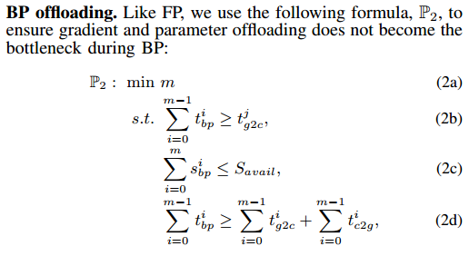
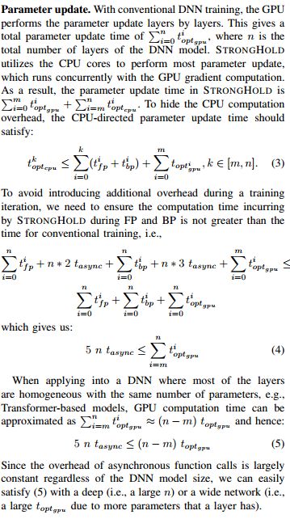
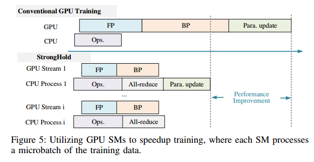
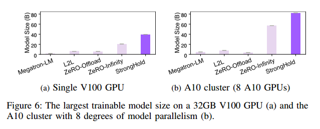

# Abstract

We present STRONGHOLD, a novel approach for
enabling large DNN model training with no change to the user
code.

STRONGHOLD通过动态地将数据卸载到CPU RAM并启用二级存储来扩展最大的可训练模型大小。它自动确定要在GPU内存中保留的最小数据量，以最大限度地减少GPU内存使用。与最先进的基于卸载的解决方案相比，在32GB V100 GPU上，STRONGHOLD将可训练模型大小提高了1.9倍~ 6.5倍，训练吞吐量提高了1.2倍~ 3.7倍。它已经被部署到生产中，成功地支持大规模深度神经网络训练。

#  INTRODUCTION

我们看到深度神经网络(DNN)的规模呈指数级增长。同时，每一代GPU的内存容量增加不到3倍。

已经做出了努力来减少用于大型DNN训练的GPU内存压力和计算资源需求。

这是通过用精度换取更低的存储空间[12]或利用CPU内存[13]、[14]、[15]、[16]来实现的。

前者对模型状态（例如，模型参数、梯度和优化器状态）使用低精度或混合精度表示来减少GPU内存消耗，但它会减慢模型收敛速度。后一种方法通过实现软件管理的高速缓存或使用专用存储器分配方案来减少GPU存储器需求。然而，大多数使用CPU内存的技术都是为卷积神经网络（CNNs）设计的，其中训练期间的内存消耗主要由动态生成的激活而不是优化器（例如，SGD）状态决定。不幸的是，这些技术不适合最新的基于注意力的语言模型（例如，基于Transformer的DNN），这些模型已成为构建最先进的DNN[17]、[2]、[3]的事实方法，其中模型和优化器（例如Adam）状态而不是激活内存是内存瓶颈

由于ZeRO卸载需要将整个模型参数存储在GPU中，因此可训练的模型大小受到可用GPU和CPU内存容量的最小部分的限制。L2L专门为基于Transformer的模型设计，通过动态卸载模型参数，只在GPU内存中保留一个Transformer块。ZeRO Infinity[19]采用动态策略来利用辅助存储（例如NVMe），并在异构内存层次结构中划分模型参数和优化器状态。虽然这些方法可以增加可训练模型的大小，正如我们稍后将在论文中展示的那样，但它们会带来巨大的开销，导致高达1.76倍的slo

STRONGHOLD的关键见解是在GPU中保留足够数量的层及其模型参数，以避免在数据卸载期间GPU停滞。

这样做可以增加可训练的模型大小，因为在任何时候只有一小部分模型状态呈现在GPU存储器上。通过保持GPU计算与重叠数据传输，该策略还可以最小化甚至隐藏CPU-GPU通信开销。为此，STRONGHOLD在GPU和CPU之间实现了一个软件管道，以在两个内存空间之间动态卸载所需的模型状态，而无需用户代码重构。与ZeRO卸载不同，STRONGHOLD不会将所有模型参数存储在GPU中。相反，它实现了一个动态工作窗口，只在GPU中存储几个模型层。然后，它在CPU和GPU之间动态移动所需的层及其参数和生成的梯度。

STRONGHOLD运行时会自动确定合适的工作窗口大小，以确保异步CPU-GPU数据传输可以与GPU计算重叠，从而隐藏数据传输延迟。

STRONGHOLD的一个关键挑战是决定GPU中保留了多少层。具有不必要的大工作窗口将浪费宝贵的GPU内存，而性能增益很小，而使用不足的工作窗口则使CPU-GPU数据传输与GPU计算难以重叠，以最大限度地减少开销。 We
address this challenge by modeling the GPU computation with
data transfer and using an analytical model to derive the right
working window size based on profiling information collected
from a few initial iterations during the warm-up phase.

STRONGHOLD在多核CPU上运行多个并发优化器，以并行化模型参数更新过程。由于参数更新、数据传输和GPU计算是异步过程，因此它们并行运行以利用硬件并行性。为了减少GPU内存管理开销，STRONGHOLD为工作窗口采用了用户级GPU内存管理方案，以避免频繁调用昂贵的GPU内存操作。我们表明，通过减少GPU内存占用，STRONGHOLD还为在单个GPU内实现数据并行开辟了新的机会。 This is achieved by
running multiple training workers across concurrently running
streaming multiprocessors (SM)（多核） of a GPU while keeping
one copy of model parallelism.（？） This optimization leads to
comparable or even better training performance over expert-tuned implementation when training a billion-scale model.

我们在PyTorch[20]中实现了STRONGHOLD，并在单个和分布式GPU环境中对其进行了评估。我们将STRONGHOLD与三种最先进的卸载解决方案[18]、[11]、[19]进行了比较。实验结果表明，STRONGHOLD可以以比竞争方案更高的训练吞吐量支持更大的DNN。（既又）

我们设想STRONGHOLD在两种情况下都具有吸引力。这在微调大型预训练DNN或使用预训练的DNN来指导使用有限GPU资源的小型模型的训练（也称为知识提取[21]）时是有用的。这一功能使小型组织和数据科学家更容易获得和负担得起大型DNN微调。它还可用于通过减少跨节点通信或利用细粒度GPU并行化来加速模型训练。对于这个用例，STRONGHOLD已经部署到阿里巴巴的生产环境中，以支持训练具有数千亿和数万亿参数的DNN

# BACKGROUND AND MOTIVATION

虽然这三种并行策略可以产生协同效应，但模型和管道并行通常需要额外的代码重构，以将DNN拆分为模型和管道组件。

Modern GPUs consist of a large number of processing units,
which are organized as streaming multiprocessors (SMs). For
example, the NVIDIA V100 GPU supports 80 SMs, where
each SM has a fixed number of cores. In the CUDA programming model, instructions placed within a single CUDA
stream are executed sequentially. However, operations placed
in different CUDA streams can be executed concurrently in
different hardware SMs. STRONGHOLD uses multiple CUDA
streams to accelerate DNN training when possible.(一个CUDA stream对应一个SM?)

威震天LM，NVIDIA的高度优化库，用于基于Transformer的模型训练。

尽管像ZeRO Offload和ZeRO Infinity这样的技术可以扩大可训练模型的规模，但这是以显著降低吞吐量和效率为代价的。现有卸载解决方案的这种较差的训练效率使得它们由于训练时间长而无法训练大型模型。(硬件换时间)

# OUR APPROACH

只存储部分模型状态

STRONGHOLD利用CPU内存和辅助存储来降低训练大型DNN的GPU内存压力。通过这样做，可训练模型大小不再受GPU设备内存的限制，而是受系统存储容量的限制。STRONGHOLD被设计为在没有任何用户代码重构的情况下使用，类似于PyTorch中的标准数据并行训练

STRONGHOLD advances ZeRO-Offload [11], the state-ofthe-art static CPU-GPU DNN training offloading framework,
by offloading optimizer states onto the CPU side. Like ZeROInfinity [19], STRONGHOLD can also leverage secondary
storage, but it delivers a higher throughput than ZeRO-Infinity.

## Overview of STRONGHOLD

其想法是将所选DNN层的模型状态（参数、梯度和优化器状态）存储在GPU内存中。这是通过管理GPU中的工作窗口来实现的，其中层状态在GPU和CPU内存之间动态移动。确切地说，STRONGHOLD运行时将已经计算好的层状态（图2中的蓝色阴影框）从GPU内存交换到CPU RAM（可能在CPU RAM和辅助存储器之间）。然后，它自适应地将FP或BP处理流水线中的后续层的参数预取到工作窗口中。STRONGHOLD利用异步数据传输，通过将数据传输与GPU计算重叠来隐藏CPU-GPU通信开销。通过这样做，STRONGHOLD大大减少了CPU-GPU的通信开销，在许多情况下，它可以完全隐藏数据传输开销。因此，STRONGHOLD只会导致适度的slo

STRONGHOLD是一个低级运行库。它自动识别卸载顺序并确定工作窗口大小。然后，它动态地划分张量图，并管理BP、FP和参数更新，而无需用户代码重构。

##  Preprocessing

在模型加载阶段，STRONGHOLD从张量图中提取DNN层及其执行顺序。

大多数基于Transformer的模型通过堆叠多个Transformer块来遵循顺序层执行顺序（图3a），从而产生静态关系。提取这种模型体系结构的层执行顺序非常简单。

然而，也有其他具有残差分量[26]或门控机制[27]、[28]的模型结构，如专家混合（MoE）模型[29]，其中执行路径可以在推理时动态变化。对于这些非线性结构，STRONGHOLD要么将直接连接到分支的所有单元/层卸载到GPU工作窗口（如果可能的话），要么延迟层移动，直到它知道将计算哪个层，以避免GPU内存不足（OOM）错误。这可以通过利用预先计算激活层的技术来进一步改进[15]，以主动确定哪些层要提前移动到GPU工作窗口。当加载模型时，对于每个DNN层，STRONGHOLD还计算参数张量和相关梯度和优化器状态所需的存储大小。然后使用此存储大小来确定GPU在FP和BP期间的工作窗口大小。

在模型训练(即预热阶段)的前几次迭代(默认为5次)中，STRONGHOLD运行时描述了每层模型状态的GPU计算时间和数据传输时间。然后，它使用这些信息为以后的训练迭代导出工作窗口大小。

在预热阶段，STRONGHOLD通过使用DNN层的存储大小信息来计算正确的工作窗口大小，确保所选择的GPU工作窗口大小不会导致内存不足(OOM)错误。尽管初始的工作窗口大小可能不会导致最佳的GPU内存使用，但开销可以忽略不计，因为分析只在前几个迭代上执行。为以后的训练迭代派生的动态工作窗口大小(参见第III-C节)旨在重叠CPU-GPU数据传输与GPU计算，同时最大限度地减少GPU内存消耗。我们注意到，在热身阶段进行的计算也有助于最终的训练结果，因此没有浪费计算周期。

## Dynamic GPU Offloading

The STRONGHOLD runtime maintains a GPU working
window with the layer-specific inputs, model parameters, and
gradients (for BP). Within STRONGHOLD, the basic offloading
unit under data and pipeline parallelism is an entire DNN layer.
However, under tensor parallelism, this can be a sliced layer on the GPU defined by the user code. The working window
essentially contains GPU buffers for the tensor operator implementations (kernels) and the data that the kernel operates
on. CPU-GPU data movement is automatically handled by the
STRONGHOLD runtime, which registers callback functions for
each layer through the hooking mechanism provided by mainstream deep learning frameworks. STRONGHOLD supports
activation checkpointing as long as the working window size
is larger than the number of layers between two consecutive
checkpoints. Conceptually, this mechanism resembles applying
a sliding window to the DNN model along the FP or BP
direction, described as follows.

如图3b所示，在工作窗口中执行每一层之前，会调用pre forward hook函数发出异步加载操作，将当前工作窗口外的下一层从CPU RAM获取到GPU内存(步骤1)。接下来，GPU在当前工作窗口的第一层正常执行FP计算(步骤2)。在层计算结束时，post forward钩子函数调用另一个异步操作，将已经计算的层的模型参数移回CPU RAM(步骤3)。

计算结果将在工作窗口中传递给下一层。在GPU- cpu传输结束时，计算层使用的GPU缓冲区将被新获取的层回收。在这些步骤之后，工作窗口沿着FP的方向向DNN的连续层移动。异步CPU-GPU数据传输与GPU计算同时发生，不会阻塞据点运行时。

如图3c所示，该步骤沿着BP方向移动工作窗口。在计算工作窗口中的层之前，pre - backward hook函数调用一个异步操作来获取当前工作窗口外BP方向的层的参数(步骤1)。pre - backward函数还发出一个异步操作，将工作窗口中最后一个计算层的模型参数(和梯度)移动到CPU(步骤2)，然后调用优化器更新CPU上的大部分模型参数(步骤3)。最后，GPU计算工作窗口的倒数第二层的梯度(步骤4)。再次，CPUGPU的数据通信与GPU的计算并行运行，窗口向BP方向移动。

## Modeling Offloading Parameters

据点使用一个分析模型来自动找到一个合适的GPU工作窗口大小在FP和BP。这里的关键是找到合适的窗口大小，异步CPU-GPU数据传输可以与GPU计算重叠，以隐藏数据传输延迟，而不会过度订阅GPU内存。

We use sifp and sibp to denote the memory consumption of layer i during FP and BP respectively, and tifp and tibp to denote the GPU computation time on layer
i during FP and BP respectively, tic2g and tig2c to denote the
CPU to GPU and GPU to CPU data transfer respectively for
layer i, and tasync and toptgpu
to denote the overhead on an
asynchronous function call(预取和卸载的开销) and one layer’s parameter update
respectively. We let N =$\sum^m_{k=0}$ Sk be the GPU working
window size, where Sk is the model state (parameters and
gradients) of layer k within the m-layer window.（不是m+1层？）

(j应该是m+1)

(j=-1)

. The time for BP computation of one
layer is tifp + 3 tasync.(加载卸载cpu计算)

(两个c怎么不一样？)

(为什么有两部分更新？)

For an n-layer DNN,
STRONGHOLD automatically finds a suitable working window
size m that meets all P1 and P2 across all layers during a training iteration. It is possible that there is not enough GPU
memory to find an optimal m to meet all the constraints. In
this scenario, STRONGHOLD still uses the largest possible m
layers permitted by the avaiable GPU memory to train a large
DNN (that would not be possible using conventional training
methods) but the training efficiency may be sub-optimal. By
default, STRONGHOLD finds an available GPU buffer for
m layers. This strategy improves the GPU cache locality
for Transformer-based models that have a large number of
identical layer structures (and computation kernels). However,
STRONGHOLD also supports having a fixed-size GPU buffer
where the number of DNN layers stored can dynamically
change, which can be turned on by users to improve GPU
memory utilization for DNN models with a heterogeneous
layer structure.

## Offloading Optimization

STRONGHOLD utilizes the gRPC module of Ray [30] and
concurrent library for communications among parallel CPU
workers. As a result, STRONGHOLD can support concurrent
and asynchronous parameter updates and data transfer. To this
end, STRONGHOLD maintains a thread pool. All workers are
initialized with the model code, and a worker remains idle until
a task has been assigned to it through a callback function. By
default, STRONGHOLD uses all available CPU cores, but the
user can change this

并发参数更新:与使用单个优化器进行参数更新的传统训练方案(包括ZeRO-Offload)不同，STRONGHOLD在模型初始化阶段创建多个优化器。然后，它分派几个优化器作为异步参与者运行，同时在多个层上执行参数更新(图3c中的步骤3)。This optimization leverages
multiple CPU cores to process the parameter updates of multiple layers simultaneously, reducing the chance for the CPU becoming a bottleneck.由于参数更新是由CPU执行的，因此在BP期间，该进程与GPU的计算是并发的。默认情况下，STRONGHOLD将模型的前几层(即第一个工作窗口的层)保存在GPU内存中。由于BP中的最后m层(即模型的前m层)在FP开始之前仍处于GPU工作窗口，因此在计算图3c中最后一层的BP时，不会出现GPU停滞

异构集体通信:对于涉及多个计算设备的分布式训练，通过全散、全聚等集体通信操作实现梯度通信。使用本地深度学习框架(例如PyTorch和Tensorflow)，一次只有一种类型的张量(CPU或CUDA)可以参与集体通信。据点解除了这一限制，以支持CPU和CUDA张量上的并发异构集体通信。这个功能是必不可少的据点，以支持并发的CPU和GPU处理。这是通过扩展低级集体通信库来实现的，NVIDIA NCCL[31]和Gloo[32]分别用于GPU和CPU通信。

运行时内存管理:在深度神经网络训练过程中，会分配和释放许多临时张量。

由于显式和隐式同步，使用本地CUDA内存分配API的频繁设备内存操作可能导致昂贵的运行时。像PyTorch和Tensorflow这样的框架通过软件缓存机制重用以前分配的缓冲区来避免这个问题。对于n层DNN，每层有k个张量，这样的缓存机制会导致多达n × k的GPU内存分配操作。在第一次训练迭代之后，这些n * k GPU缓冲区被运行时保留，然后可以在未来的训练迭代中重用。这种策略不适用于我们的场景，当模型太大而无法适应GPU内存时(即，n * k缓冲区超出GPU内存容量)。STRONGHOLD通过在CPU和GPU上采用用户级软件内存管理方案来解决这个问题。对于m层GPU工作窗口，STRONGHOLD只需要在预热阶段触发一次m * k的CUDA内存操作。由于工作窗口大小m小于DNN的层数(即m < n)，因此与现有缓存机制相比，STRONGHOLD减少了GPU内存占用，同时导致更少的内存分配操作。

Specifically, when loading the DNN, STRONGHOLD allocates pinned memory on the CPU for each DNN layer. The
pinned (or page-locked) memory permits STRONGHOLD to
asynchronously transfer the CPU data to the GPU using an
idle CUDA stream so that the GPU will not be blocked during
data transfer. At the same time, STRONGHOLD also reserves
GPU buffers for layers of the first working window. The
reserved buffers will be managed by STRONGHOLD in future
training iterations. The reserved GPU buffer may grow (but
not shrink) if larger buffers are needed once STRONGHOLD
has determined the working window size after the warm-up
stage.

When prefetching a layer from the CPU memory to the GPU (e.g., step 1 in Figure 3b), STRONGHOLD first allocates
a free GPU buffer from the reserved GPU memory in a roundrobin manner。

然后它将相应的数据内容复制到相应的GPU张量(例如，通过PyTorch tensor.copy_() API)。类似地，当从GPU卸载一个层到CPU内存时，据点将数据属性复制回相应的CPU缓冲区。然后它返回GPU缓冲区到据点管理的GPU缓冲队列。每当STRONGHOLD请求或释放设备内存时，STRONGHOLD运行时总是通过覆盖层实现的本地内存管理方法来重用保留的GPU内存。

##  Cross-server Communication Optimization

STRONGHOLD的另一个好处是，在某些情况下，它可以消除传统模型并行引入的跨服务器通信。例如，在传统的训练方法下，如果一个模型不能适应GPU内存，通常采用模型并行性来打破多个GPU上的模型层(及其参数)。In
contrast, if the same model can fit into the same GPU under
STRONGHOLD, we can then use the additional GPUs to run
data parallelism training without incurring the synchronization
and communication overhead of model parallelism. The reduction of cross-server communications when converting model
parallelism to data parallelism for Transformer-based models
can be estimated as follows. The communication volume
for an n-layer Transformer model is Vdp = (w − 1)w ×
(12 × n × hd^2 + hd × vs) for w-way data parallelism, and
Vmp = (w − 1)w × n × bs × seq × hd for w-way model
parallelism. Here, hd, bs, seq, and vs are the the hidden size,
batch size, sequence length and vocabulary size, respectively.
Furthermore, we obtain the constant number 12 summing
4 × hd2
for attention and 2 × 4 × hd2
in the feed-forward
network in one Transformer block. By converting w-way
model parallelism to w-way data parallelism, STRONGHOLD
reduces the communication volume by Vmp/Vd

在这里，跨节点通信的节省取决于n、hd、w和bs。通过增加可训练模型的大小，STRONGHOLD允许使用w-way数据并行性来取代传统的w-way模型并行性。对于具有典型的bs = 16, n = 50, hd = 4K的20B模型，通过比较模型并行性，STRONGHOLD将通信流量减半(参见第VI-D2节)。

## Utilizing Secondary Storage

Like ZeRO-Infinity, STRONGHOLD provides an option to
use NVMe SSDs to further increase the trainable model size.
This is achieved by memory-mapping a swap file on the
secondary storage to the CPU memory space and using the
read/write library to optimize asynchronous bulk read/write
requests between the CPU and the device. The support for asynchrony allows STRONGHOLD to overlap the I/O requests
with CPU-GPU communication or computation. 由于CPU和NVMe SSD之间的I/O带宽(对于PCIe 4.0高达7GB/s)比CPUGPU带宽慢一个数量级，因此我们不期望用户使用此选项从头开始训练大型DNN。也不建议用这种策略训练大型模型，因为频繁的随机读写会增加NVMe磁盘故障的几率[33]。然而，这个选项在使用更少的训练迭代微调预训练模型时是有用的。

#  STRONGHOLD-ENABLED OPTIMIZATIONS

By reducing the GPU memory footprint, STRONGHOLD
not only permits training larger DNNs but also opens up
new optimization opportunities. For example, STRONGHOLD
allows training a large DNN that previously was would
otherwise only possible using model parallelism to split the
DNN layers across GPU servers. With STRONGHOLD, the distributed GPU servers can be used to run data-parallel training
workers, where each computing node holds the entire model
parameters. This can massively reduce the communication and
synchronization overhead imposed by model parallelism (see
also Section VI-D2). Another use case is to support teacher student based knowledge distillation [21] by supporting large
DNN inference on a single GPU (Section VI-D3). The third
interesting optimization is to support data parallel training
within a single GPU by utilizing multiple CUDA streams (see
also Section II-B) to use the GPU parallelism to improve the
training throughput, which was not attempted in accelerating
DNN training before. This is described in the next subsection.

## Multi-streamed GPU Execution

如图5所示，如果有足够的GPU内存来存储至少两个训练工作者的梯度和模型输入，那么据点可以使用多个CUDA流来加速训练。

从概念上讲，这是通过将训练批划分为小批来在单个GPU内应用数据并行性来实现的。To this end, STRONGHOLD introduces ‘executors’ within its runtime to manage the GPU kernel execution context across training workers. An executor is a process
of the STRONGHOLD runtime that manages the working window for a training worker. The executor dispatches kernels to
run on a CUDA stream. Note that only one copy of the model parameters and kernel code is stored in the GPU memory,
despite that there may be more than one training worker and
working window on the GPU.此外，据点的策略，将一个较大的批分成微批并发运行处理，不影响模型的一致性，因为参数更新发生在整个批处理之后，即数据并行训练。

During runtime, we bind each executor to an available
CUDA stream and allocate dedicated buffers on the CPU to
allow the executor to manage the host-device communications
for the corresponding GPU working window. Each executor
runs as a multi-staged pipeline to process a mini-batch, and
each pipeline stage of an executor can execute a kernel
for FP, BP, computation, communication or another user defined kernel. As depicted in Figure 5, by mapping different
concurrent executors onto multiple CUDA streams, we can
allow different processing pipelines to run in parallel on a
single GPU to improve the throughput. STRONGHOLD uses
an all-reduce operation to synchronize the gradients among
parallel training workers before performing parameter updates,
similar to data parallel training across multiple GPUs (but
STRONGHOLD has the advantage of only keeping one copy of
model parameters). The number of concurrent streams used is
determined during the warm-up phase, where STRONGHOLD
computes the GPU memory consumption of the GPU working
window size to determine how many CUDA streams to use so
that multi-streamed execution does not cause GPU OOM.STRONGHOLD本质上为单个用户程序中的单个执行者创建了一个轻量级并行执行环境。这与现有的GPU虚拟化方案(如NVIDIA MIG (Multi-Instance GPU)[34])不同，后者旨在为在同一GPU上运行的不同用户程序提供隔离的执行环境。MIG不适合我们的目的，因为不同虚拟化环境中的CUDA流或进程不能直接相互通信。为了在MIG中实现我们的想法，还需要每个GPU进程持有模型参数的副本，导致多个模型参数存储在单个GPU上，增加GPU内存压力。我们的轻量级方法可以避免这样的陷阱，只在GPU上存储一个模型参数的副本，并使CUDA流通过GPU硬件通信方案直接相互通信。

因为我们的目标是加速单用户程序，所以我们不需要一个沉重且高度隔离的执行环境。

# EVALUATION SETUP

Megatron-LM[37]是NVIDIA针对基于transformer的模型的优化库。我们使用Megatron-LM v2.6作为训练吞吐量和可训练模型大小的参考模型。

L2L[18]通过在GPU和CPU内存之间依次卸载参数，每次在GPU中保留一个Transformer层。由于L2L仍然将优化器状态存储在GPU上，因此它在很大程度上受到GPU内存的限制。

# EXPERIMENTAL RESULTS

In this section, we first show that STRONGHOLD outperforms all the offloading baselines by enabling the training of
a 39.5B model on a V100 GPU and an 82.1B model across
8 distributed A10 GPUs using model parallelism (Section
VI-A) and giving a higher training throughput (Section VI-B).
We then perform further analysis on STRONGHOLD (Section
VI-C) - including the use of NVMe - before showcasing the
new optimizations enabled by STRONGHOLD (Section VI-D).

 STRONGHOLD is limited by the CPU and GPU
memory and the offloading unit size. Therefore, it can support
a larger model with larger CPU RAM and GPU memory
(or reducing the size of the offloading unit through tensor
parallelism). ZeRO-Infinity
requires moving the parameters, gradients, and optimizer states
to the GPU for runtime model refactoring.（？）This operation
requires making a copy of the refactored model parameters,
incurring extra GPU memory overhead. STRONGHOLD does
not have this overhead, leading to a larger trainable model
size. 

通过跨异构设备划分模型状态，ZeRO-Infinity和STRONGHOLD通过将可训练模型大小分别扩展到56.9B和82.1B参数，展示了更强的可扩展性，其中STRONGHOLD支持最大的模型。在所有测试用例中，STRONGHOLD给出了接近100%的GPU利用率，CPU-GPU PICe或通信网络的理论峰值带宽利用率为80%。

图7比较了每个基线支持的最大可训练模型大小上的训练吞吐量。

STRONGHOLD运行与其对应的相同模型。

STRONGHOLD的性能优于所有基准(包括MegatronLM，这要归功于STRONGHOLD的多流优化)，在V100 GPU上提供6 ~ 9 TFlops，实现42 ~ 57%的硬件性能。

 L2L delivers only 22.2% of the MegatronLM throughput because it simply serializes computation with
data transfer for each DNN layer. ZeRO-Offload and ZeROInfinity achieve less than 57% of the Megatron-LM training
efficiency because a large portion of the CPU-GPU data transfer and computation cannot overlap due to their CPU optimizer
implementation.（infinity也有重叠，难道是不够） STRONGHOLD is the only offloading solution
that gives an improvement over Megatron-LM. The results
show that STRONGHOLD can scale up the trainable model
size and accelerate DNN training.

STRONGHOLD在单个V100 GPU上提供近乎线性的训练效率。训练效率是一个“越低越好”的度量，通过执行一次训练迭代的平均时间来衡量。STRONGHOLD的性能与完美的线性缩放投影相当，尽管由于GPU工作窗口大小对GPU缓存性能的影响，缩放趋势存在一些波动。因此，与传统训练方法相比，据点可以减少所需gpu的数量至少4倍。节省的资源还可以用于将数据并行性提高4倍，以加快训练时间。

最初，更大的窗口可以更好地将GPU计算与数据传输重叠，从而导致更高的训练吞吐量。但是，当窗口大小为8时，改进达到平稳状态。使用大于8的窗口大小不能证明吞吐量的增加是合理的，但会增加GPU内存压力。

当使用NVMe时，STRONGHOLD和Zero-Infinity可以支持在我们的V100 GPU服务器上训练具有半万亿参数的模型。与Zero-Infinity相比，STRONGHOLD还可以更好地将磁盘I/O请求与GPU计算重叠，将吞吐量提高8倍以上。

图11显示了在改变批处理大小时，STRONGHOLD对MegatronLM的性能改进。通过在GPU中只保留部分DNN层和梯度，STRONGHOLD减少了GPU内存占用60%。减少的内存占用允许据点使用多个CUDA流加速训练过程，导致至少1.7倍(高达2.1倍)的速度超过威震天- lm。

通过减少GPU消耗，STRONGHOLD不需要跨GPU服务器划分模型。相反，它可以在单个服务器上运行整个模型，以利用GPU服务器之间的数据并行性。因此，STRONGHOLD减少了跨服务器通信，使吞吐量比ZeRO提高了2.6倍以上。例如，在20B型号上，STRONGHOLD减少了大约50%的跨服务器通信(参见Section III-F)。这个实验证明了据点在加速分布式深度学习训练方面的另一个优势。

据点还可以支持知识蒸馏[21]。该策略被广泛用于加速DNN推理，通过使用训练好的大型模型来指导更小但更快的DNN的训练。在此设置下，大DNN只需要对训练样本执行FP，以提供分层激活来指导学生模型训练。由于STRONGHOLD只需要支持FP，因此它可以支持比用于同时涉及FP和BP的训练时更大的模型。与Pytorch相比，它为小型DNN推理提供了类似的性能，但为大型DNN提供了线性可扩展性，Pytorch给出了OOM错误。

By utilizing the multi-core CPU, concurrent
parameter update with heterogeneous collective communication (Sections III-E1 and III-E2) give 1.5x throughput improvment.通过最小化GPU张量分配开销，我们的内存管理优化(Section III-E3)单独提供了2.2倍的吞吐量改进。类似地，通过并发地启动多个内核，我们的多流优化(参见章节IV-A)提供了高达2倍的改进。

#  RELATED WORK

STRONGHOLD补充了现有的数据并行方法，使用多个GPU SMs来实现细粒度的数据并行，同时在并行训练工作者之间只保留一个模型参数的副本。

# CONCLUSION

与现有的卸载解决方案相比，STRONGHOLD减少了GPU内存占用，降低了计算开销。它通过保持一个紧凑的GPU工作窗口和使用数据预取技术来重叠数据传输和GPU计算来实现这一点。通过减少GPU内存消耗，我们证明了据点使新的优化利用GPU硬件并行性来提高性能。

动态加载模型状态，通信重叠，cpu多优化器更新参数

为第一个工作窗口的层保留GPU缓冲区，多流数据并行单参数，前几层驻留

