# ABSTRACT

GPU间通信带宽低、GPU服务器上通信竞争激烈等问题阻碍了训练效率的提高。Mobius，一个用于在商用GPU服务器上微调大规模模型的通信高效系统。关键思想是一种新的管道并行方案，使异构存储器能够用于大规模模型训练，同时比现有系统带来更少的通信。Mobius将模型划分为多个阶段，并在GPU内存和DRAM之间仔细地调度它们，以重叠通信与计算。它将管道的执行转化为一个混合整数规划问题来寻找最优的管道分区。它还具有一种称为交叉映射的新的阶段到gpu映射方法，以最大限度地减少通信争用。与现有技术相比，Mobius的训练时间显著缩短了3.8-5.1倍。

#  INTRODUCTION

预训练的大规模模型可以通过微调用于多个不同的下游任务。它只需要在现有的预训练模型上使用新数据进行短暂的训练(几个gpu天)。考虑到从头开始训练的成本(GPT-3的训练成本高达450万美元[13])，对于大多数机器学习从业者来说，微调是享受大规模模型好处的唯一可行方法。在本文中，我们考虑了在低成本商用GPU服务器上对大规模模型进行微调的问题。我们专注于商品gpu(例如3090-Ti[7])，因为它们提供与数据中心gpu(例如A100[11])相似的计算性能，但价格低7倍。虽然现有的微调系统如Microsoft DeepSpeed[3]通过使用异构内存支持在单个DGX-2服务器[4]上进行大规模模型训练，但它们是为数据中心gpu设计的。我们发现现有系统的通信模式与商品GPU服务器上稀缺的通信资源不匹配，导致严重的通信瓶颈(在我们的评估中，使用DeepSpeed的训练时间约有70%用于通信)。

首先，商用GPU服务器的GPU间通信带宽较低。与配置NVLink的数据中心gpu提供高达900gb /s的带宽不同[12]，商品gpu只能使用带宽为16gb /s的PCIe-3.0与其他gpu通信。

然而，现有的工作是基于ZeRO数据并行[35]，它将模型状态分散存储在多个gpu中以减少冗余。在gpu之间传递模型状态需要频繁的集体通信，根据我们的分析，在一个训练步骤中产生的通信是模型大小的7.3倍。如此高的通信流量在低gpu间带宽带来了大量的开销。

其次，GPU之间的通信争用在商用GPU服务器上是严重的。由于商品GPU不支持GPUDirect peer to peer (GPUDirect P2P) [9]， GPU间的通信首先通过CPU路由到DRAM，然后再传输到目标GPU。Thus, when multiple GPUs transfer data simultaneously, there is serious bandwidth contention at CPU’s root
complexes. Unfortunately, existing works rely on massive all-to-all
collective communications among all GPUs to transfer parameters
and gradients, which aggravate contention and limit the available
bandwidth per GPU further.

为此，我们提出了Mobius，一种在商用GPU服务器上进行大规模模型微调的高效通信系统。

Mobius利用了一个关键的观察结果:传统的流水线并行性[24,31]比现有系统的ZeRO数据并行性[35-37]更适合商用gpu，因为它只在相邻gpu之间传输小的激活和激活梯度，带来更少的通信。与现有的流水线并行系统只支持适合GPU内存的模型不同，Mobius流水线通过引入异构内存实现大规模模型训练。然而，与此同时，它带来了额外的通信流量。为了减少这种情况，Mobius重新设计了管道方案。具体来说，Mobius流水线将模型划分为几个阶段，每个阶段包含几个模型层。这些阶段存储在DRAM中。每个GPU负责多个阶段的执行，并通过在GPU和DRAM之间交换阶段来交替执行阶段。为了进一步减少通信开销，Mobius通过预取下一阶段来重叠通信。

增强异构内存的流水线并行性需要Mobius重新考虑决定流水线训练性能的两个经典问题:1)如何将模型划分为阶段，以及2)如何将每个阶段映射到gpu。

First is how to partition the model into stages. Peaking efficiency
of Mobius pipeline requires a load（计算） and communication balanced
partition of the model, as the slowest stage in the pipeline limits the
overall throughput.在Mobius管道中，太小的阶段会增加通信开销，因为会有更多的激活和激活梯度传输，而太大的阶段会导致没有足够的GPU内存用于预取，失去重叠计算和通信的机会。现有的分区算法[24,45]不起作用，因为它们是在全gpu内存场景中制定的，没有考虑预取和多阶段。Mobius将管道执行表述为一个混合整数程序(MIP)问题，然后根据我们的模型分区算法(称为MIP分区算法)找到最优分区方案。在确定MIP参数时，我们还采用了层相似度来减少剖面时间

After partitioning, the second problem is how to map each stage
to GPUs. We find that the naive sequential mapping scheme of
existing pipeline systems [24, 31] is not PCIe topology-aware, thus
can cause severe communication contention on the CPU root complexes of commodity GPU servers. To alleviate this contention, our
key idea is to prevent GPUs under the same root complex from
transferring data simultaneously, where possible. With this key
idea, Mobius tries the best to map two adjacent stages to two GPUs
under different CPU root complexes; we call this cross mapping
scheme. Note that there may be multiple cross mapping schemes.

Mobius根据GPU服务器的PCIe拓扑，自动估计通信争用度，搜索最优方案。与最先进的系统DeepSpeed相比，Mobius显著减少了3.8 - 5.1倍的训练时间。

# BACKGROUND AND MOTIVATION

我们通过分析和分析DeepSpeed(§2.3)来展示现有工作对商品gpu的限制。

微调预训练模型使大规模模型的好处大众化。从头开始训练一个大型模型需要大量的时间(在数千个gpu上需要几天的时间[33])和数百万的资金[38]。

机会:负担得起的和足够的计算能力。

与数据中心GPU服务器相比，商品GPU服务器对大多数人来说更实惠。例如，带有8个完全连接的A100 gpu的DGX A100成本高达200,000美元[5]。在云端租用一个EC2 P4(带有8 × A100 gpu)每月需要20,000美元[2]。然而，购买一个带有8 × 3090Ti GPU的商用GPU服务器只需要2万美元。虽然商用GPU服务器更便宜，但它们提供了足够的计算能力。For example,
a 3090-Ti GPU offers twice the FP32 computing performance and
similar tensor cores（ “Tensor core" 是加速矩阵乘法的处理单元 。） of an A100 GPU (Table 1).

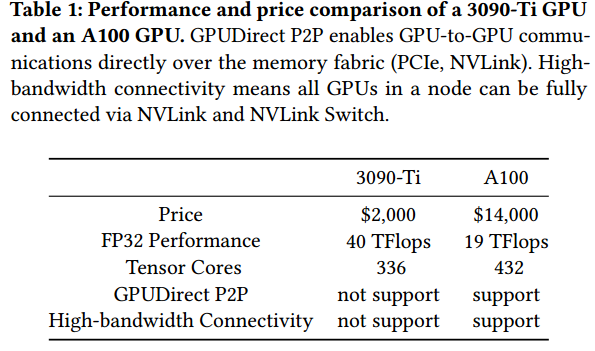

差距:沟通资源稀缺

然而，与数据中心GPU服务器相比，商用GPU服务器的通信资源是有限的。首先，商用GPU服务器的GPU间通信带宽较低。在数据中心GPU服务器中，GPU通过NVLink和NVLink Switch完全连接，任意两个GPU之间的带宽可达900gb /s[12]。普通GPU服务器不支持全连接NVLink和NVLink Switch。因此，它们的gpu间通信仅达到PCIe总线的带宽(16gb /s)。

Second, communication contention is a hurdle to making every
single GPU fully utilize communication resources. GPUDirect Peer
to Peer (GPUDirect P2P), which enables GPU-to-GPU data operations directly over the memory fabric (PCIe, NVLink), is unavailable
on commodity GPUs. 因此，GPU之间的通信首先通过CPU路由到DRAM，然后再传输到目标GPU。然而，在大多数商用GPU服务器中，多个GPU通过单个PCIe交换机连接到一个CPU(图1a)。在这种GPU拓扑中，如果多个GPU同时传输数据，则通信受到共享的CPU根复合体(红色箭头所示)的限制，每个GPU只使用CPU根复合体的一部分带宽。

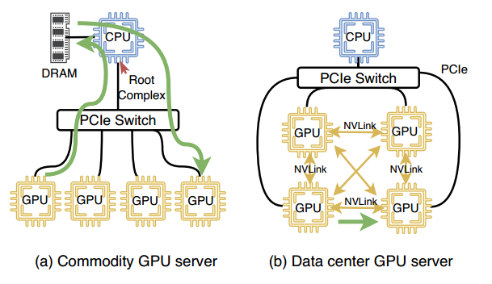

有限的GPU内存容量限制了商用和数据中心GPU服务器的可训练模型大小。最先进的微调系统，微软DeepSpeed，支持异构内存在数据中心GPU服务器上训练大规模模型(例如，DGX-2[4])。但是，由于§2.2中提到的通信问题，它不适合商用GPU服务器。实验中，我们在4×3090-Ti服务器上使用类似gpt的模型对DeepSpeed进行了分析，发现通信时间占总训练时间的70%以上;DeepSpeed的详细配置见§4。我们得出结论，这是因为DeepSpeed的通信模式与商品GPU服务器上稀缺的通信资源不匹配。具体来说，有以下两个原因。

DeepSpeed的大量通信，但在商用GPU服务器上的通信带宽较低。DeepSpeed产生了大量的通信。通过分析，我们发现DeepSpeed的通信流量在单个训练步骤中是模型大小的7.3倍。有两个因素导致了这一现象。首先，DeepSpeed基于数据并行性，因此需要在所有gpu上减少每个参数的梯度以确保参数一致性。其次，DeepSpeed对gpu之间的模型参数进行分片。在训练过程中，对每一层的参数进行全采集。在启用GPUDirect P2P和NVLink的情况下，这种频繁的all-to-all集体通信会对数据中心GPU服务器造成很小的开销。然而，使用商用GPU服务器，由于GPU间带宽较低，通信开销将完全暴露。

DeepSpeed的全对全集体通信频繁，但在商用GPU服务器上通信资源争用。图2显示了对15B模型进行微调时，GPU通信带宽在一个训练步骤中的累积分布函数。我们观察到，DeepSpeed的大多数数据通信仅达到CPU根复合体最大带宽的50%。原因是由于缺乏GPUDirect P2P，所有GPU通信都必须经过CPU的根复合体.在DeepSpeed中，有大量的所有到所有的GPU集体通信，这使得同一CPU下的多个GPU同时传输数据变得频繁。它导致大量通信，以争夺CPU根复核的带宽。

总之，尽管DeepSpeed通过利用异构内存在有限的GPU内存上实现大规模模型训练，但通信资源的稀缺性仍然阻碍了商用GPU服务器上高效的大型模型微调

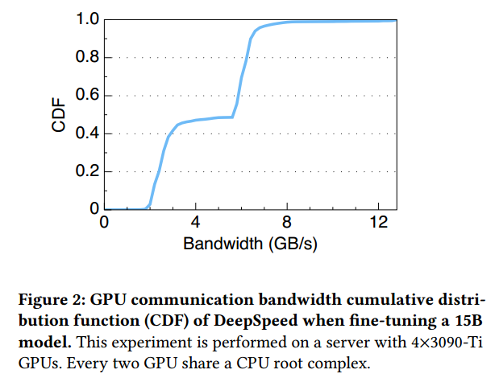

# MOBIUS DESIGN

Mobius是一种新的流水线并行，可以减少通信，同时使异构存储器能够训练大规模模型(§3.1)。为了充分利用Mobius管道的机会，Mobius提出了一种基于混合整数程序(MIP)的模型分区算法来寻找最优分区方案(§3.2)。在分区后，Mobius使用交叉映射将阶段映射到不同的gpu，减少通信争用(§3.3)。

## Mobius Pipeline

在Mobius流水线中，阶段的数量可以超过GPU的数量，每个GPU负责多个阶段的执行。这些阶段存储在DRAM中。Mobius在执行阶段之前将阶段的副本从DRAM传输到GPU内存，并在所有微批上完成阶段的执行后在GPU中释放该副本。请注意，我们专注于仅使用DRAM扩展GPU内存，因为公开可用的预训练模型通常可以适合DRAM，而ssd的有限带宽是单个服务器上的性能瓶颈。

图4a显示了一个Mobius管道的示例。我们假设模型被划分为𝑆阶段，并且这些阶段被映射到预置的gpu(例如，𝑆= 8， N= 4，𝑃1，𝑃2，𝑃3，𝑃4是图4中的gpu)。

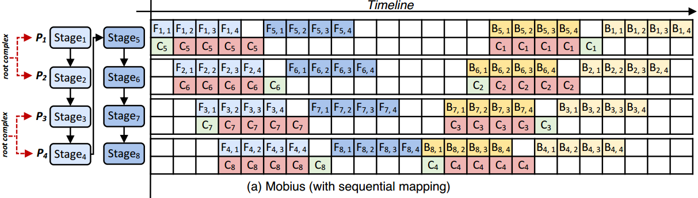

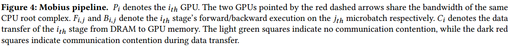

(p1p2有竞争，p3p4有竞争)

在训练步骤,每个阶段执行𝑀microbatches𝑀等于𝑁(例如,图4中𝑀= 4)。𝑆𝑡𝑎𝑔𝑒1,5映射到𝑃1𝑆𝑡𝑎𝑔𝑒2,6映射到𝑃2𝑆𝑡𝑎𝑔𝑒3,7映射到𝑃3和𝑆𝑡𝑎𝑔𝑒4,8映射到𝑃4。在转发过程中，首先在𝑆𝑡𝑎𝑔𝑒1 ~ 4上计算微批𝑚1，当它到达𝑆𝑡𝑎𝑔𝑒4时，在𝑆𝑡𝑎𝑔𝑒1上完成最后一个微批𝑚4的转发。此时，𝑆𝑡𝑎𝑔𝑒5可以从DRAM转移到GPU内存，并取代𝑃1上的𝑆𝑡𝑎𝑔𝑒1。

𝑚1在𝑆𝑡𝑎𝑔𝑒4上的激活被转移到𝑃1，而𝑃1继续在𝑚1上执行𝑆𝑡𝑎𝑔𝑒5的转发功能。其他微批的计算和阶段的替换是类似的。

Here we analyze the communication
traffic of Mobius and DeepSpeed theoretically to show that Mobius
pipeline reduces communications traffic. We take the case of mixed
precision training [30] for example.
In one training step of Mobius, only two copies of parameters
need to be transferred to GPU memory in FP16 for forward and
backward execution (𝑃𝑀𝑜𝑏𝑖𝑢𝑠). Besides, Mobius pipeline needs to
offload activations from GPU memory to DRAM after forward
and upload them from DRAM to GPU memory before backward
(𝐴𝑀𝑜𝑏𝑖𝑢𝑠). At the end of each step, the parameters’ gradients should
be transferred to DRAM for parameter update (𝐺𝑀𝑜𝑏𝑖𝑢𝑠). Therefore,
the communication traffic of Mobius is(省略A，4字节为单位)

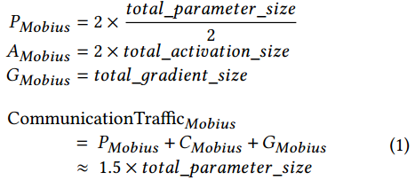

In comparison, DeepSpeed transfers two copy of the parameters
in FP16 from DRAM to GPUs, and transfers 2 × (𝑁 − 1) copies
of the parameters between all GPUs (𝑃𝐷𝑒𝑒𝑝𝑆𝑝𝑒𝑒𝑑 ). At the same
time, the activations need to be transferred between DRAM and
GPU memory twice as much as Mobius (𝐴𝐷𝑒𝑒𝑝𝑆𝑝𝑒𝑒𝑑 ). In backward,
each GPU generates a version of gradients (𝐺𝐷𝑒𝑒𝑝𝑆𝑝𝑒𝑒𝑑 ). Therefore,
gradients in each GPU need to be first all-reduced and then swapped
to DRAM for parameter update. In summary, the communication
traffic of DeepSpeed is

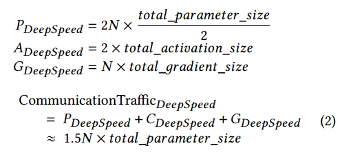

如果我们使用检查点和重新计算[17]在微调,𝑡𝑜𝑡𝑎𝑙_𝑎𝑐𝑡𝑖𝑣𝑎𝑡𝑖𝑜𝑛_𝑠𝑖𝑧𝑒是微不足道的。由于使用FP16训练模式，每个参数的梯度大小等于参数大小的一半。

Mobius管道更新参数的方式与GPipe相同，使用同步参数的梯度更新而不是PipeDream中的异步参数更新[31]，因此可以保证与不使用管道相同的模型收敛性和精度性能。

## Model Partition

模型划分一直是流水线并行中一个重要的问题，它决定了流水线并行的整体训练吞吐量。

虽然已有流水线模型划分公式或算法[24,31]，但它们并不适用于Mobius，因为它们只考虑模型仅存储在GPU内存中的情况。

Mobius的管道并行性与异构内存是复杂的。为了对其进行建模，我们的分区算法必须考虑传统管道并行性中未包含的这些额外因素:

在Mobius流水线中，每个GPU处理多个阶段，并且阶段在GPU和DRAM之间交换。因此，在Mobius管道中，计算时间和通信时间都对阶段执行时间有贡献。

Prefetching. Mobius reserves a portion of GPU memory for
prefetching the next stage’s data to overlap communication with computation. In a dilemma, too much reserved
GPU memory causes small stages, incurring more activations communication among GPUs, while too little reserved GPU
memory limits the prefetch of the next stage, under-utilizing
computation to overlap communication. Therefore, the algorithm should consider memory allocation of prefetching
carefully

The model partition problem is
equivalent to how to assign each model layer to different stages.
To formulate this problem, we use boolean variables 𝐵𝑖,𝑗 to denote
whether the 𝑖
𝑡ℎ model layer is placed in the 𝑗
𝑡ℎ stage, where 1 ≤ 𝑖 ≤
𝐿, 1 ≤ 𝑗 ≤ 𝐿 (𝐿 is the number of model layers). Note that we do not
know the stage count beforehand, but the maximum stage count is
𝐿. Thus, we allocate 𝐿 logical stages for convenience; for a given 𝑗,
if all 𝐵,𝑗 equals 0, it means the 𝑗
𝑡ℎ stage does not exist physically.
Our goal is to find a group of 𝐵𝑖,𝑗 to minimize the training time of
one step, considering memory limitation and pipeline order.

We employ a mixed-integer program (MIP) to find the best group
of 𝐵𝑖,𝑗 . Table 2 summarizes all used variables. The objective is to
minimize the training time of a step (i.e., the start time of executing
the first stage’s backward function on the last microbatch, 𝑡𝑏0,𝑀 ,plus with its backward duration 𝑇𝑏0), which can be formulated as:

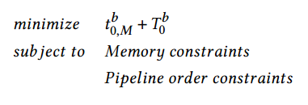

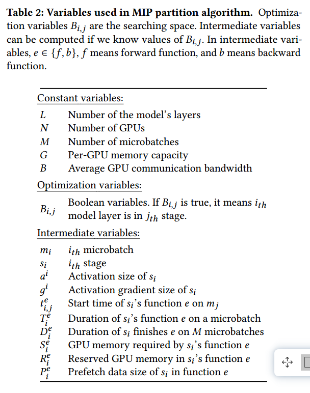

首先，GPU内存应该保存当前计算阶段的参数和训练过程中的中间数据。此约束公式如下:

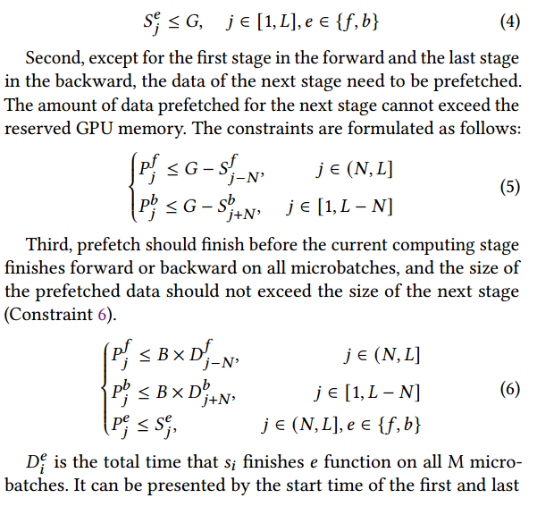

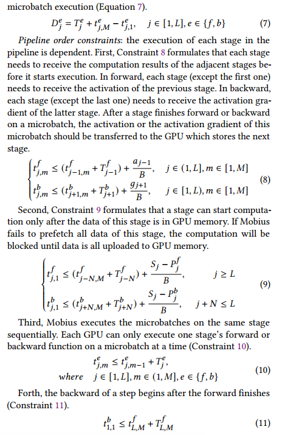

(应该是大于)

MIP partition algorithm requires the pre-knowledge of
the memory footprint and computing time of each layer. A basic
way to get this information is to profile the whole model and collect
each layer’s statistics, which is slow since prefetching is disabled for
more accurate statistics.（？） Mobius leverages the model layer similarity
to reduce the profiling time. There are a large number of identical
layers in large-scale models (e.g., Transformer blocks in GPT-3).
These layers share similar GPU memory footprint and computing
time. Mobius merges a group of equal layers into one based on the
model layer similarity. This compresses a model to a smaller one,
enabling profiling to be completed in less time.

我们通过使用Gurobi Optimizer[10]来解决这个MIP，以获得一个平衡分区。在我们的评估中，求解时间最多只花费几秒钟，与整个微调持续时间(数小时到数天)相比，这是可以忽略不计的。

## Cross Mapping

The stage mapping needs to consider communication contention. We observe that when mapping adjacent stages to the GPUs under the same CPU root complex, the Mobius pipeline’s
performance suffers from communication contention.例如，在图4a中，𝑆𝑡𝑎𝑔𝑒5和𝑆𝑡𝑎𝑔𝑒6被映射到𝑃1和𝑃2，它们共享同一个CPU根复群的带宽。在预取它们时存在严重的通信争用(图4a中𝐶5和𝐶6的红色方块)。因此，它增加了数据传输的时间，并引入了更多的计算气泡，从而降低了Mobius管道的整体吞吐量

根据观察，Mobius将相邻阶段尽可能映射到不在同一CPU根复数下的gpu，称为交叉映射。交叉映射使得上传阶段数据的时差更大，大大减少了通信争用。

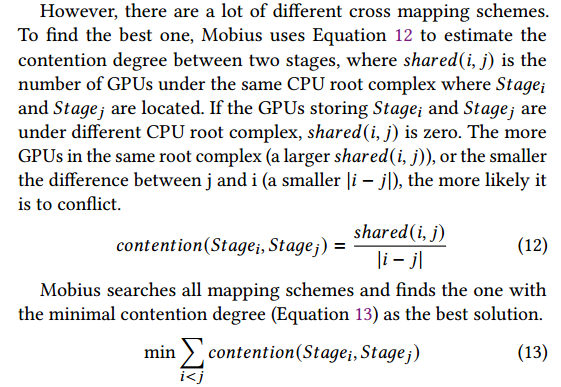

虽然交叉映射试图避免通信争用，但仍然可能在同一根复核下同时进行多个预取。Mobius为较早开始的阶段的预取分配更高的优先级，这进一步减少了通信争用。在实现中，Mobius使用cudaStreamCreateWithPriority API来分配优先级。

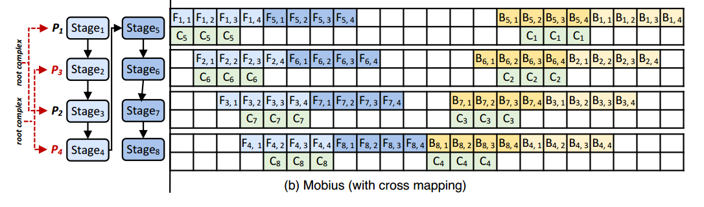

图4b显示了交叉映射的具体示例。𝑃1和𝑃2共用同一个CPU根复数的带宽，𝑃3和𝑃4共用另一个。我们把𝑆𝑡𝑎𝑔𝑒5和𝑆𝑡𝑎𝑔𝑒6为例。

将它们交叉映射到𝑃1和𝑃3，而不是将𝑆𝑡𝑎𝑔𝑒5和𝑆𝑡𝑎𝑔𝑒6映射到𝑃1和𝑃2。因此，𝑆𝑡𝑎𝑔𝑒5和𝑆𝑡𝑎𝑔𝑒6的数据传输可以充分利用CPU的最大带宽，而不会产生通信争用。说明预取优先级:如果同时执行𝑆𝑡𝑎𝑔𝑒5和𝑆𝑡𝑎𝑔𝑒7的预取操作，则𝑆𝑡𝑎𝑔𝑒5的优先级更高，因为𝑆𝑡𝑎𝑔𝑒5执行得更早。通过交叉映射，Mobius充分利用了不同CPU根复合体的带宽。与序列映射的Mobius相比，在本例中，它每训练一步减少2个时间单位。

# EVALUATION

我们首先演示Mobius的端到端性能，然后展示每种设计的有效性。我们最终在数据中心GPU服务器上对Mobius的可伸缩性和性能进行了基准测试

We use two setups. The first setup contains a server equipped
with 1.5TB DRAM, two Intel Xeon Gold 6130 CPUs and 8×3090-Ti GPUs (each GPU has 24 GB memory). Every 4 GPUs are connected
to a CPU root complex via PCIe 3.0x8 and a PCIe Switch. The
second setup, referred to as data center GPU server, is an Amazon
EC2 P3.8xlarge instance [1], which provides 4×V100 GPUs (16 GB
memory) and enables GPUDirect P2P via NVLink with bandwidth
of 300 GB/s. Unless specified, experiments use the first setup.

我们在三种GPU拓扑上评估Mobius，即Topo 4, Topo 2+2和Topo 1+3，以模拟共享服务器中不同的GPU分配。Topo 4表示4个gpu共用一个CPU根复数，Topo 2+2表示2个gpu共用一个，Topo 1+3表示4个gpu共用一个。其中，Topo 2+2的通信争用最小，Topo 4的通信争用最严重

我们的基线是GPipe[26]和DeepSpeed[3]。GPipe是一种仅使用GPU内存训练模型的流水线并行。据我们所知，DeepSpeed是使用异构存储器训练大规模模型的最新技术。DeepSpeed还支持仅使用GPU内存的流水线并行。我们在这两种配置中配置DeepSpeed。第一种配置为ZeRO-3模式，启用异构内存(GPU内存和DRAM)。在第二种方法中，它被配置为管道并行。具有管道并行性的DeepSpeed在训练大规模模型时内存不足(?)，不适合GPU内存。因此，除非指定，否则DeepSpeed使用第一种配置。

 The
3B model with batch size of 2 is the largest model that GPipe and
DeepSpeed with pipeline parallelism can train. 

##  Overall Evaluation

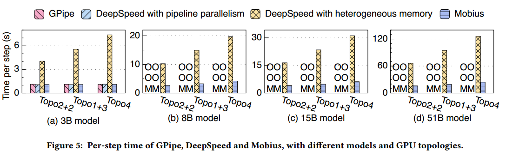

我们在图5中比较了GPipe、DeepSpeed和Mobius的每步训练时间。在这个实验中，我们在三个GPU拓扑上以一个批处理大小训练表3中的所有四个模型。我们有以下观察结果。1)与具有管道并行性的GPipe和DeepSpeed相比，具有异构内存的Mobius和DeepSpeed都能够训练更大批次的更大模型。 2) Mobius decreases per-step training time by 3.8-5.1× compared with DeepSpeed with
heterogeneous memory.3)当GPU拓扑存在更严重的通信争用时，Mobius比异构内存的DeepSpeed带来了更显著的性能提升。这是因为具有异构内存的DeepSpeed在商用GPU服务器上遭受更多的通信争用，而Mobius通过仔细的分区和映射算法减轻了它。

4)由于交叉映射机制，Mobius在不同GPU拓扑下保持几乎稳定的性能。

## Communication Analysis

为了验证Mobius解决了商用GPU服务器上的通信问题，我们在训练期间收集了通信流量、带宽统计和非重叠通信成本。

从图6可以看出，DeepSpeed需要传输7.3倍的模型数据，而Mobius只需要传输1.8倍的模型数据。原因是DeepSpeed需要频繁的GPU all-to-all集体通信来全部收集参数和全部减少梯度，而Mobius管道只传输小的激活和激活梯度。结果与§3.1的分析是一致的。

Figure 7 shows the cumulative distribution function of GPU communication bandwidth statistics in one
training step. In Mobius more than half of the data is transferred
at a bandwidth of more than 12 GB/s (the maximum bandwidth measured is 13.1 GB/s). However, DeepSpeed transfers most data
at a bandwidth of less than 6 GB/s, which is half of the maximum
bandwidth of the CPU root complex due to serious communication contention. Thus, Mobius effectively mitigates communication
congestion on commodity GPU servers.

图8显示了通过计算得到的通信时间在每步训练时间中不重叠的比例。我们有以下观察结果。1)与DeepSpeed相比，Mobius将非重叠通信时间的比例降低了46%。这验证了Mobius的设计可以充分利用计算来重叠通信开销。在Mobius时间中，非重叠通信的比例越小，也意味着通信导致的计算停顿时间越少。2) Mobius在Topo 2+2下可以更好地重叠通信开销。这是因为交叉映射技术帮助Mobius更好地利用拓扑信息来减少通信开销。

从图6、7和8中我们可以得出结论，Mobius相对于DeepSpeed的性能提升来自于通过计算减少通信流量，缓解通信争用和重叠通信开销。

##  Effect of MIP Partition Algorithm

为了评估MIP划分算法的有效性，我们比较了以下三种不同的模型划分机制。

•MIP分区算法。这是我们提出的算法(见§3.2)。

•最大阶段划分算法。每个阶段包含尽可能多的Transformer块，而不会耗尽内存。

•最小阶段划分算法。每个阶段只包含一个Transformer块

与其他算法相比，MIP分割算法最多可以减少51%的训练时间，这说明MIP分割算法生成的更均衡的分割方案可以显著提高训练性能。具体来说，我们有以下三点看法。1)在大多数情况下，最大阶段划分算法的性能最差。它用当前计算阶段的数据填充GPU内存，从而防止预取下一阶段的数据，并消除了计算重叠通信的机会。2)当Transformer块和微批较大时，MIP分区算法与最小阶段分区算法的性能相当。这是因为在这种情况下，单个GPU的内存只能存储一层的参数和计算数据，这使得MIP分区算法生成的分区方案与最小化阶段分区算法生成的分区方案完全相同。3)当Transformer块和微批较小时，计算开销较小，gpu之间频繁激活和激活梯度传递的开销变得显著。在这种情况下，MIP分区算法生成的解效率更高。

## Effect of Cross Mapping

我们通过使用顺序映射作为基线并保持Mobius的所有其他组件相同来评估交叉映射的性能改进。我们使用8个gpu来训练这些模型，其中每4个gpu共享一个CPU根复核。

图10显示了两种映射机制每步的训练时间(归一化为顺序映射)。1)与顺序映射相比，交叉映射每步训练时间减少11.3%-18.1%，验证了其设计。 2) The performance improvement brought by cross mapping is less significant when the
size of Transformer blocks and microbatch becomes large. This is
because that extremely large microbatches and Transformer blocks result in more computing time, which outweighs the communication time and makes the reduced communication time of cross
mapping insignificant.

为了验证交叉映射对通信争用的有效性，与图7的设置类似，我们在一个训练步骤中收集GPU通信带宽统计;参见图11。

与使用顺序映射相比，使用交叉映射可以在更高的带宽上传输更多的数据，显示出交叉映射在缓解通信争用方面的优势。

## Mobius Overhead

为了分析Mobius带来的额外开销，我们分析了Topo 1+3中训练过程中的模型划分和交叉映射开销。模型分区开销是由分析和MIP求解造成的。从图12中，我们有以下观察结果。1)与整体微调开销(数小时到数天)相比，这些额外开销可以忽略不计。2) 15B型号虽然比8B型号大，但它们的剖面时间相近。

这是因为利用模型层相似性后，只需要对不同层进行分析，使得分析时间只与不同层的计算时间有关，这两种模型具有相似的隐维大小，导致不同层的计算时间相似，从而具有相近的分析时间。3)当模型的隐藏维数较小时，MIP求解的开销较大。原因是GPU可以存储的最大层数很大，增加了搜索空间。

模型中更多的层也会带来更高的开销，因为在MIP中有更多的变量对应于这些层。

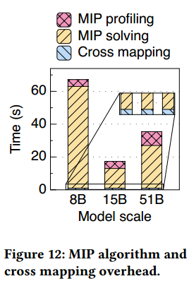

##  Convergence Evaluation

图13是在WikiText-2上对GPT-2模型进行精细调试时，GPipe与Mobius的训练损失曲线对比。我们使用GPipe时使用8 × 3090-Ti GPU，使用Mobius时使用4 × 3090-Ti GPU。我们观察到GPipe和Mobius的训练损失曲线几乎重合。

## Scalability Evaluation

为了分析Mobius的可扩展性，我们通过将gpu的数量从2扫到8来训练15B模型。我们不断地将微批大小设置为1，并随着gpu数量的增加而增加批大小。图14显示了Mobius超越了完美的线性缩放。当gpu不能平均分成两组时，由于两个CPU根复核下的通信争用不均匀，Mobius的性能会有轻微的下降。

## Evaluation on Data Center GPU Server

虽然Mobius是为商用GPU服务器设计的，但我们也评估了它在数据中心GPU服务器上的性能，以测试Mobius对不同服务器配置的敏感性。图15a显示了Mobius和DeepSpeed在数据中心GPU服务器和3090-Ti GPU服务器上的性能和每步价格。我们观察到:1)DeepSpeed和Mobius在数据中心GPU服务器上都有性能提升。这是因为数据中心GPU服务器上的NVLink减少了GPU之间的通信开销。图15a显示了Mobius和DeepSpeed在数据中心GPU服务器和3090-Ti GPU服务器上的性能和每步价格。我们观察到:1)DeepSpeed和Mobius在数据中心GPU服务器上都有性能提升。这是因为数据中心GPU服务器上的NVLink减少了GPU之间的通信开销。. 2) DeepSpeed needs frequent collective communication between GPUs as we analyze in, but there is only a small number of activations and activation
gradients transferred between GPUs in Mobius.因此，DeepSpeed在数据中心GPU服务器上有更显著的性能提升。3) Mobius在数据中心GPU服务器上的表现不如DeepSpeed。这是因为Mobius的总通信带宽较少。Mobius仅利用gpu存储相邻阶段的nvlink，而DeepSpeed充分利用全连接的nvlink进行所有到所有通信。

我们在一个训练步骤中收集gpu到cpu和cpu到gpu通信带宽统计信息，如图16所示。与商用GPU服务器情况相比，由于DeepSpeed减少了集体通信开销，因此减少了DeepSpeed和Mobius之间的通信争用差距。

然而，Mobius中的通信争用仍然较低。

这是因为在Mobius管道中，同时有更少的阶段数据传输。(通信差距变小，有气泡)

与在数据中心GPU服务器上使用DeepSpeed相比，在3090-Ti GPU服务器上使用Mobius时，每步训练时间增加了42%，但每步价格下降了43%。Mobius以较小的训练性能下降换取更低的训练价格。

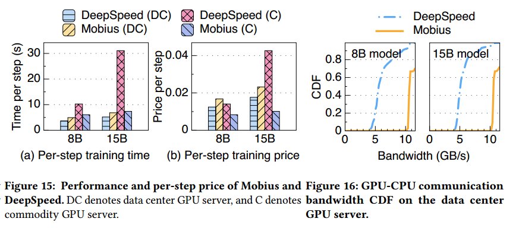

# RELATED WORK

In recent years, there have been a wealth of works on large model
training systems. We classify these works into two categories: scaleup, and scale-out methods.

Scale-out methods. To satisfy the memory requirement of large
model training, several works use multiple GPUs to increase the
aggregated memory of GPUs.管道并行和模型并行是最广泛使用的横向扩展训练方法。流水线并行很难同时保证高GPU利用率和模型收敛[33]。ZeRO[35]是最近针对横向扩展训练的研究成果。总的来说，这些系统的可训练模型规模受到GPU内存容量的限制。

Scale-up methods. Scale-up methods break the GPU memory
limit to train larger models by leveraging external storage resources
such as DRAM and SSD. 他们专注于扩展单个GPU的内存容量，但忽略了多GPU场景中的通信问题，这在训练大规模模型时更为常见。由于模型参数的冗余副本，当使用ZeRO-Offload时，模型规模受到单个GPU内存容量的限制。ZeRO-Infinity[36]在多个gpu中分布式存储模型状态以减少冗余。ZeRO家族的工作是以频繁的通信集体换取GPU内存中模型参数冗余较少的副本，同时也需要频繁的通信集体来保持模型状态的一致性。假设通信带宽足够，且开启了GPUDirect P2P功能。然而，在商品GPU服务器上，通信资源稀缺是一种常见的情况。在这种情况下，ZeRO家庭的培训绩效受到影响。ZeRO家族集成在DeepSpeed中[3]。

Different from existing works [14, 19] on commodity GPUs based
on pipeline parallelism, Mobius enables heterogeneous memory,
which increases trainable model scale. Besides, compared with
prior scale-up methods, Mobius focuses on the communication
problem when enabling heterogeneous memory in the multi-GPU
scenario. Mobius具有比ZeRO系列更低的通信成本，并且支持PCIe拓扑，充分利用GPU服务器上的通信资源。它还仔细地利用调度，通过计算来重叠通信开销。因此，Mobius对通信更友好，更适合在通信资源稀缺的情况下使用。

(流水线并行+zero)

# CONCLUSION

Mobius引入了一种新的流水线并行，它使异构内存能够使用有限的GPU内存训练更大的模型，同时带来更少的通信。为了充分利用Mobius管道，Mobius提出了一种基于混合整数程序的分区算法，寻找最优的模型分区解，平衡了计算和通信。Mobius采用交叉映射技术，以最小的通信争用将阶段映射到gpu。

GPUDirect P2P可以通过内存结构(PCIe, NVLink)直接实现gpu到gpu的通信。

高带宽连接意味着节点内所有gpu可以通过NVLink和NVLink Switch实现全连接。

有nvlink，gpu-nvlink-gpu

有p2p，gpu-pcie-gpu

gpu-pcie-cpu-pcie-gpu: shared the CPU root complex

每个GPU负责多个阶段的执行(减少通信量)，通过在GPU和DRAM之间交换阶段，预取下一阶段(重叠)，交叉映射减少通信争用

