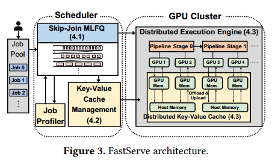
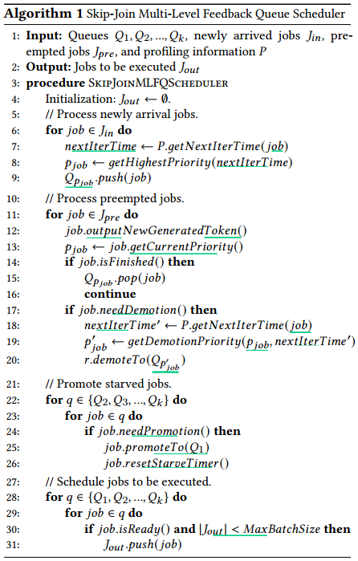
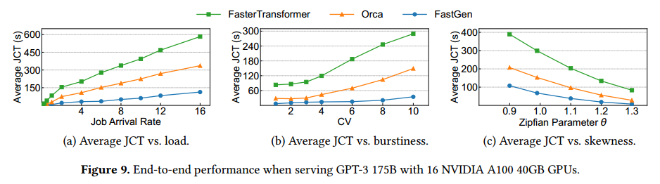
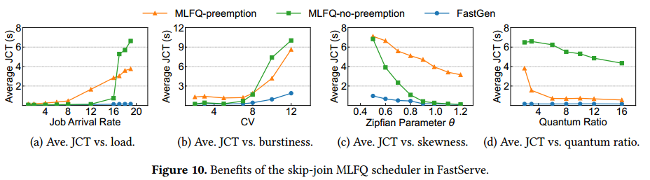
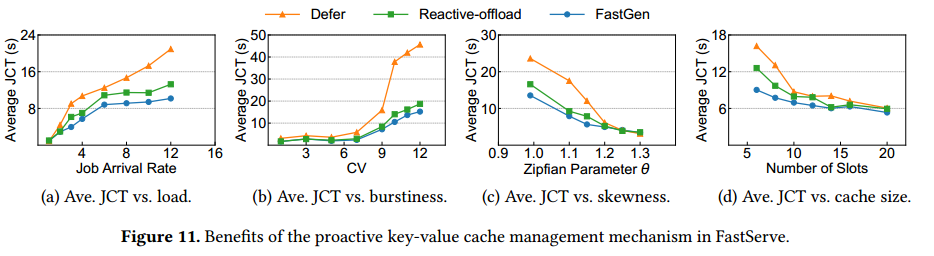

# Abstract

以ChatGPT为代表的新一代交互式人工智能应用。这些应用程序的交互特性需要较低的作业完成时间(JCT)来进行模型推断。Existing LLM serving systems use run-to-completion processing for inference jobs,这种处理存在排队阻塞和长JCT的问题。

用于LLM的分布式推理服务系统FastServe。FastServe利用LLM推理的自回归模式，在每个输出令牌的粒度上实现抢占。FastServe使用一种新颖的跳过连接多级反馈队列调度程序来最小化JCT。基于新的半信息不可知的LLM推理设置，调度器利用输入长度信息为每个要加入的到达作业分配适当的初始队列。跳过比加入队列优先级更高的队列以减少降级。我们设计了一种高效的GPU内存管理机制，主动卸载和上传GPU内存和主机内存之间的中间状态，用于LLM推理。基于NVIDIA FasterTransformer构建了FastServe的系统原型。实验结果表明，与最先进的解决方案Orca相比，FastServe将平均JCT和尾部JCT分别提高了5.1倍和6.4倍

#  Introduction
DNN推理作业通常具有确定性和高度可预测性[29]，即推理作业的执行时间主要由模型和硬件决定。LLM推理作业具有特殊的自回归模式。LLM推理作业包含多个迭代。执行时间取决于输入长度和输出长度，后者是未知的。

现有的推理服务解决方案，如Clockwork[29]和Shepherd[59]，主要是为ResNet[31]等确定性模型推理任务设计的。它们依赖于精确的执行时间分析来做出调度决策，这不适用于具有可变执行时间的LLM推理。Orca[58]是LLM推理的最先进解决方案。在每次迭代结束时，它可以向当前处理批添加新作业或从当前处理批中删除已完成的作业。（未完成的作业不退出）它使用先到先服务(FCFS)来处理推理作业。由于GPU内存容量有限，并且推理作业需要较低的JCT，因此不能使用任意数量的传入作业来扩展当前处理批。众所周知，运行到完成的处理过程（未完成的作业不退出）存在行首阻塞[35]。对于LLM推理作业来说，这个问题尤其严重，因为LLM的大尺寸会导致较长的绝对执行时间。大型LLM推理作业，即输出长度较长的作业，会运行较长时间以阻塞后续较短的作业

FastServe在每个输出令牌的粒度上实现抢占。具体来说，当一个计划作业完成生成输出令牌时，FastServe可以决定是否继续该作业。这允许FastServe使用抢占式调度来消除排队阻塞并最小化JCT。

FastServe的核心是一种新颖的跳过连接多级反馈队列(MLFQ)调度程序。MLFQ是在信息不可知的情况下最小化平均JCT的经典方法[8]。每个作业首先进入最高优先级队列，如果在阈值之后没有完成，则降级到下一个优先级队列。虽然输出长度是未知的，但输入长度是已知的。由于LLM推理的自回归模式，输入长度决定了生成第一个输出令牌的执行时间，该令牌可能比后面的令牌大得多(§4.1)。（时间）每个到达作业不总是进入最高优先级队列，而是通过比较第一个输出令牌的执行时间与队列的降级阈值来加入适当的队列。跳过比加入队列优先级更高的队列以减少降级。（减少调度次数）

使用MLFQ的抢占式调度引入了额外的内存开销，以维持已启动但未完成的作业的中间状态。在FCFS中，缓存只需要在处理批中存储调度作业的中间状态，受最大批大小的限制。但在MLFQ中，更多的作业可能已经启动，但被降级到较低的优先级队列。调度程序可以在缓存已满时暂停启动新作业，但这再次引入了行首阻塞。（暂停也不能处理，如果没有预留最大长度的空间）相反，我们设计了一种高效的GPU内存管理机制，当缓存接近满时，主动将低优先级队列中的作业状态卸载到主机内存中，并在要调度这些作业时将状态上传回来。我们使用流水线（并行策略？）和异步内存操作来提高效率。

并行化策略，包括张量并行化[50]和管道并行。调度器在管道中并发运行多批作业（orca），以最小化管道气泡。键值缓存管理器将键值缓存分区到多个GPU上，组织分布式的键值缓存，并以分布式的方式处理GPU内存和主机内存之间的交换(?)。

# Background and Motivation

## Inference Serving Systems

大多数现有的推理服务系统，如Tensorflow serving[43]和Triton inference Server[19]，对DNN模型是不可知的。它们作为底层执行引擎之上的抽象，为到达的作业排队，将作业分派到可用的计算资源，并将结果返回给客户端。通常使用批处理作业来提高硬件利用率和系统吞吐量。批处理的缺点是与单任务执行相比内存开销更高。由于激活内存与模型大小成比例增长，LLM的大尺寸限制了LLM推理的最大批处理大小。交互式应用程序的低延迟要求也会影响批处理大小的选择

In a Transformer layer, the Masked Self-Attention module is the core component that distinguishes it from other architectures like CNNs. 它使用query与先前令牌的所有键的点积来从当前令牌的角度衡量先前令牌的兴趣。在解码阶段，GPT只需要计算新生成的令牌的查询、键和值。使用并更新键值缓存以逐步生成令牌。因此，解码器阶段迭代的执行时间通常比第一次迭代的执行时间要小。

## Opportunities and Challenges

Opportunity: preemptive scheduling：排队阻塞可以通过抢占调度来解决。机会是利用这种自回归模式在每次迭代的粒度上启用抢占。（orca未完成的不抢占）使用抢占调度策略来避免排队阻塞，并对JCT进行优化。

Challenge 1: unknown job size：最短剩余处理时间(SRPT)[47]是一种众所周知的最小化平均JCT的抢占式调度策略。迭代的次数(即输出序列长度)是未知的，也很难预测，因为它是由作业的语义决定的。因此，SRPT不能直接应用于LLM推理以最小化平均JCT。

Challenge 2: GPU memory overhead

# FastServe Overview

skip-join MLFQ调度器(§4.1)利用一个分析器来决定基于初始阶段执行时间的新到达作业的初始优先级。它采用迭代级抢占，并倾向于最少获得的作业来解决行首阻塞问题。

键值缓存管理器(§4.2)主动将低优先级作业的键值张量卸载到主机内存，并根据工作负载的突发情况动态调整其卸载策略。

# FastServe Design

## Skip-Join MLFQ Scheduler

由于LLM推理的作业大小是未知的，所以不能直接应用SRPT。已知最小可达服务(LAS)在信息不可知的情况下近似SRPT, MLFQ是实现离散化LAS以减少作业切换的实用方法，已用于许多调度系统[6,8,15,28,32]。MLFQ有许多队列，每个队列分配了不同的优先级级别。到达作业首先进入最高优先级队列，如果在降级阈值(即量子)之后没有完成，则将降级到下一级队列，量子是分配给每个队列的可调参数。高优先级队列通常具有较短的量子。

输入序列长度较长的作业的第一次迭代时间可能超过最高优先级队列的量子。如果调度器抢占了作业，则中间激活必须放弃并稍后重新计算，这会浪费计算资源和时间。如果调度器没有抢占它，那么调度器就违背了MLFQ的设计目的，并再次遭受行首阻塞。

LLM推理是半信息不可知论设置。虽然迭代的次数(即输出长度)事先是未知的，但是每次迭代的执行时间是可以预测的。迭代时间由硬件、模型和输入长度等几个关键参数决定。第一次迭代时间(即，生成第一个输出令牌的执行时间)比单个作业中解码阶段的时间更长。随着输入序列长度的增加，第一次迭代时间大致呈线性增长，而解码阶段迭代时间的增加可以忽略不计。这是由于键值缓存优化(§2.2)。只有新生成的令牌的键值张量需要计算，其他张量从键值缓存加载，从而将瓶颈从计算带宽更改为内存带宽

the ratio between 𝑄𝑖 and 𝑄𝑖−1 is controlled by a parameter quantum ratio. FastServe’s performance is not sensitive to this quantum setting. （比例不重要）在完成对当前处理批中的作业的迭代之后，调度器抢占这些作业𝐽𝑝𝑟𝑒并调用过程𝑆𝑘ipjoi𝑛𝑀𝐿𝑄𝑆𝑐𝑒𝑑𝑢𝑙𝑒𝑟。

调度器根据新到达的作业的第一次迭代时间(由输入序列长度决定)准确地为其分配优先级。when a job arrives, its priority is set to the highest priority whose quantum（时间片） is larger than the job’s first iteration time using the 𝑔𝑒𝑡𝐻𝑖𝑔ℎ𝑒𝑠𝑡𝑃𝑟𝑖𝑜𝑟𝑖𝑡𝑦 method (lines 7-8)对于被抢占的作业，调度器会立即将新生成的令牌返回给客户端，而不是在作业完成之前返回整个响应，这优化了用户体验(第12行)。 If the job does not finish and uses up its quantum in the current queue, the scheduler decides the demoted priority of the job based on its current priority and next iteration time（降级依据） by using 𝑔𝑒𝑡𝐷𝑒𝑚𝑜𝑡𝑖𝑜𝑛𝑃𝑟𝑖𝑜𝑟𝑖𝑡𝑦 and ❷ demotes it to the corresponding queue (lines 17-20). 跳跃式连接和降级操作可能导致输入长度或输出长度较长的作业饿死。为了避免这种情况，调度程序会定期重置作业的优先级，如果作业的等待时间超过提升阈值𝑆𝑇𝐴𝑅𝑉𝐸\_𝐿𝐼𝑀𝐼，则将其提升到最高优先级队列𝑄1。The promoted job will get an extra quantum if its next iteration time is less than the quantum of 𝑄1 to ensure its next iteration without preemption.（执行时间大于Q1，只能降级重计算，浪费Q1时间片） This creates possibility of head-of-line blocking, so the system administrator of FastServe can tune 𝑆𝑇𝐴𝑅𝑉𝐸\_𝐿𝐼𝑀𝐼𝑇 to make a tradeoff between performance and starvation.调度器选择一组具有最高优先级的作业，而不超过最大批处理大小。

20:r应该改成job

在最小化JCT方面，信息多的算法优于信息少的算法。如果没有跳转连接，朴素MLFQ可能会退化为轮询，在某些情况下比FCFS更糟糕

## Proactive Key-Value Cache Management

使用运行到完成策略的调度器可以容忍这种内存开销，因为正在进行的作业的最大数量不会超过当前处理批处理的大小。虽然我们选择了一个相对较小的模型，并将最大输出长度限制为20，但跳过连接MLFQ的峰值KV缓存开销可能比FCFS大7倍。

(orcaOOM与迭代级调度没有关系，原来请求级迭代也可能OOM，只是orca避免了，预留就可以避免，这篇论文更容易爆，因为他正在运行的请求数量不固定，orca是固定的，他放到内存，默认不可能爆内存，也可以解决问题)

当GPU内存不足以容纳额外的键值张量时，简单地推迟新到达的作业的执行，并继续调度当前作业，直到它们完成。尽管新作业通常具有更高的优先级，但它们必须被阻塞以等待空闲的内存空间。此解决方案将使MLFQ退化为FCFS，后者再次遭受行首阻塞。

另一个直接的解决方案是杀死一些低优先级的作业，并释放它们的键值缓存，为新到达的高优先级作业腾出空间。首先，被终止的作业失去了它们的生成状态，需要重新运行初始化阶段来生成它们的键值缓存，这会浪费计算资源和时间。其次，它可能导致死锁。当高优先级的作业不断到达时，正在进行的低优先级作业将被杀死。With the starvation avoidance mechanism enabled, the killed jobs may be promoted to the highest-priority queue after 𝑆𝑇𝐴𝑅𝑉𝐸\_𝐿𝐼𝑀𝐼𝑇 .提升的作业可能会再次杀死当前执行的作业，该作业在前一轮中杀死了它，从而导致死锁。This brings extra complexity to set 𝑆𝑇𝐴𝑅𝑉𝐸\_𝐿𝐼𝑀𝐼𝑇 . A large value causes starvation, while a small value may cause deadlocks.(互相杀死对方)

the key-value tensors only need to be reserved in the GPU memory when its corresponding job gets scheduled. 可以将作业的非活动键值张量卸载到主机内存中，并在需要时将必要的键值张量上传到GPU内存中。挑战在于，与令牌生成时间相比，卸载和上传的开销不可忽略。使用主动卸载和上传来最小化交换开销。而不是被动卸载when the key-value cache is full。FastServe为新到达的作业保留一些空闲的键值缓存槽。当一个新作业到达时，它可以立即获得一个键值缓存槽，而不会产生卸载被抢占作业的开销。当GPU上的键值缓存空间足够时，FastServe主动上传将在不久的将来使用的作业的键值张量，而不是被动地上传已执行作业的键值张量，以便令牌生成可以与数据传输重叠

空闲键值缓存的数量是系统管理员设置的可调参数𝐾和突发预测器提供的值的最大值。可调参数𝐾确保至少𝐾新到达的作业不会被卸载阻塞。突发预测器是一种启发式方法，用于预测在不久的将来会出现的工作数量。当大量作业到来时，预测器会提前留出更多空闲的键值缓存槽。We use the number of jobs in the top 𝐾′ priority queues as the prediction，其中𝐾'也是一个可调参数。实证研究发现，绩效对𝐾和𝐾'的选择不敏感。

the decision on the order of offloading and uploading is made based on a metric, the estimated next scheduled time(ENST).The job with the largest ENST will be offloaded first, and the job with the smallest ENST will be uploaded first. In general, the lower priority a job has, the later it will be scheduled to execute。由于饥饿预防机制，具有较低优先级的作业可能被提升到较高优先级的队列。

for job 𝑖, FastServe considers the time to promote this job and the sum of executed time of all jobs
with higher priorities before executing 𝑖. As for the sum of executed time of all jobs with higher priorities before executing 𝑖, we assume those jobs do not finish earlier before being demoted to the priority queue of 𝑖.

$𝑇_{𝑒𝑥𝑒𝑐𝑢𝑡𝑒} (𝑖, 𝑗) =∑︁_{𝑖.𝑝𝑟𝑖𝑜𝑟𝑖𝑡 𝑦<𝑘 ≤𝑗.𝑝𝑟𝑖𝑜𝑟𝑖𝑡 𝑦}𝑞𝑢𝑎𝑛𝑡𝑢𝑚(𝑘)$

$𝑇_{𝑒𝑥𝑒𝑐𝑢𝑡𝑒} (𝑖) =∑︁_{𝑖.𝑝𝑟𝑖𝑜𝑟𝑖𝑡 𝑦<𝑗.𝑝𝑟𝑖𝑜𝑟𝑖𝑡 𝑦}𝑇_{𝑒𝑥𝑒𝑐𝑢𝑡𝑒} (𝑖, 𝑗)$

$𝐸𝑁𝑆𝑇 (𝑖) = min(𝑇_{𝑝𝑟𝑜𝑚𝑜𝑡𝑒} (𝑖),𝑇_{𝑒𝑥𝑒𝑐𝑢𝑡𝑒} (𝑖))$

使用这个指标来决定卸载和上传的顺序，会使活动作业的键值张量更有可能出现在GPU内存上，而非活动作业的键值张量更有可能出现在主机内存上。这尽可能地隐藏了交换开销。

##  Support for Distributed LLM Serving

张量并行[42,50]和管道并行[33,41]是深度学习模型分布式执行中最广泛使用的两种技术。FastServe支持这两种并行技术的混合.Tensor parallelism splits each operator across multiple devices, with each device executing a portion of the computation in parallel. Additional communication overhead is required to split the input and collect the output from participating GPUs.张量并行性扩展了单个作业可用的计算和内存，从而减少了每次迭代的执行时间。管道并行需要更少的通信开销，由于多个处理批次在不同阶段同时处理，FastServe需要同时处理分布式引擎中的多个批次。FastServe仍然将正在运行的作业保存在优先级队列中，并且每次选择处于挂起状态的最高优先级的作业来执行。

FastServe的键值缓存在分布式服务中也是跨多个GPU进行分区的。每个键值张量都被LLM的同一阶段使用。因此，FastServe将键值张量按照张量并行性的要求进行分区，并将每个键值张量分配给相应的GPU，这样GPU上的所有计算都只需要局部键值张量。

每个阶段可以独立卸载或上传不同的键值张量。To reduce redundant control, before processing the intermediate result sent from the previous stage, the current stage does the same offloading or uploading action as the previous stage does. The intermediate result transmission and keyvalue cache swapping occur in parallel, so the overhead of key-value cache swapping is further reduced（传输中间结果和交换kv重叠）The key-value cache swapping mechanism only needs to decide the offloading or uploading of the first stage. （？）When using tensor parallelism splitting the first stage into multiple chunks, a centralized key-value cache swapping manager instructs all chunks in the first stage to offload or upload the key-value tensors owned by the same job.

# Implementation

10000行Python和c++代码，分布式执行引擎基于NVIDIA FasterTransformer，我们修改它以支持迭代级调度并与键值缓存管理器交互。我们还为其管道并行性添加了扩展，因为其原始的作业级调度实现不允许在当前运行的批处理完成之前注入另一个批处理。我们用MPI[26]以分布式的方式实现键值缓存管理器。我们还使用MPI来传递消息，以同步跨gpu的卸载过程，并利用多个CUDA流（？）来重叠计算与主动交换。

# Evaluation

使用端到端实验来证明FastServe相对于GPT-175B上最先进的LLM服务系统的整体性能改进[12]。评估其设计选择，并展示FastServe中每个组件在各种设置下的有效性。分析了FastServe在不同gpu数量下的可扩展性

The end-to-end (§6.2) and scalability (§6.4) experiments use two AWS EC2 p4d.24xlarge instances. Each instance is configured with eight NVIDIA A100 40GB GPUs connected over NVLink, 1152 GB host memory, and PCIe 4.0×16. the experiments for design choices (§6.3) use one NVIDIA A100 40GB GPU in our own
testbed to validate the effectiveness of each component.

we synthesize a trace of jobs to evaluate the performance of FastServe, since there is no publicly-available job trace for LLM inference.作业大小是通过从Zipf分布中采样随机输入和输出长度来生成的。The Zipf distribution is parameterized by one parameter, 𝜃, which controls the skewness of the distribution. The larger 𝜃 is, the more skewed the workload is, with more long-tail jobs appearing in the workload. We
generate the arrival time for each job following a Gamma process parameterized by arrival rate and coefficient of variation (CV). By scaling the rate and CV, we can control the rate and burstiness of the workload, respectively.

在大多数实验中显示平均JCT，并在可扩展性实验中报告平均和尾JCT

FasterTransformer：支持张量并行和管道并行的分布式执行。它采用请求级调度，因此不支持第§5节中讨论的跨不同作业的流水线。

Orca[58]:它是最先进的LLM服务系统，支持迭代级调度和作业间管道并行，使用了一个简单的FCFS调程程序，具有运行到完成的执行，这将受到行首阻塞的影响。由于Orca不是开源的，我们在FasterTransformer之上实现Orca以进行公平的比较。

## Overall Performance

图9(a)在保持其他参数(例如CV和Zipf参数)相同的情况下改变了工作到达率。FastServe优于Orca 1×-4.3×， fasttransformer优于1.9×-11.4×。当速率较低(≤0.5)时，FastServe具有与Orca相同的性能，但优于FasterTransformer约2倍。这是因为MLFQ在低作业到达率下恶化为FCFS。FasterTransformer不支持作业间流水线，由于流水线中的气泡导致只有50%的GPU利用率(?)。随着速率的增长，FCFS的排队阻塞问题日益严重。当速率大于0.5时，FastServe的性能始终优于Orca至少3倍，fasttransformer的性能始终优于Orca至少5倍。FastServe能够有效地减少排队阻塞，通过优先考虑短作业与跳过连接MLFQ。

FastServe优于Orca 2.3×-5.1×， fasttransformer优于7.4×-12.2×。当cv很低的时候，工作就会平静地到来。因此，FastServe和两个基线之间的性能差距很小。然而，当cv很高的时候，工作就会突然出现，这就加剧了排队的问题。突发工作负载还会给键值缓存管理带来巨大压力。通过主动交换机制，FastServe在高CV下的性能明显优于两个基线。

FastServe优于Orca 1.9×-3.9×， fasttransformer优于3.6×-10.6×。当该系数较小时，作业的输入和输出长度更为平衡。因此，FastServe和两个基线之间的性能差距很小。当变量变大时，作业的输入和输出长度更加倾斜。因此，FastServe从跳过连接MLFQ调度器中获益更多，从而解决了排队阻塞问题。the absolute value of JCT increases as 𝜃 decreases. This is because we bound the maximum input and output lengths. As a result, the workloads with smaller 𝜃 (i.e., balanced job lengths) have more tokens to process.(平衡为什么多)

## Benefits of Design Choices

具有抢占的MLFQ (MLFQ-preemption):它与输入长度无关，并将新到达的作业放在具有最高优先级的队列中。如果相应的量子量不足以执行迭代，则会抢占(即杀死)当前迭代并降级该任务。

无抢占的MLFQ (MLFQ-no-preemption):与输入长度无关。但是，如果相应的量子量不够，则继续执行中途迭代，然后降级该任务。如果总量值（时间片）不足，则退化为轮循调度。（每个请求轮流完成一个token）

当速率较低时，很少甚至没有排队。因此，这三个调度器都退化为FCFS并具有相似的性能。随着速率的增长，由于高优先级队列的时间片可能不足以执行某些作业的第一次迭代，mlfq抢占会受到中途迭代的重新执行开销的影响。对于MLFQ-no-preemption，当速率略高于16时，它的平均JCT急剧增加，因为最高优先级队列中的一些大型作业阻塞了太多作业的执行。

（C）随着Zipfian参数的减小，FastServe和MLFQ-no-preemption之间的性能差距越来越大。这是因为一个小的参数会导致每个作业的输入长度分布更加平衡，使得更多作业的第一次迭代时间超过前几个高优先级队列的时间片。因此，MLFQ-no-preemption退化为轮询

增加量子比率对FastServe的性能几乎没有影响，但它降低了两个基准MLFQ调度程序的JCT。这表明FastServe对量子设置不敏感，使系统管理员的工作轻松了许多。对于mlfq抢占，扩大每个优先级队列的数量可以减轻被抢占推理作业的重新执行开销。对于MLFQ-no-preemption，一个小的量使每个作业以循环的方式得到处理。随着量子的增加，这个问题得到了缓解，因此MLFQ-no-preemption的性能更好。此外，我们还可以看到两个基线之间的性能差距，表明与重新执行开销相比，行首阻塞是一个更严重的性能问题。

Defer:如果键值缓存槽全部用完，则延迟即将到来的作业。作业将等待，直到键值缓存槽可用。

Reactive-offload:当键值缓存已满，并且计划作业无法获得空槽时，它会在缓存中主动选择一个作业，并将其状态卸载到主机内存中。缓存替换策略(即选择要卸载哪个作业)与FastServe相同

如图11(a)所示，当作业到达率较低时，FastServe和两个基线之间的性能差距很小，因为峰值内存使用较低，键值缓存足以满足所有三种解决方案。随着作业到达率的增长，内存使用峰值超过GPU内存容量，使FastServe显著优于Defer高达2.3倍。对于Reactive-offload，较高的作业到达率会导致更多的作业需要键值缓存槽同时到达，但所有作业都需要等待额外的数据传输时间。

(b)中突发的影响，FastServe的性能也比Defer和Reactive-offload分别高出3.5倍和1.4倍，这是由于主动交换和计算之间的重叠。

对于图11(c)中偏度的影响，随着Zipfian参数的减小，性能差距变得更大。This is because the average job
size becomes larger, due to the bounded maximum length and less skewness.峰值内存使用增加.

在图11(d)中，当键值缓存槽数较少时，峰值内存使用很容易超过键值缓存大小，这需要更仔细地进行缓存管理。

##  Scalability

该模型分为两个流水线阶段，并根据gpu的数量相应地调整张量并行度。当使用更多的gpu服务推理作业时，平均JCT和尾JCT都会下降，因为更多的计算资源通过张量并行性加快了每个作业的执行时间。

# Conclusion

多级反馈队列：句子不要连续做完，要抢占（阻塞，短时延），饥饿升级

跳过：起点优先级不同（第一次迭代时间可能超过最高优先级队列的时间片）

内存缓存低优先级作业kv，预留空间，主动上传

上传下载时机：the estimated next scheduled time

分布式缓存

传输中间结果和交换kv重叠