# Abstract

我们开发了一个复杂的块，名为Brainformer，它由多种层组成，如稀疏门控前馈层、密集前馈层、注意力层以及各种形式的层规范化和激活函数。在质量和效率方面，Brainformer始终优于最先进的密集和稀疏变压器。与GLaM模型相比，每个令牌具有80亿个激活参数的Brainformer模型的训练收敛速度提高了2倍，步长时间提高了5倍。在下游任务评估中，Brainformer经过微调后的SuperGLUE得分也比具有相同激活参数数量的GLaM高3%。最后，Brainformer在很大程度上优于NAS衍生的Primer密集模型，在少数次评估中每个令牌的计算量相似。

# Introduction

Many improvements on Transformer
variants have come from scaling the size of models (Raffel et al., 2020; Brown et al., 2020a; Shoeybi et al., 2019;
Chowdhery et al., 2022), scaling the training tokens（数量？）, better training data
quality (Du et al., 2022), and sparsely activated model architectures

Among the efficient transformer language models (Wang
et al., 2020; Choromanski et al., 2020; Tay et al., 2021; Hua
et al., 2022), there is a focus on improving attention-layer
efficiency using low-rank approaches or approximations.（？）

然而，最近的研究也发现，密集前馈层构成了常见序列长度(≤2048)的大部分计算成本，特别是当模型很大时(Du et al, 2022;Zhou et al .， 2022)。To
further improve compute efficiency such as total FLOPs
used during training to reach convergence, sparsely gated
Mixture-of-Experts (Lepikhin et al., 2021; Fedus et al.,
2021; Du et al., 2022; Zhou et al., 2022; Roller et al., 2021;
Lewis et al., 2021; Jaszczur et al., 2021) have become prevalent, giving the model a larger overall capacity to improve
quality while holding computational cost fixed. 

稀疏激活模型不仅降低了计算成本，而且在不减少每个专家有效训练时间的情况下，通过使用路由函数在不同的数据分布上训练不同的专家，具有更好的专门化。The MoE architectures in this line of work are
based on uniform transformer blocks or interleaving dense
and sparse layers (Du et al., 2022) and a fixed top-k routing.

we propose a nonuniform architecture with sparsity where there is no strict
layer interleaving as in the vanilla transformer in fig. 2. We
trade off architecture regularity by allowing the search space
to compose different sub-layers in different orders. For better scaling, we introduce sparsity in the search space with a
sparsely gated feed-forward layer (MoE layer) coupled with
different gating mechanisms

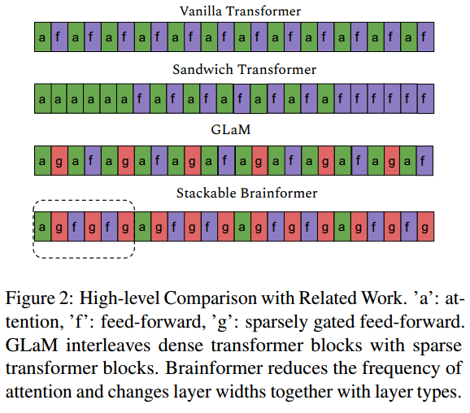

我们发现，优化稀疏层中的架构、稀疏性和路由机制对于实现近乎完美的对数尺度质量缩放至关重要。图1显示了Brainformer比GLaM(手工制作的稀疏转换器)伸缩性好得多。当增加模型容量时，Brainformer可以持续改善训练困惑，同时保持样本率几乎不变，然而，当扩大模型容量时，GLaM的样本率要差得多。（增大模型，要相应增大数据）

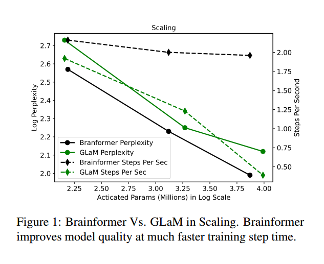

We only treat the MoE layer as a general method to sparsify
the model. In practice, any conditional computation method
can be blended in. We apply a simple evolutionary search to
discover many attributes, such as the best way to interleave
layers and layer capacities, when to fuse layers, and when to
specialize layers with MoE modules. For ease of scaling, we
propose a block-wise sub-layer grouping, such that stacking
a variable number of blocks produces models of different
scales, as illustrated in Stackable Brainformer in fig. 2. As
our results in Section 5 show, this approach has proven
effective in our evaluation at multiple model scales.

#  Related Work

扩大模型容量和训练令牌数量在提高计算机视觉架构的性能方面取得了巨大成功

门控决策可以是二元的或稀疏的，连续的，随机的或确定的。在多设备设置中，稀疏门控的MoE (Shazeer等人，2017)显示了门控在模型容量、训练时间或模型质量方面的巨大改进。

EfficientNet represents one
of the very early non-uniform architectures that leverages
layer heterogeneity to achieve SoTA. Instead of searching
for a new operator or a new block of operators, EfficientNet
focuses on optimizing the layer compound coefficients to
scale the model effectively. This heterogeneity leads to a
model more than 8× smaller and more than 6× faster on inference (Tan & Le, 2019). Sandwich Transformer promotes
a non-interleaved, non-uniform architecture for language
modeling tasks. However, the sandwich reordering pattern
does not guarantee performance gains across every task.
Residual MoE (Wu et al., 2022) factorized the weights into
an input-independent core and an input-dependent residual,
thus achieves comparable results with the upper-bound MoE
training while only introducing minor additional training
cost than the lower-bound non-MoE training. In this work,
we take inspiration from the earlier work but further improve
scaling and generalization via automatic model discoveries.

# Method

## Deriving Our Model Components

There are various forms of computation factorization that
can lead to lower computation cost or faster computation
without penalizing model quality. 

低秩层和多专家层是分解矩阵乘法的两种主要方法，这两种方法都可以在不牺牲模型容量的情况下将FLOPs减少一半。在设计高效的神经网络时，如图4所示，可以将低秩和多专家进行组合和堆叠，以获得更有趣的模型架构，并且计算效率更高。Finally, by also coupling a
temporal mixture layer (e.g. attention (Vaswani et al., 2017),
gMLP (Liu et al., 2021) or MLP mixer (Tolstikhin et al.,
2021)) which captures the causal relations between tokens,
the network becomes a multi-expert transformer variant.

(\[A,B\]\[B,C\]=\[A,D\]\[D,B\]\[B,C])

(ABBC>ADDC+DBBC)

(ABB>ADD+DBB)

([A,B]\[B,C]=[A/2,B/2]\[B/2,C]+[A/2,B/2]\[B/2,C]?)

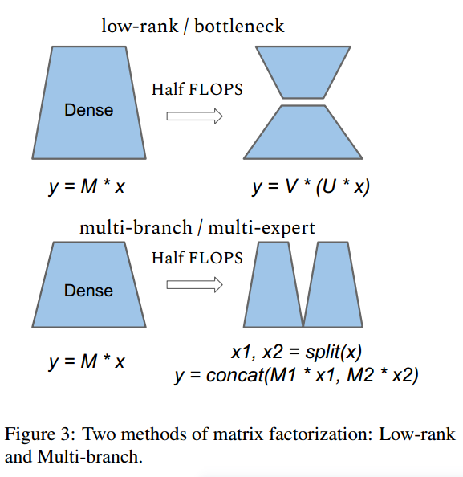

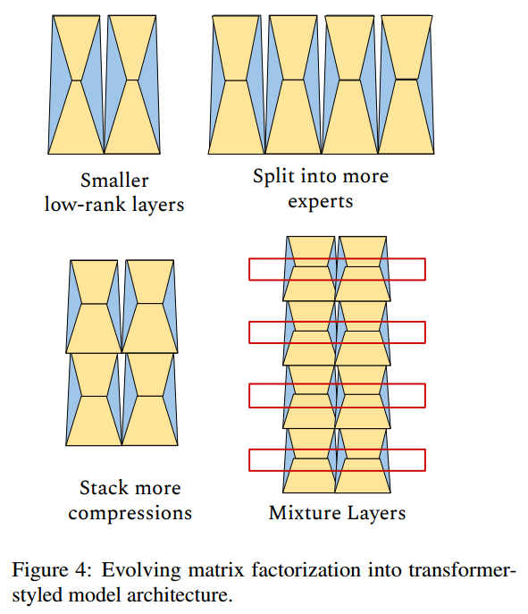

然而，构建一个高效的网络并不需要符合模型架构的统一性，如图4最后一张图所示。通过仔细选择层类型和层交错，以及其他超参数层，我们可以获得更高的质量，训练效率，以及更好的缩放。这引导我们通过采用具有粗粒度稀疏性的低秩和多专家压缩方法来探索更高效的训练架构。

## Block-wise Architecture

For the easiness of scaling, We construct a block-wise search space
where the restriction of uniformly stacking layers is removed. Instead, we create a generic layer as a function
Yi = Fi(Xi), Fi ∈ {Fattn, Fmoe, Fffn} where Fi
is an
operator selected from the operation set consisting of self attention, sparsely gated feed-forward (MoE), and dense feedforward sub-layers as depicted in eq. (3). Input Xi has a
tensor shape of {B, L, H} and H ∈ { 3/4, 1,3/2}×Hmodel_dim where B is the batch size, L is the sequence length, and H
is a tunable model dimension. The intuition behind tuning model dimension is to enable more flexible network
topologies with various factorization methods as described
in section 3.1. For example, we could instantiate a model
with wider hidden dimensions or a model with experts but
each expert being narrow.

Unlike a traditional simple, uniform transformer block, a
Brainformer block is a complex block N that can be represented by a list of composed layers in eq. (1):

We can stack an arbitrary number of Brainformer blocks
to create a target model. The search objective is to find
an optimal layer architecture Fi
, and model scaling multipliers for multiple model inner dimensions that minimizes
the perplexity. Table 1 summarizes the search space in a
Brainformer architecture.

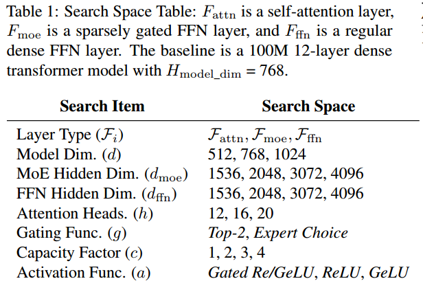

图5和算法1说明了我们用来发现计算效率高的Brainformer模型的两个阶段。在搜索过程中，正则化进化搜索算法从搜索空间中采样块架构，并使用代理训练对采样的架构进行训练。在代理训练任务中，通过将采样块堆叠三次来实例化一个小型的100M32E架构。

We
apply early stopping during the proxy training, where unpromising models are pruned early due to the violation of
inference time constraint or perplexity constraint at 25%
of the maximum training steps, compared to the baseline
GLaM architecture.

在进化结束时，具有最高奖励的top-k块架构在多个目标尺度上进行评估。在我们的评估中，我们首先根据GLaM中给出的缩放因子，将模型维度和隐藏维度分别缩放2倍和4倍，创建针对1B和8B模型尺度的区块S1和S2。然后，我们将块S1和块S2分别堆叠，以创建1B64E和8B64E模型变体。算法1中的N可以根据目标总激活参数用数学方法确定。我们的最终评估是基于在多个尺度上与基线架构的比较。

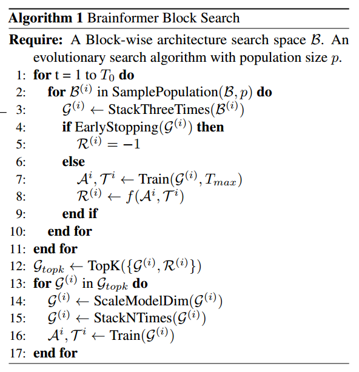

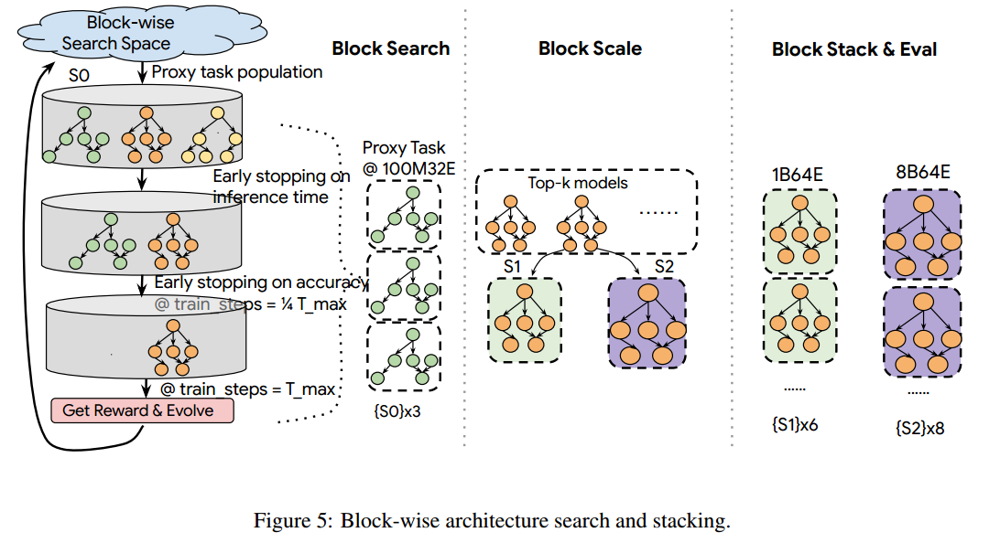

## Fair Comparisons Across Model Architectures

Prior NLP model scaling studies (Raffel et al., 2020; Radford et al., 2018; Brown et al., 2020b; Rae et al., 2021)
typically explore quality scaling with fixed model capacity
and training steps/tokens. For example, a scaling plot typically fixes training steps/tokens while varying the model
parameters. However, when training a model, users typically have a fixed budget and can trade-off training time,
compute resources, and quality to stay within that budget.
If what we care about is computational cost and training convergence time, then comparing model qualities while
fixing total parameters is not fair, particularly when comparing across model architectures and model families. For
example, it may discriminate against models with more total parameters that consume fewer computational FLOPs,
such as sparsely activated models. The GLaM paper (Du
et al., 2022) addresses this by conducting a scaling study on
activated memory (which approximates the computational
cost), rather than the total parameter size, on a fixed number
of training tokens. However, comparing models with a fixed
amount of training tokens may still also not be fair as some
smaller models can benefit more from additional training
data and outperform a bigger model with the same total
training cost (e.g. GPU hours, TPU hours, etc.). The Chinchilla paper (Hoffmann et al., 2022) is the first to suggest
compute-efficient scaling, which varies both model capacity
and training tokens at a fixed computational cost. Resonating with compute-efficient model scaling, we further take
model architectural change into consideration during the
search for efficient model architectures with better training
convergence and inference time. More particularly, we compare across models with a fixed training cost and model
inference time, which allows the search algorithm to trade
off between model capacity and training tokens.

## Training Time Constrained Search

We fix the wall clock time for each search trial which encourages models with faster training convergence being
discovered. The objective is to find model architectures that
yield higher accuracy with a fixed training budget (number
of chips times training hours). 

在进化搜索中，控制器将eq.(2)中的预训练验证交叉熵损失最小化，同时满足eq.(5)中的推理时间约束。每个试验都使用固定的挂钟时间进行训练，以便更快的模型可以通过更多的训练步骤进行补偿。我们的经验发现，在满足推理时间约束的情况下，固定训练时钟时间可以产生更快的训练收敛和更高质量的模型。

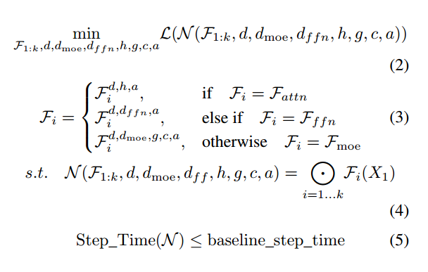

# Token-based Routing Versus Expert-based Routing
虽然现有的MoE文献中有各种路由方法，但我们主要关注两类路由:基于令牌的路由和基于专家的路由，以说明路由策略可以在引入稀疏激活层时改变最佳模型架构的想法

在基于令牌的路由中，模型为每个令牌路由到top-k个专家，而在基于专家的路由中，专家选择top-k个令牌。更具体地说，我们遵循GShard (Lepikhin等人，2021)和GLaM (Du等人，2022)中使用的top-2门控方法,因为top-2比top-1门控表现出更强的经验性能。对于基于专家的门控，我们遵循专家选择门控(Zhou et al .， 2022)，其中通过异构参数分配实现完美的负载平衡。

分数应该沿着令牌维度或专家维度进行规范化。

为了避免解码模式中的因果泄漏，我们建议对基于令牌的路由和基于专家的路由都沿着专家维度进行规范化。

# Evaluation

With a similar number of activated
parameters as a 0.1B dense model, 0.1B/32E represents the
sparse model with every other transformer layer replaced by
a 32-expert MoE layer. While nparams is the total number
of trainable parameters, nact−params represents the number
of activated parameters per token. nact−params roughly approximates the computational expensive of a model. L is the
total number of Transformer layers, M is the model dimension, H is the hidden dimension after the projection in each
transformer layer, nheads is the number of attention heads,
and dhead is the hidden dimension of each attention head.

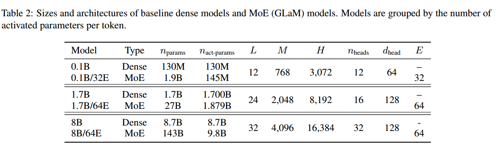

Brainformer-1和Brainformer-2是两个被选中的最佳模型。由于计算资源有限，我们只能将Brainformer-1扩展到1B和8B。

我们在训练过程中不使用任何dropout，因为训练语料库足够大，每个样本只遇到一次。

我们主要关注两种类型的下游评估:1)从GLUE和SuperGLUE基准测试中选择的11个分类任务的微调性能(Wang et al .， 2018;2019)。2)我们用五个语言生成任务来评估一次性的表现，重点是问题的回答。

## Training Convergence

In this section, we evaluate Brainformer top models with
related baselines including 1) Top-2 gating based model architecture search (Search-w-Top2) and 2) GLaM (Du et al.,
2022), a manually crafted architecture with fixed top-2 gating. Providing the flexibility of tuning the gating function
and network architecture significantly improves pre-training
efficiency. As shown in table 3, our searched best Brainformer models outperform the baselines in terms of computational cost (activated parameters), training step time
(steps/sec), and training perplexity (PPLX) for fixed training steps. When scaled to 8B64E, Brainformer converges
to lower perplexity and is more than 5x faster in step time
and 2x faster in training convergence using the same hardware configuration (512 Cloud TPU-V4 chips). With a fixed
600B training tokens, Brainformer is much more accurate
than the baselines at 8B scale.

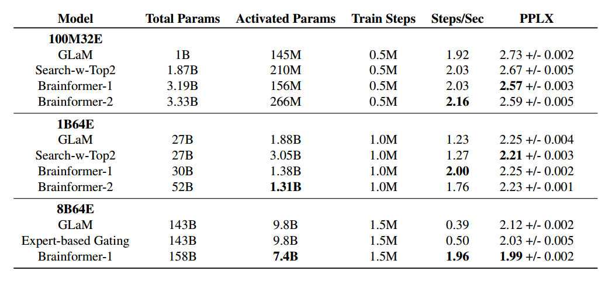

## Finetuning Results

We pretrain the models for a total fixed wall clock time as
the baseline GLaM model. We then finetune the models with
eleven selected GLUE and SuperGLUE classification tasks.
At two different scales, 100M64E and 1B64E, Brainformers outperform the baseline GLaM model by a significant
margin of 2-4% average score. The fine-tuning results in
table 4 indicates that Brainformer not only excels at training
convergence but also generalizes well to downstream tasks.

## Fewshot Results

Aligned with prior work in fewshot in-context learning, we
compare Brainformer oneshot performance on five selected
generative tasks in table 5: Natural Questions (Kwiatkowski
et al., 2019), TriviaQA (Joshi et al., 2017), Web Questions (Berant et al., 2013), Squadv2 (Rajpurkar et al., 2018),
and Lambada (Paperno et al., 2016), with a sparse model
GLaM and a dense model Primer (So et al., 2021) of similar
activated memory size. Brainformer outperforms Primer
and GLaM by a large margin on all the tasks except Nqs
being slightly worse than GLaM. GLaM yields competitive
scores while being 2x slower than Brainformer.

# Discussion

图9提供了Brainformer架构块的可视化。与只有一个注意层和一个密集前馈层的传统变压器块不同，Brainformer块包含8个子层。Brianformer块重复3次，6times, and 8 times respectively in the 100M, 1B, and 8B
scale. 

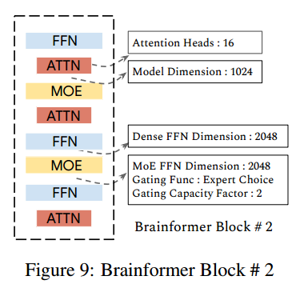

在普通变压器模型中，密集FFN层的优化扩展比为4，这导致隐藏维度比模型维度宽4倍。在优化的Brainformer块1和块2中，搜索算法选择了略大的模型维度1024(与768相比)，在密集的ffn和MoE层中选择了较小的扩展因子(与3072相比)。这是一个合理的优化，因为MoE层有效地扩大了拥有更多专家的网络。在MoE层中，搜索算法在Brainformer区块1中选择容量因子为1的专家选择门函数(Zhou et al, 2022)，从而形成一个非常稀疏的网络，其中每个令牌平均可以路由给单个专家。 Being much faster in
step time, block 1 takes more training steps, thus training
data to achieve good quality. Therefore, we also picked
another strong candidate, Brainformer block 2, in which a
larger capacity factor in the MoE layers is selected. Block 2
is lightly slower in step time, but takes fewer training steps
to get good accuracy, thus is more data efficient.

一个非常自然的问题是，我们是否可以简化架构块。在探索这个问题的答案时，我们能够推断出一些模式。我们发现不同层类型的比例对模型质量至关重要:用不同的层替换一层会导致质量下降。然而，网络对层顺序相对不敏感，因此交换任何两层都不会对性能产生太大影响。为了创建一个简化的图案，我们可以将密集的ffn和MoE层交织在一起，或者简单地创建相同类型的连续层。

# Conclusion

它由不同的层序列组成，包括一个稀疏门通的前馈层。除了新的块，我们还建议使用固定的训练时间搜索进行评估，这可以在模型家族之间进行公平的比较。与GLaM相比，Brainformer的训练收敛速度提高了2倍，步长时间提高了5倍。在下游任务评估中，与GLaM相比，Brainformer在微调后的SuperGLUE得分也高出3%，并且在5个生成任务的一次性评估中大大优于Primer。

分解矩阵乘法

搜索网络架构

# Limitations

另一个限制可能是大量的资源消耗。在Brainformer搜索中，我们使用512 TPU v4一个星期来找到最佳解决方案。
