# Abstract

在深度学习中，模型通常为所有输入重用相同的参数。混合专家(MoE)模型无视这一点，而是为每个传入的示例选择不同的参数。其结果是一个稀疏激活的模型，具有惊人数量的参数，但计算成本不变。尽管MoE取得了一些显著的成功，但由于复杂性、沟通成本和培训不稳定，广泛采用受到了阻碍。我们通过介绍开关变压器来解决这些问题。我们简化了MoE路由算法，设计了直观的改进模型，减少了通信和计算成本。我们提出的训练技术减轻了不稳定性，并且我们首次展示了可以用较低精度(bfloat16)格式训练大型稀疏模型。我们设计了基于T5-Base和T5-Large的模型(rafael等人，2019)，以在相同的计算资源下获得高达7倍的预训练速度提高。（模型更大，时间变短？）最后，我们通过在“Colossal Clean crawl Corpus”上预训练多达万亿参数模型来推进当前语言模型的规模，并实现了比T5-XXL模型快4倍的速度

# Introduction

大规模训练是实现灵活而强大的神经语言模型的有效途径(Radford等人，2018;Kaplan et al, 2020;Brown et al, 2020)。简单的架构由大量的计算预算、数据集大小和参数数量支持，超过了更复杂的算法(Sutton, 2019)。（不需要很复杂的模型设计，变大就行）扩大了密集激活变压器的模型尺寸(Vaswani等人，2017)。虽然有效，但它的计算量也非常大(Strubell et al, 2019)。受模型规模成功的启发，但寻求更高的计算效率，我们提出了一个稀疏激活的专家模型。在我们的例子中，稀疏性来自于为每个输入的示例激活神经网络权重的子集。

机器学习库和硬件加速器仍然迎合密集矩阵乘法。为了获得高效的稀疏算法，我们从混合专家(MoE)范式开始(Jacobs et al, 1991;Jordan and Jacobs, 1994;Shazeer et al, 2017)，并将其简化以获得训练稳定性和计算效益。MoE模型在机器翻译方面取得了显著的成功(Shazeer等人，2017,2018;Lepikhin等人，2020)，然而，广泛采用受到复杂性，沟通成本和培训不稳定性的阻碍。

我们解决这些问题，然后超越翻译，发现这类算法在自然语言中具有广泛的价值。We measure superior scaling on a
diverse set of natural language tasks and across three regimes in NLP: pre-training, finetuning and multi-task training.Switch Transformer架构不仅在超级计算机领域表现出色，而且即使只有少数计算核心也是有益的。此外，我们的大型稀疏模型可以被提炼(Hinton等人，2015)成小的密集版本，同时保留30%的稀疏模型质量增益。

开关变压器架构，简化和改进了混合专家。

Scaling properties and a benchmark against the strongly tuned T5 model where we measure 7x+ pre-training speedups while still using the same FLOPS
per token. We further show the improvements hold even with limited computational
resources, using as few as two experts.

成功地将稀疏的预训练模型和专门的微调模型蒸馏成小的密集模型。我们将模型大小减少了99%，同时保留了大型稀疏教师的30%的质量增益。

改进的预训练和微调技术:(1)选择性精确训练，使训练具有较低的bfloat16精度;(2)初始化方案，允许扩展到更多的专家;(3)增加专家正则化，改进稀疏模型微调和多任务训练。

所有101种语言都有普遍的改进，91%的语言从mT5基线的4倍以上的加速中受益

通过有效地结合数据、模型和专家并行性来创建具有多达一万亿参数的模型，从而增加了神经语言模型的规模。这些模型将强调优的T5-XXL基线的预训练速度提高了4倍。

# Switch Transformer

开关变压器的指导设计原则是以一种简单且计算效率高的方式最大化变压器模型的参数计数(Vaswani等人，2017)。

Kaplan等人(2020)对规模的效益进行了详尽的研究，发现了模型大小、数据集大小和计算预算的幂律尺度。重要的是，这项工作提倡在相对少量的数据上训练大型模型，作为计算上的最佳方法。根据这些结果，我们研究了第四个轴:增加参数计数，同时保持每个示例的浮点操作(FLOPs)恒定。我们的假设是，参数计数独立于执行的总计算量，是一个单独的重要轴，可以在其上进行缩放。我们通过设计一个稀疏激活的模型来实现这一点，该模型有效地使用了为密集矩阵乘法(如gpu和tpu)设计的硬件。在我们的分布式训练设置中，我们的稀疏激活层在不同的设备上分割唯一的权重。因此，模型的权重随着设备数量的增加而增加，同时在每个设备上保持可管理的内存和计算占用

##  Simplifying Sparse Routing

Shazeer et al. (2017) proposed a natural language Mixtureof-Experts (MoE) layer which takes as an input a token representation x and then routes
this to the best determined top-k experts, selected from a set $\{E_i(x)\}^N_{i=1}$ of N experts. The router variable Wr produces logits h(x) = Wr · x which are normalized via a softmax
distribution over the available N experts at that layer.如果T是选定的top-k个指标的集合，则该层的输出计算是每个专家对令牌的计算与门值的线性加权组合.

Shazeer et al. (2017) conjectured that routing to k > 1 experts was necessary in order to have non-trivial gradients to
the routing functions. The authors intuited that learning to route would not work without
the ability to compare at least two experts. Ramachandran and Le (2018) went further to
study the top-k decision and found that higher k-values in lower layers in the model were
important for models with many routing layers. (低层的k要大？)与这些想法相反，我们使用一种简化的策略，只向一位专家咨询。我们证明这种简化保留了模型质量，减少了路由计算，性能更好。这种k = 1的路由策略后来被称为交换层。Note that for both MoE and Switch
Routing, the gate value pi(x) in Equation 2 permits differentiability of the router.

交换机层的好处有三方面:(1)减少了路由器的计算，因为我们只将令牌路由给单个专家。(2)每个专家的批处理大小(专家容量)可以至少减半，因为每个令牌只被路由给单个专家。(3)简化了路由实现，降低了通信成本。

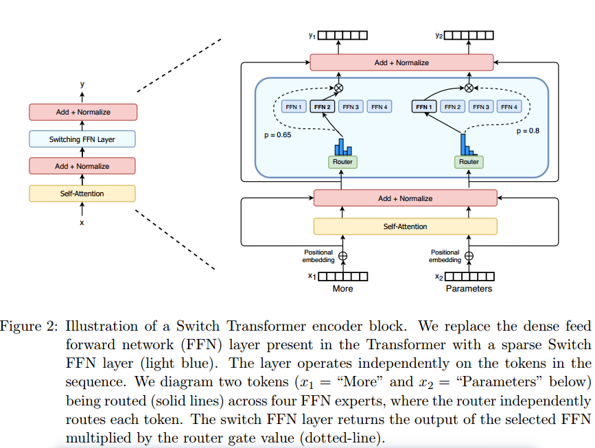

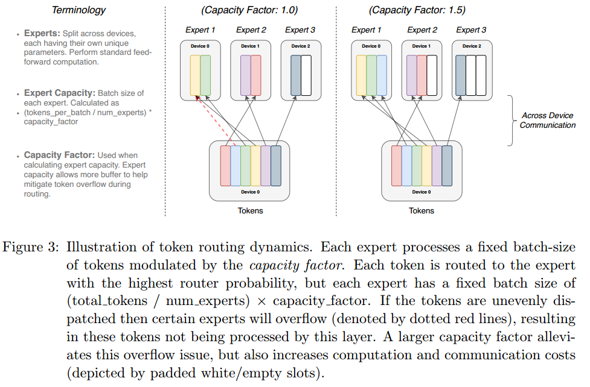

(为什么要pad?，communication怎么有影响)

##  Efficient Sparse Routing

我们使用Mesh-Tensorflow (MTF) (Shazeer等人，2018)，这是一个库，具有与Tensorflow (Abadi等人，2016)相似的语义和API，可促进高效的分布式数据和模型并行架构。它通过将物理核心集抽象为处理器的逻辑网格来实现这一点。张量和计算可以按照命名的维度进行分片，方便跨维度划分模型。

我们所有的张量形状都是在编译时静态确定的，但是由于在训练和推理时的路由决策，我们的计算是动态的。因此，一个重要的技术考虑是如何设置专家能力。The expert capacity---the number of tokens each expert computes---is
set by evenly dividing the number of tokens in the batch across the number of experts, and
then further expanding by a capacity factor.容量系数大于1.0会创建额外的缓冲区，以适应令牌在专家之间没有完美平衡的情况。然而，增加专家容量并非没有缺点，因为较高的值将导致浪费计算和内存。(内存能理解，计算为什么？本来是丢掉的，现在要计算了？)根据经验，我们发现确保较低的token掉落率对于稀疏专家模型的缩放很重要。Throughout our experiments we didn’t notice any dependency on the number of experts
for the number of tokens dropped (typically < 1%). （专家数量不影响掉率） Using the auxiliary load balancing loss
(next section) with a high enough coefficient ensured good load balancing. We study the
impact that these design decisions have on model quality and speed in Table 1.

为了鼓励专家之间的平衡负载，我们添加了辅助损失。Switch Transformers simplifies the original design in
Shazeer et al. (2017) which had separate load-balancing and importance-weighting losses.对于每个Switch层，这个辅助损失被添加到训练期间的总模型损失中。Given N experts indexed by i = 1 to N and a batch B with T tokens, the auxiliary loss is
computed as the scaled dot-product between vectors f (一个batch计算几个token)and P(一个batch所有token的概率之和)

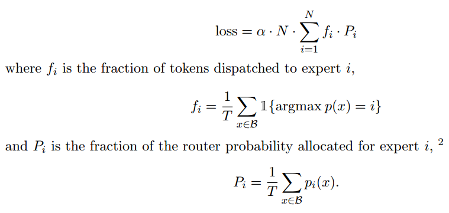

Since we seek uniform routing of the batch of tokens across the N experts, we desire both vectors to have values of 1/N.方程4的辅助损耗在均匀分布下最小，因此有利于均匀路由。The objective can also be differentiated as
the P-vector is differentiable, but the f-vector is not. The final loss is multiplied by expert
count N to keep the loss constant as the number of experts varies since under uniform
routing $\sum_{i=1}^N(fi· Pi) = \sum^N_{i=1}(1/N·1/N) = 1/N$. 我们使用α = 10−2，它足够大以确保负载平衡，同时足够小以不压倒主要交叉熵目标。我们扫描了从10−1到10−5的超参数范围，在不干扰训练损失的情况下快速找到了10−2平衡负载。

## Putting It All Together: The Switch Transformer

我们对Switch Transformer的第一次测试从“\Colossal Clean crawl Corpus”(C4)的预训练开始.我们使用屏蔽语言建模任务(Taylor, 1953;Fedus等人，2018;Devlin等人，2018)，其中模型被训练以预测缺失的令牌。. In our pre-training setting, as
determined in Raffel et al. (2019) to be optimal, we drop out 15% of tokens and then replace
the masked sequence with a single sentinel token. 

Our Switch Transformer model is FLOP-matched to ‘T5-Base’ (Raffel
et al., 2019) (same amount of computation per token is applied). The MoE Transformer,
using top-2 routing, has two experts which each apply a separate FFN to each token and
thus its FLOPS are larger.(计算量是两倍) Note that the MoE model going from capacity factor 2.0 to 1.25 actually slows
down (840 to 790) in the above experiment setup, which is unexpected.

We highlight three key findings from Table 1: (1) Switch Transformers outperform both carefully tuned dense models and MoE Transformers on a speed-quality basis. For a fixed amount of computation and wall-clock time, Switch Transformers achieve the best result. (2) The Switch Transformer has a smaller computational footprint than the MoE
counterpart. If we increase its size to match the training speed of the MoE Transformer, we find this outperforms all MoE and Dense models on a per step basis as well. (3) Switch Transformers perform better at lower capacity factors (1.0, 1.25). Smaller expert capacities are indicative of the scenario in the large model regime where model memory is very scarce
and the capacity factor will want to be made as small as possible.（为什么好？）

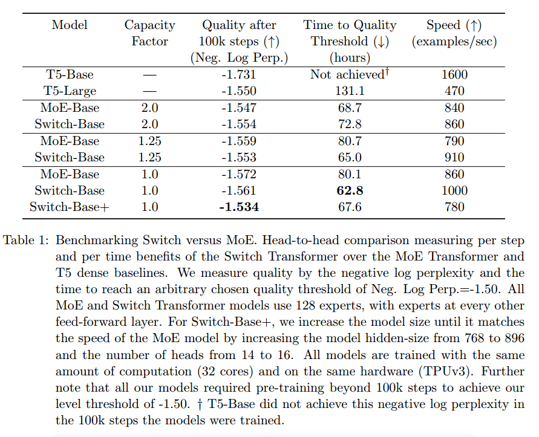

## Improved Training and Fine-Tuning Techniques

稀疏专家模型可能会在普通Transformer上引入训练困难。每一层的硬交换(路由)决策都可能导致不稳定。此外，像bfloat16这样的低精度格式(Wang和Kanwar, 2019)会加剧路由器的softmax计算问题。

模型不稳定性阻碍了使用有效的bfloat16精度进行训练的能力，因此，Lepikhin等人(2020)在其MoE Transformer中以float32精度进行训练。然而，我们表明，通过在模型的局部部分中选择性地转换为float32精度，可以实现稳定性，而不会产生昂贵的float32张量的通信成本。 This technique
is inline with modern mixed precision training strategies where certain parts of the model
and gradient updates are done in higher precision Micikevicius et al. (2017).我们的方法允许与bfloat16训练几乎相同的速度，同时赋予float32的训练稳定性。

To achieve this, we cast the router input to float32 precision. The router function takes
the tokens as input and produces the dispatch and combine tensors used for the selection and
recombination of expert computation. Importantly, the float32 precision is only used within the body of the router function---on
computations local to that device. Because the resulting dispatch and combine tensors
are recast to bfloat16 precision at the end of the function, no expensive float32 tensors
are broadcast through all-to-all communication operations, but we still benefit from the
increased stability of float32.

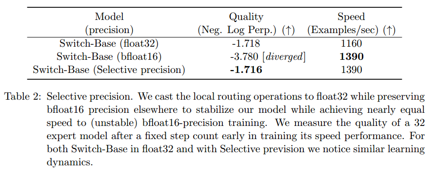

适当的初始化对于深度学习的成功训练至关重要，我们特别注意到对于Switch Transformer来说是如此。We initialize our weight matrices by drawing elements from a truncated
normal distribution with mean µ = 0 and standard deviation σ =
$\sqrt{s/n}$ where s is a scale
hyper-parameter and n is the number of input units in the weight tensor (e.g. fan-in).Values greater than two standard deviations from the mean are resampled. As an additional remedy to the instability, we recommend reducing the default Transformer initialization scale s = 1:0 by a factor of 10. 

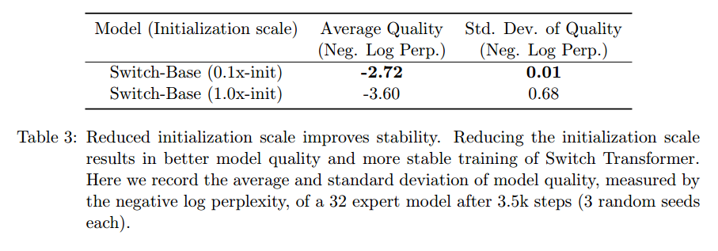

我们的论文考虑了常见的NLP方法，即在大型语料库上进行预训练，然后对较小的下游任务(如摘要或问答)进行微调。一个自然出现的问题是过度拟合，因为许多微调任务只有很少的例子。在标准变压器的微调过程中，rafael等人(2019)在每一层使用dropout (Srivastava等人，2014)来防止过拟合。我们的开关变压器具有比FLOP匹配的密集基线更多的参数，这可能导致这些较小的下游任务更严重的过拟合

我们提出了一个简单的方法来缓解这个问题在微调过程中:增加专家内部的退出，我们称之为专家退出。During fine-tuning we simply
increase the dropout rate by a significant amount only at the interim feed-forward computation at each expert layer. 

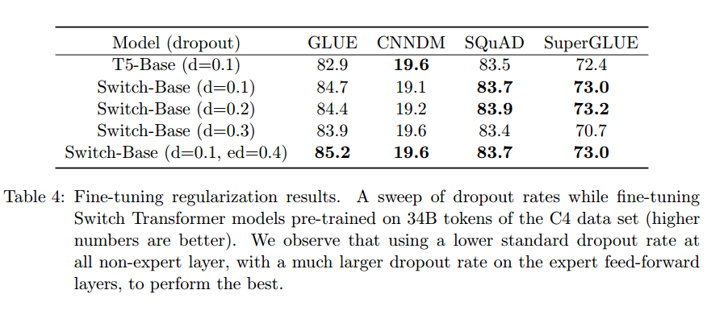

简单地增加所有层的dropout会导致更差的性能。然而，在非专家层设置较小的失分率(0.1)，在专家层设置更大的失分率(0.4)，可以在四个较小的下游任务上提高性能。

#  Scaling Properties

we consider a regime where the model is not
bottlenecked by either the computational budget or amount of data. To avoid the data
bottleneck, we use the large C4 corpus with over 180B target tokens (Raffel et al., 2019)
and we train until diminishing returns are observed.

专家的数量是缩放模型最有效的维度。增加专家数量可以保持计算成本大致固定，因为模型每个令牌只选择一个专家，而不管要选择的专家有多少。 The router
must compute a probability distribution over more experts, however, this is a lightweight
computation of cost O($d_{model}$ × num experts) where dmodel is the embedding dimension of
tokens passed between the layers.(没有batch?)In this section, we consider the scaling properties on a
step-basis and a time-basis with a fixed computational budget.

## Scaling Results on a Step-Basis

图4展示了在训练所有模型的固定步数时，专家数量所带来的一致的扩展效益。我们观察到一个明显的趋势:当保持每个令牌的FLOPS固定时，拥有更多的参数(专家)可以加快训练速度。This reveals the advantage of scaling along this additional axis of sparse model parameters.我们的右图测量了密集模型变体和四个flop匹配的稀疏变体的样本效率。专家数量的增加会导致样本效率更高的模型。在步长时间方面加快了7.5倍。we find that larger models are also more sample efficient---learning more quickly
for a fixed number of observed tokens.

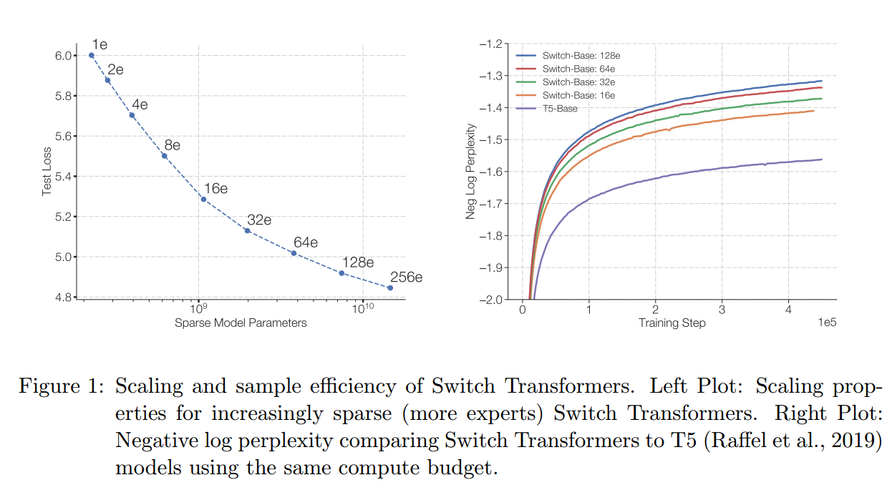

## Scaling Results on a Time-Basis

图4展示了在一个步骤的基础上，随着专家数量的增加，性能不断提高。虽然我们的模型每个令牌的FLOPS数量与基线大致相同，但我们的Switch transformer会在设备之间产生额外的通信成本以及路由机制的额外计算。因此，在步进基础上观察到的增加的样本效率并不一定转化为通过wall-clock测量的更好的模型质量。对于固定的训练时间和计算预算，应该训练密集模型还是稀疏模型?

图5测量了作为时间函数的预训练模型质量。对于固定的训练时间和计算预算，开关变压器产生实质性的加速。在这种情况下，我们的Switch-Base 64专家模型只需要T5-Base七分之一的时间就能得到类似的困惑。

##  Scaling Versus a Larger Dense Model

以上分析表明，计算匹配的密集模型被Switch对应的模型所超越。

But despite T5-Large applying 3.5x more FLOPs per token,
Switch-Base is still more sample efficient and yields a 2.5x speedup. 

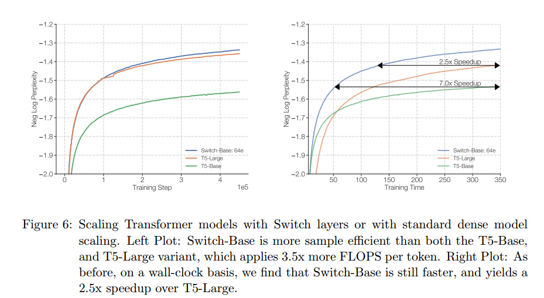

# Downstream Results

第3节演示了预训练时优越的缩放特性，但我们现在验证了这些增益转化为下游任务中提高的语言学习能力。

通过将稀疏模型提炼成小而容易部署的密集基线，我们的内存占用减少了90%以上。

## Fine-Tuning

我们的基线是高度调优的223M参数t5基础模型和739M参数t5大模型(Raffel et al, 2019)。对于这两个版本，我们设计了一个flop匹配的开关变压器，具有更多的参数，如表9所示。微调的结果。我们观察到许多自然语言任务的显著下游改进。

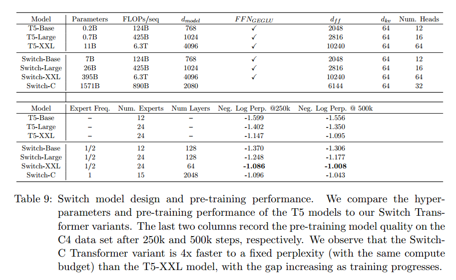

##  Distillation

部署具有数十亿或数万亿个参数的大规模神经网络是不方便的。为了缓解这一问题，我们研究了将(Hinton et al .， 2015)大型稀疏模型提取为小型密集模型。

我们发现用非专家权值初始化密集模型可以得到适度的改进。这是可能的，因为所有模型都是FLOP匹配的，所以非专家层将具有相同的维度。Since expert layers are usually only added at every or every other FFN layer in a Transformer, this allows for many of the weights to be
initialized with trained parameters. we observe a distillation improvement
using a mixture of 0.25 for the teacher probabilities and 0.75 for the ground truth label. By
combining both techniques we preserve ≈ 30% of the quality gains from the larger sparse
models with only ≈ 1/20th of the parameters.质量增益是指Switch-Base (Teacher)和T5-Base (Student)之间质量差异的百分比。因此，一个100%的质量增益意味着学生等于教师的表现。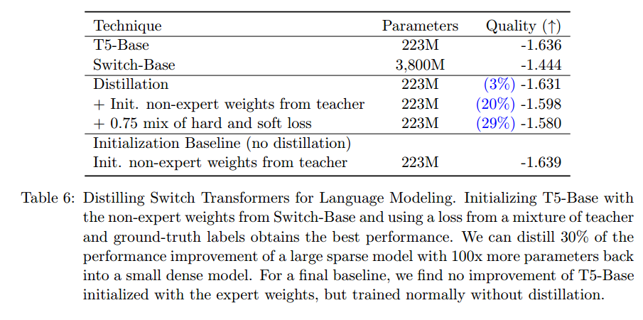

在极端情况下，我们将模型压缩了99%，我们仍然能够保持28%的教师模型质量改进。

##  Multilingual Learning

在图7中，我们绘制了一个flop匹配开关模型，从mSwitch-Base到T5 base变体mT5-Base的所有语言的负对数perplexity的质量改进图。在对这两个版本进行了1M步的预训练之后，我们发现在考虑的所有101种语言中，Switch Transformer在基线上增加了最终的负对数困惑度。

We find a mean speed-up over mT5-Base of 5x and that 91% of languages achieve at least a 4x speedup. 

# Designing Models with Data, Model, and Expert-Parallelism

任意增加专家的数量会导致收益递减(图4)。Here we describe complementary scaling strategies. The common way to scale a Transformer
is to increase dimensions in tandem, like dmodel or df f . This increases both the parameters
and computation performed and is ultimately limited by the memory per accelerator.一旦超过加速器内存的大小，就可以使用单程序多数据(SPMD)模型并行性。

我们使用FFN层作为数据、模型和专家并行在Mesh TensorFlow中如何工作的例子(Shazeer等人，2018)，并在这里简要回顾一下。 We assume B tokens in the batch, each of dimension
dmodel. Both the input (x) and output (y) of the FFN are of size [B, dmodel] and the intermediate (h) is of size [B, df f ] where df f is typically several times larger than dmodel. In the
FFN, the intermediate is h = xWin and then the output of the layer is y = ReLU(h)Wout.
Thus Win and Wout are applied independently to each token and have sizes [dmodel, df f ] and [df f , dmodel].

我们描述了分区的两个方面:权重和数据批次如何在核上划分，如图9所示。我们将所有可用的内核表示为N, Mesh Tensorflow可以将其重新映射到处理器的逻辑多维网格中。 Here we create a
two-dimensional logical mesh, with one dimension representing the number of ways for data-parallel sharding (n) and the other, the model-parallel sharding (m).The total cores must equal the ways to shard across both data and model-parallelism, e.g. N = n × m.To shard the layer across cores, the tensors containing that batch of B tokens are sharded across n data-parallel cores, so each core contains B/n tokens. Tensors and variables with df f are then sharded across m model-parallel cores.(切分Win列和Wout行)For the variants with experts-layers, we consider E experts, each of which can process up to C tokens.

当训练数据并行模型时，这是分布式训练的标准，那么所有的核被分配到数据并行维度或n = N;M = 1。这样做的好处是，在整个向前和向后传递完成之前不需要通信，然后需要跨所有核心聚合梯度。这对应于图9最左边的列。

我们现在考虑这样一种场景:所有核心都被专门分配给模型并行维，因此n = 1;m = N.现在所有核必须保留完整的B令牌，每个核将包含一个唯一的权重切片。对于每一次向前和向后传递，现在都产生了通信成本。(x\[win1,win2\]\[wout1;wout2\]\=\[xwin1,xwin2\]\[wout1;wout2\]=[xwin1wout1]+[xwin2wout2]=[B,dmodel])Each core sends a tensor of [B, dmodel] to compute the
second matrix multiplication ReLU(h)Wout because the df f dimension is partitioned and
must be summed over.(算完两次乘法后要all-reduce)As a general rule, whenever a dimension that is partitioned across
cores must be summed, then an all-reduce operation is added for both the forward and
backward pass. This contrasts with pure data parallelism where an all-reduce only occurs
at the end of the entire forward and backward pass.(多了一次all-reduce，一个传数据，一个传参数)

With a total of N = n × m cores, now each core will be responsible for B/n tokens
and df f /m of both the weights and intermediate activation. In the forward and backward
pass each core communicates a tensor of size [B/n, dmodel] in an all-reduce operation.

(一个方块是一个整体)

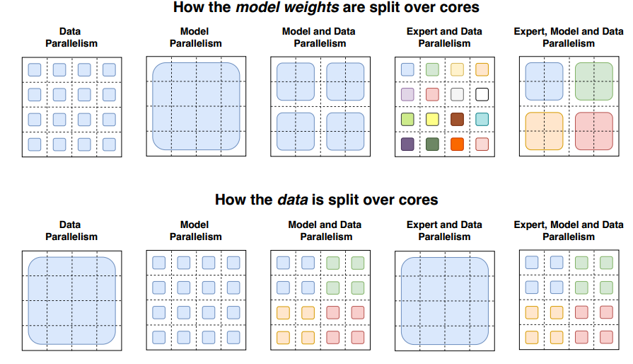

Switch Transformers will allocate all of their cores to the data partitioning dimension n, which will also
correspond to the number of experts in the model.For each token per core a router locally
computes assignments to the experts. (router结果）The output is a binary matrix of size [n, B/n, E, C] which is partitioned across the first dimension and determines expert assignment.([1,b,E,C])  This
binary matrix is then used to do a gather via matrix multiplication with the input tensor
of [n, B/n, dmodel].

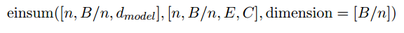

resulting in the final tensor of shape [n, E, C, dmodel], which is sharded across the first
dimension.([1,E,C,dmodel]) Because each core has its own expert, we do an all-to-all communication of
size [E, C, dmodel] to now shard the E dimension instead of the n-dimension. ([n,E,C,dmodel]=[E,n,C,dmodel]) There are
additional communication costs of bfloat16 tensors of size E×C ×dmodel in the forward pass
to analogusly receive the tokens from each expert located on different cores. See Appendix F
for a detailed analysis of the expert partitioning code.

(router输入[n,B/n,dmodel]

Wr=[dmodel,E]

L=[n,B/n,E]

pr=softmax(L,axis=-1)

gate,index=top1(pr)=[n,B/n]

mask=onehot(index)=[n,B/n,E]

auxloss(pr,mask)

pos=cumsum(mask,dim=B/n)*mask=[n,B/n,E]

[[[0,1,0],[0,1,0],[0,1,0]],...]=[[[0,1,0],[0,2,0],[0,3,0]],...]

mask*=less(pos,cap)//cap=2

[[[0,1,0],[0,2,0],[0,3,0]],...]=[[[1,1,1],[1,0,1],[1,0,1]],...]=[[[0,1,0],[0,0,0],[0,0,0]],...](不应该是小于等于吗？)

maskflat=reducesum(mask,dim=E)=[n,B/n]

gate*=maskflat

combine=gate*maskflat\*onehot(index,dim=E)\*onehot(pos,dim=C)=[n,B/n,E,C] (专家第几个位置的权重)

dispatch=cast(combine，bool)

input=einsum(input,dispatch)

[n,B/n,E,C,dmodel]=[n,E,C,dmodel]=[E,n,C,dmodel]

output=forward(input)=[E,n,C,dmodel]

=[E,n,C,dmodel]

outcom=einsum(output,combine)

)

 When we scale the number of experts, we increase the number of parameters, but do
not change the FLOPs per token. In order to increase FLOPs, we must also increase the df f
dimension (which also increases parameters, but at a slower rate). This presents a trade-off:
as we increase df f we will run out of memory per core, which then necessitates increasing
m.But since we have a fixed number of cores N, and N = n × m, we must decrease n,
which forces use of a smaller batch-size (in order to hold tokens per core constant).(expert的batch不变，总batch减少)

When combining both model and expert-parallelism, we will have all-to-all communication costs from routing the tokens to the correct experts along with the internal all-reduce
communications from the model parallelism. 当结合这三种方法时，平衡FLOPS、通信成本和每核内存变得相当复杂，因为最佳映射是由经验决定的。

Switch-C模型的设计仅使用专家并行性，而不使用模型并行性.Switch-XXL与T5-XXL模型是flop匹配的，它允许更大的超参数尺寸，但以模型并行性引起的额外通信成本为代价(详细信息请参阅5.5节)。

经过250k步后，我们发现两个Switch Transformer变体都比T5-XXL版本有所改进.随着额外的训练，差距继续扩大，Switch-XXL模型的性能比T5-XXL高出0.087，相差50万步。

正如在引言中所描述的，大型稀疏模型可能是不稳定的，并且随着规模的增加，我们会遇到一些零星的问题。我们发现更大的Switch-C模型具有1.6T参数和2048名专家，完全没有训练不稳定性。相反，Switch XXL版本，每个序列有近10倍大的FLOPs，有时是不稳定的。

推理微调性能。作为对模型质量的初步评估，我们使用了一个Switch-XXL模型，该模型在503B令牌上进行了部分预训练，大约是T5-XXL模型使用的一半文本。使用这个检查点，我们进行多任务训练以提高效率，其中所有任务都是联合学习的，而不是单独微调的。在上游预训练任务中，其收益尚未完全转化为SOTA下游性能。

综上所述，尽管我们训练的数据还不到其他模型的一半，但我们已经发现了与之相当的、有时甚至是最先进的模型质量。目前，Switch Transformer将大量上游收益更好地转化为基于知识的任务，而不是推理任务(见附录E)。从大型专家模型中提取更强的微调性能是一个活跃的研究问题，预训练困惑表明未来的改进应该是可能的。

# Related Work

Mesh Tensorflow库(Shazeer等人，2018)将MoE层重新引入Transformer架构中，其中MoE层被引入作为FFN层的替代品

# Discussion

Isn’t Switch Transformer better due to sheer parameter count? Yes,我们的模型在使用相同的计算资源的情况下，样本效率更高，速度更快

虽然这项工作主要集中在非常大的模型上，但我们也发现只有两个专家的模型可以提高性能，同时很容易适应常用gpu或tpu的内存限制(详见附录D)。因此，我们相信我们的技术在小规模设置中是有用的。

在各种不同的模型大小中，稀疏模型在每一步和时间上都优于密集模型。我们的控制实验表明，在固定的计算量和时间下，稀疏模型优于密集模型。

通过将我们的稀疏模型提炼成密集模型，可以实现10到100倍的压缩率，同时获得专家模型质量增益的约30%。

为什么使用开关变压器而不是模型并行密集模型?在时间基础上，Switch transformer可以比具有分片参数的密集模型更高效(图6)。此外，我们指出这个决策不是互斥的:我们可以并且确实在Switch transformer中使用模型并行性，增加每个令牌的FLOPs，但会导致传统模型并行性的减慢。

Why aren’t sparse models widely used already? The motivation to try sparse
models has been stymied by the massive success of scaling dense models (the success of
which is partially driven by co-adaptation with deep learning hardware as argued in Hooker
(2020)).稀疏模型受到多个问题的影响，包括(1)模型复杂性，(2)训练困难，以及(3)通信成本。Switch Transformer在缓解这些问题上取得了长足的进步。

# Future Work

一个重要的挑战是进一步提高最大模型的训练稳定性。

虽然我们的稳定性技术对我们的Switch-Base、Switch-Large和Switch-C模型是有效的(没有观察到不稳定性)，但它们对Switch-XXL来说是不够的。

我们已经采取了早期的措施来稳定这些模型，我们认为这可能对大型模型普遍有用，包括使用正则化器来提高稳定性和适应梯度裁剪的形式，但这仍然没有解决。

通常我们发现，改进的预训练质量会导致更好的下游结果(附录E)，尽管我们有时会遇到惊人的异常情况。1.6T参数Switch-C在SQuAD中只能获得87.7的精确匹配分数，这与较小的Switch-XXL模型的89.6相比是不利的。 One notable difference is that the SwitchXXL model applies ≈10x the FLOPS per token than the Switch-C model, even though
it has ≈4x less unique parameters (395B vs 1.6T). This suggests a poorly understood
dependence between fine-tuning quality, FLOPS per token and number of parameters.

我们的工作属于自适应计算算法的范畴。我们的方法总是使用相同的、同质的专家，但是未来的设计(由更灵活的基础设施促进)可以支持异构专家。

# Conclusion

并且相对于密集的T5基线实现了实质性的加速。

k=1

# Appendix A. Switch for Attention

但我们在这里简要地探讨另一种设计。我们将Switch层添加到Transformer Self-Attention层中。为此，我们将生成查询、键和值的可训练权重矩阵替换为Switch层，如图10所示。

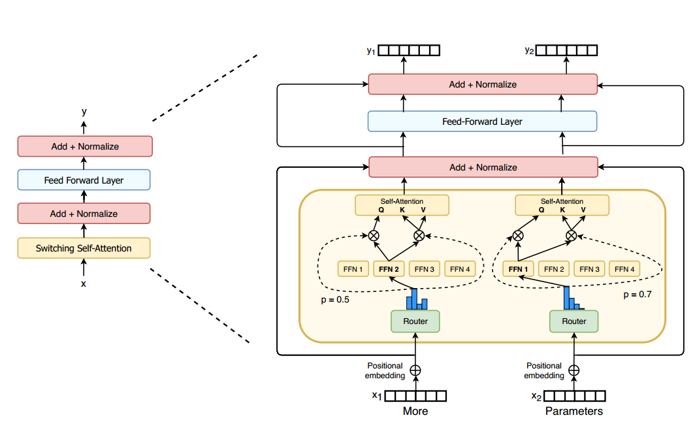

表10记录了固定步数后的质量以及几种变体的训练时间。虽然我们发现了改进，但我们也发现这些层在使用bfloat16精度时更加不稳定，因此我们没有将它们包含在最终的变体中。

# Appendix B. Preventing Token Dropping with No-Token-Left-Behind

由于软件对TPU加速器的限制，我们的张量的形状必须是静态大小的。因此，每个专家都有有限和固定的能力来处理令牌表示。然而，这给我们的模型带来了一个问题，该模型在运行时动态路由令牌，可能导致专家的分布不均匀。If the number of
tokens sent to an expert is less than the expert capacity, then the computation may simply be padded - an inefficient use of the hardware, but mathematically correct. However, when
the number of tokens sent to an expert is larger than its capacity (expert overflow), a protocol is needed to handle this. Lepikhin et al. (2020) adapts a Mixture-of-Expert model and
addresses expert overflow by passing its representation to the next layer without processing
through a residual connection which we also follow.我们怀疑对令牌不应用计算可能是非常浪费的，特别是因为如果一个专家的计算溢出，这意味着另一个专家将拥有额外的容量。凭借这种直觉，我们创建了No-Token-Left-Behind， which iteratively reroutes
any tokens that are at first routed to an expert that is overflowing.

这将使我们能够保证在训练和推理期间几乎不会丢失任何令牌。我们假设这可以提高表现并进一步稳定训练，但我们没有发现经验上的好处。我们怀疑，一旦网络学习了不同令牌和专家之间的关联，如果这种关联被改变(例如向其第二高的专家发送令牌)，那么性能可能会下降。

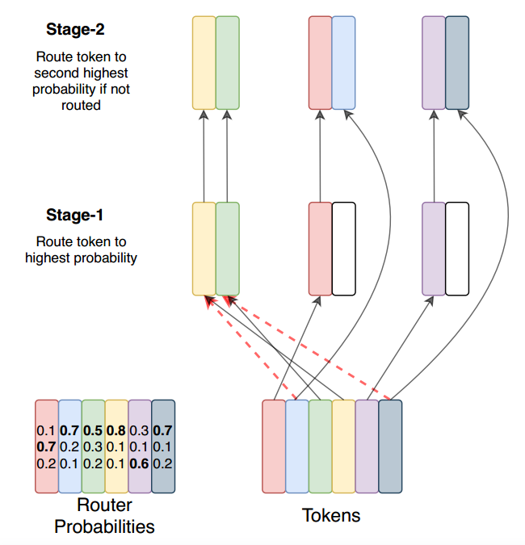

# Appendix C. Encouraging Exploration Across Experts

在每个专家层，路由器决定向哪个专家发送令牌。这是对可用专家的离散决策，取决于有关令牌表示的信息。Based on the incoming token representation, the router determines the
best expert, however, it receives no counterfactual information about how well it would
have done selecting an alternate expert.在强化学习中，出现了一个经典的探索利用困境(Sutton和Barto, 2018)。Deterministically selecting the top expert always amounts to an
exploitative strategy - we consider balancing exploration to seek better expert assignment.To introduce exploration, we consider several approaches: 1) deterministic or argmax 2)
sampling from the softmax distribution 3) input dropout on the incoming representation 4)
multiplicative jitter noise on the incoming representation.在整个工作中，我们使用输入抖动来注入噪声，因为我们发现它在经验上表现最好。

# Appendix D. Switch Transformers in Lower Compute Regimes

Switch Transformer is also an effective architecture at small scales as well as in regimes
with thousands of cores and trillions of parameters. 只有2名专家就能比flop匹配的对应产品产生令人信服的收益。即使超级计算机不容易获得，用2、4或8名专家(我们通常建议每个核心一名专家)训练开关变压器也会比T5密集基线有明显的改进。

# Appendix E. Relation of Upstream to Downstream Model Performance

不能保证模型在预训练目标上的质量将转化为下游任务的结果。我们发现了一致的相关性，表明对于基线和Switch模型，改进的预训练导致更好的下游结果。对于固定的上游困惑，我们发现Switch和dense模型在中小型模型尺寸范围内的表现相似。然而，在最大的模型区(T5-11B/T5-XXL)中，我们最大的Switch模型，如第5.6节所述，并不总是将其上游困惑很好地转化为SuperGLUE任务的下游微调。这需要未来的调查和研究，以充分发挥稀疏模型的潜力。使用专家模型理解微调动态是非常复杂的，并且依赖于正则化、负载平衡和微调超参数。