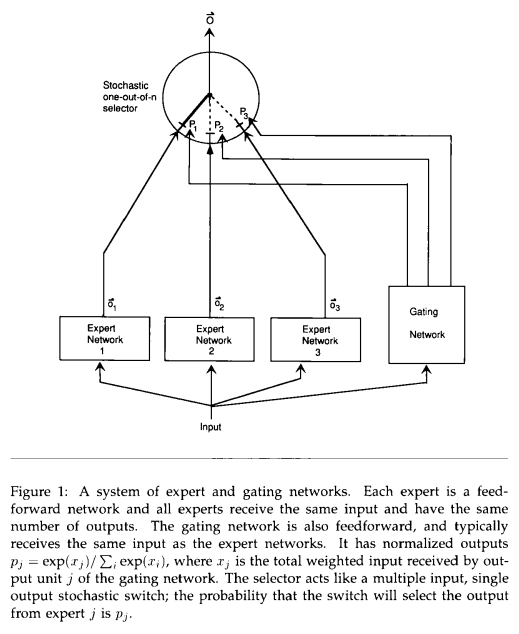
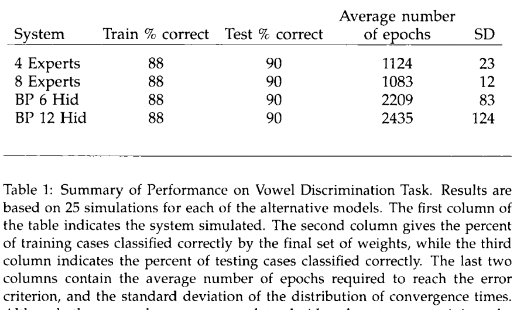

多任务单模型训练慢，泛化性差

多模型独自处理不同数据，独自更新

综合输出再与label比较：合作，使用模型多

每个输出与label比较再综合：竞争，单个模型

选择反向传播网络中隐藏单元的数量，使反向传播网络和混合模型的参数数量大致相等。

专家混合达到误差准则的速度明显快于反向传播网络，平均只需要大约一半的epoch(表1)。混合模型的学习时间随着专家数量的增加也有很好的扩展。相反，12个隐藏单元的反向传播网络比6个隐藏单元的网络需要更多的epoch。

训练快，可扩展