# Abstract

深度神经网络服务在输入、操作和负载等方面表现出多样性。对这些多样性的不认识导致处理效率低下。效率低下的根源在于现有批处理机制的特点:一进一出。抽象出三个元操作:new、stretch和split，用于调整正在进行的查询批，以实现多入口多出口方案。为了将元操作交付给正在进行的批处理，我们将DNN模型分成多个阶段。每个阶段对应一个执行器，执行器由状态转换图管理。减少了46.4%的平均延迟，并实现了高达2.12倍的吞吐量改进。

# Introduction

单个DNN查询通常不能充分利用这些加速器。在给定的批处理时间窗口内到达的查询被组织成一个批处理，DNN服务系统使用一个执行器(进程)一次处理整个批处理。这样的批处理策略在单个推理过程中使用相同的批处理大小(bs)。所有的查询在一个批处理中同时返回。It works great for best-effort applications, and the services when the queries arrive in uniform intervals [22].

发现至少有三种类型的多样性：

输入的多样性。用户查询的输入显示出高度的多样性(例如，在自然语言处理服务中)。短查询都被填充到最长查询的大小以进行批处理。批处理的好处可能会被填充部分的浪费计算所抵消

虽然DNN模型的所有操作符共享相同的批大小，但它们有不同的首选批大小。操作人员的首选批大小是能够充分利用当前GPU的最小批大小。如果操作员的首选批大小大于使用的批大小，则硬件未被充分利用。否则，将不必要地增加处理时间

负载的多样性。服务查询不会以统一的间隔到达。在单个批处理时间窗口中收集的查询数量是不同的。When the load bursts, a previous non-full batch results in the long latency of subsequent queries. In other words, hardware resources are wasted while the queries are waiting in the next batch time window.

短查询可以提前退出，而无需等待整个批处理退出(输入多样性)，批处理可以分成更小的批处理，以执行具有首选较小批处理大小的操作符(操作符多样性)，稍后到达的查询可以加入正在进行但未满的批处理(负载多样性)。

new操作创建一个新批处理，就像传统的批处理策略一样。拉伸操作向正在进行的批处理添加新的查询。拆分操作将一个正在运行的批分解为多个批，这些批可以单独调度。

在相邻的阶段执行器之间添加一个存储批信息的批处理队列，并使用一个全局批处理表来记录每个阶段要执行的元操作(第5节)。当一个执行器完成对一批查询的计算时，它会在批处理表中验证下一阶段要执行的元操作。如果需要拆分或拉伸操作，执行器将在当前批处理上应用相应的元操作，并将新批查询推送到下一阶段的批处理队列中。

DVABatch引入了一个基于状态转换图的解决方案来支持执行器复杂的运行时调度(第6节)。每个执行器有四种状态:活动、检查、工作和非活动。

# Related Work

传统的批处理策略，使用批处理时间窗口和最大允许批大小。他们将DNN模型视为一个不可分割的整体。它们将内部操作符的调度留给了它们所支持的后端。

# Background and Motivation

假设每个操作员在1个时间单位(T)内完成，批大小为4。在这种情况下，一旦接收到4个查询或批处理时间窗口结束，接收到的查询将被批处理并发出以运行。

Input diversity：

短查询的输入被填充到与最长查询的输入相同的大小，以便它们可以批量运行[28]。批处理被分成两个较小的批，一个用于短查询①、②和③，另一个用于长查询④。通过这种方式，查询①、②和③返回更早。two batches may run in parallel before the short batch completes if 4 operators are required to fully utilize the GPU.

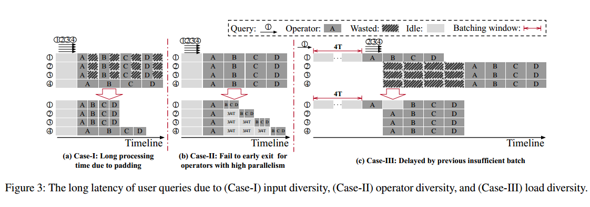

Operator diversity:

the operators often require different batch sizes to fully utilize the GPU. GEMM operators dominate DNNs (occupying 86% of the computation time) GEMM-A和GEMM-B的首选批大小分别为1和8。对于gem - a，批处理只会增加其延迟，而不会提高处理吞吐量。对于gem - b，使用小于8的批处理大小不能充分利用GPU(处理时间不会增加，直到批处理大小大于8)。运营商A倾向于批大小为4，运营商B、C和D倾向于批大小为1。依次运行小批。这样，查询①、②、③返回较早。

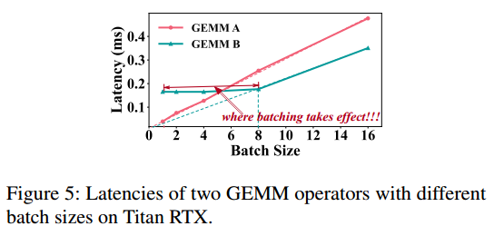

Load diversity：

假设批处理时间窗口为4T，操作人员倾向于批处理大小为4。在当前的批处理策略下(Case-III的上半部分)，查询①在等待4T后开始单独运行，GPU没有被充分利用。在处理查询①的过程中，有三个查询②、③和④到达，但它们必须等待下一批执行。下半部分显示了运行这四个查询的更好方法:第一批(查询①)在第一个操作符a完成后等待第二批。然后，将两个不足的批合并为一个充分利用硬件的新批。

Diversities among DNN services：

在图3中，它们共享批处理机制的三个需求。该机制应该能够中断正在进行的批处理。小批量可以以并行方式(Case- i)或顺序方式(Case- ii)运行。该机制应该能够合并多个不足的批次。

# Design of DVABatch

DVABatch为上层DNN服务系统(如Triton、TF-Serving)提供了多入口多出口的批处理方案。查询能够在阶段开始时加入批处理，并在阶段结束时退出批处理。

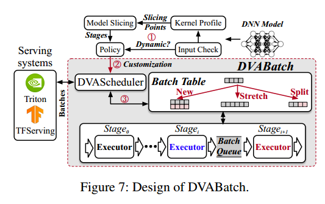

批表记录正在进行的批的运行状态。它支持三种元操作，用于在每个阶段调整批次。

stage执行器是负责相应stage执行的过程。DVABatch利用状态转换图进行执行器管理。

在两个相邻的阶段之间有一个批处理队列，用于传输批处理信息。从其前一个批处理队列中取出批处理进行执行，并将批处理推入下一阶段的批处理队列。

DVABatch检查业务的输入数据模式，并对其进行概要分析，以获得多样性模式。在此基础上，DNN模型被自动分割成多个阶段。为DNN模型生成一个多样性感知策略。

每个阶段执行器加载模型的相应阶段，dvasscheduler使用策略中的调度逻辑对接受的查询进行调度。如果满足dvasscheduler中定义的特定条件，则指示批处理表通过相应的new, stretch, split操作来调整正在进行的批处理。

DVABatch handles input diversity before operator diversity. This is because handling input diversity directly reduces computation while handling operator
diversity better schedules computation

# Enabling Multi-entry Multi-exit Scheme

当新一批查询到达时，它可以中断正在进行的批处理，赶上被中断的批处理的进度，然后合并到单个更大的批处理中。新的传入批还可以通过在不同阶段执行器中与正在进行的批共同运行来加入处理，而不会暂停正在进行的批。(两个批并行？)将批处理分成几个批，并允许它们独立地退出执行。

使用new，新的传入查询被组织到一个新的批处理中。新操作创建的批次可以与之前的批次协同运行（a）

使用stretch，正在进行的批处理将被新的传入查询拉伸。在特定阶段，这些查询被合并到正在进行的批处理中进行处理（c）

使用split，一个正在进行的大批被分成几个小批分别处理。(b)

元操作应该基于各个阶段的执行状态来执行。通常，DVABatch跟踪批处理的阶段状态，并将元操作通知给相应的阶段执行器。

DVABatch使用批处理表来跟踪GPU上所有批处理的处理状态。批处理表由dvasscheduler通过元操作更新。

批处理表中的一行记录正在进行的批处理的状态。在一行中，id是批处理的标识符，bs是当前批处理的大小，time是创建批处理的时间戳，statusmap是一个映射，它记录了批处理的每个阶段中完成的查询的数量。例如，图8(a)中statusmap的第一行表示阶段1在其批处理中完成了2个查询。We need statusmap because
the latter queries of a stretched batch should catch up with the ongoing queries. With statusmap, the executors could get the right number of queries to execute after stretch operation.在批处理队列的一行中，id是批处理的标识符，start是要处理的查询的id, num是批处理中要处理的查询的个数。执行完成后，阶段执行器更新批处理表中已处理批的行，并将项推入下一个批处理队列。

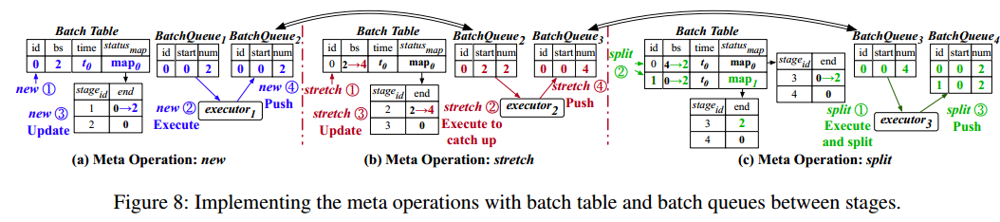

首先用2个查询创建批batch0(图8(a));然后，在批处理batch0已经被executor2处理的时候，我们用另外2个新查询扩展它(图8(b));最后，我们在第三阶段将批次batch0分成2个较小的批次(图8(c))。

一旦接收到batch0，将执行一个新的操作，并向批处理表中添加一个新项。同时，一个项目被推送到第一阶段执行器的批处理队列(BatchQueue1)。②通知第一阶段的执行者(以下简称第一阶段执行者为执行者)获取项目并执行。一旦executor1完成，它③更新批处理表中的statusmap，④将一个项推入BatchQueue2。

①由于在第二阶段使用拉伸操作向batch0中添加了2个新查询，因此批处理表中batch0的bs从2变为4。因为batch0在由executor2处理时被扩展到4个查询。②一个新条目(id = 0,start = 2,num = 2的批)被推入BatchQueue1，这样新添加的查询可以赶上当前批的进度。(执行上一个阶段)③一旦新的查询赶上，executor2更新statusmap，④将合并的批推入BatchQueue3(一个start = 0, num = 4的批)。拉伸操作只对存储在批表中的最新批执行。

①executor3从批处理队列中取出batch0，并以bs = 4运行它。之后，对executor3执行分割操作。②在批表中将原批分成两个批。③最后，将生成的批都依次推入BatchQueue4。

拆分操作的批，我们禁用进一步拉伸。拆分生成的批将继承此属性。（拆完不能再合）

# Managing Stage Executors

相邻阶段的执行者具有“生产者-消费者”关系。在这种情况下，阶段之间的缓冲区存在数据冒险

使用多个缓冲区是因为多个批处理可能同时处于活动状态。执行程序在处理批处理之前需要获得一个输入-输出缓冲对。executori的输出缓冲区也是executori+1的输入缓冲区。如果execuori使用缓冲区对bp，则bp的输入缓冲区存在write - after - read危险，因为execuori−1可能会在execuori读取数据之前写入缓冲区。类似地，在bp的输出缓冲区上也存在写后读的危险。(数据没用到就覆盖了，为什么是after?) 

A buffer is invalid when it cannot be used as an input buffer currently. It is inreading/inwriting when it is used as an input/output buffer for a batch’s execution. It is available when it is not used by any executor

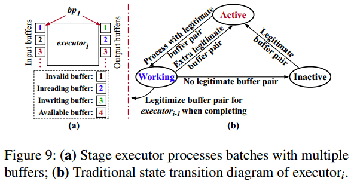

图9(a)显示了一个示例，其中execuori使用第一个缓冲对bp1, execuori +1使用第二个缓冲对bp2的输出缓冲区作为其输入。

•bp1的输入缓冲区处于读中状态，bp1的输出缓冲区处于写中状态。

•bp2的输入缓冲区处于无效状态，因为bp2的输出缓冲区目前正在被executori+1用于执行。Executori不能用它来运行一个新的批处理。

•第三个缓冲对都处于可用状态。

阶段执行器只有在成功获得合法缓冲对时才能运行批处理。当输入和输出缓冲区都可用，或者输入缓冲区可用但输出缓冲区无效时，缓冲区对是合法的。这是因为无效缓冲区可以用作执行器的输出缓冲区，但不能用作后面阶段的输入缓冲区

Based on the buffer states, there are some traditional ways to create a naive state transition rule for the stage executors to run as a pipeline. these traditional state transition rules assume all the stage executors use the buffer pairs in some fixed
order (e.g., ID order). (怎么按顺序使用)

传统的规则在单入口单出口管道中效果良好，但在多入口多出口管道中存在有效性问题。

Stretch将来自不同缓冲区对的输出合并为一个，而split可以将输出拆分为多个缓冲区对。这意味着一些阶段执行器可能比其他阶段执行器使用更多的缓冲对，并且这些缓冲对的访问顺序是乱序的。当executori使用bp3执行时，executori的bp2处于活动状态。这种不一致性使传统的状态转换规则失效。(？)

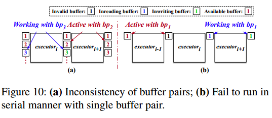

阶段执行器需要并行运行多个批次以实现负载多样性和输入多样性，并顺序运行批次以实现操作员多样性

传统的转换规则对并行方式支持较好，但不能满足串行方式的要求。如图10(b)所示，即使只使用一个缓冲对，阶段执行器也总是并行运行。因为execuori在完成执行后将bp1合法化为execuori - 1，所以当execuori +1与bp1处于工作状态时，execuori - 1与bp1处于活动状态。在这种情况下，executori−1可以与executori+1并行运行。

假设execuori当前处于活动状态，具有合法的缓冲区对。一旦execuori用缓冲区对bpj取出一个批处理，它会检查bpj的状态，而不是直接开始执行。如果bpj合法，则execuori进入working状态，开始执行。同时，bpj的输入缓冲区和输出缓冲区分别进入读、写状态。如果bpj不合法，execuori进入检查状态，等待bpj变为合法。（保证顺序？）当execuori使用bpj完成批处理时，bpj的输入缓冲区进入无效状态，bpj的输出缓冲区恢复到之前的状态。如果execuori获得另一个合法的缓冲对，它将进入活动状态。否则，进入非活动状态。最后一级执行器总是直接重新进入活动状态

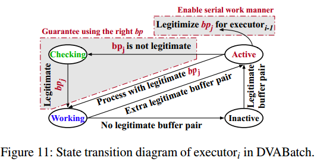

当execuori使用任何合法的缓冲区对重新进入活动状态后，execuori将execuori−1的第j个输入缓冲区更新为可用状态。

为阶段执行器添加一个检查状态，以保证使用正确的缓冲区对。在executori进入活动状态后移动executori−1的缓冲对合法性。In this case, while DVABatch only configures one available buffer pair, all stage executors stay in inactive state
until the current batch is executed by the last stage executor. Therefore, the serial work manner is supported.（？）

Implementing the Transition Diagram（？）

# Scheduling Policies of Serving Diversities

identify the existing diversities and slice the model offline, by checking the input patterns and profiling the model with several different batch sizes (e.g., 1,
2, 4, 8, 16, 32, 64) using the tools provided by Nvidia所有模型都被认为具有负载多样性，因为负载模式通常由最终用户确定。

The model that accepts inputs with different shapes (dynamic dimension except for batch size) has input diversity.在分析期间，我们获得每个操作符的首选批大小，如图5所示。当操作者具有不同的首选批大小时，模型具有操作者多样性

如果一个模型被分割成Nst个阶段，为了简单起见，操作符按照拓扑顺序被时间均匀地分配到各个阶段。(时间均匀？)从理论上确定最优的Nst是非常重要的。如果Nst太小，批调度的机会就会受到限制。否则，如果Nst太大，细粒度阶段会导致繁重的调度开销。the model slicing in DVABatch can also be tight with diversities. E.g., DVABatch considers the operators’ preferred batch size and slices a model
at specific operators for operator diversity. （切分多少stage，每个stage一个batch size，stage里可能有多个算子，每个算子有不同的最优batch size，整个stage应该怎么切，选什么batch size才是时间均匀）通过分析来确定最优的Nst，对于每种类型的GPU的新兴基准测试，可以在10分钟内完成(8次尝试)。我们在经过DNN编译器优化后对模型进行切片。

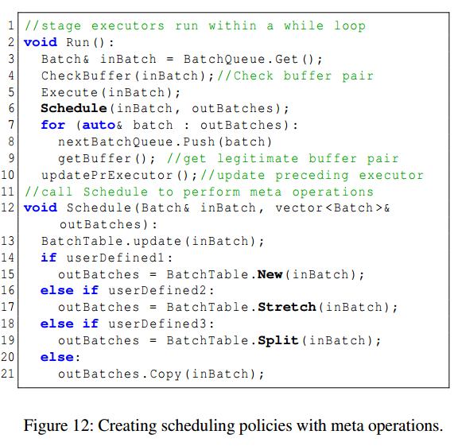

Each stage executor runs in a while loop (Line 2-11) to execute the batches

输入多样性需要并行运行多个小批量。While accepting a batch of queries from the upper-level serving systems, DVAScheduler clusters the queries according to their input sizes。具有相似输入大小的查询被批处理并填充到相同的大小以供处理。DVABatch并行处理这些批处理，以便更好地利用硬件并行性。由于批处理并行运行，调度器倾向于使用较小的批处理时间窗口，而不是生成尽可能大的批处理。. Practically, we set the batch time window to be the duration of the first stage with the largest allowed batch size bsmax. The number of active queries in the software pipeline does not exceed bsmax.

假设图中阶段1的当前批大小(用bs表示)为64。DVAscheduler比较不同批处理大小的所有剩余阶段的处理时间。设Tremain_i表示批大小为i时所需的时间。在图13中，如果Tremain_64≥2×Tremain_32，则将大批分成两个批，bs = 32。两个较小的批处理以串行方式运行，因为bs = 32已经充分利用了硬件。具有不同批大小的每个阶段的持续时间已经脱机分析

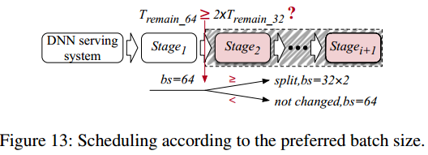

如果后一批不导致前一批的QoS冲突，则后一批应该能够加入前一批。We set a time threshold Tcomp_wait to eliminate the possible QoS violation. If a batch is already processed for Tcomp_wait, no stretch operation is allowed on this batch.

# Evaluation of DVABatch

用5k行c++代码实现了DVABatch的原型，作为Triton[9]的运行时后端

我们将DVABatch与两种批处理策略进行比较:批处理时间窗口twinwindow = 0的默认调度策略(简称ZeroBatch)(只有同一时刻的才batch在一起)和优化twinwindow的调度策略(简称DelayBatch)。优化的DelayBatch的twwindow是为了支持最大峰值吞吐量[2]而调整的。最大允许批大小bsmax为64

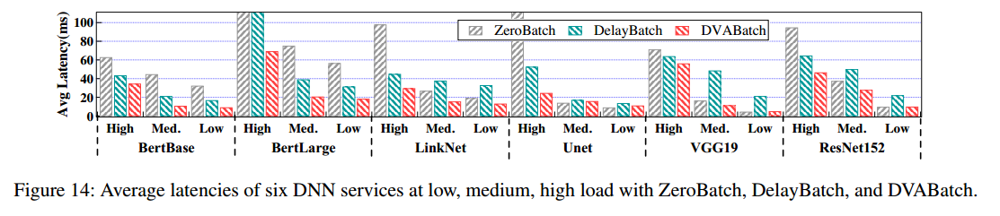

与ZeroBatch相比，DVABatch在低、中、高负载下平均将基准测试的平均延迟降低了16.1%/39.0%/57.7%，与DelayBatch相比，平均降低了35.4%/47.3%/48.5%。DVABatch采用多入口多出口批处理方案，减少了所有情况下的平均延迟。同时，与ZeroBatch相比，DelayBatch在高负载下的平均延迟较低，ZeroBatch在低负载下的延迟较低。这是因为DelayBatch具有针对峰值吞吐量的优化批处理时间窗口，而ZeroBatch不会由于低负载时的批处理时间窗口而引入延迟

BertBase和BertLarge显示输入分集和负载分集。与两个基线相比，DVABatch在所有负载下的延迟减少都相对较高。这是因为DVABatch感知到输入的多样性，并将大批分成小批，以减少在所有情况下由于填充而产生的额外计算。DVABatch以软件流水线的形式对小批量数据进行处理，加快了计算速度，进一步降低了延迟。

LinkNet和Unet同时显示运营商多样性和负载多样性。在低负载情况下，DVABatch和ZeroBatch由于比DelayBatch更小的批处理窗口而减少了延迟。

在高负载下，DVABatch的性能比ZeroBatch和DelayBatch要好得多。当负载较高时，从上层服务系统接收的批处理具有更多的查询。DVABatch更有可能将一个大批拆分为具有首选批大小的批。操作人员不会使用大于其首选批大小的批大小。有些查询可以以更短的延迟提前退出批处理。

VGG19和ResNet152只显示负载分集。在低负载情况下，DVABatch达到了与ZeroBatch相当的延迟性能，并且和DelayBatch相比降低了平均延迟。因为在本例中DVABatch和基线都在处理bs = 1的查询。在高负载下，DVABatch和DelayBatch的性能都优于ZeroBatch。延迟的减少得益于合理的批处理参数。使用DVABatch，较早到达的查询被提前执行，并且后面的查询也被认为与前一批查询合并。然后，它们的响应延迟都减少了。

没有直接将DVABatch与BatchMaker[31]和LazyBatch[22]进行比较，但在评估的基准测试中，DVABatch的性能优于它们。BatchMaker不能处理BertBase和BertLarge的输入多样性，因为它是RNN特定的输入多样性和Bert不是基于RNN单元。LazyBatch只处理负载多样性并执行每个操作员的调度。在评估VGG19和ResNet152时，如果我们将模型分割成操作符的粒度并且只启用拉伸操作，则DVABatch会退化为LazyBatch。这会导致严重的性能下降。同时，LazyBatch的每个操作符模型切片不能用TensorRT实现，因为它与内核融合等编译技术相违背。与它们相比，DVABatch通过承诺以最小的运行时调度开销实现多入口多出口批处理方案，从而在所有评估基准测试中获得更好的性能。

除了平均延迟之外，图16显示了所有基准测试的99%延迟。DVABatch比ZeroBatch减少了16.9%/27.4%/53.7%的99%文件延迟，比DelayBatch减少了45.2%/45.1%/29.2%。在尾部延迟方面，DelayBatch在高负载时具有更好的性能。在低负载情况下，ZeroBatch的性能优于DelayBatch。多入口多出口设计允许DVABatch在不同负载下保持一致的低尾部延迟。

评估了DVABatch在处理动态负载方面的鲁棒性。步进负载生成如下。起初，负载很低(每秒66个查询)，然后我们逐渐为每2000个查询增加负载。在查询30,000次之后，负载增加到每秒4000次查询(QPS)。We use the corresponding highest load under the constrain, that the latency is shorter than the QoS target 200ms, as the peak throughput。DVABatch的所有基准测试的延迟都比DelayBatch低。对于BertBase和BertLarge, DVABatch提高了峰值吞吐量，因为它消除了填充输入所浪费的计算。对于算子分集和负载分集，DVABatch对计算没有影响。在这种情况下，DVABatch的峰值吞吐量受到硬件容量的限制。DVABatch保持与DelayBatch相同的峰值吞吐量。the x-axis represents the query ID in the issuing order. The left y-axis represents the latency of each query, and the right y-axis represents the load.(哪个颜色是时延？)

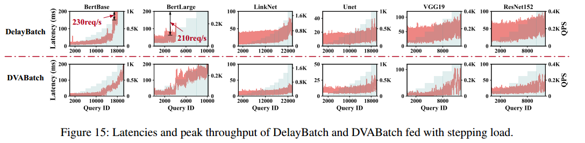

DVABatch更适合具有更高输入多样性的工作负载，因为DVABatch可以消除更多不必要的填充。序列分布越不平衡，DVABatch的吞吐量提高越高。

与DelayBatch相比，DVABatch-split在高负载下平均延迟降低了15.0%。这是因为DVABatch-split很少选择在低负载和中等负载下拆分批处理。DVABatch-split为两种DNN服务带来了不同的改进。这种差异源于运营商的多样性和负载的多样性。

对于所有基准测试，使用两个缓冲对时，平均延迟总是最低的。更多的缓冲区对会降低性能。每个缓冲对使用一组CUDA[50]同步数据结构来保证调度的正确性。

如果阶段的数量太大(例如，20)，那么管理阶段之间的队列会导致所有基准测试的高开销。

模型切片的分析需要在每种类型的目标GPU上完成一次，并在10分钟内完成。将查询的端到端延迟与ZeroBatch进行比较。在本实验中，我们将DVABatch的批处理时间窗口设置为0。与ZeroBatch相比，DVABatch实现的延迟几乎相同。DVABatch具有较低的开销，因为它在极低的负载下不会中断阶段执行器的执行，并且两个执行器重叠了每个阶段的CPU-GPU同步开销。DVABatch中的模型切片不会使DNN编译器的优化失效。DVABatch需要额外的全局内存(缓冲区对)来避免读写危险，同时维护软件管道，平均占用200mb的空间

# Discussion

模型内调度是未来深度神经网络推理的发展趋势。

DVABatch targets on efficient batch processing of models with diversities. It performs the same as the traditional batch policy for the models without any diversity. 

# Conclusion

利用多入口多出口方案来解决现有DNN服务系统中由于服务多样性而导致的长延迟问题。在面对服务多样性时，找出了现有批处理策略效率低下的根源。引入状态转换图来管理阶段的执行。

输入、算子、负载多样性，动态batch，stage，buffer，状态转换，怎么分析多样性、切分，时延、吞吐量