Orca: A Distributed Serving System for Transformer-Based Generative Models

OSDI

# Abstract

自回归，现有的推理服务系统在这种具有多迭代特征的工作负载上表现不佳，在批处理中比其他请求早完成的请求不能返回到客户端，而新到达的请求必须等到当前批处理完全完成。

迭代级调度，调度程序调用执行引擎仅在批处理上运行模型的单个迭代。为了同时对Transformer模型应用批处理和迭代级调度，我们建议选择批处理，它只对选定的一组操作应用批处理。

ORCA在延迟和吞吐量方面都明显优于NVIDIA FasterTransformer:在相同延迟水平下，吞吐量提高了36.9倍。

# Introduction

服务应该以低延迟和高吞吐量为客户端请求提供推理结果。推理服务系统Triton inference Server, TensorFlow serving。这些系统可以使用单独开发的DNN执行引擎来执行实际的张量操作。FasterTransformer是一种针对基于transformer的模型的推理进行优化的执行引擎。Triton主要负责将多个客户端请求分组为批处理，而FasterTransformer接收来自Triton的批处理并以批处理的方式进行推理过程。

在批处理中比其他请求早完成的请求无法返回到客户端，从而导致延迟增加。在调度批处理之后到达的请求也应该等待处理批处理，这会显著增加请求的排队时间。

服务系统调用引擎只在批处理上运行模型的单个迭代。因此，在等待模型的一次迭代之后，可以考虑处理新到达的请求。服务系统在每次从引擎返回后检查请求是否已经完成处理，因此完成的请求也可以立即返回给客户端。

提议的调度可以发出一批请求，其中每个请求到目前为止处理了不同数量的令牌。在这种情况下，不能以批处理的方式处理对Transformer模型的请求，因为注意机制调用了不可批处理的张量操作，这些操作的输入张量根据处理的令牌的数量具有不同的形状。只对一组选定的操作应用批处理，我们称之为选择性批处理。通过考虑操作的不同特征，选择性批处理将拆分批处理，并在对Transformer模型的其他操作应用批处理的同时，为Attention操作单独处理每个请求。不批量执行注意操作的决定对效率只有很小的影响。由于Attention操作不与任何模型参数相关联，因此对Attention应用批处理并没有通过跨多个请求重用加载的参数来减少GPU内存读取量的好处。

ORCA采用的并行化策略包括层内和层间模型并行化。迭代级调度设计了一个新的调度算法，并考虑了内存管理和跨工作线程的流水线执行。

# Background

GPT是一种基于Transformer的一种架构变体的自回归语言模型[60]。它将文本作为输入，并产生新的文本作为输出。

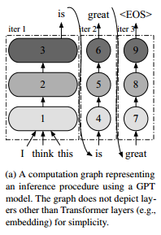

服务系统负责公开接收推理请求、调度引擎执行和发送请求响应的端点。这些系统专注于诸如批处理执行，从多个模型变体中选择合适的模型，在同一设备上部署多个模型(每个模型用于不同的推理服务)等方面。

批处理是使用gpu等加速器时实现高加速器利用率的关键。来自多个请求的输入张量在被输入到模型的第一个操作之前合并成一个大的输入张量。由于加速器更喜欢大的输入张量而不是小的输入张量，以便更好地利用大量的并行计算单元，因此引擎的吞吐量高度依赖于批处理大小，即引擎一起处理的推理请求的数量。重用从片外内存加载的模型参数是批处理执行的另一个优点，特别是当模型涉及内存密集型操作时。

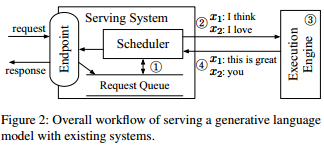

# Challenges and Proposed Solutions

c1:系统被设计成按请求粒度调度执行;该引擎保持一批固定的请求，直到批处理中的所有请求完成。批处理中的每个请求可能需要不同数量的迭代，从而导致某些请求比其他请求更早完成。针对非活动请求的额外计算(iter 3和4时为x2)限制了批处理执行的效率。阻止了将完成的请求提前返回给客户端，从而造成了大量额外的延迟。当一个新请求在当前批处理的执行过程中到达时，上述调度机制使新到达的请求等待，直到当前批处理中的所有请求都完成。早完成和晚加入请求的问题在语言模型的训练中不会发生。训练程序通过使用教师强制技术在一次迭代中完成整批的处理。

s1:迭代级调度。调度器重复以下过程:(1)选择接下来运行的请求;(2)调用引擎对选定的请求执行一次迭代;(3)接收预定迭代的执行结果。可以检测请求的完成并立即将其生成的令牌返回给客户机。对于新到达的请求，在执行当前调度的迭代之后，请求有机会开始处理，从而显著减少排队延迟。

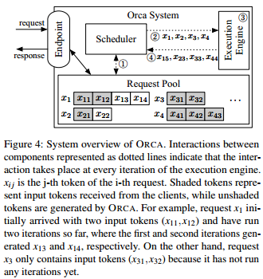

c2:有三种情况下，下一次迭代不能批处理在一起:(1)两个请求都处于初始化阶段，每个请求都有不同数量的输入令牌(例如，图4中的x3和x4);(2)两者都处于增量阶段，每个都在处理不同索引处的token (x1和x2);或者(3)每个请求都处于不同的阶段:初始化或增量(x1和x3)。为了批量执行多个请求，每个请求的执行必须由相同的操作组成，每个操作使用相同形状的输入张量。在第一种情况下，两个请求不能分批处理，因为它们的输入张量的“长度”维度(即输入令牌的数量)不相等。第二种情况下的请求在注意键和值的张量形状上有所不同。对于第三种情况，我们不能批量处理不同阶段的迭代，因为它们接受不同数量的令牌作为输入。批处理仅适用于两个选定请求处于相同阶段，具有相同数量的输入令牌(在初始阶段的情况下)或具有相同的令牌索引(在增量阶段的情况下)的情况。因为调度器应该希望同时存在两个符合批处理条件的请求。随着批大小的增加，这种可能性会进一步呈指数级降低，因此使用可以在不影响延迟的情况下获得更好吞吐量的大批大小变得不切实际。

s2:有选择性的批处理。有选择地只对少数操作应用批处理。上述三种情况4对应于不规则形状的输入(或状态)张量，它们不能合并成一个大张量并输入到批处理操作中。在每次迭代中，Transformer层接受一个形状为[B;L;H]的三维输入张量。当调度器决定在批处理(x1;x2;x3;x4)，由于x3和x4具有不同数量的输入令牌2和3，在初始阶段的请求输入(x3: [2;H]和x4: [3;H])不能合并成一个形状为[B;L;H]的张量。非注意矩阵乘法和层归一化等操作可以通过使张量平坦化来处理不规则形状的张量。上述x3和x4的输入张量可以组成一个形状为[∑L;H] = [5;H]的二维张量，而不需要显式的批维。这个张量可以被输入到所有非注意操作中，包括Linear、LayerNorm、Add和GeLU操作，因为它们不需要区分不同请求的张量元素。另一方面，Attention操作需要请求的概念(即需要批处理维度)，以便仅在同一请求的令牌之间计算注意力，通常通过应用批处理矩阵乘法的cuBLAS例程来完成。对批处理进行拆分，并为Attention操作单独处理每个请求，同时对其他操作应用令牌(而不是请求)批处理，而没有请求的概念。管理器为每个请求分别维护这些键和值，直到调度器显式要求删除某些请求的键和值，即，当请求完成处理时。

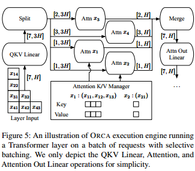

# ORCA Design

Distributed Architecture:ORCA为Transformer模型组合了已知的并行化技术:层内并行化和层间并行化。层内并行性将矩阵乘法(即线性和注意力运算)及其相关参数拆分到多个gpu上。层间并行性在多个gpu上拆分Transformer层。ORCA为每个GPU分配相同数量的Transformer层。每个工作进程负责模型的层间分区。每个worker管理一个或多个CPU线程，每个线程专门用于控制GPU，其数量取决于层内并行度的程度。引擎主机就会将收到的关于已安排的批处理的信息转发给第一个工作进程(Worker1)。该信息包括当前迭代的令牌和控制消息。Worker1的控制器将从引擎主机接收到的信息交给GPU控制线程，控制器也将控制消息转发给下一个worker (Worker2)的控制器，而不等待Worker1的gpu上发出的内核完成。最后一个worker (Worker2)的控制器等待(即同步)发出的GPU内核的完成，以便为每个请求获取输出令牌并将令牌发送回引擎主机。为了让gpu尽可能的忙碌，设计了ORCA引擎来减少CPU和gpu之间的同步。当前用于分布式推理的系统(例如，FasterTransformer[4]和Megatron-LM[3])在每个进程接收控制消息时都具有CPU-GPU同步，因为它们通过gpu到gpu的通信通道- NCCL交换消息。这些控制消息的交换发生在每次迭代中，造成了不可忽略的性能开销。ORCA分离了控制消息(加上令牌)和张量数据传输的通信通道，避免了对cpu使用的数据使用NCCL。专门使用NCCL来交换中间张量数据。控制消息由CPU线程用于发出GPU内核，通过单独的通信通道在引擎主控制器和工作控制器之间发送，该通信通道不涉及GPU，如gRPC[2]。

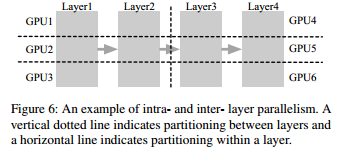

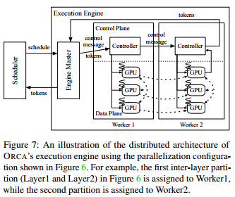

Scheduling Algorithm:较早到达的请求被较早地处理，确保迭代级的先到先得(FCFS)属性。调度器需要考虑其他因素:增加批处理大小的收益递减和GPU内存约束。增加批大小以增加的吞吐量换取增加的延迟，但是随着批大小变大，返回量(即吞吐量的增加)减少。ORCA也有一个最大批处理大小的概念。ORCA系统操作员可以调整这个旋钮，以最大限度地提高吞吐量，同时满足延迟预算。naïve实现可能会使调度器陷入死锁，当调度器无法对池中的任何请求发出迭代，因为没有剩余空间用于存储下一个令牌的Attention键和值。这要求ORCA调度器了解为管理器预分配的内存区域的剩余大小。根据到达时间选择最多“最大批处理大小”的请求，同时在第一次调度请求时保留足够的空间用于存储请求的键和值。存在并发线程将新到达的请求插入request_pool，并从request_pool中删除已完成的请求。n_rsrv是当前保留的插槽数量，n_slots是一个由ORCA系统操作符调整的参数，表示分配给注意K/V管理器的内存区域的大小(按插槽计算)。给定模型规范(例如，隐藏大小，层数等)和层内和层间并行度，ORCA的GPU内存使用主要取决于n_slots。也就是说，在内存约束下，操作符可以简单地使用最大的n_slots。

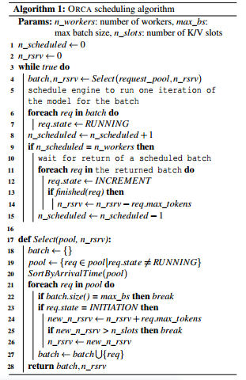

管道并行。ORCA的调度程序使引擎中的工作进程的执行跨多个批次进行流水线化。调度程序不会等待调度的批返回，直到n_scheduled，当前调度的批的数量达到n_workers(算法1的第9-10行)。通过这样做，调度程序将引擎中并发运行的批的数量保持为n_workers，这意味着引擎中的每个worker都在处理其中一个批，而不会空闲。请求级调度，不允许在当前运行的批处理完成之前注入另一个批处理。将一批请求拆分为多个微批[28]，并在微批之间通过流水线执行分区。当微批大小过大时，该方法可能会在管道中插入气泡。需要以批处理效率(更大的微批大小)换取管道效率(更少的管道气泡)。ORCA没有这样的权衡——多亏了迭代级调度——并且可以轻松地将请求管道化，而无需将批处理划分为微批。

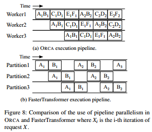

# Implementation

13K行c++实现了ORCA。在ORCA引擎的控制平面使用gRPC[2]进行通信，在数据平面使用NCCL[5]进行层间和层内通信。为LayerNorm、Attention和GeLU算子实现了融合核。连接不同的请求的内核的所有线程块来融合分裂的注意操作符的内核。虽然这种融合使得内核内的线程块具有不同的特征和生命周期(CUDA编程实践通常不鼓励)，因为它们处理不同形状的张量，但我们发现这种融合通过提高GPU利用率和减少内核启动开销是有益的[34,39]。

# Evaluation

基线系统。我们与FasterTransformer[4]进行了比较，FasterTransformer是一个通过分布式执行支持大规模Transformer模型的推理引擎。

Engine Microbenchmark:

设计了一个微基准来单独评估ORCA引擎的性能，而不受迭代级调度的影响。不运行ORCA调度器。相反，给定一批请求，测试脚本重复将同一批请求注入ORCA引擎，直到批处理中的所有请求完成，模拟规范请求级调度的行为。假设批处理中的所有请求具有相同数量的输入令牌，并生成相同数量的输出令牌。我们报告处理批处理(而不是单个请求)所花费的时间，并将结果与FasterTransformer进行比较。批处理内的所有请求同时开始和完成处理。与FasterTransformer相比，ORCA引擎在所有配置中表现出类似(或稍差)的性能。这是因为ORCA不将批处理应用于Attention操作，而FasterTransformer将批处理应用于所有操作。尽管没有对Attention操作进行批处理，但是在Attention中缺少模型参数使得该决策对效率影响很小，因为跨多个请求重用模型参数没有任何好处。ORCA引擎和fasttransformer在CUDA内核的实现和层内分区之间的通信方面具有相当的效率。FasterTransformer不能在13B模型中使用8或更大的批处理大小(在101B模型中使用16或更大的批处理大小)，因为每个请求的Attention键和值的内存预分配数量是固定的，它与模型的最大序列长度成比例增长(在本例中为2048)。相比之下，ORCA避免了冗余内存通过基于max_tokens属性为每个请求分别设置键和值的缓冲区大小来分配。禁用两个系统的层间分区的流水线执行。对于FasterTransformer，我们将微批的大小设置为等于禁用流水线的批大小。如图9c所示，ORCA引擎的性能比fasttransformer高出47%。我们将这种性能改进归功于第4.1节中描述的控制数据平面分离。

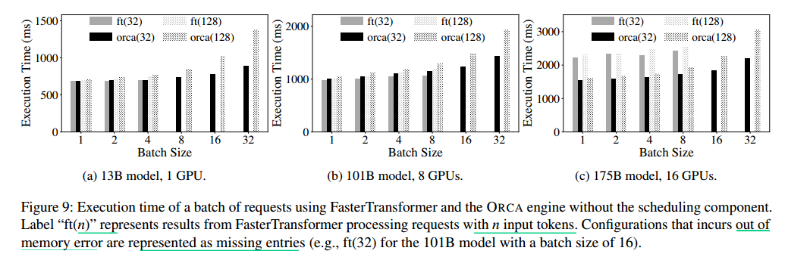

End-to-end Performance:

模拟工作负载来测试ORCA的端到端性能。对于没有自己调度器的FasterTransformer，我们实现了一个自定义调度器，该调度器接收客户端请求，创建批处理，并将批处理注入到FasterTransformer的实例中。我们让自定义调度程序通过从请求队列中获取最大批处理大小的请求来动态创建批处理，这是Triton[7]和TensorFlow serving[42]等现有服务系统使用的最常见的调度算法。ORCA提供了比FasterTransformer更高的吞吐量和更低的延迟。唯一的例外是低负载下的101B模型(图10a)。ORCA和fasttransformer都没有足够的请求数量来批量处理。当负载变得更重时，ORCA提供更高的吞吐量，而延迟的增加相对较小，因为ORCA调度器会让延迟到达的请求搭上当前正在进行的批处理的顺风车。当我们比较类似延迟级别的结果时，吞吐量会提高一个数量级。增加ORCA的最大批大小可以在不影响延迟的情况下提高吞吐量。这是因为ORCA的迭代级调度解决了早完成和晚加入请求的问题。在FasterTransformer中较大的最大批大小并不一定有助于提高吞吐量。通过在不同负载下测试所有模型上最大批大小(max_bs)和微批大小(mbs)的所有可能组合，我们发现(max_bs, mbs) =(1,1)或(8,8)是最佳选择。FasterTransformer基于微批处理的流水线可能效率较低，因为引擎将以批处理方式处理最多mbs的请求。虽然增加max_bs可以提高性能，因为增加了批处理大小，但同时，这也增加了在输入令牌数量或生成令牌数量差异很大的情况下对请求进行批处理的可能性。由于所有请求都需要相同数量的迭代来完成处理，因此在此跟踪中不会出现提前离开请求的问题。结果，现在max_bs的增加对FasterTransformer的性能产生了显著的积极影响。

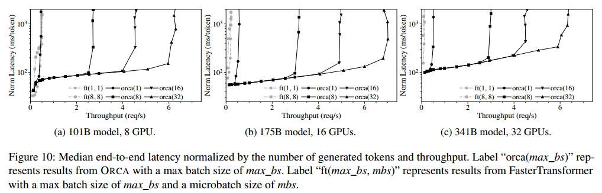

这些系统将调度的角色委托给服务系统层，遵循规范的请求级调度。ORCA建议以更细的粒度调度执行，如果不改变调度器和执行引擎之间的协调机制，这在当前系统中是不可能的。两层之间的流行接口对于处理像GPT[12]这样具有多迭代特性的模型来说过于受限。ORCA设计为紧密集成调度程序和引擎。

# ppt

## Background

Transformer-Based Generative Models

GPT是一种基于Transformer的一种自回归语言模型。它将文本作为输入，并产生新的文本作为输出。

Distributed Serving System

低延迟和高吞吐量为客户端请求提供推理结果。

推理服务系统Triton inference Server, TensorFlow serving可以使用单独开发的DNN执行引擎来执行实际的计算。FasterTransformer是一种针对基于transformer的模型的推理进行优化的执行引擎。

批处理是使用gpu等加速器时实现高加速器利用率的关键。重用从片外内存加载的模型参数是批处理执行的另一个优点，特别是当模型涉及内存密集型操作时。

## Challenges and Proposed Solutions

c1:早完成和晚加入

按请求粒度调度执行:该引擎保持一批固定的请求，直到批处理中的所有请求完成。

1. 针对已完成的请求的额外计算限制了批处理执行的效率。
2. 阻止了将完成的请求提前返回给客户端，从而造成了大量额外的延迟。
3. 一个新请求在当前批处理的执行过程中到达时需要等待，直到当前批处理中的所有请求都完成。

s1:迭代级调度

调度器重复以下过程:(1)选择接下来运行的请求;(2)调用引擎对选定的请求执行一次迭代;(3)接收预定迭代的执行结果。可以检测请求的完成并立即将其生成的令牌返回给客户机。对于新到达的请求，在执行当前调度的迭代之后，请求有机会开始处理，从而显著减少排队延迟。

c2:batching

为了批量执行多个请求，每个请求的执行必须由相同的操作组成，每个操作使用相同形状的输入张量。批处理仅适用于两个选定请求处于相同阶段，具有相同数量的输入令牌(在初始阶段的情况下)或具有相同的令牌索引(在增量阶段的情况下)的情况。

有三种情况下，下一次迭代不能批处理在一起:

1. 两个请求都处于初始化阶段，每个请求都有不同数量的输入令牌
2. 两者都处于增量阶段，每个都在处理不同索引处的token，K, V的张量形状上有所不同
3. 每个请求都处于不同的阶段:初始化或增量，接受不同数量的令牌作为输入

s2:有选择性的批处理

三维输入张量[B;L;H]变成二维张量[∑L;H]。

这个张量可以被输入到所有非注意操作中，包括Linear、LayerNorm、Add和GeLU操作，因为它们不需要区分不同请求的张量元素。

Attention操作仅在同一请求的令牌之间计算注意力，对批处理进行拆分，并为Attention操作单独处理每个请求。

## ORCA Design

Distributed Architecture:

层内并行化和层间并行化:每个worker进程负责模型的层间分区。每个worker管理一个或多个CPU线程，每个线程专门用于控制GPU，其数量取决于层内并行度的程度。

引擎就会将收到的信息转发给Worker1。该信息包括当前迭代的令牌和控制消息。Worker1的控制器将信息交给GPU控制线程，同时将控制消息转发给Worker2的控制器，而不等待Worker1的gpu上发出的内核完成。最后一个worker的控制器等待(即同步)发出的GPU内核的完成，以便为每个请求获取输出令牌并将令牌发送回引擎。

为了让GPU尽可能的忙碌，设计ORCA引擎来减少CPU和GPU之间的同步。当前用于分布式推理的系统在每个进程接收控制消息时都具有CPU-GPU同步，因为它们通过GPU到GPU的通信通道- NCCL交换消息。这些控制消息的交换发生在每次迭代中，造成了不可忽略的性能开销。

ORCA分离了控制消息(加上令牌)和张量数据传输的通信通道。专门用NCCL来交换中间张量数据。控制消息通过单独的通信通道在引擎控制器和工作控制器之间发送，该通信通道不涉及GPU。

Scheduling Algorithm:

较早到达的请求被较早地处理，确保迭代级的先到先得(FCFS)属性。

调度器需要考虑其他因素:

1. 增加批处理大小的收益递减:增加批大小以增加的吞吐量换取增加的延迟，但是随着批大小变大，返回量(即吞吐量的增加)减少。ORCA也有一个最大批处理大小的概念，可以调整，以最大限度地提高吞吐量，同时满足延迟预算。
2. GPU内存约束:naïve实现可能会使调度器陷入死锁，调度器无法对池中的任何请求发出迭代，因为没有剩余空间用于存储下一个令牌的k和v。这要求ORCA调度器为KV管理器预分配的内存区域的剩余大小。在第一次调度请求时保留足够的空间用于存储请求的k和v

管道并行。ORCA的调度程序使引擎中的wokers的执行跨多个批次进行流水线化。调度程序不会等待调度的批返回，直到当前调度的批的数量达到n_workers。这意味着引擎中的每个worker都在处理其中一个批，而不会空闲。请求级调度，不允许在当前运行的批处理完成之前注入另一个批处理。将一批请求拆分为多个微批，并在微批之间通过流水线执行分区。

当微批大小过大时，该方法可能会在管道中插入气泡。需要以批处理效率(更大的微批大小)换取管道效率(更少的管道气泡)。ORCA没有这样的权衡——多亏了迭代级调度——并且可以轻松地将请求管道化，而无需将批处理划分为微批。

## Evaluation

Engine Microbenchmark:

设计了一个微基准来单独评估ORCA引擎的性能，不运行ORCA调度器。给定一批请求，测试脚本重复将同一批请求注入ORCA引擎，直到批处理中的所有请求完成，模拟规范请求级调度的行为。假设批处理中的所有请求具有相同数量的输入令牌，并生成相同数量的输出令牌。统计批处理所花费的时间，并将结果与FasterTransformer进行比较。

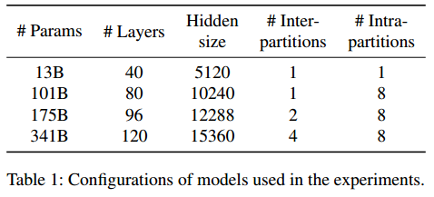

与FasterTransformer相比，ORCA引擎在所有配置中表现出类似(或稍差)的性能。这是因为ORCA不将批处理应用于Attention操作，而FasterTransformer将批处理应用于所有操作。尽管没有对Attention操作进行批处理，但是在Attention中缺少模型参数使得该决策对效率影响很小，因为跨多个请求重用模型参数没有任何好处。

FasterTransformer不能在13B模型中使用8或更大的批处理大小(在101B模型中使用16或更大的批处理大小)，因为每个请求的k和v的内存预分配数量是固定的，它与模型的最大序列长度成比例增长(在本例中为2048)。相比之下，ORCA通过max_tokens属性为每个请求分别设置k和v的缓冲区大小，避免了冗余内存。

禁用层间分区的流水线执行。对于FasterTransformer，将微批的大小设置批大小。ORCA引擎的性能比FastTransformer高出47，这种性能改进归功于控制数据平面分离。

End-to-end Performance:

模拟工作负载来测试ORCA的端到端性能。对于FasterTransformer，实现了一个自定义调度器，该调度器接收客户端请求，创建批处理，并将批处理注入到FasterTransformer的实例中。自定义调度程序通过从请求队列中获取最大批处理大小的请求来动态创建批处理。

ORCA提供了比FasterTransformer更高的吞吐量和更低的延迟。唯一的例外是低负载下的101B模型(图10a)。ORCA和fasttransformer都没有足够的请求数量来批量处理，延迟将主要取决于引擎的性能。

当负载变得更重时，ORCA提供更高的吞吐量，而延迟的增加相对较小，因为ORCA调度器可以让延迟到达的请求加入当前正在进行的批处理。比较类似延迟级别的结果时，吞吐量会提高一个数量级。

增加ORCA的最大批大小可以在不影响延迟的情况下提高吞吐量。这是因为ORCA的迭代级调度解决了早完成和晚加入请求的问题。在FasterTransformer中较大的最大批大小并不一定有助于提高吞吐量。

通过在不同负载下测试所有模型上最大批大小(max_bs)和微批大小(mbs)的所有可能组合，发现(max_bs, mbs) =(1,1)或(8,8)是最佳选择。FasterTransformer基于微批处理的流水线效率较低，引擎将以批处理方式处理最多mbs的请求。虽然增加max_bs可以提高性能，因为增加了批处理大小，但同时，这也增加了在输入令牌数量或生成令牌数量差异很大的情况下对请求进行批处理的可能性。

## Conclusion

调度：迭代级调度方法，死锁避免，跨多个批次进行流水线化

引擎：选择性批处理，分离控制消息和张量数据传输的通信通道

# .

NVIDIA Triton Inference Server. Retrieved Dec
13, 2021 from https://developer.nvidia.com/
nvidia-triton-inference-server.

NVIDIA FasterTransformer. Retrieved Dec
13, 2021 from https://github.com/NVIDIA/
FasterTransformer

Noam Shazeer, Youlong Cheng, Niki Parmar, Dustin
Tran, Ashish Vaswani, Penporn Koanantakool, Peter
Hawkins, HyoukJoong Lee, Mingsheng Hong, Cliff
Young, Ryan Sepassi, and Blake Hechtman. MeshTensorFlow: Deep Learning for Supercomputers. Advances in Neural Information Processing Systems, 2018.

Mohammad Shoeybi, Mostofa Patwary, Raul Puri,
Patrick LeGresley, Jared Casper, and Bryan Catanzaro.
Megatron-LM: Training Multi-Billion Parameter Language Models Using Model Parallelism. arXiv preprint
arXiv:1909.08053, 2019

Ronald J. Williams and David Zipser. A Learning Algorithm for Continually Running Fully Recurrent Neural
Networks. Neural Computation, 1(2):270–280, 1989.
