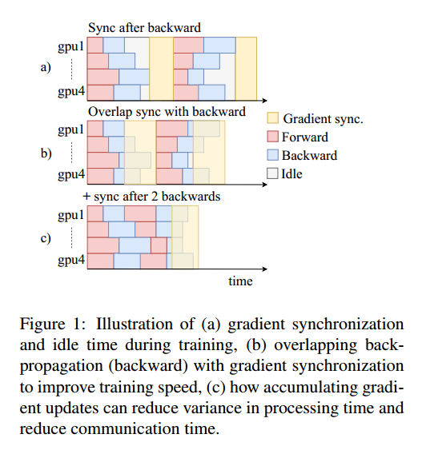

# Abstract

FAIRSEQ是一个开源序列建模工具包，允许研究人员和开发人员训练自定义模型，用于翻译、摘要、语言建模和其他文本生成任务。该工具包基于PyTorch，支持跨多个gpu和机器的分布式训练。我们还支持现代gpu上的快速混合精度训练和推理。

# Introduction

神经序列到序列模型已经在各种文本生成任务上取得了成功。

可以扩展的跨模型和任务的公共接口

高效的分布式和混合精确训练，支持在当前硬件上对数亿个句子的数据集进行训练

用于机器翻译、摘要和语言建模的最先进的实现和预训练模型

使用多种支持的搜索算法优化推理，包括波束搜索、多波束搜索和top-k采样

#  Design

可以通过五种类型的用户提供的插件进行扩展

模型扩展了BaseFairseqModel类，而这个类又扩展了torch.nn.Module。抽象了模型与生成算法交互的方法，例如，通过逐步预测的波束搜索。这将模型实现与生成算法隔离开来。

在专家混合模型中，标准可以实现em式训练，并仅通过产生最低损失的专家进行反向传播。

检查点包含模型、优化器和数据加载器的完整状态，因此，如果训练被中断和恢复，结果是可重复的。FAIRSEQ还提供前向兼容性，即使用工具包的旧版本训练的模型将通过自动检查点升级继续在最新版本上运行。

#  Implementation

提供高效的批处理，混合精度训练，多gpu以及多机器训练

FAIRSEQ minimizes padding within a minibatch by grouping source and target sequences of similar length.每个小批的内容在整个训练过程中保持不变，但是小批本身在每个epoch随机洗牌。When training on more than one GPU or
machine, then the mini-batches for each worker are likely to differ in the average sentence length which results in more representative updates.

FAIRSEQ uses the NCCL2 library and torch.distributed for interGPU communication.

Models are trained in a synchronous optimization setup where each GPU has
a copy of the model to process a sub-batch of data after which gradients are synchronized between GPUs; all sub-batches constitute a minibatch

即使子批包含相似数量的令牌，我们仍然观察到处理时间的很大差异。FAIRSEQ mitigates the effect of stragglers by overlapping gradient synchronization between workers with the backward pass(一边计算梯度一边同步梯度) and by accumulating gradients over multiple minibatches for each GPU （累积多次backward的梯度后再同步）

Overlapping gradient synchronization starts to synchronize gradients of parts of the network when they are computed.(计算出网络的一部分梯度就可以开始同步)当一个层的梯度计算完成时，FAIRSEQ将结果添加到缓冲区中。当缓冲区的大小达到预定义的阈值时，梯度在后台线程中同步，而反向传播照常进行(图1 (b))。

there is no need to wait for stragglers after each sub-batch

FAIRSEQ在训练和推理方面提供全精度(FP32)和FP16支持。We perform all forward-backward computations as well as the all-reduce for gradient synchronization between workers in FP16. 

the parameter updates remain in FP32 to preserve accuracy.（参数是32？） FAIRSEQ implements dynamic loss scaling (Micikevicius et al., 2018) in order to avoid underflows for activations and gradients because of the limited precision offered by FP16. This scales the loss right after the forward pass to fit into the FP16 range while the backward pass is left unchanged.（变小？forward是16，参数是32，loss是32，每计算一次都要缩小一次？） After the FP16 gradients are synchronized between workers, we convert them to FP32, restore the original scale, and update the weights.

FAIRSEQ provides fast inference for non-recurrent models through incremental decoding, where the model states of previously generated tokens are cached in each active beam and re-used. For some models, this requires a component-specific caching implementation

FAIRSEQ还支持FP16中的推理，与FP32相比，解码速度提高了54%，而精度没有损失(表1)。

# Applications

我们提供了几种可用于机器翻译的流行序列到序列模型的参考实现，包括LSTM (Luong et al, 2015)，卷积模型(Gehring et al, 2017;Wu等人，2019)和Transformer (Vaswani等人，2017)。

FAIRSEQ支持门控卷积模型(Dauphin等人，2017)和Transformer模型(Vaswani等人，2017)的语言建模。

使用基本Transformer对输入文档进行编码，然后使用解码器网络生成摘要。

# Conclusion

序列建模工具包，基于PyTorch，提供高效的批处理，分布式训练梯度同步加速，混合精度训练和推理 