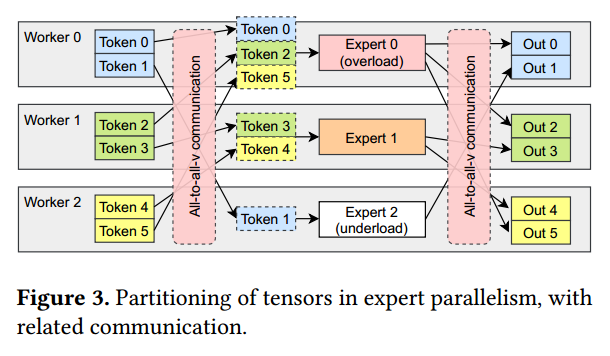
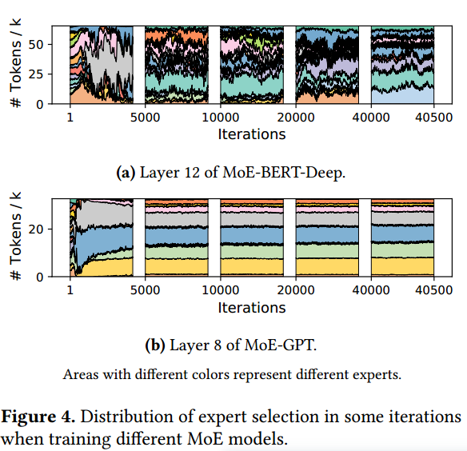
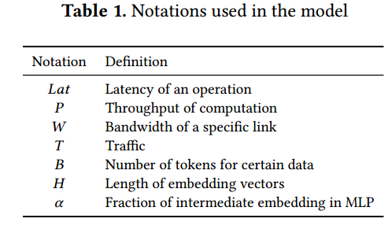
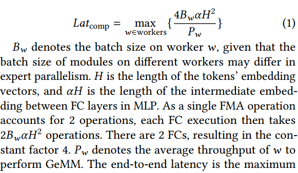
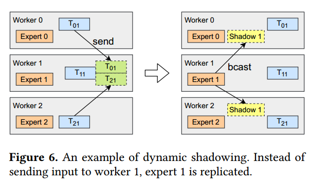
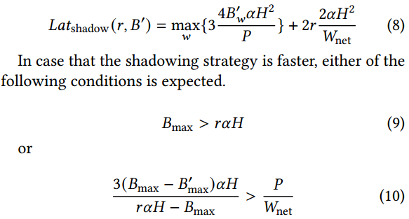
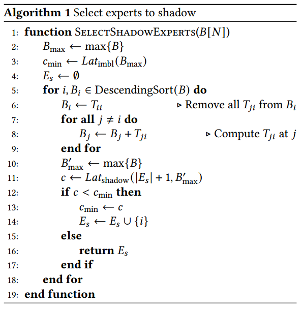
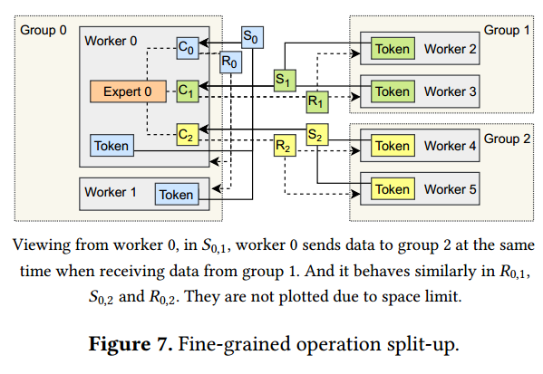
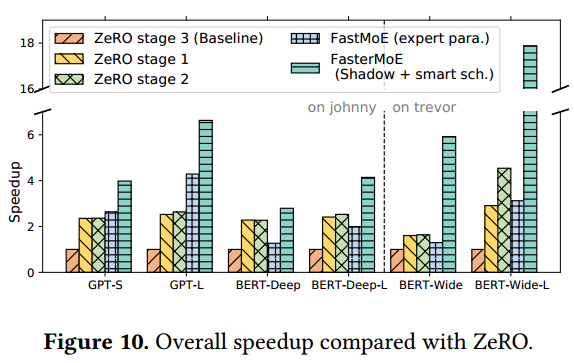

# Abstract

混合专家(MoE)是目前最流行的预训练模型，它使参数超过万亿尺度的模型的训练成为可能。它允许更大模型的稀疏训练，消除模型大小和计算之间的线性关系。与传统的深度学习模型不同，它对这些训练系统的效率提出了巨大的挑战，包括动态负载不平衡、低效的同步执行模式、拥塞的全对全通信。

我们首先提出了一种性能模型，该模型既可以准确预测特定训练任务的不同操作的延迟，又可以通过一种新的类似屋顶线的模型直观地分析其端到端性能。然后，在该模型的指导下，我们发明了一种动态阴影方法来处理负载不平衡，以及一种智能的细粒度调度，将不同的操作分开并并发执行。我们设计了一种避免拥塞的专家选择策略，在允许修改专家选择的情况下，以较低的迭代延迟缓解网络拥塞。

实现高效的分布式MoE模型训练。与最先进的大型模型系统(包括ZeRO, GShard和BASE Layer)相比，它实现了1.37× - 17.87×的加速。

# Introduction

研究表明，更大的模型可以带来更高的精度[1,5,11]。

在这些工作中，mix -of- expert (MoE)[17]似乎有望将模型缩放到极端尺寸。训练样本被输入不同的专家，由一个轻量级可训练门网络动态选择。在MoE中，由于专家是稀疏激活的，并且节省了大量的额外计算，与经典相比，它可以显著增加同一时间内训练的样本数量，提高模型的精度

尽管灵活的MoE结构使得训练一个超过万亿规模的巨型模型变得更加可行，但它仍然非常昂贵。为了减少训练时间，引入专家并行来分布式训练MoE模型，其中专家被划分到不同的worker上，每个worker处理不同批次的训练样本(详见2.3节)。

现有MoE训练方法的低效率主要来自于动态的专家选择和灵活的MoE结构。

动态专家选择。随着模型规模的增加，专家通常分布在不同的工作人员中。

受欢迎的专家比其他人接收更多的令牌，这导致其常驻工作人员负载过重，而其他工作人员可能空闲。更糟糕的是，这种模式会在不同的迭代中动态变化。这种行为会显著影响硬件利用率和训练效率。

低效的同步操作。所有专家都需要从许多其他工作人员那里获得他们的输入，这是训练MoE模型时最耗时的操作之一。It is commonly implemented as synchronous allto-all operations with variable message sizes.考虑到不统一的专家选择会导致计算和通信的严重不平衡，这种启动同步操作的方法会导致更多的开销

模型设计与网络拓扑不匹配。在MoE模型训练中，专家选择决定了负载均衡和通信流量，对训练效率有很大影响。GShard[11]和BASE Layer[12]等现有工作使用不同的专家选择策略来平衡计算负载，但忽略了通信，尽管网络拓扑对通信性能至关重要。在当前广泛使用的网络拓扑结构中，由于移动通信的复杂性，经常引起网络争用。

，我们提出了fastmoe，一个高效的分布式系统，用于训练大型动态预训练模型。为了捕捉由MoE引入的动态行为，我们为训练任务建立了精确的性能模型。给定一个MoE模型和系统配置，我们的性能模型可以首先估计操作的延迟，然后使用类似屋顶线的模型将任务可视化，以便更好地理解其性能。在绩效模型的指导下，我们进一步提出了培训过程的三个关键优化策略。为了减少专家选择不平衡造成的空转，采用了动态阴影。引入细粒度智能调度策略，实现计算和通信操作的异步执行，充分利用了操作间的并行性。最后，设计了一种避免拥塞的专家选择策略来降低迭代延迟，收敛效果良好。

与ZeRO Optimizer相比，FasterMoE实现了17.87倍的加速提升[25]，具有数学上的等效性。在允许修改专家选择的情况下，FasterMoE的收敛时间比GShard快1.37倍，比BASE Layer快2.19倍。

我们设计了一个性能模型，该模型可以准确地估计给定的MoE模型在特定并行策略下的性能。

我们提出了一个类似屋顶线的模型来分析不同并行性的性能和理论极限，以及我们优化的改进

在我们的性能模型的指导下，我们发明了一种动态阴影方法来减少专家受欢迎程度的影响

我们创建了一个智能的细粒度通信和计算调度，以共同减少它们的延迟。

We design an adjusted expert selection strategy at
runtime for faster communication with less congestion,
whereas the loss is decreasing in promising slope.

# Background and Challenges

Transformer [34] is the state-of-the-art structure to process
sequences. Most pre-trained models are based on sequences,

The most time-consuming computation of a
transformer block is general matrix multiplication (GeMM)
that occurs in the MLP layer.

因为直觉认为不同的小模型是不同领域的专家，只有在输入其领域的数据时才能激活。

在非moe变压器模型中，MLP中有两个相邻的FC层。当扩大模型尺寸时，这些密集的层变得巨大，使GeMM计算过于繁重。在MoE模型中，GeMM的权重矩阵沿着一定的维度被分割，这样每个部分仍然产生相同大小的输出，而GeMM的计算量仍然很小。

MoE允许在不增加计算量的情况下增加模型参数，使其成为目前最可行的方法来产生数万亿规模甚至更大的预训练模型。

数据并行、模型并行和专家并行是分布式训练中常用的三种并行策略。(看来流水线不行)

Workers synchronize gradients globally
and update the model after each iteration. Although there
is no communication within each iteration, the size of the
model must not exceed the capacity of a single worker, making it impossible to scale up to large models.

All workers process the global batch
together, and compute using its corresponding partition of
weight. After each layer, the embedding vectors are aggregated and re-distributed.模型并行性不能高效地扩展到非常大的模型，因为它受到分区维度（切得太细计算训练低）和层之间存在的大量通信开销的限制。

专家被安置在不同的工人身上，每个工人接受不同批次的训练样本。对于非moe层，专家并行性的行为与数据并行性相同。在MoE层中，序列中的令牌被发送给他们想要的专家所在的工作人员。与模型并行性类似，每个MoE层的输出再次交换，以组织回原始序列，用于下一层的计算。由于MoE模型通常有许多专家，专家并行性可以比模型并行性更好地随模型大小而扩展。

在使用专家并行训练变压器时，一系列的挑战极大地影响了训练效率。在本节中，我们将描述这些挑战。

专家选择偏差导致动态负载不平衡。专家0收到3个代币，比专家2多3倍的工作量。结果，worker 2在下一次通信开始之前空闲了很长时间，没有充分利用其可用的计算能力。考虑到训练数据自然遵循倾斜分布，一些专家比其他专家更有可能被选中。

在前500次迭代中观察到快速变化的不均匀分布。在图4a所示的MoE层中，专家的受欢迎程度在整个训练过程中不断变化。图4b显示了另一个不同模型中的另一层，其中人气更稳定，但仍然有许多不受欢迎的专家。事实上，放大图，可以看到许多小条纹，表明这些专家不受欢迎，尽管他们仍然忠实地处理特定领域的数据。与此同时，16位专家中有4位处理了约20%的代币，是平均水平的3.2倍。这种动态行为影响了硬件利用率，降低了模型的训练效率，因为它没有充分利用可用的计算资源。

同步执行模式的操作效率很低。专家并行中的全对全操作通常由通信库提供的同步操作符实现，如MPI[6]或NCCL[8]。考虑到专家选择不统一导致计算和通信的不平衡，这种同步执行方法导致了更高的资源浪费。当执行通信或计算时，其他硬件最终没有得到充分利用，而它们可以用于处理其他操作。然而，分割全对全通信并不容易，因为不同的通信和计算任务之间存在依赖关系。如果数据传输的顺序设计不当，很容易引入死锁。因此，第二个挑战是如何有效地组织并行执行的通信和计算任务。

专家并行导致严重的网络争用。

最后，我们强调了专家分配与网络拓扑之间的不兼容性。在每次迭代中，同时执行多个通信操作，由于少量饱和链路会导致性能下降。 Since the expert assignment of the
tokens dictates the load balance and communication path,
performing a smart assignment of tokens can help to lower
the end-to-end latency of training without affecting the quality of the models. 第三个挑战是如何设计一个网络拓扑感知令牌分配策略，以避免严重的网络争用。

# Performance Modeling

为了评估和分析训练任务的性能，我们首先分别为计算和通信建立模型。然后，我们引入了一个类似屋顶线的模型来研究通信延迟和计算延迟如何共同决定整体训练效率。

## Load-aware Computation Modeling

现代大规模计算设备，如gpu，对常规计算进行了高度优化，如GeMM，实现了非常高的性能。According
to our measurement, an NVIDIA Tesla V100 GPU can achieve
more than 90% of its peak throughput when running GeMMs for typical model sizes and batch sizes in transformers. 我们用下面的公式来预测变压器块中MLP层的正向计算延迟(P指一次简单操作的次数)

(FMA计算两个数字的乘积并将其添加到一个累加器中)([B,H]*[H,aH])

The end-to-end latency is the maximum
latency of each single worker, as all the workers have to
exchange features after computation. As a result, load imbalance in computation is reflected by this formula.

一个潜在的问题是，对于那些B𝑤非常小的工人，它可能无法很好地利用它的计算设备，从而导致不正确的延迟估计。然而，虽然没有达到峰值性能，但较小的变量变量B𝑤的计算延迟通常不会大于较大的B𝑤。由于巨大的B𝑤控制了整个计算延迟，这种预测的不准确性并不会影响其有效性。

## Topology-aware Communication Modeling

根据LogP模型[2]，通信的总延迟由开销和延迟组成。每个令牌的特征向量一般大于1024，说明传输数据的最小粒度大于4KB。Therefore, we simplify the model by regarding
the overhead in communication as negligible. Bandwidth of
interconnections can be fully utilized if we assume that there
is no congestion.Given that there are commonly multiple
accelerators within a node, each being a worker, we should
not only consider inter-node connection, but also intra-node
connection, such as PCIe, UPI, and NVLink.假设一条链路𝑙的单向带宽为𝑊𝑙，流量大小为𝑇𝑙。通信的端到端延迟计算如下。

𝑊𝑙可以通过硬件规格和执行点对点带宽基准来确定。我们强调网络拓扑图是有向的。为了得到𝑇𝑙，我们将每个链接建模为图中的一条边。使用两个有向边来表示双工链路，分别考虑两个方向的流量。因为在负载不均衡的情况下，一条链路的两个方向上的流量可能相差很大。链路的有效带宽并不直接等于两个方向都忙时的有效带宽。每条链路上的流量取决于算法和路由策略。不同的操作使用不同的方法来计算每条边缘上的流量。

All-to-all-v is used to route tokens from its position in the
sequence to their desired experts.Due to the flexibility of expert selection, traffic between each pair of workers is highly
variable. We assume that all-to-all operations simply create
links between all pairs of workers,（逻辑） and transfer data simultaneously. The path between each pair of workers is calculated
by an algorithm according to the type of topology.（物理） For each
pair of workers, the traffic between them is accumulated on
all directed edges along the path.

Applying ring all-reduce [30] on a tensor of size 𝑆 on each
of 𝑛 workers results in having each of them sending a total
of 2（𝑛−1）/𝑛*𝑆 to its neighbor in a pipeline.

Broadcast and reduce are as regular as all-reduce, utilizing ring connection （怎么做？）and pipeline to lower its latency. But
different from all-reduce, they only send messages of total
size 𝑆 through each link

##  DDL-Roofline Model

我们提出了一个分布式深度学习(DDL) rooline模型来描述给定集群上特定训练任务的性能。

, we define the ratio of computation-communication 𝑅𝐶𝐶, presenting on the X axis of the DDLRoofline, as follows.𝐿𝑎𝑡comp和𝐿𝑎𝑡comm分别表示我们的预测器估计的计算和通信延迟。𝑅cc.表示任务是否受计算或通信约束。当𝑅𝑅> 1时，计算时间占端到端延迟的主要部分，否则通信时间占端到端延迟的大部分。这个比率指示了应用不同优化的方向。The variable of the Y axis is 𝑃, the average computation
throughput of all workers. When training an MoE MLP layer,
it can be calculated as follows.(为什么是12？4*3,4看前面，前向1次，后向两次，一次计算参数梯度，一次计算输入梯度)

in synchronous expert parallelism, we estimate it by 𝐿𝑎𝑡e2e = 3𝐿𝑎𝑡comp + 4𝐿𝑎𝑡comm,
as there are in total 3 rounds of computation in both forward
and backward, and 4 rounds of communication（前向2次，后向2次，没有考虑梯度同步？）. 𝑃 intuitively
reflects the average utilization of all worker devices, and can
also directly indicate the scalability of a system.𝑃 intuitively
reflects the average utilization of all worker devices, and can
also directly indicate the scalability of a system.

理想情况下，通信和计算同时进行，我们得到一个类似屋顶线的折线作为理论上界，如图5中的实线所示。计算方法如下。

In the semi-ideal case, the end-to-end latency is the sum of
communication latency and computation latency. Different
from the original roofline model [37] that depicts a program
on a single device, where memory access and computation
are naturally executed simultaneously, distributed training
programs commonly requires significant optimizations on
the system to execute them at the same time.

给定一个训练任务及其并行配置，ddlrooline有助于更好地理解模型的训练吞吐量。

Data parallelism is shown by 2 points on the left part of the
ideal polyline. As synchronizing gradients for an MoE MLP
layer involves performing all-reduce on 2𝑁 𝛼$𝐻^2$
elements, (两个前馈）it is too expensive, resulting in a poor 𝑅𝐶𝐶. However, as the
all-reduce may be overlapped with backward computation,
it can move slightly above the semi-ideal curve.

Model parallelism has larger 𝑅𝐶𝐶 as it introduces less communication.(计算也少了，这怎么比？) It performs 2 all-reduce on an embedding matrix of 𝐵 tokens, totally sized 2𝑁 𝐵𝐻. Compared to data parallelism, it reduces communication of 𝛼𝐻/𝐵>1。But when synchronizing embedding vectors, no other computation can be performed. This characteristic forces model parallelism to be performed synchronously, and stops the point from moving
above the semi-ideal curve.

Expert parallelism introduces more latency on computation than communication, due to load imbalance, so it has
large 𝑅𝐶𝐶 but poor 𝑃, far below the semi-ideal curve. Optimizations in FasterMoE are also presented in Figure 5. We
indicate their characteristics in DDL-Roofline in the following Section.

 # Model-Guided Optimization Approaches

## Light-Weight Dynamic Shadowing Strategy

In MoE models, popular experts can be selected by more than half the input tokens, causing severe load imbalance, as Figure 4 suggests.

Although the embedding of a single input
token is orders of magnitude smaller than model parameters,
batches of input coming from all other workers may be equal
or even larger than model parameters. Therefore, a tradeoff comes that whether the latency of transferring so many
embedding vectors can be replaced by replicating model
parameters of popular experts.

As shown in Figure 6, some experts are replicated on all
workers, namely shadowed experts, so that their parameters, instead of their input tokens, are transferred over the
network.(通信有减少吗？)

它们的相关计算在本地执行，直观地减少了包含热门专家的工作人员的负载。然而，动态阴影是具有挑战性的，因为专家的受欢迎程度随着训练过程的变化而变化，并且每次迭代所做的决定可能会有所不同。此外，参数不能像普通的分布式内存系统那样缓存，因为它们在每次迭代中都会更新，并且需要在更新过程中全局收集梯度。如果它们缓存在每个worker上，则应该在每次迭代中更新它们，从而引入大量额外开销。

为了应对这一挑战，我们利用我们的性能模型来分析是否应该在运行时跟踪专家。我们预测训练迭代的端到端延迟来检查性能增益，并采取相应的行动。

In the original imbalance situation, the communication
and computation are dominated by a set of popular experts.
We model the workload of a single worker 𝑤 from a total of
𝑁 workers by calculating its batch size 𝐵𝑤 as 𝐵𝑤 =$\sum^𝑁_{𝑖=1} 𝑇_{𝑖𝑤}$
where 𝑇𝑖𝑤 tokens are sent from worker 𝑖 to worker 𝑤.

A single iteration of training an MLP layer contains 1
GeMM in forward, and 2 in backward to compute the gradient of the inputs. There are 4 rounds of all-to-all communication, 2 in each forward and backward. In a simplified
case where the network has a fixed bandwidth, the training
latency is calculated as follows.

为了跟踪一个受欢迎的专家，我们必须首先将其参数广播给所有工作人员，然后使用获取的模型在本地令牌上运行计算。在后向阶段，每个worker分别计算其获取的专家的梯度，然后进行约简操作。最后，在最初放置热门专家的worker上执行参数更新操作。

In this scenario, the overhead of performing imbalanced
computation is replaced by 2 collective communication operators over 2 parameters of size $𝛼𝐻^2$
each. Since multiple
popular experts are being sent to many other workers, load
imbalance is less likely to happen. The latency of shadowing
𝑟 models is calculated as follows.

The first condition suggests that the total overhead of
transferring the input is higher than transferring the model.
The second condition indicates that the reduced computation latency is more than the increased communication overhead. In either case, dynamic shadowing is enabled to reduce
end-to-end latency. Otherwise, the communication is too
expensive and model exchange does not bring benefit to
reducing latency, thus not performed. Such situation typically occurs when the workload is balanced across different
workers

Represented by arrow (1) in Figure 5, the latency of computation is shortened thanks to the reduced idling,
resulting in a lower 𝑅𝐶𝐶 and higher 𝑃.

我们在每次迭代的运行时选择专家进行阴影。对每个工人执行轻量级算法，如算法1所示。由于矩阵𝑇总是必须在所有工人之间可用(共享变量），因此没有引入额外的通信。根据上面的公式，它返回一组要阴影的专家

（从负载最大的开始看）

（6：只保留本地，Tji是从j到i)

## Asynchronous Fine-Grained Smart Scheduling

As our DDL-Roofline shows, when communication and computation are performed separately, a program cannot move
beyond the semi-ideal curve. Besides, due to the inherently
large amount of communication, increasing 𝑅𝐶𝐶 is hard.

我们提出了一种智能调度方法，将任务划分为更小的部分，并在考虑效率的情况下重新调度细粒度的通信和计算操作。细粒度调度允许异步执行计算和通信，从而更好地利用硬件，从而实现超越图5中箭头(2)所示的半理想曲线的飞跃。

In expert parallelism, communication follows a complicated all-to-all pattern. We first split up all-to-all communication by dividing workers into fine-grained groups. We
use a grouped pairwise exchange algorithm [33] to perform
all-to-all. The groups form a ring of size 𝑛（n个group), and send data to
other groups with a stride increasing from 0 to 𝑛 − 1. For
group assignment, we follow a heuristic that closely connected workers are placed in the same group, resulting in
faster connections among workers of the same group. The
group size is jointly determined by connection topology, and
related computation granularity

In either forward or backward stage of an MoE layer, 2
symmetric all-to-all are involved, with computation between
them. We split computation according to the pairwise exchanging, making room for re-organizing them.(?) 3𝑛 operations are performed in 𝑛 steps, by all workers in the 𝑛 groups.
In step 𝑗, workers in group 𝑖 perform the following 3 operations, instantiated by an example in Figure 7.(j从0开始，计算自己group，再计算group+1...)

Recall that the goal of the schedule is to perform the operations in parallel. A communication and a computation
stream are created for each worker to execute different types
of operators. As shown in Figure 8b, in its communication
stream, it first executes 𝑆𝑖,0, 𝑆𝑖,1, . . . , 𝑆𝑖,𝑛−1 and then from 𝑅𝑖,0
to 𝑅𝑖,𝑛−1. Its computation stream executes from 𝐶𝑖,0 to 𝐶𝑖,𝑛−1.
By performing the operations in parallel, the end-to-end latency is significantly reduced. However, all operations must respect their data dependencies and wait for previous tasks
to be executed before starting itself

We illustrate our approach to minimize overhead with
a two-stream schedule. We make the assumption that the
computation stream is busy most of the time. We highlight
that, in the opposite case that communication takes most of
the time, the optimization would have little effect, according
to the DDL-Roofline. As the computation stream is fully
occupied, the main opportunity for optimization is to reduce
the latency of the first 𝑆 and the last 𝑅. An example is given
by Figure 8c. As group 2 introduces lower overhead（通信） than
group 3, placing it at the last place of the schedule lowers the
end-to-end latency. Note that 𝑆𝑖,0 receives tokens from the
local group, which is expected to be the fastest operation, as
no upper level connection is involved. 𝑅𝑖,𝑛−1 （Ri,1也是阿？）only exchanges
data with neighbors of group 𝑖. From a global view, all groups
in step 𝑛−1 are organized as a ring, and exchange data along
the ring. This makes the best use of the network bandwidth
among all steps other than step 0. As a result, the fastest 2
operations, i.e. 𝑆𝑖,0 and 𝑅𝑖,𝑛−1, are placed at the first and the
last in the smart schedule, minimizing overhead.

## Contention-Avoiding Expert Selection Strategy

在MoE模型中，最终目标是用足够多的输入样本训练所有专家，而不是用他们最期望的专家来处理每个令牌。由于拟合分数被用作加权来汇总每个专家的输出，因此改变专家的选择不会引入数值误差。GShard[11]和BASE Layer[12]都改变了专家选择策略来实现特定的目的。（？）我们观察到专家选择策略可以与训练系统协同设计以提高效率。然而，模型的准确性会受到选择策略的影响。专家们可能会得到与其专业知识不太相关的代币，从而削弱其影响力。因此，除了吞吐量之外，token和专家之间更好的匹配是值得赞赏的。

我们设计了一个拓扑感知门，以较低的延迟将输入引导到专家。通过考虑特定硬件的网络拓扑结构，可以提高训练吞吐量。在树状拓扑的普通集群中，上层连接的带宽通常低于本地连接的带宽。与其他常规的集体通信不同，所有对所有导致这些连接上更高的争用。

Assume that a switch connects 𝑁 nodes with 𝑀 workers
on each node. The traffic between a worker and the host(woker所在的node)
is roughly 𝑇𝑤 =(𝑀𝑁 −1)/(𝑀𝑁)* 𝐵𝐻.(总共BH，发mn-1份，一份留给自己) Meanwhile, traffic across the
network interface of each node is 𝑇𝑛 =𝑀 (𝑁 −1)/𝑁*𝐵𝐻（总共MBH，发N-1分，留一份）, about 𝑀× larger than 𝑇𝑤.To reduce congestion, we allow up to 𝐿 =𝑊net/(𝑀𝑊local)\*𝐵 tokens
to be directed to another node. Here, 𝑊net and 𝑊local denotes the communication bandwidth inter- and intra- nodes, respectively. Specifically, if there are more than 𝐿 tokens whose
best-fit selection is on another node, 𝐿 of them with the highest score are allowed to go. The rest of them are left together
with other tokens to re-select their desired experts within
the local node. The traffic across the network is reduced to
𝑊net/𝑊local\*𝐵𝐻, taking the same time as local communication does.
As a result, congestion of upper-level links is less likely to
happen, and the communication overhead is decreased. With
reduced communication overhead, the model can be trained
for more iterations in the same amount of time. Besides, the
best-fit pairs of expert and token are preserved, reducing the
impact of limited room for selection of others.

请注意，对于其他类型的拓扑，应该设计另一个专门的拓扑感知门来提高性能。通过在特定树拓扑上演示这种拓扑感知门作为实例，我们提倡一种协同设计方法。With the guidance of the DDL-Roofline model,
gates with high-throughput can be easily designed, and their
performance patterns can be better understood.

#  Evaluation

johnny是一个在2个工作节点上有16个gpu的集群。每个工作节点有8个NVIDIA Tesla V100-PCIE图形处理器，通过PCIe交换机连接到2个CPU插座。

我们在trevor上的实验分配了16个节点的64个gpu。

在数据并行方法中，MoE模型被复制到所有工人，然后由ZeRO Optimizer进行优化。ZeRO的阶段3，即在所有worker上划分每个张量，被用作基线。We also show the results of stage 1
and 2 to get a wider vision of data parallelism, although they
have larger memory footprint, thus infeasible for the large
models that stage 3 or FasterMoE targets.

使用FastMoE的专家并行实现被用作另一个基线，它具有与ZeRO阶段3相似的内存占用，但模型的分区不同。

与这些基线系统相比，FasterMoE中的动态阴影和智能调度是启用的。

在其他最先进的专家并行系统中，包括GShard[11]和BASE Layer[12]，专家选择被修改，类似于FasterMoE中的拓扑感知门。与原始选择相比，专家将在不同的数据集上进行训练，从而导致不同的模型参数。Therefore, comparison between
FasterMoE and them are made by training MoE-GPT on
johnny cluster, and checking their training loss.

我们基于FastMoE实现了FastMoE[7]。通过扩展其功能实现动态阴影和智能调度。在FastMoE中，拓扑感知门和GShard的[11]负载均衡策略都是作为自定义门实现的。DeepSpeed’s [27] implementation
of ZeRO Optimizer [25] is used over a single-worker version
of FastMoE. To train models, we use Megatron-LM [20] as a
baseline, altering its MLP module for MoE training. BASE
Layer [12] is implemented by FairSeq [21], and it is used as
a plugin layer

## Overall Speedup

图10显示了fastermoe相对于ZeRO优化器第3阶段的总体加速情况。FasterMoE在两个集群上分别实现了6.63倍和17.87倍的加速提升。ZeRO的阶段1和阶段2具有比阶段3更低的延迟，因为它们没有对参数进行分区，这会带来显著的开销。 ZeRO stage 2 is faster than stage 1 for better overlapped backward computation and gradient synchronization, as mentioned in Section 3. However, FasterMoE
still achieves up to 3.94× speedup against ZeRO stage 2.在本实验中也测试了未经额外优化的FastMoE，表明专家并行性的基线性能，并且优于ZeRO阶段3。这表明数据并行性本质上是低效的，这在ddl - rooline中已经说明了。

## Dynamic Shadowing and Smart Scheduling Analysis
这些优化是单独测试的，以便更好地理解每个优化带来的性能增益。

我们在特定迭代中检查延迟和阴影专家，如图11所示。我们观察到专家的受欢迎程度是高度动态的，平均有19%的专家被阴影。遮蔽策略相应地成功地减少了迭代的延迟。当1个专家被遮蔽时，最大加速达到1.97倍。

The theoretical upper bound of the smart schedule’s speedup
in every layer, calculated as 𝐿𝑎𝑡comm+𝐿𝑎𝑡comp/max{𝐿𝑎𝑡comm,𝐿𝑎𝑡comp }
, is compared
with the actual speedup in Figure 12.我们建议理想的加速是1.71倍，我们实现了1.42倍。在某些层，我们的实现达到了理论加速的99%。我们观察到，由于相对较低的启动开销，在较大的模型和更多的工作人员中，实际加速更接近上界。

如图13所示，执行动态阴影，johnny的加速可达1.95倍，trevor的加速可达4.74倍。

智能调度使训练速度提高1.40倍。两者联合使用时，johnny的加速速度为2.20倍，trevor的加速速度为5.72倍。

## Speedup of the Topology-aware Gate

GShard, although with the lowest iteration time, takes 2.38×
more steps than a faithful top-2 gate in FastMoE. BASE Layer [12] also takes significantly more steps to converge.
It even takes more time in each iteration due to its strict
matching algorithm and extra communication overhead.当仅启用动态阴影和智能调度时，由FasterMoE w/o topo表示。门，损耗曲线几乎与FastMoE相同，每次迭代具有1.33倍的加速。虽然每次迭代的延迟不像其他最先进的系统那么低，但这些优化不修改专家选择，因此不会导致额外的收敛步骤。当拓扑感知门与动态阴影和智能调度一起启用时，由FasterMoE w/ topo表示。然而，迭代速度快了9.4%，而采取的步骤多了18%，类似于修改选择的其他基线。总的来说，fastmoe比GShard和BASE Layers分别快1.37倍和2.19倍(怎么更慢了？)

# Related Work

参数服务器[10,13,14]是最早支持数据并行的系统，很快被Horovod[30]取代，使用allreduce以获得更好的性能。引入异步部分模型更新方法[15,16,18,32]来加快异构环境下数据并行的收敛速度。SuperNeurons[35]通过细粒度内存管理方法将大型模型放在单个GPU上。ZeRO Offload[28]通过将数据交换到主机内存来减少数据并行性的内存消耗，并进一步将数据卸载到磁盘[26]。Megatron-LM[20]是一款用于预训练的专用训练系统，对变压器块具有独到的模型并行化方法。豆腐[36]和FlexFlow[9]是通过执行模拟器和搜索提供数据和模型并行性的最佳混合的通用系统。另一种节省内存的方法是管道并行[19]，它可以与数据并行[4]混合使用。

基于Mesh TensorFlow[31]的GShard[11]首先引入了专家并行。BASE layers[12]，作为FairSeq[21]的一部分，是来自PyTorch[23]社区的另一个MoE训练系统，使用匹配算法进行专家分配。

# Conclusion

在性能模型的指导下，我们提出了一种动态阴影方法，可以减少负载不平衡带来的开销。 The synchronous operators are split into smaller tasks between worker groups, and smartly scheduled to execute concurrently, minimizing communication overhead.我们还设计了一种专家选择方法来避免网络中的拥塞，在保证收敛速度的同时实现了更高的吞吐量。FasterMoE使训练大型动态MoE模型的效率提高17.87倍。

很不平衡时复制专家

分成n个group，环状计算，通信与计算重叠

限制节点间传输数据，使节点间和节点内通信时间相同
