# ABSTRACT

我们广泛使用了GShard，这是一个由一组轻量级注释api和XLA编译器扩展组成的模块，可以支持具有多达数万亿个参数的大规模模型。GShard和条件计算使我们能够扩展具有稀疏门控混合专家的多语言神经机器翻译Transformer模型。

# INTRODUCTION

Training efficiency, which we define as the amount of compute and time
used to achieve a superior model quality against the best system existed, is oftentimes left out.在本研究中，我们力求在有效训练的同时提高模型质量。构建了一个具有稀疏门控混合专家层的6000亿个参数序列对序列变压器模型，该模型具有亚线性计算成本和0(1)编译时间。发现翻译质量随着模型变大而增加，但总的训练时间只随着模型大小呈次线性增加，如图1所示。

首先，应该设计模型体系结构，使计算和通信需求在模型容量中保持亚线性。条件计算使我们能够通过在每个输入的基础上激活子网络来满足训练和推理效率。Shazeer等人(2017)表明，通过添加稀疏门控制的专家混合(MoE)层来扩展RNN模型容量，可以以亚线性成本获得改进的结果。因此，我们在本研究中提出了用MoE层扩展Transformer架构的方法

将模型描述与分区实现和优化分开。这种关注点分离使模型开发人员能够专注于网络架构并灵活地更改分区策略，而底层系统则应用保持语义的转换并实现高效的并行执行。为此，我们提出了一个模块GShard，它只需要用户用分区策略在模型中注释几个关键张量。它由一组用于注释的简单api和一个用于自动并行化的XLA编译器扩展组成。模型开发人员编写模型时，就像存在一个具有巨大内存和计算能力的单个设备一样，编译器根据用户注释和自己的启发式自动为目标划分计算。

# MODEL

We scale Transformer with conditional computation by replacing every other feedforward layer with a sparsely activated Position-wise Mixture of Experts (MoE) layer (Shazeer et al.,
2017), with a variant of top-2 gating in both the encoder and the decoder (Figure 2).训练示例中的每个子词令牌在训练和推理期间激活MoE Transformer的子网络。子网络的大小大致与每个MoE层的专家数量无关，从而允许计算成本的亚线性扩展。(只选2个计算，可以扩展很多)

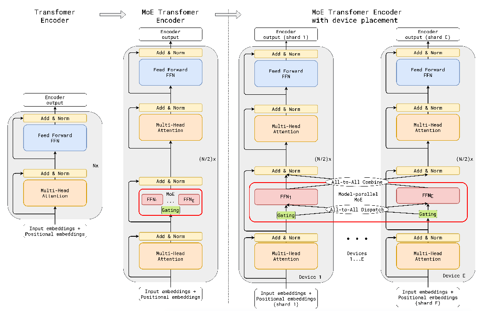

## POSITION-WISE MIXTURE-OF-EXPERTS LAYER

A MoE layer for Transformer consists of
E feed-forward networks FFN1...FFNE, each of which outputs $wo_e$ · ReLU($wi_e$ · $x_s$), where xs
is the input token to the MoE layer, wi and wo being the input and output projection matrices for
the feed-forward layer (an expert) with shapes [M, H] and [H, M], respectively. We choose to let each token dispatched to at most two
experts. 

Load balancing：天真地从softmax概率分布中挑选top-k专家会导致训练负载不平衡问题。大多数代币将被分配给少数专家，使其他专家没有得到充分的培训。 To ensure
the load is balanced, we enforce that the number of tokens processed by one expert is below some
uniform threshold called expert capacity.Assuming N total tokens in a batch and at most two experts
per token, then the expert capacity C is set to be O(N/E). GATE(·) keeps a running counter ce for
how many tokens are dispatched to an expert.When both experts selected by a token already exceed
their capacity, the token is considered as an overflowed token, where $G_{s,E}$ degenerates into a zero
vector. The introduction of
the fixed expert capacity instead of loading balancing functions in Shazeer et al. (2017) allows us to
run parallel execution of gating function as described blow.(梯度怎么算？)

Local dispatching for parallel gating ：Load balancing required the token assignments of one expert
dependent on assignments of the other experts.(top-k?) The original gating function proposed by (Shazeer
et al., 2017) had to be implemented sequentially(向量计算为什么要串行????), especially under the static shape constraints on
TPUs. 在我们的研究中，我们将数千名专家分布在数千台设备上，门控功能的顺序实现（???？）将使大多数设备在大多数时间处于空闲状态。Instead,
we propose a new GATE(·) function that partitions all tokens in a training batch evenly into G
local groups, i.e., each group contains S = N/G tokens for local dispatching. All local groups
are processed independently in parallel.（group内部是串行的？？？） Each group is given a fractional capacity of each expert,
C = 2N/(G · E),(2s/e) to ensure that at most this many tokens are dispatched to an expert. In general,
increasing the expect capacity C decreases the number of overflowed tokens thus improves the model
quality.(减少浪费)Since G × C is a constant（专家容量）, however, the higher capacity leads to smaller number of groups
which hurts the training throughput by limiting the number of parallel gating execution. In this way,
we can ensure that expert capacity is still enforced and the overall load is balanced.（？） With fixed expert
capacity and local dispatching, we are able to speed up the gating function by O(G) times.

Auxiliary loss ：we define a new differentiable auxiliary loss term $l_{aux}$
to enforce the load balancing. It is added to the overall loss function of the model L = $l_{ori}$ +k ∗ $l_{aux}$
with a constant multiplier k, where $l_{aux}$ is defined in line (13) of algorithm 1, and the term $c_e/S$
represents the fraction of input routed to each expert.(不同group的l怎么搞到一起？不同group是数据并行？？？)

We replace the mean square $(c_e/S)^2$ with differentiable approximation $m_e(c_e/S)$, which can provide better numerical stability since it can be
optimized with gradient descent

（e轴做softmax，否则me=1,token是列向量？对列做softmax，将行向量赋给$g_{S,e}$，行向量求均值）（为什么$l_{aux}$有用）

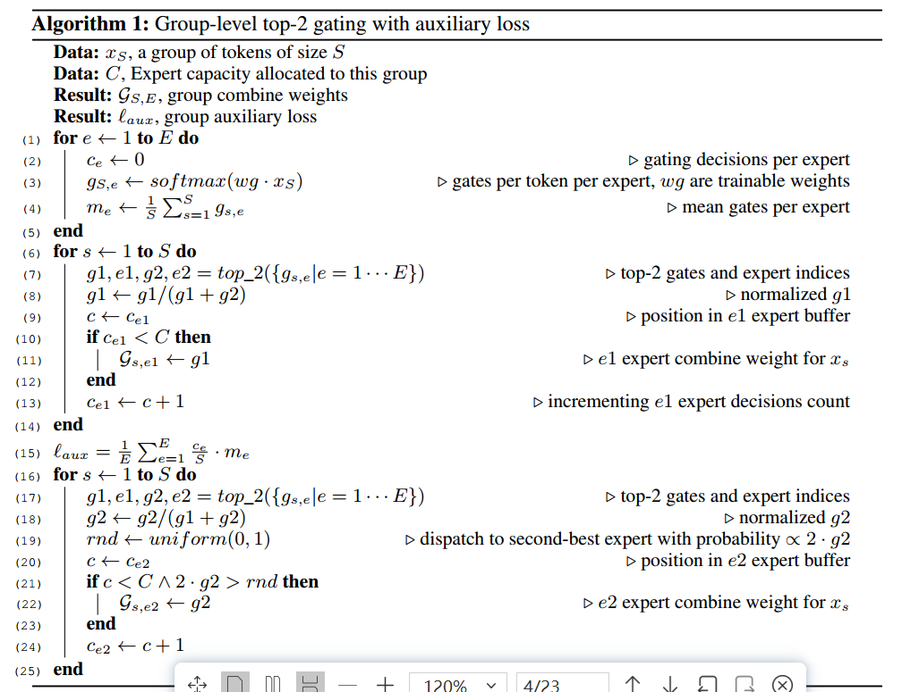

Random routing:If
the weight for the 2nd expert is very small, we can simply ignore the 2nd expert to conserve the
overall expert capacity（？计数器还是加1）.Hence, in addition to respecting the expert capacity constraint, GATE(·)
dispatches to the 2nd-best expert with the probability proportional to its weight g2. We observed
much less overflowed tokens thus better accuracy with random routing for models at the small scale.
We then adopted this approach for our experiments at large scales

# HIGHLY PARALLEL IMPLEMENTATION USING GSHARD

我们的模型实现(算法2)将整个加速器集群视为单个设备，并以独立于集群设置的几个张量操作来表达其核心算法。Top2Gating in Algorithm 2 computes the union（拼在一起？不同group的计算怎么划分） of all group-local GS;E described in the gating Algorithm 1. combine_weights is a 4-D tensor with shape [G; S; E; C], whose element value becomes non-zero when the input token s in group g is sent to expert e at capacity buffer position c. For a specific g and s, a slice combine_weight[g, s, :, :] contains at most two non-zero values.（一个token最多分给两个expert，每个expert最多一个) Binary dispatch_mask is produced from combine_weights by simply setting all non-zero values to 1.

gates=softmax(inputs*wg)(行softmax)(M应该是token维度)

einsum：各自广播缺失的维度，元素乘法，输出缺失的维度求和

[GS,[ME,ME]]

[GS,[ECM,ECM]]

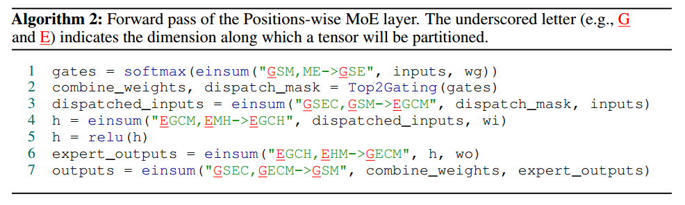

To scale the computation to a cluster with D devices, we choose the number of groups G and the
number of experts E proportional to D. With CE = O(2S) and the number of tokens per group
S independent of D（去掉S,CE=2S), the model dimension M and the feed-forward hidden dimension H, the total number of floating point operations (FLOPS) per device in Algorithm 2:（D=G=E）

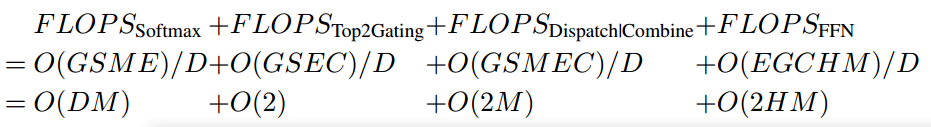

The per device flops for softmax is proportional to D, but in our experiments D ≤ 2H for up to
16K devices so it is less than that of FFN. Consequently the total per-device F LOP S could be considered independent of D, satisfying sublinear scaling design requirements.(?)In addition to the computation cost, dispatching and combining token embedding using AllToAll operators consumed O($\sqrt D$) cross-device communication cost on our 2D TPU cluster. We will discuss the cost analysis and micro-benchmarks for such communication overheads in Appendix section A

当我们将令牌N的数量扩展到数百万，专家E的数量扩展到数千时，由于算法1中张量的大小和计算需求令人生畏，我们必须在许多设备上并行化算法。为了表达并行性，使用GShard api对线性代数计算中的张量进行了分片信息注释，以选择性地指定它们应该如何在设备集群中进行分区。算法2中的下划线字母指定了张量沿哪个维度划分。此分片信息被传播到编译器，以便编译器可以自动应用并行执行的转换。

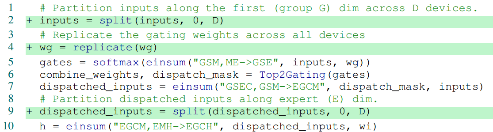

在我们的模型中，注释通常只需要在一些重要的操作符上，比如einsum，编译器使用迭代数据流分析来推断其余张量的分片

#  MASSIVELY MULTILINGUAL, MASSIVE MACHINE TRANSLATION (M4)

我们选择了多语言神经机器翻译(MT) (Firat et al .， 2016;Johnson等，2017;Aharoni等人，2019)来验证我们的设计，以便使用GShard进行有效的训练。我们的基线是每个语言对单独的双语神经机器翻译模型(例如德语到英语的单一模型)，根据每种语言的可用训练数据进行调整1。我们没有显示每个语言对的单独BLEU分数，而是遵循将基线沿x轴放置为零的习惯，并报告使用GShard训练的每个大规模多语言模型的∆BLEU趋势线(见图3)。We also include a variant of dense 96 layer Transformer EncoderDecoder network T(96L) trained with GPipe pipeline parallelism on the same dataset as another
baseline, which took over 6 weeks to convergence on 2048 TPU v3 cores .

我们改变了变压器网络的深度(L)和专家的数量(E)来缩放模型。对于深度，我们测试了三种不同的选项，12(原始Transformer深度，由6个编码器和6个解码器层组成)，36和60层。对于替代其他每个前馈层的专家数量，我们还测试了三种选项，即128、512和2048名专家。请注意，为了简单起见，用于训练的设备数量被固定为等于每层专家的数量。在训练过程中，我们使用float32作为模型权重和激活，以保证训练的稳定性。（baseline也是吗）

## RESULTS

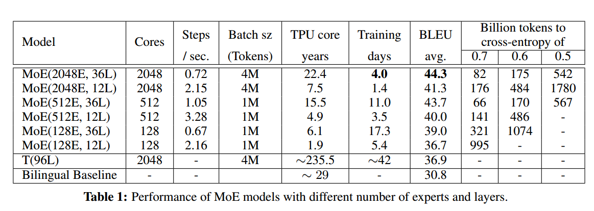

我们训练相应的MoE Transformer模型，直到它看到1万亿(1012)个令牌。此时的模型检查点用于模型评估。到目前为止，我们在任何实验中都没有观察到任何过拟合模式。相反，我们观察到，如果我们继续训练更长时间，训练损失会继续改善。

Here we discuss the implication of each experiment on languages that have large amounts of training
data (high resourced), as well as languages with limited data (low-resource).  In order to improve
the quality for both high- and low-resource languages simultaneously within a single model, scaled
models must mitigate capacity bottleneck issue by allocating enough capacity to high-resource tasks,(?)
while amplifying the positive transfer towards low-resource tasks by facilitating sufficient parameter
sharing.

更深层次的模型带来全面一致的质量收益。当每层专家数量固定时，仅增加深度(L)就会为低资源语言和高资源语言带来一致的收益(沿着y轴向上∆移位)

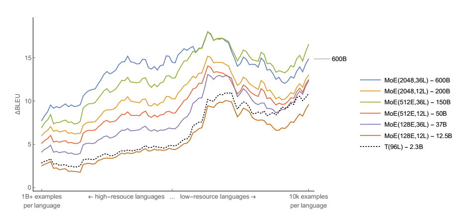

放宽容量瓶颈可以显著提高质量。我们还考虑了三个具有相同深度(12L)的模型，每层的专家数量增加:128、512和2048。尽管质量显著提高，但收益的下降暗示了收益递减的出现。

考虑到超过100种语言，多语言模型在改善低资源任务方面具有明显的优势。相反，对于高资源语言，任务数量的增加限制了模型内的每个任务容量，导致与在单个语言对上训练的模型相比，翻译质量较低。(专精)对于高资源语言，这种任务干扰的容量瓶颈可以通过增加每层专家的数量来缓解。有趣的是，如果容量瓶颈没有得到放松，增加深度并没有多大帮助。对于12层模型，专家数量的增加对于高资源语言会产生更大的收益，而不是之前揭示的低资源语言的收益递减。在增加更多的专家缓解容量瓶颈的同时，由于共享子网的减少，它减少了传输量。缩放深度只有在解决容量瓶颈后才能带来最大的质量收益。

Deep-Dense Models are Better at Positive Transfer towards Low-Resource Tasks. 我们将T(96L)与浅MoE(128E, 12L)模型进行比较。While the gap between the two models measured to be almost constant for the majority of the high-to-mid resourced
languages, the gap grows in favor of the dense-deep T(96L) model as we get into the low-resourced
regime. 根据我们之前的陈述，随着任务间共享子网比例的增加，对于密集T(96L)是100%，用于传输的带宽得到最大化，并产生相对于浅对应的更好的质量。同样的传输质量到低资源的语言也可以实现MoE(128E, 36L)，它有370亿个参数。We conjecture that, increasing the depth might potentially increase the extent of transfer to lowresource tasks hence generalize better along that axis.（在低资源下，深更适合模型迁移）

##  TRAINING EFFICIENCY

更深的模型用更少的样本收敛得更快。研究表明，深度模型在样本效率方面更好，在相同数量的训练样例下达到更好的训练/测试误差。MoE Transformer models with 3 times
the depth need 2 to 3 times fewer tokens to reach the preset training loss thresholds.与MoE(128E, 36L)相比，MoE(128E, 12L)需要3倍的令牌数量才能达到0.7的训练交叉熵。

当我们从128位专家过渡到512位专家时，达到训练损失0.7所需的令牌数量显着下降。 Practically that is
where we observed the capacity bottleneck was residing. After this phase shift, models with ample
capacity tend to exhibit similar sample efficiency characteristics（？）

我们训练的最大的模型之一MoE(2048E, 36L)有6000亿个参数，使用了2048个TPU内核4天。从平均BLEU来看，该模型达到了最好的翻译质量，但也需要22.4 TPU年的训练时间。表1中的结果再次验证了使用条件计算的缩放比密集缩放更实用。考虑到MoE(2048E, 36L)使用的TPU核数相同，密集缩放变体T(96L)似乎需要10倍以上的时间来训练(235 TPU核年)，而与使用GShard训练的模型相比，在模型质量方面落后。

# CONCLUSION

我们应用了GShard，一个深度学习模块，可以自动按规模划分计算，在模型代码中使用轻量级分片注释来扩展MoE Transformer。利用条件计算的缩放模型不仅提高了现实世界机器学习应用的质量，而且在训练过程中保持了实用性和样本效率。我们提出的方法提供了良好的可扩展性/成本权衡，并减轻了对模型特定框架或工具的需求，以扩展大型神经网络。

负载均衡：expert有计数器

# APPENDIX

## RELATED WORK

Nvidia gpu的CUDA (Nickolls等人，2008年)，或者Google tpu的XLA (XLA, 2019年)。这些低级库对于使用这些特殊硬件实现高效率至关重要

TensorFlow (Abadi等人，2016)支持数据并行性，以及通过每个节点设备分配进行图分区的基本模型并行性。Mesh TensorFlow (Shazeer等人，2018)通过在TensorFlow之上重写Python库中的计算，帮助用户使用spmd风格的每算子分区构建大型模型。

## THE XLA SPMD PARTITIONER FOR GSHARD

Sharding注释告诉编译器每个张量应该如何在设备之间分布。SPMD(单程序多数据)分区器(简单来说是“分区器”)是一个编译器组件，它将计算图转换为一个程序，以便在所有设备上并行执行。这使得编译时间几乎与分区数量无关，这允许我们扩展到数千个分区。

我们在XLA编译器XLA(2019)中实现了分区器。包括TensorFlow, JAX, PyTorch和Julia在内的多个前端框架已经有了将其图形表示转换为XLA HLO图形的降低逻辑。与流行的前端框架(如TensorFlow)相比，XLA的操作符集也要少得多，这减少了实现分区器的负担，同时又不损害通用性，because the existing lowering from frontends performs the heavy-lifting to make it expressive。虽然我们在XLA中开发了基础设施，但我们在这里描述的技术可以应用于其他机器学习框架中的中间表示(例如，ONNX onn (2019)， TVM Relay Roesch等(2018)，Glow IR Rotem等(2018))。

XLA将计算建模为数据流图，其中节点是操作符，边是在操作符之间流动的张量。分区器的核心是每个操作处理，它根据输入和输出上指定的分片将完整大小的操作符转换为分区大小的操作符。在对计算进行分区时，引入了各种跨设备数据传输模式。为了在大范围内最大化性能，必须定义一组核心通信原语，并针对目标平台对其进行优化。

GShard only requires the user to annotate a few key tensors in the model, and the compiler will
propagate them to all tensors on the graph in an optimization pass. 

分区器的核心是根据指定的分片将全尺寸的操作符转换为分区大小的操作符。

每个操作数(LHS或RHS)由三种类型的维度组成:

在所有LHS、RHS和输出中必须存在相同的批尺寸集合

Contracting dimensions only exist in the operands. LHS and RHS must have the same set
of contracting dimensions, and they are summed up and collapsed in the output.

每个LHS和RHS都有自己的一组非收缩维度，这些维度由输出继承。

Sharding propagation prioritizes choosing the same sharding on batch dimensions of LHS, RHS and
output, because that would avoid any cross-partition communication. 

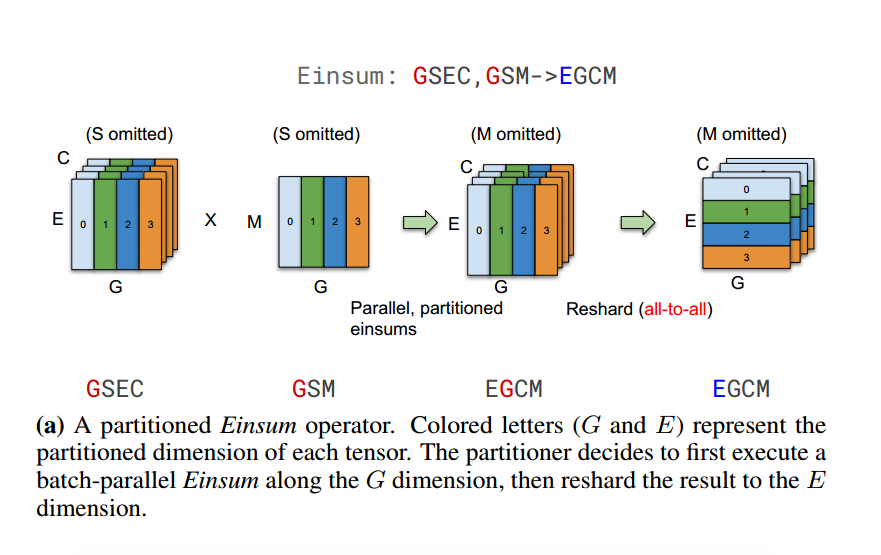

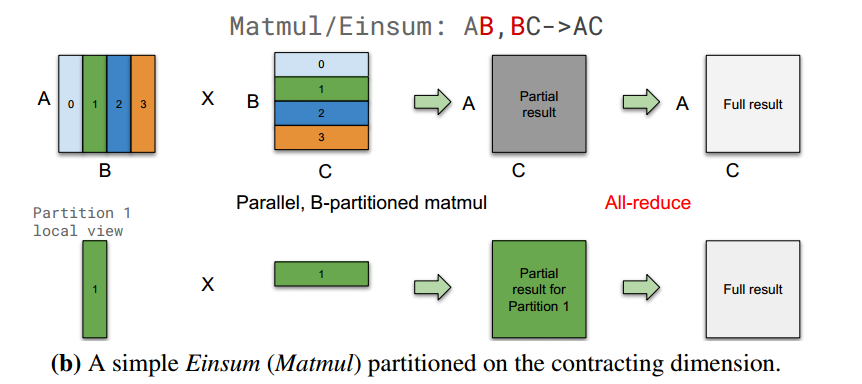

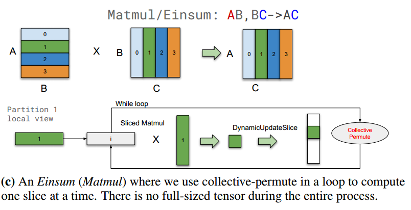

复制其中一个操作数不会导致冗余计算，但它要求复制的操作数适合设备内存。因此，如果操作数的大小太大，我们将保留两个操作数分区，并使用循环迭代结果的每个切片，并使用CollectivePermute来通信输入切片(图5c)。

除了2.2节中列出的用于分片的两个常见api(复制()和split())之外，用户或编译器可以使用更高级的分片策略来最小化数据传输。shard(张量，device_assignment)注释要用提供的设备分配进行分区的张量，并返回注释的张量。a 3D tensor with shape [256; 1024; 8192] with device
assignment shape [2; 1; 4] will have partition shape [128; 1024; 2048], and the order of elements in
device assignment determines which slice each partition occupies.

##  PERFORMANCE AND MEMORY CONSUMPTION

当我们增加设备和专家的数量时，设备内存消耗大致不变，并且步长时间呈次线性增长，即当我们将模型从128个设备扩展到2048个设备时，执行时间增加了1.7倍。

在GShard模型中，主要有三种类型的内存使用，当专家数量增加时，在SPMD分区之后，所有这些类型的每个设备大小都是恒定的。

•复制权重(例如变压器前馈层)。

•分布式权重(MoE前馈层6)。

•激活(每一层的输出，用于向前和向后传递)。

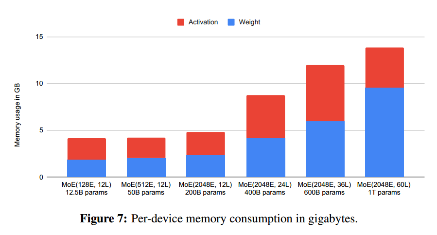

在层数固定的情况下，当专家数量增加时，权重记忆和激活记忆都保持不变。权重存储器和激活存储器都随层数线性扩展。When the memory requirement exceeds available memory on each device, compiler-based rematerialization will automatically recompute part of the activations in the backward pass in order
to reduce peak activation memory. 这就是MoE(2048E, 60L)的激活大小比MoE(2048E, 36L)小的原因。

图8显示了MoE层及其相邻的Transformer层的执行时间分解。It also compares the achieved performance to a roofline, which is estimated by assuming compute-,
memory-, or communication-bounded operations can achieve 100% of the peak FLOPS, memory
bandwidth, or interconnect bandwidth.在较小的规模(128名专家)下，我们的模型可以实现> 70%的屋顶线性能。当我们将模型缩放到16倍大(2048名专家)时，设备时间增加了1.7倍，并且仍然可以达到48%的性能。

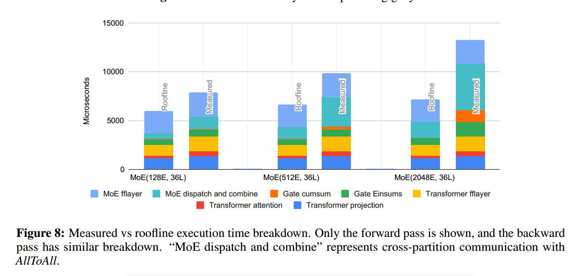

当专家数量从128人增长16倍到2048人时，执行时间增加约3.75倍，他们在MoE和Transformer中的执行时间比例从16%增加到36%。

在TPU上的AllReduce有一个独立于设备数量的执行时间.图9中的差异是由于每个拓扑的具体情况，例如，它是正方形还是矩形，以及它是环面还是网格。随着分区数量的增加，AllToAll的开销会越来越大，但是是以次线性的方式。

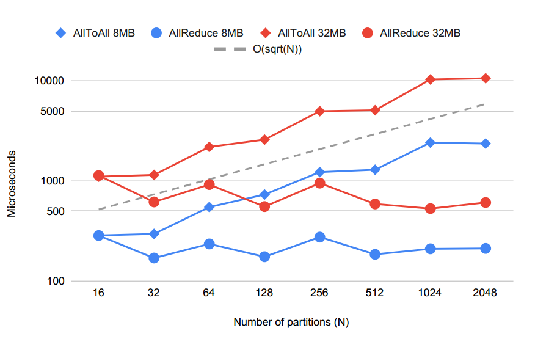

the
total amount of data that all partitions send is d = O(D). Meanwhile, each data piece needs to travel
h = O($\sqrt D$) hops on average(?), and there are overall l = O(D) device-to-device links in the network.

表2中的大多数操作符在计算和通信方面都具有次线性可伸缩性，这与我们对MoE模型的性能度量一致。但是，表2中的最后两个Matmul操作符对每个分区的计算和通信具有0 (D)缩放，它们在操作数中具有不匹配的分片。这不是由于分区算法效率低下，而是因为全运算符的总计算量非常大(O($D^2$))。

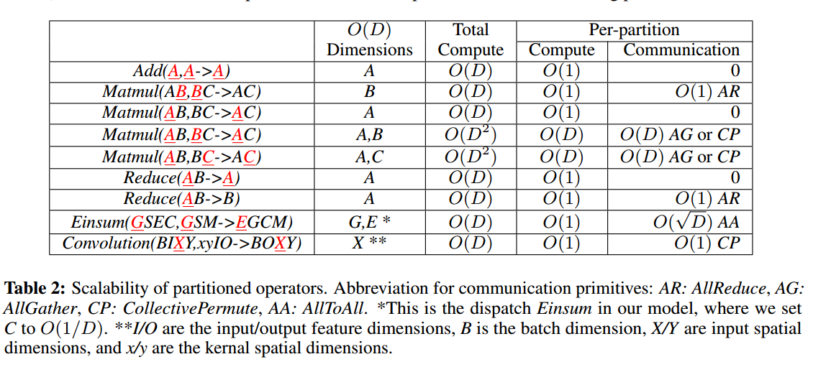

## DENSE MODEL SCALABILITY AND BENCHMARKS

GShard并不局限于稀疏模型。在本小节中，我们应用GShard构建了具有多达数万亿个参数的大型密集变压器。GShard允许一个以上维度的张量分区。例如，我们沿着批处理和模型维度拆分激活张量。这允许使用长序列长度(基准测试中为1024)和小于设备数量的全局批大小的输入批。性能从64B到1T呈线性增长。当进一步扩展到4T时，通信瓶颈开始占主导地位，因为小批量大小导致计算/通信比率较低。当我们进一步增加模型尺寸时，激活存储成为瓶颈，因为变压器层之间的激活仅在批量维度的设备网格中部分分片。
