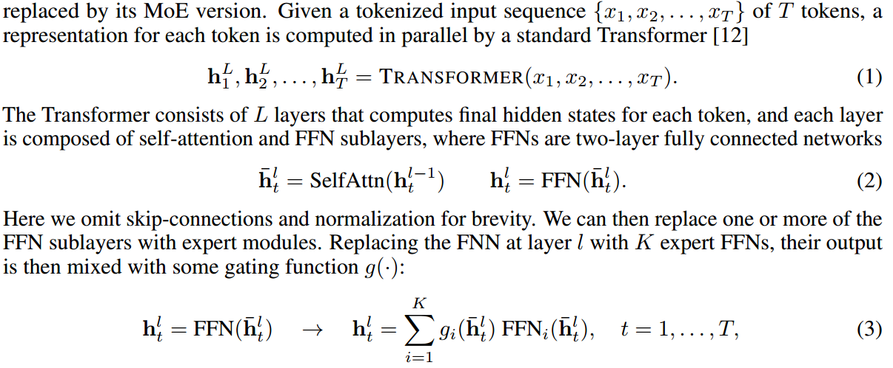
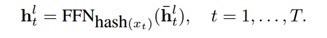
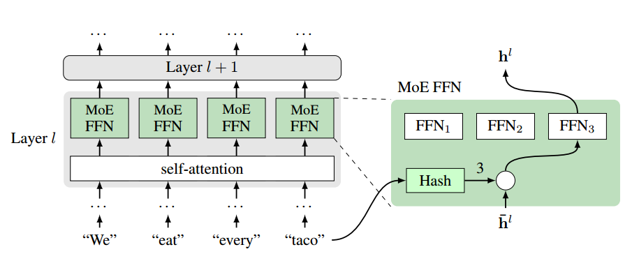
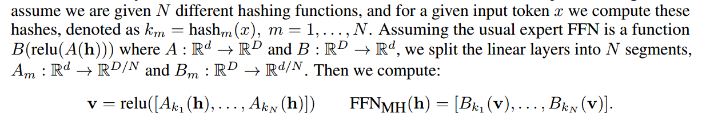

# Abstract

We investigate the training of sparse layers that use different parameters for different
inputs based on hashing in large Transformer models. Specifically, we modify the
feedforward layer to hash to different sets of weights depending on the current token,
over all tokens in the sequence.我们表明，该过程优于或竞争于学习到路由的混合专家方法，如开关变压器和基础层，同时不需要路由参数或目标函数中的额外条款，如负载平衡损失，也不需要复杂的分配算法。We study the performance of different hashing techniques,
hash sizes and input features, and show that balanced and random hashes focused
on the most local features work best, compared to either learning clusters or using
longer-range context. We show our approach works well both on large language
modeling and dialogue tasks, and on downstream fine-tuning tasks.

# Introduction

MoE models allow increasing the number of parameters in
the model while holding steady the number of computations that affect a given sample.

密集的softmax要求所有专家模块在训练时间运行在所有数据点上，这就抵消了计算节省。一些研究表明，在训练过程中可以保持稀疏性，例如[9,7,8,10]。特别是，Switch transformer[8]在令牌的隐藏状态上使用softmax来选择每个令牌的顶级专家，但在目标函数中需要一个负载平衡项，否则它们可能变得不平衡或退化，结果很差。基础层[10]采用线性分配算法来尝试解决相同的问题。

由于该路由策略不需要额外的参数，不需要改变目标函数和分配算法，因此具有鲁棒性、快速性和易于实现的特点。我们提供了详细的分析来解释为什么我们的方法有效，以及在哪些条件下有效。考虑到当训练非常大的模型时，给定所需的计算预算，通常只有一次射击，并且实验者将无法尝试许多参数选择，因此我们主张我们的方法作为这种设置的强大候选。

# Background

我们使用与[11,8,10]相同的设置，其中Transformer中的前馈网络(FFN)被其MoE版本取代。

由于专家FFN不共享参数，参数的数量随着K的增加而增加，而如果MoE FFN只路由到单个专家，则每个输入令牌的计算量保持不变，并且gi的计算成本很低。虽然这允许用较小的计算预算训练大容量模型，但在稀疏设置中优化gi可能会很棘手。

# Method

在本文中，我们提出了一种简单的门控机制，由于只有一个专家是活跃的，并且它没有路由网络参数需要学习，因此特别有效。最近的工作[11,8,10]必须学习基于隐藏状态确定专家模块路由的参数，这些参数必须与专家权重本身一起优化。This can potentially cause difficulty
because during training membership for each expert is changing while it is trying to learn the mapping for those members.相反，我们主张对专家进行固定的映射。也就是说，通过将令牌散列到固定数量的桶中，每个桶对应一个专家:

虽然FFN仍然接受隐藏状态¯h l t作为输入，但我们的路由函数使用原始输入令牌xt而不是隐藏状态，参见图1的图形描述。我们可以从各种可能的哈希函数中自由选择，我们将在下面考虑。然而，出于训练目的，哈希函数是预先固定的，这样，我们的路由机制不需要训练，也没有可调整的参数。

在我们的工作中，我们通常使用预先计算的哈希函数，它在学习期间使用查找表(预先计算)将令牌映射到专家模块。

最简单的是随机哈希，其中我们在初始化时将每个令牌分配给固定的随机专家。由于令牌频率(?不同token出现的频率不同)的Zipfian分布，这自然会产生不同专家模块之间的不平衡。由于之前已经证明平衡对于训练MoE模型很重要[8,10]，我们也考虑了平衡分配。In this method, we build the lookup table
before training the model using the training data distribution by greedily assigning the most frequent
tokens to the emptiest buckets. The resulting assignment structure is significantly more balanced than
Random Hashing, but not perfect, as the frequency of some tokens exceeds the ideal distribution.（不一定完美符合分布）

Random and Balanced hashing exploit the inductive bias（？） of auto-regressive models and hash on the
input token, but we also consider other possibilities: Bigram Hash uses the current and previous
token (xt−1, xt) rather than only the current token, while Previous Token Hash uses the previous
token xt−1, ignoring the current input. We also consider a sanity check which hashes based on the
Position in the sequence, which we expect to have little impact, as absolute positions carry little
information in natural language. Each of these hash functions is used to assess the value of the
information being routed-on in our subsequent experimental analysis.

As an upper baseline, we also evaluate using an Oracle Future Hash, which hashes based on the
output token xt+1（下一个token), rather than input token. This Oracle Hash checks how powerful routing decisions
can be in solving a task. Similarly, we also consider Predicted Future Token Hash, which utilizes a
baseline Transformer to make a prediction of the output token, and then hashes over this prediction.

Based on the intuition that similar tokens may want to be routed to the same
expert, we also experiment with Clustered Hashes. We obtain clusters by performing k-means
clustering with a fixed number of clusters using token embeddings from a baseline Transformer
model. Each expert is assigned a centroid, and tokens are assigned to their closest cluster.

We also consider the opposite hypothesis: that similar-tokens should be placed
in different buckets, where the assumption is that very similar tokens need fine distinctions which
requires more model capacity (hence assigning to different experts). To do this, we use the same
k-means clusters as before, but distribute all tokens within each cluster equally across all buckets.

在标准FFN MoE方法中，所有K个专家模块都有独立的参数，但这里我们考虑另一种选择。众所周知，在哈希文献中，多个哈希可以在许多上下文中提供更好的分配[14]。我们在稀疏路由的背景下考虑这类方案。

(通过不同哈希选不同参数向量)

也就是说，使用散列来选择我们将用于每个段的参数，然后将它们连接在一起。这样做的好处是，我们现在不再依赖于单个哈希函数的质量，而是有很多机会产生高质量的分区。这或许也可以看作是类似于《变形金刚》中使用的多头注意力过程。

# Related Work

这项工作中的方法与所有这些方法不同，因为作业不使用任何学习，而是利用自然语言设置中可能的归纳偏差。

我们的工作也与线性模型和核方法中的特征哈希有关[23,24]，其中单词或n-gram特征被哈希以提供新的低维特征空间。[23]表明，在执行这种特征哈希时，随机子空间之间的相互作用大概率可以忽略不计。[25]使用哈希来压缩神经网络，而不是像我们在这里那样增加它们的参数。长上下文变压器的工作最近使用哈希技术通过稀疏的自关注模式来加速对远程令牌历史的访问，特别是在路由变压器[26]和转换器[27]中。相比之下，我们的工作使用散列通过稀疏路由访问大量参数，而不是稀疏访问输入特征。（？）

# Experiments

We find Hash Layers outperforming Switch on both datasets by about 0.4-0.5 perplexity.

Hash和Switch稀疏模型都优于它们所基于的密集基线(222M参数)，以及更宽的变压器(755M参数)。然而，深层变压器(755M参数)优于具有相似参数数量的稀疏模型。然而，我们注意到，由于它的密集而不是条件计算，它在推理速度上较慢。我们认为这是一个普遍的趋势:好的密集模型可以从相同数量的参数中获得比稀疏模型更多的能量。然而，稀疏模型虽然更浪费内存，但在相同的速度下提供了更好的困惑(即，在这种情况下，我们应该与Baseline Transformer进行比较，它们具有大致相同的计算量)。

对于较小数量的模块，Hash和Switch的执行类似，但随着模块数量的增加，差距越来越大。对于少量模块，我们假设学习路由(如Switch所做的)对于这些选择的性能更重要，但对于大量模块，许多路由选择都可以工作。（优势在哪？）

因此，哈希层在这种情况下可以很好地工作，学习路由变得不那么重要了。

我们还进行了实验，以找到稀疏路由发生的最佳分层位置。在图3(右)中，我们绘制了64模块哈希层的困惑度，放置在解码器的不同层上。我们发现后面的层表现更好，但即使是最差的选择(第1层)与其他基线相比仍然表现良好。假设条件计算提供了进行细粒度专门化的能力，那么在首先提取更明显的特征之后，进行这些区分是值得的。

我们发现固定随机分配(第3行)和平衡分配(第2行)在困惑度(23.22 vs. 23.16有效困惑度)方面表现相似。然而，平衡分配，顾名思义，更平衡，见图4，这可能使它在分布式训练方案方面更有效。

有趣的是，使用基于集群的哈希(“令牌集群”，第4行)的性能明显比随机哈希差(23.90 vs. 23.22)。我们假设，如果条件计算的目标是做出细微的区分，那么这些区分更有可能出现在同一集群中的令牌之间，因此它们应该在不同的哈希(计算图的一部分)中，而不是在同一个哈希中。我们通过在令牌集群内散列(“分散散列”，第5行)提供了部分证据，这将性能恢复到与随机相似

基于位置的哈希函数我们仅基于序列位置进行实验哈希。

我们认为这个实验是一个完整性检查，我们没有期望根据输出序列中的位置选择条件计算来帮助。实际上，结果证明这并不比密集的Transformer基线更好。因此，基于输入内容的路由似乎更为重要。

# 。

通过不同哈希选不同参数向量，拼接

