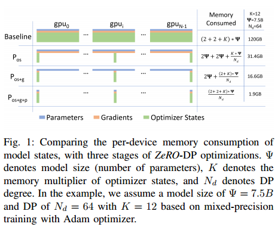
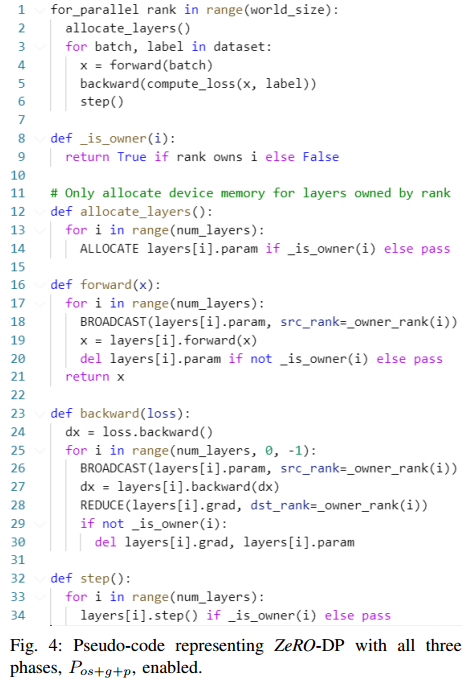
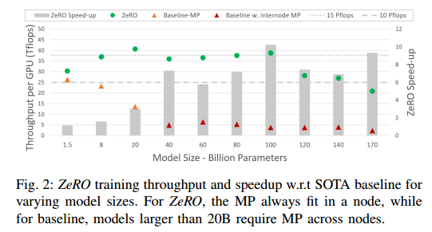
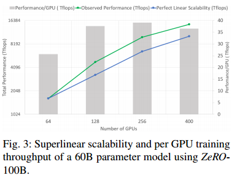

# ABSTRACT

现有的解决方案，如数据和模型并行，在获得计算、通信和开发效率的同时，在将这些模型适应有限的设备内存方面表现出基本的局限性。我们开发了一种新颖的解决方案，零冗余优化器(Zero)，以优化内存，大大提高了训练速度，同时增加了可以有效训练的模型大小。ZeRO消除了数据和模型并行训练中的内存冗余，同时保持了低通信量和高计算粒度，使我们能够以持续的高效率按比例缩放模型大小。我们对内存需求和通信量的分析表明:使用当今的硬件，ZeRO有可能扩展到超过1万亿个参数。模型尺寸增加了8倍，可实现性能增加了10倍。在可用性方面，ZeRO可以训练多达13B个参数的大型模型(例如，比威天GPT 8.3B和T5 11B更大)，而不需要模型并行性。研究人员利用ZeRO的系统突破创建了图灵- nlg，这是当时世界上最大的语言模型(17B个参数)，其准确性打破了纪录。

# EXTENDED INTRODUCTION

基本数据并行性(DP)不会减少每个设备的内存，runs out of memory for models with more than 1.4B parameters on GPUs with 32 GB memory when trained using common settings like mixed precision and ADAM optimizer。Pipeline Parallelism (PP)， Model Parallelism (MP)（tensor?)， CPU-Offloading等，在功能，可用性以及内存和计算/通信效率之间进行权衡，所有这些都对速度和规模的训练至关重要。

目前文献中最大的模型，11B T5模型[5]和MegatronLM 8.3B[4]，都是由模型并行性驱动的，分别在Mesh-Tensorflow[7]和Megatron-LM[4]中实现。然而，MP不能扩展到超出这些模型大小的范围。MP垂直拆分模型(tensor?)，将每一层的计算和参数跨多个设备划分，要求每一层之间进行大量通信。因此，它们在gpu间通信带宽高的单个节点内工作良好，但在单个节点之外效率会迅速下降[4]。

首先分析了现有系统在模型训练上的全部内存消耗，并将其分为两部分:1)对于大型模型，大部分内存被模型状态占用，其中包括优化器状态(如Adam[6]中的动量和方差)、梯度和参数。2)剩余的内存被激活、临时缓冲区和不可用的碎片内存所消耗，我们将其统称为剩余状态。我们开发了ZeRO - （ZeRO冗余优化器）-在获得高计算和通信效率的同时，优化内存效率。

## Optimizing Model State Memory

模型状态通常在训练过程中消耗最大的内存，但是现有的方法(如DP和MP)并不能提供令人满意的解决方案。DP具有良好的计算/通信效率，但内存效率较差，而MP具有较差的计算/通信效率。更具体地说，DP在所有数据并行进程中复制整个模型状态，导致冗余内存消耗;MP对这些状态进行分区以获得较高的内存效率;但通常会导致过于细粒度的计算和昂贵的通信，从而降低扩展效率。（tensor）所有这些方法都静态地维护整个训练过程中所需的所有模型状态，即使在训练过程中并非所有模型状态都是必需的。我们开发了ZeRO-DP，零功率数据并行，在实现DP的计算/通信效率的同时实现MP的内存效率。ZeRO-DP通过划分模型状态而不是复制模型状态来消除数据并行进程之间的内存状态冗余，并在训练期间使用动态通信调度保留DP的计算粒度和通信量，从而保持计算/通信效率。

ZeRO-DP has three main optimization stages (as depicted in Figure 1), which correspond to the partitioning of optimizer states, gradients, and parameters (Sec. V). When enabled
cumulatively:

1) Optimizer State Partitioning (Pos): 4x memory reduction, same communication volume as DP;
2) Add Gradient Partitioning (Pos+g): 8x memory reduction, same communication volume as DP;
3) Add Parameter Partitioning (Pos+g+p): Memory reduction is linear with DP degree Nd. For example, splitting across 64 GPUs (Nd = 64) will yield a 64x memory reduction. There is a modest 50% increase in communication volume.

ZeRO-DP消除了内存冗余，并使集群的全部聚合内存容量可用。

## Optimizing Residual State Memory

After ZeRO-DP提高了模型状态的内存效率，临时缓冲区和不可用的内存片段可能成为次要内存瓶颈。我们开发了ZeRO-R来优化这三个因素分别消耗的剩余内存。

1)对于激活(在向前传递期间存储以便执行向后传递)，我们注意到检查点[8]有帮助，但对于大型模型来说是不够的。ZeRO-R optimizes activation memory by identifying and removing activation replication in existing MP approaches through activation partitioning. It also offloads activations to CPU when appropriate

2) ZeRO-R为临时缓冲区定义合适的大小，以达到内存和计算效率的平衡。
3) We observe fragmented memory during training due to variations in the lifetime of different tensors. 由于碎片导致的连续内存缺乏可能导致内存分配失败，即使有足够的空闲内存可用。ZeRO-R基于张量的不同生命周期主动管理内存，防止内存碎片。

ZeRO- dp和ZeRO- r结合在一起形成了一个强大的深度学习记忆优化系统，我们统称为ZeRO。

由于ZeRO消除了DP中的内存效率低下，因此很自然地要问:我们还需要MP吗?什么时候需要?ZeRO如何与MP一起工作?With ZeRO, MP becomes a less attractive option for the purpose of fitting large models alone.在减少每个设备的内存占用方面，ZeRO-DP至少与MP一样有效，有时在MP不能平均划分模型时更有效。它还具有相当或更好的缩放效率。此外，数据并行性非常容易使用，广泛适用于不同的工作负载，而今天的MP方法通常需要模型开发人员进行一些工作来修改他们的模型，系统开发人员需要计算出分布式操作符，而像Megatron-LM这样的现有工作只支持有限的一组操作符和模型。

话虽如此，我们仍然希望利用MP: i)当与ZeRO-R一起使用时，MP可以减少非常大的模型的激活内存占用。ii)对于较小的模型，激活内存不是问题，当单独使用DP的聚合批处理大小太大而无法具有良好的收敛性时，MP也可以有好处在这种情况下，可以将ZeRO与MP结合起来，使模型具有可接受的聚合批大小。（DP并行度大时，批太大）

We show that ZeRO can be combined with MP, resulting in a max theoretical memory reduction of Nd×Nm times on each device with a DP degree of Nd and MP degree of Nm.这允许我们在1024个gpu上使用16路模型并行性(在每个DGX2节点内)和跨节点的64路数据并行性拟合一个万亿参数模型，并使用适度的批处理大小有效地运行它

## Implementation & Evaluation

The complete set of optimizations in ZeRO could allow us to run models with trillion parameters on the high-end hardware cluster today。however, the hardware compute capacity is still too limited and training time can be impractically long(>1 year).our focus for this implementation is to efficiently support models with 10x parameters (∼100B
parameters) than state-of-the-art (SOTA) while still being within reach of the compute capabilities of current hardware.（最好模型的10倍）

我们在ZeRO中实现并评估了一个名为ZeRO- 100b的优化子集，即Pos+g的ZeRO- dp加上ZeRO- r，这使我们能够实现这一目标。

现有系统如单独使用威震天，无法高效扩展超过20B参数。与SOTA相比，模型大小增加了8倍以上。

对于相同的模型大小，这比SOTA的训练速度提高了10倍以上。

当我们将gpu数量增加一倍时，性能会增加一倍以上。这是ZeRODP的一个属性，当我们增加DP度时，它减少了模型状态的内存占用，使我们能够适应每个GPU更大的批处理大小，从而获得更好的性能。

ZeRO-100B使数据科学家能够训练具有多达13B个参数的模型，而无需任何需要模型重构的MP或PP。（只要DP)现有系统(例如PyTorch分布式数据并行)使用1.4B参数模型时会耗尽内存。

ZeRO超越了Turing-NLG[10]，后者是当时最大的语言模型，拥有17B个参数和破纪录的精度。

We share ZeRO as a part of our open source DL training optimization library — DeepSpeed

# RELATED WORK

## Data, Model and Pipeline Parallelism

每个进程在不同的数据样本子集上执行前向和后向传播，并使用进程间的平均梯度在本地更新模型。当模型不适合设备内存时，模型并行性(MP)[7]、[4]、[11]和流水线并行性(PP)[12]、[13]分别以垂直和水平的方式将模型拆分到进程之间。(?)

PP splits a model horizontally across layers running each partition on a different device and use micro-batching to hide the pipeline bubble. Model functionalities such as tied-weights and batch-normalization are difficult to implement due to horizontal splitting and micro-batching, respectively.G-pipe[12]对模型参数和总激活进行分区，但需要与管道分区数量成比例的批大小来隐藏管道气泡。大的批处理大小会影响收敛速度，同时还需要大量内存来存储激活。PipeDream中，PP的另一种实现[14]保留了过期参数的多个副本在不显著增加批处理大小的情况下隐藏管道气泡，从而降低内存效率。此外，实现不等同于标准的深度学习训练，并且对训练收敛有影响。 In contrast, ZeRO obtains the same or better memory efficiency than PP without incurring functionality, performance and convergence related restrictions of PP

## Non-parallelism based approach to reduce memory

1)减少激活内存:通过压缩[15]、激活检查点[8]、[16]或实时分析[17]来减少激活的内存占用。这些努力是互补的，可以与ZeRO一起工作。实际上，ZeRO-R中的激活内存减少与激活检查点并行工作(?)

2) CPU卸载:[18]、[19]利用当今计算节点的异构特性，分别通过算法设计、虚拟化内存将模型状态卸载到CPU内存。高达50%的训练时间可以花在GPU-CPU-GPU传输上[18]。ZeRO的不同之处在于，它在不将模型状态存储到CPU内存的情况下显著减少了内存消耗，CPU内存的带宽由于PCI-E而受到严重限制。在极少数情况下，ZeRO-R可能会卸载非常大的模型的激活检查点，以提高性能(详细信息请参见第VI-A节)。[20]使用图形重写来卸载激活到CPU内存，但不减少模型状态所需的内存。
3) Memory Efficient Optimizer:[21]，[22]侧重于通过保持模型参数和梯度的粗粒度统计来减少自适应优化方法的内存消耗，这对模型收敛保证有潜在的影响。ZeRO与这些努力是正交的，它的优化不会改变模型优化方法或影响模型收敛，而是有效地减少优化器状态和每个设备的梯度的内存占用。

##  Training Optimizers

自适应优化方法[23]，[6]，[24]，[25]对于实现SOTA性能和准确性对于大型模型的有效模型训练至关重要。与SGD相比，通过为每个模型参数和梯度维护细粒度的一阶和二阶统计信息，以消耗大量内存为代价。ZeRO可以在数量级上减少这些优化器的内存占用，使这些复杂的优化方法适用于在具有适度设备内存的硬件上训练大型模型。它还使开发和使用更复杂、更需要内存的优化器成为可能，这些优化器可能具有更好的收敛性。

#  WHERE DID ALL THE MEMORY GO?

## Model States: Optimizer States, Gradients and Parameters

大部分设备内存在训练期间被模型状态消耗。以Adam[6]为例，他是最流行的深度学习训练优化器之一。Adam需要存储两个优化器状态，i)时间平均动量和ii)梯度方差来计算更新。要用ADAM训练模型，必须有足够的内存来保存梯度的动量和方差的副本。此外，还需要有足够的内存来存储梯度和权重本身。在这三种类型的参数相关张量中，优化器状态通常消耗最多的内存，特别是在应用混合精度训练时

在当前一代NVIDIA gpu上训练大型模型的最先进方法是通过混合精度(fp16/32)训练[26]，其中参数和激活被存储为fp16，从而能够在这些gpu上使用高吞吐量张量核心单元[27]。在混合精度训练中，前向和后向传播都使用fp16权值和激活来执行。However, to effectively compute and apply the updates at the end of the backward propagation, the mixed-precision optimizer keeps an fp32 copy of the parameters as well as an fp32 copy of all the other optimizer states.

使用Adam对具有Ψ参数的模型进行混合精度训练，需要足够的内存来保存参数和梯度的fp16副本，内存需求分别为2Ψ和2Ψ字节。此外，它还需要保存优化器状态:参数、动量和方差的fp32副本，内存需求分别为4Ψ、4Ψ和4Ψ字节。让我们使用K来表示优化器状态的内存乘数，也就是说，存储它们所需的额外内存是KΨ字节。混合精度亚当的K = 12。这导致2Ψ+2Ψ+KΨ = 16Ψ字节的内存需求。对于具有1.5亿个参数的GPT-2这样的模型，这将导致至少24gb的内存需求，这远远高于仅保存fp16参数所需的微薄的3gb内存。

## Residual Memory Consumption

激活检查点(或激活重计算)是一种常用的方法，可以将激活内存减少大约为总激活的平方根，而代价是33%的重新计算开销[8]。尽管激活内存显著减少，但对于更大的模型，即使使用激活检查点，激活内存也会增长得相当大。

Operations such as gradient all-reduce, or gradient norm computation tend to fuse all the gradients into a single flattened buffer before applying the operation in an effort to improve throughput. For example, the bandwidth of all-reduce across devices improves with large message sizes. While the gradient themselves are usually stored as fp16 tensors, the fused buffer can be an fp32 tensor depending on the operation.

当训练非常大的模型时，我们观察到明显的内存碎片，在某些极端情况下，超过30%的内存仍然可用，从而导致内存不足问题。

# ZeRO: INSIGHTS AND OVERVIEW

ZeRO能够在保持效率的同时减少内存占用。效率是这里的关键:如果没有这个约束，将所有参数状态移动到CPU内存或任意增加MP度等简单的解决方案可以减少内存占用

## Insights and Overview: ZeRO-DP

ZeRO powered DP is based on three key insights:
a) DP has better scaling efficiency than MP because MP reduces the granularity of the computation while also increasing the communication overhead.(tensor) Beyond a certain point, lower computational granularity reduces the efficiency per GPU, while the increased communication overhead, hiders the scalability across GPUs, especially when crossing node boundaries. On the contrary, DP has both higher computational granularity and lower communication volume, allowing for much higher efficiency.

b) DP是内存效率低下的，因为模型状态被冗余地存储在所有数据并行进程中。相反，MP对模型状态进行分区以获得内存效率。

c) DP和MP都保留了整个训练过程中所需的所有模型状态，但并非所有状态都是必需的。例如，每层对应的参数只在层的正向传播和反向传播时才需要。

基于这些见解，ZeRO-DP在保持DP的训练效率的同时，实现了MP的记忆效率。ZeRO-DP划分模型状态，而不是复制它们(第V节)，并使用动态通信调度，利用模型状态的内在时间性质，同时最小化通信量(第VII节)。ZeRO-DP reduces per-device memory
footprint of a model linearly with the increased DP degree
while maintaining the communication volume close to that of
the default DP, retaining the efficiency.

## Insights and Overview: ZeRO-R

a) MP partitions the model states but often requires replication of the activation memory. For example, if we split
the parameters of a linear layer vertically and compute them
in parallel across two GPUs, each GPU requires the entire
activation to compute its partition

b)对于GPT-2或更大的模型，算法强度(每次迭代计算量与每次迭代激活检查点数量的比率)非常大(≥10K)，并且随着隐藏维数的增加而线性增加，即使在带宽较低的情况下，也可以隐藏激活检查点的数据移动成本。

ZeRO removes the memory redundancies in MP by partitioning the activations checkpoints across GPUs, and uses allgather to reconstruct them on demand. 激活内存占用与MP程度成比例地减少。对于非常大的模型，ZeRO甚至可以选择将激活分区移动到CPU内存中，同时由于这些模型中的算术强度很大，仍然可以获得良好的效率

ZeRO-R使用恒定大小的缓冲区来避免临时缓冲区随着模型大小的增加而膨胀，同时使它们足够大以保持效率。

内存碎片是短期和长期内存对象之间交错的结果。在向前传播期间，激活检查点是长期存在的，而重新计算的激活是短期存在的。同样，反向计算，激活梯度是短期的，而参数梯度是长期的。（激活梯度用于计算后序参数梯度，参数梯度用于更新）基于这一见解，ZeRO通过将激活检查点和梯度移动到预分配的连续内存缓冲区来执行动态内存碎片整理。这不仅增加了内存可用性，而且还通过减少内存分配器查找空闲连续内存所需的时间来提高效率

# DEEP DIVE INTO ZeRO-DP

ZeRO-DP eliminates this memory redundancy by partitioning
them — optimizer states, gradients and parameters — across
data parallel processes. 

## Pos : Optimizer State Partitioning

For a DP degree of Nd, we group the optimizer states into
Nd equal partitions, such that the ith data parallel process only updates the optimizer states corresponding to the i
th partition。Thus, each data parallel process only needs to store and update 1/Nd of the total optimizer states and then only update 1/Nd of the parameters. （要用到别人的数据？）We perform an all-gather(gather-复制) across the data parallel process at the end of each training step to get the fully updated parameters across all data parallel process（部分优化器对应部分更新参数，需要合一起）

when Nd is large, the memory requirement on model states reduces from 4Ψ + 12Ψ = 16Ψ bytes to 4Ψ + 12Ψ/Nd ≈ 4Ψ bytes, leading to a 4x reduction.

## Pg: Gradient Partitioning

As each data parallel process only updates its corresponding
parameter partition, it only needs the reduced(减少？归约) gradients for the corresponding parameters. Therefore, as each gradient of each layer becomes available during the backward propagation, we only reduce（归约） them on the data parallel process responsible for updating the corresponding parameters. After the reduction we no longer need the gradients and their memory can be released. This reduces the memory footprint required to hold the gradients from 2Ψ bytes to 2Ψ/Nd

Effectively this is a Reduce-Scatter operation, where gradients corresponding to different parameters are reduced to
different process. To make this more efficient in practice, we use a bucketization strategy, where we bucketize all the gradients corresponding to a particular partition, and perform reduction on the entire bucket at once. （？）This is similar in spirit to how NVIDIA’s AMP [28] optimizer bucketizes the allreduce gradient computation to overlap communication and computation. In our case we perform a reduction instead of an all-reduce at the partition boundaries to reduce memory footprint and overlap computation and communication.(overlap?)

当Nd较大时，模型状态的内存需求从2Ψ + 14Ψ = 16Ψ字节减少到2Ψ + 14Ψ Nd≈2Ψ字节，减少了8倍。

##  Pp: Parameter Partitioning

When the parameters outside of its partition are required
for forward and backward propagation, they are received from the appropriate data parallel process through broadcast. we show that this approach only increases the total communication volume of a baseline DP system to 1.5x, while enabling memory reduction proportional to Nd.因此，使用Pos+p+g节省的内存与使用MP节省的内存相当

ZeRO powers DP to fit models with arbitrary size— as long as there are sufficient number of devices to share the model states.

当Nd = 1024时，启用了所有优化的ZeRO (Pos+g+p)可以训练具有1万亿个参数的模型。如果没有ZeRO，仅DP可以运行的最大模型的参数就少于15亿个。

# DEEP DIVE INTO ZeRO-R

## Pa: Partitioned Activation Checkpointing

MP by design requires a replication of the activations, resulting in redundant copies of the activations
across model parallel GPUs. ZeRO eliminates this redundancy
by partitioning the activations, and only materializes them in a replicated form one activation layer at a time, right before the activation is used in computation. More specifically, once the forward propagation for a layer of a model is computed, (计算结束)the input activations are partitioned across all the model parallel process（各自保留一部分）, until it is needed again during the backprogation. At this point, ZeRO uses an all-gather operation to re-materialize a replicated copy of the activations。We refer to this optimization as Pa. It works in conjunction with activation checkpointing [8], storing partitioned activation checkpoints only instead of replicated copies。在非常大的模型和非常有限的设备内存的情况下，这些分区的激活检查点也可以卸载到CPU，以额外的通信成本将激活内存开销减少到几乎为零，我们将在第七章中讨论。我们称之为Pa+cpu。

With partitioned activation checkpointing, ZeRO reduces the activation footprint by a factor proportional to the MP degree. 

If we checkpoint a single activation for each transformer layer, it would require about 33 GB of memory per GPU just to store the activation checkpoints.但是在ZeRO中，Pa可以减少到每个GPU约2gb。此外，这2GB可以卸载到CPU，将激活的内存占用减少到几乎为零。

## CB: Constant Size Buffers

ZeRO仔细选择临时数据缓冲区的大小，以平衡内存和计算效率。在训练过程中，一些操作的计算效率可能高度依赖于输入的大小，输入越大效率越高。例如，一个大的all-reduce操作比一个小的操作获得更高的带宽。（速度更快？）Hence, to get better efficiency, high performance libraries such as NVIDIA Apex or Megatron fuses all the parameters into a single buffer before applying these operations.（fuse?）然而，融合缓冲区的内存开销与模型大小成正比，并且可能成为抑制。为了解决这个问题，当模型变得太大时，我们使用了一个性能高效的固定大小的融合缓冲区，类似于[29]。通过这样做，缓冲区大小不依赖于模型大小，并且通过保持缓冲区大小足够大，我们仍然可以获得良好的效率。

## MD: Memory Defragmentation

模型训练中的内存碎片是激活检查点和梯度计算的结果。在具有激活检查点的前向传播期间，只有选定的激活被存储用于反向传播，而大多数激活被丢弃，因为它们可以在反向传播期间再次重新计算。这会造成短期内存(丢弃的激活)和长期内存(检查点激活)的交错，从而导致内存碎片。类似地，在反向传播期间，参数梯度是长期存在的（原地更新），而激活梯度（与数据有关）和计算参数梯度所需的任何其他缓冲区是短期存在的。再一次，这种短期和长期记忆的交错会导致记忆碎片

Limited memory fragmentation is generally not an issue,
when there is plenty of memory to spare, but for large model
training running with limited memory, memory fragmentation leads to two issues。i)即使有足够的可用内存，由于缺乏连续内存而导致的OOM; ii)由于内存分配器花费大量时间搜索连续内存以满足内存请求而导致的效率低下。

ZeRO does memory defragmentation on-the-fly by preallocating contiguous memory chunks for activation checkpoints and gradients, and copying them over to the preallocated memory as they are produced。MD不仅使ZeRO能够训练批量更大的模型，而且在内存有限的情况下提高了训练效率。

# COMMUNICATION ANALYSIS OF ZeRO-DP

与基线DP方法相比，零功率DP方法的通信量是多少?答案分为两部分:i)使用Pos和Pg时，ZeRO-DP不会产生额外的通信，同时实现高达8倍的内存减少;ii)在使用Pos和Pg之外使用Pp时，ZeRO-DP最多会产生1:5倍的通信，同时进一步减少Nd倍的内存占用。

## Data Parallel Communication Volume

在数据并行训练过程中，在计算下一步的更新之前，在反向传播结束时对所有数据并行过程的梯度进行平均。平均是使用全减少通信集合来执行的。For a large model size, the all-reduce communication is entirely communication bandwidth bound, and therefore, we limit our analysis to the total communication volume send to and from each data parallel process.(一个GPU)

State-of-art implementation of all-reduce uses a two-step
approach, where the first step is a reduce-scatter operation,
which reduces different part of the data on different process. The next step is an all-gather operation where each process
gathers the reduced data on all the process.

Both reduce-scatter and all-gather are implemented in a
pipelined fashion(?), that results in a total data movement of
Ψ ×(Nd−1)/Nd elements.(传Nd-1份，一份大小Ψ/Nd) Therefore, the standard DP incurs 2×Ψ×(Nd−1)/Nd data movement in each training step. For large value of Nd, this quantity is approximately equal to 2 × Ψ.

（all-reduce=reduce-scatter+all-gather)

## ZeRO-DP Communication Volume

Communication Volume with Pos+g: ZeRO only requires a scatter-reduce operation on the gradients, incurring communication volume of Ψ. After each process updates the partition of the parameters that it is responsible for, an all-gather is performed to collect all the updated parameters from all the data parallel process. This also incurs a communication volume of Ψ. So the total communication volume per training step is Ψ +Ψ = 2Ψ, exactly the same as the baseline DP

（reduce-scatter+all-gather)

Communication Volume with Pos+g+p :during the forward propagation it needs to receives the parameters for all the other partitions. However, this can be pipelined (?)to avoid the memory overhead. Before computing the forward propagation on the part of the model corresponding to a particular partition, the data parallel process responsible for that partition can broadcast the weights. Once the forward propagation for that partition is done, the parameters can be discarded. The total communication volume is thus Ψ×Nd
/Nd= Ψ.(应该是乘以Nd-1) In other words, we reschedule the parameter all-gather by spreading it across the entire forward propagation.  Note however that this all-gather needs to happen once again for the backward propagation in the reverse order.

The total communication volume is therefore the sum of
the communication volumes incurred by these all-gathers in
addition to the communication volume incurred by the reduce-scatter of the gradients. 因此，总体积为3Ψ，是基线的1.5倍。

(两次brocast+一次reduce-scatter)

##  Comparison with MP

MP incurs significantly higher communication compared
to ZeRO-DP. The communication volume of MP per minibatch is proportional to the number of samples in the batch
while communication for ZeRO-DP is a constant w.r.t minibatch.（只和模型大小相关） We show that beyond a very small batch size, MP incurs significantly higher communication volume compared to ZeRO-DP.

MP splits the computation of each data sample across GPUs
at an operator level by partitioning both the computation and
the parameters corresponding to each forward and backward
operator in the model. For example, MP may partition a linear layer across multiple GPUs each producing partial outputs on each GPU. As a result, the outputs need to be combined together for each sample, incurring a communication overhead.

The exact communication volume depends on model size,
model architecture, activation checkpointing and MP strategy.
To share concrete insights, we perform the communication
volume analysis in the context of transformer based models
implemented using SOTA MP approach, Megatron-LM.

In Megatron-LM with activation checkpointing, each transformer block performs two all-reduce operations（MLP+self attention） of size batch×seq length×hidden dim in the forward propagation, two all-reduce for forward re-computation and two more in the backward propagation.（6次all-reduce) The total communication per batch is 12×batch×seq length×hidden dim×num layers since communication volume of an all-reduce is 2×message size.（all reduce就是数据量的两倍）

In comparison, the max communication volume for ZeRODP is 3 × model parameters, as described in Sec. VII-B2,
which for a transformer based model is approximately 3 ×
12 × hidden dim × hidden dim × num layers, where the
factor of 12 is due to 4x for QKV and self-output linear layers(self attention) and 8x for intermediate linear layers within each transformer layer.(?) Therefore, the ratio between communication volume of MP w.r.t. ZeRO-DP is batch×seq length /(3×hidden dim) . For language models, seq length is generally greater than 1024, the largest hidden dim used in literature at the time of submission is less than 5K [4]. Therefore, even for models with massive hidden dim, MP incurs higher communication volume beyond a small batch size of a few dozen.  LM models are generally trained with batch size over 512, and at those batch size MP would incur over an order-of-magnitude in communication volume overhead compared to ZeRO-DP.(batch乘以seq length除以hidden size)

# COMMUNICATION ANALYSIS OF ZeRO-R

我们将ZeRO-R中分区激活检查点(Pa)的通信量与基线MP进行了比较，结果表明，Pa导致的通信量增加通常不到基线MP的十分之一。此外，我们分析了Pa的通信开销与DP通信量的关系，以确定Pa通过允许更大的批处理大小和减少DP通信来提高效率的场景。我们利用这种分析来决定是否以及何时应用Pa和Pa+cpu。(一次训练，dp通信量只和模型大小相关，batch越大，处理数据次数越少，通信量越少)

Communication volume trade-off of partitioning activation
checkpoints depends on the model size, checkpointing strategy and the MP strategy.

In Megatron-LM with activation checkpointing, each transformer block performs two all-reduce operations of size
batch×seq length×hidden dim in the forward propagation,
two all-reduce for forward re-computation and two more in the backward propagation. The total communication per block is 12×batch×seq length×hidden dim since communication volume of an all-reduce is 2 × message size.（和MP比较一层的开销）

When ZeRO-R partitions activation checkpoints, it requires
an additional all-gather operation before the forward recomputation of the back-propagation on each activation checkpoint.（前向后保留一份激活） In general, we checkpoint the input activation for each transformer block, requiring one all-gather per transformer block. The communication overhead Pa is therefore batch×seq length×hidden dim,（一层） since the communication volume of an all-gather is message size. Therefore, the total communication overhead of Pa is less than 10% of the original communication volume for model parallelism.（Pa是对MP的优化，减少激活存储，增加10%通信开销）

当MP与DP结合使用时，可以使用Pa来增加批大小并将DP通信量减少一个数量级，而代价是MP通信量增加10%，当DP通信是性能瓶颈时，这可以显着提高效率。（虽然MP通信开销比DP大，但瓶颈在DP，可能是DP是节点通信，MP是内部通信）More concretely, Pa reduces the activation memory consumption by the MP degree allowing for a proportional increase in batch size.对于大型模型，MP可以高达16 (DGX-2节点上的# gpu)，允许批量大小增加16倍。（一份激活对应一份数据，激活减少到十六分之一，batch可以扩大到16倍）（常态存储少了，但峰值应该没有变，怎么放下去？难道不是并行？）

对于固定数量的训练样本，端到端DP训练过程中的通信量与批大小成反比。因此，由于Pa导致的批处理大小的一个数量级增加可能导致DP通信量的一个数量级减少。（经过Pa，通信量相差100倍）

if Pa+cpu is applied, partitioned activation checkpoints are offloaded to CPU, reducing the activation memory
requirement to nearly zero at the expense of 2x added data movement to and from CPU memory compared to Pa. 

In extreme cases where DP communication volume is the major bottleneck due to a small batch size even with Pa, Pa+cpu can improve efficiency by increasing the batch size as long as the CPU data transfer overhead is less than the DP communication volume overhead, which is generally true for small batch sizes.

给定模型和硬件特性，我们利用上述分析来决定是否以及何时应用Pa和Pa+cpu。

# STEP TOWARDS 1 TRILLION PARAMETERS

在当前硬件上适应这种规模的模型的能力，同时允许它具有良好的系统可伸缩性。

The largest model that the state-of-art framework, Megatron, can train with acceptable throughput is a 16 - 20B parameter model in a DGX-2 system. Scaling further by having model parallelism across multiple DGX nodes results in significant efficiency drop due to limited internode bandwidth

ZeRO极大地增加了可有效运行的模型大小。它使当前一代的硬件能够运行更大的模型，而不需要细粒度的模型并行性来跨越节点边界。ZeRO在打开所有优化(Pos+g+p)的情况下，仅使用DP就可以在1024个gpu上拟合超过1万亿个参数。或者，当与模型并行性相结合时(如表2所示)，ZeRO可以在1024个gpu上拟合超过1万亿个参数，具有16路模型并行性(在每个DGX2节点内)和跨节点的64路数据并行性。

然而，在可接受的时间范围内端到端训练一个万亿参数模型仍然需要大量的计算能力，这是当今人工智能集群所缺乏的。（可以放很大的模型，速度就不一定好，因为并行性降低）

# IMPLEMENTATION AND EVALUATION

我们的实现重点是支持具有~ 100B参数的模型的有效训练，这些参数比目前最大的已发布模型(例如，T5-11B[5])大一个数量级，同时在当前硬件(例如，使用1K V100 gpu)的合理时间框架内进行训练。

We implement and evaluate a subset of optimizations in ZeRO—Pos+g in ZeRO-DP plus ZeRO-R — that allows us to achieve this goal. We will refer to this implementation as ZeRO-100B.

我们的结果表明ZeRO-100B可以有效地训练多达170B个参数的模型，比SOTA大8倍，速度快10倍（吞吐量？），并且提高了可用性。ZeRO-100B为图灵nlg提供动力，这是当时最大的已发布模型，具有新的SOTA精度。

我们在PyTorch中实现了ZeRO-100B，包括Pos+g和ZeRO-R的全套优化。它的接口与任何实现为torch.nn.module的模型兼容。用户可以使用这个接口简单地包装他们的模型，并像使用经典DP一样利用零功率DP。用户不需要修改他们的模型。零功率DP可以与任何形式的MP组合，包括威震天- lm

我们在25个NVIDIA DGX-2节点的集群上进行了所有的实验。每个节点由16个NVIDIA Tesla V100-SXM3-32GB gpu、8个100gbps Mellanox InfiniBand (ConnectX-5)卡和双Intel Xeon Platinum 8168 2.7 GHz 24核cpu组成。所有25个节点通过648端口的Mellanox MLNX-OS CS7500交换机连接ib

对于没有MP的实验，我们使用torch的分布式数据并行(DDP)作为基线。对于MP的实验，我们使用Megatron-LM，因为据我们所知，它是最先进的。最新的Megatron-LM结果报告了使用32个DGX-2节点(总共512个32GB V100 gpu)扩展到16B参数模型的能力

Experiments without MP use ZeRO-100B only, while experiments with MP combine ZeRO-100B with MP of Megatron-LM.

ZeRO-100B在400个gpu上高效运行具有高达170B参数的模型，比MegatronLM大8倍以上。（GPU少但模型大） Figure 2 shows throughput per GPU for varying model sizes using ZeRO-100B with MP versus using Megatron MP alone. ZeRO-100B achieves a sustained throughput of 15 PetaFlops（虚线，怎么又有T又有P） (over 30% of the peak)(峰值还能超过？) on average for models with 8B to 100B parameters. In comparison, the baseline MP performance degrades quickly with the increase in model size: MP incurs high communication volume between GPUs, and going beyond a single node to fit larger models causes a communication bandwidth drop from 300GB/sec per link (NVSwitch) to 12.5 GB/sec per link (Infiniband EDR), resulting in a significant performance drop as demonstrated by the performance difference between 20B and 40B baseline models. ZeRO-100B在基线上实现了高达10倍的加速，在大型模型上显着优于。(大模型不适合扩展原生MP，可是威震天不会跨节点扩展MP?）对于ZeRO-100B，超过100B的性能略有下降是由于缺乏足够的内存来运行更大的批处理大小。We expect the performance to improve as we increase the number of GPUs due to super-linear speedup of ZeRO-100B as we discuss next.

ZeRO-100B演示了超大模型尺寸的超线性可扩展性。ZeRO-100B演示了超大模型尺寸的超线性可扩展性。随着DP度的增加，Pos+g减少了每个GPU的ZeRO-100B内存消耗，允许ZeRO-100B适应每个GPU更大的批处理大小，这反过来又提高了吞吐量，因为增加了算术强度。

Please note that the throughput scalability shown here do
not represent strong or weak scaling in the traditional sense,
however, it is a proxy for the end-to-end training time, which
is more meaningful in the context of DL training.  In DL
training, the amount of computation per iteration changes with different batch sizes, while the total end-to-end computation for a fixed total training samples is the same.  Therefore, despite the change in amount of computation per iteration from an increased batch size, the end-to-end training time is inversely proportional to the absolute throughput number shown in Figure 3

在不增加总训练样本的情况下显著增加批大小会导致较差的收敛性。本实验中使用的最大批大小为1.6K，完全在用于训练LM模型(512-2K)的批大小范围内[3]，[31]。

ZeRO-100B可以在128个GPU上训练多达13B个参数的模型，无需MP，平均每个GPU的吞吐量超过40 TFlops。相比之下，在没有ZeRO的情况下，仅使用DP的最大可训练模型具有1.4B参数，吞吐量低于每个GPU 20 TFlops。在没有MP的通信开销的情况下，这些模型可以使用低端计算节点进行训练，而不需要非常快速的内部网互连(如NVLINK或NVSwitch)，这是MP实现良好效率所必需的。

更低的内存消耗允许更大的批处理大小，从而提高性能。

截至2020年4月22日，图灵- nlg[10]是世界上最大的模型，拥有超过17B个参数。ZeRO-100B在该模型下实现了41.4 TFlops/GPU的持续吞吐量。

# CONCLUDING REMARKS

ZeRO-100B使模型大小增加了8倍，吞吐量提高了10倍以上，在现代GPU集群上实现了超线性加速，并训练了世界上最大的模型.与现有的方法(如MP和PP)不同，不需要模型重构，并且与标准DP一样易于使用，这使得ZeRO成为未来大型模型训练研究的主要候选。

模型状态：优化器状态、梯度、参数

剩余状态：激活、临时buffer、内存碎片

zero-dp:将模型状态平分，只更新自己负责的部分

zero-r:MP删除冗余激活、激活offload、固定大小的融合缓冲区、为activation checkpoints and gradients分配连续空间

混合精度：32位参数和优化器状态，16位参数和梯度和激活

DP和zero-dp通信量相当

一次训练，dp通信量只和模型大小相关，batch越大，一个epoch里的step越少，一次通信量不变，总通信量越少

一次训练，tp通信量和模型大小、batch大小线性相关，增大batch，一次通信量增大，通信次数减少，总通信量不变

MP would incur over an order-of-magnitude in communication volume overhead compared to ZeRO-DP.

Pa incurs a communication volume increase that is
in general less than one tenth of the baseline MP

Pa reduces the activation memory consumption by the MP degree allowing for a proportional increase in batch size.

an order of magnitude increase in batch size due to Pa could result in an order-of-magnitude decrease in DP communication volume

Pa+cpu can improve efficiency by increasing the batch size as long as the CPU data transfer overhead is less than the DP communication volume overhead

更低的内存消耗允许更大的批处理大小，从而提高性能。

