# Abstract

它可以在单个GPU上训练具有超过130亿个参数的模型，与PyTorch等流行框架相比，其规模增加了10倍，并且不需要数据科学家更改任何模型或牺牲计算效率。ZeRO-Offload通过将数据和计算卸载到CPU来实现大型模型训练。为了保持计算效率，它被设计成最小化数据移动到/从GPU，减少CPU的计算时间，同时最大限度地节省GPU上的内存。

对于10B参数模型，ZeRO-Offload可以在单个NVIDIA V100 GPU上实现40 TFlops/GPU，而对于1.4B参数模型，仅使用PyTorch可以实现30TF，这是在GPU上不耗尽内存的情况下可以训练的最大的。ZeRO-Offload还可以在可用的情况下扩展到多个gpu，在多达128个gpu上提供近线性加速。此外，它可以与模型并行性一起工作，在单个DGX-2盒子上训练超过700亿个参数的模型，与单独使用模型并行性相比，模型大小增加了4.5倍。

# Introduction

今天，最大的语言模型GPT-3[2]有惊人的175B个参数。对于给定的精度目标，较大的模型比较小的模型更具有资源效率[12]。因此，我们预计模型的规模将在未来继续增长。

Heterogeneous DL training is a promising approach
to reduce GPU memory requirement by exploiting CPU
memory.在这方面已经做了很多努力[8,9,11,17,23,23,24,32 - 34]。它们几乎都是针对基于CNN的模型，其中激活内存是内存的瓶颈，而且模型的大小相当小(小于500M)。目前基于注意的大型模型训练的主要记忆瓶颈是模型状态，而不是激活记忆。existing efforts on heterogeneous training are further limited in two major ways: i) nearly all of them exploit CPU memory, but not CPU compute, which we show can be used to significantly reduce the CPU-GPU communication overhead，ii)它们大多是为单个GPU设计和评估的[9,11,23,34]，没有明确的途径在多个GPU上有效扩展

ZeRO-Offload是一种专门为大型模型训练设计的新型异构深度学习训练技术。ZeRO-Offload exploits both CPU memory and compute for offloading, while offering a clear path towards efficiently scaling on multiple GPUs by working with ZeRO-powered data parallelism [21]. our first principle analysis shows that ZeRO-Offload provides an optimal and the only optimal solution in maximizing memory saving while minimizing communication overhead and CPU compute overhead for large model training.

ZeRO-Offload是围绕三个主要支柱设计的:1)效率，2)可扩展性，3)可用性

ZeRO-Offload中的卸载策略旨在实现与最先进的非卸载策略相当的计算效率，但适用于更大的模型。为了实现这一目标，我们依靠第一性原理分析来确定CPU和GPU设备之间唯一的最佳计算和数据分区策略。

这种策略在三个关键方面是最优的:i)与GPU相比，它需要的CPU计算量减少了几个数量级，防止CPU计算成为性能瓶颈;ii)它最小化了CPU和GPU之间的通信量，防止通信成为瓶颈;iii)它可以证明在实现最小通信量的同时最大限度地节省了GPU的内存

我们的分析表明，为了在上述方面达到最优，我们必须将梯度，优化器状态和优化器计算卸载给CPU，同时在GPU上保留参数和向前和向后计算。这种策略使模型大小增加了10倍，最小的通信和有限的CPU计算，这使我们能够在单个NVIDIA V100 GPU上以40 TFLOPS训练13B个参数，而在相同的GPU上以30 TFLOPS训练1.2 B个参数，这是可以在没有任何CPU卸载的情况下训练的最大模型。

卸载优化器计算需要CPU执行O(M)个计算，而在GPU上执行O(MB)个计算，其中M和B分别是模型大小和批大小。在大多数情况下，批处理大小很大，CPU计算不是瓶颈，但对于小批处理大小，CPU计算可能是瓶颈。We address this using two optimizations: i) an efficient CPU optimizer that is up to 6x faster than the-stateof-art , and ii) One-step delayed parameter update that allows overlapping the CPU optimizer step with GPU compute, while preserving accuracy. Together, they preserve efficiency for ZeRO-Offload even with small batch sizes.

In the DL community, data parallelism is generally used as the de facto standard to scale DL training to multiple GPUs [5, 26, 35].然而，由于数据并行训练中的数据复制和计算，它不适合处理异构训练(数据并行要求每一路的能力差不多？)，并且存在可伸缩性方面的挑战。数据并行训练复制所有的模型状态，如优化器状态、参数和梯度，它还复制每个GPU上的优化器计算。将模型状态或优化器计算卸载给CPU，并结合数据并行性，将导致通信和CPU计算的大量复制:与数据并行度成比例地增加CPU内存需求（？），同时由于通信增加而限制吞吐量可伸缩性。

To address these challenges, ZeRO-Offload combines
unique optimal offload strategy with ZeRO [21] powered
data parallelism instead of traditional data parallelism.这种共生关系允许ZeRO-Offload在CPU内存上维护优化器状态的单一副本，而不管数据并行程度如何。it keeps the aggregate
communication volume between GPU and CPU, as well as
the aggregate CPU computation a constant regardless of data
parallelism, allowing ZeRO-Offload to effectively utilize the
linear increase in CPU compute(计算能力增加，计算量没有增加？) with the increase in the data parallelism degree.

ZeRO- offload还可以与模型并行性结合使用[27,28]，当有多个gpu可用时，可以实现更高的内存节省。

ZeRO-Offload是开源PyTorch库DeepSpeed的一部分。ZeRO-Offload不需要进行模型重构。实际上，PyTorch用户只需对现有的训练管道修改几行代码就可以启用ZeRO-Offload

ZeROOffload是第一个使用CPU内存和计算资源来训练大规模模型的全分布式全约简训练框架。我们总结的贡献如下:

• A unique optimal offload strategy for heterogeneous large
model training on GPU + CPU system that enables 10x
larger model on a single GPU without sacrificing efficiency
(Sec. 3 and Sec. 4.1).
• Highly scalable multi-GPU design through i) a symbiotic
combination of offload strategy with ZeRO powered data
parallelism (Sec. 4.2), allowing ZeRO-Offload to achieve
near-linear scalability, and ii) seamless integration with
model-parallel training [28], enabling even larger models than using ZeRO-Offload or model parallelism alone
(Sec. 4.2).
• Open-source implementation of ZeRO-Offload in PyTorch.
• Extensive evaluation demonstrating i) Model Scale: 10x
increase in model size with up to 13B on a single GPU
and 4x increase in model size over model parallelism with
up to 70B parameters on a DGX-2 node. ii) Efficiency:
Over 40 TFlops for a 10B parameters on a single NVIDIA
V100, compared to 30 TFLOPS on the same GPU with
1.4B parameters, the largest model that can be trained without any CPU offloading; Outperform two state-of-the-art
heterogeneous DL training frameworks by 22% and 37%
respectively on a single GPU. iii) Scalability: Near-perfect
linear scalability for a 10B parameter model on up to 128
GPUs. iv) CPU overhead reduction with our ADAM implementation with 6x speedup over PyTorch optimizer and
up to 1.5X improvement in end-to-end throughput with
delayed parameter update optimizations (Sec. 6).

# Background and Related Work

混合精度训练通常保留两个参数副本，一个是float-16 (fp16)，另一个是float-32 (fp32)。梯度存储在fp16中。除了参数和梯度之外，Adam优化器还跟踪梯度的动量和方差。这些优化器状态存储在fp32中。Megatron-LM, T5和Turing-NLG的模型状态分别需要128gb, 176gb和284gb，这显然超出了当前旗舰NVIDIA A100 GPU 80gb内存的内存容量。

近年来，为了实现大型模型训练，已经做了大量的工作，这需要比单个GPU上可用的内存更多的内存来拟合这些模型和剩余状态。这些努力大致可以分为两类: i) scale-out training and ii) scaleup training based approaches.

## Scale out large model training

Scale-out训练利用多个gpu的聚合内存来满足大型模型训练的内存需求。向外扩展训练的两个突出例子是模型并行化[5,28]和流水线并行化[7,10]，它们都将模型状态和残差状态划分到多个gpu上。这两种方法都必须改变用户模型才能工作，因此会限制可用性。ZeRO将训练批分割到多个GPU上，类似于数据并行训练[5,26,35]，但与数据并行训练在每个GPU上复制所有模型状态不同，ZeRO将它们分割到所有GPU上，并在训练过程中使用通信集体收集所需的单个参数。ZeRO不需要更改用户模型来工作，使其比模型或管道并行训练更通用。它还提供了更好的计算效率和可伸缩性。

尽管模型和流水线并行以及ZeRO能够训练大型模型，但它们都需要多个GPU，以便聚合GPU内存可以保存模型和残差状态以训练大型模型。相比之下，ZeROOffload旨在通过将模型状态卸载到CPU内存来适应更大的模型，并且可以在单个GPU上训练10倍大的模型而不牺牲效率。当多个gpu可用时，ZeRO- offload被设计为与ZeRO一起工作以提供出色的可伸缩性，或者与模型并行性结合以适应更大的模型尺寸，这是单独使用ZeRO- offload或模型并行性无法实现的

## Scale up large model training

第一种方法是通过从检查点重新计算激活(剩余内存)来节省内存的计算[4]。第二种方法使用压缩技术，如使用低精度或混合精度[16]进行模型训练，节省模型状态和激活。第三种方法使用外部存储器，如CPU存储器作为GPU存储器的扩展，以在训练期间增加存储器容量[8,9,11,17,23,24,33]。我们的工作，零卸载属于第三种方法。与ZeRO-Offload不同的是，上述努力只将数据卸载到CPU而不是计算，并且它们使用更小的模型训练。上述工作都不是通信最优的，导致CPU和GPU之间的额外通信，并损害训练吞吐量。

## ZeRO powered data parallel training

ZeRO has three stages, ZeRO-1, ZeRO-2 and ZeRO-3 corresponding to the partitioning of the three different model
states, optimizer states, gradients and parameters, respectively.ZeRO-1只对优化器状态进行分区，而ZeRO-2除了对优化器状态进行分区外，还对梯度进行分区，而ZeRO-3对所有模型状态进行分区。零卸载与零-2是共生的，因此我们将进一步讨论它。

在ZeRO-2中，每个GPU存储所有参数的副本，但在每个训练步骤结束时参数更新期间只更新其中互斥的部分。由于每个GPU只更新一部分参数，它们只存储更新所需的优化器状态和梯度。更新后，每个GPU使用all-gather通信集体将其更新的参数部分发送给所有其他GPU。

在向前传递期间，每个GPU计算相对于不同的小批的损失。在反向传播期间，当计算每个梯度时，在拥有梯度或部分梯度的GPU/GPU上使用减少运算符进行平均。在向后传递之后，每个GPU使用对应于该部分的平均梯度更新其部分参数和优化器状态。在此之后，执行all-gather以接收在其他gpu上计算的参数更新的其余部分。

#  Unique Optimal Offload Strategy

ZeRO-Offload旨在通过在训练期间将一些模型状态从GPU卸载到CPU内存，从而在单个或多个GPU上实现高效的大型模型训练。通过将这些模型状态中的一些卸载给CPU, ZeRO-Offload可以训练更大的模型。identifying the optimal offloading strategy is non-trivial. 

为了确定最佳卸载策略，ZeRO-Offload将DL训练建模为数据流图，并使用第一性原理分析在CPU和GPU设备之间有效地划分该图。ZeRO-Offload以一种在三个关键方面最优的方式对图进行分区:i)与GPU相比，它需要的CPU计算量减少了几个数量级，这可以防止CPU成为性能瓶颈(第3.1节)，ii)它保证了CPU和GPU内存之间的通信量最小化(第3.3节)，iii)它可以证明最大化内存节省，同时实现最小的通信量(第3.4节)。事实上，ZeRO-Offload可以在训练期间实现与非offload训练相当的高效率，并且它是唯一的最佳方案，这意味着没有其他解决方案可以在不增加通信量或增加CPU计算的情况下提供更好的内存节省

我们的策略是专门为使用Adam优化器进行混合精确训练而设计的，Adam优化器实际上是大型模型训练的训练配方。

## DL Training as a Data-Flow Graph

the circular nodes represents model states (parameter16,
gradient16, parameter32, momentum32, variance32), and the
rectangular nodes represents computation (forward, backward, param update). 

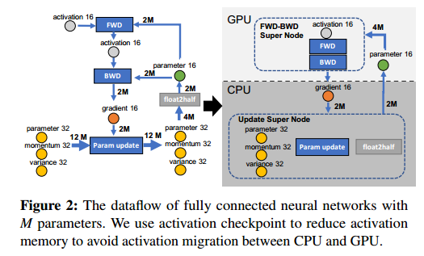

There are numerous ways to partition this graph. In the
following sections, we use first principles to simplify the data flow graph to reduce the number of possible choices based
on three different efficiency metric: i) CPU computation overhead, ii) communication overhead, and iii) memory savings.

## Limiting CPU Computation

CPU的计算吞吐量比GPU的计算吞吐量慢几个数量级。DL训练每次迭代的计算复杂度一般用O(MB)给出，其中M为模型大小，B为有效批大小。为了避免CPU计算成为瓶颈，只有那些计算复杂度低于0 (MB)的计算才应该卸载到CPU。这意味着前向传播和后向传播的计算复杂度都是0 (MB)，必须在GPU上完成，而其余的计算，如规范计算，权重更新等，复杂度为0 (M)，可以卸载到CPU上。基于这个简单的观察，我们将数据流图中的前向和后向节点融合为一个超级节点(FWD-BWD)，并将其分配给GPU。

##  Minimizing Communication Volume

The CPU memory bandwidth is at least an order of magnitude
faster than the PCI-E bandwidth between CPU and GPU,
while the GPU memory is another order of magnitude faster
than even the CPU memory.我们必须尽量减少CPU和GPU内存之间的通信量，以防止PCI-E带宽成为训练性能的瓶颈。为此，我们必须首先确定模型状态卸载策略的理论最小通信量。

The minimum communication volume for any model-state
offload strategy is given by 4M . 

Please note that it is possible to reduce the communication volume further by only offloading partial model states. For simplification, we assume that an offload of a model state implies that we offload the entire model state. Our analysis on the memory savings per communication volume, still holds even if we offload partial model states

each node in our data flow graph is part of a cycle.
Therefore, any partitioning of this graph would require cutting at least two edges, each of which has a edge weight of at least 2M, resulting in a total communication of at least 4M.

If we choose to limit the communication volume to this
bare minimum, we can greatly simplify our data-flow graph
and reduce the number of partitioning strategies to a handful:

任何不将fp32模型状态与其生产者和消费者节点共同定位的分区策略都无法实现4M的最小通信量。这样的分区必须至少切割一条边的权重为4M，另一条边的权重至少为2M，这样的分区的通信容量至少为6M。即fp32模型状态(momentum32, variance32和parameter32)必须与Param Update和float2half计算共同定位。

为了实现最小的通信量，p16必须与FWD-BWD Super共存，因为这两个节点之间的边权为4M。

## Maximizing Memory Savings

在简化数据流图以最小化通信量后，只剩下g16和Update Super需要分配。注意，在这一点上，所有分区都将导致最小的通信量，因此我们可以进一步减少选择以最大限度地节省GPU上的内存。通过卸载g16和Update Super到CPU可以实现8倍的最大内存节省。

##  A Unique and Optimal Offload Strategy

ZeRO-Offload在CPU内存上分配所有fp32模型状态以及fp16梯度，并且还计算CPU上的参数更新。fp16参数保存在GPU上，并在GPU上进行前向和后向计算。没有其他策略可以提供比ZeRO-Offload更多的内存节省，而不会增加CPU上的计算复杂性或产生额外的GPU-CPU通信量。

# ZeRO-Offload Schedule

在本节中，我们将讨论基于我们的卸载策略在单个GPU系统上实现ZeRO-Offload的具体计算和通信计划。然后，我们将展示如何通过将我们的卸载策略与零数据并行性和模型并行性相结合，扩展此计划以在多gpu系统上有效地工作。

## Single GPU Schedule

During the backward propagation on the loss, the gradient for different parameters are computed at different point(?) in the backward schedule. ZeRO-Offload can transfer these gradients for each parameter individually or in small groups to the CPU memory immediately after they are computed. Therefore, only a small amount of memory is required to temporarily hold the gradients on the GPU memory before they are transferred to CPU memory. 此外，每个梯度传输都可以与反向传播重叠在向后图的其余部分上，从而允许ZeRO-Offload隐藏很大一部分通信成本。

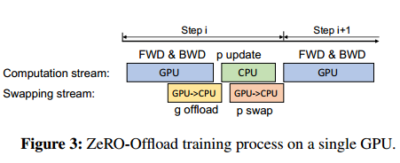

（p swap写反了，GPU和CPU不能并行吗）

## Scaling to Multi-GPUs

ZeROOffload保留了ZeRO Stage-2的模型状态分区策略(优化器状态和梯度分区)，同时将分区后的梯度、优化器状态和相应的参数更新卸载给CPU。（是一个cpu还是一个gpu对应一个cpu?)

The key benefit of doing this partitioning before offloading
is that for systems with more than 1 GPU, each data parallel process is only responsible for updating a subset of the
parameters. The aggregated communication volume from all
the data parallel GPUs to CPU remains constant, and CPU resources are used in parallel(并行？single是串行,这里的并行应该是指多cpu并行) to jointly compute a single weight update. As a result, the total CPU update time decreases with increased data parallelism, since the CPU compute resources increase linearly with the increase in the number of compute nodes.（多cpu) This allows ZeRO-Offload to achieve very good scalability, as the overhead of communication across GPUs is offset by the reduction in the CPU optimizer step.(?)

ZeRO-Offload在不同GPU之间划分梯度和优化器状态，每个GPU将其拥有的分区卸载到CPU内存中，并在整个训练过程中将其保留在那里。在反向传播过程中，在GPU上使用reduce-scatter计算梯度并平均，每个GPU只将属于其分区的平均梯度卸载到CPU内存中。 Once the gradients are available on the CPU, optimizer state partitions are updated in parallel by each data parallel process directly on the CPU. 更新后，参数分区被移回GPU，然后在GPU上执行类似于ZeRO-2的all-gather操作来收集所有参数。

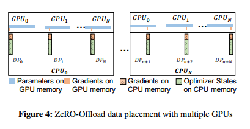

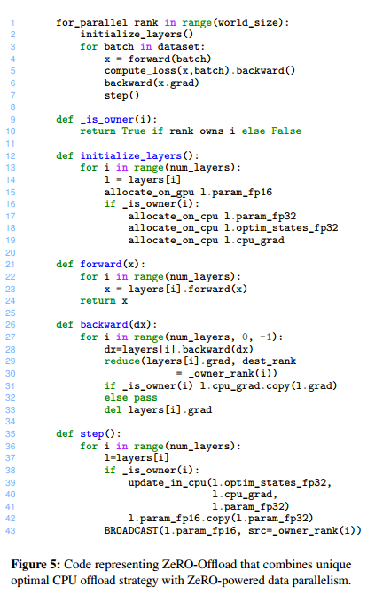

ZeRO-Offload也可以与基于张量切片的模型并行(MP)框架一起工作，如Megatron-LM[28]。It does so by offloading the gradients, optimizer states and the optimizer computation corresponding to each MP process allowing ZeRO-Offload to train significantly larger models than possible than
using model parallelism alone

# Optimized CPU Execution

我们通过两个优化加快了参数更新的CPU执行时间。首先，我们使用高性能计算技术实现了一个快速的CPU Adam优化器，与最先进的Pytorch实现相比，它提供了显著的加速。其次，我们开发了一个一步延迟参数更新计划，该计划将CPU参数更新计算与GPU上的前向和后向计算重叠，在启用时隐藏CPU执行时间。

## Implementing the CPU Optimizer

我们使用三层并行性来提高CPU优化器的性能。1) SIMD矢量指令[15]，充分利用CPU架构支持的硬件并行性。2)循环展开[31]，这是一种提高指令级并行性的有效技术，对于更好地利用内存带宽至关重要。3) OMP多线程，可以有效地并行利用CPU上的多个内核和线程。使用这些技术，我们提供了一个明显比最先进的PyTorch实现更快的Adam优化器实现

ADAM是一种用于深度学习训练的优化算法，它将损失梯度与其一、二次动量一起更新参数。因此，除了模型参数外，ADAM还需要在训练过程中保存两个相同大小(M)的矩阵。

Adam function receives the optimizer parameters such as b1, b2, and a, and the gradient, momentum, variance and master copy of parameters (parameter32) as the input。The Adam optimizer sends back the updated variance, momentum, and parameter in both fp16 (to GPU) and fp32 (to CPU) .

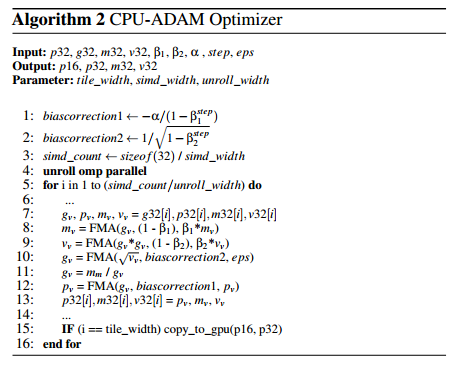

We firstly read the data, including parameter, gradient, momentum and variance, into the vector registers (line 7). Then, we use several fused multiply-add (FMA) vector operations to preform the main execution pipeline which is repeated by the unrolling width. Note that the rest of operations, such as multiply, division, and sqrt, also run in vector mode. For the best performance we use AVX512 simd instruction set and an unroll_width of 8 based on auto-tuning results.

In addition to the CPU-Adam optimizer, we implement the CPU-to-GPU fp16 parameter-copy in a tiled manner (line
15). We overlap the CPU and GPU execution by parallelizing
the Adam computation and copying the parameters over to
GPU. As we process Adam computation of the current tile of
data on CPU, we write the parameters back to GPU for the
previously processed tile. This way, we reduce the idle time
of GPU to start the processing of the next training step.

##  One-Step Delayed Parameter Update

尽管使用了高度优化的CPU优化器，但当GPU计算时间并不比CPU计算时间大多少时，CPU计算开销可能会成为小批量训练期间的瓶颈。对于这种有限的情况，我们开发了一步延迟参数更新(DPU)，它重叠CPU和GPU计算，通过延迟一步参数更新来隐藏CPU计算开销。我们在评估中验证了DPU不会影响训练的最终准确性。

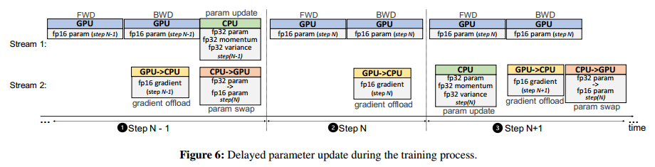

The first N −1 steps, are trained without DPU to avoid
destabilizing the training during the early stages where gradients change rapidly. On step N, we obtain the gradients
from the GPU, but we skip the CPU optimizer step, and do
not update the fp16 parameters on the GPU either. At step
N +1, we compute the parameter updates on the CPU using
gradients from step N, while computing the forward and backward pass on the GPU in parallel using parameters updated at step N −1. From this step onwards, the model at (i+1)th step will be trained using the parameters updated with gradients from (i−1) th step instead of parameters updated at ith step, overlapping CPU compute with GPU compute.(怎么实现一步之差？给参数版本打标签？)

发现如果我们在几十次迭代之后引入DPU，而不是在开始时引入DPU, DPU不会损害收敛性。我们在第6节的评估结果表明，与仅使用ZeRO-Offload的训练相比，延迟参数更新的训练可以获得相同的模型训练精度和更高的训练吞吐量。

# Evaluation

(i) How does ZeRO-Offload scale the trainable model size
compared to existing multi-billion parameter training
solutions on a single GPU/DGX-2 node?
(ii) What is the training throughput of ZeRO-Offload on
single GPU/DGX-2 node?
(iii) How does the throughput of ZeRO-Offload scale on up
to 128 GPUs?
(iv) What is the impact of our CPU-Adam and delay parameter update (DPU) on improving throughput, and does
DPU change model convergence?

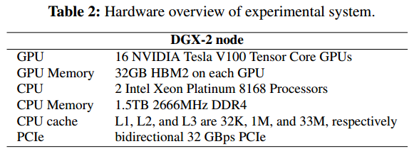

For the evaluation of throughput scalability, we conduct experiments on 8 Nvidia DGX-2 nodes connected together with InfiniBand using a 648-port Mellanox MLNX-OS CS7500 switch.

• PyTorch DDP: This is the existing PyTorch Transformer
implementation using DistributedDataParallel [14].
• Megatron [28]: One of the current state-of-the-art multibillion parameter model training solutions, which employs model parallelism to train up to 8.3B parameter
models using 512 GPUs.
• SwapAdvisor [9]: SwapAdvisor explores a genetic algorithm to guide model-agnostic tensor swapping between
GPU and CPU memory for GPU memory saving.
• L2L [18]: L2L enables training of deep Transformer
networks by keeping one Transformer block at a time in
GPU memory and only moves tensors in the upcoming
Transformer block into GPU memory when needed.
• ZeRO-2 [21]: ZeRO extends data parallelism by eliminating memory redundancies across multiple GPUs,
allowing to train models up to 170B parameters with
high training throughput using 25 DGX-2 nodes. ZeRO-
2 achieves the SOTA results for large model training and
is a strong baseline.

## Model Scale

与PyTorch相比，Megatron和ZeRO-2都不会增加单个GPU上的可训练模型大小，因为它们都利用聚合的GPU内存来适应更大的模型。相比之下，ZeRO-Offload可以在单个GPU上进行13B模型训练，比使用PyTorch, Megatron和ZeRO-2大9倍以上。这主要是因为ZeRO-Offload的策略通过卸载昂贵的状态(如优化器状态和大多数梯度)来最大化GPU上的内存节省。SwapAdvisor依赖于黑盒方法，并使用模拟器来预测哪些张量更频繁地使用，以便将它们保存在GPU内存中以最大限度地提高训练吞吐量。预测不可能完全准确，因此SwapAdvisor在GPU内存中保留了比ZeRO-Offload更多的张量。另一方面，L2L能够在单个GPU上通过频繁地将权重从未使用的层移动到CPU内存来训练更大的模型(例如，17B)。然而，当使用多个gpu训练L2L时，最大模型尺寸不会增加，这将在下文中讨论。

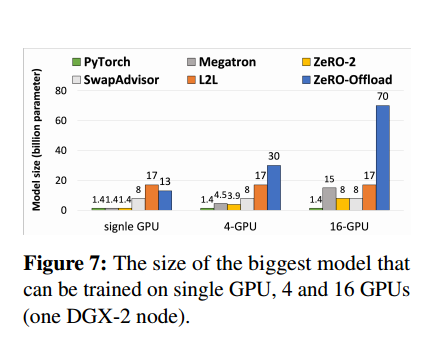

我们进一步在单个DGX-2节点上分别使用4个和16个gpu进行模型规模测试。PyTorch、L2L和SwapAdvisor的最大可训练模型大小保持不变，因为它们都不处理数据并行性中的内存冗余。因此，它们的可扩展性受到单个GPU上的模型规模的限制。Megatron和ZeRO2都支持使用更多gpu的大型模型训练，但即使使用16个gpu，它们也无法有效扩展超过15B个参数。Megatron支持比ZeRO-2更大的模型，因为ZeRO-2仍然会导致模型权重上的内存冗余。

## Training Throughput

我们比较了SwapAdvisor、L2L和ZeRO-Offload在单个GPU上对具有十亿规模参数的模型的训练吞吐量。我们没有把Megatron和ZeRO-2包括在这个比较中，因为它们都因为OOM的原因不能训练大于1.4B参数的模型。在本实验中，我们也禁用了延迟参数更新。

SwapAdvisor依靠在线遗传算法进行张量交换决策，从最大化计算和张量交换重叠的角度来看，寻找一个最优的张量交换解决方案需要花费数小时。在得到最优张量交换解之前，SwapAdvisor会尝试随机张量交换解，这会损害训练性能

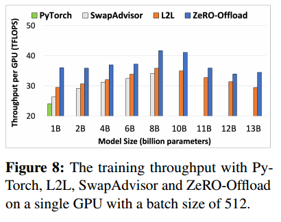

eRO-Offload的性能优势来自以下两个方面。首先，ZeRO-Offload比L2L具有更低的CPU和GPU之间的通信成本。对于M个参数的模型，L2L需要28M的GPU和CPU之间的数据通信量，这是模型各层的权重、梯度和优化器状态的总和。其次，与L2L相比，ZeRO-Offload的参数更新发生在CPU上而不是GPU上，但我们优化的CPU-Adam实现实现的参数更新性能与GPU上的PyTorch Adam实现相当(在第6.2.4节中评估)。因此，尽管L2L中GPU上的优化器更新比ZeRO-Offload中CPU上的优化器更新稍快，但L2L引入的通信开销导致总体吞吐量比ZeRO-Offload慢

we compare the training throughput of PyTorch, ZeRO-2, Megatron, ZeRO-Offload without model parallelism (w/o MP), and ZeRO-Offload with model parallelism (w/ MP) in one DGX-2 node.我们在这个测试中排除了L2L[29]，因为它的实现不支持多gpu训练。(SwapAdvisor?)

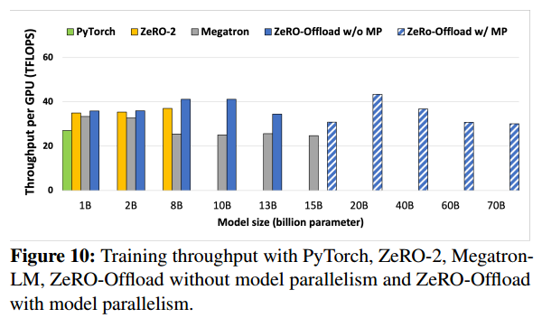

对于1B到15B模型，ZeRO-Offload实现了最高的吞吐量。通过将所有优化器状态以低开销卸载到CPU, ZeRO-Offload可以使用更大的微批大小进行训练，从而获得更高的吞吐量。

一旦模型大小超过8B, ZeRO-2就会耗尽内存，因为缺乏足够的聚合GPU内存来在16个GPU上存储模型状态。Instead, ZeROOffload scales to 13B, without model parallelism because it offloads optimizer states and the majority of
gradients to CPU memory

威震天在内存耗尽之前只支持多达15B个参数模型，只使用模型并行性。

ZeRO-Offload在1-8B和1-13B参数模型上的吞吐量分别优于ZeRO-2和Megatron。ZeRO-Offload比威震天更快，因为它消除了不同gpu之间的频繁通信，并且可以用更大的微批量进行训练。ZeRO-Offload优于ZeRO-2也是由于更大的微批量大小。

## Throughput Scalability

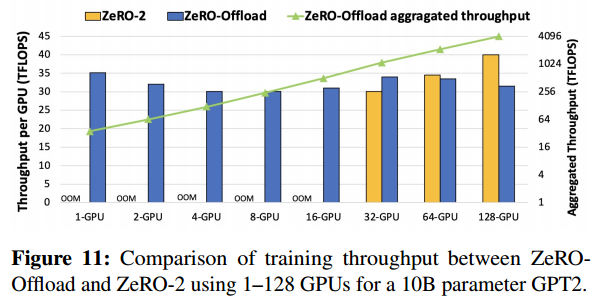

ZeRO-Offload在聚合吞吐量(绿线)方面实现了近乎完美的线性加速.从1到16个gpu，在ZeRO-2耗尽内存的情况下，ZeRO-Offload可以有效地训练模型，将模型训练从不可行的变为可行的。对于32个gpu, ZeRO-Offload在吞吐量方面略优于ZeRO-2。这种改进来自于ZeRO-Offload在GPU上额外节省的内存，它允许以更大的批处理规模训练模型，从而提高GPU的计算效率。ZeRO-2开始优于ZeRO-Offload，因为两者现在都可以运行相似的批处理大小，实现相似的计算效率，而ZeRO-2不会受到CPU-GPU通信的额外开销的影响。综上所述，ZeRO-Offload是ZeRO-2的补充，可以实现从单个设备到数千台设备的大型模型训练，并且具有良好的计算效率。

## Optimized CPU Execution

Compared to PyTorch (PT-CPU), CPU-Adam reduces the execution time by over 5X for all the configurations and 6.4X for the case with 1B parameters.CPU-Adam虽然比PyTorch Adam在GPU (PT-GPU)上的实现速度慢，但性能差距不是很大，CPU计算也不是整个训练的瓶颈。

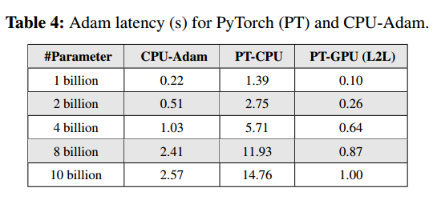

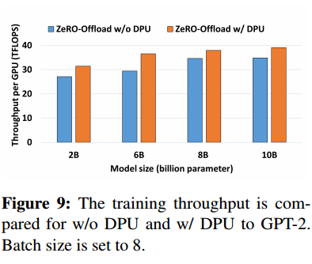

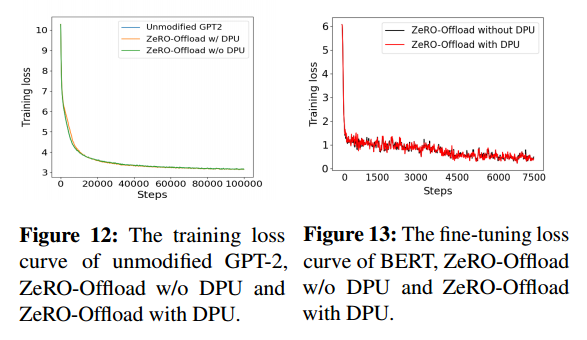

在这两种情况下，DPU在40次迭代后启用，允许训练在引入DPU之前稳定在其早期阶段。

我们观察到未修改的GPT2和ZeRO-Offload w/o DPU的训练曲线完全重叠，因为ZeRO-Offload w/o DPU只执行系统优化，不改变训练动态。另一方面，使用DPU的ZeRO-Offload的训练曲线在训练开始时收敛速度稍慢(例如，在2K-5K迭代时几乎看不到)，在5K迭代后迅速赶上。对于剩下的训练，训练损失与原始训练相匹配，直到模型收敛。

对于Bert-Large fine-uning，我们可以看到，虽然训练损失并不完全相同，但它们在相同的趋势下收敛，并且在很大程度上重叠。Without changing any hyperparameters, ZeRO-Offload + DPU achieves the same final F1 score (92.8) as the baseline. 

我们经验验证了DPU是一种有效的技术，可以在不损害模型收敛性和准确性的情况下提高ZeRO-Offload的训练吞吐量。

##  Performance Breakdown and Analysis

我们在单个GPU上使用10亿个GPT-2模型进行各种批量大小的评估

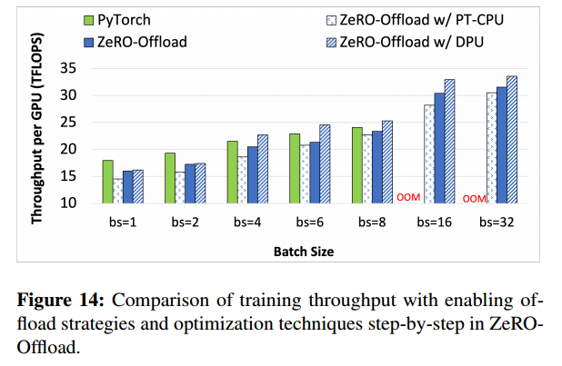

From batch size 1 to 8, PyTorch outperforms ZeRO-Offload
with PT-CPU(没有优化cpu) by 16% on average.这是因为当模型可以适合GPU内存时，PyTorch不会产生任何通信开销。同时，PyTorch采用PyTorch GPU Adam (PT-GPU)在GPU上进行优化计算。

ZeRO-Offload实现了CPU- adam，与仅使用卸载策略(即使用PT-CPU的ZeRO-Offload)相比，性能提高了10%。当模型适合GPU内存时，PyTorch比ZeRO-Offload平均高出8%。 the performance degradation from PyTorch to ZeRO-Offload in Figure 14 are mainly coming from tensor migration overhead between GPU and CPU memory.

ZeRO-Offload进一步引入了一步延迟参数更新，使CPU上的计算与GPU上的计算重叠，与不使用DPU的ZeRO-Offload相比，性能提高了7%。综上所述，利用优化的CPU执行，当ZeRO-Offload和PyTorch在GPU上进行相同批处理大小的训练时，ZeRO-Offload具有与PyTorch相似的性能。

随着批处理大小的增加，GPU内存的内存不足会在PyTorch的训练中发生。在ZeRO-Offload下，训练吞吐量随着批大小的增加而增加。凭借独特的最佳卸载策略，ZeRO-Offload在具有10亿模型的单个GPU上可以实现的最大训练吞吐量上比PyTorch高出39%。

# Conclusions

GPU- cpu混合深度学习训练技术，具有高计算效率和近线性吞吐量可扩展性，可以让数据科学家在单个GPU上训练具有数十亿参数模型的模型，而无需任何模型重构。

cpu:模型状态，参数更新(并行计算, DPU:CPU和GPU并行计算)

gpu:参数，向前和向后计算

zero-2只有对应参数在cpu上更新，其他不变

MP类似

