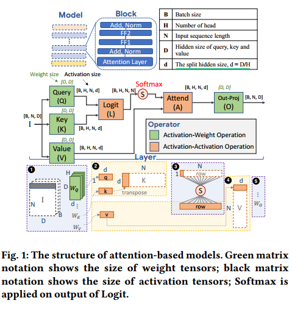
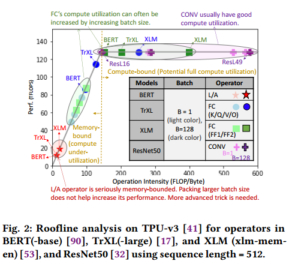
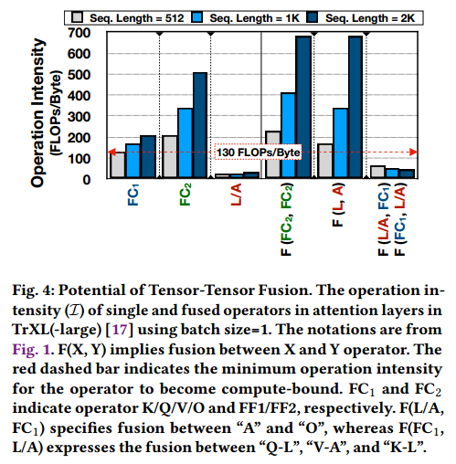
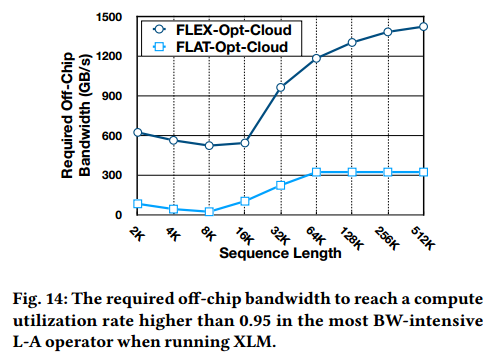

# ABSTRACT

注意力机制是以过高的内存需求和计算复杂性为代价的，特别是在输入元素数量较多的情况下。

有限的数据重用机会和内存占用的二次增长，导致严重的内存受限和输入元素的有限可伸缩性。

通过独特的融合机制处理昂贵的注意力操作，将内存占用二次增长转变为线性增长。提出了一种平铺方法来增强跨注意力操作的数据重用。我们的方法既缓解了片外带宽瓶颈，又降低了片内内存需求。

Flat提供了1.94倍(1.76倍)的加速和49%(42%)的节能。当片上资源稀缺(20 KB-200 KB)时，Flat平均产生1.5倍的端到端延迟减少。应用于注意力操作的最先进的深度神经网络数据流在超过512个元素的输入时达到了效率极限。相比之下，Flat为输入高达64K元素的变压器模型解锁。

#  INTRODUCTION

增加序列长度可以使基于注意力的模型更好地捕捉输入句子的上下文或图像片段之间的关系。

与现有的神经网络加速器相比[9,11,20,67,78,105]，基于注意力模型的加速器架构面临着不同的设计挑战，这要归因于它们对片上存储器和计算复杂性的不断增长的需求。最近用于基于注意力的模型的加速器[30,31]主要依赖于算法优化，通常会对模型精度产生负面影响。实践中的算法技术包括稀疏化或压缩[5,12 - 14,16,17,43,47,56,66,68,70,73,80,86,94,104]和/或利用有损近似

传统的CONV和FC层的数据流/映射方法[9,20,40,63]不适合注意层。这是因为与CONV和FC相比，注意力层中的主要运营商表现出不同的计算和内存特征，在片外内存带宽上形成了明显的瓶颈。

我们在为注意力层设计数据流优化时发现了以下挑战:

操作强度明显较低。激活-激活算子固有的低数据重用显著降低了这些算子在关注层中的操作密度。这种固有的低操作密度使得激活-激活运算符基本上是内存受限的。先前关于算子内数据流优化的工作，如循环转换和调度技术[11,20,49,51,63,65]，通过利用充足的内在数据重用来瞄准CONV和批处理FC算子，这并不适合缺乏数据重用机会的激活-激活算子。

复杂的多对多运算符。主要的注意算子具有多对多关系，这使得在注意算子中使用算子融合的机会变得模糊[62]。

过大的中间张量。注意层中中间张量的大小随序列长度呈二次增长——(二进制))[13,14,17,43,53,90,94]。这种二次增长对片上存储器容量施加了巨大的压力，并且阻止了将中间结果存储在片上并提高计算利用率的机会，而这是CNN加速器中常见的做法[9]。

设计了同类中第一个多对多互操作数据流优化机制。融合了多个多对多张量算子，同时系统地保留了它们之间的数据依赖关系，从而显著降低了片外内存带宽压力。Flat在融合的操作器之间执行了一种新的平铺方法。这种平装可以在预算紧张的片上存储器上有效地进行二次增长的中间注意力张量操作，从而实现更高的性能和节能，并将变压器模型的可扩展性提升到64K输入。

研究了注意力层内不同操作符的操作强度，并描述了有限硬件资源所施加的基本障碍。使来自低容量但高带宽的片上存储器的二次增长的中间注意力张量能够实现更高的数据重用。我们表明，这种数据流优化有效地减轻了片外存储器带宽的压力，从而提高了加速器的性能和能源效率(§5)。开发了一个地图空间探索框架，以有效地搜索融合算子和平铺尺寸之间的最佳循环顺序。

#  BACKGROUND

在运行模型时，L和A运算符通常主导着延迟和功耗[30]，在长序列长度时更是如此

操作强度|屋顶线性能。操作强度是衡量给定一组硬件资源的单个操作员的最大可能性能的代理度量。运算符的运算强度定义为算术运算的次数除以内存访问的次数。较低的操作强度意味着操作员具有较少的数据重用机会，并且更有可能受到内存带宽(BW)的限制。

数据流|实现性能。数据流是指在空间和时间上将数据从片外存储器通过片内存储器层次结构过渡到计算pe的机制[49]。它决定了实际实现的性能。由于内存访问通常是执行DNN运算符的瓶颈[84]，数据流暴露了跨操作数的数据重用机会，可以通过缓冲和数据转发/广播在硬件中利用[49]。数据流包括:(i)平铺(张量如何在内存层次结构中被切片、存储和获取)，(ii)计算顺序(执行循环迭代的顺序)，以及(iii)并行性(计算如何在空间上跨pe映射)。带有特定贴图大小的数据流通常被称为映射[49,51]。

# CHALLENGES WITH ATTENTION LAYERS

Challenge 1: Low Operational Intensity of L/A

Activation-Weight operators增加批大小(B)可以增加操作强度——相同的重量值可以通过多次活化重复使用，从而降低BW压力。这是激活权重运算符(例如，CONV和FC，大多数DNN模型中的主要内容)中使用的典型技术，因为它可以更好地利用加速器中稀缺的内存带宽，并能够更高地利用预置的计算FLOPs，从而提高吞吐量。

Activation-Activation operators不能简单地通过增加批量来增加操作强度。

Roofline analysis.

当这个应用程序的计算密度大于一定值之后，将会变成一个受算术逻辑单元的计算量所限制的程序；而这个计算密度如果小于一定值，将会变成一个受存储器带宽所限制的程序。这里折线的拐点非常重要。这个拐点即下文中所说的计算密度上限I\_{max}与硬件相关，它实际上表示的是硬件的理论计算能力和它的内存带宽上限之间的一个比值。在屋顶线模型中，算力决定了屋顶的高度，带宽决定了房檐的斜率。计算瓶颈区，不管模型的计算密度 I 有多大，它的理论性能 P 最大只能等于计算平台的算力\pi。带宽瓶颈区，当模型的计算密度 I 小于计算平台的计算密度上限 I\_{max} 时，模型的计算密度 I 越大，模型的理论性能 P 可呈线性增长。

我们可以看到CONV运算符位于计算边界区域。FC运算符分散在内存和计算边界区域;然而，随着批量的增加，它们的操作强度增加，并可能成为计算机的束缚。L和a算子位于内存受限和低性能区域，批大小的增加在这些算子中是无效的。L/A操作符的低操作强度使得它们基本上是内存受限的，任何单个操作符级别的数据流/映射探索都不能进一步提高性能。

Challenge 2: Complexity of Op Fusion for L/A

可以在芯片上处理中间张量数据，并利用更高的芯片上存储带宽。算子融合是一种优化，将背靠背的算子安排在一起，使生产者的输出直接提供给消费者，从而避免在内存中实现完整的中间张量。通过避免中间张量的片外数据移动，我们可以使用更高的片上带宽来提高融合算子的性能(而不是单独执行算子)。

如何将多对多与其他多对多融合，以及融合它们是否有益，仍然是一个研究问题[62]。要么过于复杂，要么无利可图。关键原因是，维护依赖性和分级数据(如图3(b)所示的灰色中间数据)的额外复杂性最终可能对寄存器和缓存的使用产生负面影响[62]。基于注意力的模型的张量融合尚未被探索。

设计了一个专门的操作符间数据流，它不仅考虑了两个大张量操作符的数据依赖关系，而且还解决了多对多中间激活(§5.2)引起的复杂数据依赖关系

 Challenge 3: Tensor Footprint of L/A

在考虑张量融合时，L/A还有一个独特的挑战，即二次中间张量占用。将整个中间张量保留在片上的技术是不可扩展的。为我们的融合操作器提出了一种平铺技术，可以根据片上内存约束控制活动内存占用。

# FLAT DATAFLOW CONCEPT

Flat包括操作符内部数据流和专门的操作符间数据流，同时执行L和a。

对于基于fc的算子(K/Q/V/O)，操作强度足以被计算约束，而对于L/A，操作强度很低。在融合L和A (f(L, A))之后，(融合算子的)有效操作强度更高。

没有融合其他算子对，如f(Q, L)， f(A, O)或f(V, A)。(1)操作强度通常是足够的，可以通过利用批大小达到计算约束来增加(图2)。(2)融合两个FC (f(FC, FC))可以实现更高的操作强度;然而，由于运算符已经受计算约束，利用融合(以及额外的复杂性)并没有多大价值。(3)我们经常需要更细粒度的数据流方案来拟合片上的融合算子张量;然而，融合两个激活权重计算(f(FC, FC))可能会权衡(权重)重用机会，并可能降低实际可实现的性能(§5.3)。（数据多，模型参数少，重用减少？）

没有融合多个运算符，如f(L, A, O)或f(K, L, A)。(1)将L/A与FC(如f(A, O)或f(K, L)融合可以降低FC的潜在性能与单个操作符的性能相比(图4)。(2)我们融合的操作符越多，我们需要的部分片上数据就越多。由于片上存储器通常非常有限，我们需要以更细的粒度执行融合运算符，这可能导致可实现性能的下降(§5.3)。

尊重操作符之间的数据依赖关系。先前CONV/FC融合技术所采用的任意循环间平铺[2,97]违反了这种数据依赖性约束

有效地处理不适合片上存储器的大型中间张量。

# FLAT DATAFLOW IMPLEMENTATION

将回路巢分为两组:“外回路”和“内回路”。外环在L和A共享。每个操作符的内循环都是唯一的。

Flat使用了两个级别的平铺:操作符内平铺和操作符间平铺。 We name each tile in inter-operator tiling, a Flat-tile.内部循环，本质上指定了在图中融合算子的一次传递中计算部分中间张量的多少片。Flat-tile的最小粒度由Softmax的数据依赖约束决定，称为行粒度。我们逐步建立大(coarser-grain)平铺,也就是说,平铺多一次的行数(𝑅𝑥),多个数量的头(𝐻𝑥),最后,多个数量(微)批次(𝐵𝑥)瓷砖。我们将它们分别称为行(R-Gran)，头(H-Gran)和批(B-Gran)粒度(在§5.3中讨论)。此外，将整个中间张量(即L的整个输出)移动到片上最直观的基线称为Batch-Multi-Head granularity (M-Gran)，如图5所示。

最小的Softmax执行需要一个[1,N]输入数组，而输入数组又需要查询[1,D]和键[D, N]。

M-Gran, B-Gran, H-Gran: Leveraging Limited Reuse of f(L,
A)：更粗的粒度要求在片上存储器中存放更大的块。随着序列长度的增加，这可能会迅速增加。选择更小的粒度虽然这有助于减少块的大小，但当我们在外循环以更细的粒度平铺两个操作符时，我们可能会在内循环中权衡重用机会。对于f(FC, FC)和f(CONV, CONV)，当减少批量大小(即微批处理)时，我们直接减少重量可重复使用的次数。每个微批需要一次又一次地重新获取权重。当考虑更细的颗粒(如H-Gran)用于重量活化K/Q/V/O操作时，这种影响会加剧。 The reduced reuse opportunity by inter-operator tiling reduces the achievable performance, even though the fused operator has large operational intensity (Fig. 4).相比之下，L和A是激活-激活操作(图3.1)。在算法层面上没有重用的机会。降低平铺粒度(从M-Gran到B-Gran再到H-Gran)并不排除任何重用机会，因为在算法级别上没有重用机会。因此，Flat中更精细的M-Gran, B-Gran, H-Gran非常适合于f(L, A)。（粒度大，模型参数载入载出次数少，中间变量载入载出次数多；粒度小，模型参数载入载入载出次数多，中间变量载入载出次数少；LA没有模型参数）

R-Gran: Extreme Large Sequence Range：为了实现非常长的序列长度[14,47,70]，但片上内存资源有限[41,89]，我们需要以更细的粒度进行平铺。更细的粒度带来了相关的权衡:当我们减少行数(𝑅- 1)时，我们也将减少矩阵乘法本身的重用机会。例如，即使对于L/A融合，使用更少的行意味着需要在交错的交叉操作符外部循环中多次获取相同的键向量。此外，减少外循环的行数也会降低内循环可实现的性能，例如，没有足够的维度大小来充分利用PE数组。

L运算符消耗(Rd+Nd)x2个片上缓冲区的大小(2为考虑双缓冲)，A消耗(Nd+Rd)x2个。RN用于缓冲中间张量(平面张量)(没有双重缓冲，因为它不与片外内存交互)

# EVALUATION METHODOLOGY

我们在两种不同的加速器制度上评估了Flat的好处，即云和边缘加速器。

使用性能和节能作为效率指标。Runtime 𝑑𝑒𝑎𝑙是当前工作负载的算术最优运行时。也就是说，模型中的总计算数除以目标加速器的峰值FLOPs。Runtime 𝑑𝑎𝑡𝑎𝑓𝑙𝑜𝑤表示通过数据流优化实现的运行时。这个规范化的运行时度量解释了当前数据流与其算术最优值之间的距离。该指标表示到roofline模型中数据流计算边界的距离以及计算资源利用率(𝑈𝑡i𝑙)。

# EVALUATION I: FLAT DATAFLOW EFFICACY

本节的目标是演示在一系列硬件和数据流配置中使用Flat的好处，而不偏向于任何特定的设计点。

Flat (Flat- opt)优于Naïve(没有任何优化的基线数据流)和Flex (Flex- opt)的运行时性能改进。观察到1)提供巨大的片上缓冲资源(2GB)， Flat通过其融合操作和改进的数据重用可以提高Naïve和Flex;2)在有限的缓冲区资源下，Flat变得方便，因为它减少了片上缓冲区的占用。Flat-Opt将当前最先进的基线Flex-Opt在聚焦L-A操作上提高了1.7倍，从而将端到端性能提高了1.1倍。L-A操作在更大的序列长度上会变得更占优势。

随着序列长度的增加，片上缓冲区的需求也会迅速增加。Flex设计空间中的加速器设计点开始触及内存边界。然而，应用Flat技术，我们可以有效地减少内存需求，从而提供更好的序列长度可伸缩性。

当考虑更多的操作符时，L/A操作符的影响被稀释了。对于小于512的序列长度，块级和模型级(即端到端)的性能都由FC/GEMM操作符主导。因此，FlexOpt和Flat-Opt的收益是微不足道的。当序列长度从512增加到4K、16K和64K时，我们的方法的显著收益就会出现。

高利用率并不直接转化为更好的能源节约;然而，高度相关。具有高计算利用率的数据点通常采用更好的内存访问模式(例如，更少的片外内存访问和更好的数据重用)，从而在内存访问能量方面施加更少的成本，内存访问能量是DNN加速器总体能耗的主要贡献者。

FLAT都为使用更大的变压器模型(表7)和/或更大的序列长度(表8)提供了机会，这可能会提高模型的性能。

# EVALUATION II: COMPARISON

本节对比使用和不使用Flat数据流时特定加速器设计点的性能。

当序列长度为512时，Flat-Opt-Edge和Flex-Opt-Edge的性能都接近最优。但是，当序列长度增加到4K、16K和64K时，Flat-Opt-Edge和Flex-OptEdge之间的性能差距会拉大。

Flat-Opt-Edge在边缘加速器上提供了1.75倍的加速，同时显著降低了44%的能耗。Flat-OptCloud比FlexOpt-Cloud实现了1.65倍的加速和55%的节能。

大多数DNN操作通常是内存受限的，并且片外内存带宽通常是共享的

显示了为实现L和a注意算子超过0.95的计算利用率，片外带宽需求的峰值。The left hand side of the U-shape of Fig. 14 comes from the increase in the operational intensity and thus decrease of the bandwidth-boundedness as sequence length increases.(operational intensity增大，计算不变，内存减少) u形的右侧是由于Flex和Flat的片上内存需求分别随着序列长度的增加而二次增长和线性增长造成的。与Flex-Opt-Cloud相比，Flat-Opt-Cloud平均减少了82%的片外带宽需求。

表9显示FLAT可以比基线运行得更快，并且支持更大的批大小，而表10显示FLAT比基线运行得更快，并且支持64k字。

最近的稀疏关注加速器降低模型精度以提高性能。而Flat是一种仅软件的方法，对模型精度没有影响，可以很容易地适应各种平台(例如Edge或Cloud)。即使具有高度的稀疏性，这些操作仍然是内存受限的，这保证了Flat的好处。

# RELATED WORKS

算法的优化。这些技术影响模型质量，并且与本文提出的思想是正交的。当部署在DNN加速器上时，Flat可以与这些技术相结合，以进一步改善运行时间和能量。

融合是一种经典的编译技术

# CONCLUSION

运行长序列的基于注意的模型是具有挑战性的，因为某些注意算子的低重用性和中间内存占用的二次增长，这两者都复合了内存带宽需求。采用了算子间融合(首次针对关注层研究这一问题)、交错执行和高效平铺，以提高操作强度，提供高计算利用率、降低片外带宽需求和长序列长度的可扩展性。

低操作强度的瓶颈在内存，只能用算子融合，中间变量不载入载出，细粒度保证依赖和长序列，没有参数重用，但还是减少了矩阵乘法的重用，减少并行利用。节省时间和资源，支持长序列

# .

Yu-Hsin Chen, Tushar Krishna, Joel S Emer, and Vivienne Sze. 2016. Eyeriss:
An Energy-efficient Reconfigurable Accelerator for Deep Convolutional Neural
Networks. JSSC (2016).

Zidong Du, Robert Fasthuber, Tianshi Chen, Paolo Ienne, Ling Li, Tao Luo,
Xiaobing Feng, Yunji Chen, and Olivier Temam. 2015. ShiDianNao: Shifting
Vision Processing Closer to the Sensor. In ISCA.

Norman P. Jouppi et al. 2017. In-Datacenter Performance Analysis of a Tensor
Processing Unit. In ISCA.

Nvidia. 2017. NVDLA Deep Learning Accelerator. http://nvdla.org

Yu-Hsin Chen, Tien-Ju Yang, Joel Emer, and Vivienne Sze. 2019. Eyeriss v2: A
Flexible Accelerator for Emerging Deep Neural Networks on Mobile Devices.
JSSC (2019).

Tushar Krishna, Hyoukjun Kwon, Angshuman Parashar, Michael Pellauer, and
Ananda Samajdar. 2020. Data Orchestrationin Deep Learning Accelerators. Morgan & Claypool Publishers. https://doi.org/10.2200/S01015ED1V01Y202005CAC052

Hyoukjun Kwon, Prasanth Chatarasi, Michael Pellauer, Angshuman Parashar,
Vivek Sarkar, and Tushar Krishna. 2019. Understanding Reuse, Performance,
and Hardware Cost of DNN Dataflow: A Data-Centric Approach. In MICRO.

Angshuman Parashar, Priyanka Raina, Yakun Sophia Shao, Yu-Hsin Chen,
Victor A Ying, Anurag Mukkara, Rangharajan Venkatesan, Brucek Khailany,
Stephen W Keckler, and Joel Emer. 2019. Timeloop: A Systematic Approach to
DNN Accelerator Evaluation. In ISPASS.

Xuechao Wei, Yun Liang, Xiuhong Li, Cody Hao Yu, Peng Zhang, and Jason
Cong. 2018. TGPA: Tile-Grained Pipeline Architecture for Low Latency CNN
Inference. In ICCAD