# Abstract

Alpa automates model-parallel training of large deep learning (DL) models by generating execution plans that unify data, operator, and pipeline parallelism.

现有的模型并行训练系统要么要求用户手动创建并行化计划，要么从有限的模型并行配置空间自动生成并行化计划。它们不足以在分布式计算设备上扩展复杂的深度学习模型。

Alpa distributes the training of large DL models by viewing parallelisms as two hierarchical levels: inter-operator and intra-operator parallelisms. Based on it, Alpa constructs a new hierarchical space for massive model-parallel execution plans. Alpa designs a number of compilation passes（多层次编译） to automatically derive efficient parallel execution plans at each parallelism level. Alpa implements an efficient runtime to orchestrate the two-level parallel execution on distributed compute devices.  Alpa generates parallelization plans that match or outperform hand-tuned model-parallel training systems even on models they are designed for. Unlike specialized systems, Alpa also generalizes to models with heterogeneous architectures and models without manuallydesigned plans

# Introduction

在分布式集群上训练这些非常大的模型目前需要大量的工程工作，这是特定于模型定义和集群环境的。efficient large-scale model training requires tuning a complex combination of data, operator, and pipeline parallelization approaches at the granularity of the individual tensor operators.正确调整并行化策略已被证明[30,33]可以在训练性能上提供一个数量级的改进，但这取决于强大的机器学习(ML)和系统专业知识。

大规模模型的自动化并行化将使模型开发人员能够快速探索新的模型设计，而无需考虑潜在的系统挑战，从而显著加速机器学习的研究和生产。大规模模型的自动化并行化requires navigating a complex space of plans that grows exponentially with the dimensions of parallelism and the size of the model and cluster. how many data-parallel replicas to create, which axis to partition each operator along, how to split the model into pipeline stages, and how to map devices to the resulting parallel executables. The interplay of different parallelization methods and their strong dependence on model and cluster setups form a combinatorial space of plans to optimize. Recent efforts [17, 38, 55] to automatically parallelize model training are constrained to the space of a single model-parallelism approach, or rely on strong assumptions on the model and cluster specifications (§2.1).

我们可以将不同的并行化技术组织到一个分层空间中，并将这些并行化技术映射到计算集群的分层结构中。不同的并行化技术对通信的带宽要求不同，而典型的计算集群具有相应的结构:位置近的设备可以使用高带宽进行通信，而距离远的设备通信带宽有限

Intra-operator parallelism partitions ML operators along one or more tensor axes (batch or non-batch) and dispatches the partitions to distributed devices (Fig. 1c); inter-operator parallelism, on the other hand, slices the model into disjoint stages and pipelines the execution of stages on different sets of devices

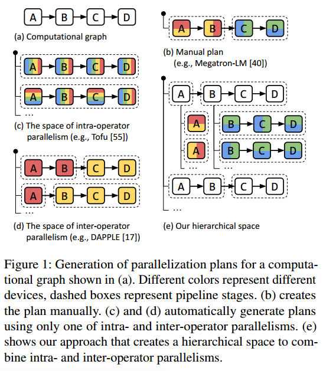

算子内并行和算子间并行具有不同的特点:算子内并行具有更好的设备利用率，但在每次训练迭代中，分割算子的每次拆分和合并都会导致通信;然而，操作符之间的并行性只在相邻的阶段之间通信，如果分割得当，这可以很轻，但由于调度限制，会导致设备空闲时间。我们可以利用计算集群中通信带宽的不对称特性，并将操作员内部并行性映射到具有高通信带宽的设备上，同时在相距较远且带宽相对较低的设备之间编排操作员间并行性。这种分层设计允许我们将每个级别作为单个可处理的子问题以近乎最佳的方式解决。虽然联合执行计划不能保证全局最优，但它们在训练各种大型模型时表现出较强的经验性能。

Alpa，这是第一个自动生成并行执行计划的编译器，它涵盖了所有数据、运算符和管道的并行性。给定模型描述和集群配置，Alpa通过将集群划分为许多设备网格来实现这一点，每个设备网格包含具有最佳高带宽连接的设备，并将模型的计算图划分为阶段。它为设备网格分配阶段，并自动协调设备网格上的操作员内部并行性和设备网格之间的操作员间并行性。

设计了易于处理的优化算法，以在每个级别上获得接近最优的执行计划。

一组编译通道，使用分层优化算法生成执行计划

一个新的运行时架构，协调设备网格之间的互操作并行性

一些系统优化，改进编译和解决跨网格通信。

Alpa在2个节点上实现了3.5倍的加速，在4个节点上实现了9.7倍的加速。

开发人员可以使用Alpa获得高效的模型并行执行大型深度学习模型。

# Background

深度学习计算通常由流行的ML框架[1,9,42]表示为数据流图。图中的边表示多维张量;节点是计算运算符，例如矩阵乘法(matmul)，它将输入张量转换为输出张量。在实践中，模型开发人员定义数据流图。然后，执行引擎对其进行优化并在计算设备上执行。当模型或数据很大，单个设备无法在合理的时间内完成训练时，我们采用ML并行化方法，在分布式设备上并行化计算。现有的ML并行化方法通常分为数据并行、操作符并行和管道并行。

In data parallelism, the training data is partitioned across distributed workers, but the model is replicated. 每个worker在其独立的数据分割上计算参数更新，并在权重更新之前与其他worker同步更新，以便所有worker在整个训练过程中观察到一致的模型参数

the model is too large to fit in one device. Operator parallelism refers to approaches that partition the computation of a specific operator (abbreviated as op in the following text), such as matmul shown in Fig. 2b, along non-batch axes, and compute each part of the operator in parallel across multiple devices. 

Because input tensors are jointly partitioned(?), when a device computes its op partition, the required portions of input tensors may not reside in its local memory. Communication is thus required to fetch the input data from other devices. When the tensors are partitioned evenly, i.e., SPMD [57], all devices will follow the same collective communication patterns such as all-reduce, all-gather, and all-to-all.

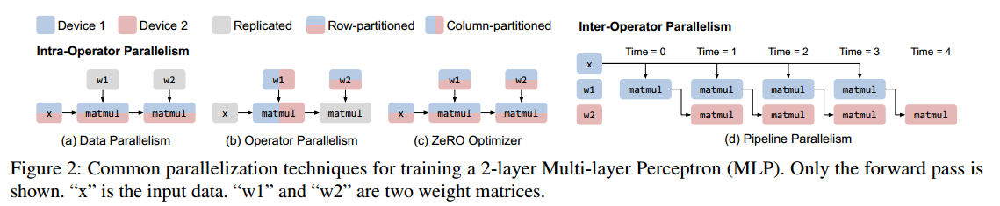

管道并行不是对操作进行分区，而是将模型图中的不同操作组(称为阶段)放在不同的工人上;同时，它将训练批拆分为多个微批，并在分布式工作器上跨微批进行向前和向后传递。管道并行使用点对点通信在不同的工人之间的正向和反向传递中间激活。

最先进的训练系统，如Megatron-LM[40,49]，手动设计一个专门的执行计划，将这些并行性结合在一起用于转换语言模型，这也被称为3D并行。通过假设模型具有重复的相同变压器层，它为每个管道阶段分配相等数量的层，并为所有层统一应用手工设计的操作符和数据并行配置.由于需要很强的专业知识，手动计划不能泛化到不同的模型或不同的集群设置

每个单独并行度的配置、它们的相互依赖以及它们对模型和集群设置的依赖形成了一个难以处理的空间，这阻碍了自动组合这些并行度的平凡实现。当与操作员并行性相结合时，每次添加数据并行副本时都需要分配一组新的设备(而不是单个设备)作为工作器，并在这些设备中找出最佳的操作员并行性配置。当考虑管道并行性时，最优的管道方案取决于每个管道阶段的数据和操作符并行性的选择以及如何为每个阶段分配设备。根据这种传统观点，先前对自动并行化的探索[17,25,55,60]仅限于将数据并行化与最多一种模型并行化方法相结合，从而错过了大量的性能机会。

算子内并行化和算子间并行化。它们的区别在于是否包含沿任意张量轴的分划算子。

Intra-operator并行。算子作用于多维张量。我们可以沿着某些维度划分张量，将结果划分的计算分配给多个设备，并让它们同时执行操作符的不同部分。数据并行性[29]，根据定义，属于intra-op并行性——输入张量和matmull沿着批维被划分，权张量被复制。或者，当权重非常大时，对权重进行划分(图2b)。Besides operators in the forward or backward passes, one can also partition the operators from the weight update phase, yielding the weight update sharding or equivalently the ZeRO [44, 56] technique, commonly comprehended as an optimization of data parallelism.(?)

collective communication is required at the split and merge of the operator。导致分布式设备之间的大量通信。

操作符间并行定义为不执行操作符划分的正交类方法，而是将图的不同操作符分配到分布式设备上执行。The pipeline execution can follow different schedules, such as Gpipe [22], PipeDream [38], and synchronous 1F1B [17, 39].本文中采用同步1F1B调度，因为它尊重同步一致性，并且与Gpipe相比具有相同的管道延迟但更低的峰值内存使用。不管使用什么调度，由于阶段之间的数据依赖，操作符间的并行性会导致一些设备在向前和向后计算期间处于空闲状态。

这两种并行发生在DL计算的不同粒度上，并且具有不同的通信需求，这恰好与当今计算集群的结构相匹配。我们将利用这些属性来设计分层算法和编译通道，以自动生成执行计划。Alpa是第一个使用这种分类从整个空间自动生成并行计划的端到端系统。

# Overview

Alpa is a compiler that generates model-parallel execution plans by hierarchically optimizing the plan at two different levels: intra-op and inter-op parallelism. At the intra-op level, Alpa minimizes the cost of executing a stage (i.e., subgraph) of the computational graph, with respect to its intra-operator parallelism plan, on a given device mesh, which is a set of
devices that may have high bandwidth between each other (e.g., GPUs within a single server). Different meshes might have different numbers of computing devices according to the workload assigned. At the inter-op level, Alpa minimizes the inter-op parallelization latency, with respect to how to slice the model and device cluster into stages and device meshes and how to map them as stage-mesh pairs. The inter-op optimization depends on knowing the execution cost of each stage-mesh pair reported by the intra-op optimizer.

To achieve this, Alpa implements three novel compilation passes as Fig. 3 shows. Given a model description, in the form of a Jax [9] intermediate representation (IR), and a cluster configuration, the inter-op compilation pass slices the IR into a number of stages, and slices the device cluster into a
number of device meshes. The inter-op pass uses a Dynamic Programming (DP) algorithm to assign stages to meshes and invokes the intra-op compilation pass on each stage-mesh pair, to query the execution cost of this assignment. Once invoked, the intra-op pass optimizes the intra-op parallel execution plan of the stage running on its assigned mesh, by minimizing its execution cost using an Integer Linear Programming (ILP) formulation, and reports the cost back to the inter-op pass. By repeatedly querying the intra-op pass for each allocation of a stage-mesh pair, the inter-op pass uses the DP to minimize the inter-op parallel execution latency and obtains the best slicing scheme of stages and meshes

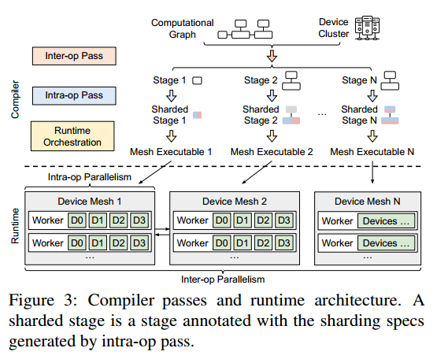

each stage is first compiled as a parallel executable on its located mesh. A runtime orchestration pass is invoked to fulfill the communication requirement between two adjacent stages that require communication between the two meshes they locate on. The runtime orchestration pass then generates static instructions specific to each mesh according to the pipeline-parallel schedule and invokes the execution on all meshes

Alpa要求开发人员使用Python装饰器@parallelize来注释要并行化的函数. Upon the first call to train_step(), Alpa traces the whole function to get the model IR, invokes the compilation, and converts the function to a parallel version.

# Intra-Operator Parallelism

（多个算子对应多个设备）

Alpa adopts the SPMD-style intra-op parallelism[31, 57] which partitions operators evenly across devices and executes the same instructions on all devices, as per the fact that devices within a single mesh have equivalent compute capability（？）. 这种SPMD风格显著减少了操作内并行计划的空间（？）;同时，它方便地表达和统一了许多重要的方法，如数据并行、ZeRO、Megatron-LM的算子并行以及它们的组合. Alpa将问题形式化为整数线性规划(ILP)，并表明它可以有效地解决具有数万个算子的计算图。

a matrix multiplication Ci j = ∑k AikBk j corresponds to a three-level for-loop. To parallelize it, we can parallelize the loop i, loop j, loop k, or combinations of them across devices, which would have different computation and communication costs, require different layouts（排布） for the input tensors, and result in output tensors with different layouts.如果输入张量不满足布局要求，则需要进行布局转换，这会带来额外的通信成本。（在计算前需要传输输入张量）

intra-op pass的目标是为每个操作符选择一个并行算法，以最小化整个图的执行时间。其次，我们正式定义了设备网格和张量的布局，并讨论了布局转换的代价。

设备网格是一组物理设备的二维逻辑视图。网格中的每个设备都具有相同的计算能力。Devices can communicate along the first mesh dimension and the second mesh dimension with different bandwidths. We assume different groups of devices along the same mesh dimension have the same communication performance（？）对于一组物理设备，可以有多个逻辑视图。物理设备和逻辑设备网格视图之间的映射通过互操作通道(§5)进行优化。

We use sharding spec to define the layout of a tensor. For an N-dimensional tensor, its sharding spec is defined as X0X1 ···Xn−1, where Xi$\in \{S,R\}$. If Xi = S, it means the i-th axis of the tensor is partitioned. Otherwise, the
i-th axis is replicated. For example, for a 2-dimensional tensor (i.e., a matrix), SR means it is row-partitioned, RS means it is column-partitioned, SS means it is both row- and column partitioned. RR means it is replicated without any partitioning.在我们定义了被划分的张量轴之后，我们必须将划分的张量轴映射到网格轴。我们只考虑二维设备网格，所以一个划分的张量轴可以映射到设备网格的第一轴或第二轴，或者两者都映射到。我们在S后面加了一个上标来表示设备分配。s0表示分区沿网格的第0轴进行，s01表示分区沿两个网格轴进行。s0r表示张量被行分割成两部分——第一部分在设备0和设备1上复制，第二部分在设备2和设备3上复制。

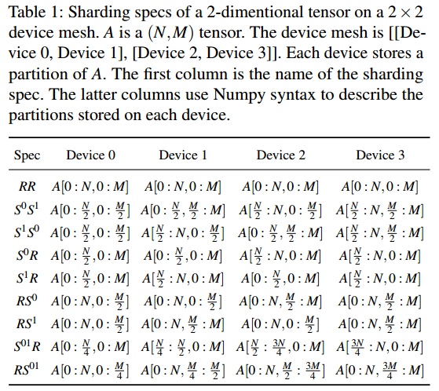

给设备分配数据，多维张量每一维都可以划分或复制，复制就把当前维复制到每个设备，划分需要看划分到设备哪一维，按选择的设备维大小平分，没有选择的设备维复制

When an input tensor of an operator does not satisfy the sharding spec of the chosen parallel algorithm for the operator, a layout conversion, namely resharding, is required, which might require cross-device communication(计算前的通信开销）

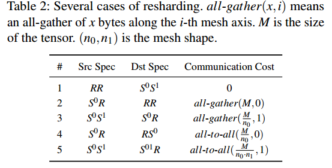

不会算

All to All 与 All Gather 相比较，区别在于：All Gather 操作中，不同节点向某一节点收集到的数据是完全相同的，而在 All to All 中，不同的节点向某一节点收集到的数据是不同的。在每个节点的发送缓冲区中，为每个节点都单独准备了一块数据。

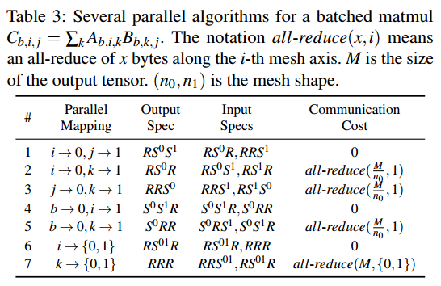

Algorithm#1 maps loop i to the 0-th mesh axis and loop j to the 1-th mesh axis, resulting in the output tensor C with a sharding spec RS0S1. As the LHS operand Ab;i;k and RHS operand Bb;k; j both have only one parallelized index, their sharding specs are written as RS0R and RRS1, respectively. In this algorithm, each device has all its required input tiles (i.e., a partition of the
tensor) stored locally to compute its output tile（？）, so there is no communication cost. In Algorithm #2 in Table 3, when the reduction loop k is parallelized, all-reduce communication is needed to aggregate the partial sum.（计算时的通信开销）

在intra-op pass中，模型图以XLA的HLO格式表示[51]，该格式将常见的DL操作符总结为不到80个基础操作符，因此我们可以手动枚举每个操作符可能的并行算法。

The total execution cost of a computational graph G = (V;E) is the sum of the compute and communication costs（计算时的通信） on all nodes v $\in$ V and the resharding costs on all edges e $\in$ E（算子间的通信）. We formulate the cost minimization as an ILP and solve it optimally with an off-the-shelf solver [18].

For node v, the number of possible parallel algorithms is $k_v$. It then has a communication cost vector $c_v$ of length $k_v$, or $c_v\in R^{k_v}$, where $c_{vi}$ is the communication cost of the i-th algorithm. Similarly, node v has a compute cost vector $d_v \in R^{k_v}$. For each node v, we define an one-hot decision vector
$s_v \in \{0,1\}^{k_v}$ to represent the algorithm it uses. $s_{vi} = 1$ means we pick the i-th algorithm for node v. For the resharding cost between node v and node u, we define a resharding cost matrix $Rvu \in R^{k_v×k_u}$, where Rvuij is the resharding cost from the output of i-th strategy of node v to the input of j-th strategyo f node u. The objective of the problem is$min_s ∑_{v\in V}s_v^T(c_v +d_v) + ∑_{(v,u)\in E}s^T_vR_{vu}s_u$ (1)

The term $s_v^TR_{vu}s_u$ in Eq. 1 is quadratic, and cannot be fed into an ILP solver. We linearize [19] the quadratic term by introducing a new decision vector $e_{vu} \in \{0,1\}^{k_v·k_u}$ which represents the resharding decision between node v and u(?)

For communication costs cv and Rvu, we compute the numbers of communicated bytes and divide them by the mesh dimension bandwidth to get the costs(时间).For compute costs dv, we set all of them as zero following the same motivation in [55].对于像matmul这样的重操作符，我们不允许重复计算。所有的并行算法总是将工作平均分配到所有的设备上，因此同一运算符的所有并行算法具有相同的算法复杂度;对于轻量级操作符，如元素操作符，我们允许对它们进行复制计算，但它们的计算成本可以忽略不计。

To simplify the graph, we merge computationally-trivial operators, such as element-wise operators, transpose, and reduction, into one of their operands and propagate the sharding spec from the operand.（？） This greatly reduces the number of nodes in the graph, thus the ILP problem size. We do a breath-first-search and compute the depth of each node. The node is merged to the deepest operand（合并算子到最深的上一个算子？）

 we also apply a set of post-ILP communication optimizations, such as replacing all-reduce with reduce-scatter and all-gather, whenever applicable, because the latter reduces the number of replicated tensors and corresponding computations, while keeping the communication volume the same. This achieves the effect of weight update sharding [56] or ZeRO optimizer [44].

# Inter-Operator Parallelism

开发了将模型和设备集群切片为阶段网格对的方法。我们的优化目标是最小化整个计算图的端到端管道执行延迟。jointly considering device mesh assignment and the existence of varying intra-op parallelism plans on each stage.

Assume the computational graph contains a sequence of operators following the topology order of the graph, notated as o1;:::;oK; where the inputs of an operator ok are from operators o1;:::;ok−1。slice the operators into S stages。we assign each stage si to a submesh of size ni ×mi, sliced from a computer cluster that contains devices, notated as the cluster mesh with shape N × M. Let $t_i = t_{intra}(s_i,Mesh(n_i,m_i))$ be the latency of executing stage si on a submesh of ni ×mi, minimized by the ILP and reported
back by the intra-op pass.

$T^{*} = min_{s_1,:::,s_S;(n_1,m_1),:::,(n_S,m_S)}\{∑_{i=1}^St_i + (B−1)· max_{1≤j≤S}
\{t_j\}\}$(2)

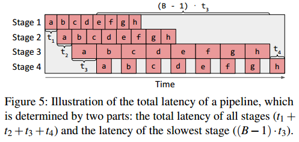

对于图的前向传递中的操作符，我们希望将其与其对应的后向操作符在同一子网格上进行匹配。由于反向传播通常在前向传播期间使用类似的张量集，这有效地减少了将前向传递时生成的所需张量获取到后向传递的通信量。（前向和后向相似）

需要切片子网格(n1;m1);:::;(nS;mS)来完全覆盖N × M集群网格-我们不浪费任何计算设备资源。

we reduce the available submesh shapes into two options: (1) one-dimensional submeshes of sizes (1,1),(1,2),(1,4):::(1,$2^m$) and (2) two-dimensional submeshes of size (2,M),(3,M),:::,(N,M) that fully use the second dimension of the cluster mesh (i.e., on a GPU cluster, this means using all compute devices in each physical machine).

To assign physical devices in the cluster to the resulting submeshes find by the DP algorithm, we enumerate by assigning devices to larger submeshes first and then to smaller ones.（先生成大的子设备网？） When there are multiple pipeline stages with the same submesh shape, we tend to put neighboring pipeline stages closer on the device mesh to reduce communication latency.

The set of submesh shapes (n,m) excluded by the assumption is with n > 1 and m < M, which we observe lead to inferior results, since an alternative submesh with shape ($n^{'}$,M) where $n^{'}$ · M = n · m has more devices that can communicate with high bandwidth.（长变小宽变大，每一行是一台机器，放在一台机器上带宽大，用来解释为什么简化成上面的两种情况） With this reduction, we only need to ensure that $\sum^S_{i=1} n_i·m_i = N · M$.

The DP first enumerates the second term $t_{max} = max_{1≤j≤S} t_j$ and minimizes the first term $t_{total}(t_{max}) = ∑_{1≤i≤S}t_i$ for each different $t_{max}$. 

使用函数$F(s,k,d;t_{max})$表示将操作$o_k$到$o_K$(最大编号)分成s个阶段并将它们放在d个设备上以使每个阶段的延迟小于$t_{max}$时的最小总延迟。F(0,K +1,0;tmax) = 0

$F(s, k,d;t_{max})= min_{k≤i≤K,n_s·m_s≤d}\{t_{intra}((o_k,:::,o_i),Mesh(n_s,m_s),s)+F(s−1,i+1,d −n_s·m_s;t_{max})| t_{intra}((o_k,:::,o_i),Mesh(n_s,m_s),s) ≤ t_{max}\}$

$T^{*}(tmax) = min_s\{F(s,0,N · M;tmax)\}+ (B−1)·tmax$（应该是1开始）

The value of $t_{intra}((ok,:::,oi),Mesh(ns;ms),s)$ is determined by the intra-op pass. It is the lowest latency of executing the subgraph (ok;:::;oi) on mesh Mesh(ns;ms) with s subsequent stages.（应该是s-1？）

列举所有满足nl·ml = ns·ms的逻辑器件网格形状(nl;ml)的可能选择。（为什么要不同的形状）For each choice, we query the intra-op pass with subgraph (ok;:::;oi), logical mesh (nl,ml), and other intra-op options as inputs and get an intra-op plan. We then compile the subgraph with this plan and all other low-level compiler optimizations (e.g., fusion, memory planning) to get an executable for precise profiling. The executable is profiled in order to get the stage latency ($t_l$) and the memory required on each device to run the stage ($mem_{stage}$) and to store the intermediate activations ($mem_{act}$). We check whether the required memory fits the device memory ($mem_{device}$) according to the chosen pipeline execution schedule.（计算时延和内存）We pick the logical mesh shape that minimizes tl and fits into the device memory. If none of them fits, we set tintra = $\infty$

Alpa旨在将计算图的算子分组到不同的管道阶段，同时假设输入的微批大小相同。In addition, Alpa optimizes the mesh shape in the
DP algorithm for each pipeline stage in inter-op parallelism(选择时延低的逻辑形状？)

DP复杂性对于超过10,000个操作符的大型计算图是不可行的。

early pruning：

我们从小到大枚举tmax。当B·tmax大于当前最佳T *时，我们立即停止枚举。(?)

during enumeration of tmax; we only evaluate a choice of tmax if it is sufficiently larger than the last tmax (by at least e). This allows the gap between the solution found by the DP algorithm and the global optima to be at most B· e.（不会离最优解太远？） We empirically choose e = $10^{−6}$s, and we find that the solution output by our algorithm is the same as the real optimal solution (e = 0) for all our evaluated settings.

operator clustering：

计算图中的许多运算符不是计算密集型的(例如，ReLU)，并且这些运算符的确切位置对总执行时间的影响很小。我们开发了另一种DP算法[4]，将相邻算子聚到一起。 We cluster the operators (o1;:::;oK) into a series of layers (l1;:::;lL); where L 远小于 K: The goal of the algorithm is to merge two types of operators: (1) those that do not call for much computation but lengthen the computational graph and (2) neighboring operators that may cause substantial communication if put on different device meshes. 

We define function G(k,r) as the minimum of maximal amount of data received by a single layer when clustering operators (o1;:::;ok) into r layers. Note that G has the following optimal substructure:（一层接收的最大数据的最优解）

$G(k,r)= min_{1≤i≤k}\{max\{G(i−1,r −1),C(i, k)\}|FLOP(oi;:::;ok) ≤(1+\delta )FLOP_{total}/L\}$

C(i; k) denotes the total size of inputs of (oi; :::;ok) received from (o1;:::;oi−1) （从r-1层传到r层的数据量）and FLOPtotal = FLOP(o1;:::;oK) is the total FLOP of the whole computational graph. each clustered layer’s FLOP is within 1+$\delta$ times of the average FLOP per layer while minimizing the communication.（每一层计算要接近L分之一）对于通信成本相同的方案，we choose the one with the most uniform structure by also minimizing the variance of per-layer FLOP。（减少计算量差异）我们根据图中设备的数量和重算子的数量选择一个小的L。我们发现L的不同选择对最终性能的影响并不显著。

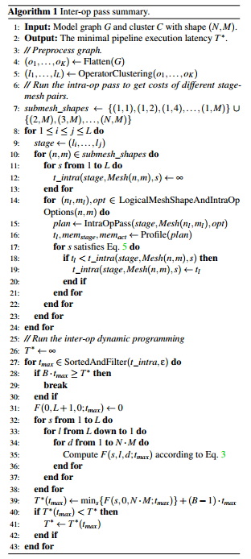

# Parallelism Orchestration

After stages, device meshes, and their assignments are decided, at the intra-op level, Alpa compiles each stage against its assigned device mesh, respecting the intra-op parallelism plan output by the ILP solver. The compilation depends on XLA [51] and GSPMD [57], and generates parallel executables for each stage-mesh pair. When needed, the compilation automatically inserts collective communication primitives
(see §4) to address the within-mesh communication caused by intra-op parallelism.

At the inter-op level, Alpa implements an additional parallelism orchestration pass to address the cross-mesh communication between stages, and generate static instructions for inter-op parallel execution.

Existing manual systems, such as Megatron-LM [45, 49], constrain all pipeline stages to have the same degrees of data and tensor model parallelism, so the communication between pipeline stages is trivially realized by P2P send/recv between corresponded devices。In Alpa, the device meshes holding two adjacent stages might have different mesh shapes, and the tensor to communicate between two stages might have different sharding specs (Fig. 6b and Fig. 6c). We call this communication pattern as cross-mesh resharding, which is a many-to-many multicast problem.（跨mesh要调整tensor分布）

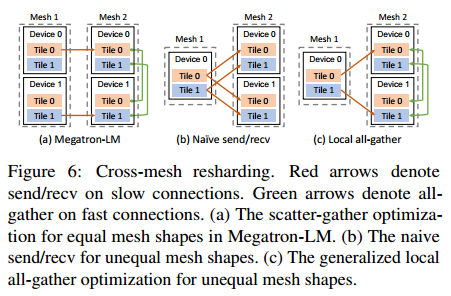

Given the sharding specs of the tensor on the sender and receiver mesh, Alpa generates a communication plan to address cross-mesh sharding in two iterations.

In the first iteration, Alpa calculates the correspondences between tensor partitions (a.k.a. tiles) on the source and destination mesh. Based on that, it generates P2P send/recv primitives between the source
devices and destination devices to fulfill the communication.（先单独发给需要的设备） It then takes a second iteration to identify opportunities where the destination tensor has a replication in its sharding spec. In this case, the tensor only needs to be transferred once between two meshes, then exchanged via all-gather across the devices on the destination mesh using its higher bandwidth
(Fig. 6) – it rewrites send/recv generated at the first iteration into all-gather to avoid repeated communication.(重复数据只跨mesh传一次，mesh内传递重复数据)

Since each stage has different sets of operators and may locate on meshes with different shapes, in contrast to many SPMD pipeline-parallel training systems [40,57], Alpa adopts an MPMD-style runtime to orchestrate the inter-op parallel execution – Alpa generates distinct static execution instructions for each device mesh.

According to a userselected pipeline schedule, Alpa uses a driver process to generate the instructions in advance and dispatches the whole instruction lists to each worker before execution, avoiding driver-worker coordination overheads during runtime.

# Limitations and Discussion

与现有的手工结合数据、操作员和管道并行性的工作(如3D并行性[45]和PTD-P[40])相比，Alpa对操作间和操作内并行性的分层视图显著提高了它们的三个主要灵活性:(1)管道阶段可以包含不均匀数量的操作员或层;(2) Alpa中的管道阶段可以映射到不同形状的设备网格;(3) within each stage, the data and operator parallelism configuration is customized non-uniformly on an operator-by-operator basis.

总之，它们允许Alpa统一所有现有的模型并行方法，并推广到具有更多异构性的模型体系结构和集群设置。

由于跨阶段的通信成本本质上很小，因此Alpa没有对不同阶段之间的通信成本进行建模。实际上，在DP或ILP中建模成本是可能的，但需要枚举更多的op内通道和DP状态。（没有考虑跨阶段的通信成本）

互操作通道目前有一个超参数:微批B的数量，我们目前的配方没有优化，但可以通过枚举进行搜索。

互操作通道(inter-op pass)用静态线性调度来模拟管道并行，而不考虑更多的动态调度，例如，在不同设备上并行化计算图中的不同分支。（？）

Alpa does not optimize for the best scheme of overlapping computation and communication; （没有考虑覆盖）Alpa can only handle static computational graphs with all tensor shapes known at compilation time.（必须在编译时知道tensor大小）

# Evaluation

Alpa is implemented using about 16K LoC in Python and 6K LoC in C++. Alpa uses Jax as the frontend and XLA as the backend. The compiler passes are implemented on Jax’s and XLA’s intermediate representation (i.e., Jaxpr and HLO). For the distributed runtime, we use Ray [37] actor to implement the device mesh worker, XLA runtime for executing computation, and NCCL [41] for communication

## End-to-End Performance

对于每个模型，我们将Alpa与强基线进行比较。我们使用Megatron-LM v2[40]作为GPT-3的基线系统。Megatron-LM是最先进的系统，用于在gpu上训练基于均匀变压器的lm。它结合了数据并行性、管道并行性和手动设计的操作符并行性(稍后表示为TMP)。这些技术的组合由三个整数参数控制，这些参数指定分配给每种技术的并行度。我们按照他们论文的指导对三个参数进行网格搜索，并报告最佳配置的结果。

我们使用DeepSpeed[45]作为MoE的基线。DeepSpeed为gpu上的MoE训练提供了最先进的实现。它结合了MoE层的手工运算符并行性和基于零的[44]数据并行性。这些技术的组合由几个整数参数控制，这些参数指定分配给每种技术的并行度。我们还对它们进行网格搜索，并报告最佳结果。DeepSpeed在GPT-3上的性能与威震天- lm相似或更差，因此我们在GPT-3上跳过它。

对于大型的Wide-ResNet，没有专门的系统或人工设计的方案。我们使用Alpa构建了一个基线“PP-DP”，其空间仅由数据并行和管道并行组成，模拟了PipeDream[38]和Dapple[17]的并行空间。

For all models, we also include the results of using Alpa with only one of intra- and inter-operator parallelism, which mimics the performance of some other auto-parallel systems.(只使用一种并行)

we measure training throughput in our evaluation. We evaluate weak scaling of the system when increasing the model size along with the number of GPUs. we use the aggregated PFLOPS of the whole cluster as the metric. We measure it by running a few batches with dummy data after proper warmup. 

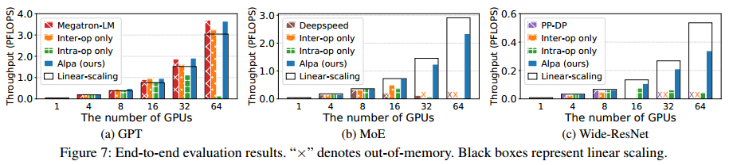

manual plan with the best grid-searched parameters enables Megatron-LM to achieve super-linear weak scaling on GPT-3.  Alpa automatically generates execution plans and even achieves slightly better scaling on several settings. “Intra-op only” performs poorly on >16 GPUs because even the best plan has to communicate tensors heavily on cross-node connections, making communication a bottleneck. Surprisingly, “Inter-op only” performs well and maintains linear scaling on up to 64 GPUs.

in Megatron-LM, the best manual plan has TMP as 1, except in rare settings, such as fitting the 39B model on 64 GPUs, where pipeline parallelism alone is unable to fit the model (stage) in GPU memory(TMP是怎么占用内存的？); meanwhile, data parallelism is maximized whenever memory allows. In practice, gradient accumulation (GA) is turned on to achieve a desired global batch size (e.g., 1024 in our setting). GA amortizes the communication of data parallelism and reduces the bubbles of pipeline parallelism, but the communication of TMP grows linearly with GA steps, which puts TMP disadvantaged.（GA是什么？）

Alpa-generated plan closely resembles the best-performed ones in Megatron-LM, featuring (1) evenly-sized stages, (2) partitioning along the batch dimension in stages when memory is not stressed, but
along non-batch dimensions when memory is stressed. （和内存有什么关系？）One key difference between our plan and the manual plan is that Alpa also partitions the weight update operations when data
parallelism exists, which contributes to the slight performance improvement over Megatron-LM. This attributes to the fact that Alpa, as a generic compiler system, can compose a wide range of parallelism approaches, while Megatron-LM, for now, misses weight update sharding support.

DeepSpeed adopts a manual operator parallelism plan for MoE models, developed by GShard [31], called
expert parallelism, which uses a simple rule: it partitions the expert axis for the operators in MoE layers, but switches back to data parallelism for non-expert layers.（专家层算子并行，其他层数据并行）This expert parallelism is then combined with ZeRO data parallelism and TMP.（TMP和专家并行有什么区别？TMP是通用的算子并行？）DeepSpeed的专门实现不包括任何操作符间并行方法

Therefore, Deepspeed only maintains a good performance within a node (≤ 8 GPUs) on this cluster. “Intra-op only” fails to scale across multiple nodes due to the same reason. “Inter-op only” runs out of memory on 32 GPUs and 64 GPUs because it is not easy to equally slice the model when the number of GPUs is larger than the number of layers of the model. The imbalanced slicing makes some memoryintensive stages run out of memory.（一个GPU放不下一层？）Alpa在16个gpu上保持线性缩放，并且可以很好地扩展到64个gpu。与DeepSpeed相比，Alpa在2个节点上实现了3.5倍的加速，在4个节点上实现了9.7倍的加速。

Wide-ResNet has a more heterogeneous architecture. As the data batch is forwarded through layers, the size of the activation tensor shrinks while the size of the weight tensor inflates. This leads to an imbalanced distribution of memory usage and compute intensity across layers. For this kind of model, it is difficult, if not impossible, to manually design a plan. However, Alpa still achieves a scalable performance on 32 GPUs with 80% scaling. The baselines “PP-DP” and “Inter-op only” run out of memory when training large models, because they cannot partition weights to reduce the memory usage, and it is difficult to construct memory-balanced stages for them. “Intra-only” requires a lot of communication on slow connections, so it cannot scale across multiple nodes.

## Intra-Op Parallelism Ablation Study

We compare our ILP-based solution against alternatives such as ZeRO optimizer and rule-based partitioning strategies.

disable pipeline parallelism and gradient accumulation to control variables.

“Data” is vanilla data parallelism. “ZeRO-2” [44] is a memory-efficient version of data parallelism which partitions gradients and optimizer states. “ZeRO-3” [44] additionally partitions parameters on top of “ZeRO-2”. “Heuristic” uses a rule combined with the sharding propagation in GSPMD. It marks the largest dimension of every input tensor as partitioned and runs sharding propagation to get the sharding specs for all nodes in the graph. “(?)

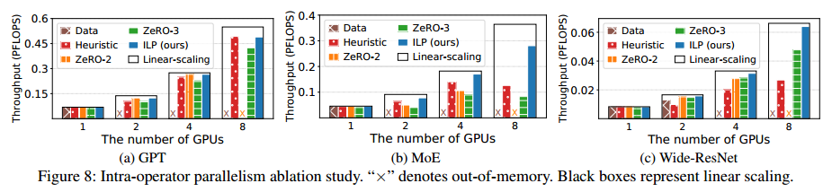

“Data” runs out of memory quickly and cannot train large models. “ZeRO-2” and “ZeRO-3” resolve the memory problem of data parallelism, but they do not optimize for communication as they always communicate the gradients. When the gradients are much larger than activations, their performance degenerates. “Heuristic” solves the memory issue by partitioning all tensors, but can be slowed down by larger communication. “Auto-sharding” performs best in all cases and maintains a near-linear scaling,
because it figures out the correct partition plan that always minimizes the communication overhead.

## Inter-Op Parallelism Ablation Study

我们用“DP”来表示我们的算法。

We compare our DP algorithm with two rule-based algorithms. “Equal operator” disables our DP-based operator clustering but assigns the same number of operators to each cluster.(每个stage的算子数量相同) “Equal layer” restricts our DP algorithm to use the same number of layers for all stages（每个stage包含的模型层数相同）

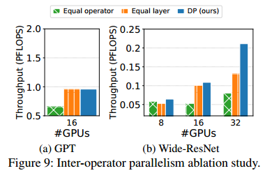

“DP” always outperforms “Equal operator”. This is because “Equal operator” merges operator that should be put onto different device meshes. Alpa’s algorithm can cluster operators based on the communication
cost and computation balance. Whether “DP” can outperform “Equal layer” depends on the model architecture. On homogeneous models like GPT, the solution of our DP algorithm uses the same number of layers for all stages, so “Equal layer” performs the same as “DP”. On Wide-ResNet, the optimal solution can assign different layers to different stages, so “Equal layer” is worse than the full flexible DP algorithm. For
Wide-ResNet on 32 GPUs, our algorithm outperforms “Equal operator” and “Equal layer” by 2.6× and 1.6×, respectively.

## Compilation Time

The compilation time is a single run of the full Alg. 1 with a provided number of microbatches B.Alpa可以很好地扩展到大型模型或大型集群，因为编译时间随着模型的大小和集群中gpu的数量线性增长

Most of the time is spent on enumerating stage-mesh pairs and profiling them. For the compilation part, we accelerate it by compiling different stages in parallel with distributed workers. For profiling, we accelerate it using a simple cost model built at the XLA instruction level, which estimates the cost of matrix multiplication and communication primitives with a piece-wise linear model. With these optimizations, the compilation and search for a model take at most several hours, which is acceptable as it is much shorter than the actual training time, which can take several weeks

## Cross-Mesh Resharding

We evaluate our generalized local all-gather optimization for cross-mesh resharding between meshes with different shapes on Wide-ResNet, “signal send/recv” is a synthetic case where we only send 1 signal byte between stages, which can be seen as the upper bound of the performance.(?) “w/o local all-gather” disables our local all-gather optimization and uses only send/recv. “w/ local all-gather” enables our local all-gather optimization to move more communication from slow connections to fast local connections,
which brings 2.0× speedup on 32 GPUs.

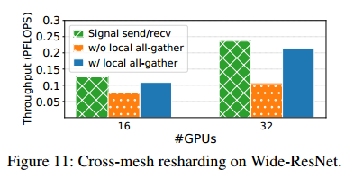

# Related Work

Systems for data-parallel training. 

Systems for model-parallel training. SPMD用于操作内并行，MPMD用于操作间并行。

Automatic search for model-parallel plans.

训练大规模模型的技术。除了并行化之外，还有其他用于训练大规模模型的补充技术，例如内存优化，通信压缩[6,53]和低精度训练[35]。

# Conclusion

把dp,tp,pp分为intra和inter，不同粒度有不同通信需求，与集群结构匹配

3个编译pass，给定模型和集群环境，inter-op compilation用dp划分模型和集群，intra-op compilation用ILP为每个操作符选择一个并行算法，runtime orchestration pass实现相邻stage的通信

intra：二维设备逻辑网络，给设备分配数据，多维张量每一维都可以划分或复制，复制就把当前维复制到每个设备，划分需要看划分到设备哪一维，按选择的设备维大小平分，没有选择的设备维复制。所有设备算一个算子，算完算下一个。不同算子可能需要不同的并行算法，可能需要不同的数据分布，调整数据分布，有额外的通信。计算时也有通信。

inter：找stage划分和设备划分

orchestration：跨mesh要调整tensor分布，重复数据只跨mesh传一次，mesh内传递重复数据

# Proof of Submesh Shape Covering

我们总能找到一个完全覆盖集群网格(N;M)的解决方案，我们在§5.2中选择的子网格形状:(1)形状为(1;1);(1;2);(1;4):::(1;$2^m$ = M)的一维子网格;(2)形状为(2;M);(3;M);:::;(N;M)的二维子网格。

对于子网格形状列表(n1;m1);:::(nS;mS);如果∑i ni·mi = N·M且每个(ni;mi)满足(1)ni = 1和mi = 2 pi是2的幂或(2)mi = M;那么我们就可以用这些子网格形状覆盖$M=2^m$的整个(N;M)网格。

首先将第二种类型的子网格放入完整的网格中。在这种情况下，因为mi = M;这些子网格可以覆盖全网格的整个第二次元。在将所有第二类子网格放入网格后，我们将问题简化为形状为(N;M)的聚类网格与形状为(1;$2^{p_1}$);:::;(1; $2^{p_s}$)的子网格拟合。（不用考虑第二种情况，只考虑用第一种填满）

$2^{p_1} +···+2^{p_S} = N·2^m$

我们对m进行归纳:当m = 1;我们有所有的PI = 0，因此所有的子网格的形状是(1;1);这意味着所有的子网格都可以覆盖整个网格。假设对所有m = 1;2;:::;k−1。当m = k时，请注意，在这种情况下，$p_i$= 0的子网格数应该是偶数，因为否则Eq. 7的左侧将是奇数，而右侧始终是偶数。然后我们可以将形状为pi = 0的所有子网格分成对，并将每对子网格形成(1;2)网格。经过这个变换，我们有$p_i$> 0;所以可以把所有PI和m减1，并简化为m = k−1的情况。

# .

Nan Du, Yanping Huang, Andrew M. Dai, Simon Tong,
Dmitry Lepikhin, Yuanzhong Xu, Maxim Krikun, Yanqi
Zhou, Adams Wei Yu, Orhan Firat, Barret Zoph, Liam
Fedus, Maarten Bosma, Zongwei Zhou, Tao Wang,
Yu Emma Wang, Kellie Webster, Marie Pellat, Kevin
Robinson, Kathy Meier-Hellstern, Toju Duke, Lucas
Dixon, Kun Zhang, Quoc V Le, Yonghui Wu, Zhifeng
Chen, and Claire Cui. Glam: Efficient scaling of language models with mixture-of-experts, 2021.

Dmitry Lepikhin, HyoukJoong Lee, Yuanzhong Xu, Dehao Chen, Orhan Firat, Yanping Huang, Maxim Krikun,
Noam Shazeer, and Zhifeng Chen. Gshard: Scaling giant models with conditional computation and automatic
sharding. arXiv preprint arXiv:2006.16668, 2020.

Deepak Narayanan, Mohammad Shoeybi, Jared Casper,
Patrick LeGresley, Mostofa Patwary, Vijay Korthikanti,
Dmitri Vainbrand, Prethvi Kashinkunti, Julie Bernauer,
Bryan Catanzaro, et al. Efficient large-scale language
model training on gpu clusters using megatron-lm. In
Proceedings of the International Conference for High
Performance Computing, Networking, Storage and Analysis, pages 1–15, 2021.

Deepak Narayanan, Mohammad Shoeybi, Jared Casper,
Patrick LeGresley, Mostofa Patwary, Vijay Korthikanti,
Dmitri Vainbrand, Prethvi Kashinkunti, Julie Bernauer,
Bryan Catanzaro, et al. Efficient large-scale language
model training on gpu clusters using megatron-lm. In
Proceedings of the International Conference for High
Performance Computing, Networking, Storage and Analysis, pages 1–15, 2021.

Mohammad Shoeybi, Mostofa Patwary, Raul Puri,
Patrick LeGresley, Jared Casper, and Bryan Catanzaro.
Megatron-lm: Training multi-billion parameter language models using model parallelism. arXiv preprint
arXiv:1909.08053, 2019.

Samyam Rajbhandari, Jeff Rasley, Olatunji Ruwase, and
Yuxiong He. Zero: Memory optimizations toward training trillion parameter models. In SC20: International
Conference for High Performance Computing, Networking, Storage and Analysis, pages 1–16. IEEE, 2020

Yuanzhong Xu, HyoukJoong Lee, Dehao Chen, Hongjun
Choi, Blake Hechtman, and Shibo Wang. Automatic
cross-replica sharding of weight update in data-parallel
training. arXiv preprint arXiv:2004.13336, 2020.

Yanping Huang, Youlong Cheng, Ankur Bapna, Orhan
Firat, Dehao Chen, Mia Chen, HyoukJoong Lee, Jiquan
Ngiam, Quoc V Le, Yonghui Wu, et al. Gpipe: Effi-
cient training of giant neural networks using pipeline
parallelism. Advances in neural information processing
systems, 32:103–112, 2019.

Deepak Narayanan, Aaron Harlap, Amar Phanishayee,
Vivek Seshadri, Nikhil R Devanur, Gregory R Ganger,
Phillip B Gibbons, and Matei Zaharia. Pipedream: generalized pipeline parallelism for dnn training. In Proceedings of the 27th ACM Symposium on Operating
Systems Principles, pages 1–15, 2019.

Shiqing Fan, Yi Rong, Chen Meng, Zongyan Cao, Siyu
Wang, Zhen Zheng, Chuan Wu, Guoping Long, Jun
Yang, Lixue Xia, et al. Dapple: A pipelined data parallel approach for training large models. In Proceedings
of the 26th ACM SIGPLAN Symposium on Principles
and Practice of Parallel Programming, pages 431–445,
2021

Deepak Narayanan, Amar Phanishayee, Kaiyu Shi, Xie
Chen, and Matei Zaharia. Memory-efficient pipelineparallel dnn training. In International Conference on
Machine Learning, pages 7937–7947. PMLR, 2021

Jeff Rasley, Samyam Rajbhandari, Olatunji Ruwase, and
Yuxiong He. Deepspeed: System optimizations enable
training deep learning models with over 100 billion parameters. In Proceedings of the 26th ACM SIGKDD
International Conference on Knowledge Discovery &
Data Mining, pages 3505–3506, 2020.

Samyam Rajbhandari, Jeff Rasley, Olatunji Ruwase, and
Yuxiong He. Zero: Memory optimizations toward training trillion parameter models. In SC20: International
Conference for High Performance Computing, Networking, Storage and Analysis, pages 1–16. IEEE, 2020.

Deepak Narayanan, Aaron Harlap, Amar Phanishayee,
Vivek Seshadri, Nikhil R Devanur, Gregory R Ganger,
Phillip B Gibbons, and Matei Zaharia. Pipedream: generalized pipeline parallelism for dnn training. In Proceedings of the 27th ACM Symposium on Operating
Systems Principles, pages 1–15, 2019.

Shiqing Fan, Yi Rong, Chen Meng, Zongyan Cao, Siyu
Wang, Zhen Zheng, Chuan Wu, Guoping Long, Jun
Yang, Lixue Xia, et al. Dapple: A pipelined data parallel approach for training large models. In Proceedings
of the 26th ACM SIGPLAN Symposium on Principles
and Practice of Parallel Programming, pages 431–445,
2021.