# ABSTRACT

本文提出了一种新的管道并行方案Chimera，该方案结合了双向管道，可以有效地训练大规模模型。Chimera是一种同步方法，因此不会损失准确性，这比异步方法更有利于收敛。与最新的同步管道方法相比，Chimera减少了高达50%的气泡数量;得益于双向管道的复杂调度，Chimera具有更平衡的激活内存消耗。Chimera将最先进的同步和异步管道方法的训练吞吐量提高了1.16x-2.34倍。

#  INTRODUCTION

大型模型必须分布在许多加速器中，通常是数百个加速器，以适应主存储器。深度神经网络由分层架构组成，因此可以以两种方式进行分布:(1)一层的算子可以通过称为算子并行的方法在多个加速器上分割，或者(2)模型可以通过称为管道并行的方法逐层分布[5]。

运算符并行性需要对每个基本Transformer层的输出激活进行两次allreduce[35,53]操作。另一方面，使用分层模型划分，管道并行性只需要点对点通信来在管道阶段之间传输输出激活，每个阶段包含一组连续的层。

管道并行通常比运算符并行具有更低的通信成本。然而，管道并行会受到气泡或权重过时的影响(参见第2节)，这是本工作旨在解决的问题。总的来说，对于分布大型深度学习模型，算子并行性和管道并行性是相互正交和互补的。

管道并行性不是微不足道的:反向传播算法需要“记住”在向前传递期间计算的输出激活作为向后传递的输入(参见图2)。这为管道中的每个加速器创建了截然不同的内存需求，即使每个加速器具有相同的计算负载。具体来说，对于最近提出的一些管道方法，如DAPPLE[16]、PipeDream[38]和PipeDream2BW[39]，深度为𝐷的管道的第一个加速器必须存储𝐷这样的激活，而最后一个加速器需要存储一个激活。This does not only lead to lower memory utilization in the
later pipeline stages (and only 50% overall), it also leads to reduced
performance because the micro-batch size has to be chosen to fit
the first accelerator in the pipeline. This imbalance can be alleviated
by restricting the number of micro-batches that are simultaneously
allowed in the pipeline.(跟number有关系吗，不是D决定？) However, this introduces bubbles and limits the overall system utilization

为了保持整体训练同步，而不依赖于陈旧的权重

与最先进的方法相同的峰值激活内存消耗，具有更平衡的内存消耗的额外好处

实现了每次迭代1.38x-2.34x的端到端性能改进

# BACKGROUND AND RELATED WORK

为了将训练过程扩展到并行机器，数据并行化[20,33,49,60]是常用的方法，其中将minibatch划分为多个工作人员，每个工作人员维护整个模型的副本。纯粹的数据并行性可能不适用于这些大型模型，因为它要么受到整个模型跨工作者同步梯度导致的低效率的影响，要么模型太大而无法装入设备。

The mini-batch is partitioned into multiple micro-batches, that are
pipelined across the stages to increase the resources utilization. to achieve good convergence accuracy the mini-batch size
is usually not very large.

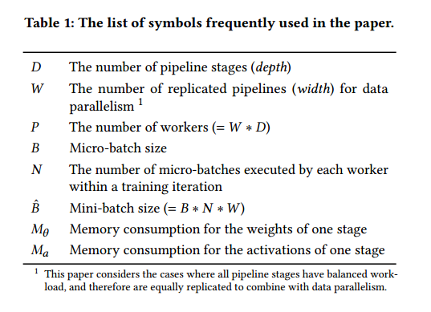

For better convergence quality, synchronous approaches synchronize the gradients and flush the pipeline at the end of each training iteration, as shown in Figure 2. 因此，同步方法会导致管道气泡。(异步也有)GPipe [26] injects 𝑁 micro-batches into the pipeline
concurrently; DAPPLE [16] uses the One-Forward-One-Backward
(1F1B [38, 39]) schedule with periodic flushes。Both GPipe and DAPPLE incur 2(𝐷-1) bubbles (i.e., 𝐷-1 bubbles in the forward passes
and 𝐷-1 bubbles in the backward passes). （一个stage的空闲）In contrast, Chimera (this
work) incurs 𝐷-2 bubbles (i.e., 𝐷/2-1 bubbles in the forward passes
and 𝐷/2-1 bubbles in the backward passes), which is about 50%
reduction compared with DAPPLE and GPipe.  We define the bubble
ratio as the bubble overhead divided by the overall runtime of the
pipeline. In practice, the workload of a backward pass is about two
times of a forward pass, which leads to 𝐷/2-1 bubbles（？） in the middle of the pipeline for Chimera (bubble ratio = (𝐷-2)/(3𝑁/2+𝐷-2)),
as shown in Figure 2. We will discuss how to remove the middle
bubbles in Section 3.5 (bubble ratio = (𝐷-2)/(2𝑁+𝐷-2)).

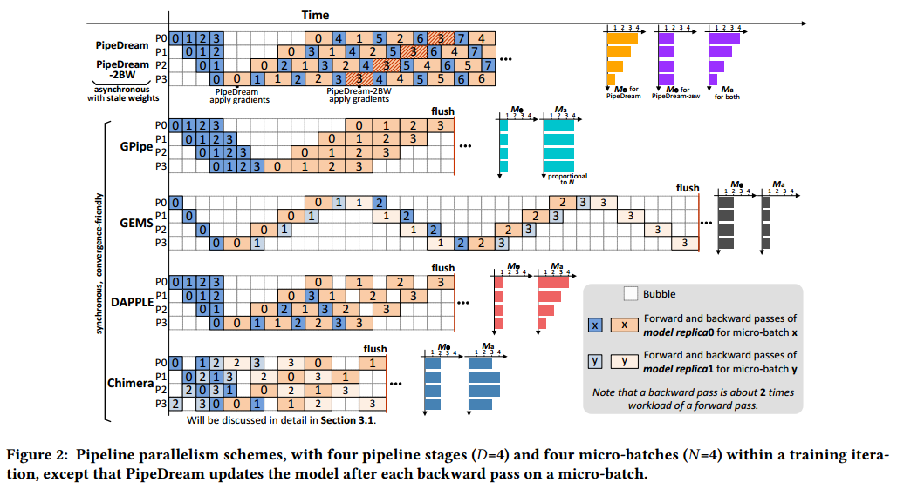

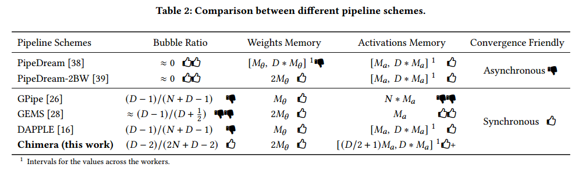

Although the bubble ratio of GPipe and DAPPLE decreases as 𝑁 (the
number of micro-batches executed by each worker within a training
iteration) increases, a large enough 𝑁 (𝑁>=4𝐷 as suggested in [26])
usually cannot be obtained without hurting the efficiency for the
following three reasons: (1) There is usually an empirical maximum
ˆ𝐵 (mini-batch size) for a model, exceeding which would compromise
model convergence [5, 12, 58–60]. (2) An increase of 𝑁 implies an
decrease of 𝐵 (micro-batch size) for a given 𝐵ˆ. However, modern
accelerators require a large enough 𝐵 to achieve high computational
efficiency. (3) Scaling to large-scale machines by combining with
data parallelism (which has proven to be an effective way [16, 39])
would decrease 𝑁 for a given 𝐵ˆ

GEMS [28] is a memory-efficient pipeline approach which schedules micro-batches among two model replicas. Since GEMS is mainly
designed for small ˆ𝐵 and has at most two active micro-batches at the same time, its bubble ratio is much higher than the other approaches and cannot be alleviated by a larger 𝑁.(气泡怎么算？)

异步方法(如PipeDream[38]和PipeDream- 2bw[39])没有定期的管道刷新，因此它们没有气泡问题，但具有陈旧的权重。

内存开销主要来自两个方面:权重参数（包括梯度？）和激活(向后传递中计算梯度所需的正向传递的中间结果)。对于GPipe和DAPPLE，每个工人维护一个管道级的权重。对于GEMS和Chimera(默认设置)，每个worker维护两个管道阶段的权重，因为在两个方向上有两个管道。

PipeDream在每次反向传递一个微批后更新模型。因此，为了确保向前传递和向后传递之间的权重版本一致性，它需要在一个worker上存储最多𝐷版本的权重，这与纯数据并行性具有相同的内存成本。通过使用梯度累积(N>=𝐷)，PipeDream-2BW将要存储的权重版本的数量减少到2。（？）

GEMS在管道开始时只注入一个微批，因此存储了一个微批上的正向传递的激活。由于GPipe将些微批(为了充分利用管道)并发地注入到管道中，所以活动的内存消耗是与些微批成比例的，这不能很好地扩展到大的微批。使用经典的(或变体的)1F1B[38,39]计划，PipeDream, PipeDream- 2bw, DAPPLE和Chimera在管道开始时注入最多𝐷微批，(异步用mini比较合适，同步用micro)可以很好地扩展到大的小批。通过计算图2中Chimera的每个worker上注入的微批的数量，我们可以观察到，与PipeDream、PipeDream- 2bw和DAPPLE相比，Chimera在worker之间具有更平衡的激活内存消耗(一般分析见表2)，因此具有更好的内存资源利用率。请注意，激活内存消耗可以使用激活重计算技术来减少[11]，但这是以大约1/3的计算开销为代价的[16,39]。

我们的管道方法与ZeRO正交。

通过定期的管道刷新，同步方法确保在训练迭代中的所有阶段和所有微批中使用相同版本的权重，而不会引入过时。从算法的角度来看，同步方法相当于标准且经过充分证明的小批量SGD，因此可以保证收敛性。为了消除管道刷新，异步方法要么积极地导致向前传递和向后传递之间的权重版本不匹配(如AMPNet[19]和pipeare[57])，要么保守地在确保权重版本一致性的同时引入过时的权重(如PipeDream- 2bw和PipeDream)。虽然它们在经验上显示出令人满意的收敛结果，但其通用性缺乏证明。最近的研究[4,34,36,37,52]发现，异步训练算法可能导致较低的收敛性能.

# THE SCHEME OF CHIMERA

## Bidirectional Pipelines

Chimera的关键思想是将两个不同方向的管道(我们分别称之为向下和向上的管道)组合在一起。Here we assume there are 𝐷 micro-batches executed by each
worker within a training iteration, namely 𝑁=𝐷, which is the minimum to keep all the stages active.如何扩展到𝐷以上的微批(也就是说，对于二进制数据集>𝐷)将在3.5节中讨论。两个管道中平分了微批(假设是偶数)。 给定偶数个阶段𝐷(这在实践中很容易满足)，可以保证在合并期间没有冲突(即，每个worker上最多有一个微批占用相同的时间槽)。我们可以看到，在向前和向后的传递中，气泡的数量分别减少到𝐷/2-1。(2-1=1)

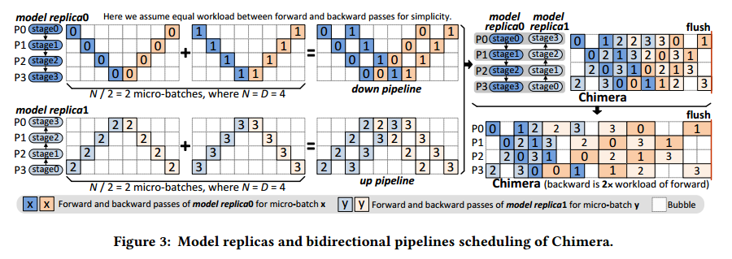

For the models which have to use a small ˆ𝐵 to guarantee convergence, there maybe less than 𝐷 micro-batches in a training
iteration (i.e., 𝑁<𝐷). Chimera also supports the cases of 𝑁<𝐷 by
simply partitioning the 𝑁 micro-batches among the two pipelines
as evenly as possible, with an extreme case that 𝑁=1 where only
one micro-batch runs on a single pipeline.Chimera可以概括为组合两个以上的管道(将在3.6节中讨论)，这进一步减少了气泡并平衡了激活内存消耗，但代价是更高的通信开销和内存消耗权重。

##  Communication Scheme

由于Chimera将双向管道组合在一起，因此在下一次训练迭代之前，可以使用集体通信(即allreduce)来同步跨阶段副本的权重梯度。

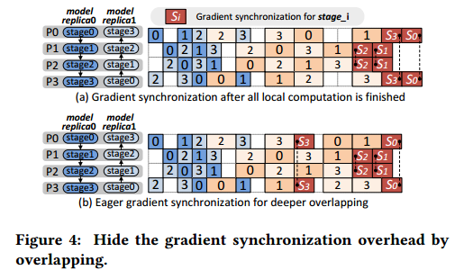

以图4(b)中的P0和P3为例，这两名工人分别完成微批3和微批1的逆向传递后，阶段3的权重梯度计算完成;因此，P0和P3可以在完成后立即使用非阻塞集合[23,25]启动异步allreduce来同步stage3的梯度，并在所有本地计算完成后调用等待操作以确保allreduce完成。However, unlike P0
and P3, we choose not to conduct eager gradient synchronization
for stage2 (a middle stage) on P1 and P2, since there is no bubble
from the completion of stage2’s gradients to the end of local computation.尽管异步通信可能在计算进行时继续进行，但它可能会导致额外的开销(初始化，线程化等[24])，这可能会延长管道的关键路径并危及整体性能。

## Hybrid of Pipeline and Data Parallelism

Chimera支持管道并行和数据并行的混合。Chimera的双向管道被复制𝑊次，以达到𝑊·𝐷工人的规模。当扩展到配备高性能互联网络的并行机(如Infiniband[50]、Cray Aries[2]或Slingshot[48]、NVLink[18])时，混合并行通常比纯管道并行获得更好的性能[16,39]。这是因为纯管道并行在管道中有𝑊·𝐷阶段，而混合并行有𝐷阶段(少𝑊倍)，这有助于减少阶段之间的p2p通信开销，并增加每个阶段的计算工作量。虽然混合并行导致了阶段副本之间的梯度同步，但它的开销可以通过前面提到的高性能互连网络来减轻。然而，随着𝑊的增加(𝐷的减少)，管道阶段变得粗糙，直到某一点，增加的梯度同步开销不能被减少的p2p通信开销平摊。因此，找到最佳位置以实现最佳性能非常重要。but the number of processes participating in the gradient synchronization increases by 𝑊 times.

## Configuration Selection Based on Performance Modelling
Given the mini-batch size ˆ𝐵 and the number of workers 𝑃, the
configuration of 𝐵,𝑊 , and 𝐷 largely affects the training throughput

Larger micro-batch size (𝐵) usually improves the computational
efficiency of the accelerators. Since Chimera greatly alleviates the
bubble problem, it greedily chooses to use the maximum microbatch size fitting in the device memory. 与现有的同步管道算法需要考虑气泡和计算效率之间的权衡相比，Chimera的贪心策略显著减少了调谐空间。

To select the best configuration of 𝑊 and 𝐷, we build a performance model to predict the runtime of a single training iteration
(represented by 𝑇 ) for each available configuration. For the computation overhead, we measure the runtime of the forward pass on a
single pipeline stage (represented by 𝐹𝑡
) using micro benchmarks.
The runtime of backward pass (represented by 𝐵𝑡
) is modelled as
two times of the forward pass if no activation recomputation is
used, and three times otherwise. We define the critical path as a
series of pipeline stages with dependency that determine the overall
computation overhead of a single training iteration. An example of
critical path is shown in Figure 6. Let 𝐶𝑓 and 𝐶𝑏 denote the number
of forward passes and backward passes on the critical path of the
pipeline, respectively. For the example shown in Figure 6, 𝐶𝑓 =6 and
𝐶𝑏=10. The total computation overhead is 𝐹𝑡𝐶𝑓 +𝐵𝑡𝐶𝑏.

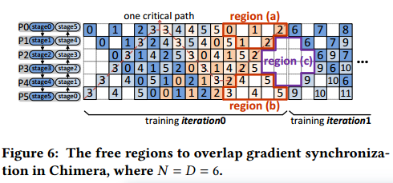

To model the communication overhead, we assume bidirectional
and direct point-to-point communication between the compute
nodes, and use the classic Latency-Bandwidth (𝛼 − 𝛽) cost model.The cost of sending a message of size 𝐿 is 𝛼 + 𝛽𝐿, where both 𝛼
(latency) and 𝛽 (the transfer time per word) can be measured using
micro benchmarks.Chimera has two
types of communication: p2p communication (𝐶𝑜𝑚𝑚𝑝2𝑝 ) between
stages and allreduce (𝐶𝑜𝑚𝑚𝑎𝑙𝑙𝑟𝑒𝑑𝑢𝑐𝑒 ) for gradient synchronization.

𝐶𝑜𝑚𝑚𝑝2𝑝 can be simply modelled by the 𝛼 −𝛽 cost model. The total
p2p communication cost is (𝐶𝑓 +𝐶𝑏
)𝐶𝑜𝑚𝑚𝑝2𝑝 . Note that𝐶𝑜𝑚𝑚𝑝2𝑝
can be partially overlapped by the intermediate bubbles if there are
any, but to simplify the model we do not consider that effect.(1f1b是可以隐藏的，这个不行)

For 𝐶𝑜𝑚𝑚𝑎𝑙𝑙𝑟𝑒𝑑𝑢𝑐𝑒 , we assume its implementation makes use of
Rabenseifner’s algorithm [42, 53], whose cost is
𝐶𝑜𝑚𝑚𝑎𝑙𝑙𝑟𝑒𝑑𝑢𝑐𝑒 = 2(𝑙𝑜$𝑔_2$𝑟)𝛼 + 2(𝑟 − 1)𝛽𝐿/𝑟
where 𝐿 is the size of gradients to be synchronized and 𝑟 is the number of stage replicas. Rabenseifner的算法达到了基于主机的allreduce的带宽项的下界，因此最适合大型模型。

Figure 6 shows an example of the free regions (i.e., exceeding
which will increase the total runtime) utilized in Chimera to overlap the gradient synchronization. Regions (a) and (b) can be utilized to
overlap the gradient synchronization for the first stage replica
(the one with a larger stage ID), and region (c) can be utilized
to overlap the gradient synchronization for both stage replicas.(只有stage0不能重叠更新)

Let 𝐶𝑜𝑚𝑚𝑢𝑛𝑜𝑣𝑒𝑟𝑙𝑎𝑝𝑝𝑒𝑑 (𝑖) represent the portion of 𝐶𝑜𝑚𝑚𝑎𝑙𝑙𝑟𝑒𝑑𝑢𝑐𝑒
which can not be overlapped by the free regions on worker 𝑖, and
then the max of 𝐶𝑜𝑚𝑚𝑢𝑛𝑜𝑣𝑒𝑟𝑙𝑎𝑝𝑝𝑒𝑑 (𝑖) among the 𝐷 workers contributes to the total runtime.

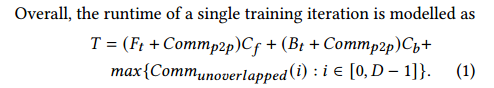

## Scale to More Micro-Batches

For a large ˆ𝐵, there may be more than 𝐷 micro-batches in a training
iteration for each worker (i.e., 𝑁>𝐷), especially when the compute
resources are limited. To scale to a large ˆ𝐵, we first choose the
maximum 𝐵 with 𝐷 micro-batches to saturate the device memory,
and schedule these 𝐷 micro-batches using bidirectional pipelines as
discussed previously. Then, we use the schedule of 𝐷 micro-batches
as a basic scheduling unit, and scale to a large ˆ𝐵 by concatenating 𝐾
(𝐾=𝑁/𝐷 and 𝑁=𝐵ˆ/𝑊 /𝐵) basic units together. 

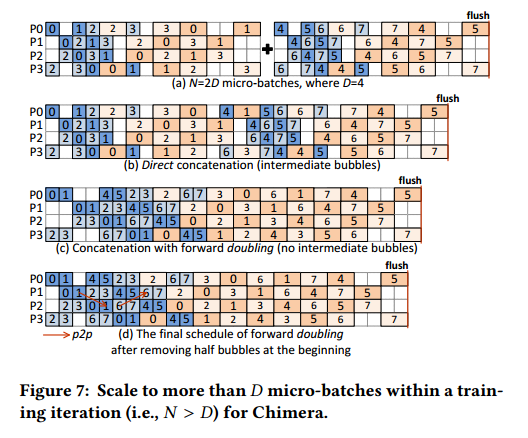

我们提出了三种方法来连接多个基本单元。(1)直接拼接，如图7(b)所示。在第一个基本单元末尾的气泡可以被第二个基本单元开头的向前通道所占据。如果向后传递与向前传递具有相同的工作负载，则可以无缝地连接基本单元。但是，后传的工作量是前传的两倍左右，导致中间气泡的产生。

To remove the intermediate bubbles of direct concatenation, we
propose (2) forward doubling (shown in Figure 7(d)) and (3) backward halving,（图里没有） in which the key idea is to equalize the workloads of
forward and backward passes. 

In forward doubling, we increase the
number of micro-batches for each forward pass to two, and then
concatenate the two consecutive chunks of backward passes, each
of which has only one micro-batch, as shown in Figure 7(c).然后，我们对计划进行微调，以在管道开始时去除50%的气泡，如图7(d)所示。前向加倍消除了中间气泡，但它会导致两倍的激活内存消耗，因此可能超过设备内存容量。我们采用激活重计算来减少内存开销。重新计算增加了向后传递的工作量，但由于两个微批的输出，正向传递中的p2p通信开销也增加了一倍;因此，我们仍然认为向前传递(两个微批)和向后传递(一个微批和重新计算)具有大致相等的工作负载。. Forward doubling prefers large models in which even 𝐵=1 exceeds the device memory capacity, since
in such case activation recomputation must be used

For smaller
models which has a larger 𝐵, we propose to use backward halving,
which uses the same schedule as forward doubling, except that
rather than executing two micro-batches in the forward pass but to
halve the micro-batch size of the backward pass. 后向减半不会增加激活内存(因此没有激活重新计算)，但由于使用了一个次最大的变量，它可能会降低计算效率。

要在三种方法中选择最好的方法并不是先验的，而是依赖于经验结果。请注意，前向加倍和后向减半都有𝐷-2气泡(前向传球为𝐷/2-1，后向传球为𝐷/2-1)，如图7(d)所示，与DAPPLE和GPipe相比减少了约50%。

For 𝐾>2,（𝐾=𝑁/𝐷） we use the schedule of 2𝐷 micro-batches as a
basic scheduling unit (as shown in Figure 7(c)) for forward doubling and backward halving, and concatenate ⌊𝑘/2⌋ basic units and the
residual 𝐷 micro-batches if 𝐾 is odd.

前向加倍和后向减半的另一个好处是，与经典的1F1B调度相比，它们有更多的空间来重叠p2p通信(在前向传递中)[38,39]。. In
Figure 7(d), taking the forward pass on micro-batch 1 as an example,
the p2p communication from P1 to P2 can be overlapped by the
intermediate forward pass computation, while for 1F1B there may
be not enough computation to overlap p2p communication

## Generalize to More than Two Pipelines

Chimera can
be generalized to combine more than two pipelines for an even
number of pipeline stages (i.e., 𝐷 is even).For 𝑄=𝐷/2, let 𝐹 denote
the set of all the divisors of 𝑄, including 1 and 𝑄 itself. For any
𝑓 ∈ 𝐹 , we can generate a scheme for Chimera, which combines 𝑓
down pipelines and 𝑓 up pipelines together and each pipeline has
𝐷/(2𝑓) micro-batches scheduled by the 1F1B strategy.图8给出了Chimera将四个管道与八个阶段(即𝐷=8和𝑓=2)组合在一起的示例。. For the down pipeline 𝑖 (𝑖 ∈ [0, 𝑓 −1]), the
𝐷 stages are mapped to the 𝐷 workers in turn with the first stage
(i.e., stage0) being mapped to the worker𝑖 ∗ (𝐷/𝑓 ). 

For example, for
the down pipeline1 in Figure 8, stages [0,1,2,3,4,5,6,7] are mapped to
workers [4,5,6,7,0,1,2,3], respectively. For the 𝑓 up pipelines, the 𝐷
stages are mapped to the 𝐷 workers in a completely reverse order of
the corresponding down pipeline. (3,2,1,0,7,6,5,4)It can be easily demonstrated that the schedules of the 2𝑓 pipelines can be overlaid without conflict.

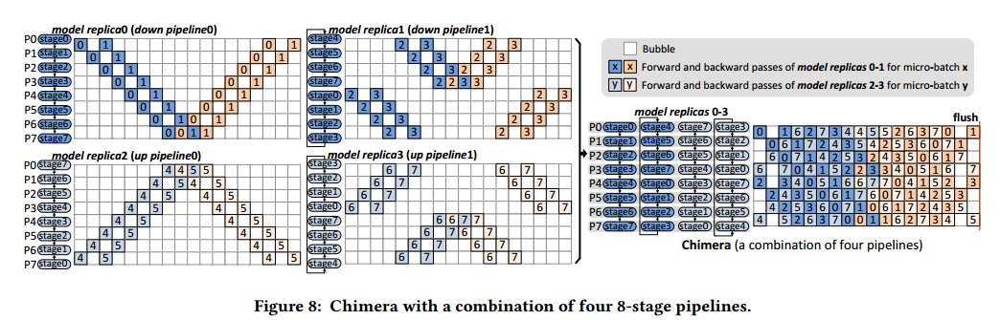

对于任何𝑓∈， Chimera都可以使用章节3.5中讨论的方法扩展到更多的微批(即，操作操作(操作操作))。For a given 𝑓 ,
Chimera incurs 2(𝐷/𝑓 /2-1) bubbles, but has to maintain 2𝑓 model
replicas and synchronize the gradients of 2𝑓 stages on each worker.𝑓的值越大，气泡越少(激活内存消耗越平衡)，但是梯度同步开销和权重内存消耗也越高。当𝑓=𝑄时，Chimera降级为纯数据并行。4.4节的实证结果表明，𝑓>1很少会给用于评价的模型带来更多的性能效益。因此，𝑓=1(即两个管道的组合)是本文中Chimera的默认设置，除非另有说明。

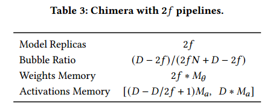

# EXPERIMENTAL EVALUATION

我们评估表2中列出的方案的性能，其中涵盖了最先进的技术。For a fair comparison, all schemes
are implemented in PyTorch [41] with GLOO [15] distributed backend for both the point-to-point (p2p) communication between
pipeline stages and gradient synchronization (allreduce) across the
stage replicas, and GPU devices are utilized for acceleration. Although NCCL [40] backend of PyTorch performs better for allreduce across GPU nodes (with GPUDirect RDMA), it does not support
p2p communication. 同时使用NCCL进行梯度同步和GLOO进行p2p是失败的，这在PipeDream中也观察到了[38]。由于Chimera是一种不影响收敛精度的同步方法，因此我们将重点放在训练吞吐量比较上。

## Memory Consumption

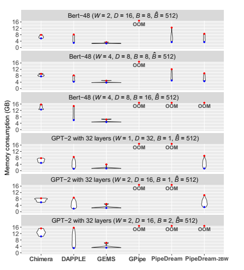

由于GPipe一次注入所有微批，它的高激活内存成本导致所有配置中的OOM(内存溢出)。PipeDream-2BW将隐藏的权重版本减少到2。(?)然而，对于语言模型来说，第一阶段通常比其他阶段有更多的权重，因为它包含了一个额外的嵌入层。此外，PipeDream-2BW和DAPPLE的管道调度决定了第一个worker上的激活内存消耗是最高的。这种双重不平衡导致第一个worker通常具有PipeDream-2BW和DAPPLE的内存消耗峰值。由于PipeDream-2BW隐藏了两个版本的权重，随着管道阶段变得粗糙，它会产生OOM。相比之下，Chimera的双向管道调度决定了它具有更均衡的内存消耗，如图9所示，这与表2中的分析一致。由于在第一个(也是最后一个)工人上发生的激活内存成本最低(参见图2)，因此第一阶段的过多权重可以在Chimera中平摊。尽管Chimera维护两个模型副本，但对于图9中6个配置中的4个，它的峰值内存消耗仍然比DAPPLE(最先进的同步方法，它维护模型的一个副本)要低一些。尽管GEMS在所有方法中实现了最低(并且平衡)的内存消耗，但这是以丢失并行性为代价的。总的来说，Chimera在峰值内存消耗方面与最先进的技术相当，在工作人员之间的使用更加平衡。

## Parallel Scalability

我们首先找到了每种方法的最佳配置，并比较了它们在弱缩放测试中的最佳性能。

Performance Optimization Space for the Baselines.

. Given the
mini-batch size ˆ𝐵 and the number of workers 𝑃, the best configuration of 𝐵 (micro-batch size), 𝐷 ( pipeline stages), and 𝑊 (the
number of replicated pipelines) is not obvious a priori because
of the trade-offs (i.e., computational efficiency and bubbles, allreduce and p2p communication overhead). 我们搜索参数的空间(𝑊，𝐷，和B(2的幂))，以找到每个基线的最佳性能。

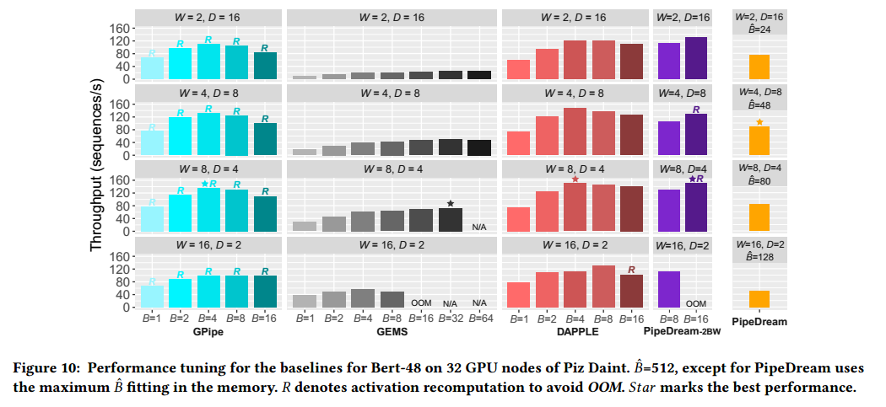

For synchronous baselines (such as GPipe and DAPPLE), the
value of 𝐵 affects both computational efficiency and the bubble ratio. Asynchronous baselines (PipeDream-2BW and PipeDream) always prefer the maximum 𝐵 fitting in the device memory, since
there is no bubble problem for them.由于PipeDream的频繁梯度同步会导致高allreduce开销，因此它的最佳性能是通过更深的管道实现的. PipeDream-
2BW scales to large ˆ𝐵 by accumulating the gradients for more than
𝐷 micro-batches (i.e., 𝑁>=𝐷), and its best performance is achieved
by (𝑊 =8, 𝐷=4, 𝐵=16) with activation recomputation.

Performance Modelling of Chimera. 

我们首先评估了在3.2节中讨论的不同梯度同步策略下嵌合体的性能。

We use eager-sync to denote eager synchronization also conducted for the middle stages, and
eager-sync-opt to denote eager synchronization not conducted for
the middle stages.图12中的结果显示，与eager-sync相比，eager-sync-opt实现了更高的吞吐量(例如，64个节点上的吞吐量为1.09倍)。

Comparison with the Best Performance.

奇美拉有两大优势:(1)奇美拉气泡比低;(2)受益于均衡的内存消耗(如4.1节所述)，具有𝐷=32的Chimera适合不需要激活重新计算的设备内存，而除了GEMS之外的所有其他方法都需要重新计算。Chimera优于PipeDream-2BW的主要原因是不需要重新计算，优于GPipe和DAPPLE的主要原因是气泡更少，不需要重新计算。以512个节点为基准，在GPT-2弱尺度下，Chimera在2048个节点上实现了91.4%的并行效率，证明了Chimera所采用的通信方案的效率。

Chimera在训练吞吐量方面与PipeDream-2BW(最新的异步方法)相当，但由于Chimera中没有陈旧的权重，因此更加收敛友好

# CONCLUSION

与最先进的管道方法相比，Chimera在管道效率、内存成本和收敛友好性之间取得了最好的平衡。Chimera显著提高了训练吞吐量。

两条流水线，一个顺序一个逆序

扩展micro数量（平衡前后向时间），扩展流水线数量（stage-worker映射）

dp